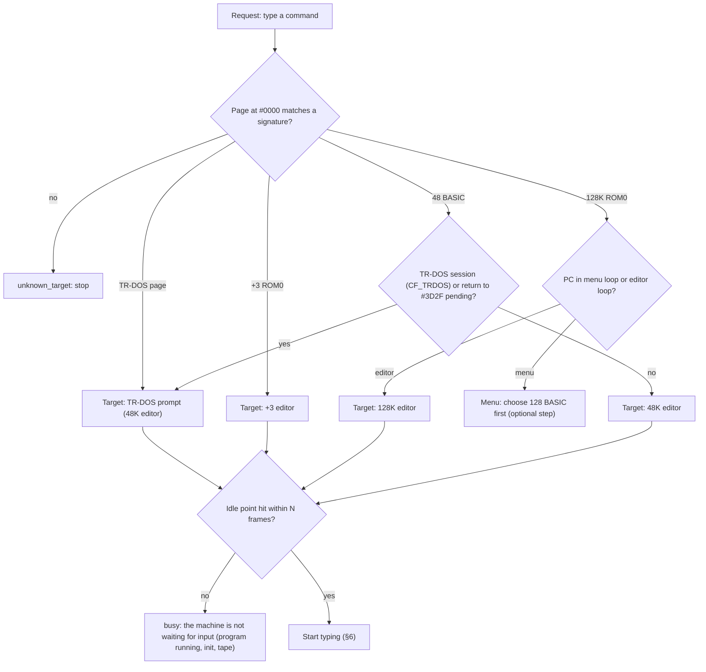
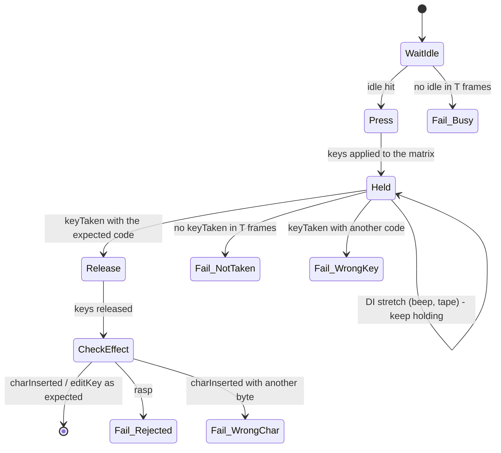
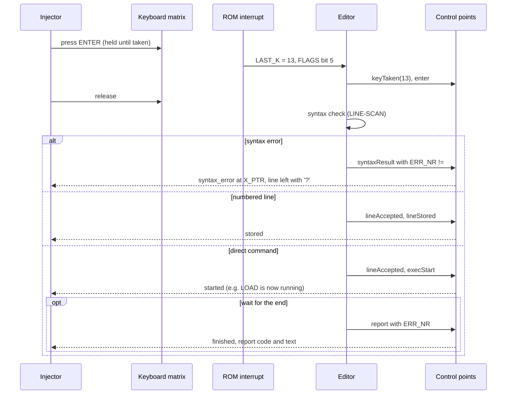

# Verified command input: watch the ROM, not the clock

**Date:** 2026-09-27 · **Status:** implemented 2026-09-28 (48K, 128K, +3 and TR-DOS editors) · **Code:** `romcontrolpoints.*`, `editormonitor.*`,
`zxkeydecoder.*`, `commandtyper.*` (this folder); WebAPI `basic/run`, `keyboard/type`
(`tokenized`); CLI `basic run` / `basic inject`

## 1. The problem in one paragraph

Today we type a command and hope. Keys go in with fixed frame gaps, and `basic/run` reports
success without checking anything. On 27.09.2026 this gave `LET OAD "` on a 48K, an empty
128K editor with "success", a lost second quote in `""`, and keys that vanished while the
ROM was beeping with interrupts off. The fix is to stop guessing: put breakpoints on known ROM
addresses ("control points") and follow what the ROM actually does with every key. Each
step waits for proof that the previous one happened. If the proof does not come, or the ROM
reports an error, we stop and say exactly what went wrong.

## 2. Terms

| Term | Meaning |
|:--|:--|
| Editor | The ROM code that reads keys and builds the command line: the 48K editor, the 128K editor, the +3 editor. TR-DOS's `A>` prompt uses the 48K editor. |
| Control point | A ROM address whose execution means a known event: "waiting for a key", "key taken", "syntax error". |
| Cyclogram | The time-ordered list of control points hit while a command is typed, each with frame, T-state and register values. It is the proof of what happened. |
| LAST_K, FLAGS | System variables `$5C08` and `$5C3B`. The ROM's interrupt stores a new key code in LAST_K and sets FLAGS bit 5; the editor clears the bit when it takes the key. |
| Token | 48K BASIC stores a keyword (`LOAD`) as one byte (`$EF`). The 48K editor inserts the token directly; the 128K editor stores letters and turns them into tokens at ENTER. |
| K, L, E modes | The 48K cursor mode. In K mode a letter key gives a keyword (J = LOAD); in L mode it gives a letter; E mode gives the extended keywords. |
| DI | Interrupts disabled. The keyboard is only scanned in the interrupt, so a key pressed and released entirely inside a DI stretch (a beep, tape loading) is never seen. |

## 3. Rules

1. **Identify before typing.** Type only into an editor we have recognised by its ROM bytes
   and by the running code. An unknown ROM, a game, a menu we did not ask for: stop with
   `unknown_target`. Never write into memory "just in case".
2. **One key at a time, with proof.** A key stays pressed until the ROM has taken it
   (control point "key taken" with the expected code), then it is released. The next key
   waits until the editor is idle again.
3. **Check what the editor did with it.** The inserted character or token must be the one
   we meant. A mismatch (for example LET instead of LOAD) stops typing at once.
4. **ENTER has three outcomes, all observed:** syntax error (the line stays, marked with
   `?`), line stored (it had a line number), command started. Each is a separate control
   point; the result names which one happened.
5. **Time limits are in emulated frames,** never wall-clock time, and every wait is "until
   the event, at most N frames". Tests run frames synchronously.
6. **Failure is loud.** The API returns a failure with a reason and the cyclogram, never
   `success` without proof.

## 4. Control points

All addresses were checked against the bytes of the ROM files in `data/rom` (skoolkit
disassembly and a byte-prefix check, 2026-09-27). A breakpoint is set only on a ROM page that
has been identified by its signature (§4.5), because several ROMs share `#0000-#3FFF`.

### 4.1 48K editor

Same addresses in the Sinclair 48K ROM, the 128K ROM1, the Pentagon 48K ROM and the
+2A/+3 ROM3 (v4.0 and v4.1). Scorpion's 48K page is the same except `#0008`, which is
patched; use `#0053` there.

| Point | Address | Meaning | Registers |
|:--|:--|:--|:--|
| `idle` | `#15DE` (WAIT-KEY loop) | Editor waiting for a key | |
| `keyTaken` | `#10B5` (KEY-INPUT) | FLAGS bit 5 was set; the key is being taken | LAST_K = code |
| `keyAccepted` | `#0F3B` (ED-LOOP+3) | Back from WAIT-KEY | A = final code |
| `click` | `#0F44` | Key click (every key, DI inside BEEPER) | |
| `charInserted` | `#0F8B` (ADD-CHAR, `LD (DE),A`) | Character or token inserted | A = byte |
| `editKey` | `#0F92` (ED-KEYS) | Editing key (cursor, delete) | A = code |
| `rasp` | `#1091` (ED-ERROR) and `#116F` (ED-FULL) | Key rejected / line full, rasp beep (DI) | |
| `enter` | `#1024` (ED-ENTER) | ENTER pressed | |
| `syntaxResult` | `#12B7` | After LINE-SCAN: ERR_NR = `#FF` means OK, anything else is a syntax error | ERR_NR, X_PTR |
| `lineAccepted` | `#12CF` (MAIN-3) | Syntax OK | E_LINE |
| `lineStored` | `#155D` (MAIN-ADD) | Line had a number, stored in the program | |
| `execStart` | `#1300` (CALL LINE-RUN) | Direct command starts | |
| `errorRaised` | `#0055` (ERROR-3) | Runtime error | L = code |
| `report` | `#1303` (MAIN-4) | Command finished or stopped; report = ERR_NR + 1 | ERR_NR |

### 4.2 128K editor (ROM0; Spectrum 128, Pentagon, Scorpion)

| Point | Address | Meaning |
|:--|:--|:--|
| `init` | `#3371` | Editor/tokeniser set-up (LDIR); keys pressed now are lost |
| `idle` | `#3683` | Waiting for a key (spin on FLAGS bit 5, needs EI) |
| `reportShown` | `#25E3` | A report is on screen: the same spin, but in a loop of its own. It leaves FLAGS bit 5 set, so the key that clears the report is taken again at `#3689` once the editor has redrawn an empty line |
| `keyTaken` | `#3689` | A = LAST_K |
| `keyAccepted` | `#265C` | A = accepted code |
| `charInserted` | `#28F1` | Character key handled (the 128K editor keeps letters) |
| `rasp` | `#26E7` | Key rejected, error beep (DI in ROM1 BEEPER). Not `#267C`: that is `CALL NC,#26E7`, and a breakpoint fires on a conditional call whether or not it is taken |
| `enter` | `#2944` | ENTER pressed |
| `syntaxResult` | `#02BA` | End of the syntax pass of every line, direct or numbered (also the parser's error vector): ERR_NR = `#FF` OK. `#2CD1` is only on the insert path, so it is not used |
| `lineStored` | `#03F7` | Numbered line stored |
| `execStart` | `#031E` | JP to LINE-RUN |
| `report` | `#0321` | Finished or error report |

### 4.3 +3 editor (ROM0 + ROM1, v4.0 = `plus3.rom`)

The 128K editor moved to new addresses; lines are checked, stored and run by ROM1.

| ROM | Point | Address |
|:--|:--|:--|
| 0 | `idle` / `keyTaken` | `#1875` / `#187B` |
| 0 | `reportShown` | `#0693` (the 128K's `#25E3`; the redraw after the key takes about 30 frames) |
| 0 | `keyAccepted` / `charInserted` | `#0709` / `#09BC` |
| 0 | `rasp` | `#0794` (the beep; `#0729` is its `CALL NC`) |
| 0 | `enter` | `#0A0F` |
| 1 | `syntaxResult` | `#2560` (every line; `#0D9F` in ROM0 is only on the insert path) |
| 1 | `lineStored` | `#268E` |
| 1 | `execStart` / `report` | `#25C8` / `#25CB` |

The editor keeps the 128K's bank 7 workspace (`$EC0C` menu item, `$EC0D` flags, `$EC16` edit
buffer, `$F6EE`/`$F6EF` cursor), so the menu exit and the line clearing are shared. v4.1
(`plus341.rom`) moves these addresses and is not identified. Verified after the +3 paging fix
of 2026-09-28 (`#1FFD` implemented, `#7FFD` bit 4 no longer inverted).

### 4.4 TR-DOS `A>` prompt

The prompt runs the 48K editor (§4.1) through `RST 20`. The line comes back into TR-DOS at
`#3D2F`, which tells it apart from a BASIC line (MAIN-2).

| Point | Address (TR-DOS page) | Meaning |
|:--|:--|:--|
| `prompt` | `#02CB` | Command loop top (also the error-return vector) |
| `editorCall` | `#1D93` | `RST 20` into the 48K EDITOR |
| `lineBack` | `#3D2F` | Editor returned a line to TR-DOS |
| `dispatch` | `#030A` | Command lookup starts. For a keyword it first calls `#3DC8` (ACTIVATE_DRIVE): with no disk every command fails here, ERR_NR 26 |
| `found` | `#0332` | The command table search (`#0320-#032B`, 21 entries) found the command |
| `execute` | `#035F` | `JP (HL)` into the handler's execute pass (`#0358` is its syntax pass) |
| `error` | `#01D3` | Common error exit: not found (`#0325 JP C`), syntax error (`#1D2C`), a failing command |
| `syntaxError` | `#1D1A` | TR-DOS syntax error message (ERR_NR = `#0B`) |

`#0325` itself is the loop test of the search (hit on every entry), not "not a command".
Outcome rule: `found` → the command is TR-DOS's (`trdos_command`); `error` before `found` →
`trdos_rejected` with ERR_NR.

### 4.5 ROM identification signatures (offset in the 16K page)

| ROM | Signature |
|:--|:--|
| Any 48 BASIC | `#0000` = `F3 AF 11 FF FF C3`, `#0F38` = `CD D4 15` |
| Sinclair 48K | plus `#004A` = `CD BF 02` |
| 128K ROM1 | plus `#004A` = `CD 6E 38`, `#1349` = `CD 3B 3B` |
| Pentagon 48 | as 128K ROM1 but `#006D` = `28` |
| +3 ROM3 | plus `#1349` = `CD 29 3A`, "1982 Amstrad" at `#153A` |
| 128K ROM0 | `#0000` = `F3 01 2B 69`, `#3683` = `CB 6E 28 FC CB AE 3A 08 5C` (Pentagon: "TR-DO" at `#2789`) |
| +3 ROM0 v4.0 | `#0000` = `F3 01 03 6C`, `#1875` = `CB 6E 28 FC` (v4.1: `#187A`) |
| TR-DOS | `#3D00` = `00 18 2E`, `#3D2F` = `00 C9`, version text at `#0363` |

The signature is checked once when a ROM page is first seen and cached by its host pointer;
its page-specific breakpoints fire only while that page is at `#0000`.

### 4.6 Verified on the running machines (2026-09-27)

`EditorMonitor_Test` types keys through the matrix on 10 editors (48K; 128K in 48 BASIC and
128 BASIC; +3 in 48 BASIC; Pentagon and Scorpion in 48 BASIC, 128 BASIC and TR-DOS) and
checks the recorded points: character taken and inserted, direct command
(`enter → syntaxResult → [lineAccepted] → execStart → report 0 OK`), numbered line stored and
not run, syntax error flagged and nothing run, TR-DOS line handed back and dispatched.

Scorpion 48 BASIC is entered through its menu ("48 BASIC"), as a person does. A reset straight
into the 48K ROM skips the Scorpion ROM's own set-up; its error handler (RST 8 = `JP #3CFC` →
`#3C98` → service ROM) then does not come back. That was a test-setup mistake, not a machine
defect: through the menu a syntax error shows `?` and the editor carries on.

## 5. Identifying the target

"Idle point hit" is the key test that replaces every guess about readiness. It proves the
editor's own key loop is running now, not a banner left on screen by code that has moved on.

## 6. Typing one key

Every key goes through the same state machine. `T` is the frame budget (default 25 frames
for a key; ENTER has its own, §7).

What this fixes:

- **Keys lost in a DI stretch.** The key is held until the ROM takes it, not for a fixed 2
  frames. A beep that blocks the interrupt for 10 frames only delays the key.
- **Repeated keys.** The ROM ignores a repeat of the same key until it has been released for
  5 interrupts. The next press waits for `idle` and for that release time
  (`REPRESS_RELEASED_FRAMES`, already in `DebugKeyboardManager`).
- **Wrong mode.** `charInserted` carries the inserted byte. On a 48K, pressing L in K mode
  inserts LET (`#F1`) instead of the expected `L` or `LOAD` token; typing stops right there
  with `wrong_char: expected #EF (LOAD), got #F1 (LET)`.

### 6.1 Which keys to press

The plan is built per editor and checked per key by §6, so a planning mistake is caught, not
typed.

| Editor | Keywords | Letters, digits, symbols |
|:--|:--|:--|
| 48K, TR-DOS prompt | One key in the mode the keyword needs: K mode letter (J = LOAD), E mode (Caps+Symbol, then the key), Symbol Shift keywords (THEN, AND, ...). Expected byte = the token. | Plain / Caps / Symbol Shift key. Expected byte = the character. |
| 128K, +3 | Spelled letter by letter; tokenised at ENTER | Same keys; expected byte = the character |

The 48K mode is not predicted from our own history: before each keyword key the planner reads
the cursor mode the ROM is in (`MODE` `$5C41`, FLAGS bit 3, FLAGS2) and adds the mode-change
keys it needs.

## 7. ENTER and the result

For `LOAD ""` the useful "done" is `execStart` (the tape then takes over), optionally
followed by `LD-BYTES` entry (`#0556`), which proves the command reached the tape loader.

## 8. What can go wrong, and how we see it

| Symptom | Detected by | Result |
|:--|:--|:--|
| Unknown ROM / program running / menu | §5 identification, no `idle` | `unknown_target` / `busy` |
| Editor still starting (128K `#3371`) | `idle` not yet hit | waits, then `busy` after T |
| Key pressed during DI | no `keyTaken` yet | keeps holding; `not_taken` after T |
| Repeated key merged | release time rule + `keyTaken` count | cannot happen silently |
| Wrong mode (LET instead of LOAD) | `charInserted` byte | `wrong_char` with both bytes |
| Illegal key | `rasp` | `rejected` with the key |
| Line full | `rasp` from ED-FULL | `line_full` |
| Syntax error | `syntaxResult`, ERR_NR | `syntax_error` + position |
| Runtime error | `errorRaised`, `report` | `error` + report code and text |
| TR-DOS rejects the line | `error` before `found` | `trdos_rejected` + ERR_NR (26: no disk) |
| TTD replay owns input | `TimeTravelManager::OwnsInput` | `input_locked` |
| Other keys still queued | `DebugKeyboardManager::IsSequenceRunning` | `keyboard_busy` |
| Text already on the edit line | 48K: E_LINE / K_CUR; 128K: cursor row of the edit buffer | cleared with verified cursor-right / DELETE; a multi-row 128K line: `line_not_empty` |
| A report on screen (128K, +3) | `reportShown` instead of `idle` | nothing cleared: the buffer still shows the old line, but the key that clears the report redraws an empty one and is then taken as the first key |
| 128K main menu shown | `$EC0D` bit 1 | left for 128 BASIC first: cursor to item 1 (`$EC0C`), ENTER, each key verified |
| Emulator paused / stopped | `TypeAndWait` | `emulator_paused` at once (no frames, no proof) |
| No outcome in time (API) | `TypeAndWait` deadline | `timed_out`, typing aborted, keys released |
| Machine leaves the editor after ENTER | no `syntaxResult` / `execStart` / `lineStored` | `no_outcome` |

## 9. Mechanism

- **Breakpoints, not a CPU hook.** `EditorMonitor` is an analyzer (`IAnalyzer`, registered as
  `editor-input`). `Arm()` activates it: it requests one silent, page-specific execution
  breakpoint (`AnalyzerManager::requestExecutionBreakpointInPage`) per control point of every
  identified ROM page. They fire only while that page is at `#0000`, never pause and never
  reach the UI. `Disarm()` deactivates the analyzer, the breakpoints go, and the breakpoints
  feature / debug mode are switched off again if arming switched them on. Disarmed, the monitor
  costs nothing; armed, the cost is the check the debugger does for any breakpoint.
- **Frames must run with breakpoints on.** `MainLoop::RunFrame` does (the emulator thread and
  the tests); `Emulator::RunNFrames` skips breakpoints, so the typer is never driven through it.
- **Cyclogram:** events `{frame, tstate, point, rom, A, L, LAST_K, FLAGS, ERR_NR}`, a point hit
  again right after itself folded into one event with a repeat count; returned with every
  result (`"trace": true` in the WebAPI).
- **Driver:** `CommandTyper` is a state machine advanced once per frame from `MainLoop`, after
  the keyboard queue. `Request()` only stores the command; all monitor and keyboard work runs
  on the emulator thread. `TypeAndWait()` is the blocking entry for WebAPI/CLI threads.
- **Keys:** pressed and released through `DebugKeyboardManager::PressKey/ReleaseKey`, so they
  go through the TTD input journal like a person's. Nothing writes system variables or the
  edit buffer.
- **Which key:** `ZXKeyDecoder` is the ROM's KEY-SCAN / K-TEST / K-DECODE with the tables read
  from the 48 BASIC ROM page; before each key it is asked, with the live MODE / FLAGS / FLAGS2,
  which press gives the next byte.

## 10. Coverage

All frame-driven through `MainLoop::RunFrame` (no emulator thread, no wall clock), except the
one test of the threaded `TypeAndWait`. Editors: 48K; 128K, Pentagon and Scorpion in 48 BASIC
and in 128 BASIC; +3 in 48 BASIC and in +3 BASIC; Pentagon and Scorpion at the TR-DOS prompt.

| Test | What it proves |
|:--|:--|
| `ROMControlPoints_Test` (10) | every ROM page of 48K, 128K, +3, Pentagon, Scorpion, Prof ROM Scorpion, ATM 7.10, ATM3, Profi identified as expected, every control point's bytes; a changed byte makes the page unknown |
| `ZXKeyDecoder_Test` (3) | 203 presses (K, L, E modes, plain / CAPS / SYMBOL) decode exactly as the ROM does, on the Sinclair and Amstrad 48 BASIC |
| `EditorMonitor_Test` (36 run, 15 not applicable to the editor) | each point means what the table says, on all 10 editors; nothing recorded while disarmed; debug mode restored |
| `CommandTyper_Test` (62 run, 38 not applicable to the editor) | `LOAD ""` starts, `PRINT 7` reports 0 OK, repeated characters / quotes / capitals, numbered line stored, syntax error detected, `CODE` through E mode, untypable text refused, running program `busy`, TR-DOS `CAT` recognised with a disk and `trdos_rejected` (26) without |
| `CommandTyperMenu_Test` (8) | from the 128K / Pentagon / Scorpion / +3 menu, also with the highlight moved below |
| `CommandTyperThreaded_Test` (1) | `TypeAndWait` on the running emulator thread; paused → `emulator_paused` at once |
| `DebugKeyboardManagerRomEditor_Test` (20) | repeated keys and back-to-back calls on all 10 editors |

Known gaps: multi-row 128K / +3 lines, an interrupt-driven program that
polls the keyboard (typing then goes to the program, reported as `busy` / `no_effect`).

## 11. Implementation order

1. ~~Control-point tables + identification~~ — done (`romcontrolpoints.*`).
2. ~~Cyclogram~~ — done on analyzer breakpoints (`editormonitor.*`).
3. ~~Verified typing, keyword planning, ENTER outcomes~~ — done (`zxkeydecoder.*`,
   `commandtyper.*`), plus line clearing and the 128K menu.
4. ~~`basic/run`, `keyboard/type` with `tokenized`, CLI, MCP description~~ — done;
   `DebugKeyboardManager::TypeBasicCommand` removed.
5. ~~Recipes~~ — `.recipe/run/tape-fastload.md`, `manual-trdos-run.md`,
   `media/author-udi-images.md`, `_common/transports.md`.
6. ~~+3 editor~~ — done with the +3 paging fix (2026-09-28).
7. `BasicEncoder::runCommand` / `injectCommand` (memory injection, page-number state
   detection) are no longer used by the WebAPI or CLI; they remain for older tests.
