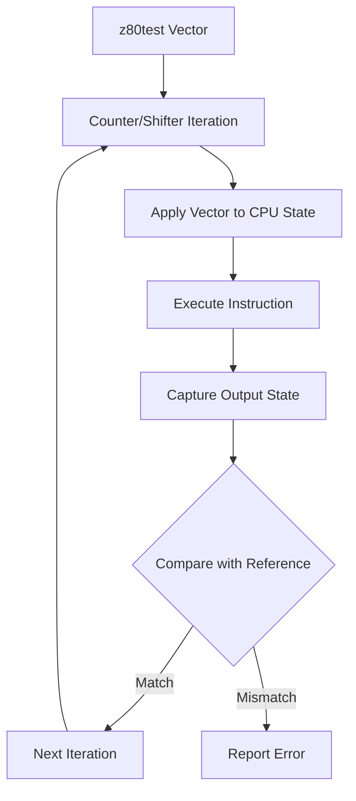
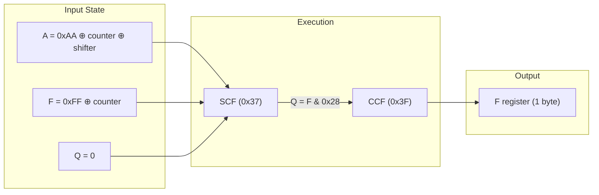
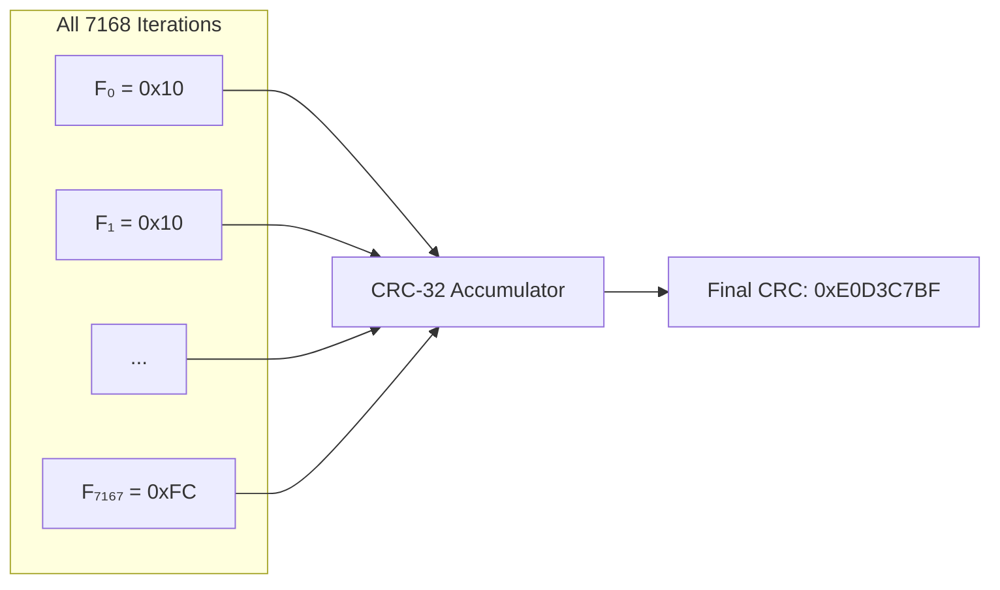

# Z80Test Case Expansion Methodology

This document describes how to transform z80test combinatorial test cases into step-by-step reference data for emulator verification. Uses the SCF+CCF test as a concrete example.

## Overview

The z80test suite uses a CRC-based verification approach where all test iterations are accumulated into a single CRC. To debug failures, we need to:
1. **Unwrap** the combinatorial iteration logic
2. **Generate** expected values for each iteration using a reference implementation
3. **Compare** emulator output against reference values step-by-step
4. **Identify** the exact iteration and state causing mismatches

## Architecture



---

## Step 1: Understand the Test Vector Structure

Each z80test test vector contains:

| Field | Description | Example (SCF+CCF) |
|-------|-------------|-------------------|
| `opcode[5]` | Instruction bytes | `{0x37, 0x3F, 0x00, 0x00, 0x00}` |
| `base` | Initial CPU state | `A=0xAA, F=0xFF, BC=0xBBCC, ...` |
| `counter` | Bits to toggle exhaustively | `F=0xFF, A=0x28` |
| `shifter` | Bits to walk through | `A=0xD7` |

### SCF+CCF Vector Definition

```cpp
// From z80test_vectors.cpp
{
    .name = "SCF+CCF",
    .opcode = {0x37, 0x3F, 0x00, 0x00, 0x00},  // SCF then CCF
    .flags_mask = 0xD7,  // S, Z, P, H, N, C (not X, Y)
    .base = {
        .mem = 0x1234, .a = 0xAA, .f = 0xFF,
        .bc = 0xBBCC, .de = 0xDDEE, .hl = 0x4411,
        .ix = 0xDD88, .iy = 0xFD77, .sp = 0xC000
    },
    .counter = {
        .opcode = {0, 0, 0, 0}, .mem = 0,
        .a = 0x28, .f = 0xFF,  // A bits 3,5; F all 8 bits
        .bc = 0, .de = 0, .hl = 0, .ix = 0, .iy = 0, .sp = 0
    },
    .shifter = {
        .opcode = {0, 0, 0, 0}, .mem = 0,
        .a = 0xD7, .f = 0x00,  // A bits 0,1,2,4,6,7
        .bc = 0, .de = 0, .hl = 0, .ix = 0, .iy = 0, .sp = 0
    },
    .crc_allflags = 0xE0D3C7BF,  // Expected CRC
    // ...
}
```

---

## Step 2: Implement the Iteration Logic

The iteration algorithm from `idea.asm` generates all test combinations:

### Python Implementation

```python
class Z80TestIterator:
    """Exact port of counter/shifter logic from idea.asm"""
    
    def __init__(self, counter_mask: bytes, shifter_mask: bytes):
        self.counter_mask = list(counter_mask)
        self.shifter_mask = list(shifter_mask)
        self.vec_size = len(counter_mask)
        
    def iterate(self):
        """Generate all (counter_state, shifter_state) pairs"""
        counter = self.counter_mask.copy()
        shifter = [0] * (self.vec_size + 1)
        shifter_pos = 0
        
        while True:
            while True:
                yield (bytes(counter), bytes(shifter[:self.vec_size]))
                if not self._next_counter(counter):
                    counter = self.counter_mask.copy()
                    break
            if not self._next_shifter(shifter, shifter_pos):
                return
            shifter_pos = self._find_shifter_pos(shifter)
    
    def _next_counter(self, counter):
        """Decrement counter, return False when wrapped"""
        for i in range(self.vec_size):
            if counter[i] == 0:
                counter[i] = self.counter_mask[i]
                continue
            counter[i] = (counter[i] - 1) & self.counter_mask[i]
            return True
        return False
```

### Iteration Count Formula

Total iterations = `(product of counter bits + 1) × (sum of shifter bits + 1)`

For SCF+CCF:
- Counter: 8 bits (F) + 2 bits (A bits 3,5) = 10 bits → 1024 combinations
- Shifter: 6 bits (A bits 0,1,2,4,6,7) = 6 bits → 7 walk positions
- Total: `1024 × 7 = 7168` iterations

---

## Step 3: Generate Reference Values

Use the Python reference implementation (`z80_reference.py`) to compute expected outputs:

```python
from z80_reference import Z80, scf, ccf

def execute_scf_ccf_reference(a_in: int, f_in: int) -> int:
    """Execute SCF+CCF and return expected F flag value"""
    s = Z80(a=a_in, f=f_in, q=0)
    scf(s)  # SCF updates flags and Q
    ccf(s)  # CCF uses Q from SCF
    return s.f
```

### Generate Reference Data File

For each of the 7168 iterations, we execute **two Z80 instructions in sequence**:



1. **SCF (Set Carry Flag)** - opcode `0x37`
2. **CCF (Complement Carry Flag)** - opcode `0x3F`

**Input parameters per iteration:**
- `A` register: derived from `0xAA XOR counter_bits XOR shifter_bits`
- `F` register (flags): derived from `0xFF XOR counter_bits`
- `Q` register: initialized to `0` (simulates fresh CPU state)

**What happens in each iteration:**

```
Iteration 0 (first): A=0x82, F=0x00, Q=0
  → Execute SCF: F becomes 0x01 (C=1), Q becomes 0x00
  → Execute CCF: F becomes 0x10 (H=1, C toggled to 0)
  → Output: F=0x10

Iteration 9: A=0x82, F=0x09, Q=0  
  → Execute SCF: F becomes 0x09 (C already 1, XY from formula)
  → Q updated to 0x08 (captures XY bits from new F)
  → Execute CCF: F becomes 0x10 (uses Q=0x08 in XY calculation)
  → Output: F=0x10

Iteration 3584 (middle): A=0x8A, F=0x80, Q=0
  → Execute SCF: F becomes 0x89 (S preserved, C=1, XY=0x08)
  → Q updated to 0x08
  → Execute CCF: F becomes 0x90 (S preserved, H=1, C=0)
  → Output: F=0x90

Iteration 7167 (last): A=0x2A, F=0xFC, Q=0
  → Execute SCF: F becomes 0xED (S,Z,P preserved, XY=0x28, C=1)
  → Q updated to 0x28
  → Execute CCF: F becomes 0xFC (S,Z,P preserved, H=1, C=0)
  → Output: F=0xFC
```

### How CRC Works in the Original Test

The original z80test doesn't compare individual outputs—it **feeds each output byte into a CRC-32 accumulator**:



**CRC Accumulation Process:**
```
CRC = 0xFFFFFFFF  (initial value)
For each iteration i = 0 to 7167:
    F_out = execute_scf_ccf(A[i], F[i])
    CRC = crc32_update(CRC, F_out)  # Feed 1 byte
Final CRC = 0xE0D3C7BF
```

**Why step-by-step comparison is necessary:**

| Approach | Pro | Con |
|----------|-----|-----|
| CRC only | Fast, single value to compare | If mismatch, no info about *which* iteration failed |
| Step-by-step | Identifies exact failing iteration and values | Requires generating reference data file |

When CRC fails (e.g., computed `0x2FF2808D` ≠ expected `0xE0D3C7BF`), we use step-by-step comparison to find which of the 7168 iterations produced a wrong output.

**The reference generator collects the final F register value after both instructions execute:**

```python
def generate_reference_data(output_file: str):
    """Generate expected F flag outputs for all 7168 SCF+CCF iterations."""
    iterator = Z80TestIterator(SCF_CCF_COUNTER, SCF_CCF_SHIFTER)
    
    with open(output_file, 'wb') as f:
        for counter, shifter in iterator.iterate():
            # Combine base state with current counter/shifter values
            combined = xor_vectors(SCF_CCF_BASE, counter, shifter)
            
            # Extract input register values from combined vector
            # Vector layout: [opcode0, opcode1, ..., F, A, C, B, E, D, ...]
            f_in = combined[4]  # Initial F register (byte offset 4)
            a_in = combined[5]  # Initial A register (byte offset 5)
            
            # Execute SCF then CCF using Python reference implementation
            # This simulates: LD A, a_in; LD F, f_in; SCF; CCF
            f_out = execute_scf_ccf_reference(a_in, f_in)
            
            # Write the resulting F register value (1 byte per iteration)
            f.write(bytes([f_out]))
    
    # Output file contains 7168 bytes, one F value per iteration
```

**Output file format:** Binary file with 7168 bytes, each byte is the resulting F register after `SCF; CCF` with that iteration's input A and F values.

---

## Step 4: Dump Emulator Output

Add a test to capture emulator output for each iteration:

```cpp
// z80test_full.cpp
TEST(Z80TestEngine, DISABLED_DumpSCF_CCFFlags) {
    EmulatorContext context(LoggerLevel::LogError);
    Core core(&context);
    core.Init();
    core.GetMemory()->DefaultBanksFor48k();
    
    Z80TestEngine engine(core.GetZ80(), core.GetMemory());
    
    for (size_t i = 0; i < kZ80TestVectorCount; i++) {
        if (std::string(kZ80TestVectors[i].name) == "SCF+CCF") {
            uint32_t crc = engine.DumpFlags(
                kZ80TestVectors[i], 
                TestMode::AllFlags, 
                "/tmp/scf_ccf_flags.bin"
            );
            std::cout << "Computed CRC: 0x" << std::hex << crc << std::endl;
            break;
        }
    }
}
```

Run:
```bash
./core-tests --gtest_also_run_disabled_tests --gtest_filter="*DumpSCF_CCFFlags*"
```

---

## Step 5: Compare and Find Mismatches

```python
# compare_scf_ccf.py
def compare_with_emulator(emu_bin_file: str):
    with open(emu_bin_file, 'rb') as f:
        emu_flags = f.read()
    
    iterator = Z80TestIterator(SCF_CCF_COUNTER, SCF_CCF_SHIFTER)
    
    for iteration, (counter, shifter) in enumerate(iterator.iterate()):
        combined = xor_vectors(SCF_CCF_BASE, counter, shifter)
        f_in, a_in = combined[4], combined[5]
        
        expected_f = execute_scf_ccf_reference(a_in, f_in)
        actual_f = emu_flags[iteration]
        
        if expected_f != actual_f:
            print(f"MISMATCH at iteration {iteration}:")
            print(f"  Input:    A=0x{a_in:02X}, F=0x{f_in:02X}")
            print(f"  Expected: 0x{expected_f:02X}")
            print(f"  Got:      0x{actual_f:02X}")
            print(f"  Diff:     0x{expected_f ^ actual_f:02X}")
            return
    
    print("✅ All values match!")
```

### Example Mismatch Output

```
FIRST MISMATCH FOUND!
======================================================================
Iteration:    9
Input:        A=0x82, F=0x09
Expected F:   0x10 (---H----)
Got F:        0x18 (---HX---)
Difference:   0x08 (----X---)

Instructions executed: SCF (0x37) then CCF (0x3F)
======================================================================
```

---

## Step 6: Root Cause Analysis

The mismatch above revealed:
- **Expected**: H flag only (from CCF complementing C)
- **Got**: H + X flags (X incorrectly preserved)

### Tracing the Issue

1. **Initial state**: A=0x82, F=0x09 (C+X), Q=0
2. **SCF formula**: `XY = (A | (F & ~Q)) & 0x28 = (0x82 | 0x09) & 0x28 = 0x08`
3. **After SCF**: F = 0x09 (unchanged numerically!)
4. **Q update**: Since F didn't change, Q was incorrectly set to 0 instead of 0x08
5. **CCF formula**: With Q=0, XY = 0x08 (wrong), should be 0x00 with Q=0x08

### The Fix

```cpp
// z80.cpp - Z80Step() Q register logic
if (cpu.f != prev_f) {
    cpu.q = cpu.f & 0x28;  // Flags changed
} else if (cpu.opcode == 0x37 || cpu.opcode == 0x3F) {
    // SCF/CCF set Q internally, preserve their value
} else {
    cpu.q = 0;  // Non-flag-modifying instruction
}
```

---

## Complete Workflow Summary

```bash
# 1. Generate reference data
python3 scf_ccf_step_test.py --bin /tmp/scf_ccf_reference.bin

# 2. Dump emulator output  
./core-tests --gtest_also_run_disabled_tests --gtest_filter="*DumpSCF_CCFFlags*"

# 3. Compare step-by-step
python3 compare_scf_ccf.py /tmp/scf_ccf_flags.bin

# 4. If mismatch found, trace through the formulas
# 5. Fix the emulator code
# 6. Verify CRC matches expected
./core-tests --gtest_filter="*SCF_CCF*"
```

---

## Key Files

| File | Purpose |
|------|---------|
| `z80test_vectors.cpp` | Test vector definitions |
| `z80test_engine.cpp` | Iteration and execution engine |
| `z80_reference.py` | Python reference implementation |
| `compare_scf_ccf.py` | Step-by-step comparison tool |
| `scf_ccf_step_test.py` | Reference data generator |

## Related Documentation

- [Z80 Undocumented Behavior](../../docs/z80/undocumented.md)
- [Q Register Technical Specification](../../docs/z80/q_register.md)
