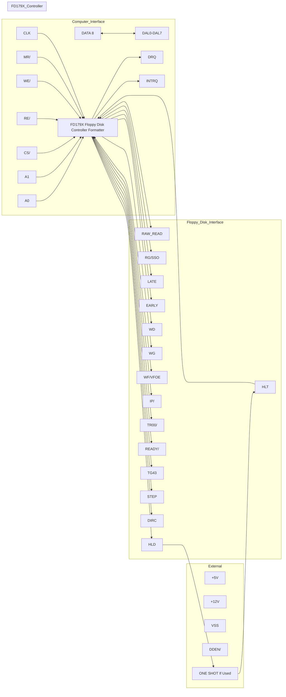
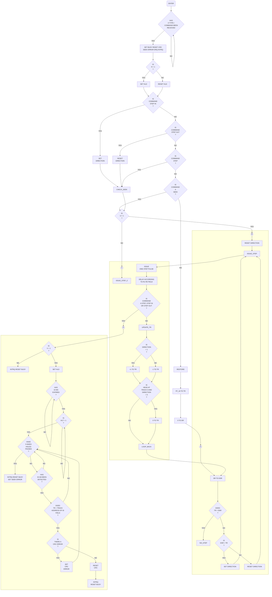
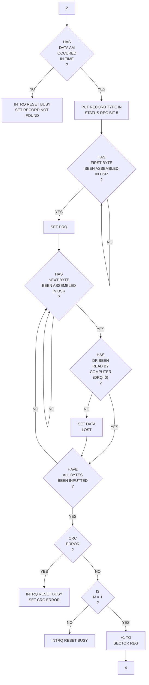
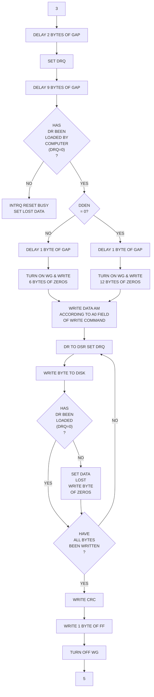
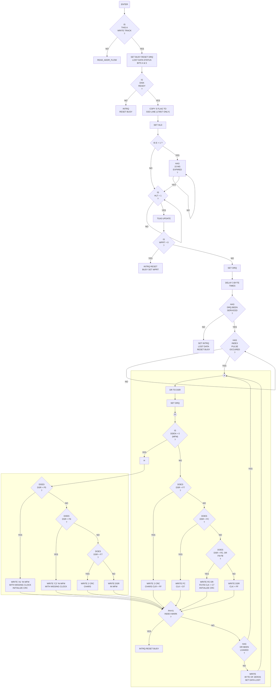
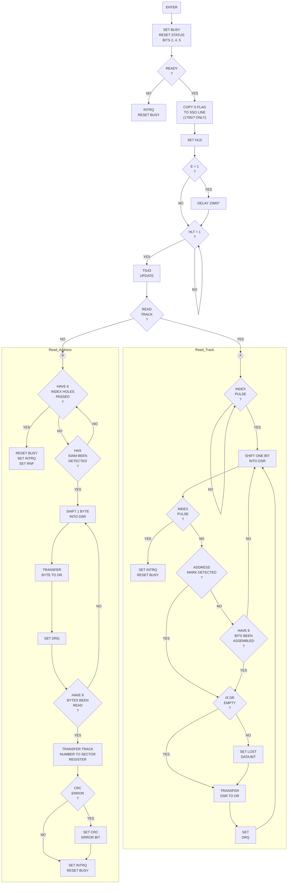

# FD 179X-02 Floppy Disk Formatter/Controller Family

**WESTERN DIGITAL CORPORATION**

## FEATURES

*   **TWO VFO CONTROL SIGNALS**
*   **SOFT SECTOR FORMAT COMPATIBILITY**
*   **AUTOMATIC TRACK SEEK WITH VERIFICATION**
*   **ACCOMMODATES SINGLE AND DOUBLE DENSITY FORMATS**
    *   IBM 3740 Single Density (FM)
    *   IBM System 34 Double Density (MFM)
*   **READ MODE**
    *   Single/Multiple Sector Read with Automatic Search or Entire Track Read
    *   Selectable 128 Byte or Variable length Sector
*   **WRITE MODE**
    *   Single/Multiple Sector Write with Automatic Sector Search
    *   Entire Track Write for Diskette Formatting
*   **SYSTEM COMPATIBILITY**
    *   Double Buffering of Data 8 Bit Bi-Directional Bus for Data, Control and Status
    *   DMA or Programmed Data Transfers
    *   All Inputs and Outputs are TTL Compatible
    *   On-Chip Track and Sector Registers/Comprehensive Status Information
*   **PROGRAMMABLE CONTROLS**
    *   Selectable Track to Track Stepping Time
    *   Side Select Compare
*   **WRITE PRECOMPENSATION**
*   **WINDOW EXTENSION**
*   **INCORPORATES ENCODING/DECODING AND ADDRESS MARK CIRCUITRY**
*   **FD1792/4 IS SINGLE DENSITY ONLY**
*   **FD1795/7 HAS A SIDE SELECT OUTPUT**

### 179X-02 FAMILY CHARACTERISTICS

| FEATURES | 1791 | 1793 | 1795 | 1797 |
| :--- | :---: | :---: | :---: | :---: |
| Single Density (FM) | X | X | X | X |
| Double Density (MFM) | X | X | X | X |
| True Data Bus | | X | | X |
| Inverted Data Bus | X | | X | |
| Write Precomp | X | X | X | X |
| Side Selection Output | | | X | X |

## APPLICATIONS

*   FLOPPY DISK DRIVE INTERFACE
*   SINGLE OR MULTIPLE DRIVE CONTROLLER/FORMATTER
*   NEW MINI-FLOPPY CONTROLLER

## FD179X SYSTEM BLOCK DIAGRAM



*(Note: 1791/3 = RG, 1795/7 = SSO. 1793/7 TRUE BUS)*

---

## GENERAL DESCRIPTION

The FD179X are MOS LSI devices which perform the functions of a Floppy Disk Formatter/Controller in a single chip implementation. The FD179X, which can be considered the end result of both the FD1771 and FD1781 designs, is IBM 3740 compatible in single density mode (FM) and System 34 compatible in Double Density Mode (MFM). The FD179X contains all the features of its predecessor the FD1771, plus the added features necessary to read/write and format a double density diskette. These include address mark detection, FM and MFM encoding and decoding logic, window extension, and write precompensation. In order to maintain compatibility, the FD1771, FD1781, and FD179X designs were made as close as possible with the computer interface, instruction set, and I/O registers being identical. Also, head load control is identical. In each case, the actual pin assignments vary by only a few pins from any one to another.

The processor interface consists of an 8-bit bidirectional bus for data, status, and control word transfers. The FD179X is set up to operate on a multiplexed bus with other bus-oriented devices.

The FD179X is fabricated in N-channel Silicon Gate MOS technology and is TTL compatible on all inputs and outputs. The 1793 is identical to the 1791 except the DAL lines are TRUE for systems that utilize true data busses.

The 1795/7 has a side select output for controlling double sided drives, and the 1792 and 1794 are "Single Density Only" versions of the 1791 and 1793. On these devices, DDEN must be left open.

## PIN OUTS

### COMPUTER INTERFACE

| PIN NUMBER | PIN NAME | SYMBOL | FUNCTION |
| :--- | :--- | :--- | :--- |
| 1 | NO CONNECTION | NC | Pin 1 is internally connected to a back bias generator and must be left open by the user. |
| 19 | MASTER RESET | MR/ | A logic low on this input resets the device and loads HEX 03 into the command register. The Not Ready (Status Bit 7) is reset during MR ACTIVE. When MR is brought to a logic high a RESTORE Command is executed, regardless of the state of the Ready signal from the drive. Also, HEX 01 is loaded into sector register. |
| 20 | POWER SUPPLIES | Vss | Ground |
| 21 | | Vcc | + 5V ± 5% |
| 40 | | Vdd | + 12V ± 5% |
| 2 | WRITE ENABLE | WE/ | A logic low on this input gates data on the DAL into the selected register when CS is low. |
| 3 | CHIP SELECT | CS/ | A logic low on this input selects the chip and enables computer communication with the device. |
| 4 | READ ENABLE | RE/ | A logic low on this input controls the placement of data from a selected register on the DAL when CS is low. |
| 5,6 | REGISTER SELECT LINES | A0, A1 | These inputs select the register to receive/transfer data on the DAL lines under RE and WE control:<br>A1 A0 RE/ WE/<br>0 0 Status Reg Command Reg<br>0 1 Track Reg Track Reg<br>1 0 Sector Reg Sector Reg<br>1 1 Data Reg Data Reg |
| 7-14 | DATA ACCESS LINES | DAL0-DAL7 | Eight bit inverted Bidirectional bus used for transfer of data, control, and status. This bus is receiver enabled by WE or transmitter enabled by RE. |
| 24 | CLOCK | CLK | This input requires a free-running square wave clock for internal timing reference; 2 MHz for 8" drives, 1 MHz for mini-drives. |
| 38 | DATA REQUEST | DRQ | This open drain output indicates that the DR contains assembled data in Read operations, or the DR is empty in Write operations. This signal is reset when serviced by the computer through reading or loading the DR in Read or Write operations, respectively. Use 10K pull-up resistor to +5. |
| 39 | INTERRUPT REQUEST | INTRQ | This open drain output is set at the completion of any command and is reset when the STATUS register is read or the command register is written to. Use 10K pull-up resistor to +5. |

### FLOPPY DISK INTERFACE

| PIN NUMBER | PIN NAME | SYMBOL | FUNCTION |
| :--- | :--- | :--- | :--- |
| 15 | STEP | STEP | The step output contains a pulse for each step. |
| 16 | DIRECTION | DIRC | Direction Output is active high when stepping in, active low when stepping out. |
| 17 | EARLY | EARLY | Indicates that the WRITE DATA pulse occurring while Early is active (high) should be shifted early for write precompensation. |
| 18 | LATE | LATE | Indicates that the write data pulse occurring while Late is active (high) should be shifted late for write precompensation. |
| 22 | TEST | TEST/ | This input is used for testing purposes only and should be tied to +5V or left open by the user unless interfacing to voice coil actuated motors. |
| 23 | HEAD LOAD TIMING | HLT | When a logic high is found on the HLT input the head is assumed to be engaged. |
| 25 | READ GATE (1791/3) | RG | A high level on this output indicates to the data separator circuitry that a field of zeros (or ones) has been encountered, and is used for synchronization. |
| 25 | SIDE SELECT OUTPUT (1795, 1797) | SSO | The logic level of the Side Select Output is directly controlled by the 'S' flag in Type II or III commands. When S = 1, SSO is set to a logic 1. When S = 0, SSO is set to a logic 0. The Side Select Output is only updated at the beginning of a Type II or III command. It is forced to a logic 0 upon a MASTER RESET condition. |
| 26 | READ CLOCK | RCLK | A nominal square-wave clock signal derived from the data stream must be provided to this input. Phasing (i.e. RCLK transitions) relative to RAW READ is important but polarity (RCLK high or low) is not. |
| 27 | RAW READ | RAW READ/ | The data input signal directly from the drive. This input shall be a negative pulse for each recorded flux transition. |
| 28 | HEAD LOAD | HLD | The HLD output controls the loading of the Read-Write head against the media. |
| 29 | TRACK GREATER THAN 43 | TG43 | This output informs the drive that the Read/Write head is positioned between tracks 44-76. This output is valid only during Read and Write Commands. |
| 30 | WRITE GATE | WG | This output is made valid before writing is to be performed on the diskette. |
| 31 | WRITE DATA | WD | A 250 ns (MFM) or 500 ns (FM) pulse per flux transition. WD contains the unique Address marks as well as data and clock in both FM and MFM formats. |
| 32 | READY | READY | This input indicates disk readiness and is sampled for a logic high before Read or Write commands are performed. If Ready is low the Read or Write operation is not performed and an interrupt is generated. Type I operations are performed regardless of the state of Ready. The Ready input appears in inverted format as Status Register bit 7. |
| 33 | WRITE FAULT / VFO ENABLE | WF/ / VFOE | This is a bi-directional signal used to signify writing faults at the drive, and to enable the external PLO data separator. When WG = 1, Pin 33 functions as a WF input. If WF = 0, any write command will immediately be terminated. When WG = 0, Pin 33 functions as a VFOE output. VFOE will go low during a read operation after the head has loaded and settled (HLT = 1). On the 1795/7, it will remain low until the last bit of the second CRC byte in the ID field. VFOE will then go high until 8 bytes (MFM) or 4 bytes (FM) before the Address Mark. It will then go active until the last bit of the second CRC byte of the Data Field. On the 1791/3, VFOE will remain low until the end of the Data Field. |
| 34 | TRACK 00 | TR00/ | This input informs the FD179X that the Read/Write head is positioned over Track 00. |
| 35 | INDEX PULSE | IP/ | This input informs the FD179X when the index hole is encountered on the diskette. |
| 36 | WRITE PROTECT | WPRT/ | This input is sampled whenever a Write Command is received. A logic low terminates the command and sets the Write Protect Status bit. |
| 37 | DOUBLE DENSITY | DDEN/ | This pin selects either single or double density operation. When DDEN = 0, double density is selected. When DDEN = 1, single density is selected. This line must be left open on the 1792/4. |

## ORGANIZATION

The Floppy Disk Formatter block diagram is illustrated on page 5. The primary sections include the parallel processor interface and the Floppy Disk interface.

**Data Shift Register**-This 8-bit register assembles serial data from the Read Data input (RAW READ) during Read operations and transfers serial data to the Write Data output during Write operations.

**Data Register**-This 8-bit register is used as a holding register during Disk Read and Write operations. In Disk Read operations the assembled data byte is transferred in parallel to the Data Register from the Data Shift Register. In Disk Write operations information is transferred in parallel from the Data Register to the Data Shift Register.

**Track Register**-This 8-bit register holds the track number of the current Read/Write head position. It is incremented by one every time the head is stepped in (towards track 76) and decremented by one when the head is stepped out (towards track 00). The contents of the register are compared with the recorded track number in the ID field during disk Read, Write, and Verify operations. The Track Register can be loaded from or transferred to the DAL. This Register should not be loaded when the device is busy.

**Sector Register (SR)**-This 8-bit register holds the address of the desired sector position. The contents of the register are compared with the recorded sector number in the ID field during Disk Read or Write operations. The Sector Register contents can be loaded from or transferred to the DAL. This register should not be loaded when the device is busy.

**Command Register (CR)**-This 8-bit register holds the command presently being executed. This register should not be loaded when the device is busy unless the new command is a force interrupt. The command register can be loaded from the DAL, but not read onto the DAL.

**Status Register (STR)**-This 8-bit register holds device status information. The meaning of the Status bits is a function of the type of command previously executed. This register can be read onto the DAL, but not loaded from the DAL.

**CRC Logic**-This logic is used to check or to generate the 16-bit Cyclic Redundancy Check (CRC). The polynomial is: $G(x) = x^{16} + x^{12} + x^5 + 1$. The CRC includes all information starting with the address mark and up to the CRC characters. The CRC register is preset to ones prior to data being shifted through the circuit.

**Arithmetic/Logic Unit (ALU)**-The ALU is a serial comparator, incrementer, and decrementer and is used for register modification and comparisons with the disk recorded ID field.

**Timing and Control**-All computer and Floppy Disk Interface controls are generated through this logic. The internal device timing is generated from an external crystal clock.
The FD1791/3 has two *different* modes of operation according to the state of DDEN. When DDEN = 0 double density (MFM) is assumed. When DDEN = 1, single density (FM) is assumed.

**AM Detector**-The address mark detector detects ID, data and index address marks during read and write operations.

### FD179X BLOCK DIAGRAM

```mermaid
graph TB
    subgraph Processor_Interface
        DAL[DAL0-DAL7] <--> DO_BUF[DATA OUT BUFFERS]
        DO_BUF --> DR[DATA REG]
        DO_BUF --> CR[COMMAND REG]
        DO_BUF --> SR[SECTOR REG]
        DO_BUF --> TR[TRACK REG]
        DO_BUF <-- STR[STATUS REG]
    end

    subgraph Internal_Logic
        DR <--> DSR[DATA SHIFT REG]
        DSR <--> CRC[CRC LOGIC]
        DSR <--> AM[AM DETECTOR]
        TR <--> ALU
        SR --> ALU
        
        CR --> PLA[PLA CONTROL 230 X 16]
        PLA --> CONTROL_COMP[COMPUTER INTERFACE CONTROL]
        PLA --> CONTROL_DISK[DISK INTERFACE CONTROL]
    end
    
    subgraph Disk_Interface
        RAW_READ --> AM
        RAW_READ --> DSR
        AM --> PLA
        CRC --> DSR
        
        CONTROL_COMP --> INT_PINS[IRQ, DRQ]
        CONTROL_COMP <-- HOST_PINS[CS, RE, WE, A0, A1]
        
        CONTROL_DISK --> DISK_OUT[WG, TG43, WPRT, WF/VFOE, IP, TR00, READY, STEP, DIRC, EARLY, LATE, RG/SSO, HLD, HLT]
        
        DSR --> WD[WRITE DATA TO DISK]
    end
    
    CLK[RCLK] --> AM
    
    %% Interconnections not fully depicted for clarity, strictly following the block flow conceptually
```

## PROCESSOR INTERFACE

The interface to the processor is accomplished through the eight Data Access Lines (DAL) and associated control signals. The DAL are used to transfer Data, Status, and Control words out of, or into the FD179X. The DAL are three state buffers that are enabled as output drivers when Chip Select (CS) and Read Enable (RE) are active (low logic state) or act as input receivers when CS and Write Enable (WE) are active.

When transfer of data with the Floppy Disk Controller is required by the host processor, the device address is decoded and CS is made low. The address bits A1 and A0, combined with the signals RE during a Read operation or WE during a Write operation are interpreted as selecting the following registers:

| A1 | A0 | READ (RE/) | WRITE (WE/) |
| :---: | :---: | :--- | :--- |
| 0 | 0 | Status Register | Command Register |
| 0 | 1 | Track Register | Track Register |
| 1 | 0 | Sector Register | Sector Register |
| 1 | 1 | Data Register | Data Register |

During Direct Memory Access (DMA) types of data transfers between the Data Register of the FD179X and the processor, the Data Request (DRQ) output is used in Data Transfer control. This signal also appears as status bit 1 during Read and Write operations.

On Disk Read operations the Data Request is activated (set high) when an assembled serial input byte is transferred in parallel to the Data Register. This bit is cleared when the Data Register is read by the processor. If the Data Register is read after one or more characters are lost, by having new data transferred into the register prior to processor readout, the Lost Data bit is set in the Status Register. The Read operation continues until the end of sector is reached.

On Disk Write operations the Data Request is activated when the Data Register transfers its contents to the Data Shift Register, and requires a new data byte. It is reset when the Data Register is loaded with new data by the processor. If new data is not loaded at the time the next serial byte is required by the Floppy Disk, a byte of zeroes is written on the diskette and the Lost Data bit is set in the Status Register.

At the completion of every command an INTRQ is generated. INTRQ is reset by either reading the status register or by loading the command register with a new command. In addition, INTRQ is generated if a Force Interrupt command condition is met.

## FLOPPY DISK INTERFACE

The 179X has two modes of operation according to the state of DDEN (Pin 37). When DDEN = 1, single density is selected. In either case, the CLK input (Pin 24) is at 2 MHz. However, when interfacing with the mini-floppy, the CLK input is set at 1 MHz for both single density and double density. When the clock is at 2 MHz, the stepping rates of 3, 6, 10, and 15 ms are obtainable. When CLK equals 1 MHz these times are doubled.

## HEAD POSITIONING

Five commands cause positioning of the Read-Write head (see Command Section). The period of each positioning step is specified by the r field in bits 1 and 0 of the command word. After the last directional step an additional 15 milliseconds of head settling time takes place if the Verify flag is set in Type I commands. Note that this time doubles to 30 ms for a 1 MHz clock. If TEST = 0, there is zero settling time. There is also a 15 ms head settling time if the E flag is set in any Type II or III command.

The rates (shown in Table 1) can be applied to a Step-Direction Motor through the device interface.

**Step**-A 2 µs (MFM) or 4 µs (FM) pulse is provided as an output to the drive. For every step pulse issued, the drive moves one track location in a direction determined by the direction output.

**Direction (DIRC)**-The Direction signal is active high when stepping in and low when stepping out. The Direction signal is valid 12 µs before the first stepping pulse is generated.

When a Seek, Step or Restore command is executed an optional verification of Read-Write head position can be performed by setting bit 2 (V = 1) in the command word to a logic 1. The verification operation begins at the end of the 15 millisecond settling time after the head is loaded against the media. The track number from the first encountered ID Field is compared against the contents of the Track Register. If the track numbers compare and the ID Field Cyclic Redundancy Check (CRC) is correct, the verify operation is complete and an INTRQ is generated with no errors. The FD179X must find an ID field with correct track number and correct CRC within 5 revolutions of the media; otherwise the seek error is set and an INTRQ is generated.

**Table 1. STEPPING RATES**

| CLK | 2 MHz | 2 MHz | 1 MHz | 1 MHz | 2 MHz | 1 MHz |
| :--- | :---: | :---: | :---: | :---: | :---: | :---: |
| **DDEN** | **0** | **1** | **0** | **1** | **x** | **x** |
| **R1 R0** | **TEST=1** | **TEST=1** | **TEST=1** | **TEST=1** | **TEST=0** | **TEST=0** |
| 0 0 | 3 ms | 6 ms | 6 ms | 6 ms | 184µs | 368µs |
| 0 1 | 6 ms | 12 ms | 12 ms | 12 ms | 190µs | 380µs |
| 1 0 | 10 ms | 20 ms | 20 ms | 20 ms | 198µs | 396µs |
| 1 1 | 15 ms | 30 ms | 30 ms | 30 ms | 208µs | 416µs |

The Head Load (HLD) output controls the movement of the read/write head against the media. HLD is activated at the beginning of a Type I command if the h flag is set (h = 1), at the end of the Type I command if the verify flag (V = 1), or upon receipt of any Type II or III command. Once HLD is active it remains active until either a Type I command is received with (h = 0 and V = 0); or if the FD179X is in an idle state (non-busy) and 15 index pulses have occurred.

Head Load Timing (HLT) is an input to the FD179X which is used for the head engage time. When HLT = 1, the FD179X assumes the head is completely engaged. The head engage time is typically 30 to 100 ms depending on drive. The low to high transition on HLD is typically used to fire a one shot. The output of the one shot is then used for HLT and supplied as an input to the FD179X.

**HEAD LOAD TIMING**
*(Timing diagram description: HLD goes High. Delay. HLT (from one shot) goes High after 50 to 100MS)*

When both HLD and HLT are true, the FD179X will then read from or write to the media. The "and" of HLD and HLT appears as a status bit in Type I status.

In summary for the Type I commands: if h = 0 and V = 0, HLD is reset. If h = 1 and V = 0, HLD is set at the beginning of the command and HLT is not sampled nor is there an internal 15 ms delay. If h = 0 and V = 1, HLD is set near the end of the command, an internal 15 ms occurs, and the FD179X waits for HLT to be true. If h = 1 and V = 1, HLD is set at the beginning of the command. Near the end of the command, after all the steps have been issued, an internal 15 ms delay occurs and the FD179X then waits for HLT to occur.

For Type II and III commands with E flag off, HLD is made active and HLT is sampled until true. With E flag on, HLD is made active, an internal 15 ms delay occurs and then HLT is sampled until true.

## DISK READ OPERATIONS

Sector lengths of 128, 256, 512 or 1024 are obtainable in either FM or MFM formats. For FM, DDEN should be placed to logical "1." For MFM formats, DDEN should be placed to a logical "0." Sector lengths are determined at format time by a special byte in the "ID" field. If this Sector length byte in the ID field is zero, then the sector length is 128 bytes. If 01 then 256 bytes. If 02, then 512 bytes. If 03, then the sector length is 1024 bytes. The number of sectors per track as far as the FD179X is concerned can be from 1 to 255 sectors. The number of tracks as far as the FD179X is concerned is from 0 to 255 tracks. For IBM 3740 compatibility, sector lengths are 128 bytes with 26 sectors per track. For System 34 compatibility (MFM), sector lengths are 256 bytes/sector with 26 sectors/track; or lengths of 1024 bytes/sector with 8 sectors/track. (See Sector Length Table.)

For read operations, the FD179X requires RAW READ Data (Pin 27) signal which is a 250 ns pulse per flux transition and a Read clock (RCLK) signal to indicate flux transition spacings. The RCLK (Pin 26) signal is provided by some drives but if it not may be derived externally by Phase lock loops, one shots, or counter techniques. In addition, a Read Gate Signal is provided as an output (Pin 25) which is used to inform phase lock loops when to acquire synchronization. When reading from the media in FM. RG is made true when 2 bytes of zeroes are detected. The FD179X must find an address mark within the next 10 bytes; otherwise RG is reset and the search for 2 bytes of zeroes begins all over again. If an address mark is found within 10 bytes, RG remains true as long as the FD179X is deriving any useful information from the data stream. Similarly for MFM, RG is made active when 4 bytes of "00" or "FF" are detected. The FD179X must find an address mark within the next 16 bytes, otherwise RG is reset and search resumes.

During read operations (WG = 0), the VFOE (Pin 33) is provided for phase lock loop synchronization. VFOE will go active when:
a) Both HLT and HLD are True
b) Settling Time, if programmed, has expired
c) The 179X is inspecting data off the disk

If WF/VFOE is not used, leave open or tie to a 10K resistor to +5.

## DISK WRITE OPERATION

When writing is to take place on the diskette the Write Gate (WG) output is activated, allowing current to flow into the Read/Write head. As a precaution to erroneous writing the first data byte must be loaded into the Data Register in response to a Data Request from the FD179X before the Write Gate signal can be activated.

Writing is inhibited when the Write Protect input is a logic low, in which case any Write command is immediately terminated, an interrupt is generated and the Write Protect status bit is set. The Write Fault input, when activated, signifies a writing fault condition detected in disk drive electronics such as failure to detect write current flow when the Write Gate is activated. On detection of this fault the FD179X terminates the current command, and sets the Write Fault bit (bit 5) in the Status Word. The Write Fault input should be made inactive when the Write Gate output becomes inactive.

For write operations, the FD179X provides Write Gate (Pin 30) and Write Data (Pin 31) outputs. Write Data consists of a series of 500 ns pulses in FM (DDEN = 1) and 250 ns pulses in MFM (DDEN = 0). Write Data provides the unique address marks in both formats.

Also during write, two additional signals are provided for write precompensation. These are EARLY (Pin 17) and LATE (Pin 18). EARLY is active true when the WD pulse appearing on (Pin 30) is to be written EARLY. LATE is active true when the WD pulse is to be written LATE. If both EARLY and LATE are low when the WD pulse is present, the WD pulse is to be written at nominal. Since write precompensation values vary from disk manufacturer to disk manufacturer, the actual value is determined by several one shots or delay lines which are located external to the FD179X. The write precompensation signals EARLY and LATE are valid for the duration of WD in both FM and MFM formats.

## COMMAND DESCRIPTION

The FD179X will accept eleven commands. Command words should only be loaded in the Command Register when the Busy status bit is off (Status bit 0). The one exception is the Force Interrupt command. Whenever a command is being executed, the Busy status bit is set. When a command is completed, an interrupt is generated and the Busy status bit is reset. The Status Register indicates whether the completed command encountered an error or was fault free. For ease of discussion, commands are divided into four types. Commands and types are summarized in Table 2.

**Table 2. COMMAND SUMMARY**

| TYPE | COMMAND | 7 | 6 | 5 | 4 | 3 | 2 | 1 | 0 |
| :--- | :--- | :---: | :---: | :---: | :---: | :---: | :---: | :---: | :---: |
| I | Restore | 0 | 0 | 0 | 0 | h | V | $r_1$ | $r_0$ |
| I | Seek | 0 | 0 | 0 | 1 | h | V | $r_1$ | $r_0$ |
| I | Step | 0 | 0 | 1 | u | h | V | $r_1$ | $r_0$ |
| I | Step In | 0 | 1 | 0 | u | h | V | $r_1$ | $r_0$ |
| I | Step Out | 0 | 1 | 1 | u | h | V | $r_1$ | $r_0$ |
| II | Read Sector | 1 | 0 | 0 | m | $F_2$ | E | $F_1$ | 0 |
| II | Write Sector | 1 | 0 | 1 | m | $F_2$ | E | $F_1$ | $a_0$ |
| III | Read Address | 1 | 1 | 0 | 0 | 0 | E | 0 | 0 |
| III | Read Track | 1 | 1 | 1 | 0 | 0 | E | 0 | 0 |
| III | Write Track | 1 | 1 | 1 | 1 | 0 | E | 0 | 0 |
| IV | Force Interrupt | 1 | 1 | 0 | 1 | $I_3$ | $I_2$ | $I_1$ | $I_0$ |

Note: Bits shown in TRUE form.

**Table 3. FLAG SUMMARY (TYPE I)**

| TYPE I COMMANDS |
| :--- |
| **h = Head Load Flag (Bit 3)** |
| h = 1, Load head at beginning |
| h = 0, Unload head at beginning |
| **V = Verify Flag (Bit 2)** |
| V = 1, Verify on destination track |
| V = 0, No verify |
| **$r_1 r_0$ = Stepping motor rate (Bits 1-0)** |
| Refer to Table 1 for rate summary |
| **u = Update flag (Bit 4)** |
| u = 1, Update Track register |
| u = 0, No update |

**Table 4. FLAG SUMMARY (TYPE II & III)**

| TYPE II & III COMMANDS |
| :--- |
| **m = Multiple Record flag (Bit 4)** |
| m = 0, Single Record |
| m = 1, Multiple Records |
| **$a_0$ = Data Address Mark (Bit 0)** |
| $a_0$ = 0, FB (Data Mark) |
| $a_0$ = 1, F8 (Deleted Data Mark) |
| **E = 15 ms Delay (2MHz)** |
| E = 1, 15 ms delay |
| E = 0, no 15 ms delay |
| **($F_2$) S = Side Select Flag (1791/3 only)** |
| S = 0, Compare for Side 0 |
| S = 1, Compare for Side 1 |
| **($F_1$) C = Side Compare Flag (1791/3 only)** |
| C = 0, disable side select compare |
| C = 1, enable side select compare |
| **($F_1$) S = Side Select Flag (Bit 1, 1795/7 only)** |
| S = 0 Update SSO to 0 |
| S = 1 Update SSO to 1 |
| **($F_2$) b = Sector Length Flag (Bit 3, 1975/7 only)** |
| (See Sector Length Field Table below) |

**Sector Length Field**

| b = 0 | b = 1 | Sector Length Field | 00 | 01 | 10 | 11 |
| :---: | :---: | :---: | :---: | :---: | :---: | :---: |
| | | 256 | 512 | 1024 | 128 |
| | | 128 | 256 | 512 | 1024 |

**Table 5. FLAG SUMMARY (TYPE IV)**

| TYPE IV COMMAND |
| :--- |
| **$I_i$ = Interrupt Condition flags (Bits 3-0)** |
| $I_0$ = 1, Not-Ready to Ready Transition |
| $I_1$ = 1, Ready to Not-Ready Transition |
| $I_2$ = 1, Every Index Pulse |
| $I_3$ = 1, Immediate Interrupt |
| $I_3-I_0$ = 0, Terminate with no Interrupt |

### TYPE I COMMANDS

The Type I Commands include the Restore, Seek, Step, Step-In, and Step-Out commands. Each of the Type I Commands contains a rate field ($r_0r_1$), which determines the stepping motor rate as defined in Table 1.

The Type I Commands contain a head load flag (h) which determines if the head is to be loaded at the beginning of the command. If h = 1, the head is loaded at the beginning of the command (HLD output is made active). If h = 0, HLD is deactivated. Once the head is loaded, the head will remain engaged until the FD179X receives a command that specifically disengages the head. If the FD179X is idle (busy = 0) for 15 revolutions of the disk, the head will be automatically disengaged (HLD made inactive).

The Type I Commands also contain a verification (V) flag which determines if a verification operation is to take place on the destination track. If V = 1, a verification is performed, if V = 0, no verification is performed.

During verification, the head is loaded and after an internal 15 ms delay, the HLT input is sampled. When HLT is active (logic true), the first encountered ID field is read off the disk. The track address of the ID field is then compared to the Track Register; if there is a match and a valid ID CRC, the verification is complete, an interrupt is generated and the Busy status bit is reset. If there is not a match but there is valid ID CRC, an interrupt is generated, and Seek Error Status bit (Status bit 4) is set and the Busy status bit is reset. If there is a match but not a valid CRC, the CRC error status bit is set (Status bit 3), and the next encountered ID field is read from the disk for the verification operation. If an ID field with a valid CRC cannot be found after four revolutions of the disk, the FD179X terminates the operation and sends an interrupt, (INTRQ).

The Step, Step-In, and Step-Out commands contain an Update flag (u). When U = 1, the track register is updated by one for each step. When U = 0, the track register is not updated.

On the 1795/7 devices, the SSO output is not affected during Type I commands, and an internal side compare does not take place when the (V) Verify Flag is on.

**TYPE I COMMAND FLOW**



**RESTORE (SEEK TRACK 0)**
Upon receipt of this command the Track 00 (TR00) input is sampled. If TR00 is active low indicating the Read-Write head is positioned over track 0, the Track Register is loaded with zeroes and an interrupt is generated. If TR00 is not active low, stepping pulses (pins 15 to 16) at a rate specified by the $r_1r_0$ field are issued until the TR00 input is activated. At this time the Track Register is loaded with zeroes and an interrupt is generated. If the TR00 input does not go active low after 255 stepping pulses, the FD179X terminates operation, interrupts, and sets the Seek error status bit. A verification operation takes place if the V flag is set. The h bit allows the head to be loaded at the start of command. Note that the Restore command is executed when MR goes from an active to an inactive state.

**SEEK**
This command assumes that the Track Register contains the track number of the current position of the Read-Write head and the Data Register contains the desired track number. The FD179X will update the Track register and issue stepping pulses in the appropriate direction until the contents of the Track register are equal to the contents of the Data Register (the desired track location). A verification operation takes place if the V flag is on. The h bit allows the head to be loaded at the start of the command. An interrupt is generated at the completion of the command.

**STEP**
Upon receipt of this command, the FD179X issues one stepping pulse to the disk drive. The stepping motor direction is the same as in the previous step command. After a delay determined by the $r_1r_0$ field, a verification takes place if the V flag is on. If the u flag is on, the Track Register is updated. The h bit allows the head to be loaded at the start of the command. An interrupt is generated at the completion of the command.

**STEP-IN**
Upon receipt of this command, the FD179X issues one stepping pulse in the direction towards track 76. If the u flag is on, the Track Register is incremented by one. After a delay determined by the $r_1r_0$ field, a verification takes place if the V flag is on. The h bit allows the head to be loaded at the start of the command. An interrupt is generated at the completion of the command.

**STEP-OUT**
Upon receipt of this command, the FD179X issues one stepping pulse in the direction towards track 0. If the u flag is on, the Track Register is decremented by one. After a delay determined by the $r_1r_0$ field, a verification takes place if the V flag is on. The h bit allows the head to be loaded at the start of the command. An interrupt is generated at the completion of the command.

### TYPE II COMMANDS

The Type II Commands are the Read Sector and Write Sector commands. Prior to loading the Type II Command into the Command Register, the computer must load the Sector Register with the desired sector number. Upon receipt of the Type II command, the busy status bit is set. If the E flag = 1 (this is the normal case) HLD is made active and HLT is sampled after a 15 msec delay. If the E flag is 0, the head is loaded and HLT sampled with no 15 msec delay. The ID field and Data Field format are shown on page 13.

When an ID field is located on the disk, the FD179X compares the Track Number on the ID field with the Track Register. If there is not a match, the next encountered ID field is read and a comparison is again made. If there was a match, the Sector Number of the ID field is compared with the Sector Register. If there is not a Sector match, the next encountered ID field is read off the disk and comparisons again made. If the ID field CRC is correct, the data field is then located and will be either written into, or read from depending upon the command. The FD179X must find an ID field with a Track number, Sector number, side number, and CRC within four revolutions of the disk; otherwise, the Record not found status bit is set (Status bit 3) and the command is terminated with an interrupt.

**TYPE II COMMAND FLOW**

```mermaid
graph TD
    ENTER(ENTER) --> CMD_RX{IS<br/>TYPE II<br/>COMMAND<br/>RECEIVED}
    CMD_RX -- NO --> CMD_RX
    CMD_RX -- YES --> INIT[SET BUSY RESET DRQ LOST<br/>DATA RECORD NOT FOUND &<br/>STATUS BITS 5 & 6 INTRQ]
    INIT --> READY{IS<br/>DISK<br/>READY<br/>?}
    READY -- NO --> NOT_READY[INTRQ<br/>RESET BUSY]
    READY -- YES --> SSO["COPY S FLAG TO<br/>SSO LINE (1795/7 ONLY)"]
    SSO --> SET_HLD[SET HLD]
    SET_HLD --> IS_E{IS E = 1 ?}
    IS_E -- NO --> HLT_CHECK
    IS_E -- YES --> WAIT_15[HAS<br/>15 MS<br/>EXPIRED<br/>?]
    WAIT_15 -- NO --> WAIT_15
    WAIT_15 -- YES --> HLT_CHECK
    
    HLT_CHECK{IS HLT = 1 ?}
    HLT_CHECK -- NO --> HLT_CHECK
    HLT_CHECK -- YES --> CHECK_TG43{IS<br/>TR > 43<br/>?}
    CHECK_TG43 -- YES --> SET_TG43[SET<br/>TG43]
    CHECK_TG43 -- NO --> RESET_TG43[RESET TG43]
    
    SET_TG43 --> WPRT_CHECK
    RESET_TG43 --> WPRT_CHECK
    
    WPRT_CHECK{IS<br/>WRITE<br/>PROTECT<br/>ON<br/>?}
    WPRT_CHECK -- YES --> IS_WRITE{IS<br/>COMMAND<br/>WRITE<br/>?}
    IS_WRITE -- YES --> ERR_EXIT[INTRQ RESET BUSY<br/>SET WRITE PROTECT]
    IS_WRITE -- NO --> SEARCH
    WPRT_CHECK -- NO --> SEARCH
    
    SEARCH[1] --> FIVE_INDEX{HAVE<br/>5 INDEX HOLES<br/>PASSED<br/>?}
    FIVE_INDEX -- YES --> RNF[INTRQ RESET BUSY<br/>SET RECORD NOT FOUND]
    FIVE_INDEX -- NO --> IDAM{HAS<br/>IDAM<br/>BEEN<br/>DETECTED<br/>?}
    IDAM -- NO --> FIVE_INDEX
    IDAM -- YES --> TR_CHECK{DOES<br/>TR = TRACK<br/>ADDRESS OF ID<br/>FIELD<br/>?}
    TR_CHECK -- NO --> FIVE_INDEX
    TR_CHECK -- YES --> SR_CHECK{DOES<br/>SR = SECTOR<br/>ADDRESS OF ID<br/>FIELD<br/>?}
    SR_CHECK -- NO --> FIVE_INDEX
    SR_CHECK -- YES --> SIDE_CHECK{DOES<br/>S = SIDE NO<br/>OF<br/>ID FIELD<br/>?}
    SIDE_CHECK -- NO --> FIVE_INDEX
    SIDE_CHECK -- YES --> LOAD_LEN[BRING IN SECTOR LENGTH FIELD<br/>STORE LENGTH IN INTERNAL<br/>REGISTER]
    LOAD_LEN --> CRC_CHECK{IS<br/>THERE A<br/>CRC ERROR<br/>?}
    CRC_CHECK -- YES --> SET_CRC[SET CRC<br/>STATUS ERROR]
    SET_CRC --> FIVE_INDEX
    CRC_CHECK -- NO --> RESET_CRC[RESET<br/>CRC]
    RESET_CRC --> CMD_TYPE{IS<br/>COMMAND<br/>WRITE<br/>?}
    CMD_TYPE -- YES --> WRITE_FLOW[3]
    CMD_TYPE -- NO --> READ_FLOW[2]
```



**Sector Length Table**

| Sector Length Field (hex) | Number of Bytes in Sector (decimal) |
| :---: | :---: |
| 00 | 128 |
| 01 | 256 |
| 02 | 512 |
| 03 | 1024 |

Each of the Type II Commands contains an (m) flag which determines if multiple records (sectors) are to be read or written, depending upon the command. If m = 0, a single sector is read or written and an interrupt is generated at the completion of the command. If m = 1, multiple records are read or written with the sector register internally updated so that an address verification can occur on the next record. The FD179X will continue to read or write multiple records and update the sector register until the sector register exceeds the number of sectors on the track or until the Force Interrupt command is loaded into the Command Register, which terminates the command and generates an interrupt.

If the Sector Register exceeds the number of sectors on the track, the Record-Not-Found status bit will be set.

The Type II commands also contain side select compare flags. When C = 0, no side comparison is made. When C = 1, the LSB of the side number is read off the ID Field of the disk and compared with the contents of the (S) flag. If the S flag compares with the side number recorded in the ID field, the 179X continues with the ID search. If a comparison is not made within 5 index pulses, the interrupt line is made active and the Record-Not-Found status bit is set.

The 1795/7 READ SECTOR and WRITE SECTOR commands include a 'b' flag. The 'b' flag, in conjunction with the sector length byte of the ID Field, allows different byte lengths to be implemented in each sector. For IBM compatibility, the 'b' flag should be set to a one. The 's' flag allows direct control over the SSO Line (Pin 25) and is set or reset at the beginning of the command, dependent upon the value of this flag.

**READ SECTOR**
Upon receipt of the Read Sector command, the head is loaded, the Busy status bit is set, and when an ID field is encountered that has the correct track number, correct sector number, correct side number, and correct CRC, the data field is presented to the computer. The Data Address Mark of the data field must be found within 30 bytes in single density and 43 bytes in double density of the last ID field CRC byte; if not, the Record Not Found status bit is set and the operation is terminated.

When the first character or byte of the data field has been shifted through the DSR, it is transferred to the DR, and DRQ is generated. When the next byte is accumulated in the DSR, it is transferred to the DR and another DRQ is generated. If the Computer has not read the previous contents of the DR before a new character is transferred that character is lost and the Lost Data Status bit is set. This sequence continues until the complete data field has been inputted to the computer. If there is a CRC error at the end of the data field, the CRC error status bit is set, and the command is terminated (even if it is a multiple record command).

At the end of the Read operation, the type of Data Address Mark encountered in the data field is recorded in the Status Register (Bit 5) as shown below:

| STATUS BIT 5 | |
| :---: | :--- |
| 1 | Deleted Data Mark |
| 0 | Data Mark |

**READ FLOW (Diagram Continuation)**



**WRITE SECTOR**
Upon receipt of the Write Sector command, the head is loaded (HLD active) and the Busy status bit is set. When an ID field is encountered that has the correct track number, correct sector number, correct side number, and correct CRC, a DRQ is generated. The FD179X counts off 11 bytes in single density and 22 bytes in double density from the CRC field and the Write Gate (WG) output is made active if the DRQ is serviced (i.e., the DR has been loaded by the computer). If DRQ has not been serviced, the command is terminated and the Lost Data status bit is set. If the DRQ has been serviced, the WG is made active and six bytes of zeros in single density and 12 bytes in double density are then written on the disk. At this time the Data Address Mark is then written on the disk as determined by the $a_0$ field of the command as shown below:

| $a_0$ | Data Address Mark (Bit 0) |
| :---: | :--- |
| 1 | Deleted Data Mark |
| 0 | Data Mark |

The FD179X then writes the data field and generates DRQs to the computer. If the DRQ is not serviced in time for continuous writing the Lost Data Status Bit is set and a byte of zeros is written on the disk. The command is not terminated. After the last data byte has been written on the disk, the two-byte CRC is computed internally and written on the disk followed by one byte of logic ones in FM or in MFM. The WG output is then deactivated.

**WRITE FLOW (Diagram Continuation)**



### TYPE III COMMANDS

**READ ADDRESS**
Upon receipt of the Read Address command, the head is loaded and the Busy Status Bit is set. The next encountered ID field is then read in from the disk, and the six data bytes of the ID field are assembled and transferred to the DR, and a DRQ is generated for each byte. The six bytes of the ID field are shown below:

| TRACK ADDR | SIDE NUMBER | SECTOR ADDRESS | SECTOR LENGTH | CRC 1 | CRC 2 |
| :---: | :---: | :---: | :---: | :---: | :---: |
| 1 | 2 | 3 | 4 | 5 | 6 |

Although the CRC characters are transferred to the computer, the FD179X checks for validity and the CRC error status bit is set if there is a CRC error. The Track Address of the ID field is written into the sector register. At the end of the operation an interrupt is generated and the Busy Status is reset.

**READ TRACK**
Upon receipt of the Read Track command, the head is loaded and the Busy Status bit is set. Reading starts with the leading edge of the first encountered index pulse and continues until the next index pulse. As each byte is assembled it is transferred to the Data Register and the Data Request is generated for each byte. No CRC checking is performed. Gaps are included in the input data stream. The accumulation of bytes is synchronized to each Address Mark encountered. Upon completion of the command, the interrupt is activated. RG is not activated during the Read Track Command. An internal side compare is not performed during a Read Track.

**WRITE TRACK**
Upon receipt of the Write Track command, the head is loaded and the Busy Status bit is set. Writing starts with the leading edge of the first encountered index pulse and continues until the next index pulse, at which time the interrupt is activated. The Data Request is activated immediately upon receiving the command, but writing will not start until after the first byte has been loaded into the Data Register. If the DR has not been loaded by the time the index pulse is encountered the operation is terminated making the device Not Busy, the Lost Data Status Bit is set, and the Interrupt is activated. If a byte is not present in the DR when needed, a byte of zeros is substituted. Address Marks and CRC characters are written on the disk by detecting certain data byte patterns in the outgoing data stream as shown in the table below. The CRC generator is initialized when any data byte from F8 to FE is about to be transferred from the DR to the DSR in FM or by receipt of F5 in MFM.

| GAP III | ID AM | TRACK NUMBER | SIDE NUMBER | SECTOR NUMBER | SECTOR LENGTH | CRC 1 | CRC 2 | GAP II | DATA AM | DATA FIELD | CRC 1 | CRC 2 |
| :---: | :---: | :---: | :---: | :---: | :---: | :---: | :---: | :---: | :---: | :---: | :---: | :---: |
| | | **ID FIELD** | | | | | | | | **DATA FIELD** | | |

In MFM only, IDAM and DATA AM are preceded by three bytes of A1 with clock transition between bits 4 and 5 missing.

**CONTROL BYTES FOR INITIALIZATION**

| DATA PATTERN IN DR (HEX) | FD179X INTERPRETATION IN FM (DDEN = 1) | FD1791/3 INTERPRETATION IN MFM (DDEN = 0) |
| :--- | :--- | :--- |
| 00 thru F4 | Write 00 thru F4 with CLK = FF | Write 00 thru F4, in MFM |
| F5 | Not Allowed | Write A1* in MFM, Preset CRC |
| F6 | Not Allowed | Write C2** in MFM |
| F7 | Generate 2 CRC bytes | Generate 2 CRC bytes |
| F8 thru FB | Write F8 thru FB, Clk = C7, Preset CRC | Write F8 thru FB, in MFM |
| FC | Write FC with Clk = D7 | Write FC in MFM |
| FD | Write FD with Clk = FF | Write FD in MFM |
| FE | Write FE, Clk = C7, Preset CRC | Write FE in MFM |
| FF | Write FF with Clk = FF | Write FF in MFM |

\*Missing clock transition between bits 4 and 5
\**Missing clock transition between bits 3 & 4

**TYPE III COMMAND WRITE TRACK FLOW**



**TYPE III COMMAND READ TRACK/ADDRESS**


*\* If TEST = 0 NO DELAY. If TEST = 1 AND CLK = 1 MHZ 30 MS DELAY.*

### TYPE IV COMMAND

**FORCE INTERRUPT**
This command can be loaded into the command register at any time. If there is a current command under execution (Busy Status Bit set), the command will be terminated and an interrupt will be generated when the condition specified in the $I_0$ through $I_3$ field is detected. The interrupt conditions are shown below:

$I_0$ = Not-Ready-To-Ready Transition
$I_1$ = Ready-To-Not-Ready Transition
$I_2$ = Every Index Pulse
$I_3$ = Immediate Interrupt (requires reset, see Note)

**NOTE:** If $I_0 - I_3 = 0$, there is no interrupt generated but the current command is terminated and busy is reset. This is the only command that will enable the immediate interrupt to clear on a subsequent Load Command Register or Read Status Register.

**STATUS DESCRIPTION**
Upon receipt of any command, except the Force Interrupt command, the Busy Status bit is set and the rest of the status bits are updated or cleared for the new command. If the Force Interrupt Command is received when there is a current command under execution, the Busy status bit is reset, and the rest of the status bits are unchanged. If the Force Interrupt command is received when there is not a current command under execution, the Busy Status bit is reset and the rest of the status bits are updated or cleared. In this case, Status reflects the Type I commands.

The format of the Status Register is shown below:

**(BITS)**
| 7 | 6 | 5 | 4 | 3 | 2 | 1 | 0 |
| :---: | :---: | :---: | :---: | :---: | :---: | :---: | :---: |
| S7 | S6 | S5 | S4 | S3 | S2 | S1 | S0 |

Status varies according to the type of command executed as shown in Table 6.

## FORMATTING THE DISK

(Refer to section on Type III commands for flow diagrams.)

Formatting the disk is a relatively simple task when operating programmed I/O or when operating under DMA. Formatting the disk is accomplished by positioning the R/W head over the desired track number and issuing the Write Track command. Upon receipt of the Write Track command, the FD179X raises the Data Request signal. At this point in time, the user loads the data register with desired data to be written on the disk. For every byte of information to be written on the disk, a data request is generated. This sequence continues from one index mark to the next index mark. Normally, whatever data pattern appears in the data register is written on the disk with a normal clock pattern. However, if the FD179X detects a data pattern of F5 thru FE in the data register, this is interpreted as data address marks with missing clocks or CRC generation. For instance, in FM an FE pattern will be interpreted as an ID address mark (DATA-FE, CLK-C7) and the CRC will be initialized. An F7 pattern will generate two CRC characters in FM or MFM. As a consequence, the patterns F5 thru FE must not appear in the gaps, data fields, or ID fields. Also, CRC's must be generated by an F7 pattern.

Disks may be formatted in IBM 3740 or System 34 formats with sector lengths of 128, 256, 512, or 1024 bytes.

**IBM 3740 FORMAT—128 BYTES/SECTOR**
Shown below is the IBM single-density format with 128 bytes/sector. In order to format a diskette, the user must issue the Write Track command, and load the data register with the following values. For every byte to be written, there is one data request.

| NUMBER OF BYTES | HEX VALUE OF BYTE WRITTEN |
| :---: | :--- |
| 40 | FF (or 00) |
| 6 | 00 |
| 1 | FC (Index Mark) |
| 26 | FF (or 00) |
| 6 | 00 |
| 1 | FE (ID Address Mark) |
| 1 | Track Number |
| 1 | Side Number (00 or 01) |
| 1 | Sector Number (1 thru 1A) |
| 1 | 00 |
| 1 | F7 (2 CRC's written) |
| 11 | FF (or 00) |
| 6 | 00 |
| 1 | FB (Data Address Mark) |
| 128 | Data (IBM uses E5) |
| 1 | F7 (2 CRC's written) |
| 27 | FF (or 00) |
| 247** | FF (or 00) |

\*Write bracketed field 26 times
\*\*Continue writing until FD179X interrupts out. Approx. 247 bytes.
1-Optional '00' on 1795/7 only.

**IBM TRACK FORMAT**
*(Diagram showing Gap 4, Index, Gap 1, ID Field, Gap 2, Data Field, Gap 3)*

**IBM SYSTEM 34 FORMAT—256 BYTES/SECTOR**
Shown below is the IBM dual-density format with 256 bytes/sector. In order to format a diskette the user must issue the Write Track command and load the data register with the following values. For every byte to be written, there is one data request.

| NUMBER OF BYTES | HEX VALUE OF BYTE WRITTEN |
| :---: | :--- |
| 80 | 4E |
| 12 | 00 |
| 3 | F6 |
| 1 | FC (Index Mark) |
| 50* | 4E |
| 12 | 00 |
| 3 | F5 |
| 1 | FE (ID Address Mark) |
| 1 | Track Number (0 thru 4C) |
| 1 | Side Number (0 or 1) |
| 1 | Sector Number (1 thru 1A) |
| 1 | 01 |
| 1 | F7 (2 CRCs written) |
| 22 | 4E |
| 12 | 00 |
| 3 | F5 |
| 1 | FB (Data Address Mark) |
| 256 | DATA |
| 1 | F7 (2 CRCs written) |
| 54 | 4E |
| 598** | 4E |

\* Write bracketed field 26 times
\** Continue writing until FD179X interrupts out. Approx. 598 bytes.

### 1. NON-IBM FORMATS

Variations in the IBM format are possible to a limited extent if the following requirements are met: sector size must be a choice of 128, 256, 512, or 1024 bytes; gap size must be according to the following table. Note that the Index Mark is not required by the 179X. The minimum gap sizes shown are that which is required by the 179X, with PLL lock-up time, motor speed variation, etc., adding additional bytes.

| | FM | MFM |
| :---: | :---: | :---: |
| Gap I | 16 bytes FF | 32 bytes 4E |
| Gap II | 11 bytes FF | 22 bytes 4E |
| * | 6 bytes 00 | 12 bytes 00<br>3 bytes A1 |
| Gap III | 10 bytes FF | 24 bytes 4E<br>3 bytes A1 |
| ** | 4 bytes 00 | 8 bytes 00 |
| Gap IV | 16 bytes FF | 16 bytes 4E |

\*Byte counts must be exact.
\**Byte counts are minimum, except exactly 3 bytes of A1 must be written.

## ELECTRICAL CHARACTERISTICS

**MAXIMUM RATINGS**
$V_{DD}$ With Respect to $V_{SS}$ (Ground) = +15 to -0.3V
Max. Voltage to Any Input With Respect to $V_{SS}$ = +15 to -0.3V
Operating Temperature = 0°C to 70°C
Storage Temperature = -55°C to +125°C

$I_{DD} = 10$ mA Nominal
$I_{CC} = 35$ mA Nominal

**OPERATING CHARACTERISTICS (DC)**
$TA = 0°C$ to $70°C$, $V_{DD} = +12V \pm .6V$, $V_{SS} = 0V$, $V_{CC} = +5V \pm .25V$

| SYMBOL | CHARACTERISTIC | MIN. | MAX. | UNITS | CONDITIONS |
| :--- | :--- | :--- | :--- | :--- | :--- |
| $I_{IL}$ | Input Leakage | | 10 | µA | $V_{IN} = V_{DD}$ |
| $I_{OL}$ | Output Leakage | | 10 | µA | $V_{OUT} = V_{DD}$ |
| $V_{IH}$ | Input High Voltage | 2.6 | | V | |
| $V_{IL}$ | Input Low Voltage | | 0.8 | V | |
| $V_{OH}$ | Output High Voltage | 2.8 | | V | $I_O = -100$ µA |
| $V_{OL}$ | Output Low Voltage | | 0.45 | V | $I_O = 1.6$ mA |
| $P_D$ | Power Dissipation | | 0.5 | W | |

## TIMING CHARACTERISTICS

$T_A = 0°C$ to $70°C$, $V_{DD} = +12V \pm .6V$, $V_{SS} = 0V$, $V_{CC} = +5V \pm .25V$

**READ ENABLE TIMING**

| SYMBOL | CHARACTERISTIC | MIN. | TYP. | MAX. | UNITS | CONDITIONS |
| :--- | :--- | :--- | :--- | :--- | :--- | :--- |
| TSET | Setup ADDR & CS to RE/ | 50 | | | nsec | |
| THLD | Hold ADDR & CS from RE/ | 10 | | | nsec | |
| TRE | RE/ Pulse Width | 400 | | | nsec | $C_L = 50$ pf |
| TDRR | DRQ Reset from RE/ | | 400 | 500 | nsec | |
| TIRR | INTRQ Reset from RE/ | | 500 | 3000 | nsec | See Note 5 |
| TDACC | Data Access from RE/ | | | 350 | nsec | $C_L = 50$ pf |
| TDOH | Data Hold From RE/ | 50 | | 150 | nsec | $C_L = 50$ pf |

**WRITE ENABLE TIMING**

| SYMBOL | CHARACTERISTIC | MIN. | TYP. | MAX. | UNITS | CONDITIONS |
| :--- | :--- | :--- | :--- | :--- | :--- | :--- |
| TSET | Setup ADDR & CS to WE/ | 50 | | | nsec | |
| THLD | Hold ADDR & CS from WE/ | 10 | | | nsec | |
| TWE | WE/ Pulse Width | 350 | | | nsec | |
| TDRR | DRQ Reset from WE/ | | 400 | 500 | nsec | |
| TIRR | INTRQ Reset from WE/ | | 500 | 3000 | nsec | See Note 5 |
| TDS | Data Setup to WE/ | 250 | | | nsec | |
| TDH | Data Hold from WE/ | 70 | | | nsec | |

**INPUT DATA TIMING:**

| SYMBOL | CHARACTERISTIC | MIN. | TYP. | MAX. | UNITS | CONDITIONS |
| :--- | :--- | :--- | :--- | :--- | :--- | :--- |
| Tpw | Raw Read Pulse Width | 100 | 200 | | nsec | See Note 1 |
| tbc | Raw Read Cycle Time | | 1500 | | nsec | 1800 ns @ 70°C |
| Tc | RCLK Cycle Time | | 1500 | | nsec | 1800 ns @ 70°C |
| $T_{X1}$ | RCLK hold to Raw Read | 40 | | | nsec | See Note 1 |
| $T_{X2}$ | Raw Read hold to RCLK | 40 | | | nsec | |

**WRITE DATA TIMING: (ALL TIMES DOUBLE WHEN CLK = 1 MHz)**

| SYMBOL | CHARACTERISTICS | MIN. | TYP. | MAX. | UNITS | CONDITIONS |
| :--- | :--- | :--- | :--- | :--- | :--- | :--- |
| Twp | Write Data Pulse Width | 450<br>150 | 500<br>200 | 550<br>250 | nsec<br>nsec | FM<br>MFM |
| Twg | Write Gate to Write Data | | 2<br>1 | | µsec<br>µsec | FM<br>MFM |
| Tbc | Write data cycle Time | | 2,3, or 4 | | µsec | ± CLK Error |
| Ts | Early (Late) to Write Data | 125 | | | nsec | MFM |
| Th | Early (Late) From Write Data | 125 | | | nsec | MFM |
| Twf | Write Gate off from WD | | 2<br>1 | | µsec<br>µsec | FM<br>MFM |
| Twdl | WD Valid to Clk | 100<br>50 | | | nsec<br>nsec | CLK=1 MHZ<br>CLK=2 MHZ |
| Twd2 | WD Valid after CLK | 100<br>30 | | | nsec<br>nsec | CLK=1 MHZ<br>CLK=2 MHZ |

**MISCELLANEOUS TIMING:**

| SYMBOL | CHARACTERISTIC | MIN. | TYP. | MAX. | UNITS | CONDITIONS |
| :--- | :--- | :--- | :--- | :--- | :--- | :--- |
| $TCD_1$ | Clock Duty (low) | 230 | 250 | 20000 | nsec | |
| $TCD_2$ | Clock Duty (high) | 200 | 250 | 20000 | nsec | |
| TSTP | Step Pulse Output | 2 or 4 | | | µsec | See Note 5 |
| TDIR | Dir Setup to Step | | 12 | | µsec | ± CLK ERROR |
| TMR | Master Reset Pulse Width | 50 | | | µsec | |
| TIP | Index Pulse Width | 10 | | | µsec | See Note 5 |
| TWF | Write Fault Pulse Width | 10 | | | µsec | |

**NOTES:**
1. Pulse width on RAW READ (Pin 27) is normally 100-300 ns. However, pulse may be any width if pulse is entirely within window. If pulse occurs in both windows, then pulse width must be less than 300 ns for MFM at CLK = 2 MHz and 600 ns for FM at 2 MHz. Times double for 1 MHz.
2. A PPL Data Separator is recommended for 8" MFM.
3. tbc should be 2 µs, nominal in MFM and 4 µs nominal in FM. Times double when CLK = 1 MHz.
4. RCLK may be high or low during RAW READ (Polarity is unimportant).
5. Times double when clock = 1 MHz.

**Table 6. STATUS REGISTER SUMMARY**

| BIT | ALL TYPE I COMMANDS | READ ADDRESS | READ SECTOR | READ TRACK | WRITE SECTOR | WRITE TRACK |
| :---: | :--- | :--- | :--- | :--- | :--- | :--- |
| S7 | NOT READY | NOT READY | NOT READY | NOT READY | NOT READY | NOT READY |
| S6 | WRITE PROTECT | 0 | 0 | 0 | WRITE PROTECT | WRITE PROTECT |
| S5 | HEAD LOADED | 0 | RECORD TYPE | 0 | WRITE FAULT | WRITE FAULT |
| S4 | SEEK ERROR | RNF | RNF | 0 | RNF | 0 |
| S3 | CRC ERROR | CRC ERROR | CRC ERROR | 0 | CRC ERROR | 0 |
| S2 | TRACK 0 | LOST DATA | LOST DATA | LOST DATA | LOST DATA | LOST DATA |
| S1 | INDEX | DRQ | DRQ | DRQ | DRQ | DRQ |
| S0 | BUSY | BUSY | BUSY | BUSY | BUSY | BUSY |

**STATUS FOR TYPE I COMMANDS**

| BIT NAME | MEANING |
| :--- | :--- |
| S7 NOT READY | This bit when set indicates the drive is not ready. When reset it indicates that the drive is ready. This bit is an inverted copy of the Ready input and logically 'ored' with MR. |
| S6 PROTECTED | When set, indicates Write Protect is activated. This bit is an inverted copy of WRPT/ input. |
| S5 HEAD LOADED | When set, it indicates the head is loaded and engaged. This bit is a logical "and" of HLD and HLT signals. |
| S4 SEEK ERROR | When set, the desired track was not verified. This bit is reset to 0 when updated. |
| S3 CRC ERROR | CRC encountered in ID field. |
| S2 TRACK 00 | When set, indicates Read/Write head is positioned to Track 0. This bit is an inverted copy of the TR00/ input. |
| S1 INDEX | When set, indicates index mark detected from drive. This bit is an inverted copy of the IP/ input. |
| S0 BUSY | When set command is in progress. When reset no command is in progress. |

**STATUS FOR TYPE II AND III COMMANDS**

| BIT NAME | MEANING |
| :--- | :--- |
| S7 NOT READY | This bit when set indicates the drive is not ready. When reset, it indicates that the drive is ready. This bit is an inverted copy of the Ready input and 'ored' with MR. The Type II and III Commands will not execute unless the drive is ready. |
| S6 WRITE PROTECT | On Read Record: Not Used. On Read Track: Not Used. On any Write: It indicates a Write Protect. This bit is reset when updated. |
| S5 RECORD TYPE/ WRITE FAULT | On Read Record: It indicates the record-type code from data field address mark. 1 = Deleted Data Mark. 0 = Data Mark. On any Write: It indicates a Write Fault. This bit is reset when updated. |
| S4 RECORD NOT FOUND (RNF) | When set, it indicates that the desired track, sector, or side were not found. This bit is reset when updated. |
| S3 CRC ERROR | If S4 is set, an error is found in one or more ID fields; otherwise it indicates error in data field. This bit is reset when updated. |
| S2 LOST DATA | When set, it indicates the computer did not respond to DRQ in one byte time. This bit is reset to zero when updated. |
| S1 DATA REQUEST | This bit is a copy of the DRQ output. When set, it indicates the DR is full on a Read Operation or the DR is empty on a Write operation. This bit is reset to zero when updated. |
| S0 BUSY | When set, command is under execution. When reset, no command is under execution. |

## PACKAGE DIMENSIONS

*(Diagrams of FD179XA-02 CERAMIC PACKAGE and FD179XB-02 PLASTIC PACKAGE)*

This is a preliminary specification with tentative device parameters and may be subject to change after final product characterization is completed.

Information furnished by Western Digital Corporation is believed to be accurate and reliable. However, no responsibility is assumed by Western Digital Corporation for its use; nor any infringements of patents or other rights of third parties which may result from its use. No license is granted by implication or otherwise under any patent or patent rights of Western Digital Corporation. Western Digital Corporation reserves the right to change said circuitry at any time without notice.

**WESTERN DIGITAL CORPORATION**
3128 REDHILL AVENUE, BOX 2180
NEWPORT BEACH, CA 92663 (714) 557-3550, TWX 910-595-1139
