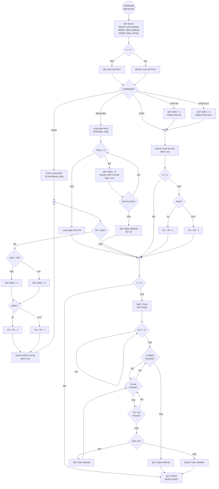

 # WD179X Datasheet: Type I Commands (Head Positioning)

## COMMAND SUMMARY

Type I commands are used for head positioning. They do not transfer data.

| COMMAND | BIT 7 | BIT 6 | BIT 5 | BIT 4 | BIT 3 | BIT 2 | BIT 1 | BIT 0 |
| :--- | :---: | :---: | :---: | :---: | :---: | :---: | :---: | :---: |
| RESTORE | 0 | 0 | 0 | 0 | h | V | r1 | r0 |
| SEEK | 0 | 0 | 0 | 1 | h | V | r1 | r0 |
| STEP | 0 | 0 | 1 | U | h | V | r1 | r0 |
| STEP-IN | 0 | 1 | 0 | U | h | V | r1 | r0 |
| STEP-OUT | 0 | 1 | 1 | U | h | V | r1 | r0 |

---

## TYPE I COMMAND FLAGS

### h — Head Load Flag (Bit 3)

*   **h = 1:** Head is loaded at the beginning of the command (HLD output set active)
*   **h = 0:** HLD is deactivated
*   **Note:** Once loaded, head remains engaged until:
    - A command specifically disengages it, OR
    - The device is idle for **15 disk revolutions** (~2.5 seconds at 360 RPM)

### V — Verify Flag (Bit 2)

*   **V = 1:** Verification is performed on destination track
*   **V = 0:** No verification performed

**Verification Process (V=1):**
1. Head is loaded (if not already)
2. Internal **15 ms** settling delay (30 ms if CLK = 1 MHz)
3. HLT input is sampled; wait for HLT = 1
4. Read first encountered ID field
5. Compare Track Register with ID field track address

**Verification Results:**
| Condition | CRC | Result |
| :--- | :--- | :--- |
| Track matches | Valid | Command complete, INTRQ set, Busy reset |
| Track mismatch | Valid | Seek Error (S4) set, INTRQ, Busy reset |
| Track matches | Invalid | CRC Error (S3) set, continue searching |
| Timeout (5 index pulses) | - | Seek Error set, INTRQ, Busy reset |

### U — Update Flag (Bit 4) — Step Commands Only

*   **U = 1:** Track Register is updated by +1 or -1 for each step (direction dependent)
*   **U = 0:** Track Register is not updated

### r1r0 — Stepping Rate (Bits 1-0)

See Stepping Rates table below.

---

## STEPPING RATES TABLE

| r1 | r0 | CLK=2MHz, TEST=1 | CLK=1MHz, TEST=1 | CLK=2MHz, TEST=0 | CLK=1MHz, TEST=0 |
| :---: | :---: | :---: | :---: | :---: | :---: |
| 0 | 0 | 3 ms | 6 ms | 184 µs | 368 µs |
| 0 | 1 | 6 ms | 12 ms | 190 µs | 380 µs |
| 1 | 0 | 10 ms | 20 ms | 198 µs | 396 µs |
| 1 | 1 | 15 ms | 30 ms | 208 µs | 416 µs |

**Notes:**
- All times are track-to-track stepping intervals
- Normal operation: TEST pin tied high (TEST=1)
- 1 MHz clock doubles all timing values
- TEST=0 provides accelerated stepping for testing only

---

## COMMAND DESCRIPTIONS

### RESTORE ($00-$0F)

**Purpose:** Position head to Track 0

**Operation:**
1. Sample TR00 input
2. If TR00 is active (Low): Load $00 into Track Register, generate INTRQ
3. If TR00 not active: Issue step pulses (direction OUT) at rate r1r0
4. Continue until TR00 goes active
5. If TR00 does not activate after **255 step pulses**: Set Seek Error (S4), generate INTRQ

**Track Register:** Loaded with $00 on completion (regardless of physical position)

### SEEK ($10-$1F)

**Purpose:** Position head to track specified in Data Register

**Prerequisite:** 
- Track Register must contain current track address
- Data Register must be loaded with desired track address

**Operation:**
1. Compare Track Register with Data Register
2. If equal: Command complete, INTRQ (verify if V=1)
3. If not equal: 
   - Determine direction (Data > Track = Step In; Data < Track = Step Out)
   - Issue step pulse
   - Update Track Register (+1 or -1)
   - Delay by r1r0 stepping rate
   - Repeat from step 1

**Track Register:** Updated to match Data Register on completion

### STEP ($20-$3F)

**Purpose:** Issue single step pulse in the last-used direction

**Operation:**
1. Issue one step pulse in the direction currently on DIRC
2. Delay by r1r0 stepping rate
3. If U=1: Update Track Register (+1 in, -1 out)
4. If V=1: Perform verify

**Note:** First STEP after power-up direction is undefined

### STEP-IN ($40-$5F)

**Purpose:** Step head one track toward center (higher track numbers)

**Operation:**
1. Set DIRC = 1 (direction IN)
2. Issue one step pulse
3. Delay by r1r0 stepping rate
4. If U=1: Increment Track Register
5. If V=1: Perform verify

**Track Register:** Incremented if U=1 (may exceed actual track limit)

### STEP-OUT ($60-$7F)

**Purpose:** Step head one track toward outside (lower track numbers)

**Operation:**
1. Set DIRC = 0 (direction OUT)
2. Issue one step pulse
3. Delay by r1r0 stepping rate
4. If U=1: Decrement Track Register
5. If V=1: Perform verify

**Track Register:** Decremented if U=1 (stops at 0, does not wrap)

---

## TYPE I COMMAND FLOW CHART

---

## TIMING NOTES

| Parameter | Value |
| :--- | :--- |
| DIRC setup before first STEP | 12 µs (minimum) |
| STEP pulse width (MFM) | 2 µs |
| STEP pulse width (FM) | 4 µs |
| Verify settling delay | 15 ms (30 ms @ 1 MHz, 0 ms if TEST=0) |
| ID search timeout | 5 index pulses |
| Max RESTORE pulses | 255 |
| Head unload timeout | 15 disk revolutions idle |
