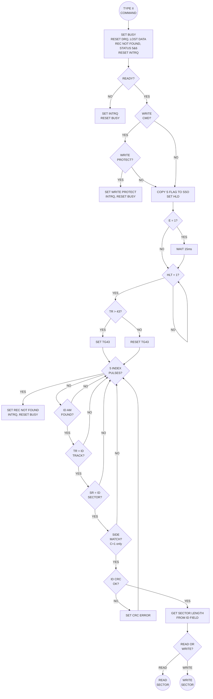
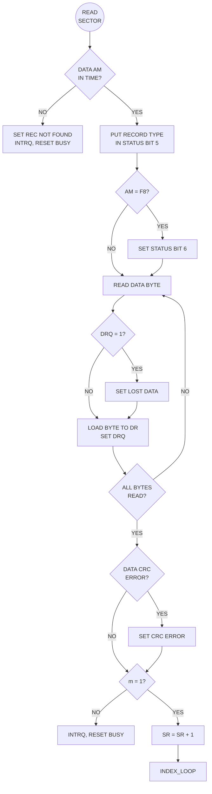
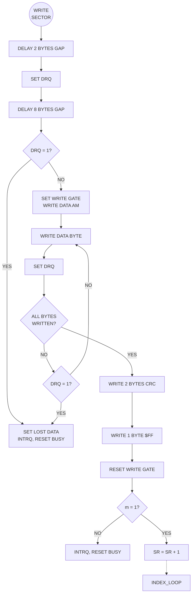

# WD179X Datasheet: Type II, III & IV Commands

## TYPE II COMMANDS — SECTOR READ/WRITE

### Command Format

| COMMAND | BIT 7 | BIT 6 | BIT 5 | BIT 4 | BIT 3 | BIT 2 | BIT 1 | BIT 0 |
| :---: | :---: | :---: | :---: | :---: | :---: | :---: | :---: | :---: |
| READ SECTOR | 1 | 0 | 0 | m | S/F2 | E | C/F1 | 0 |
| WRITE SECTOR | 1 | 0 | 1 | m | S/F2 | E | C/F1 | a0 |

### Type II Flags

| FLAG | BIT | DESCRIPTION |
| :---: | :---: | :--- |
| **m** | 4 | **Multiple Record:** 0 = Single sector, 1 = Multiple sectors (auto-increment SR) |
| **S** | 3 | **Side Select (1795/7):** Copied to SSO output at command start |
| **F2** | 3 | **Sector Length Flag (1791/3):** Not used (set to 0) |
| **E** | 2 | **15ms Delay:** 1 = 15ms delay after HLD before HLT sample, 0 = No delay |
| **C** | 1 | **Side Compare (1795/7):** 1 = Compare side number in ID field with S flag |
| **F1** | 1 | **Sector Length Flag (1791/3):** Not used (set to 0) |
| **a0** | 0 | **Data Address Mark (Write only):** 0 = FB (normal), 1 = F8 (deleted data) |

### Sector Length Encoding

#### WD1791/1793 (Sector Length in ID Field)

| ID FIELD VALUE | 00 | 01 | 02 | 03 |
| :--- | :---: | :---: | :---: | :---: |
| **Sector Size (bytes)** | 128 | 256 | 512 | 1024 |

#### WD1795/1797 (Using 'b' Flag)

| b FLAG | 00 | 01 | 10 | 11 |
| :---: | :---: | :---: | :---: | :---: |
| **0** | 256 | 512 | 1024 | 128 |
| **1** | 128 | 256 | 512 | 1024 |

---

## READ SECTOR ($80-$9F)

**Prerequisite:** Sector Register loaded with target sector number

**Operation:**
1. Set Busy, reset status bits, set HLD
2. If E=1: Wait 15 ms settling
3. Wait for HLT = 1
4. Set TG43 based on Track Register (>43 = high)
5. Search for ID field with matching Track, Sector (and Side if C=1)
6. If not found within **5 index pulses**: Set Record Not Found (S4), INTRQ
7. Validate ID field CRC; if error: Set CRC Error (S3), continue search
8. Wait for Data Address Mark (within **30 bytes FM / 43 bytes MFM**)
9. If no DAM found: Set Record Not Found, INTRQ
10. Record Data Address Mark type in Status Bit 5 (0=FB, 1=F8)
11. Read sector data, set DRQ for each byte
12. If host doesn't read before next byte: Set Lost Data (S2)
13. Validate data CRC; if error: Set CRC Error
14. If m=1: Increment SR, go to step 5
15. Reset Busy, set INTRQ

## WRITE SECTOR ($A0-$BF)

**Prerequisite:** Sector Register loaded with target sector number

**Operation:**
1. Set Busy, reset status bits
2. Check WPRT: If active, set Write Protect (S6), INTRQ, exit
3. Set HLD, copy S flag to SSO (1795/7)
4. If E=1: Wait 15 ms settling
5. Wait for HLT = 1
6. Search for matching ID field (same as Read)
7. If not found within **5 index pulses**: Set Record Not Found, INTRQ
8. Validate ID field CRC
9. Write **2 bytes** gap (delay)
10. Set DRQ for first data byte
11. Write **8 bytes** additional gap
12. If DRQ still set (no data): Set Lost Data, terminate
13. Set Write Gate, write Data Address Mark (FB or F8 per a0)
14. Write sector data from Data Register
15. For each byte: Set DRQ; if not serviced before next needed: Set Lost Data
16. Write 2 bytes CRC
17. Write 1 byte $FF (gap fill)
18. Reset Write Gate
19. If m=1: Increment SR, go to step 6
20. Reset Busy, set INTRQ

---

## TYPE II COMMAND FLOW CHART

---

## TYPE III COMMANDS — TRACK OPERATIONS

### Command Format

| COMMAND | BIT 7 | BIT 6 | BIT 5 | BIT 4 | BIT 3 | BIT 2 | BIT 1 | BIT 0 |
| :---: | :---: | :---: | :---: | :---: | :---: | :---: | :---: | :---: |
| READ ADDRESS | 1 | 1 | 0 | 0 | 0 | E | 0 | 0 |
| READ TRACK | 1 | 1 | 1 | 0 | 0 | E | 0 | 0 |
| WRITE TRACK | 1 | 1 | 1 | 1 | 0 | E | 0 | 0 |

### READ ADDRESS ($C0-$C3)

Reads the next ID field encountered and transfers to host via DR.

**Data Transferred (6 bytes):**
1. Track Address
2. Side Number
3. Sector Address
4. Sector Length
5. CRC byte 1
6. CRC byte 2

**On Completion:** Track Address is also copied to Sector Register

### READ TRACK ($E0-$E3)

Reads entire track content between index pulses.

**Operation:**
1. Wait for leading edge of Index Pulse
2. Read all data bytes until next Index Pulse
3. Transfer each byte via DR with DRQ
4. All gaps, address marks, data, and CRC bytes are transferred literally

**Note:** No address mark detection occurs—raw data stream is transferred.

### WRITE TRACK ($F0-$F3)

Formats entire track (write from index pulse to index pulse).

**Operation:**
1. Wait for DRQ service (first data byte)
2. Wait for Index Pulse
3. Set Write Gate
4. Write bytes from DR until next Index Pulse
5. Special control bytes trigger hardware actions (see Control Bytes table)

---

## TRACK FORMATTING CONTROL BYTES

| HEX VALUE | FM (Single Density) | MFM (Double Density) |
| :---: | :--- | :--- |
| **00–F4** | Write data byte literally | Write data byte literally |
| **F5** | — | **Write A1 with missing clock** (preset CRC) |
| **F6** | — | **Write C2 with missing clock** |
| **F7** | **Generate 2 CRC bytes** | **Generate 2 CRC bytes** |
| **F8–FB** | **Write Data Address Mark** (F8=deleted, FB=normal) | **Write Data Address Mark** |
| **FC** | **Write Index Address Mark** | **Write Index Address Mark** |
| **FD** | Write FD literally | Write FD literally |
| **FE** | **Write ID Address Mark** | **Write ID Address Mark** |
| **FF** | Write FF literally | Write FF literally |

**MFM Note:** For MFM, exactly **3 bytes of F5 ($A1)** must precede address marks.

---

## TYPE IV COMMAND — FORCE INTERRUPT

### Command Format

| COMMAND | BIT 7 | BIT 6 | BIT 5 | BIT 4 | BIT 3 | BIT 2 | BIT 1 | BIT 0 |
| :---: | :---: | :---: | :---: | :---: | :---: | :---: | :---: | :---: |
| FORCE INTERRUPT | 1 | 1 | 0 | 1 | I3 | I2 | I1 | I0 |

### Interrupt Condition Flags

| FLAG | BIT | CONDITION |
| :---: | :---: | :--- |
| **I0** | 0 | Interrupt when READY transitions from Not-Ready to Ready |
| **I1** | 1 | Interrupt when READY transitions from Ready to Not-Ready |
| **I2** | 2 | Interrupt at each Index Pulse |
| **I3** | 3 | **Immediate Interrupt** |

### Operation

*   **I3-I0 = 0000 ($D0):** Terminate current command **without** generating INTRQ. Resets Busy.
*   **I3-I0 ≠ 0000:** Generates INTRQ. If a command is in progress, terminates it.
*   **I3 = 1 ($D8):** Immediate interrupt. Terminates any command and generates INTRQ instantly.

**Special Use:** Force Interrupt $D0 is used to cleanly abort a multi-sector operation or exit polling mode without triggering an interrupt handler.

---

## READ/WRITE SECTOR SUB-FLOWS

### Read Sector Data Flow

### Write Sector Data Flow

---

## TIMING PARAMETERS

| PARAMETER | FM (Single Density) | MFM (Double Density) |
| :--- | :---: | :---: |
| Data AM search window | 30 bytes after ID CRC | 43 bytes after ID CRC |
| Byte time | 32 µs | 16 µs |
| ID field search timeout | 5 index pulses | 5 index pulses |
| 15ms delay (E=1) | 30 ms @ 1 MHz | 15 ms @ 2 MHz |
