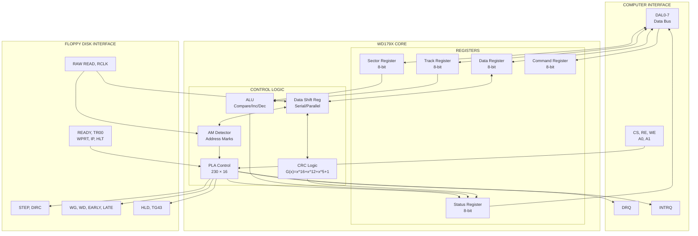
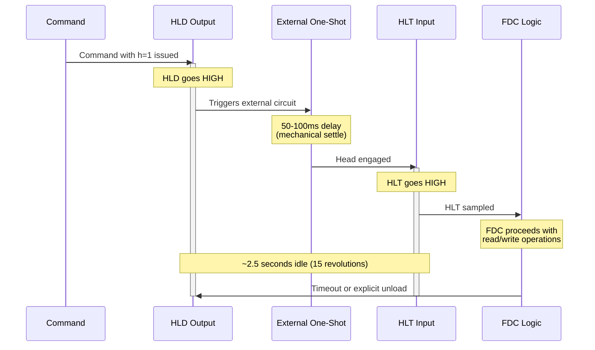
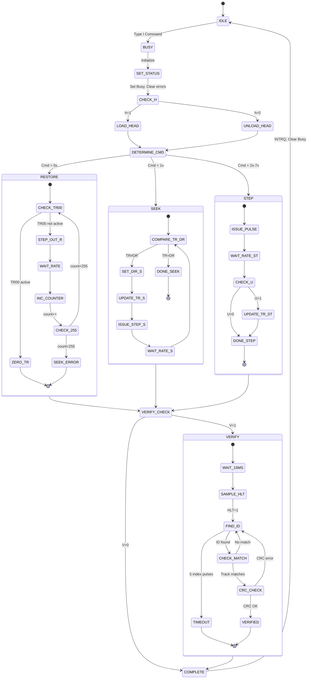
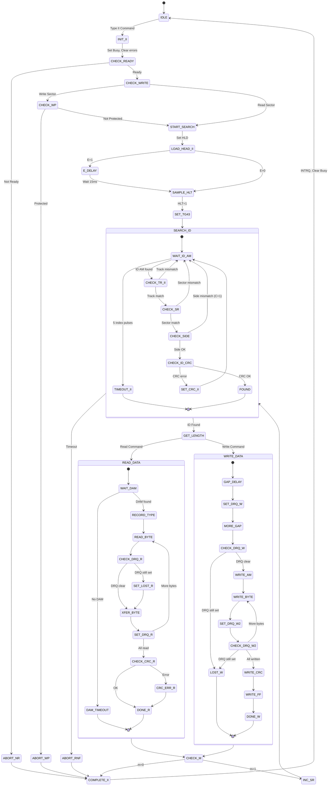
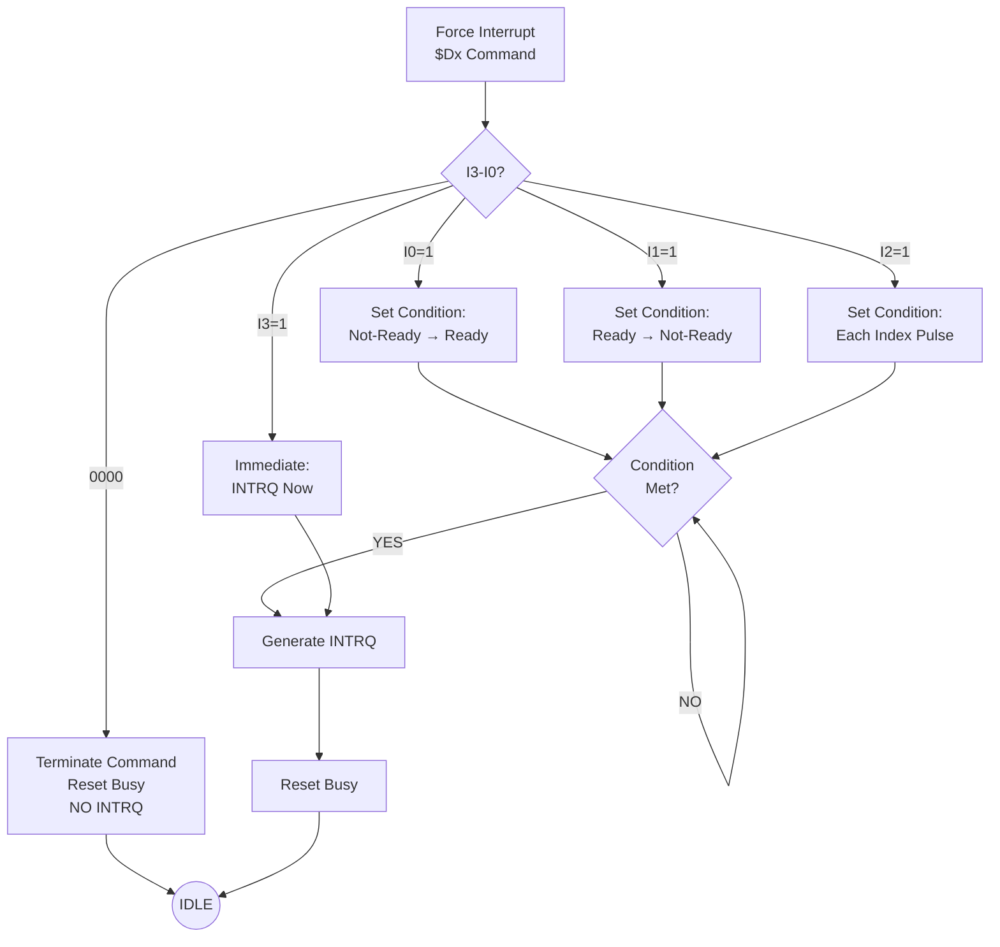
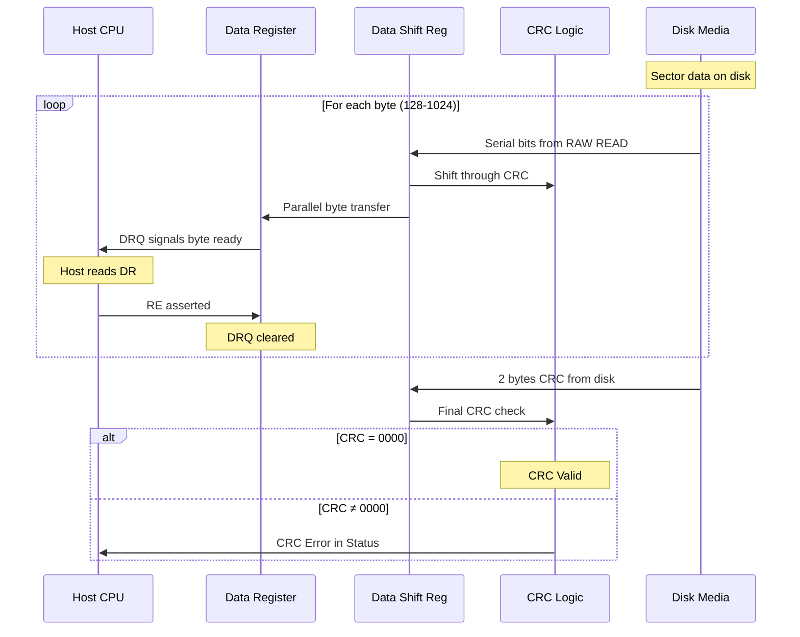
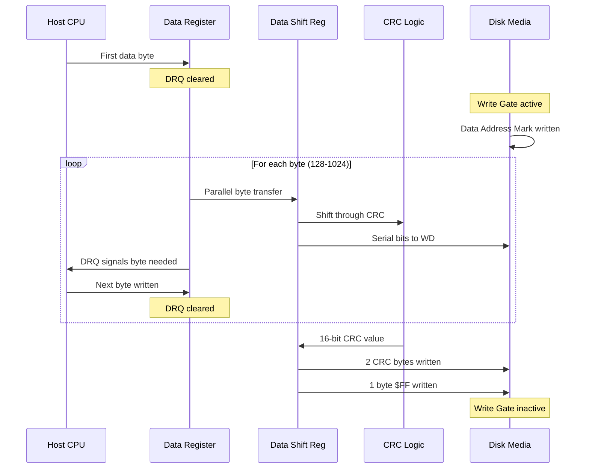

# WD179X Datasheet: Flow Diagrams

This document contains comprehensive Mermaid diagram representations of the WD179X internal logic and command flows.

## INTERNAL BLOCK DIAGRAM

---

## HEAD LOAD TIMING DIAGRAM

---

## TYPE I COMMAND STATE MACHINE

---

## TYPE II COMMAND STATE MACHINE

---

## FORCE INTERRUPT LOGIC

---

## DATA FLOW: SECTOR READ

---

## DATA FLOW: SECTOR WRITE

