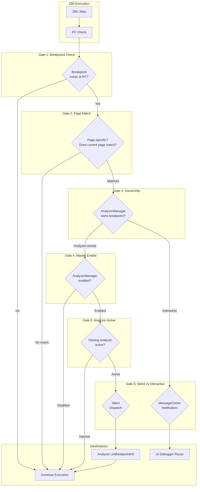
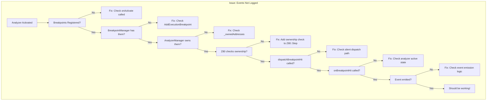

# WD1793 / TR-DOS Analyzer Capture Feature

Design document for a high-level analyzer that captures interactions between the host CPU and WD1793 + FDD subsystem, providing a realtime semantic log of TR-DOS disk operations.

---

## 1. Problem Statement

The current [WD1793Collector](core/src/emulator/io/fdc/wd1793_collector.h#15-143) provides **low-level port access logging** (every IN/OUT to FDC ports), which generates thousands of records per disk operation. This is valuable for hardware debugging but overwhelming for understanding *what the software is actually doing*.

**Goal**: Create a **Stage 1 (High-Level) Analyzer** that interprets the low-level FDC interactions and produces human-readable semantic events like:

```
- TR-DOS loader started (LOAD command)
- Loaded BASIC module (length 1234, start track 1, sector 10, sectors 3)
- Started standard module loader
- Loaded code module (length 5678, start track 1, sector 13, sectors 20)
- Non-standard loader detected (entry point #3D00)
- RESTORE
- SEEK track 5
- Read sector 1
- Read sector 2
- Exit TR-DOS ROM
```

---

## 2. Architecture Overview


### 2.1 Component Hierarchy

1. **`TRDOSAnalyzer`** (New) - High-level semantic analyzer
   - Implements `IAnalyzer` interface
   - Registers breakpoints at TR-DOS ROM entrypoints
   - Interprets state to produce semantic events

2. **`FDCEventInterpreter`** (New) - Command-level interpreter
   - Wraps [WD1793Collector](core/src/emulator/io/fdc/wd1793_collector.h#15-143) events
   - Converts low-level port accesses to command events
   - Tracks sector data flow

3. **`TRDOSEventLog`** (New) - Thread-safe event buffer
   - Stores semantic events with timestamps
   - Supports real-time subscription
   - Provides filtering and export

---

## 3. Event Types

### 3.1 High-Level Events (Stage 1 Output)

| Event Type | Description | Data Fields |
|:-----------|:------------|:------------|
| `TRDOS_ENTRY` | Entered TR-DOS ROM | Entry point address, Trigger (RST #8, CALL, etc.) |
| `TRDOS_EXIT` | Exited TR-DOS ROM | Exit address, Duration (T-states) |
| `COMMAND_START` | TR-DOS command started | Command type (LOAD, SAVE, CAT, RUN, FORMAT) |
| `FILE_OPERATION` | File loaded/saved | Filename, Type (B/C/D/#), Length, Start track/sector, Sector count |
| `MODULE_LOAD` | Code module loaded | Module type (BASIC/CODE/SCREEN), Start address, Length |
| `LOADER_DETECTED` | Non-standard loader detected | Entry point, Classification |
| `FDC_CMD_TYPE_I` | RESTORE/SEEK/STEP command | Command, From Track, To Track, Flags (h/V/r1r0) |
| `FDC_CMD_READ_SECTOR` | Read Sector start→complete | Track, Sector, Side, Status, **Sector Data (256 bytes)** |
| `FDC_CMD_WRITE_SECTOR` | Write Sector start→complete | Track, Sector, Side, Status, **Sector Data (256 bytes)** |
| `FDC_CMD_READ_ADDRESS` | Read Address command | Track, Side, ID Field (C/H/R/N), Status |
| `FDC_CMD_READ_TRACK` | Read Track command | Track, Side, Status |
| `FDC_CMD_WRITE_TRACK` | Write Track (FORMAT) | Track, Side, Status, **Track Data (6250 bytes, optional)** |
| `FDC_CMD_FORCE_INT` | Force Interrupt | Condition flags (I3-I0), Previous command interrupted |
| `ERROR` | Error occurred | Error type (CRC/RNF/Lost Data/Write Protect), FDC Status, Context |

> **Note**: Sector/Track data is captured as a **complete dump** at operation completion, not per-byte during transfer. This provides full data for analysis while keeping event count manageable.

### 3.2 Event Structure

Every event includes **common context fields** for full execution traceability:

```cpp
struct BankMapping {
    uint8_t pageNumber;      // Physical page number (0-255)
    uint8_t isROM;           // 1=ROM, 0=RAM
};  // 2 bytes per bank, 8 bytes total

struct EventContext {
    // Instruction context
    uint16_t m1_pc;              // Current M1 Program Counter
    uint16_t callerAddress;      // Immediate return address from stack (SP)
    std::vector<uint16_t> stackTrace;  // Full trace up to RAM caller
    uint16_t originalRAMCaller;  // First non-ROM address in stack (user code entry)
    
    // Full Z80 bank mapping (4× 16KB slots) - 4 bytes total
    std::array<BankMapping, 4> banks;  // [0]=$0000-$3FFF, [1]=$4000-$7FFF, [2]=$8000-$BFFF, [3]=$C000-$FFFF
    
    // Names derived on-demand, not stored
    std::string bankNameAtPC() const;  // e.g., "ROM:TR-DOS", "RAM:5"
    bool isInROM() const { return banks[m1_pc >> 14].isROM; }
};

struct TRDOSEvent {
    // Timing
    uint64_t timestamp;          // T-state counter
    uint32_t frameNumber;        // Video frame for temporal context
    
    // Classification
    EventType type;              // Event classification
    EventSeverity severity;      // INFO, WARNING, ERROR
    
    // Execution context (always populated)
    EventContext context;        // M1 PC, caller, stack trace, banks
    
    // Event-specific data
    std::variant<
        TRDOSEntryData,
        FileOperationData,
        FDCCommandData,
        SectorTransferData,
        LoaderDetectionData,
        ErrorData
    > data;
    
    std::string format() const;  // Human-readable representation
};
```

#### Stack Trace Capture Strategy

```cpp
// Capture stack from current SP up to first RAM caller
std::vector<uint16_t> captureStackTrace(Z80& cpu, Memory& mem) {
    std::vector<uint16_t> trace;
    uint16_t sp = cpu.sp;
    
    // Walk stack, max 16 entries
    for (int i = 0; i < 16 && sp < 0xFFFE; i++) {
        uint16_t retAddr = mem.DirectReadWord(sp);
        trace.push_back(retAddr);
        sp += 2;
        
        // Stop when we reach RAM code (user program)
        if (retAddr >= 0x4000 && retAddr < 0xC000) {
            break;  // Found original RAM caller
        }
    }
    return trace;
}
```

> **Rationale**: The stack trace allows reconstructing the call path from user code → TR-DOS ROM → FDC access, critical for understanding which routine initiated the disk operation.

---

## 4. Detection Mechanisms

### 4.1 TR-DOS ROM Entrypoints (Breakpoint Addresses)

#### TR-DOS ROM

| Address | Label | Purpose | Detection Strategy |
|:--------|:------|:--------|:-------------------|
| `$3D00` | TR-DOS Entry | Main entry from RST #8 | Execution breakpoint |
| `$3D0B` | Command Dispatch | After command parsing | Monitor A register |
| `$1EC2` | FORMAT | Format command handler | Mark command type |
| `$1F32` | CAT | Catalog command | Mark command type |
| `$0000` (DoTR) | LOAD/SAVE/etc | Standard DOS commands | Parse BASIC line |
| `$0077` | RST #8 Return | Standard exit point | Mark TR-DOS exit |

#### SOSROM (48K BASIC ROM) - Printing and Error Handling

| Address | Label | Purpose | Detection Strategy |
|:--------|:------|:--------|:-------------------|
| `$0008` | RST $08 | Error handler entry | Capture error code in register B |
| `$0010` | RST $10 | Print character | Capture character in register A |
| `$0D6B` | CLS | Clear screen | Detect screen operations |
| `$0DAF` | CLS-LOWER | Clear lower screen | Detect status messages |
| `$1601` | PRINT-OUT | Print routine | Capture print stream |
| `$1FCF` | REPORT-CODE | Error report | Capture error code and message |
| `$0F2C` | PRINT-A-1 | Print A register as char | Capture output |

> **Note**: These SOSROM entrypoints help correlate TR-DOS operations with user-visible feedback (catalog listings, error messages, status updates).

### 4.2 Standard Loader Detection

```
Heuristics for "Standard TR-DOS Loader":
1. Entry via RST #8 → $3D00
2. Follows standard sector read pattern:
   - Read catalog sectors (Track 0, Sectors 1-8)
   - Read file sectors sequentially
3. Exits cleanly via Return (#0077 or JP outside ROM)

Classification: STANDARD_LOADER
```

### 4.3 Non-Standard Loader Detection

```
Heuristics for "Non-Standard Loader":
1. Direct FDC port access without RST #8
2. Unusual sector read patterns:
   - Out-of-order sectors
   - Custom timing loops
   - Direct Status Register polling without ROM calls
3. Code execution from loaded sectors

Classification: CUSTOM_LOADER with entry point annotation
```

### 4.4 File Type Classification

| Byte | Type | Description |
|:-----|:-----|:------------|
| `B` | BASIC | BASIC program |
| `C` | CODE | Machine code (headerless) |
| `D` | DATA | Data array |
| `#` | SCREEN$ | Screen snapshot |
| `N` | Numbers | Numeric array |

Extract from catalog entry at offset `0x08` (type byte).

---

## 5. Implementation Phases

### Phase 1: Core Framework (Current Scope)

- [ ] Create `TRDOSAnalyzer` class implementing `IAnalyzer`
- [ ] Define `TRDOSEvent` structure and event types
- [ ] Implement breakpoint registration for key ROM addresses
- [ ] Create `TRDOSEventLog` for event storage and subscription

### Phase 2: TR-DOS Command Recognition

- [ ] Detect TR-DOS entry/exit transitions
- [ ] Parse command types from BASIC line buffer
- [ ] Extract filename and parameters from system variables
- [ ] Track file operation progress (sectors loaded)

### Phase 3: FDC Command Interpretation

- [ ] Hook into [WD1793Collector](core/src/emulator/io/fdc/wd1793_collector.h#15-143) for low-level events
- [ ] Aggregate port accesses into semantic FDC commands
- [ ] Track sector data flow (read/write byte counts)
- [ ] Detect head movement and seek patterns

### Phase 4: Loader Classification

- [ ] Implement standard loader detection heuristics
- [ ] Detect non-standard loader entry patterns
- [ ] Track execution flow after sector loads
- [ ] Annotate custom loader entry points

### Phase 5: Real-Time UI Integration

- [ ] Create signal/slot interface for Qt UI
- [ ] Implement scrolling log widget
- [ ] Add filtering by event type/severity
- [ ] Support export to file (CSV, JSON)

---

## 6. Source Files

### 6.1 New Files to Create

| File | Purpose |
|:-----|:--------|
| `core/src/debugger/analyzers/trdosanalyzer.h` | TRDOSAnalyzer class declaration |
| `core/src/debugger/analyzers/trdosanalyzer.cpp` | TRDOSAnalyzer implementation |
| `core/src/debugger/analyzers/trdosevent.h` | Event types and structures |
| `core/src/debugger/analyzers/trdoseventlog.h` | Event logging infrastructure |
| `core/src/debugger/analyzers/trdoseventlog.cpp` | Event log implementation |
| `core/src/debugger/analyzers/fdcinterpreter.h` | FDC command interpreter |
| `core/src/debugger/analyzers/fdcinterpreter.cpp` | FDC interpreter implementation |

### 6.2 Existing Files to Modify

| File | Changes |
|:-----|:--------|
| `core/src/debugger/analyzers/CMakeLists.txt` | Add new source files |
| [core/src/emulator/io/fdc/wd1793.cpp](core/src/emulator/io/fdc/wd1793.cpp) | Add optional analyzer callback |
| `unreal-qt/mainwindow.cpp` | Add analyzer menu item (Phase 5) |

### 6.3 Infrastructure Assessment

> [!NOTE]
> **Codebase review updated (2026-01-21)**. Required infrastructure **already exists** on this branch.

#### ✅ Available: IAnalyzer Interface

[ianalyzer.h](core/src/debugger/analyzers/ianalyzer.h) provides:

```cpp
class IAnalyzer {
public:
    virtual void onActivate(AnalyzerManager* mgr) = 0;
    virtual void onDeactivate() = 0;
    virtual void onFrameStart() {}
    virtual void onFrameEnd() {}
    virtual void onBreakpointHit(uint16_t address, Z80* cpu) {}
    virtual std::string getName() const = 0;
    virtual std::string getUUID() const = 0;
};
```

#### ✅ Available: AnalyzerManager

[analyzermanager.h](core/src/debugger/analyzers/analyzermanager.h) provides:

| Feature | Status | Method |
|:--------|:-------|:-------|
| Analyzer registration | ✅ | `registerAnalyzer(id, analyzer)` |
| Activation control | ✅ | `activate(id)`, `deactivate(id)` |
| Execution breakpoints | ✅ | `requestExecutionBreakpoint(addr, id)` |
| Memory watchpoints | ✅ | `requestMemoryBreakpoint(addr, r, w, id)` |
| CPU step hooks | ✅ | `subscribeCPUStep(fn, ctx, id)` |
| Memory read/write hooks | ✅ | `subscribeMemoryRead/Write(fn, ctx, id)` |
| Frame events | ✅ | `dispatchFrameStart()`, `dispatchFrameEnd()` |
| Auto-cleanup on deactivate | ✅ | Breakpoints + subscriptions cleared |
| Master enable/disable | ✅ | `setEnabled(bool)` |

#### ✅ Available: Reference Implementation

[ROMPrintDetector](core/src/debugger/analyzers/rom-print/romprintdetector.h) is an **existing working analyzer** that:
- Sets breakpoints at ROM addresses (`$0010`, `$09F4`, `$15F2`)
- Captures data on `onBreakpointHit()`
- Provides query API (`getNewOutput()`, `getFullHistory()`, `getLines()`)
- Implements `clear()` for buffer management

**This is the pattern TRDOSAnalyzer should follow.**

#### ⚠️ Missing: Port Access Hooks

`AnalyzerManager` does **not** currently expose port I/O callbacks. Required for FDC monitoring:

```cpp
// Needed in AnalyzerManager:
CallbackId subscribePortRead(
    void (*fn)(void* ctx, uint8_t port, uint8_t value),
    void* context,
    const std::string& analyzerId
);

CallbackId subscribePortWrite(
    void (*fn)(void* ctx, uint8_t port, uint8_t value),
    void* context,
    const std::string& analyzerId
);

void dispatchPortRead(uint8_t port, uint8_t value);
void dispatchPortWrite(uint8_t port, uint8_t value);
```

**Alternative**: Use WD1793 observer pattern (see below).

#### ⚠️ Missing: WD1793 Observer Interface

**Design Decision**: Create separate `IWD1793Observer` interface (not mixed with WD1793Collector).

**Rationale**:
- Clean separation of observer pattern from storage
- Multiple observers can subscribe simultaneously
- Reusable for future analyzers (format detector, protection scanner)
- TRDOSAnalyzer controls its own storage (`RingBuffer<T>`)
- WD1793Collector remains unchanged for legacy file dumps

**Implementation**:

```cpp
// New file: core/src/emulator/io/fdc/iwd1793observer.h
#pragma once
#include <cstdint>

class WD1793;

class IWD1793Observer {
public:
    virtual ~IWD1793Observer() = default;
    
    /// Called when FDC command is issued (port $1F write)
    virtual void onFDCCommand(uint8_t command, const WD1793& fdc) {}
    
    /// Called on any FDC port access
    virtual void onFDCPortAccess(uint8_t port, uint8_t value, bool isWrite, const WD1793& fdc) {}
    
    /// Called when command completes (INTRQ raised)
    virtual void onFDCCommandComplete(uint8_t status, const WD1793& fdc) {}
};
```

**WD1793 Modifications** (~15 LOC):

```cpp
// In wd1793.h, add:
#include "iwd1793observer.h"

private:
    std::vector<IWD1793Observer*> _observers;

public:
    void addObserver(IWD1793Observer* obs) { _observers.push_back(obs); }
    void removeObserver(IWD1793Observer* obs) { 
        _observers.erase(std::remove(_observers.begin(), _observers.end(), obs), _observers.end()); 
    }

// In processWD93Command(), after existing collector call:
for (auto* obs : _observers) obs->onFDCCommand(value, *this);

// In command completion path:
for (auto* obs : _observers) obs->onFDCCommandComplete(_statusRegister, *this);

// In port access handlers:
for (auto* obs : _observers) obs->onFDCPortAccess(port, value, isWrite, *this);
```

**TRDOSAnalyzer Usage**:

```cpp
class TRDOSAnalyzer : public IAnalyzer, public IWD1793Observer {
    void onActivate(AnalyzerManager* mgr) override {
        _fdc->addObserver(this);  // Subscribe to FDC events
        mgr->requestExecutionBreakpoint(0x3D00, getUUID());  // TR-DOS entry
    }
    
    void onDeactivate() override {
        _fdc->removeObserver(this);
    }
    
    void onFDCCommand(uint8_t cmd, const WD1793& fdc) override {
        _rawBuffer.push(RawEvent{...});  // Capture to ring buffer
    }
    
    void onFDCCommandComplete(uint8_t status, const WD1793& fdc) override {
        aggregateAndEmit();  // Convert raw → semantic
    }
};
```

#### ⚠️ Missing: Thread-Safe RingBuffer

Required for bounded event storage. See Section 14.5 for spec.

```cpp
// New file: core/src/common/ringbuffer.h
template<typename T>
class RingBuffer {
    void push(T&& event);
    std::vector<T> getSince(uint64_t timestamp) const;
    void clear();
    // ... (see Section 14.5)
};
```

#### Summary: Remaining Work

| Component | Status | Effort |
|:----------|:-------|:-------|
| `IAnalyzer` | ✅ Exists | - |
| `AnalyzerManager` | ✅ Exists | - |
| Reference analyzer (`ROMPrintDetector`) | ✅ Exists | - |
| `IWD1793Observer` interface + WD1793 mods | ⚠️ Create | ~45 LOC |
| `RingBuffer<T>` | ⚠️ Create | ~150 LOC |
| `TRDOSAnalyzer` | ⚠️ Create | ~500 LOC |

**Conclusion**: Infrastructure is **mostly ready**. Only minor additions needed before TRDOSAnalyzer implementation.

---

## 7. Key TR-DOS System Variables

The analyzer will read these memory locations to understand TR-DOS state:

| Address | Name | Purpose |
|:--------|:-----|:--------|
| `$5C3C` | PROG | Start of BASIC program |
| `$5C59` | E_LINE | Address of command being interpreted |
| `$5CD1` | FILENAME | Current filename buffer |
| `$5CD7` | NUM_TRACKS | Number of tracks on current disk |
| `$5CDA` | DS_FLAG | Double-sided flag |
| `$5CE6` | INTERLEAVE | Sector interleave table pointer |
| `$5CF6` | DRIVE_NUM | Current drive number (0-3) |

---

## 8. Example Output

```
[0001234] TR-DOS Entry (RST #8 from $8000)
[0001456] Command: LOAD "game"
[0002100] Reading catalog (Track 0, Sectors 1-8)
[0003500] File found: "game    " Type:B Length:12345 Start:T01/S10
[0003890] Loading BASIC module (12345 bytes, 49 sectors from T01/S10)
[0015234] BASIC loaded successfully
[0015300] Module loader detected: Starting CODE section
[0015890] Loading CODE module (24567 bytes, 96 sectors from T04/S01)
[0045670] CODE loaded to $8000
[0045780] *** Non-standard loader detected (entry: $8000) ***
[0046000] Exit standard TR-DOS (returning to user code)
[0050000] [CUSTOM] FDC: RESTORE
[0050500] [CUSTOM] FDC: SEEK Track 10
[0051000] [CUSTOM] Read sector T10/S01 (256 bytes)
[0052000] [CUSTOM] Read sector T10/S02 (256 bytes)
[0053000] [CUSTOM] Read sector T10/S03 (256 bytes)
[0055000] Exit TR-DOS ROM (JP $C000)
```

---

## 9. Design Decisions

### 9.1 Why Separate from WD1793Collector?

| Aspect | WD1793Collector | TRDOSAnalyzer |
|:-------|:----------------|:--------------|
| **Level** | Hardware | Application |
| **Granularity** | Every port access | Semantic events |
| **Use Case** | FDC debugging | Software analysis |
| **Performance** | Hot path | Breakpoint-triggered |
| **Output Size** | ~10K records/FORMAT | ~20 events/FORMAT |

### 9.2 Breakpoint vs Hot-Path Monitoring

For Phase 1, use **breakpoint-based monitoring** at ROM entrypoints rather than hot-path CPU step callbacks. This minimizes performance impact and leverages the existing `AnalyzerManager` infrastructure.

### 9.3 Event Buffering Strategy

Use a **ring buffer with configurable size** (default 10K events) to prevent unbounded memory growth during long emulation sessions. Older events are evicted FIFO when the buffer fills.

---

## 10. Implementation Status

> **Last Updated**: 2026-01-22

### 10.1 Completed (Phase 1 + Phase 2)

| Component | Status | Location |
|:----------|:-------|:---------|
| `IWD1793Observer` | ✅ Done | [iwd1793observer.h](core/src/emulator/io/fdc/iwd1793observer.h) |
| `RingBuffer<T>` | ✅ Done | [ringbuffer.h](core/src/common/ringbuffer.h) |
| WD1793 Observer Support | ✅ Done | [wd1793.h](core/src/emulator/io/fdc/wd1793.h) |
| `TRDOSEvent` types | ✅ Done | [trdosevent.h](core/src/debugger/analyzers/trdos/trdosevent.h) |
| `TRDOSAnalyzer` class | ✅ Done | [trdosanalyzer.h/cpp](core/src/debugger/analyzers/trdos/) |
| `AnalyzerManager` | ✅ Done | [analyzermanager.cpp](core/src/debugger/analyzers/analyzermanager.cpp) |
| Page-Specific Breakpoints | ✅ Done | `requestExecutionBreakpointInPage()` |
| Silent Dispatch Pattern | ✅ Done | Analyzer breakpoints bypass MessageCenter |
| Auto-Feature Enable | ✅ Done | `ensureDebugFeaturesEnabled()` |
| CLI `analyzer` commands | ✅ Done | [cli-processor-analyzer-mgr.cpp](core/automation/cli/src/commands/cli-processor-analyzer-mgr.cpp) |
| DebugManager registration | ✅ Done | [debugmanager.cpp](core/src/debugger/debugmanager.cpp) |
| Integration Tests | ✅ Done | [analyzermanager_integration_test.cpp](core/tests/debugger/analyzermanager/analyzermanager_integration_test.cpp) |
| Unit Tests | ✅ Done | [analyzermanager_test.cpp](core/tests/debugger/analyzermanager/analyzermanager_test.cpp) |

### 10.2 CLI Commands Available

```
analyzer list                   - List all registered analyzers
analyzer enable <name>          - Activate (e.g., analyzer enable trdos)
analyzer disable <name>         - Deactivate
analyzer status [<name>]        - Show state + stats
analyzer <name> events [--limit=N] - Get captured events
analyzer <name> clear           - Clear event buffer
```

### 10.3 Remaining Work

- [x] Phase 3: Verification with real TR-DOS operations (covered by integration tests)
- [ ] Phase 4: Qt UI panel integration (deferred)
- [ ] Future: Optional sector data capture (`--capture-data` flag)
- [ ] Future: WebSocket streaming endpoint

---

## 11. User Review Required

> [!IMPORTANT]
> **Scope Clarification**: Is Phase 1 (Core Framework + Basic Events) the target, or should all 5 phases be in the initial implementation?

> [!IMPORTANT]
> **Non-Standard Loader Heuristics**: The detection of custom loaders relies on pattern matching. Should we focus on:
> - A) Simple detection (just flag "non-standard" with entry point)
> - B) Advanced classification (attempt to identify known loader types)

> [!IMPORTANT]
> **Real-Time UI Priority**: Should Phase 5 (Qt UI integration) be included in the initial scope, or is console/file-based logging sufficient for the first iteration?

---

## 11. Event Completeness Assessment

### 11.1 Current Event List Review

The proposed 11 event types cover the essential disk operations. Let me assess gaps:

| Event Type | Coverage | Missing Aspects |
|:-----------|:---------|:----------------|
| `TRDOS_ENTRY` | ✅ Good | Consider adding: caller context (from user code vs chained) |
| `TRDOS_EXIT` | ✅ Good | Consider: exit reason (RET, JP, interrupt) |
| `COMMAND_START` | ✅ Good | LOAD/SAVE/RUN/CAT/FORMAT covers typical usage |
| `FILE_OPERATION` | ✅ Good | - |
| `MODULE_LOAD` | ✅ Good | - |
| `LOADER_DETECTED` | ✅ Good | - |
| `FDC_COMMAND` | ⚠️ Partial | Split into Type I/II/III for clarity? |
| `SECTOR_READ` | ✅ Good | - |
| `SECTOR_WRITE` | ✅ Good | - |
| `HEAD_MOVE` | ✅ Good | Consider: step count, direction |
| `ERROR` | ⚠️ Vague | Need specific error subtypes |

### 11.2 Suggested Additions

| Event Type | Description | Rationale |
|:-----------|:------------|:----------|
| `CATALOG_ACCESS` | Reading/writing catalog sectors | Common pattern worth highlighting |
| `DISK_CHANGE` | Disk inserted/ejected | Drive state change |
| `DRIVE_SELECT` | Drive A/B/C/D selected | Multi-drive operations |
| `FORMAT_PROGRESS` | Track formatted | Long operation progress |
| `INDEX_PULSE` | Rotation detected | Timing reference for custom loaders |
| `WRITE_PROTECT` | Write protect encountered | Error cause |

### 11.3 Recommended Final Event Set (13 types)

```cpp
enum class TRDOSEventType : uint8_t {
    // ROM-level events
    TRDOS_ENTRY,        // Entered TR-DOS ROM
    TRDOS_EXIT,         // Exited TR-DOS ROM
    COMMAND_START,      // TR-DOS command recognized
    
    // File-level events
    FILE_FOUND,         // File located in catalog
    FILE_LOAD_START,    // File loading started
    FILE_LOAD_COMPLETE, // File loading finished
    FILE_SAVE_COMPLETE, // File saved
    
    // FDC-level events
    FDC_COMMAND,        // Any FDC command issued
    SECTOR_TRANSFER,    // Sector read/write completed
    HEAD_SEEK,          // Head movement
    
    // Detection events
    LOADER_DETECTED,    // Custom loader identified
    
    // Status events
    ERROR,              // Any error condition
    DRIVE_STATUS,       // Drive/disk state change
};
```

---

## 12. Low-Level Capture Mapping

This section maps each high-level event to its low-level capture mechanism.

### 12.1 Capture Source Types

| Source | Mechanism | Overhead | Use Case |
|:-------|:----------|:---------|:---------|
| **Execution Breakpoint** | `BreakpointManager::AddExecutionBreakpoint()` | Low | ROM entrypoints |
| **Memory Breakpoint** | `BreakpointManager::AddMemoryBreakpoint()` | Low | System variable changes |
| **Port I/O Hook** | `WD1793Collector` callbacks | Medium | FDC register access |
| **FDC State Change** | `WD1793` internal callbacks | Low | Command start/end |
| **Memory Read** | Direct read via `Memory::DirectReadFromZ80Memory()` | None | State inspection |

### 12.2 Event-to-Capture Mapping

#### TRDOS_ENTRY
| Capture | Address/Port | Trigger | Data Extracted |
|:--------|:-------------|:--------|:---------------|
| Exec BP | `$3D00` | PC hit | Entry point confirmed |
| Exec BP | `$3D13` | Alternate entry | Via JP table |
| Memory Read | `SP` | On entry | Return address (caller) |
| Memory Read | Bank state | On entry | ROM/RAM page configuration |

#### TRDOS_EXIT
| Capture | Address/Port | Trigger | Data Extracted |
|:--------|:-------------|:--------|:---------------|
| Exec BP | `$0077` | Standard RET | Clean exit |
| Memory BP | PC leaves `$3D00-$3FFF` | Range exit | Abnormal/JP exit |
| Port Read | `$FF` status check | Before exit | Final FDC state |

#### COMMAND_START
| Capture | Address/Port | Trigger | Data Extracted |
|:--------|:-------------|:--------|:---------------|
| Exec BP | `$3D21` | Command dispatch | `A` register = command code |
| Memory Read | `$5CD1-$5CD8` | After dispatch | Filename (8 chars) |
| Memory Read | `$5C3C` | Context | BASIC program pointer |

#### FDC_COMMAND
| Capture | Address/Port | Trigger | Data Extracted |
|:--------|:-------------|:--------|:---------------|
| Port OUT | `$1F` (Command) | Write | Command byte, flags |
| Port Read | `$3F` (Track) | Before cmd | Target track |
| Port Read | `$5F` (Sector) | Before cmd | Target sector |
| Port Read | `$FF` (System) | Before cmd | Drive, side, density |

#### SECTOR_TRANSFER
| Capture | Address/Port | Trigger | Data Extracted |
|:--------|:-------------|:--------|:---------------|
| Port IN/OUT | `$7F` (Data) | 256x access | Byte count |
| FDC Callback | Command complete | INTRQ raised | Status, CRC result |
| State Read | Track/Sector regs | After complete | Physical location |

#### HEAD_SEEK
| Capture | Address/Port | Trigger | Data Extracted |
|:--------|:-------------|:--------|:---------------|
| Port OUT | `$1F` | Type I cmd | RESTORE/SEEK/STEP |
| FDC State | `_trackRegister` | Before/after | From/to track |
| FDC Signal | `TR00` | On restore | Track 0 reached |

#### LOADER_DETECTED
| Capture | Address/Port | Trigger | Data Extracted |
|:--------|:-------------|:--------|:---------------|
| Exec BP | User code after load | PC in RAM | Entry point |
| Port OUT | `$1F` from RAM | Non-ROM caller | Direct FDC access |
| Pattern | Unusual sector sequence | Heuristic | Classification |

#### ERROR
| Capture | Address/Port | Trigger | Data Extracted |
|:--------|:-------------|:--------|:---------------|
| Port IN | `$1F` (Status) | Error bits set | CRC/RNF/Lost Data |
| FDC State | `_status` | On complete | Specific error |
| Memory Read | Error handler | ROM routine | Error context |

### 12.3 Complete Breakpoint Address Table

```cpp
// TR-DOS ROM Breakpoints (all in $3D00-$3FFF range)
constexpr uint16_t BP_TRDOS_ENTRY       = 0x3D00;  // Main entry
constexpr uint16_t BP_TRDOS_DISPATCH    = 0x3D21;  // Command dispatch
constexpr uint16_t BP_TRDOS_LOAD        = 0x3D2F;  // LOAD handler
constexpr uint16_t BP_TRDOS_SAVE        = 0x3D5A;  // SAVE handler
constexpr uint16_t BP_TRDOS_CAT         = 0x3D6F;  // CAT handler
constexpr uint16_t BP_TRDOS_FORMAT      = 0x1EC2;  // FORMAT entry
constexpr uint16_t BP_TRDOS_EXIT_RET    = 0x0077;  // RST #8 return
constexpr uint16_t BP_TRDOS_SECTOR_READ = 0x3E17;  // Sector read routine
constexpr uint16_t BP_TRDOS_SECTOR_WRITE= 0x3E3E;  // Sector write routine

// SOSROM (48K BASIC ROM) - Printing and Error Handling
constexpr uint16_t BP_SOSROM_ERROR      = 0x0008;  // RST $08 - Error handler
constexpr uint16_t BP_SOSROM_PRINT_CHAR = 0x0010;  // RST $10 - Print character
constexpr uint16_t BP_SOSROM_CLS        = 0x0D6B;  // Clear screen
constexpr uint16_t BP_SOSROM_CLS_LOWER  = 0x0DAF;  // Clear lower screen
constexpr uint16_t BP_SOSROM_PRINT_A    = 0x0F2C;  // Print A register as char
constexpr uint16_t BP_SOSROM_PRINT_OUT  = 0x1601;  // Print routine
constexpr uint16_t BP_SOSROM_REPORT     = 0x1FCF;  // Error report code

// FDC Ports (monitored via WD1793Collector)
constexpr uint8_t PORT_FDC_COMMAND = 0x1F;
constexpr uint8_t PORT_FDC_TRACK   = 0x3F;
constexpr uint8_t PORT_FDC_SECTOR  = 0x5F;
constexpr uint8_t PORT_FDC_DATA    = 0x7F;
constexpr uint8_t PORT_BETA128     = 0xFF;
```

---

## 13. Aggregation Flow and State Machine

### 13.1 Two-Stage Pipeline

```
┌────────────────────────────────────────────────────────────────────┐
│                         LOW-LEVEL CAPTURE                          │
│  ┌─────────┐  ┌─────────┐  ┌─────────┐  ┌─────────┐  ┌─────────┐   │
│  │ Exec BP │  │ Mem BP  │  │Port I/O │  │FDC State│  │Mem Read │   │
│  └────┬────┘  └────┬────┘  └────┬────┘  └────┬────┘  └────┬────┘   │
│       │            │            │            │            │        │
│       v            v            v            v            v        │
│  ┌─────────────────────────────────────────────────────────────┐   │
│  │                    RawEvent Queue                           │   │
│  │         (Ring buffer, ~64KB, short-lived)                   │   │
│  └──────────────────────────┬──────────────────────────────────┘   │
└─────────────────────────────┼──────────────────────────────────────┘
                              │
                              v
┌────────────────────────────────────────────────────────────────────┐
│                      AGGREGATION STATE MACHINE                     │
│                                                                    │
│  ┌─────────────┐    ┌─────────────┐    ┌─────────────┐             │
│  │   IDLE      │───>│ IN_TRDOS    │───>│ IN_COMMAND  │             │
│  └─────────────┘    └──────┬──────┘    └──────┬──────┘             │
│        ^                   │                  │                    │
│        │                   v                  v                    │
│        │           ┌─────────────┐    ┌─────────────┐              │
│        │           │ IN_TRANSFER │───>│ COMPLETING  │              │
│        │           └─────────────┘    └──────┬──────┘              │
│        │                                     │                     │
│        └─────────────────────────────────────┘                     │
│                                                                    │
│  State Context:                                                    │
│    - currentCommand: command type being processed                  │
│    - sectorCount: running count of sectors transferred             │
│    - byteCount: running count of bytes in current sector           │
│    - startTrack/Sector: first sector of operation                  │
│    - filename: extracted from memory                               │
└─────────────────────────────┬──────────────────────────────────────┘
                              │
                              v
┌────────────────────────────────────────────────────────────────────┐
│                      SEMANTIC EVENT LOG                            │
│  ┌─────────────────────────────────────────────────────────────┐   │
│  │              TRDOSEvent Ring Buffer                         │   │
│  │         (Configurable size, default 10K events)             │   │
│  └─────────────────────────────────────────────────────────────┘   │
│                              │                                     │
│            ┌─────────────────┼─────────────────┐                   │
│            v                 v                 v                   │
│     ┌───────────┐     ┌───────────┐     ┌───────────┐              │
│     │ Real-time │     │ Log File  │     │ API Query │              │
│     │ UI Stream │     │  Export   │     │  Access   │              │
│     └───────────┘     └───────────┘     └───────────┘              │
└────────────────────────────────────────────────────────────────────┘
```

### 13.2 State Machine Definition

```cpp
enum class AnalyzerState : uint8_t {
    IDLE,           // Not in TR-DOS, monitoring for entry
    IN_TRDOS,       // Inside TR-DOS ROM, command not yet identified
    IN_COMMAND,     // Command identified, tracking operation
    IN_SECTOR_OP,   // Mid-sector read/write
    IN_MULTI_OP,    // Multi-sector operation in progress
    COMPLETING,     // Operation finishing, gathering final state
    IN_CUSTOM,      // Custom loader detected, reduced tracking
};

struct AnalyzerContext {
    AnalyzerState state = AnalyzerState::IDLE;
    
    // Entry tracking
    uint64_t entryTState = 0;
    uint16_t entryAddress = 0;
    uint16_t callerAddress = 0;
    
    // Command tracking
    TRDOSCommand currentCommand = TRDOSCommand::NONE;
    std::array<char, 8> filename = {};
    uint8_t fileType = 0;
    
    // Sector operation tracking
    uint8_t startTrack = 0;
    uint8_t startSector = 0;
    uint8_t currentTrack = 0;
    uint8_t currentSector = 0;
    uint16_t sectorCount = 0;
    uint16_t totalBytes = 0;
    
    // For detecting non-standard behavior
    bool usedROMRoutines = true;
    uint16_t directPortAccessCount = 0;
};
```

### 13.3 Transition Rules

| Current State | Raw Event | Condition | Next State | Emit Event |
|:--------------|:----------|:----------|:-----------|:-----------|
| `IDLE` | Exec BP $3D00 | - | `IN_TRDOS` | `TRDOS_ENTRY` |
| `IDLE` | Port OUT $1F | Caller in RAM | `IN_CUSTOM` | `LOADER_DETECTED` |
| `IN_TRDOS` | Exec BP $3D21 | A = valid cmd | `IN_COMMAND` | `COMMAND_START` |
| `IN_COMMAND` | Port OUT $1F | Read cmd | `IN_SECTOR_OP` | `FDC_COMMAND` |
| `IN_SECTOR_OP` | 256× Port $7F | - | `IN_SECTOR_OP` | - (accumulate) |
| `IN_SECTOR_OP` | FDC INTRQ | Status OK | `IN_COMMAND`/`COMPLETING` | `SECTOR_TRANSFER` |
| `IN_COMMAND` | Exec BP $0077 | - | `IDLE` | `TRDOS_EXIT`, `FILE_LOAD_COMPLETE` |
| `IN_CUSTOM` | No ROM entry 1M T | Timeout | `IDLE` | `TRDOS_EXIT` |

### 13.4 Complete Capture-to-Event Flow (Sequence Diagram)

The following diagram shows the complete flow from low-level hardware events to semantic high-level events:


**Key Flow Observations**:

1. **Low-Level Capture** (Left side):
   - Hardware events trigger breakpoints or port access hooks
   - Multiple raw events generated per semantic operation
   - Example: 256 port reads for one sector transfer

2. **Aggregation** (Middle):
   - State machine tracks operation context
   - Multiple RawEvents → single SemanticEvent
   - Sector data buffered until command complete

3. **Event Emission** (Right side):
   - SemanticEvents pushed to ring buffer
   - Real-time notification to subscribers
   - Query API for historical access

4. **Buffer Lifecycle**:
   - RawEvent buffer flushed at frame boundaries (~20ms)
   - SemanticEvent buffer persists until full (10K events)
   - FIFO eviction when limits reached

---

## 14. Memory Lifecycle and Buffer Management

### 14.1 Buffer Size Calculations

#### Low-Level Raw Event Buffer

```cpp
struct RawEvent {
    uint64_t tstate;        // 8 bytes
    uint16_t address;       // 2 bytes
    uint8_t  port;          // 1 byte
    uint8_t  value;         // 1 byte
    uint8_t  type;          // 1 byte (enum)
    uint8_t  flags;         // 1 byte
    // Padding: 2 bytes
    // Total: 16 bytes per event
};

// Sizing for FORMAT operation (worst case):
// - 160 tracks × 16 sectors = 2560 sector ops
// - Each sector: ~260 port accesses (256 data + cmd/status)
// - Total: ~665,600 raw events × 16 bytes = 10.6 MB (too large!)

// Solution: Immediate aggregation, minimal buffering
// Buffer only 1 frame worth: ~70K T-states ≈ 1000 raw events max
constexpr size_t RAW_BUFFER_SIZE = 1024;  // 16 KB
constexpr size_t RAW_BUFFER_BYTES = RAW_BUFFER_SIZE * sizeof(RawEvent);
```

#### High-Level Semantic Event Buffer

```cpp
struct TRDOSEvent {
    uint64_t timestamp;     // 8 bytes
    uint32_t frameNumber;   // 4 bytes
    uint16_t eventType;     // 2 bytes
    uint16_t flags;         // 2 bytes
    // Union of event-specific data: ~32 bytes max
    // Total: ~48 bytes per event
};

// Typical LOAD operation: ~20 events
// Typical FORMAT operation: ~500 events
// Default buffer: 10,000 events × 48 bytes = 480 KB
constexpr size_t SEMANTIC_BUFFER_SIZE = 10000;
constexpr size_t SEMANTIC_BUFFER_BYTES = SEMANTIC_BUFFER_SIZE * sizeof(TRDOSEvent);
```

### 14.2 Buffer Lifecycle and Sizing Analysis

#### Realistic Load Scenarios

TR-DOS loads vary significantly in size based on the application:

| Scenario | Data Size | Typical Use Case | Disk Sectors | Load Time (est.) |
|:---------|:----------|:-----------------|:-------------|:-----------------|
| **Small BASIC** | 4-16 KB | Simple utilities, demos | 16-64 | 0.3-1.2s |
| **Standard 128K Load** | 64-128 KB | Most games, applications | 256-512 | 4.8-9.6s |
| **Large 128K Load** | 128-256 KB | Advanced games with code/data | 512-1024 | 9.6-19.2s |
| **Multi-bank Load** | 256-512 KB | Large applications, disk magazines | 1024-2048 | 19.2-38.4s |
| **Full Disk Session** | 640 KB | Multi-file operations, full disk copy | 2560 | 48s |

> **Timing assumptions**: TR-DOS sector read ≈ 18.75ms (300 RPM, MFM encoding). Actual load times include seek overhead.

#### RawEvent Buffer Requirements

For each sector read operation, we generate:
- 1× Port OUT `$1F` (command)
- 1× Port IN `$1F` (status check before)
- 256× Port IN `$7F` (data bytes)
- 1× Port IN `$1F` (status after)
- **Total: ~260 RawEvents per sector** × 16 bytes = **4,160 bytes/sector**

**Worst-case buffer requirements**:

| Load Size | Sectors | RawEvents | Buffer Size Needed | Frames (50Hz) |
|:----------|:--------|:----------|:-------------------|:--------------|
| 64 KB | 256 | 66,560 | 1,065 KB | 13 |
| 128 KB | 512 | 133,120 | 2,130 KB | 26 |
| 512 KB | 2,048 | 532,480 | 8,520 KB | 103 |
| 640 KB | 2,560 | 665,600 | 10,650 KB | 128 |

**Critical observation**: A 16 KB RawEvent buffer can only hold **1,024 events** = ~4 sectors worth of data.

**Solution**: **Immediate aggregation on sector boundaries**:
- Process RawEvents → SemanticEvents as soon as a sector completes (INTRQ signal)
- Clear RawEvent buffer after each sector (not per frame)
- Maximum buffering: 1 sector in flight = **4,160 bytes** (~4 KB)

#### Revised RawEvent Buffer Sizing

```cpp
// Revised: Buffer only 1-2 sectors worth of raw events
constexpr size_t RAW_BUFFER_SIZE = 512;   // 512 events × 16 bytes = 8 KB
constexpr size_t RAW_BUFFER_BYTES = RAW_BUFFER_SIZE * sizeof(RawEvent);
```

**Justification**: 
- 1 sector = ~260 events (4.16 KB)
- 2 sectors = ~520 events (8.32 KB) — safety margin for overlapping operations
- Buffer flushed on INTRQ (sector complete), not frame boundary

#### SemanticEvent Buffer Sizing

Each sector generates 1-2 semantic events (FDC command + sector transfer). For large loads:

| Load Size | Sectors | Semantic Events | Buffer Usage (48 bytes/event) |
|:----------|:--------|:----------------|:------------------------------|
| 64 KB | 256 | ~512 | 24.6 KB |
| 128 KB | 512 | ~1,024 | 49.2 KB |
| 512 KB | 2,048 | ~4,096 | 196.6 KB |
| 640 KB | 2,560 | ~5,120 | 245.8 KB |

**Recommendation**: Default buffer of **10,000 events** (480 KB) comfortably handles:
- Full disk load (640 KB) = 5,120 events
- Additional TR-DOS operations (CAT, file management) = ~500 events
- Safety margin for extended sessions

#### Buffer Lifecycle Summary

```
┌──────────────────────────────────────────────────────────────────┐
│                        BUFFER LIFECYCLE                          │
├──────────────────────────────────────────────────────────────────┤
│                                                                  │
│  RawEvent Buffer (8 KB ring buffer, 512 events)                  │
│  ├─ Write: Immediate on port access / breakpoint                 │
│  ├─ Read: Aggregator processes on INTRQ (sector complete)        │
│  ├─ Dispose: Clear after each sector aggregation                 │
│  └─ Lifetime: < 1 sector (~19ms typical)                         │
│                                                                  │
│  SemanticEvent Buffer (480 KB ring buffer, 10K events)           │
│  ├─ Write: After aggregation produces semantic event             │
│  ├─ Read: UI subscription, API query, export                     │
│  ├─ Dispose: FIFO eviction when full OR explicit clear()         │
│  └─ Lifetime: Configurable (default: until buffer full)          │
│      - Can hold: Full disk session (640 KB = 5,120 events)       │
│      - Margin: ~4,880 events for additional operations           │
│                                                                  │
│  Optional Persistent Log (file-backed, unlimited)                │
│  ├─ Write: On flush() or buffer full                             │
│  ├─ Read: Post-hoc analysis                                      │
│  ├─ Dispose: User-initiated                                      │
│  └─ Lifetime: Session or permanent                               │
│                                                                  │
└──────────────────────────────────────────────────────────────────┘
```

### 14.3 Use-Case Examples: Buffer Population Timelines

This section provides concrete examples of how buffers are populated and managed for realistic TR-DOS scenarios.

#### Example 1: Small BASIC Load (16 KB)

**Scenario**: `LOAD "demo"` — 16 KB BASIC program (64 sectors)

```
Timeline (T-states)   | RawEvent Buffer | SemanticEvent Buffer | Action
----------------------|-----------------|----------------------|------------------
0                     | Empty (0/512)   | Empty (0/10000)      | User types LOAD
+50,000               | 5 events        | 1 event              | TR-DOS entry BP hit
                      |                 | → TRDOS_ENTRY        |
+80,000               | 8 events        | 2 events             | Command dispatch BP
                      |                 | → COMMAND_START      |
+150,000 (Sector 1)   | 260 events      | 2 events             | Read catalog sector
                      | [Buffering...]  |                      |
+168,750 (INTRQ)      | CLEAR → 0       | 4 events             | Sector complete
                      |                 | → FDC_CMD_READ       | [Aggregate & flush]
                      |                 | → SECTOR_TRANSFER    |
+250,000 (Sector 2)   | 260 events      | 4 events             | Read file sector 1
+268,750 (INTRQ)      | CLEAR → 0       | 6 events             | Sector complete
                      |                 | → SECTOR_TRANSFER    |
...
[Repeat for 64 sectors, each taking ~18.75ms]
...
+1,200,000            | 260 events      | 130 events           | Final sector (64)
+1,218,750 (INTRQ)    | CLEAR → 0       | 132 events           | Load complete
                      |                 | → SECTOR_TRANSFER    |
+1,250,000            | 3 events        | 134 events           | TR-DOS exit BP
                      |                 | → FILE_LOAD_COMPLETE |
                      |                 | → TRDOS_EXIT         |

Peak RawEvent: 260 events (4.16 KB) — well within 8 KB buffer
Total SemanticEvents: 134 events (6.4 KB) — ~1.3% of 480 KB buffer
```

**Key observations**:
- RawEvent buffer never exceeds 260 events (one sector)
- Cleared after each INTRQ (every 18.75ms)
- SemanticEvent buffer grows by 2 events/sector
- Total memory footprint: **10.5 KB** (4.16 KB raw + 6.4 KB semantic)

---

#### Example 2: Standard 128K Game Load (128 KB)

**Scenario**: `LOAD "elite"` — Multi-module game (512 sectors: BASIC + CODE + DATA)

```
Phase                 | Sectors | RawEvents (peak) | SemanticEvents (cumulative)
----------------------|---------|------------------|----------------------------
TR-DOS entry          | 0       | 5                | 1 (TRDOS_ENTRY)
Catalog read          | 8       | 260              | 18 (8× sector reads)
BASIC module load     | 50      | 260              | 118 (100 + 18)
CODE module load      | 200     | 260              | 518 (400 + 118)
DATA module load      | 254     | 260              | 1026 (508 + 518)
TR-DOS exit           | 0       | 3                | 1028 (2 + 1026)

Memory usage:
- RawEvent peak: 260 events × 16 bytes = 4.16 KB
- SemanticEvent total: 1,028 events × 48 bytes = 49.3 KB
- Combined: 53.5 KB
```

**Buffer lifecycle**:
```
Time     | RawBuf  | SemBuf   | Action
---------|---------|----------|----------------------------------------
0:00.0   | 0       | 0        | Start
0:00.1   | 5       | 1        | TR-DOS entry
0:00.2   | 260     | 3        | Catalog sector 1 (buffering)
0:00.22  | 0       | 5        | INTRQ → aggregate → clear RawBuf
0:00.24  | 260     | 5        | Catalog sector 2
0:00.26  | 0       | 7        | INTRQ → aggregate → clear
...
0:09.6   | 0       | 1028     | All 512 sectors complete
```

**Peak memory**: 4.16 KB (raw) + 49.3 KB (semantic) = **53.5 KB**

---

#### Example 3: Multi-Bank Load (512 KB)

**Scenario**: Disk magazine with multiple CODE/DATA banks (2,048 sectors)

```
Module                    | Sectors | Cumulative SemEvents | SemBuf Usage
--------------------------|---------|----------------------|-------------
Catalog                   | 8       | 18                   | 0.8 KB
Intro screen              | 27      | 72                   | 3.4 KB
Main code (bank 5)        | 128     | 328                  | 15.7 KB
Menu system               | 64      | 456                  | 21.9 KB
Tracker music (PT3, 8KB)  | 32      | 520                  | 25.0 KB
Article 1 text/graphics   | 256     | 1032                 | 49.5 KB
Article 2 text/graphics   | 256     | 1544                 | 74.1 KB
Article 3 text/graphics   | 256     | 2056                 | 98.7 KB
Demo effects code         | 192     | 2440                 | 117.1 KB
Compressed gfx bank 1     | 256     | 2952                 | 141.7 KB
Compressed gfx bank 2     | 256     | 3464                 | 166.3 KB
Additional data           | 317     | 4098                 | 196.7 KB

Total: 2,048 sectors → 4,098 semantic events → 196.7 KB
```

**Buffer management**:
- RawEvent buffer: Flushed 2,048 times (once per sector)
- SemanticEvent buffer: Grows to 196.7 KB (41% of 480 KB capacity)
- No overflow, no FIFO eviction needed

---

#### Example 4: Full Disk Session (640 KB)

**Scenario**: Multi-file operations (CAT, LOAD, SAVE, multiple files) totaling 2,560 sectors

```
Operation            | Sectors | Cumulative SemEvents | SemBuf Usage | Notes
---------------------|---------|----------------------|--------------|-------
CAT (catalog list)   | 8       | 20                   | 1.0 KB       | +screen print events
LOAD "game1"         | 512     | 1044                 | 50.1 KB      |
LOAD "level1.dat"    | 256     | 1556                 | 74.7 KB      |
LOAD "level2.dat"    | 256     | 2068                 | 99.3 KB      |
LOAD "music.dat"     | 384     | 2836                 | 136.1 KB     |
SAVE "progress"      | 16      | 2868                 | 137.7 KB     | Write ops
CAT                  | 8       | 2888                 | 138.6 KB     |
LOAD "game2"         | 640     | 4168                 | 200.0 KB     |
LOAD "sprites.dat"   | 480     | 5128                 | 246.1 KB     |

Total: 2,560 sectors → 5,128 events → 246.1 KB (51% of buffer)
```

**Key observation**: Full disk session uses only **51% of semantic buffer**. Comfortable margin for extended play sessions.

---

#### Example 5: FORMAT Operation (Special Case)

**Scenario**: `FORMAT "disk"` — Format entire 80-track, double-sided disk

**TR-DOS parameters** (captured from memory):
- Disk name: `"disk    "` (8 chars at `$5CD1`)
- Track count: 80 (`$5CD7`)
- Double-sided: Yes (`$5CDA` = 1)
- Drive: A (`$5CF6` = 0)

**Complete event sequence**:

```
Phase              | Address/Operation | SemEvents | Details
-------------------|-------------------|-----------|----------------------------------
TR-DOS entry       | BP $3D00         | 1         | TRDOS_ENTRY (RST #8 from BASIC)
Command dispatch   | BP $3D21         | 2         | COMMAND_START: FORMAT "disk"
FORMAT entry       | BP $1EC2         | 3         | FORMAT procedure entered
                   |                  |           | Parameters: 80T, DS, drive A
Init FDC           | Port $FF         | 4         | System register setup
Track 0 format     | Write Track      | 5         | Track 0, side 0
                   | Read Address     | 6         | Verify track 0
                   | Read Sectors 1-16| 22        | Verify all sectors (16 events)
Track 1 format     | Write Track      | 23        | Track 1, side 0
                   | Verify           | 39        | 16 sector verifications
...                |                  |           |
Track 79 format    | Write Track      | 2,574     | Track 79, side 1
                   | Verify           | 2,590     | Final verification
FORMAT complete    | Memory $5CDB     | 2,591     | Write system sector (Track 0/Sec 9)
                   |                  |           | Disk catalog initialized
FORMAT exit        | RET from $1EC2   | 2,592     | Return code: 0 (success)
TR-DOS exit        | BP $0077         | 2,593     | TRDOS_EXIT
Return to BASIC    | —                | 2,593     | Complete

Total: 160 tracks × ~16 events/track + overhead → 2,593 semantic events
```

**Return codes** (captured at FORMAT exit):

| Code | Meaning | Detection |
|:-----|:--------|:----------|
| 0 | Success | Clean RET from `$1EC2` |
| 1 | Write protect | FDC status bit 6 set |
| 2 | CRC error | Verification failed |
| 3 | Drive not ready | FDC status bit 7 clear |

**Error scenario example**:

```
[0500000] TRDOS_ENTRY
[0520000] COMMAND_START: FORMAT "disk"
[0530000] FORMAT procedure entered ($1EC2)
[0540000] Track 0 format start
[0560000] Write Track: T0/S0
[0580000] *** ERROR: Write protect detected (FDC status $40) ***
[0590000] FORMAT exit with code 1 (Write protect)
[0600000] TRDOS_EXIT
[0610000] Error displayed: "Write protect"
```

**Critical buffer challenge**:
- **Write Track generates 6,250 raw events** (full track MFM bitstream)
- Standard 512-event RawEvent buffer **overflows!**

**Solution**:
```cpp
// Special handling for Write Track command
if (fdcCommand == WD1793_CMD_WRITE_TRACK) {
    // Allocate temporary large buffer for track data
    std::vector<uint8_t> trackData;
    trackData.reserve(6250);
    
    // Collect all data bytes
    while (collecting) {
        trackData.push_back(portValue);
    }
    
    // Emit single SECTOR_WRITE_TRACK event with full data
    emit(SemanticEvent{
        .type = FDC_CMD_WRITE_TRACK,
        .trackData = std::move(trackData)  // Move ownership
    });
    
    // Never accumulate in RawEvent buffer
}
```

**FORMAT memory profile**:
- RawEvent buffer: Bypassed for Write Track (direct emission)
- SemanticEvent buffer: 2,590 events × 48 bytes = 124.3 KB
- Track data: Stored as `std::vector` in SemanticEvent (optional, configurable)

---

#### Example 6: Disk Protection (Floating Bit Detection)

**Scenario**: Game with copy protection — writes track with intentional errors, then repeatedly reads to detect floating bits

```
Phase                     | Operation       | RawEvents | SemEvents | Notes
--------------------------|-----------------|-----------|-----------|--------
Normal load starts        | Read sectors    | 260/sec   | 2/sector  | Standard loader
BASIC module (50 sectors) | Read Sector     | 260       | 102       | Cumulative
CODE module (200 sectors) | Read Sector     | 260       | 502       |
Protection check starts   | —               | —         | 502       | **Transition**
Write protection track    | Write Track     | 6,250     | 1         | Track 39, bypassed
Read track attempt 1      | Read Track      | 6,250     | 2         | Full track read
Read track attempt 2      | Read Track      | 6,250     | 3         | Checking for variance
Read track attempt 3      | Read Track      | 6,250     | 4         | Floating bit detection
Read track attempt 4      | Read Track      | 6,250     | 5         | Final validation
Protection passed         | —               | —         | 6         | Detection event
Continue loading          | Read Sector     | 260       | 262       | Resume standard load
Final data (262 sectors)  | Read Sector     | 260       | 786       | Completion
```

**Protection sequence detail**:

```
T-state   | Operation        | Track | Result           | Buffer State
----------|------------------|-------|------------------|------------------
+500ms    | Write Track      | 39    | Success          | SemBuf: 503 events
          | (intentional CRC)|       |                  | RawBuf: Bypassed
+520ms    | Read Track #1    | 39    | Data captured    | SemBuf: 504 events
          |                  |       | CRC error (expected) | RawBuf: Bypassed
+540ms    | Read Track #2    | 39    | Data differs     | SemBuf: 505 events
          |                  |       | Floating bits!   | (Marked as variant)
+560ms    | Read Track #3    | 39    | Data differs     | SemBuf: 506 events
          |                  |       | Pattern detected | 
+580ms    | Read Track #4    | 39    | Validation OK    | SemBuf: 507 events
          |                  |       | Protection pass  | + PROTECTION_DETECTED
+600ms    | Continue load    | —     | —                | Resume normal tracking
```

**Special event types for protection**:

```cpp
enum class ProtectionEventType : uint8_t {
    WRITE_TRACK_NONSTANDARD,   // Write Track outside FORMAT context
    READ_TRACK_REPEATED,        // Multiple reads of same track
    CRC_ERROR_EXPECTED,         // Intentional CRC mismatch
    FLOATING_BIT_DETECTED,      // Data variance between reads
    PROTECTION_PASSED,          // Protection check completed
    PROTECTION_FAILED           // Protection check failed (bad copy)
};

struct ProtectionEvent {
    ProtectionEventType type;
    uint8_t track;
    uint8_t readAttempt;        // Which attempt (1-N)
    uint16_t bitDifferences;    // Number of bits that varied
    std::vector<uint8_t> trackData;  // Optional: Store variant data
};
```

**Detection heuristics**:

1. **Write Track outside FORMAT**: 
   - Not at track 0
   - No FORMAT command in progress
   - → Flag as `WRITE_TRACK_NONSTANDARD`

2. **Repeated Read Track**:
   - Same track read 2+ times within short window (<1 second)
   - → Flag as `READ_TRACK_REPEATED`

3. **Floating bit detection**:
   - Compare track data between reads
   - Count bit differences
   - If differences > 0: `FLOATING_BIT_DETECTED`

**Memory profile**:
- Normal load (450 sectors): 450 × 2 = 900 events
- Protection phase: 5 Read Track events (bypassed RawBuf)
- Protection metadata: 1 `PROTECTION_DETECTED` event
- **Total**: ~906 events × 48 bytes = **43.5 KB**

**Buffer handling**:
- Read Track bypasses RawEvent buffer (same as Write Track)
- Each Read Track emits 1 SemanticEvent with optional track data
- Track data comparison done in aggregator
- Result: Minimal memory overhead despite multiple 6.25KB track reads

**Classification output**:

```
[0500000] TRDOS_ENTRY
[0520000] COMMAND_START: LOAD "protgame"
[0600000] BASIC module loaded (50 sectors)
[1200000] CODE module loaded (200 sectors)
[1250000] *** PROTECTION: Write Track (T39) detected ***
[1260000] *** PROTECTION: Read Track #1 (T39), CRC error (expected) ***
[1270000] *** PROTECTION: Read Track #2 (T39), 128 bit differences detected ***
[1280000] *** PROTECTION: Read Track #3 (T39), 64 bit differences detected ***
[1290000] *** PROTECTION: Read Track #4 (T39), validation OK ***
[1295000] *** PROTECTION PASSED: Floating bit scheme detected ***
[1300000] Continue loading (262 sectors)
[2000000] FILE_LOAD_COMPLETE
[2010000] TRDOS_EXIT
```

**Analysis value**:
- **Identifies copy protection schemes** automatically
- **Classifies protection type** (floating bits, weak sectors, track timing)
- **Provides forensic data** for reverse engineering protection mechanisms
- **Detects bad copies** (protection failed scenarios)


### 14.4 Memory Budget Summary (All Scenarios)

| Scenario | RawBuf Peak | SemBuf Total | Combined | % of 480KB Budget |
|:---------|:------------|:-------------|:---------|:------------------|
| Small BASIC (16 KB) | 4.16 KB | 6.4 KB | 10.5 KB | 2.2% |
| Standard Game (128 KB) | 4.16 KB | 49.3 KB | 53.5 KB | 11.1% |
| Multi-bank (512 KB) | 4.16 KB | 196.7 KB | 200.9 KB | 41.9% |
| Full Disk (640 KB) | 4.16 KB | 246.1 KB | 250.3 KB | 51.1% |
| FORMAT (160 tracks) | Bypassed | 124.3 KB | 124.3 KB | 25.9% |
| Disk Protection (450 sectors + checks) | Bypassed | 43.5 KB | 43.5 KB | 9.1% |

**Conclusion**: 
- **8 KB RawEvent buffer** is sufficient for all operations (with FORMAT/Read Track bypass)
- **480 KB SemanticEvent buffer** handles full disk sessions with 49% margin
- Total analyzer memory footprint: **~500 KB** (static allocation acceptable)
- **Disk protection detection** adds minimal overhead despite repeated track reads

### 14.3 Memory Budget Summary

| Component | Size | Allocation | Lifetime |
|:----------|:-----|:-----------|:---------|
| RawEvent ring buffer | 16 KB | Static | Permanent (reused) |
| SemanticEvent ring buffer | 480 KB | Static | Permanent (reused) |
| AnalyzerContext | ~128 bytes | Per-analyzer | Analyzer lifetime |
| String pool (filenames, etc.) | ~8 KB | Dynamic | Event lifetime |
| **Total per analyzer** | **~512 KB** | - | - |

### 14.4 Disposal Triggers

| Trigger | RawEvent Buffer | SemanticEvent Buffer |
|:--------|:----------------|:---------------------|
| Frame boundary | Flush to aggregator | No action |
| Buffer full | Oldest overwritten | Oldest overwritten |
| Analyzer disabled | Clear | Optionally preserve |
| Export requested | N/A | Write to file, clear |
| User clear | Clear | Clear |

---

## 15. API and Automation Access

### 15.1 C++ Core API

```cpp
class ITRDOSAnalyzer {
public:
    virtual ~ITRDOSAnalyzer() = default;
    
    // Lifecycle
    virtual void enable() = 0;
    virtual void disable() = 0;
    virtual bool isEnabled() const = 0;
    
    // Event access
    virtual size_t getEventCount() const = 0;
    virtual const TRDOSEvent& getEvent(size_t index) const = 0;
    virtual std::vector<TRDOSEvent> getEventsSince(uint64_t tstate) const = 0;
    virtual std::vector<TRDOSEvent> getEventsOfType(TRDOSEventType type) const = 0;
    
    // Real-time subscription
    using EventCallback = std::function<void(const TRDOSEvent&)>;
    virtual void subscribe(EventCallback callback) = 0;
    virtual void unsubscribe() = 0;
    
    // Export
    virtual void exportToFile(const std::string& path, ExportFormat format) = 0;
    virtual std::string formatEvent(const TRDOSEvent& event) const = 0;
    
    // Buffer management
    virtual void clear() = 0;
    virtual void setBufferSize(size_t maxEvents) = 0;
};
```

### 15.2 CLI Interface

The CLI provides immediate inspection and control of the analyzer from the command line.

#### Enable/Disable Analyzer

```bash
# Enable TR-DOS analyzer for instance "main"
$ unreal-cli analyzer trdos enable --instance main
Analyzer 'trdos' enabled for instance 'main'

# Disable analyzer
$ unreal-cli analyzer trdos disable --instance main
Analyzer 'trdos' disabled
```

#### Query Events

```bash
# Get all events
$ unreal-cli analyzer trdos events --instance main
[0001234] TRDOS_ENTRY (RST #8 from $8000)
[0001456] COMMAND_START: LOAD "game"
[0002100] FDC_CMD_READ_SECTOR: T=1, S=10
[0003500] SECTOR_TRANSFER: 256 bytes, CRC OK
[0015234] FILE_LOAD_COMPLETE
[0015300] TRDOS_EXIT

# Get recent events (since T-state)
$ unreal-cli analyzer trdos events --instance main --since 10000
[0015234] FILE_LOAD_COMPLETE
[0015300] TRDOS_EXIT

# Filter by event type
$ unreal-cli analyzer trdos events --instance main --type SECTOR_TRANSFER --limit 10
[0003500] SECTOR_TRANSFER: T=1, S=10, 256 bytes, CRC OK
[0004200] SECTOR_TRANSFER: T=1, S=11, 256 bytes, CRC OK
[0004900] SECTOR_TRANSFER: T=1, S=12, 256 bytes, CRC OK
...

# Export to file
$ unreal-cli analyzer trdos export --instance main --output trace.json --format json
Exported 1234 events to 'trace.json'

$ unreal-cli analyzer trdos export --instance main --output trace.csv --format csv
Exported 1234 events to 'trace.csv'
```

#### Real-Time Streaming

```bash
# Stream events to console (blocking, Ctrl+C to exit)
$ unreal-cli analyzer trdos stream --instance main
[0001234] TRDOS_ENTRY (RST #8 from $8000)
[0001456] COMMAND_START: LOAD "game"
[0002100] FDC_CMD_READ_SECTOR: T=1, S=10
^C
Stopped streaming

# Stream with filtering
$ unreal-cli analyzer trdos stream --instance main --type SECTOR_TRANSFER,ERROR
[0003500] SECTOR_TRANSFER: T=1, S=10, 256 bytes, CRC OK
[0004200] SECTOR_TRANSFER: T=1, S=11, 256 bytes, CRC OK
```

#### Status and Statistics

```bash
# Get analyzer status
$ unreal-cli analyzer trdos status --instance main
{
  "enabled": true,
  "state": "IN_COMMAND",
  "eventCount": 1234,
  "bufferUsage": "51%",
  "totalEventsProduced": 5678,
  "totalEventsEvicted": 0
}

# Clear event buffer
$ unreal-cli analyzer trdos clear --instance main
Event buffer cleared (1234 events removed)
```

### 15.3 WebAPI Endpoints

```
GET /api/v1/emulator/{id}/analyzers/trdos/status
    → { "enabled": true, "eventCount": 1234, "state": "IN_COMMAND" }

GET /api/v1/emulator/{id}/analyzers/trdos/events?since=0&limit=100&type=SECTOR_TRANSFER
    → { "events": [...], "truncated": false }

POST /api/v1/emulator/{id}/analyzers/trdos/enable
POST /api/v1/emulator/{id}/analyzers/trdos/disable
POST /api/v1/emulator/{id}/analyzers/trdos/clear

WebSocket /api/v1/emulator/{id}/analyzers/trdos/stream
    → Real-time event push
```

### 15.4 Python Bindings

```python
# Enable analyzer
emu.analyzers.trdos.enable()

# Get recent events
events = emu.analyzers.trdos.events(since=0, limit=100)
for event in events:
    print(f"[{event.timestamp}] {event.type}: {event.format()}")

# Subscribe to real-time events
def on_event(event):
    if event.type == "LOADER_DETECTED":
        print(f"Custom loader at {event.entry_point:04X}")

emu.analyzers.trdos.subscribe(on_event)

# Export
emu.analyzers.trdos.export("disk_trace.json", format="json")
```

### 15.5 Lua Bindings

```lua
-- Enable analyzer
emu:analyzers():trdos():enable()

-- Poll for events
local events = emu:analyzers():trdos():events()
for _, event in ipairs(events) do
    print(string.format("[%d] %s", event.timestamp, event:format()))
end

-- Register callback
emu:analyzers():trdos():on_event(function(event)
    if event.type == "SECTOR_TRANSFER" then
        print("Sector: T" .. event.track .. "/S" .. event.sector)
    end
end)
```

---

## 16. Generic Framework for Reusability

### 16.1 Abstract Base Classes

The disk analyzer pattern can be generalized for other subsystems:

```cpp
// Base class for all analyzers (already exists as IAnalyzer)
class IAnalyzer {
public:
    virtual void onActivate(AnalyzerManager* manager) = 0;
    virtual void onDeactivate() = 0;
    virtual void onBreakpointHit(uint16_t address, Z80* cpu) = 0;
    virtual void onFrameEnd() = 0;
};

// New: Generic event-producing analyzer
template<typename TEvent, typename TContext>
class EventAnalyzer : public IAnalyzer {
protected:
    // State machine
    TContext _context;
    
    // Event buffer (ring buffer)
    RingBuffer<TEvent> _events;
    
    // Subscription
    std::vector<std::function<void(const TEvent&)>> _subscribers;
    
    // Emit event to buffer and subscribers
    void emit(TEvent&& event) {
        _events.push(std::move(event));
        for (auto& sub : _subscribers) {
            sub(_events.back());
        }
    }
    
public:
    // Subclasses implement state machine transitions
    virtual void processRawEvent(const RawEvent& raw) = 0;
};
```

### 16.2 Reusable Components

| Component | Purpose | Reusable For |
|:----------|:--------|:-------------|
| `RingBuffer<T>` | Fixed-size FIFO | Any analyzer needing bounded storage |
| `StateContext` | State machine base | Any multi-state tracking |
| `EventEmitter` | Pub/sub pattern | Any real-time notification |
| `BreakpointSet` | Grouped BP management | Any ROM/RAM monitoring |
| `PortMonitor` | Port access aggregation | Any peripheral analysis |

### 16.3 Example: Future AY-3-8910 Analyzer

```cpp
class AYAnalyzer : public EventAnalyzer<AYEvent, AYContext> {
    void onActivate(AnalyzerManager* mgr) override {
        // Port breakpoints for AY
        mgr->addPortBreakpoint(0xFFFD, PortAccess::OUT);
        mgr->addPortBreakpoint(0xBFFD, PortAccess::OUT);
    }
    
    void processRawEvent(const RawEvent& raw) override {
        if (raw.port == 0xFFFD) {
            _context.selectedRegister = raw.value;
        } else if (raw.port == 0xBFFD) {
            emit(AYEvent{
                .type = AYEventType::REGISTER_WRITE,
                .reg = _context.selectedRegister,
                .value = raw.value
            });
        }
    }
};
```

### 16.4 Multi-Subsystem Composition

```cpp
class CombinedAnalyzer : public IAnalyzer {
    TRDOSAnalyzer _disk;
    AYAnalyzer _sound;
    ULAAnalyzer _video;
    
    void onActivate(AnalyzerManager* mgr) override {
        _disk.onActivate(mgr);
        _sound.onActivate(mgr);
        _video.onActivate(mgr);
    }
    
    // Route events to appropriate analyzer
    void onBreakpointHit(uint16_t address, Z80* cpu) override {
        if (address >= 0x3D00 && address < 0x4000) {
            _disk.onBreakpointHit(address, cpu);
        }
        // etc.
    }
    
    // Unified event stream
    std::vector<std::variant<TRDOSEvent, AYEvent, ULAEvent>> getAllEvents();
};
```

---

## 17. Verification Plan

### 17.1 Automated Test Suite

The TR-DOS analyzer test suite is located at `core/tests/debugger/analyzers/trdos/`. It follows the testing patterns established by the AnalyzerManager integration tests.

#### Test Suite Structure

```
core/tests/debugger/analyzers/trdos/
├── trdos_analyzer_test.h          # Test fixture declaration
├── trdos_analyzer_test.cpp        # Unit tests for TRDOSAnalyzer
├── trdos_integration_test.cpp     # End-to-end integration tests
└── trdos_event_test.cpp           # Event structure and formatting tests
```

#### Planned Test Categories

| Category | Test File | Description |
|:---------|:----------|:------------|
| **Unit Tests** | `trdos_analyzer_test.cpp` | State machine transitions, event emission, query API |
| **Event Tests** | `trdos_event_test.cpp` | Event structure, formatting, serialization |
| **Integration** | `trdos_integration_test.cpp` | Full TR-DOS operations with emulator |

### 17.2 Unit Tests (`trdos_analyzer_test.cpp`)

Tests for the `TRDOSAnalyzer` class in isolation:

```cpp
// Test fixture for TRDOSAnalyzer unit tests
class TRDOSAnalyzer_test : public ::testing::Test {
protected:
    Emulator* _emulator = nullptr;
    EmulatorContext* _context = nullptr;
    TRDOSAnalyzer* _analyzer = nullptr;
    AnalyzerManager* _manager = nullptr;
    
    void SetUp() override;
    void TearDown() override;
};
```

| Test Name | Purpose |
|:----------|:--------|
| `AnalyzerRegistration` | Verify TRDOSAnalyzer can be registered with AnalyzerManager |
| `ActivationSetsState` | State transitions from IDLE when activated |
| `DeactivationCleansUp` | FDC observer removed, breakpoints released |
| `BreakpointRegistration` | TR-DOS ROM breakpoints correctly registered |
| `PageSpecificBreakpoints` | Breakpoints only fire in TR-DOS ROM, not other ROMs at same address |
| `StateTransition_IdleToInTRDOS` | Entry breakpoint triggers state change |
| `StateTransition_InTRDOSToInCommand` | Command dispatch triggers COMMAND_START event |
| `EventEmission_TRDOSEntry` | Entry event contains correct PC and caller address |
| `EventEmission_CommandStart` | Command event identifies LOAD/SAVE/CAT correctly |
| `EventEmission_FDCCommand` | FDC observer callbacks generate correct events |
| `EventQuery_GetAll` | `getEvents()` returns all buffered events |
| `EventQuery_GetSince` | `getEventsSince()` filters by timestamp |
| `EventQuery_GetNew` | `getNewEvents()` tracks query position |
| `BufferManagement_Clear` | `clear()` resets event buffer and query position |
| `BufferManagement_RingBuffer` | Events evicted when buffer full |

### 17.3 Event Tests (`trdos_event_test.cpp`)

Tests for `TRDOSEvent` structure and formatting:

| Test Name | Purpose |
|:----------|:--------|
| `EventFormat_TRDOSEntry` | Human-readable format for entry event |
| `EventFormat_CommandStart` | Format includes command type and filename |
| `EventFormat_FDCRead` | Format includes track/sector |
| `EventFormat_Error` | Error events properly formatted |
| `EventType_Enum` | All event types have distinct values |
| `CommandType_Enum` | All command types have distinct values |

### 17.4 Integration Tests (`trdos_integration_test.cpp`)

End-to-end tests with full emulator:

| Test Name | Purpose |
|:----------|:--------|
| `LoadSnapshot_EmitsEntry` | Loading TR-DOS snapshot triggers TRDOS_ENTRY |
| `ListCommand_CapturesEvents` | `LIST` command generates catalog read events |
| `LoadCommand_CapturesFileEvents` | `LOAD "file"` generates full event sequence |
| `CatCommand_CapturesCatalogRead` | `CAT` command reads sectors 1-8 of track 0 |
| `SaveCommand_CapturesWriteEvents` | `SAVE` command generates write sector events |
| `FormatCommand_CapturesTrackWrites` | `FORMAT` generates write track events |
| `SilentDispatch_NoMessageCenter` | Analyzer breakpoints don't trigger UI pause |
| `PageSpecific_OnlyTRDOS` | Breakpoints don't fire in 48K BASIC ROM |
| `MultipleCommands_SequentialEvents` | Back-to-back commands generate correct sequence |
| `ErrorCondition_CapturesCRCError` | FDC error status captured as ERROR event |
| `CustomLoader_DetectsNonStandard` | Direct FDC access from RAM triggers detection |

### 17.5 Test Verification Patterns

#### Pattern 1: Event Sequence Verification

```cpp
TEST_F(TRDOSIntegration_test, LoadCommand_CapturesFileEvents)
{
    // Load TR-DOS snapshot with ready disk
    EmulatorTestHelper::LoadSnapshot(_emulator, "testdata/loaders/z80/trdos-snapshot.z80");
    
    // Activate analyzer
    _manager->activate("trdos");
    _manager->setEnabled(true);
    
    // Inject LOAD command
    EmulatorTestHelper::InjectBASICCommand(_emulator, "LOAD \"test\"");
    
    // Run until command completes (or timeout)
    EmulatorTestHelper::RunUntilBreakpointOrTimeout(_emulator, BP_TRDOS_EXIT, 5000);
    
    // Get events
    auto events = _analyzer->getEvents();
    
    // Verify event sequence
    ASSERT_GE(events.size(), 4);
    EXPECT_EQ(events[0].type, TRDOSEventType::TRDOS_ENTRY);
    EXPECT_EQ(events[1].type, TRDOSEventType::COMMAND_START);
    EXPECT_EQ(events[1].command, TRDOSCommand::LOAD);
    
    // Verify FDC operations occurred
    auto fdcEvents = std::count_if(events.begin(), events.end(), [](const TRDOSEvent& e) {
        return e.type == TRDOSEventType::FDC_CMD_READ || 
               e.type == TRDOSEventType::SECTOR_TRANSFER;
    });
    EXPECT_GT(fdcEvents, 0) << "Expected FDC read events for LOAD command";
    
    // Verify exit
    EXPECT_EQ(events.back().type, TRDOSEventType::TRDOS_EXIT);
}
```

#### Pattern 2: Silent Dispatch Verification

```cpp
TEST_F(TRDOSIntegration_test, SilentDispatch_NoMessageCenter)
{
    _manager->activate("trdos");
    _manager->setEnabled(true);
    
    // Track MessageCenter notifications
    std::atomic<int> notifications{0};
    MessageCenter& mc = MessageCenter::DefaultMessageCenter();
    
    auto handler = [&notifications](int id, Message* msg) {
        notifications++;
        (void)id; (void)msg;
    };
    mc.AddObserver(NC_EXECUTION_BREAKPOINT, handler);
    
    // Execute code that hits TR-DOS entry
    EmulatorTestHelper::LoadSnapshot(_emulator, "testdata/loaders/z80/trdos-snapshot.z80");
    _emulator->RunNCPUCycles(1000, false);
    
    std::this_thread::sleep_for(std::chrono::milliseconds(50));
    mc.RemoveObserver(NC_EXECUTION_BREAKPOINT, handler);
    
    // Analyzer should have captured events
    EXPECT_GT(_analyzer->getEventCount(), 0);
    
    // MessageCenter should NOT have been notified (silent dispatch)
    EXPECT_EQ(notifications.load(), 0) 
        << "TR-DOS analyzer breakpoints should NOT trigger MessageCenter";
}
```

### 17.6 Manual Verification

1. Load `trdos-snapshot.z80` test image
2. Execute `LOAD "test"` command
3. Observe real-time event log
4. Verify sector access pattern matches expected file layout
5. Test with games using custom loaders (Elite, Turbo Out Run, etc.)

---

## 18. Sextuple-Gated Dispatch Model

The AnalyzerManager implements a **Sextuple-Gated Dispatch** pattern for analyzer breakpoints, ensuring maximum correctness while maintaining performance.

### 18.1 Dispatch Flow Diagram



### 18.2 Gate Descriptions

| Gate | Check | Location | Performance |
|:-----|:------|:---------|:------------|
| **Gate 1** | Breakpoint exists | `BreakpointManager::HasBreakpointAtAddress()` | O(1) hash lookup |
| **Gate 2** | Page match | `BreakpointManager::CheckPageMatch()` | O(1) comparison |
| **Gate 3** | Ownership | `AnalyzerManager::ownsBreakpointAtAddress()` | O(1) set lookup |
| **Gate 4** | Master enable | `AnalyzerManager::isEnabled()` | O(1) flag check |
| **Gate 5** | Analyzer active | `_activeAnalyzers.count(id)` | O(1) set lookup |
| **Gate 6** | Dispatch type | Owner ID comparison | O(1) string compare |

### 18.3 Silent Dispatch Guarantee

The critical property of the Sextuple-Gated model is **silent dispatch guarantee**:

> Analyzer-owned breakpoints trigger analyzer callbacks but **never** pause the emulator or notify the UI debugger through MessageCenter.

This is verified by the `AnalyzerBreakpointIsSilent` integration test:

```cpp
// From analyzermanager_integration_test.cpp
TEST_F(AnalyzerManagerIntegration_test, AnalyzerBreakpointIsSilent)
{
    // ... setup ...
    
    // CRITICAL ASSERTIONS:
    // 1. Analyzer callback SHOULD have been triggered
    EXPECT_GE(mock->breakpointHitCount.load(), 1);
    
    // 2. MessageCenter SHOULD NOT have been notified (silent breakpoint)
    EXPECT_EQ(messageCenterNotifications.load(), 0);
}
```

### 18.4 Auto-Feature Orchestration

When an analyzer requests its first breakpoint, `AnalyzerManager` automatically enables required debug features:

```cpp
void AnalyzerManager::ensureDebugFeaturesEnabled()
{
    if (!_featureManager)
        return;
    
    if (!_featureManager->isEnabled(Features::kBreakpoints))
    {
        // Enable breakpoints feature - cascades to enable debugmode
        _featureManager->setFeature(Features::kBreakpoints, true);
    }
}
```

This is verified by the `AutoEnablesFeaturesOnFirstBreakpointRequest` integration test.

---

## 19. Complete Source File Reference

### 19.1 Core Implementation

| File | Purpose | Lines |
|:-----|:--------|:------|
| [trdosanalyzer.h](core/src/debugger/analyzers/trdos/trdosanalyzer.h) | TRDOSAnalyzer class declaration | 126 |
| [trdosanalyzer.cpp](core/src/debugger/analyzers/trdos/trdosanalyzer.cpp) | TRDOSAnalyzer implementation | 404 |
| [trdosevent.h](core/src/debugger/analyzers/trdos/trdosevent.h) | Event types and structures | 100 |

### 19.2 Infrastructure

| File | Purpose | Lines |
|:-----|:--------|:------|
| [analyzermanager.h](core/src/debugger/analyzers/analyzermanager.h) | AnalyzerManager class declaration | 327 |
| [analyzermanager.cpp](core/src/debugger/analyzers/analyzermanager.cpp) | AnalyzerManager implementation | 656 |
| [ianalyzer.h](core/src/debugger/analyzers/ianalyzer.h) | IAnalyzer interface | ~50 |
| [iwd1793observer.h](core/src/emulator/io/fdc/iwd1793observer.h) | FDC observer interface | ~30 |
| [ringbuffer.h](core/src/common/ringbuffer.h) | Thread-safe ring buffer template | ~150 |

### 19.3 Tests

| File | Purpose | Lines |
|:-----|:--------|:------|
| [analyzermanager_test.cpp](core/tests/debugger/analyzermanager/analyzermanager_test.cpp) | AnalyzerManager unit tests | 724 |
| [analyzermanager_integration_test.cpp](core/tests/debugger/analyzermanager/analyzermanager_integration_test.cpp) | AnalyzerManager integration tests | 448 |
| `core/tests/debugger/analyzers/trdos/` | TR-DOS analyzer tests (planned) | - |

### 19.4 Key Interfaces

#### TRDOSAnalyzer State Machine

```cpp
enum class TRDOSAnalyzerState : uint8_t
{
    IDLE,           // Monitoring for TR-DOS entry
    IN_TRDOS,       // Inside TR-DOS ROM, command not identified
    IN_COMMAND,     // Command identified, tracking operation
    IN_SECTOR_OP,   // Mid-sector read/write
    IN_MULTI_OP,    // Multi-sector operation
    COMPLETING,     // Operation finishing
    IN_CUSTOM,      // Custom loader detected
};
```

#### TRDOSEvent Types

```cpp
enum class TRDOSEventType : uint8_t
{
    // System events
    TRDOS_ENTRY,        // Entered TR-DOS ROM
    TRDOS_EXIT,         // Exited TR-DOS ROM
    
    // Command events
    COMMAND_START,      // TR-DOS command started
    COMMAND_COMPLETE,   // TR-DOS command completed
    
    // File operations
    FILE_FOUND,         // File located in catalog
    FILE_NOT_FOUND,     // File not found
    MODULE_LOAD,        // Module loaded
    MODULE_SAVE,        // Module saved
    
    // FDC operations
    FDC_CMD_RESTORE,    // Restore (seek track 0)
    FDC_CMD_SEEK,       // Seek to track
    FDC_CMD_STEP,       // Step in/out
    FDC_CMD_READ,       // Read sector
    FDC_CMD_WRITE,      // Write sector
    FDC_CMD_READ_ADDR,  // Read address
    FDC_CMD_READ_TRACK, // Read track
    FDC_CMD_WRITE_TRACK,// Write track (format)
    
    // Data transfer
    SECTOR_TRANSFER,    // Sector data transfer complete
    
    // Errors
    ERROR_CRC,          // CRC error
    ERROR_RNF,          // Record not found
    ERROR_LOST_DATA,    // Lost data
    ERROR_WRITE_PROTECT,// Write protected
    
    // Special
    LOADER_DETECTED,    // Custom loader detected
    PROTECTION_DETECTED,// Copy protection detected
};
```

#### Query API

```cpp
class TRDOSAnalyzer {
public:
    // Get all captured events
    std::vector<TRDOSEvent> getEvents() const;
    
    // Get events since T-state timestamp
    std::vector<TRDOSEvent> getEventsSince(uint64_t timestamp) const;
    
    // Get new events since last query
    std::vector<TRDOSEvent> getNewEvents();
    
    // Get event count
    size_t getEventCount() const;
    
    // Clear all captured events
    void clear();
    
    // Get statistics
    uint64_t getTotalEventsProduced() const;
    uint64_t getTotalEventsEvicted() const;
};
```

---

## 20. Known Issues and Debugging

### 20.1 Active Issue: No Events Logged After Analyzer Activation

> [!WARNING]
> **Status**: Under investigation (2026-01-22)

**Symptom**: After activating the TR-DOS analyzer via WebAPI or CLI, no events are captured even when TR-DOS commands are executed.

**Suspected Root Cause**: Incorrect matching between Z80 core breakpoint dispatch and AnalyzerManager ownership check in `Z80::Step()`.

**Investigation Areas**:

1. **Z80::ownsBreakpointAtAddress() call path**
   - Verify the PC value passed to `ownsBreakpointAtAddress()` matches the registered breakpoint address
   - Check if page-specific breakpoints require different matching logic

2. **AnalyzerManager::ownsBreakpointAtAddress() lookup**
   - Verify `_ownedAddresses` set contains the registered addresses
   - Check if `_enabled` flag is true when lookup occurs

3. **BreakpointManager integration**
   - Verify breakpoints are actually registered in `BreakpointManager`
   - Check if breakpoint ID returned by `AddExecutionBreakpoint()` is valid

4. **Page-specific breakpoint issues**
   - TR-DOS uses `requestExecutionBreakpointInPage()` with TR-DOS ROM page
   - Verify the page number and bank type match at dispatch time

**Debug Checklist**:

```cpp
// Add to Z80::Step() for debugging
if (pc == 0x3D00 || pc == 0x3D21 || pc == 0x0077) {
    printf("Z80Step: PC=$%04X, hasBreakpoint=%d, analyzerOwns=%d\n",
           pc,
           breakpointManager->HasBreakpointAtAddress(pc),
           analyzerManager->ownsBreakpointAtAddress(pc));
}
```

**Related Files**:
- [z80.cpp](core/src/emulator/cpu/z80.cpp) - `Z80::Step()` breakpoint dispatch
- [analyzermanager.cpp](core/src/debugger/analyzers/analyzermanager.cpp) - `ownsBreakpointAtAddress()`
- [trdosanalyzer.cpp](core/src/debugger/analyzers/trdos/trdosanalyzer.cpp) - `onActivate()` breakpoint registration

**Verification Test**:
```cpp
// Add to analyzermanager_integration_test.cpp
TEST_F(AnalyzerManagerIntegration_test, TRDOSBreakpointsRegisteredCorrectly)
{
    // This test verifies the complete chain from registration to ownership
    TRDOSAnalyzer* trdos = _manager->getAnalyzer<TRDOSAnalyzer>("trdos");
    ASSERT_NE(trdos, nullptr);
    
    _manager->activate("trdos");
    _manager->setEnabled(true);
    
    // Verify breakpoints are owned
    EXPECT_TRUE(_manager->ownsBreakpointAtAddress(0x3D00))
        << "TR-DOS entry breakpoint should be owned after activation";
    EXPECT_TRUE(_manager->ownsBreakpointAtAddress(0x3D21))
        << "Command dispatch breakpoint should be owned after activation";
    
    // Verify breakpoints exist in BreakpointManager
    EXPECT_TRUE(_breakpointManager->HasBreakpointAtAddress(0x3D00))
        << "TR-DOS entry breakpoint should exist in BreakpointManager";
}
```

### 20.2 Debugging Flow Diagram



### 20.3 Common Pitfalls

| Pitfall | Symptom | Solution |
|:--------|:--------|:---------|
| Analyzer not activated | No events, `isActive()` returns false | Call `activate("trdos")` before use |
| Manager not enabled | No events, `isEnabled()` returns false | Call `setEnabled(true)` |
| Debug features disabled | Breakpoints ignored | Verify `FeatureManager::isEnabled("breakpoints")` |
| Page mismatch | Events only missing for some addresses | Check ROM page at breakpoint time |
| Z80 debug mode off | All breakpoints ignored | Verify `Z80::isDebugMode` is true |
| Missing dispatch call | Ownership correct but no callback | Verify `dispatchBreakpointHit()` is called in Z80::Step |

### 20.4 Diagnostic API Additions (Recommended)

To aid debugging, consider adding these diagnostic methods:

```cpp
// In AnalyzerManager
struct BreakpointDiagnostics {
    size_t registeredCount;
    size_t ownedAddressCount;
    std::vector<uint16_t> ownedAddresses;
    bool enabled;
    std::vector<std::string> activeAnalyzers;
};

BreakpointDiagnostics AnalyzerManager::getDiagnostics() const;

// In TRDOSAnalyzer
struct TRDOSDiagnostics {
    TRDOSAnalyzerState state;
    size_t eventCount;
    size_t breakpointHitCount;  // Counter for onBreakpointHit calls
    uint64_t lastBreakpointPC;  // Last PC that triggered callback
};

TRDOSDiagnostics TRDOSAnalyzer::getDiagnostics() const;
```

This would enable WebAPI diagnostic endpoint:
```
GET /api/v1/emulator/{id}/analyzers/trdos/diagnostics
→ { "state": "IDLE", "eventCount": 0, "breakpointHitCount": 0, ... }
```

---

## 21. Testing TR-DOS Analyzer via WebAPI

This section provides a complete step-by-step guide for manually testing the TR-DOS analyzer through the WebAPI. This is essential for verification during development and for understanding the API interaction patterns.

> [!IMPORTANT]
> **Model Requirement**: TR-DOS features require a model with FDC hardware support (e.g., `PENTAGON`, `SCORPION`). The standard `48K` model does not support disk operations and will return 400 errors for disk-related commands.

### 21.1 Prerequisites

Before testing, ensure:

1. **WebAPI Server Running**: The unreal-ng emulator with WebAPI enabled is running
2. **Appropriate Model**: A Pentagon or Scorpion model instance is available
3. **TR-DOS ROM Loaded**: The emulator has TR-DOS ROM correctly mapped
4. **Disk Image Mounted** (optional): For commands like `LIST` or `LOAD`, a disk image should be mounted

```bash
# Default WebAPI endpoint
BASE_URL="http://localhost:8090/api/v1"
```

### 21.2 Step 1: Discover Available Emulator Instances

First, list all running emulator instances to obtain the instance ID:

```bash
# List all emulator instances
curl -s "${BASE_URL}/emulator" | python3 -m json.tool
```

**Expected Response**:
```json
{
    "emulators": [
        {
            "id": "emu-001",
            "model": "PENTAGON",
            "state": "running",
            "cpu_clock": 3546900
        }
    ]
}
```

> [!NOTE]
> The `id` field (e.g., `emu-001`) is the instance identifier used in all subsequent API calls. Store this value for use in the following steps.

```bash
# Store the emulator ID
EMU_ID="emu-001"  # Replace with actual ID from response
```

### 21.3 Step 2: Verify Model and Feature Support

Before activating the analyzer, verify the emulator supports the required features:

```bash
# Check emulator status and model
curl -s "${BASE_URL}/emulator/${EMU_ID}/status" | python3 -m json.tool

# List available features
curl -s "${BASE_URL}/emulator/${EMU_ID}/features" | python3 -m json.tool
```

**Expected Features Response**:
```json
{
    "features": [
        { "name": "debugmode", "enabled": false },
        { "name": "breakpoints", "enabled": false },
        { "name": "taperecording", "enabled": false }
    ]
}
```

### 21.4 Step 3: Activate the TR-DOS Analyzer

The analyzer activation involves two steps: enabling the analyzer and ensuring the AnalyzerManager is enabled.

```bash
# Enable the TR-DOS analyzer
curl -s -X PUT \
     -H "Content-Type: application/json" \
     -d '{"enabled": true}' \
     "${BASE_URL}/emulator/${EMU_ID}/analyzer/trdos"
```

**Expected Response**:
```json
{
    "analyzer": "trdos",
    "enabled": true,
    "state": "IDLE",
    "eventCount": 0
}
```

> [!TIP]
> When the analyzer is activated, it automatically enables the required debug features (`debugmode` and `breakpoints`) through the Auto-Feature Orchestration mechanism described in Section 18.4.

#### Verify Analyzer Status

```bash
# Check analyzer status
curl -s "${BASE_URL}/emulator/${EMU_ID}/analyzer/trdos/status" | python3 -m json.tool
```

**Expected Response**:
```json
{
    "analyzer": "trdos",
    "enabled": true,
    "state": "IDLE",
    "eventCount": 0,
    "bufferUsage": "0%",
    "totalEventsProduced": 0,
    "totalEventsEvicted": 0
}
```

### 21.5 Step 4: Execute TR-DOS Commands (User Operations)

With the analyzer active, execute TR-DOS commands to generate events. You can either:

**Option A: Manual Execution**
- In the emulator UI, type TR-DOS commands directly (e.g., `LIST`, `CAT`, `LOAD "game"`)

**Option B: BASIC Command Injection via WebAPI**

```bash
# Inject a LIST command (assuming emulator is at BASIC prompt)
curl -s -X POST \
     -H "Content-Type: application/json" \
     -d '{"command": "LIST"}' \
     "${BASE_URL}/emulator/${EMU_ID}/basic/run"

# Or inject a CAT command
curl -s -X POST \
     -H "Content-Type: application/json" \
     -d '{"command": "CAT"}' \
     "${BASE_URL}/emulator/${EMU_ID}/basic/run"

# Or inject a LOAD command
curl -s -X POST \
     -H "Content-Type: application/json" \
     -d '{"command": "LOAD \"game\""}' \
     "${BASE_URL}/emulator/${EMU_ID}/basic/run"
```

> [!CAUTION]
> The BASIC injection endpoint requires the emulator to be at a BASIC prompt. If the emulator is in the middle of execution or in a different state, the command may not be processed correctly.

#### Wait for Command Execution

After injecting a command, allow time for the emulator to execute it:

```bash
# Give the emulator time to execute the command
sleep 2

# Or run a specific number of frames
curl -s -X POST \
     -H "Content-Type: application/json" \
     -d '{"frames": 100}' \
     "${BASE_URL}/emulator/${EMU_ID}/run"
```

### 21.6 Step 5: Retrieve Captured Events

After executing TR-DOS commands, fetch the captured events:

```bash
# Get all captured events
curl -s "${BASE_URL}/emulator/${EMU_ID}/analyzer/trdos/events" | python3 -m json.tool

# Get events with limit
curl -s "${BASE_URL}/emulator/${EMU_ID}/analyzer/trdos/events?limit=50" | python3 -m json.tool

# Get events since a specific timestamp
curl -s "${BASE_URL}/emulator/${EMU_ID}/analyzer/trdos/events?since=0&limit=100" | python3 -m json.tool

# Filter by event type
curl -s "${BASE_URL}/emulator/${EMU_ID}/analyzer/trdos/events?type=SECTOR_TRANSFER&limit=20" | python3 -m json.tool
```

**Expected Response for LIST Command**:
```json
{
    "events": [
        {
            "id": 1,
            "timestamp": 125000,
            "type": "TRDOS_ENTRY",
            "description": "RST #8 from $8000",
            "pc": 15616
        },
        {
            "id": 2,
            "timestamp": 125456,
            "type": "COMMAND_START",
            "command": "LIST",
            "description": "LIST command initiated"
        },
        {
            "id": 3,
            "timestamp": 126100,
            "type": "FDC_CMD_READ",
            "track": 0,
            "sector": 1,
            "description": "Read sector T=0, S=1"
        },
        {
            "id": 4,
            "timestamp": 127500,
            "type": "SECTOR_TRANSFER",
            "track": 0,
            "sector": 1,
            "bytes": 256,
            "status": "OK",
            "description": "256 bytes, CRC OK"
        }
    ],
    "truncated": false,
    "totalCount": 4
}
```

### 21.7 Step 6: Verify Event Correctness

After retrieving events, verify they match expected patterns for different TR-DOS commands:

#### LIST Command Expected Sequence

| Order | Event Type | Expected Details |
|:------|:-----------|:-----------------|
| 1 | `TRDOS_ENTRY` | Entry into TR-DOS ROM |
| 2 | `COMMAND_START` | Command = "LIST" |
| 3+ | `FDC_CMD_READ` | Track 0, Sectors 1-8 (catalog) |
| N-1 | `COMMAND_COMPLETE` | Catalog display finished |
| N | `TRDOS_EXIT` | Return to BASIC |

#### CAT Command Expected Sequence

| Order | Event Type | Expected Details |
|:------|:-----------|:-----------------|
| 1 | `TRDOS_ENTRY` | Entry into TR-DOS ROM |
| 2 | `COMMAND_START` | Command = "CAT" |
| 3+ | `FDC_CMD_READ` | Track 0, Sectors 1-8 (full catalog read) |
| N | `TRDOS_EXIT` | Return to BASIC |

#### LOAD Command Expected Sequence

| Order | Event Type | Expected Details |
|:------|:-----------|:-----------------|
| 1 | `TRDOS_ENTRY` | Entry into TR-DOS ROM |
| 2 | `COMMAND_START` | Command = "LOAD", filename present |
| 3 | `FILE_FOUND` | File located in catalog |
| 4+ | `FDC_CMD_SEEK` | Seek to file's track |
| 5+ | `FDC_CMD_READ` | Read file sectors |
| 6+ | `SECTOR_TRANSFER` | Data transfer events |
| N-1 | `FILE_LOAD_COMPLETE` | File fully loaded |
| N | `TRDOS_EXIT` | Return to BASIC/execution |

### 21.8 Complete Testing Script

Here's a complete bash script for automated testing:

```bash
#!/bin/bash
# test_trdos_analyzer.sh - Complete TR-DOS analyzer test via WebAPI

BASE_URL="${BASE_URL:-http://localhost:8090/api/v1}"

# Step 1: Get emulator instance
echo "=== Step 1: Discovering emulator instances ==="
EMULATORS=$(curl -s "${BASE_URL}/emulator")
echo "$EMULATORS" | python3 -m json.tool

EMU_ID=$(echo "$EMULATORS" | python3 -c "import sys,json; d=json.load(sys.stdin); print(d['emulators'][0]['id'])" 2>/dev/null)
if [ -z "$EMU_ID" ]; then
    echo "ERROR: No emulator instance found"
    exit 1
fi
echo "Using emulator: $EMU_ID"

# Step 2: Enable analyzer
echo ""
echo "=== Step 2: Activating TR-DOS analyzer ==="
curl -s -X PUT \
     -H "Content-Type: application/json" \
     -d '{"enabled": true}' \
     "${BASE_URL}/emulator/${EMU_ID}/analyzer/trdos" | python3 -m json.tool

# Step 3: Clear existing events
echo ""
echo "=== Step 3: Clearing event buffer ==="
curl -s -X POST "${BASE_URL}/emulator/${EMU_ID}/analyzer/trdos/clear"

# Step 4: Check initial state
echo ""
echo "=== Step 4: Checking initial analyzer state ==="
curl -s "${BASE_URL}/emulator/${EMU_ID}/analyzer/trdos/status" | python3 -m json.tool

# Step 5: User action required
echo ""
echo "=== Step 5: Execute TR-DOS command ==="
echo "Please execute a TR-DOS command in the emulator (e.g., LIST, CAT, LOAD)"
echo "Or inject via API:"
echo "  curl -s -X POST -H 'Content-Type: application/json' \\"
echo "       -d '{\"command\": \"LIST\"}' \\"
echo "       '${BASE_URL}/emulator/${EMU_ID}/basic/run'"
echo ""
read -p "Press Enter after executing the command..."

# Step 6: Retrieve events
echo ""
echo "=== Step 6: Retrieving captured events ==="
curl -s "${BASE_URL}/emulator/${EMU_ID}/analyzer/trdos/events?limit=50" | python3 -m json.tool

# Step 7: Show final status
echo ""
echo "=== Step 7: Final analyzer status ==="
curl -s "${BASE_URL}/emulator/${EMU_ID}/analyzer/trdos/status" | python3 -m json.tool

echo ""
echo "=== Test complete ==="
```

### 21.9 Troubleshooting WebAPI Testing

| Issue | Symptom | Resolution |
|:------|:--------|:-----------|
| No emulator instances | Empty `emulators` array | Start the emulator with WebAPI enabled |
| 404 on analyzer endpoint | "Not Found" response | Check if analyzer is registered; use correct path format |
| No events after command | Empty `events` array | Verify analyzer is enabled; check debug features are active |
| 400 on disk commands | "Model does not support FDC" | Switch to PENTAGON or SCORPION model |
| BASIC injection fails | Command not executed | Ensure emulator is at BASIC prompt, not in-execution |

#### Diagnostic Endpoint (if implemented)

```bash
# Get detailed diagnostics for debugging
curl -s "${BASE_URL}/emulator/${EMU_ID}/analyzer/trdos/diagnostics" | python3 -m json.tool
```

**Expected Diagnostic Response**:
```json
{
    "state": "IN_COMMAND",
    "eventCount": 15,
    "breakpointHitCount": 23,
    "lastBreakpointPC": 15649,
    "activeBreakpoints": [
        {"address": 15616, "page": 2, "type": "ROM"},
        {"address": 15649, "page": 2, "type": "ROM"},
        {"address": 119, "page": 2, "type": "ROM"}
    ],
    "featureStatus": {
        "debugmode": true,
        "breakpoints": true
    }
}
```

### 21.10 WebSocket Real-Time Streaming

For real-time event monitoring, use the WebSocket endpoint:

```javascript
// JavaScript WebSocket client example
const ws = new WebSocket(`ws://localhost:8090/api/v1/emulator/${emuId}/analyzer/trdos/stream`);

ws.onmessage = (event) => {
    const trdosEvent = JSON.parse(event.data);
    console.log(`[${trdosEvent.timestamp}] ${trdosEvent.type}: ${trdosEvent.description}`);
};

ws.onopen = () => {
    console.log('Connected to TR-DOS analyzer stream');
};

ws.onerror = (error) => {
    console.error('WebSocket error:', error);
};
```

```bash
# Using websocat CLI tool
websocat "ws://localhost:8090/api/v1/emulator/${EMU_ID}/analyzer/trdos/stream"
```
