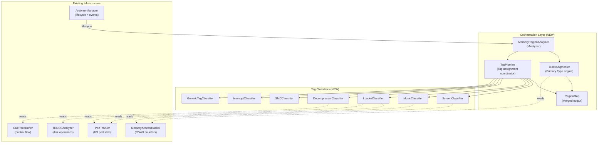
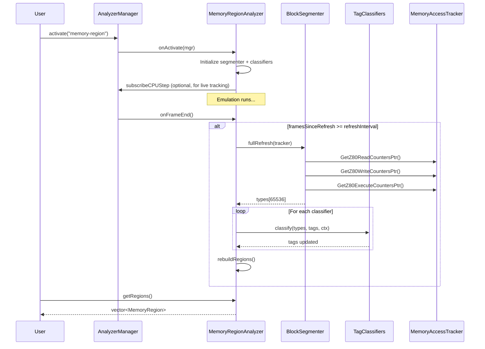
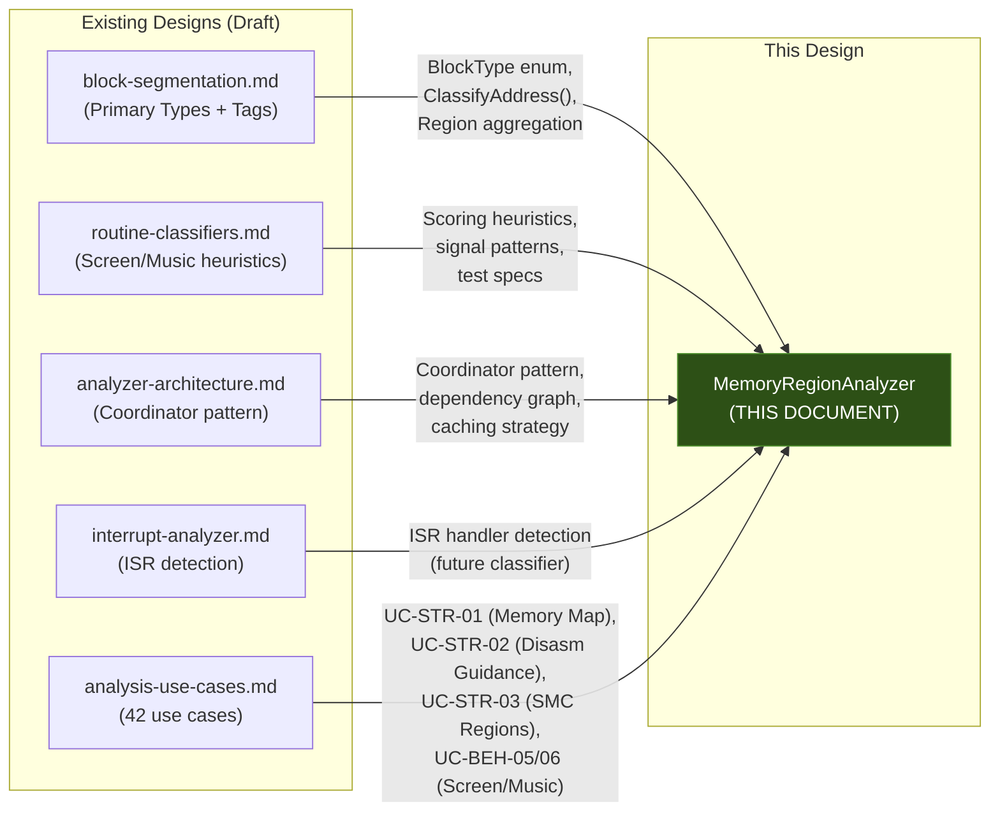

# Memory Region Segmentation: Compound Analyzer Design

## Executive Summary

Design for a **MemoryRegionAnalyzer** — a compound orchestration analyzer that classifies the full Z80 64KB address space into semantically meaningful regions. It builds on the existing **two-layer classification model** (Primary Type + Tags) from [block-segmentation.md](../../inprogress/2026-01-14-analyzers/block-segmentation.md) and adds the **orchestration layer** that coordinates sub-analyzers to produce the region map the user requested.

---

## 1. Architecture Overview



### Key Design Decisions

| Decision | Choice | Rationale |
|:---------|:-------|:----------|
| **Analyzer type** | `IAnalyzer` registered with `AnalyzerManager` | Follows existing TRDOSAnalyzer/ROMPrintDetector pattern |
| **Primary Type source** | R/W/X counters from `MemoryAccessTracker` | Already implemented and proven |
| **Tag assignment** | Pluggable classifier pipeline | Each tag family (screen, music, etc.) is independent |
| **Region storage** | Option A (simple) + tag map | Per [block-segmentation.md](../../inprogress/2026-01-14-analyzers/block-segmentation.md) §3.5 recommendation |
| **Update frequency** | Lazy (on-demand or frame-end batch) | Avoid hot-path overhead |
| **Bank awareness** | Z80 view primary, physical view optional | Most useful for user-facing analysis |

---

## 2. Classification Taxonomy

### 2.1 Primary Types (from R/W/X counters)

These are **mutually exclusive**, assigned per-address from `MemoryAccessTracker` counters:

| Primary Type | Rule | Icon |
|:-------------|:-----|:-----|
| **CODE** | X > 0, W = 0 | `⚙️` |
| **DATA** | R > 0, W = 0, X = 0 | `📦` |
| **VARIABLE** | W > 0, X = 0 | `📝` |
| **SMC** | X > 0 AND W > 0 | `⚡` |
| **UNKNOWN** | R = 0, W = 0, X = 0 | `❓` |

SMC = Self-Modifying Code

### 2.2 Semantic Tags (from higher-level classifiers)

Tags are **combinable** (bitmask), assigned by specialized classifiers. These map directly to the user's requested categories:

#### Code Tags (assigned to CODE or SMC regions)

| Tag | User Category | Classifier | Detection Method |
|:----|:-------------|:-----------|:-----------------|
| `GenericCode` | generic executable code | BlockSegmenter | X > 0 and no other tags assigned |
| `MusicPlayerCode` | music player code | MusicClassifier | Periodic AY port writes (0xFFFD/0xBFFD) or beeper loops (port 0xFE OUT timing) |
| `DiskLoaderCode` | disk or tape loader code | LoaderClassifier | FDC port access (0x1F/0x3F/0x5F/0x7F) from non-ROM, or tape edge timing |
| `TapeLoaderCode` | disk or tape loader code | LoaderClassifier | Port 0xFE reads in tight timing loop (edge detection) |
| `GraphicsCode` | graphics code | ScreenClassifier | Writes to VRAM (0x4000–0x5AFF), attribute manipulation |
| `SpriteEngineCode` | graphics code | ScreenClassifier | Non-contiguous VRAM writes with masking |
| `SMCProcedure` | self-modifying code proc | SMCClassifier | Inline patching pattern (writes to own code region) |
| `DecompressorCode` | compressor unpacker | DecompressorClassifier | Burst writes → execute, LDIR/LDD patterns to SMC region |
| `InputHandlerCode` | *(bonus)* | InputClassifier | Port 0xFE reads with row selection |
| `ISRCode` | *(bonus)* | InterruptClassifier | Code called from interrupt context |

#### Data Tags (assigned to DATA, VARIABLE, or UNKNOWN regions)

| Tag | User Category | Classifier | Detection Method |
|:----|:-------------|:-----------|:-----------------|
| `GenericData` | generic data | BlockSegmenter | R > 0, no other tags |
| `Variables` | variables | VariableProfiler | W > 0 with multiple writers or frame-periodic writes |
| `ImageData` | image data (slideshow) | ScreenClassifier | DATA region that is LDIR'd to VRAM (0x4000+), 6912 bytes |
| `SpriteGraphics` | graphical data (sprites) | ScreenClassifier | Data read by sprite blit routines (non-contiguous VRAM write callers) |
| `SpriteMasks` | graphical data (masks) | ScreenClassifier | Data AND'd with VRAM contents during sprite blit |
| `VectorGeometry` | graphical data (vector/geometry) | ScreenClassifier | Data read by line-drawing or fill routines |
| `TrigData` | helper trigonometry data | ScreenClassifier | 256-byte table with sine-like value distribution |
| `MusicData` | music data (PSG music) | MusicClassifier | DATA read by AY music driver, structured as pattern tables |
| `BeeperMusicData` | music data (beeper) | MusicClassifier | DATA read by beeper playback routine |
| `CompressedData` | *(bonus)* | DecompressorClassifier | Source data for decompression (read-only input to decompressor) |
| `ScreenBuffer` | *(bonus)* | ScreenClassifier | VRAM region 0x4000–0x5AFF (always known) |
| `SystemVariables` | variables | — | Address range 0x5B00–0x5CBF (ZX Spectrum system vars, hardcoded) |

---

## 3. Reconciliation: What Exists vs What's Needed

### 3.1 Existing Components (✅ Ready)

| Component | Location | Provides |
|:----------|:---------|:---------|
| `IAnalyzer` interface | [ianalyzer.h](../../../core/src/debugger/analyzers/ianalyzer.h) | Lifecycle, breakpoint hooks, frame events |
| `AnalyzerManager` | [analyzermanager.h](../../../core/src/debugger/analyzers/analyzermanager.h) | Registration, activation, CPU/memory subscriptions, breakpoints |
| `MemoryAccessTracker` | [memoryaccesstracker.h](../../../core/src/emulator/memory/memoryaccesstracker.h) | Per-address R/W/X counters (Z80 + physical), region monitoring, segment tracking |
| `CallTraceBuffer` | [calltrace.h](../../../core/src/emulator/memory/calltrace.h) | CALL/RET/JP/JR/RST/RETI/DJNZ events with bank info |
| `RingBuffer<T>` | [ringbuffer.h](../../../core/src/common/ringbuffer.h) | Thread-safe bounded event storage |
| `TRDOSAnalyzer` | [trdosanalyzer.h](../../../core/src/debugger/analyzers/trdos/trdosanalyzer.h) | Disk operation semantic events (can identify loader activity) |
| `ROMPrintDetector` | [romprintdetector.h](../../../core/src/debugger/analyzers/rom-print/romprintdetector.h) | Reference implementation for breakpoint-based analyzer |
| `IWD1793Observer` | [iwd1793observer.h](../../../core/src/emulator/io/fdc/iwd1793observer.h) | FDC event observation for loader detection |
| Memory/CPU subscriptions | `AnalyzerManager` | `subscribeCPUStep`, `subscribeMemoryRead/Write` for hot-path analysis |

### 3.2 Existing Design Documents (📋 Designed, Not Implemented)

| Component | Document | Status | Relevance |
|:----------|:---------|:-------|:----------|
| `BlockSegmenter` | [block-segmentation.md](../../inprogress/2026-01-14-analyzers/block-segmentation.md) | Design complete | **Core dependency** — Primary Type engine |
| `RoutineClassifier` | [routine-classifiers.md](../../inprogress/2026-01-14-analyzers/routine-classifiers.md) | Design complete | Screen/Music/Input detection heuristics |
| `AnalysisCoordinator` | [analyzer-architecture.md](../../inprogress/2026-01-14-analyzers/analyzer-architecture.md) | Design complete | Orchestration pattern, dependency graph |
| `InterruptAnalyzer` | [interrupt-analyzer.md](../../inprogress/2026-01-14-analyzers/interrupt-analyzer.md) | Design complete | ISR handler detection |
| Analysis Use Cases | [analysis-use-cases.md](../../inprogress/2026-01-14-analyzers/analysis-use-cases.md) | Complete | 42 use cases driving requirements |

### 3.3 Components to Build (🔨 New)

| Component | Purpose | Estimated LOC | Dependencies |
|:----------|:--------|:-------------|:-------------|
| **MemoryRegionAnalyzer** | Orchestrator: owns BlockSegmenter + TagPipeline + RegionMap | ~400 | IAnalyzer, AnalyzerManager |
| **BlockSegmenter** | Primary Type classification from R/W/X counters | ~200 | MemoryAccessTracker |
| **TagPipeline** | Coordinator for tag classifiers | ~150 | BlockSegmenter output |
| **RegionMap** | Merged view: contiguous regions with type + tags | ~250 | BlockSegmenter, TagPipeline |
| **ScreenClassifier** | Graphics code/data tagging | ~300 | MemoryAccessTracker (VRAM writes) |
| **MusicClassifier** | Music code/data tagging | ~250 | Port access patterns, CallTraceBuffer |
| **LoaderClassifier** | Disk/tape loader tagging | ~200 | TRDOSAnalyzer events, port 0xFE patterns |
| **DecompressorClassifier** | Unpacker code tagging | ~200 | SMC detection, burst write patterns |
| **SMCClassifier** | Self-modifying code sub-typing | ~200 | BlockSegmenter (SMC addresses), caller tracking |
| **GenericTagClassifier** | Fallback tagging for unclassified regions | ~50 | BlockSegmenter output |
| **Total** | | **~2,200** | |

---

## 4. Data Flow Architecture

```
┌─────────────────────────────────────────────────────────────────────────────────┐
│                           DATA COLLECTION (Existing)                            │
│                                                                                 │
│  MemoryAccessTracker           CallTraceBuffer           TRDOSAnalyzer          │
│  ┌──────────────────┐          ┌─────────────────┐       ┌─────────────────┐    │
│  │ R/W/X counters   │          │ CALL/RET/JP     │       │ Disk events     │    │
│  │ per-address 64KB │          │ hot/cold buffer │       │ (semantic)      │    │
│  │ region stats     │          │ bank-aware      │       │                 │    │
│  │ port stats       │          │ loop detection  │       │                 │    │
│  └────────┬─────────┘          └────────┬────────┘       └────────┬────────┘    │
└───────────┼─────────────────────────────┼─────────────────────────┼─────────────┘
            │                             │                         │
            ▼                             ▼                         ▼
┌─────────────────────────────────────────────────────────────────────────────────┐
│                    ANALYSIS LAYER (New — MemoryRegionAnalyzer)                  │
├─────────────────────────────────────────────────────────────────────────────────┤
│                                                                                 │
│  ┌──────────────────────────────────────────────────────────────────────┐       │
│  │                        BlockSegmenter                                │       │
│  │  Input:  R/W/X counter pointers from MemoryAccessTracker             │       │
│  │  Output: BlockClassificationMap (65536 × BlockType enum, 64KB)       │       │
│  │  Method: Batch refresh at frame-end or on-demand                     │       │
│  └────────────────────────────────┬─────────────────────────────────────┘       │
│                                   │                                             │
│  ┌────────────────────────────────▼─────────────────────────────────────┐       │
│  │                          TagPipeline                                 │       │
│  │                                                                      │       │
│  │    ┌─────────────┐ ┌──────────────┐ ┌────────────────┐               │       │
│  │    │ Screen      │ │ Music        │ │ Loader         │               │       │
│  │    │ Classifier  │ │ Classifier   │ │ Classifier     │               │       │
│  │    └──────┬──────┘ └──────┬───────┘ └──────┬─────────┘               │       │
│  │           │               │                │                         │       │
│  │    ┌──────┴──────┐ ┌──────┴───────┐ ┌──────┴─────────┐               │       │
│  │    │ Decompress  │ │ SMC          │ │ Interrupt      │               │       │
│  │    │ Classifier  │ │ Classifier   │ │ Classifier     │               │       │
│  │    └──────┬──────┘ └──────┬───────┘ └──────┬─────────┘               │       │
│  │           │               │                │                         │       │
│  │           └───────────────┼────────────────┘                         │       │
│  │                           ▼                                          │       │
│  │                    BlockTagMap (65536 × uint32_t bitmask, 256KB)     │       │
│  └───────────────────────────┬──────────────────────────────────────────┘       │
│                              │                                                  │
│  ┌───────────────────────────▼──────────────────────────────────────────┐       │
│  │                         RegionMap                                    │       │
│  │  Merge: BlockClassificationMap + BlockTagMap → contiguous regions    │       │
│  │  Output: vector<MemoryRegion> sorted by address                      │       │
│  │  Query: GetRegionAt(addr), GetRegionsOfType(type),                   │       │
│  │         GetRegionsWithTag(tag), GetAllRegions()                      │       │
│  └──────────────────────────────────────────────────────────────────────┘       | │                                                                                 | 
└─────────────────────────────────────────────────────────────────────────────────┘
```

---

## 5. Core Data Structures

### 5.1 Primary Type Enum (inherited from block-segmentation.md)

```cpp
enum class BlockType : uint8_t {
    Unknown   = 0,
    Code      = 1,
    Data      = 2,
    Variable  = 3,
    SMC       = 4
};
```

### 5.2 Semantic Tag Bitmask

> [!NOTE]
> This extends the `BlockTag` enum from [block-segmentation.md](../../inprogress/2026-01-14-analyzers/block-segmentation.md) §3.4, adding the user-requested categories as first-class tags.

```cpp
enum class MemoryTag : uint32_t {
    None                = 0,
    
    // === Code Category Tags ===
    GenericCode         = 1 << 0,    // Executable code, no further classification
    MusicPlayerCode     = 1 << 1,    // AY/beeper/COVOX music playback routine
    DiskLoaderCode      = 1 << 2,    // TR-DOS / Beta 128 disk loader
    TapeLoaderCode      = 1 << 3,    // Tape loading routine (edge timing)
    GraphicsCode        = 1 << 4,    // Screen blitting, clearing, scrolling
    SpriteEngineCode    = 1 << 5,    // Sprite rendering (masked blit)
    SMCProcedure        = 1 << 6,    // Self-modifying code routine
    DecompressorCode    = 1 << 7,    // Compression unpacker (LZ, RLE, etc.)
    InputHandlerCode    = 1 << 8,    // Keyboard/joystick polling
    ISRCode             = 1 << 9,    // Interrupt service routine
    BootSequenceCode    = 1 << 10,   // One-shot initialization code
    
    // === Data Category Tags ===
    GenericData         = 1 << 11,   // Read-only data, no further classification
    Variables           = 1 << 12,   // Read-write variables
    ImageData           = 1 << 13,   // Unpacked slideshow images (6912-byte SCREEN$)
    SpriteGraphics      = 1 << 14,   // Sprite pixel data
    SpriteMasks         = 1 << 15,   // Sprite transparency masks
    VectorGeometry      = 1 << 16,   // Vector/geometry helper data
    TrigData            = 1 << 17,   // Trigonometry lookup tables (sin/cos)
    MusicData           = 1 << 18,   // AY pattern/note data
    BeeperMusicData     = 1 << 19,   // Beeper music data
    CompressedData      = 1 << 20,   // Input to decompressor
    ScreenBuffer        = 1 << 21,   // VRAM pixel+attribute area
    SystemVariables     = 1 << 22,   // ZX Spectrum system variables (0x5B00–0x5CBF)
    LevelData           = 1 << 23,   // Game level/map data
    FontData            = 1 << 24,   // Character set / font
    
    // === Reserved for future ===
    CopyProtection      = 1 << 25,   // Anti-tamper code
    IM2VectorTable      = 1 << 26,   // IM2 interrupt vector table (257 bytes)
    StackArea           = 1 << 27,   // Stack region
};

using MemoryTags = uint32_t;  // Bitmask of MemoryTag values
```

### 5.3 Memory Region (output structure)

```cpp
struct MemoryRegion {
    uint16_t startAddress;
    uint16_t length;
    BlockType primaryType;        // CODE, DATA, VARIABLE, SMC, UNKNOWN
    MemoryTags tags;              // Bitmask of semantic tags
    
    // Aggregated statistics
    uint32_t totalReads = 0;
    uint32_t totalWrites = 0;
    uint32_t totalExecutes = 0;
    
    // Classification metadata
    float confidence = 0.0f;      // Highest confidence from any classifier
    std::string evidence;         // Human-readable explanation
    
    // Convenience
    uint16_t endAddress() const { return startAddress + length - 1; }
    bool hasTag(MemoryTag tag) const {
        return (tags & static_cast<uint32_t>(tag)) != 0;
    }
    bool isCode() const { return primaryType == BlockType::Code || primaryType == BlockType::SMC; }
    bool isData() const { return primaryType == BlockType::Data || primaryType == BlockType::Variable; }
    
    // Human-readable category name
    std::string categoryName() const;
};
```

### 5.4 Region Merging Logic

Contiguous addresses are merged into regions when they share **both** the same `BlockType` **and** the same `MemoryTags`:

```cpp
std::vector<MemoryRegion> mergeRegions(
    const std::array<BlockType, 65536>& types,
    const std::array<MemoryTags, 65536>& tags,
    const MemoryAccessTracker* tracker)
{
    std::vector<MemoryRegion> regions;
    
    uint16_t regionStart = 0;
    BlockType currentType = types[0];
    MemoryTags currentTags = tags[0];
    
    for (uint32_t addr = 1; addr <= 0x10000; addr++) {
        BlockType type = (addr < 0x10000) ? types[addr] : BlockType::Unknown;
        MemoryTags tag = (addr < 0x10000) ? tags[addr] : 0;
        
        if (type != currentType || tag != currentTags || addr == 0x10000) {
            MemoryRegion region;
            region.startAddress = regionStart;
            region.length = static_cast<uint16_t>(addr - regionStart);
            region.primaryType = currentType;
            region.tags = currentTags;
            
            // Aggregate R/W/X stats from tracker
            for (uint16_t a = regionStart; a < addr; a++) {
                region.totalReads += tracker->GetZ80AddressReadCount(a);
                region.totalWrites += tracker->GetZ80AddressWriteCount(a);
                region.totalExecutes += tracker->GetZ80AddressExecuteCount(a);
            }
            
            regions.push_back(region);
            regionStart = static_cast<uint16_t>(addr);
            currentType = type;
            currentTags = tag;
        }
    }
    
    return regions;
}
```

---

## 6. Classifier Pipeline: How It Works

### 6.1 Execution Model

Classifiers do **not** run in the hot path (Z80 execution loop). They operate offline, reading accumulated counter data at frame-end intervals. The pipeline runs as a sequential batch:

```
Frame N emulation completes
    │
    ▼
MemoryRegionAnalyzer::onFrameEnd()
    │
    ├── 1. BlockSegmenter reads R/W/X counters → produces types[65536]
    │       (Primary Type per address: CODE/DATA/VARIABLE/SMC/UNKNOWN)
    │
    ├── 2. TagPipeline runs each classifier in dependency order:
    │       ┌────────────────────────┐
    │       │ a) ScreenClassifier    │ ← No dependencies
    │       │ b) MusicClassifier     │ ← No dependencies
    │       │ c) LoaderClassifier    │ ← No dependencies
    │       │ d) DecompressorClassifier │ ← Needs SMC regions from step 1
    │       │ e) SMCClassifier       │ ← Runs AFTER DecompressorClassifier
    │       │ f) GenericTagClassifier │ ← Runs LAST (fallback)
    │       └────────────────────────┘
    │       Each classifier receives:
    │         - types[65536]  (read-only)   — the Primary Type map
    │         - tags[65536]   (read-write)  — adds its tags via |= bitmask
    │         - AnalysisContext             — access to all data sources
    │
    └── 3. RegionMap merges types[] + tags[] → vector<MemoryRegion>
            (contiguous addresses with same type+tags are merged)
```

### 6.2 AnalysisContext: What Data Classifiers Can Access

Every classifier receives an `AnalysisContext` struct providing access to all existing infrastructure. Classifiers only **read** from these sources — they never modify them.

```cpp
struct AnalysisContext {
    // === Primary data sources ===
    const MemoryAccessTracker* tracker;     // R/W/X counters, memory caller maps
    const PortTracker* portTracker;         // Port I/O counts + caller maps (see port-tracker.md)
    const CallTraceBuffer* callTrace;       // CALL/RET/JP events with timestamps
    const uint8_t* memory;                  // Raw Z80 memory contents (64KB snapshot)
    
    // === Cross-analyzer queries ===
    const TRDOSAnalyzer* trdosAnalyzer;     // Disk operation events (may be nullptr)
    
    // === Frame context ===
    uint64_t currentFrame;                  // Current frame number
    uint64_t totalTStates;                  // Total T-states elapsed
};
```

### 6.3 Input Data Source Reference

| Data Source | API | What It Provides | Which Classifiers Use It |
|:-----------|:----|:-----------------|:------------------------|
| **R/W/X counters** | `tracker->GetZ80ReadCountersPtr()` etc. | Per-address access counts (65536 × uint32_t each) | BlockSegmenter (all), GenericTagClassifier |
| **Caller tracking** | `tracker->GetWriteCallers(addr)` | Set of PCs that wrote to a given address | ScreenClassifier, SMCClassifier, DecompressorClassifier |
| **Port statistics** | `portTracker->GetWriteCount(port)` | Total write count to an I/O port | MusicClassifier (AY ports), LoaderClassifier (FDC ports) |
| **Port caller map** | `portTracker->GetWriteCallers(port)` | Which PCs wrote to a specific port | MusicClassifier, LoaderClassifier |
| **Region monitoring** | `tracker->GetRegionStats(regionId)` | Aggregate R/W/X for pre-registered address ranges | ScreenClassifier (VRAM region) |
| **CallTraceBuffer** | `callTrace->GetEvents(startFrame, endFrame)` | Chronological CALL/RET/RST/RETI events | MusicClassifier (ISR context), LoaderClassifier (ROM calls) |
| **Loop detection** | `callTrace->GetHotLoops()` | Frequently repeated PC ranges | MusicClassifier (beeper loops), LoaderClassifier (tape loops) |
| **TR-DOS events** | `trdosAnalyzer->GetEvents()` | Semantic disk operations (file read, sector count, dest addr) | LoaderClassifier |
| **Raw memory** | `memory[addr]` | Current byte values in Z80 address space | ScreenClassifier (sine table detection), DecompressorClassifier |

### 6.4 Per-Classifier Input Requirements and Detection Rules

#### ScreenClassifier

**Purpose:** Identify graphics rendering code and associated graphical data.

**Inputs required:**
- `MemoryAccessTracker`: caller addresses for VRAM writes, R/W/X counters
- `CallTraceBuffer`: routine boundaries
- Raw memory contents (for table pattern detection)

| # | Scope | Input Signal | Condition | Assigned Tag | Confidence |
|:--|:------|:------------|:----------|:-------------|:-----------|
| 1 | CODE regions | Caller map for VRAM addresses (0x4000–0x5AFF) | Routine writes to VRAM ≥ 10 times | `GraphicsCode` | 0.8 |
| 2 | CODE regions | Instruction pattern at caller PC | AND with one data source, OR with another → VRAM write | `SpriteEngineCode` | 0.85 |
| 3 | CODE regions | Write pattern to VRAM | Sequential fill: ≥256 contiguous VRAM addresses written | `GraphicsCode` (screen clear) | 0.9 |
| 4 | DATA regions | Cross-reference: region is read by a `GraphicsCode` routine | Read callers overlap with identified GraphicsCode PCs; non-contiguous read pattern | `SpriteGraphics` | 0.7 |
| 5 | DATA regions | Read callers + LDIR detection | Region size = 6912 bytes AND destination address = 0x4000 (via LDIR) | `ImageData` | 0.95 |
| 6 | DATA regions | Raw memory content | 256-byte aligned table, values follow sine-like distribution (sorted ascending then descending) | `TrigData` | 0.75 |
| 7 | DATA regions | Cross-reference: read by `SpriteEngineCode` | Data is AND'd with VRAM during sprite blit (mask pattern) | `SpriteMasks` | 0.7 |
| H1 | Hardcoded | Address range | 0x4000–0x57FF | `ScreenBuffer` | 1.0 |
| H2 | Hardcoded | Address range | 0x5800–0x5AFF | `ScreenBuffer` | 1.0 |

#### MusicClassifier

**Purpose:** Identify music playback routines and music data.

**Inputs required:**
- `PortTracker`: port write counts + callers for AY ports (0xFFFD, 0xBFFD), beeper (0xFE)
- `MemoryAccessTracker`: R/W/X counters
- `CallTraceBuffer`: ISR context detection, loop detection, periodicity
- Raw memory contents (for data structure detection)

| # | Scope | Input Signal | Condition | Assigned Tag | Confidence |
|:--|:------|:------------|:----------|:-------------|:-----------|
| 1 | CODE regions | Port write callers for 0xFFFD | Routine writes to AY register select port ≥ 5 times | candidate (need rule 2+3) | — |
| 2 | CODE regions | Port write callers for 0xBFFD | Same routine also writes to AY data port | combined with #1 → `MusicPlayerCode` | 0.7 |
| 3 | CODE regions | CallTraceBuffer periodicity | Routine executes every ~70,000 T-states (±10%) = 50Hz | raises confidence to | 0.85 |
| 4 | CODE regions | CallTraceBuffer ISR context | Routine is called from RETI/interrupt handler chain | raises confidence to | 0.95 |
| 5 | CODE regions | Port writes, verification | Multiple AY registers written (regs 0–13) across calls, not just single register | confirms `MusicPlayerCode` | 0.9 |
| 6 | DATA regions | Cross-reference: read by MusicPlayerCode | Data region is read exclusively by identified AY music routine | `MusicData` | 0.8 |
| 7 | CODE regions | Port write callers for 0xFE (OUT) | Tight loop with OUT (port 0xFE), DJNZ/JR loop, iteration count > 100 | `MusicPlayerCode` (beeper) | 0.75 |
| 8 | CODE regions | Timing analysis | Beeper code has consistent timing between port writes (delay loops) | raises confidence to | 0.85 |
| 9 | DATA regions | Cross-reference: read by beeper code | Read by identified beeper music routine | `BeeperMusicData` | 0.75 |
| 10 | CODE regions | Port write callers for 0xFB | High-rate writes to COVOX port (> 1000/frame) | `MusicPlayerCode` | 0.8 |

#### LoaderClassifier

**Purpose:** Identify disk and tape loading routines.

**Inputs required:**
- `TRDOSAnalyzer`: semantic disk operation events
- `PortTracker`: port statistics (FDC ports, tape port)
- `MemoryAccessTracker`: R/W/X counters
- `CallTraceBuffer`: ROM routine calls (tape routines at 0x0556)

| # | Scope | Input Signal | Condition | Assigned Tag | Confidence |
|:--|:------|:------------|:----------|:-------------|:-----------|
| 1 | CODE regions | TRDOSAnalyzer events | LOADER_DETECTED event references this PC range | `DiskLoaderCode` | 0.95 |
| 2 | CODE regions | Port write/read callers for FDC ports (0x1F, 0x3F, 0x5F, 0x7F) | Port access from non-ROM address (PC ≥ 0x4000) | `DiskLoaderCode` | 0.8 |
| 3 | CODE regions | R/W/X temporal pattern | High X count in early frames, zero X in later frames (one-shot) | raises confidence for loader | +0.1 |
| 4 | CODE regions | Port read callers for 0xFE (IN) | Tight timing loop reading port 0xFE (edge detection), consistent iteration timing | `TapeLoaderCode` | 0.8 |
| 5 | CODE regions | CallTraceBuffer | Routine calls ROM tape entry point (0x0556 LD-BYTES) | `TapeLoaderCode` | 0.9 |
| 6 | CODE regions | Port read count + timing | Port 0xFE read count > 10,000, high iteration consistency | raises confidence to | 0.9 |
| 7 | DATA/VARIABLE | Temporal cross-reference | Memory written ONLY during frames when loader was active, not written after | identifies loaded data | 0.7 |

#### DecompressorClassifier

**Purpose:** Identify compression unpacker routines and their input/output.

**Inputs required:**
- `BlockSegmenter` output: SMC region addresses
- `MemoryAccessTracker`: caller addresses (who writes to SMC regions), R/W/X counters
- `CallTraceBuffer`: temporal ordering (write-then-execute pattern)

| # | Scope | Input Signal | Condition | Assigned Tag | Confidence |
|:--|:------|:------------|:----------|:-------------|:-----------|
| 1 | SMC regions | Write pattern analysis | Large contiguous SMC region (> 256 bytes) with burst writes from single code routine | candidate decompressor output | — |
| 2 | SMC regions | Temporal ordering | Written bytes → then executed (writes precede all executions) | confirms decompression pattern | 0.85 |
| 3 | CODE regions | Caller tracking from rule 1 | The CODE region that performed the burst writes = the decompressor | `DecompressorCode` | 0.85 |
| 4 | DATA regions | Cross-reference with rule 3 | DATA region read by DecompressorCode during burst write phase | `CompressedData` | 0.8 |
| 5 | CODE regions | LDIR/LDD detection | Large block copy (BC > 256) from DATA to another region | candidate if dest is later executed | 0.6 |
| 6 | CODE regions | One-shot execution | DecompressorCode has high X count in first N frames, zero after | raises confidence to | 0.9 |

#### SMCClassifier

**Purpose:** Sub-classify self-modifying code into specific patterns.

**Inputs required:**
- `BlockSegmenter` output: SMC addresses
- `MemoryAccessTracker`: caller tracking (who modifies SMC addresses)
- `CallTraceBuffer`: routine boundaries (is writer in same routine?)

| # | Scope | Input Signal | Condition | Assigned Tag | Confidence |
|:--|:------|:------------|:----------|:-------------|:-----------|
| 1 | SMC regions | Writer PC location | Writer PC is within same routine (±256 bytes) as modified address | `SMCProcedure` (inline patch) | 0.9 |
| 2 | SMC regions | Modification size | Only 1–3 bytes modified (typically instruction operand) | confirms inline patch | +0.05 |
| 3 | SMC regions | Writer PC location | Writer PC is in a different routine (> 256 bytes away) | `SMCProcedure` (cross-function) | 0.8 |
| 4 | SMC regions | Modification target | Modified bytes are JP/CALL target address (2 bytes at opcode+1) | dynamic dispatch pattern | 0.85 |
| 5 | SMC regions | Already tagged by DecompressorClassifier | Region has `DecompressorCode` tag or was identified as decompressor output | skip (don't override) | — |
| 6 | SMC regions | Modification cycles | Multiple write→execute→write→execute cycles | `CopyProtection` candidate | 0.6 |
| 7 | SMC regions | Writer obfuscation | Multiple different writer PCs, indirect addressing, XOR patterns | `CopyProtection` | 0.7 |

#### GenericTagClassifier

**Purpose:** Assign fallback tags to any region not tagged by specialized classifiers. Runs **last** in the pipeline.

**Inputs required:**
- `types[65536]` (Primary Type map)
- `tags[65536]` (current tag map — checks for absence of tags)

| # | Scope | Input Signal | Condition | Assigned Tag | Confidence |
|:--|:------|:------------|:----------|:-------------|:-----------|
| 1 | CODE regions | Tag map | `types[addr] == CODE` AND `tags[addr] == None` | `GenericCode` | 1.0 |
| 2 | DATA regions | Tag map | `types[addr] == Data` AND `tags[addr] == None` | `GenericData` | 1.0 |
| 3 | VARIABLE regions | Tag map | `types[addr] == Variable` AND `tags[addr] == None` | `Variables` | 1.0 |
| 4 | Hardcoded | Address range | 0x5B00–0x5CBF | `SystemVariables` | 1.0 |

---

## 7. Classifier Specifications (Interface + Detection Strategy Diagrams)

### 7.1 ITagClassifier Interface

```cpp
class ITagClassifier {
public:
    virtual ~ITagClassifier() = default;
    
    /// Arbitrary name for logging
    virtual std::string_view getName() const = 0;
    
    /// Dependencies: which primary types must be classified first
    /// Return empty for classifiers that only need R/W/X counters
    virtual std::vector<BlockType> requiredPrimaryTypes() const { return {}; }
    
    /// Run classification pass over the address space
    /// @param types  Primary type classification (read-only)
    /// @param tags   Tag map (read-write: classifier adds its tags)
    /// @param ctx    Analysis context with data sources
    virtual void classify(
        const std::array<BlockType, 65536>& types,
        std::array<MemoryTags, 65536>& tags,
        const AnalysisContext& ctx) = 0;
};
```

### 6.2 ScreenClassifier

Detects graphics-related code and data regions.

```
Detection Strategy:
                                    
 ┌──────────────────────────────────────────────────────────────────┐
 │  For each CODE region:                                           │
 │    1. Check if routine writes to VRAM (0x4000–0x5AFF)            │
 │       → Tag as GraphicsCode                                      │
 │    2. Check for masked blit pattern (AND with data, OR sprite)   │
 │       → Tag as SpriteEngineCode                                  │
 │    3. Check for sequential VRAM fill                             │
 │       → Tag as GraphicsCode (screen clear variant)               │
 │                                                                  │
 │  For each DATA region:                                           │
 │    4. Check if region is read by a GraphicsCode routine          │
 │       and has non-contiguous access pattern                      │
 │       → Tag as SpriteGraphics                                    │
 │    5. Check if region size = 6912 and is LDIR'd to 0x4000        │
 │       → Tag as ImageData                                         │
 │    6. Check for 256-byte table with sine-like distribution       │
 │       → Tag as TrigData                                          │
 │                                                                  │
 │  Hardcoded:                                                      │
 │    7. 0x4000–0x57FF → ScreenBuffer (pixel data)                  │
 │    8. 0x5800–0x5AFF → ScreenBuffer (attributes)                  │
 └──────────────────────────────────────────────────────────────────┘

Data Sources:
  - MemoryAccessTracker: VRAM write callers (callerAddresses map)  
  - Memory region monitoring: pre-registered VRAM region
  - CallTraceBuffer: identify routine boundaries for blit functions
```

### 6.3 MusicClassifier

Detects music player code and music data.

```
Detection Strategy:

 ┌──────────────────────────────────────────────────────────────────┐
 │  AY Music Detection:                                             │
 │    1. Find CODE regions that write to ports 0xFFFD and 0xBFFD    │
 │    2. Check for periodicity (~70,000 T-states = 50Hz frame)      │
 │    3. Verify multiple AY registers written (regs 0-13)           │
 │    4. If in ISR context → very high confidence                   │
 │    → Tag CODE as MusicPlayerCode                                 │
 │    → Tag DATA read by this routine as MusicData                  │
 │                                                                  │
 │  Beeper Music Detection:                                         │
 │    5. Find CODE regions with tight loop + OUT (0xFE)             │
 │    6. Check loop iteration count > 100                           │
 │    7. Check for timing-critical patterns (DJNZ, delay loops)     │
 │    → Tag CODE as MusicPlayerCode                                 │
 │    → Tag DATA read by this routine as BeeperMusicData            │
 │                                                                  │
 │  COVOX Detection:                                                │
 │    8. High-rate writes to port 0xFB                              │
 │    → Tag CODE as MusicPlayerCode                                 │
 └──────────────────────────────────────────────────────────────────┘

Data Sources:
  - MemoryAccessTracker port stats: AY port write counts
  - CallTraceBuffer: caller identification for port-writing code
  - Segmented tracking (per-frame): periodicity detection
```

### 6.4 LoaderClassifier

Detects disk and tape loader code.

```
Detection Strategy:

 ┌──────────────────────────────────────────────────────────────────┐
 │  Disk Loader Detection:                                          │
 │    1. Query TRDOSAnalyzer for LOADER_DETECTED events            │
 │    2. Check for FDC port access from non-ROM addresses          │
 │       (ports 0x1F, 0x3F, 0x5F, 0x7F from PC ≥ 0x4000)         │
 │    3. One-shot execution pattern (high X count during boot,      │
 │       zero after)                                                │
 │    → Tag CODE as DiskLoaderCode                                  │
 │                                                                  │
 │  Tape Loader Detection:                                          │
 │    4. Port 0xFE reads in tight timing loop (edge detection)     │
 │    5. High iteration count with consistent timing                │
 │    6. ROM tape routine (0x0556) called by user code              │
 │    → Tag CODE as TapeLoaderCode                                  │
 │                                                                  │
 │  Loaded Data Identification:                                     │
 │    7. Memory regions written ONLY during loader activity         │
 │       (write count > 0, but only during boot/load phase)        │
 │    → Helps identify what was loaded (combined with SMC/Data)     │
 └──────────────────────────────────────────────────────────────────┘

Data Sources:
  - TRDOSAnalyzer events (semantic disk operations)
  - MemoryAccessTracker port stats (FDC ports from non-ROM)
  - CallTraceBuffer (ROM tape routine calls)
```

### 6.5 DecompressorClassifier

Detects compression unpacker routines.

```
Detection Strategy:

 ┌──────────────────────────────────────────────────────────────────┐
 │  Pattern: Burst writes → execute                                 │
 │    1. Find SMC regions from BlockSegmenter                       │
 │    2. Analyze temporal write pattern:                            │
 │       - Many sequential writes to a range (output buffer)        │
 │       - Followed by execution of that same range                 │
 │    3. The CODE that performs the writes = DecompressorCode       │
 │    4. The DATA that is read during decompression = CompressedData│
 │    5. The output region transitions from UNKNOWN→SMC             │
 │                                                                  │
 │  LDIR/LDD Pattern:                                               │
 │    6. Large LDIR blocks (BC > 256) from DATA to other region     │
 │    7. If destination later executed → decompressor indicator     │
 │                                                                  │
 │  One-shot execution:                                             │
 │    8. Decompressors typically run once during boot               │
 │    9. Cross-reference with temporal analysis                     │
 └──────────────────────────────────────────────────────────────────┘

Data Sources:
  - BlockSegmenter SMC regions  
  - MemoryAccessTracker callerAddresses (who writes to SMC)
  - CallTraceBuffer (temporal ordering, one-shot detection)
```

### 6.6 SMCClassifier

Sub-classifies self-modifying code patterns.

```
Detection Strategy:

 ┌──────────────────────────────────────────────────────────────────┐
 │  For each SMC region from BlockSegmenter:                        │
 │                                                                  │
 │  Inline Patch:                                                   │
 │    - Writer PC is within the same routine as the SMC address     │
 │    - Few bytes modified (1-3 bytes, typically operand)           │
 │    → Tag: SMCProcedure                                           │
 │                                                                  │
 │  Cross-Function Patch:                                           │
 │    - Writer PC is in a different routine                         │
 │    - May be dynamic dispatch (JP target modification)            │
 │    → Tag: SMCProcedure                                           │
 │                                                                  │
 │  Decompression Output:                                           │
 │    - Large contiguous SMC region (>256 bytes)                    │
 │    - Written in burst, then executed                             │
 │    → Delegate to DecompressorClassifier                          │
 │                                                                  │
 │  Copy Protection:                                                │
 │    - Complex write patterns, obfuscated                          │
 │    - Multiple modification cycles                                │
 │    → Tag: CopyProtection                                         │
 └──────────────────────────────────────────────────────────────────┘

Data Sources:
  - BlockSegmenter: SMC address set
  - MemoryAccessTracker callerAddresses: who writes to each SMC address
  - CallTraceBuffer: routine boundary context
```

---

## 7. MemoryRegionAnalyzer Class Design

### 7.1 Class Declaration

```cpp
class MemoryRegionAnalyzer : public IAnalyzer {
public:
    static constexpr const char* ANALYZER_ID = "memory-region";
    static constexpr const char* ANALYZER_NAME = "MemoryRegionAnalyzer";
    
    explicit MemoryRegionAnalyzer(EmulatorContext* context);
    ~MemoryRegionAnalyzer() override;
    
    // === IAnalyzer interface ===
    std::string getName() const override { return ANALYZER_NAME; }
    std::string getUUID() const override { return _uuid; }
    void onActivate(AnalyzerManager* mgr) override;
    void onDeactivate() override;
    void onFrameEnd() override;  // Trigger periodic refresh
    
    // === Query API ===
    
    /// Get the full region map (call after at least one refresh)
    const std::vector<MemoryRegion>& getRegions() const;
    
    /// Get region containing a specific address
    const MemoryRegion* getRegionAt(uint16_t address) const;
    
    /// Get all regions of a specific primary type
    std::vector<MemoryRegion> getRegionsByType(BlockType type) const;
    
    /// Get all regions with a specific tag
    std::vector<MemoryRegion> getRegionsByTag(MemoryTag tag) const;
    
    /// Get primary type at a specific address (O(1))
    BlockType getTypeAt(uint16_t address) const;
    
    /// Get tags at a specific address (O(1))
    MemoryTags getTagsAt(uint16_t address) const;
    
    /// Get full address info (type + tags + stats)
    struct AddressInfo {
        uint16_t address;
        BlockType type;
        MemoryTags tags;
        uint32_t readCount;
        uint32_t writeCount;
        uint32_t executeCount;
    };
    AddressInfo getAddressInfo(uint16_t address) const;
    
    /// Get summary statistics
    struct SegmentationStats {
        uint32_t codeBytes = 0;
        uint32_t dataBytes = 0;
        uint32_t variableBytes = 0;
        uint32_t smcBytes = 0;
        uint32_t unknownBytes = 0;
        uint32_t totalRegions = 0;
        uint32_t taggedRegions = 0;  // Regions with semantic tags
    };
    SegmentationStats getStats() const;
    
    /// Force a full refresh (normally happens at frame-end)
    void refresh();
    
    /// Generate human-readable report
    std::string generateReport() const;
    
    // === Configuration ===
    
    /// Set refresh interval (every N frames, default=10)
    void setRefreshInterval(uint32_t frames);
    
    /// Enable/disable specific classifiers
    void setClassifierEnabled(const std::string& name, bool enabled);
    
private:
    std::string _uuid;
    EmulatorContext* _context;
    AnalyzerManager* _manager = nullptr;
    
    // Core data (per-address, always 64KB each)
    std::array<BlockType, 65536> _types{};
    std::array<MemoryTags, 65536> _tags{};
    
    // Merged output
    std::vector<MemoryRegion> _regions;
    bool _regionsDirty = true;
    
    // Sub-components
    std::unique_ptr<BlockSegmenter> _segmenter;
    std::vector<std::unique_ptr<ITagClassifier>> _classifiers;
    
    // Refresh control
    uint32_t _refreshInterval = 10;  // Refresh every 10 frames
    uint32_t _framesSinceRefresh = 0;
    uint64_t _lastRefreshFrame = 0;
    
    // Internal methods
    void runClassificationPipeline();
    void rebuildRegions();
    void applyHardcodedRegions();  // System vars, VRAM, etc.
};
```

### 7.2 Lifecycle



---

## 8. Integration Points

### 8.1 With Existing Analyzers

| Analyzer | Integration | Direction |
|:---------|:-----------|:----------|
| **TRDOSAnalyzer** | LoaderClassifier queries TRDOSAnalyzer events | MRA reads TDA |
| **ROMPrintDetector** | Not directly used (different analysis domain) | — |
| **AnalyzerManager** | Lifecycle, frame events, subscriptions | AM manages MRA |

### 8.2 With MemoryAccessTracker

```cpp
// In MemoryRegionAnalyzer::onActivate():
void onActivate(AnalyzerManager* mgr) override {
    _manager = mgr;
    
    // No hot-path subscriptions needed — we read counters at frame-end
    // This keeps performance impact near-zero during emulation
    
    // Initial refresh
    refresh();
}

// In BlockSegmenter::fullRefresh():
void fullRefresh(const MemoryAccessTracker* tracker) {
    const uint32_t* R = tracker->GetZ80ReadCountersPtr();
    const uint32_t* W = tracker->GetZ80WriteCountersPtr();
    const uint32_t* X = tracker->GetZ80ExecuteCountersPtr();
    
    if (!R || !W || !X) return;  // Tracking not allocated
    
    for (uint32_t addr = 0; addr < 65536; addr++) {
        _types[addr] = classifyAddress(R[addr], W[addr], X[addr]);
    }
}
```

### 8.3 CLI Integration

```
# Commands (extending existing 'analyzer' CLI)
analyzer enable memory-region          # Activate the analyzer
analyzer memory-region status          # Show stats summary
analyzer memory-region regions         # List all regions
analyzer memory-region regions --type=CODE    # Filter by primary type
analyzer memory-region regions --tag=MusicPlayerCode  # Filter by tag
analyzer memory-region at 0x8000       # Query specific address
analyzer memory-region report          # Generate full report
analyzer memory-region refresh         # Force refresh
```

### 8.4 Export Format

```yaml
memory_segmentation:
  timestamp: "2026-03-16T15:00:00Z"
  frame: 5000
  
  summary:
    code_bytes: 12345
    data_bytes: 8000
    variable_bytes: 3000
    smc_bytes: 500
    unknown_bytes: 41691
    total_regions: 45
    tagged_regions: 28
  
  regions:
    - start: 0x0000
      end: 0x3FFF
      length: 16384
      type: CODE
      tags: [GenericCode]
      evidence: "ROM code"
      stats: { reads: 50000, writes: 0, executes: 200000 }
    
    - start: 0x4000
      end: 0x57FF
      length: 6144
      type: VARIABLE
      tags: [ScreenBuffer]
      evidence: "VRAM pixel data (hardcoded range)"
      stats: { reads: 1000, writes: 50000, executes: 0 }
    
    - start: 0x8000
      end: 0x8200
      length: 512
      type: CODE
      tags: [MusicPlayerCode, ISRCode]
      evidence: "AY register writes: 1500, data writes: 1500, periodic: yes"
      confidence: 0.95
      stats: { reads: 100, writes: 0, executes: 25000 }
    
    - start: 0x9000
      end: 0x9FFF
      length: 4096
      type: DATA
      tags: [MusicData]
      evidence: "Read exclusively by MusicPlayerCode at 0x8000"
      confidence: 0.85
      stats: { reads: 15000, writes: 0, executes: 0 }
    
    - start: 0xA000
      end: 0xA200
      length: 512
      type: SMC
      tags: [DecompressorCode]
      evidence: "Burst writes (2048 bytes) then execute, one-shot pattern"
      confidence: 0.90
      stats: { reads: 200, writes: 2048, executes: 500 }
```

---

## 9. Implementation Roadmap

### Phase 1: Core Infrastructure (~1 week)

- [ ] **MemoryRegionAnalyzer** class skeleton implementing `IAnalyzer`
- [ ] **BlockSegmenter** — R/W/X → BlockType classification (from existing design)
- [ ] **BlockTagMap** — per-address tag storage
- [ ] **RegionMap** — merge + query API
- [ ] **ITagClassifier** interface
- [ ] Registration with `AnalyzerManager` + CLI commands
- [ ] Unit tests for BlockSegmenter classification logic
- [ ] Unit tests for region merging

### Phase 2: Hardcoded & Obvious Classifiers (~1 week)

- [ ] **GenericTagClassifier** — assign GenericCode/GenericData to untagged regions
- [ ] **Hardcoded regions** — VRAM (0x4000–0x5AFF), system vars (0x5B00–0x5CBF)
- [ ] **ScreenClassifier (basic)** — detect VRAM writers as GraphicsCode
- [ ] Integration test with live emulation (load a .sna, run 100 frames, verify regions)

### Phase 3: Screen & Music Classifiers (~1.5 weeks)

- [ ] **ScreenClassifier (advanced)** — sprite blit detection, ImageData, SpriteGraphics
- [ ] **MusicClassifier** — AY music detection, beeper detection
- [ ] Link DATA regions to their accessing CODE routines
- [ ] Confidence scoring per classifier

### Phase 4: Loader & Decompressor Classifiers (~1.5 weeks)

- [ ] **LoaderClassifier** — TRDOSAnalyzer integration, tape edge detection
- [ ] **DecompressorClassifier** — burst-write → execute pattern
- [ ] **SMCClassifier** — inline patch vs decompression output
- [ ] Cross-classifier dependency resolution (decompressor output = SMC → DecompressorClassifier before SMCClassifier)

### Phase 5: Advanced Features & Polish (~1 week)

- [ ] Per-frame delta tracking (incremental updates)
- [ ] Bank-aware classification (physical page view)
- [ ] Report generation + YAML export
- [ ] CLI commands for query and filter
- [ ] Performance optimization (parallel classifier execution)
- [ ] Integration tests with multiple game types

### Phase 6: UI Integration (deferred)

- [ ] Qt memory map widget (color-coded regions)
- [ ] Address hover tooltip showing type + tags
- [ ] Region list panel with filtering
- [ ] Disassembler coloring from BlockType

---

## 10. Risk Assessment

| Risk | Impact | Mitigation |
|:-----|:-------|:-----------|
| **False positives in classifiers** | Wrong tags assigned | Confidence scoring + threshold; multiple indicators required |
| **Performance overhead** | Slow frame rate | Lazy refresh (every N frames); no hot-path subscriptions; batch counter reads |
| **Bank-switched confusion** | Same Z80 address has different content in different banks | Primary: Z80 view (most recent mapping); physical view as optional overlay |
| **Decompressor masquerades as SMC** | All unpacked code regions show as SMC | DecompressorClassifier runs before SMCClassifier; temporal analysis separates one-shot from ongoing SMC |
| **MemoryAccessTracker not allocated** | No counter data available | Graceful null-check on counter pointers; emit warning if tracking disabled |
| **Classifier ordering dependencies** | Tags assigned in wrong order | TagPipeline enforces ordering via `requiredPrimaryTypes()` + explicit classifier dependency DAG |

---

## 11. Source Files

### New Files to Create

| File | Purpose |
|:-----|:--------|
| `core/src/debugger/analyzers/memory-region/memoryregionanalyzer.h` | MemoryRegionAnalyzer class declaration |
| `core/src/debugger/analyzers/memory-region/memoryregionanalyzer.cpp` | MemoryRegionAnalyzer implementation |
| `core/src/debugger/analyzers/memory-region/memorytypes.h` | BlockType, MemoryTag, MemoryRegion definitions |
| `core/src/debugger/analyzers/memory-region/blocksegmenter.h` | BlockSegmenter class |
| `core/src/debugger/analyzers/memory-region/blocksegmenter.cpp` | BlockSegmenter implementation |
| `core/src/debugger/analyzers/memory-region/itagclassifier.h` | ITagClassifier interface |
| `core/src/debugger/analyzers/memory-region/tagpipeline.h` | TagPipeline coordinator |
| `core/src/debugger/analyzers/memory-region/tagpipeline.cpp` | TagPipeline implementation |
| `core/src/debugger/analyzers/memory-region/regionmap.h` | RegionMap merge + query |
| `core/src/debugger/analyzers/memory-region/regionmap.cpp` | RegionMap implementation |
| `core/src/debugger/analyzers/memory-region/classifiers/screenclassifier.h` | Screen/sprite classifier |
| `core/src/debugger/analyzers/memory-region/classifiers/screenclassifier.cpp` | Screen classifier impl |
| `core/src/debugger/analyzers/memory-region/classifiers/musicclassifier.h` | Music classifier |
| `core/src/debugger/analyzers/memory-region/classifiers/musicclassifier.cpp` | Music classifier impl |
| `core/src/debugger/analyzers/memory-region/classifiers/loaderclassifier.h` | Loader classifier |
| `core/src/debugger/analyzers/memory-region/classifiers/loaderclassifier.cpp` | Loader classifier impl |
| `core/src/debugger/analyzers/memory-region/classifiers/decompressorclassifier.h` | Decompressor classifier |
| `core/src/debugger/analyzers/memory-region/classifiers/decompressorclassifier.cpp` | Decompressor impl |
| `core/src/debugger/analyzers/memory-region/classifiers/smcclassifier.h` | SMC sub-classifier |
| `core/src/debugger/analyzers/memory-region/classifiers/smcclassifier.cpp` | SMC classifier impl |
| `core/src/debugger/analyzers/memory-region/classifiers/genericclassifier.h` | Fallback classifier |
| `core/tests/debugger/analyzers/memory-region/blocksegmenter_test.cpp` | BlockSegmenter unit tests |
| `core/tests/debugger/analyzers/memory-region/regionmap_test.cpp` | RegionMap unit tests |
| `core/tests/debugger/analyzers/memory-region/memoryregionanalyzer_test.cpp` | Integration tests |

### Existing Files to Modify

| File | Changes |
|:-----|:--------|
| `core/src/debugger/analyzers/CMakeLists.txt` | Add new source files |
| `core/src/debugger/debugmanager.cpp` | Register MemoryRegionAnalyzer |
| `core/automation/cli/src/commands/cli-processor-analyzer-mgr.cpp` | Add CLI commands for region queries |

---

## 12. How This Reconciles with Existing Design Documents



> [!IMPORTANT]
> This design **does not duplicate** the existing design documents. Instead, it:
> 1. **Inherits** `BlockType`/`ClassifyAddress()` directly from `block-segmentation.md`
> 2. **Wraps** the scoring heuristics from `routine-classifiers.md` into `ITagClassifier` implementations
> 3. **Implements** the `AnalysisCoordinator` pattern from `analyzer-architecture.md` as the `MemoryRegionAnalyzer` orchestrator
> 4. **Satisfies** use cases UC-STR-01, UC-STR-02, UC-STR-03, UC-BEH-05, UC-BEH-06, UC-NAV-05 from `analysis-use-cases.md`

---

## 13. User's Requested Categories → Implementation Mapping

### Code Categories

| User Request | Primary Type | Tag | Classifier | Status |
|:-------------|:------------|:----|:-----------|:-------|
| generic executable code | `CODE` | `GenericCode` | GenericTagClassifier | Phase 1 |
| music player code | `CODE` | `MusicPlayerCode` | MusicClassifier | Phase 3 |
| disk or tape loader code | `CODE` | `DiskLoaderCode` / `TapeLoaderCode` | LoaderClassifier | Phase 4 |
| graphics code | `CODE` | `GraphicsCode` / `SpriteEngineCode` | ScreenClassifier | Phase 3 |
| self-modifying code procedure | `SMC` | `SMCProcedure` | SMCClassifier | Phase 4 |
| compressor unpacker | `CODE`/`SMC` | `DecompressorCode` | DecompressorClassifier | Phase 4 |
| other subtypes of code | `CODE` | *extensible via new tags* | *new classifiers* | Future |

### Data Categories

| User Request | Primary Type | Tag | Classifier | Status |
|:-------------|:------------|:----|:-----------|:-------|
| generic data | `DATA` | `GenericData` | GenericTagClassifier | Phase 1 |
| variables | `VARIABLE` | `Variables` | GenericTagClassifier | Phase 1 |
| image data (unpacked slideshow) | `DATA` | `ImageData` | ScreenClassifier | Phase 3 |
| graphical data (sprites, masks) | `DATA` | `SpriteGraphics` / `SpriteMasks` | ScreenClassifier | Phase 3 |
| graphical data (vector, geometry) | `DATA` | `VectorGeometry` | ScreenClassifier | Phase 3 |
| helper trigonometry data | `DATA` | `TrigData` | ScreenClassifier | Phase 3 |
| music data (PSG music) | `DATA` | `MusicData` | MusicClassifier | Phase 3 |
| music data (beeper music) | `DATA` | `BeeperMusicData` | MusicClassifier | Phase 3 |

---

## 14. BehaviorChangeDetector (Phase Transition Monitor)

Detects when the program's memory access pattern changes drastically — signaling that accumulated statistics are no longer valid and a new analysis phase should begin.

> [!IMPORTANT]
> This is a standalone monitoring component, **not** a tag classifier. It doesn't assign tags — it signals other components (via `MessageCenter`) that the program has entered a new execution phase, so they can reset counters and recompute classifications.

### 14.1 Motivation

ZX Spectrum programs have distinct execution phases:

| Phase | Description | Typical Access Pattern |
|:------|:-----------|:----------------------|
| **Boot** | ROM initialization | Execute in 0x0000–0x3FFF only |
| **Loading** | Tape/disk loader reads data | Port I/O heavy, sparse execute |
| **Decompression** | Unpacker writes code to RAM | Burst writes → SMC transition |
| **Game init** | One-shot initialization | Execute across wide range, then never again |
| **Main game loop** | Steady-state: graphics, sound, input | Stable execute set, periodic patterns |
| **Level transition** | Load new level, reset game state | Similar to Loading but from within main code |
| **Menu / pause** | Low activity, mostly input polling | Very low execute count, port reads |

Each phase has radically different memory access patterns. Statistics from the _loading_ phase are meaningless for understanding the _main game loop_ — they must be reset.

### 14.2 Detection Strategy: Two-Channel Approach

```
┌─────────────────────────────────────────────────────────────────────────────┐
│  CHANNEL 1: Hint-Driven Detection (Low latency, high confidence)            │
│                                                                             │
│  These events are strong predictors that a phase transition will happen     │
│  imminently or has just occurred:                                           │
│                                                                             │
│    ┌──────────────────────────┬────────────────────────────────────────┐    │
│    │ Hint Source              │ Interpretation                         │    │
│    ├──────────────────────────┼────────────────────────────────────────┤    │
│    │ Disk loader completed    │ Loaded code about to execute.          │    │
│    │ (TRDOSAnalyzer event)    │ High confidence phase transition.      │    │
│    ├──────────────────────────┼────────────────────────────────────────┤    │
│    │ Tape loading ended       │ Edge detection loop terminated.        │    │
│    │ (port 0xFE read stops)   │ New code about to run.                 │    │
│    ├──────────────────────────┼────────────────────────────────────────┤    │
│    │ Decompressor finished    │ SMC region fully written then entered. │    │
│    │ (DecompressorClassifier) │ High confidence new execution phase.   │    │
│    ├──────────────────────────┼────────────────────────────────────────┤    │
│    │ Large LDIR detected      │ Block copy = likely level load or      │    │
│    │ (BC > 4096 to new area)  │ stage transition.                      │    │
│    ├──────────────────────────┼────────────────────────────────────────┤    │
│    │ System reset             │ Full reset: everything is new.         │    │
│    │ (NC_SYSTEM_RESET)        │ Definitive phase transition.           │    │
│    ├──────────────────────────┼────────────────────────────────────────┤    │
│    │ Long idle → activity     │ User pressed key after pause:          │    │
│    │ (execute count spike     │ possible menu selection = level        │    │
│    │  after low-activity)     │ change. Lower confidence — could be    │    │
│    │                          │ just game input.                       │    │
│    └──────────────────────────┴────────────────────────────────────────┘    │
│                                                                             │
├─────────────────────────────────────────────────────────────────────────────┤
│  CHANNEL 2: Behavior-Driven Detection (Higher latency, statistical)         │
│                                                                             │
│  Compare per-frame R/W/X distribution against a rolling baseline:           │
│                                                                             │
│  1. Maintain a sliding window summary (last N frames):                      │
│     - Active execute addresses (unique PCs hit per frame)                   │
│     - Active write addresses (unique addresses written per frame)           │
│     - Execute/write/read rate (total per frame)                             │
│                                                                             │
│  2. At each frame-end, compute divergence from baseline:                    │
│     - Jaccard distance on execute address sets (current vs baseline)        │
│     - Rate change ratio: |current_rate - baseline_rate| / baseline_rate     │
│                                                                             │
│  3. If divergence > threshold for K consecutive frames → phase transition   │
│                                                                             │
│  Thresholds (configurable):                                                 │
│     - executePCOverlap < 0.30  (less than 30% overlap = new code running)   │
│     - writeRateChange > 5.0   (5x change in write activity)                 │
│     - consecutiveFrames >= 3  (sustained change, not a one-frame spike)     │
│                                                                             │
└─────────────────────────────────────────────────────────────────────────────┘
```

### 14.3 MessageCenter Integration

New notification topics (to be added to `platform.h`):

```cpp
// === New notification topics ===

constexpr char const* NC_ANALYSIS_PHASE_TRANSITION = "ANALYSIS_PHASE_TRANSITION";
// Emitted when a program execution phase change is detected.
// Subscribers should invalidate cached analysis and optionally
// snapshot or reset their counters.

constexpr char const* NC_ANALYSIS_COUNTERS_RESET = "ANALYSIS_COUNTERS_RESET";
// Emitted after MemoryAccessTracker counters have been archived and reset.
// Subscribers can query the new (zeroed) counters.

constexpr char const* NC_ANALYSIS_HINT_RECEIVED = "ANALYSIS_HINT_RECEIVED";
// Emitted when a hint event occurs (loader completed, etc.).
// May or may not lead to a full phase transition.
```

### 14.4 Payload Classes

```cpp
// === Payload for phase transition notifications ===

class PhaseTransitionPayload : public MessagePayload {
public:
    enum class PhaseType : uint8_t {
        Boot,               // Initial ROM/BIOS execution
        Loading,            // Tape or disk loading in progress
        Decompression,      // Unpacker running
        GameInit,           // One-shot initialization
        MainLoop,           // Steady-state game/demo loop
        LevelTransition,    // Loading new level/stage
        MenuOrPause,        // Low activity, user interaction wait
        Unknown             // Pattern changed but type unclear
    };
    
    enum class DetectionChannel : uint8_t {
        Hint,               // Detected via hint event
        Behavior,           // Detected via statistical divergence
        HintAndBehavior     // Both channels agree
    };
    
    unreal::UUID emulatorId;
    PhaseType previousPhase;
    PhaseType newPhase;
    DetectionChannel channel;
    float confidence;         // 0.0–1.0
    uint64_t frameNumber;     // Frame at which transition detected
    std::string evidence;     // Human-readable: "Disk loader completed at frame 150"
    
    // For hint-driven transitions: which hint triggered it
    std::string hintSource;   // "TRDOSAnalyzer", "TapeEdgeDetector", etc.
    
    virtual ~PhaseTransitionPayload() = default;
};
```

```cpp
// === Hint payload for lower-level hint notifications ===

class AnalysisHintPayload : public MessagePayload {
public:
    enum class HintType : uint8_t {
        DiskLoadComplete,        // TRDOSAnalyzer: disk read operation finished
        TapeLoadComplete,        // Tape edge timing loop exited
        DecompressorFinished,    // SMC region written then executed
        LargeBlockCopy,          // LDIR with BC > threshold
        SystemReset,             // Full system reset
        IdleToActive,            // Long idle followed by activity spike
        KeyPress,                // User input detected (may or may not cause change)
    };
    
    unreal::UUID emulatorId;
    HintType type;
    uint64_t frameNumber;
    uint16_t relatedAddress;     // PC of loader, decompressor entry, etc.
    std::string description;     // "TR-DOS read 15 sectors to 0x8000-0xBFFF"
    
    virtual ~AnalysisHintPayload() = default;
};
```

### 14.5 BehaviorChangeDetector Class

```cpp
class BehaviorChangeDetector {
public:
    struct Config {
        // Behavior-driven thresholds
        float executePCOverlapThreshold = 0.30f;   // Below 30% = new code
        float writeRateChangeThreshold = 5.0f;      // 5x rate change
        uint32_t consecutiveFrames = 3;             // Sustained change
        uint32_t baselineWindowFrames = 30;         // Sliding window size
        
        // Hint-driven settings
        uint32_t postHintCooldownFrames = 5;        // Ignore hints too close together
        
        // Minimum activity to consider (avoid false positives during idle)
        uint32_t minExecuteCountPerFrame = 1000;    // Below this = idle
        uint32_t idleThresholdFrames = 50;          // Frames to consider "idle"
    };
    
    explicit BehaviorChangeDetector(EmulatorContext* context, Config config = {});
    
    /// Called at frame-end by MemoryRegionAnalyzer
    void onFrameEnd(const MemoryAccessTracker* tracker, uint64_t frameNumber);
    
    /// Called when a hint event occurs
    void onHint(AnalysisHintPayload::HintType type, uint16_t relatedAddress,
                const std::string& description);
    
    /// Register as MessageCenter subscriber for relevant topics
    void registerMessageCenterSubscriptions();
    
    /// Query current phase
    PhaseTransitionPayload::PhaseType currentPhase() const;
    
    /// Phase history (for temporal analysis)
    struct PhaseRecord {
        PhaseTransitionPayload::PhaseType phase;
        uint64_t startFrame;
        uint64_t endFrame;  // 0 = still active
    };
    std::vector<PhaseRecord> getPhaseHistory() const;
    
private:
    EmulatorContext* _context;
    Config _config;
    
    // Baseline tracking (sliding window)
    struct FrameSummary {
        std::vector<uint16_t> executedPCs;   // Sorted, unique PCs that executed
        uint32_t totalExecutes = 0;
        uint32_t totalWrites = 0;
        uint32_t totalReads = 0;
        uint32_t uniqueWriteAddresses = 0;
    };
    std::deque<FrameSummary> _baselineWindow;
    
    // Divergence tracking
    uint32_t _consecutiveDivergentFrames = 0;
    PhaseTransitionPayload::PhaseType _currentPhase = 
        PhaseTransitionPayload::PhaseType::Boot;
    
    // Phase history
    std::vector<PhaseRecord> _phaseHistory;
    uint64_t _lastHintFrame = 0;
    
    // Internal
    FrameSummary captureCurrentFrame(const MemoryAccessTracker* tracker);
    float computeDivergence(const FrameSummary& current, const FrameSummary& baseline);
    FrameSummary computeBaseline() const;
    void emitPhaseTransition(PhaseTransitionPayload::PhaseType newPhase,
                             PhaseTransitionPayload::DetectionChannel channel,
                             float confidence, const std::string& evidence);
};
```

### 14.6 Subscriber Pattern

Any analyzer or UI component that needs to react to phase transitions subscribes to `NC_ANALYSIS_PHASE_TRANSITION`:

```cpp
// In MemoryRegionAnalyzer::onActivate():
void onActivate(AnalyzerManager* mgr) override {
    // ...
    auto& mc = MessageCenter::DefaultMessageCenter();
    mc.AddObserver(NC_ANALYSIS_PHASE_TRANSITION, [this](int id, Message* msg) {
        auto* payload = dynamic_cast<PhaseTransitionPayload*>(msg->obj);
        if (payload) {
            // Archive current segmentation snapshot
            archiveCurrentPhase(payload->previousPhase, payload->frameNumber);
            // Reset counters via MemoryAccessTracker
            _context->pTracker->ResetCounters();
            // Force full re-analysis on next frame
            _regionsDirty = true;
            _framesSinceRefresh = _refreshInterval;  // Trigger immediate refresh
        }
    });
}
```

### 14.7 BehaviorChangeDetector Detection Rules

| # | Channel | Input Signal | Condition | Emitted Phase | Confidence |
|:--|:--------|:------------|:----------|:-------------|:-----------|
| 1 | Hint | TRDOSAnalyzer `LOADER_DETECTED` | Disk read completed | `Loading` → whatever comes next | 0.9 |
| 2 | Hint | Port 0xFE read count drops to 0 | Tape loading stopped | `Loading` → next phase | 0.85 |
| 3 | Hint | DecompressorClassifier confirms burst-write→execute | Decompressor finished | `Decompression` → `GameInit` | 0.85 |
| 4 | Hint | LDIR detected with BC > 4096 | Large block copy | `LevelTransition` candidate | 0.6 |
| 5 | Hint | `NC_SYSTEM_RESET` received | System reset | → `Boot` | 1.0 |
| 6 | Hint | Execute count spikes after ≥50 idle frames | Wakeup from pause | `MenuOrPause` → `MainLoop` | 0.5 |
| 7 | Behavior | Jaccard(current_PCs, baseline_PCs) < 0.30 | Code base shifted | `Unknown` | 0.7 |
| 8 | Behavior | Write rate change > 5.0× baseline | Write pattern shifted | raises confidence | +0.1 |
| 9 | Behavior | Rules 7+8 sustained for ≥3 frames | Confirmed divergence | phase transition emitted | 0.8 |
| 10 | Both | Hint fired AND behavior confirms within 5 frames | Corroboration | `HintAndBehavior` | 0.95 |

---

## 15. Data Source API Gap Analysis

The classifier pipeline depends on APIs from multiple sources. This section catalogs which APIs exist, which need to be added to `MemoryAccessTracker`, and what the **new `PortTracker`** component must provide.

### 15.1 MemoryAccessTracker — APIs That Already Exist ✅

| API | Signature | Used By |
|:----|:---------|:--------|
| R/W/X counter pointers | `GetZ80ReadCountersPtr()` / `Write` / `Execute` returns `const uint32_t*` (64KB) | BlockSegmenter, GenericTagClassifier |
| Per-address counter | `GetZ80AddressReadCount(addr)` / `Write` / `Execute` | RegionMap stats aggregation |
| Region monitoring | `AddMonitoredRegion(name, start, len, opts)`, `GetRegionStats(name)` | ScreenClassifier (VRAM region) |
| Caller tracking in regions | `MonitoringOptions::trackCallers` + `AccessStats::callerAddresses` | Region-scoped caller tracking exists |
| Segment tracking | `StartSegment()` / `EndSegment()` / `GetSegment()` | Per-frame segmented tracking |
| Activity detection | `HasActivity(start, end)` | BehaviorChangeDetector idle detection |
| Counter reset | `ResetCounters()` | Phase transition reset |
| CallTraceBuffer access | `GetCallTraceBuffer()` returns `CallTraceBuffer*` | All classifiers via `AnalysisContext` |

### 15.2 MemoryAccessTracker — APIs to Add 🔨

#### 15.2.1 Per-Address Caller Tracking (Global)

**Needed by:** ScreenClassifier, SMCClassifier, DecompressorClassifier

The existing `callerAddresses` map is scoped to `MonitoredRegion` — it only tracks callers for pre-registered regions. Classifiers need **global** per-address write-caller tracking for any address in the 64KB space.

```cpp
// New API on MemoryAccessTracker:

/// Get the set of PCs that wrote to a specific Z80 address.
/// Returns empty map if global caller tracking is not enabled.
/// Map: caller_PC → write_count
const std::unordered_map<uint16_t, uint32_t>& GetWriteCallers(uint16_t address) const;

/// Check if global caller tracking is enabled.
bool IsGlobalCallerTrackingEnabled() const;

/// Enable global write-caller tracking for the Z80 address space.
/// WARNING: This allocates a 65536-entry map of maps. Use only when
/// analysis features are enabled. Memory cost: ~1–5MB depending on
/// number of unique callers.
void EnableGlobalCallerTracking(bool enable);
```

**Implementation notes:**
- Data structure: `std::array<std::unordered_map<uint16_t, uint32_t>, 65536>` for write callers
- Must be gated behind `Features::kAnalysis` toggle — not allocated when analysis is off
- Updated in `TrackMemoryWrite()` hot path when enabled
- Performance impact: ~5–10% overhead on write tracking when enabled (hash map insertion)

#### 15.2.2 Per-Address Read Caller Tracking

**Needed by:** ScreenClassifier (which CODE reads from a DATA region?), MusicClassifier

```cpp
// New API on MemoryAccessTracker:

/// Get the set of PCs that read from a specific Z80 address.
/// Map: caller_PC → read_count
const std::unordered_map<uint16_t, uint32_t>& GetReadCallers(uint16_t address) const;

/// Enable global read-caller tracking.
/// WARNING: Even more expensive than write-caller tracking — reads are
/// much more frequent than writes. Consider sampling or per-region scoping.
void EnableGlobalReadCallerTracking(bool enable);
```

> [!WARNING]
> Global read-caller tracking is expensive. Reads happen ~10x more often than writes. Consider alternatives:
> - **Region-scoped:** Only track read callers for pre-registered regions (e.g. VRAM, known data areas)
> - **Sampling:** Track every Nth read  
> - **Deferred:** Only activate during classifier analysis pass, disable during normal emulation

#### 15.2.3 Per-Frame Delta Counters

**Needed by:** BehaviorChangeDetector (compute per-frame execute PC set)

```cpp
// New API on MemoryAccessTracker:

/// Get addresses that were executed during the current frame.
/// Returns a sorted vector of unique PCs.
/// Only available when segment tracking is enabled with Frame events.
std::vector<uint16_t> GetFrameExecutedPCs() const;

/// Get count of unique write addresses during the current frame.
uint32_t GetFrameUniqueWriteCount() const;

/// Get total execute count for the current frame.
uint32_t GetFrameTotalExecutes() const;

/// Get total write count for the current frame.
uint32_t GetFrameTotalWrites() const;

/// Get total read count for the current frame.
uint32_t GetFrameTotalReads() const;
```

**Implementation notes:**
- These APIs extract data from the per-segment tracking that already exists
- `GetFrameExecutedPCs()` requires scanning the execute counters for non-zero delta since last frame
- Alternative: maintain a lightweight "this frame only" bitset (8KB for 65536 bits) set on each execute, cleared on frame boundary
- The BehaviorChangeDetector only needs this once per frame, so even a full 64KB scan is acceptable (~0.05ms)

### 15.3 PortTracker — Separate Design Document

> [!IMPORTANT]
> Port I/O tracking is a **separate component** with its own design document:
> **→ [port-tracker.md](port-tracker.md)**
>
> Key points:
> - Dedicated `PortTracker` class (not added to `MemoryAccessTracker`)
> - Own feature toggle: `Features::kPortTracking`
> - Lazy per-port allocation — only accessed ports get entries (~1–5KB typical)
> - Provides `GetWriteCount()`, `GetReadCount()`, `GetWriteCallers()`, `GetReadCallers()`, value distribution
> - Used by: MusicClassifier, LoaderClassifier, BehaviorChangeDetector
> - Migration path: deprecates `MemoryAccessTracker::TrackPortRead/Write`, `AddMonitoredPort`, `GetPortStats`

### 15.4 `AnalysisContext` Final Definition

```cpp
struct AnalysisContext {
    // === Primary data sources ===
    const MemoryAccessTracker* tracker;     // R/W/X counters, memory caller maps
    const PortTracker* portTracker;         // Port I/O counts + caller maps (see port-tracker.md)
    const CallTraceBuffer* callTrace;       // CALL/RET/JP events with timestamps
    const uint8_t* memory;                  // Raw Z80 memory contents (64KB snapshot)
    
    // === Cross-analyzer queries ===
    const TRDOSAnalyzer* trdosAnalyzer;     // Disk operation events (may be nullptr)
    
    // === Frame context ===
    uint64_t currentFrame;                  // Current frame number
    uint64_t totalTStates;                  // Total T-states elapsed
    
    // === Convenience: pre-computed from tracker ===
    // These are populated by MemoryRegionAnalyzer before running classifiers
    const std::array<BlockType, 65536>* types;  // Primary type map (from BlockSegmenter)
};
```

### 15.5 API Addition Roadmap

| Component | API | Priority | Phase | Est. LOC | Gated By |
|:----------|:----|:---------|:------|:---------|:---------|
| **PortTracker** | Full class (new) — see [port-tracker.md](port-tracker.md) | High | 1 | ~300 | `Features::kPortTracking` |
| MemoryAccessTracker | `EnableGlobalCallerTracking()` + `GetWriteCallers()` | High | 3 | ~100 | `Features::kAnalysis` |
| MemoryAccessTracker | `GetFrameExecutedPCs()` / frame delta APIs | Medium | 5 | ~80 | `Features::kAnalysisBehaviorDetection` |
| MemoryAccessTracker | `GetReadCallers()` (global or region-scoped) | Low | 3 | ~80 | `Features::kAnalysisClassifiers` |

---

## 16. Feature Toggle Architecture

> [!NOTE]
> Using the existing `FeatureManager` system (see [featuremanager.h](../../../core/src/base/featuremanager.h)).
> Feature toggles follow the established pattern: `Features::kXxx` constants, `kCategoryAnalysis` grouping, and the `FeatureInfo` registration with id/alias/description/modes.

### 16.1 Feature Toggle Hierarchy

The analysis subsystem uses a **hierarchical toggle** model. Parent toggles gate their children — if a parent is off, children are implicitly off regardless of their own state.

```
Features::kAnalysis (master gate)                     [category: analysis]  [default: OFF]
  ├── Features::kAnalysisSegmentation                 [category: analysis]  [default: ON*]
  │     ├── Features::kAnalysisClassifiers             [category: analysis]  [default: ON*]
  │     │     (individual classifiers controlled via
  │     │      setClassifierEnabled() API, not FeatureManager)
  │     └── Features::kAnalysisBehaviorDetection       [category: analysis]  [default: ON*]
  └── Features::kPortTracking                         [category: analysis]  [default: ON*]

* = ON when parent is enabled; effectively OFF because master gate defaults to OFF
```

### 16.2 Feature Definitions

```cpp
namespace Features {
    // === Analysis Feature Toggles ===
    
    // Port I/O tracking (separate from memory tracking)
    constexpr const char* const kPortTracking = "analysis.porttracking";
    constexpr const char* const kPortTrackingAlias = "port";
    constexpr const char* const kPortTrackingDesc = 
        "Track I/O port read/write activity with per-port caller tracking. "
        "Required by MusicClassifier, LoaderClassifier. "
        "Lightweight — only accessed ports are tracked. Requires analysis master toggle.";
    
    // Master gate for the entire analysis subsystem
    constexpr const char* const kAnalysis = "analysis";
    constexpr const char* const kAnalysisAlias = "ana";
    constexpr const char* const kAnalysisDesc = 
        "Master gate for analysis subsystem (memory segmentation, classifiers, "
        "behavior detection). Disable for maximum emulation performance.";
    
    // Memory region segmentation (BlockSegmenter + RegionMap)
    constexpr const char* const kAnalysisSegmentation = "analysis.segmentation";
    constexpr const char* const kAnalysisSegmentationAlias = "seg";
    constexpr const char* const kAnalysisSegmentationDesc = 
        "Memory region segmentation: classify address space into CODE/DATA/VARIABLE/SMC "
        "regions with semantic tags. Requires analysis master toggle.";
    
    // Tag classifiers (RoutineClassifier pipeline)
    constexpr const char* const kAnalysisClassifiers = "analysis.segmentation.classifiers";
    constexpr const char* const kAnalysisClassifiersAlias = "cls";
    constexpr const char* const kAnalysisClassifiersDesc = 
        "Semantic tag classifiers (screen, music, loader, decompressor, SMC). "
        "Can be disabled to get only primary type classification without tags. "
        "Requires analysis.segmentation toggle.";
    
    // Behavior change detection (phase transition monitor)
    constexpr const char* const kAnalysisBehaviorDetection = "analysis.behavior";
    constexpr const char* const kAnalysisBehaviorDetectionAlias = "bcd";
    constexpr const char* const kAnalysisBehaviorDetectionDesc = 
        "Automatic detection of program phase transitions (boot→load→run→level). "
        "Signals other components to reset stale statistics. "
        "Requires analysis master toggle.";
}
```

### 16.3 Registration

```cpp
// In FeatureManager initialization or MemoryRegionAnalyzer registration:
void registerAnalysisFeatures(FeatureManager& fm) {
    fm.registerFeature({
        .id = Features::kAnalysis,
        .alias = Features::kAnalysisAlias,
        .description = Features::kAnalysisDesc,
        .enabled = false,  // Off by default — heavy feature
        .mode = "default",
        .availableModes = {"off", "on"},
        .category = Features::kCategoryAnalysis
    });
    
    fm.registerFeature({
        .id = Features::kAnalysisSegmentation,
        .alias = Features::kAnalysisSegmentationAlias,
        .description = Features::kAnalysisSegmentationDesc,
        .enabled = true,   // On when parent is on
        .mode = "default",
        .availableModes = {"off", "on"},
        .category = Features::kCategoryAnalysis
    });
    
    fm.registerFeature({
        .id = Features::kAnalysisClassifiers,
        .alias = Features::kAnalysisClassifiersAlias,
        .description = Features::kAnalysisClassifiersDesc,
        .enabled = true,   // On when parent is on
        .mode = "default",
        .availableModes = {"off", "on"},
        .category = Features::kCategoryAnalysis
    });
    
    fm.registerFeature({
        .id = Features::kAnalysisBehaviorDetection,
        .alias = Features::kAnalysisBehaviorDetectionAlias,
        .description = Features::kAnalysisBehaviorDetectionDesc,
        .enabled = true,   // On when parent is on
        .mode = "default",
        .availableModes = {"off", "on"},
        .category = Features::kCategoryAnalysis
    });
    
    fm.registerFeature({
        .id = Features::kPortTracking,
        .alias = Features::kPortTrackingAlias,
        .description = Features::kPortTrackingDesc,
        .enabled = true,   // On when parent is on
        .mode = "default",
        .availableModes = {"off", "on"},
        .category = Features::kCategoryAnalysis
    });
}
```

### 16.4 Guard Pattern in MemoryRegionAnalyzer

```cpp
void MemoryRegionAnalyzer::onFrameEnd() {
    auto* fm = _context->pFeatureManager;
    
    // Master gate check
    if (!fm || !fm->isEnabled(Features::kAnalysis)) return;
    if (!fm->isEnabled(Features::kAnalysisSegmentation)) return;
    
    _framesSinceRefresh++;
    if (_framesSinceRefresh < _refreshInterval) return;
    
    _framesSinceRefresh = 0;
    
    // Always run BlockSegmenter (primary types)
    _segmenter->fullRefresh(_context->pTracker);
    
    // Run tag classifiers only if enabled
    if (fm->isEnabled(Features::kAnalysisClassifiers)) {
        for (auto& classifier : _classifiers) {
            classifier->classify(_types, _tags, _analysisContext);
        }
    }
    
    // Run behavior detection only if enabled
    if (fm->isEnabled(Features::kAnalysisBehaviorDetection)) {
        _behaviorDetector->onFrameEnd(_context->pTracker, _currentFrame);
    }
    
    rebuildRegions();
}
```

### 16.5 CLI Integration

```
# Toggle commands (using existing feature CLI)
feature set analysis on                  # Enable master analysis gate
feature set analysis.segmentation on     # Enable segmentation (on by default when analysis is on)
feature set analysis.segmentation.classifiers off   # Disable tag classifiers (keep primary types only)
feature set analysis.behavior on          # Enable phase transition detection

# Feature status
feature list --category=analysis
# Output:
#   analysis                    OFF  Master gate for analysis subsystem
#   analysis.segmentation       ON   Memory region segmentation
#   analysis.segmentation.cls   ON   Semantic tag classifiers  
#   analysis.behavior           ON   Phase transition detection
#   analysis.porttracking       ON   Port I/O activity tracking
```

### 16.6 Performance Impact Summary

| Toggle State | Overhead per Frame | Memory |
|:------------|:-------------------|:-------|
| `analysis` = OFF | **Zero** (no analysis code runs) | 0 |
| `analysis` + `segmentation` only | ~0.5ms (65536 counter reads) | ~320KB (types + tags) |
| + `classifiers` | ~2–5ms (heuristic scoring) | +~50KB (classifier state) |
| + `behavior` | ~0.1ms (divergence check) | +~10KB (baseline window) |
| + global caller tracking | ~5–10% write overhead | +~1–5MB (caller maps) |
| **All enabled** | **~3–6ms** every N frames | **~1.5–5.5MB** |

---

## 17. InterruptClassifier (Missing Specification)

### 17.1 Purpose

Identify interrupt service routine (ISR) code. This is a bonus classifier not in the original request but valuable for understanding program structure — ISR code is called at 50Hz by hardware interrupts and often contains music playback, screen effects, and timing-critical logic.

### 17.2 Inputs Required

- `CallTraceBuffer`: detect RETI instructions (ISR return indicator)
- `MemoryAccessTracker`: R/W/X counters
- Z80 interrupt mode (IM1 vs IM2) from emulator state

### 17.3 Detection Rules

| # | Scope | Input Signal | Condition | Assigned Tag | Confidence |
|:--|:------|:------------|:----------|:-------------|:-----------|
| 1 | CODE regions | CallTraceBuffer RETI events | Address appears as RETI source ≥ 10 times | `ISRCode` | 0.85 |
| 2 | CODE regions | IM1 mode + address 0x0038 | PC == 0x0038 with X > 0 (IM1 ISR entry) | `ISRCode` | 0.95 |
| 3 | CODE regions | IM2 mode + vector table | Read interrupt vector table → resolve ISR address → tag as `ISRCode` | `ISRCode` | 0.9 |
| 4 | DATA regions | IM2 vector table | 257-byte region at IM2 base (I register × 256), values all point to same address | `IM2VectorTable` | 0.95 |
| 5 | CODE regions | Called exclusively from ISR context | Subroutines CALLed only from ISR-tagged code | `ISRCode` (transitive) | 0.75 |

---

## 18. Automation & IPC Access

> [!IMPORTANT]
> All classifier results, region maps, and port tracker data must be accessible through **all 5 automation channels** — matching the existing pattern established for memory counters and analyzers.

### 18.1 Access Channels

| Channel | Mechanism | Latency | Use Case |
|:--------|:----------|:--------|:---------|
| **CLI** | `analyzer memory-region regions`, `porttracker list` | Synchronous (on-demand) | Interactive debugging |
| **WebAPI** | REST JSON endpoints (`/api/v1/emulator/{id}/analyzer/memory-region/...`) | ~10ms (HTTP) | External tool integration, dashboards |
| **Python** | `emulator.analyzer("memory-region").regions()`, `emulator.port_tracker.summary()` | Direct binding | Automated test scripts, forensic analysis |
| **Lua** | `emu:analyzer("memory-region"):regions()`, `emu:port_tracker():summary()` | Direct binding | In-emulator scripting |
| **SHM IPC** | `monitoring::SectionType::SEGMENTATION_MAP` — binary POD in shared memory | ~0 (memory read) | Real-time external observers, companion apps |

### 18.2 Core Data Interface

The `MemoryRegionAnalyzer` exposes a query interface that all automation channels delegate to:

```cpp
// All channels ultimately call these C++ methods:
class MemoryRegionAnalyzer {
public:
    // === Serialization-friendly query methods (used by all channels) ===
    
    /// Full region list (serializable to JSON/binary)
    const std::vector<MemoryRegion>& getRegions() const;
    
    /// Summary stats (for lightweight queries)
    SegmentationStats getStats() const;
    
    /// Single address query
    AddressInfo getAddressInfo(uint16_t address) const;
    
    /// Filtered queries
    std::vector<MemoryRegion> getRegionsByType(BlockType type) const;
    std::vector<MemoryRegion> getRegionsByTag(MemoryTag tag) const;
    
    /// Export as structured data (YAML/JSON)
    std::string generateReport() const;
    Json::Value toJson() const;    // Full JSON representation
};
```

### 18.3 WebAPI Endpoints

Following the existing `analyzers_api.cpp` pattern:

```
GET  /api/v1/emulator/{id}/analyzer/memory-region
     → SegmentationStats summary + session state

GET  /api/v1/emulator/{id}/analyzer/memory-region/regions
     ?type=CODE&tag=MusicPlayerCode&limit=100
     → Filtered region list as JSON array

GET  /api/v1/emulator/{id}/analyzer/memory-region/address/{addr}
     → AddressInfo (type, tags, R/W/X stats) for specific address

GET  /api/v1/emulator/{id}/analyzer/memory-region/report
     → Full human-readable report

POST /api/v1/emulator/{id}/analyzer/memory-region/refresh
     → Force immediate analysis refresh

GET  /api/v1/emulator/{id}/porttracker
     → Port summaries + session state

GET  /api/v1/emulator/{id}/porttracker/{port}
     → Detailed port stats (callers, values, counts)

GET  /api/v1/emulator/{id}/porttracker/{port}/callers?direction=write
     → Caller PC map for specific port
```

Example response:

```json
{
  "emulator_id": "abc123",
  "analyzer_id": "memory-region",
  "frame": 5000,
  "stats": {
    "code_bytes": 12345,
    "data_bytes": 8000,
    "variable_bytes": 3000,
    "smc_bytes": 500,
    "unknown_bytes": 41691,
    "total_regions": 45,
    "tagged_regions": 28
  },
  "regions": [
    {
      "start": "0x8000",
      "end": "0x8200",
      "length": 512,
      "type": "CODE",
      "tags": ["MusicPlayerCode", "ISRCode"],
      "confidence": 0.95,
      "evidence": "AY register writes: 1500, periodic: yes",
      "stats": { "reads": 100, "writes": 0, "executes": 25000 }
    }
  ]
}
```

### 18.4 Python Automation

```python
# Query regions
emu = emulator_manager.get_emulator(emu_id)
analyzer = emu.analyzer("memory-region")

# Get all regions
regions = analyzer.regions()
for r in regions:
    print(f"{r.start:#06x}-{r.end:#06x}  {r.type.name}  {r.tag_names}")

# Filtered query
music_code = analyzer.regions(tag="MusicPlayerCode")
smc_regions = analyzer.regions(type="SMC")

# Single address
info = analyzer.address_info(0x8000)
print(f"Type: {info.type}, Tags: {info.tags}, Executes: {info.execute_count}")

# Port tracker
pt = emu.port_tracker
for port in pt.active_ports():
    summary = pt.summary(port)
    print(f"Port {port:#06x}: R={summary.reads} W={summary.writes}")
    
# Get callers for AY register select
callers = pt.write_callers(0xFFFD)
for pc, count in callers.items():
    print(f"  PC {pc:#06x} wrote {count} times")
```

### 18.5 Lua Automation

```lua
-- Query regions
local analyzer = emu:analyzer("memory-region")
local regions = analyzer:regions()
for _, r in ipairs(regions) do
    print(string.format("%04X-%04X  %s  %s", r.start, r["end"], r.type, r.tags))
end

-- Port tracker
local pt = emu:port_tracker()
for _, port in ipairs(pt:active_ports()) do
    local s = pt:summary(port)
    print(string.format("Port %04X: R=%d W=%d", port, s.reads, s.writes))
end
```

### 18.6 Shared Memory IPC (Real-Time Monitoring)

Following the existing `MonitoringManager` + `manifest.h` pattern, segmentation data is published to shared memory for external observers (companion apps, external visualizers).

#### 18.6.1 New Section Types

```cpp
// In manifest.h — add to SectionType enum:
enum class SectionType : uint16_t {
    // ... existing ...
    
    // Analysis
    SEGMENTATION_MAP  = 0x0120,   // Primary type + tag map (compact, 320KB)
    SEGMENTATION_REGIONS = 0x0121, // Merged region list (variable size)
    PORT_ACTIVITY     = 0x0122,   // PortTracker summary snapshot
};
```

#### 18.6.2 Segmentation Map Snapshot (compact, fixed-size)

```cpp
/// Flat binary snapshot of the segmentation state for SHM.
/// Written once per refresh cycle (every N frames) by MonitoringManager.
/// Fixed 320KB: compact enough for real-time streaming.
struct SegmentationMapHeader {
    uint32_t region_count;         // Number of merged regions
    uint32_t refresh_frame;        // Frame at which this snapshot was computed
    uint8_t  session_active;       // 1 if analysis is running
    uint8_t  reserved[7];
    // Immediately followed by:
    //   uint8_t  primary_types[65536]   (64KB — BlockType per address)
    //   uint32_t tag_bitmasks[65536]    (256KB — MemoryTags per address)
};

static_assert(sizeof(SegmentationMapHeader) == 16, "SegmentationMapHeader must be 16 bytes");

static constexpr uint32_t SEGMENTATION_MAP_DATA_SIZE =
    sizeof(SegmentationMapHeader) + 65536 * sizeof(uint8_t) + 65536 * sizeof(uint32_t);
    // = 16 + 64KB + 256KB = 327,696 bytes (~320KB)
```

#### 18.6.3 Port Activity Snapshot

```cpp
/// Flat summary of port activity for SHM. Compact — only active ports.
struct PortActivityHeader {
    uint16_t active_port_count;    // Number of ports with activity
    uint8_t  session_active;       // 1 if port tracking is running
    uint8_t  reserved[5];
    // Immediately followed by:
    //   PortActivityEntry entries[active_port_count]
};

struct PortActivityEntry {
    uint16_t port;
    uint16_t unique_read_callers;
    uint16_t unique_write_callers;
    uint16_t reserved;
    uint32_t read_count;
    uint32_t write_count;
};  // 16 bytes per entry

static_assert(sizeof(PortActivityEntry) == 16, "PortActivityEntry must be 16 bytes");

// Typical: 10-15 ports × 16 bytes = ~240 bytes. Max: 65536 × 16 = 1MB.
static constexpr uint32_t PORT_ACTIVITY_MAX_SIZE =
    sizeof(PortActivityHeader) + 256 * sizeof(PortActivityEntry);  // ~4KB (generous)
```

#### 18.6.4 MonitoringManager Integration

```cpp
// In MonitoringManager — add new sections and snapshot functions:
class MonitoringManager {
    // ... existing ...
    SectionRuntime _segmentationMapSection;
    SectionRuntime _portActivitySection;
    
    void snapshotSegmentationMap();   // Called from onFrameEnd()
    void snapshotPortActivity();      // Called from onFrameEnd()
};
```

### 18.7 Existing Files to Modify for Automation

| File | Changes |
|:-----|:--------|
| `core/automation/webapi/src/api/analyzers_api.cpp` | Add memory-region query endpoints (regions, address, report) |
| `core/automation/webapi/src/api/profiler_api.cpp` | Add port tracker endpoints |
| `core/automation/python/src/automation-python.cpp` | Bind `analyzer("memory-region")` + `port_tracker` Python API |
| `core/automation/lua/src/automation-lua.cpp` | Bind Lua equivalents |
| `core/automation/cli/src/commands/cli-processor-analyzer-mgr.cpp` | Add `memory-region` CLI subcommands |
| `core/src/emulator/monitoring/manifest.h` | Add `SEGMENTATION_MAP`, `SEGMENTATION_REGIONS`, `PORT_ACTIVITY` section types |
| `core/src/emulator/monitoring/monitoringmanager.h` | Add `_segmentationMapSection`, `_portActivitySection`, snapshot methods |
| `core/src/emulator/monitoring/monitoringmanager.cpp` | Implement snapshot functions |

---

## 19. Block Transfer & Blit Detection Techniques

> [!IMPORTANT]
> The classifiers must detect **all common fast memory transfer and blit techniques** used on ZX Spectrum — not just LDIR. Different program types use radically different strategies. This section catalogs all known techniques, their detection signatures, and which classifiers use them.

### 19.1 Usage Scenarios

Different ZX Spectrum program types demand different blitting strategies, trading code size, RAM, and complexity for speed:

| Scenario | Goal | Primary Techniques | Typical Programs |
|:---------|:-----|:-------------------|:-----------------|
| **Demoscene** | Maximum throughput, visual impact | Stack blit, compiled sprites, stack-fill | Demos, intros, megademos |
| **Games** | Transparent sprites at 50fps, minimal flicker | Pre-shifted sprites, masked AND/OR blit, zig-zag VRAM traversal | Arcade games, platformers |
| **Video streaming** | Saturate I/O bandwidth from HDD/SD | Unrolled OUTI/INI blocks, buffered sector transfers | divMMC video players, HDD-based media |
| **Decompression** | Unpack code/data as fast as possible | LDIR, stack blit, unrolled LDI | Loaders, cruncher output stages |

### 19.2 Z80 Block Transfer Techniques Reference

#### 19.2.1 Memory-to-Memory Transfers

| # | Technique | T-states/byte | Code Pattern | Common Use | Detection Difficulty |
|:--|:----------|:-------------|:-------------|:-----------|:---------------------|
| **BT-1** | `LDIR` / `LDDR` | 21 | Single instruction (BC > 0) | Memcpy, decompressor output, level loading | Easy — single opcode |
| **BT-2** | Unrolled `LDI` | 16 | Sequence of `LDI` instructions (no loop) | Fast memcpy, timing-critical copies | Medium — consecutive `ED A0` |
| **BT-3** | Duff's device `LDI` | 16 | `JP (HL)` into middle of LDI block | Variable-length copies without overhead | Hard — requires jump tracing |
| **BT-4** | Stack blit (`POP`/`PUSH`) | 10.5 | `DI → LD SP,src → POP regs → LD SP,dst → PUSH regs → EI` | Fastest screen copy, decompressor output | Medium — DI+LD SP pattern |
| **BT-5** | `LD rr,const` + `PUSH` fill | 10.5 | `DI → LD HL,val → LD SP,end → PUSH HL × N → EI` | Screen clear, memory fill, gradient fill | Easy — tight PUSH loop |
| **BT-6** | Unrolled `PUSH` | 10.5 | `DI → LD SP,addr → PUSH reg × large block` | Wide screen fill, attribute clear | Medium — long PUSH sequences |

#### 19.2.2 Compiled / Self-Generating Sprites (Demoscene)

| # | Technique | T-states/byte | Code Pattern | Common Use | Detection Difficulty |
|:--|:----------|:-------------|:-------------|:-----------|:---------------------|
| **BT-7** | Compiled sprite (immediate `PUSH`) | ~10.5 | `LD HL,$1234 : PUSH HL` (data embedded as immediates) | Demo sprites — no data fetch overhead | Medium — LD+PUSH with no source reads |
| **BT-8** | Generated sprite code | varies | Runtime-generated machine code in RAM | Dynamic sprites, rotoscoping | High — SMC region that executes as graphics code |

**Compiled sprite signature:** The hallmark is that sprite data is **not read from a separate DATA region** — instead, it is embedded as immediate values within the CODE itself. Detection: CODE region with high density of `LD rr,nn` (21/11/01 xx xx) + `PUSH` + writes to VRAM, but **no corresponding DATA reads** for the pixel values.

**Generated sprite signature:** A CODE region writes machine code to another region, which then executes and writes to VRAM. This is the intersection of `SMC` + `GraphicsCode` — the generated code is both self-modifying code output and a graphics routine.

#### 19.2.3 Masked Sprite Blitting (Games)

| # | Technique | T-states/byte | Code Pattern | Common Use | Detection Difficulty |
|:--|:----------|:-------------|:-------------|:-----------|:---------------------|
| **BT-9** | AND mask / OR sprite | ~40–60 | `LD A,(HL) : AND (mask) : OR (sprite) : LD (DE),A` | Standard transparent sprite draw | Medium — AND+OR sequence + VRAM writes |
| **BT-10** | Pre-shifted sprites | same per pixel, ×8 data | 8 copies of sprite data at pixel offsets 0–7 | Eliminates runtime bit-shifting | Hard — detect 8× data copies with stride pattern |

**Pre-shifted sprite memory signature:** A DATA region containing 8 near-identical copies of the same data, each shifted by 1 pixel. Detection heuristic:
- Large DATA region (≥8× sprite size)
- Divided into 8 sub-blocks of equal size
- Sub-blocks are correlated (similar entropy, similar byte distribution shifted by 1 bit)
- All 8 sub-blocks are read by the same CODE routine (via `GetReadCallers`)
- The CODE routine writes to VRAM (0x4000–0x5AFF)

**Zig-zag VRAM traversal signature:** Efficient sprite blitters don't navigate VRAM linearly — they alternate direction (right→left→down→left→right) to minimize HL register pair updates in the Spectrum's non-linear display layout. Detection:
- CODE region writes to VRAM addresses with non-sequential pattern
- Write address deltas alternate between +1/−1 (horizontal) and +32/+256 (vertical line advance)
- This pattern is characteristic of optimized sprite engines (e.g., Ghosts 'n Goblins style)

#### 19.2.4 I/O Block Transfers (Video Streaming / divMMC / SD)

| # | Technique | T-states/byte | Code Pattern | Common Use | Detection Difficulty |
|:--|:----------|:-------------|:-------------|:-----------|:---------------------|
| **BT-11** | `INIR` / `OTIR` | 21 | Single instruction (B > 0) | Basic I/O block transfer | Easy — single opcode |
| **BT-12** | Unrolled `INI` / `OUTI` | 16 | Sequence of `INI`/`OUTI` (no loop) | Fast I/O: divMMC sector reads, SD card data | Medium — consecutive `ED A2`/`ED A3` |
| **BT-13** | Unrolled `INI` × 512 block | 16 | 512 consecutive `INI` instructions | One full SD sector at maximum throughput | Easy — large CODE region of dense INI |

**I/O block transfer detection:** These are distinguishable from memory-to-memory transfers because they involve port reads/writes rather than memory-to-memory operations.
- `INIR`/`OTIR`: single opcode (ED B2 / ED B3) — detected same as LDIR
- Unrolled `INI` (ED A2): detect ≥16 consecutive ED A2 in CODE region, cross-reference with `PortTracker` to confirm the port being read/written
- Unrolled `OUTI` (ED A3): same pattern with ED A3
- Cross-correlate with divMMC/SD port addresses (typically port $E7 for divMMC data, $E3‐$E7 for divIDE)

> [!NOTE]
> I/O block transfers bridge both the `PortTracker` and `MemoryAccessTracker` domains — the source/destination is a port, but the data goes to/from memory. The `LoaderClassifier` already detects disk loading; these rules help identify the **specific transfer technique** used.

### 19.3 Detection Signatures for Block Transfer Analysis

```
┌───────────────────────────────────────────────────────────────────────────────┐
│  BT-1: LDIR/LDDR Detection                                                   │
│                                                                               │
│  Instruction:  ED B0 (LDIR) or ED B8 (LDDR)                                  │
│  Signal:       Single opcode with BC register = transfer length               │
│  Detection:    Opcode trace contains ED B0/B8 + BC > threshold (256)          │
│  Additional:   Source (HL) and dest (DE) addresses identify the transfer      │
│                                                                               │
│  NOTE: LDIR natively traced by CallTraceBuffer if CFT_LDIR events            │
│        are added, or via opcode profiler execute counts at the LDIR PC.       │
├───────────────────────────────────────────────────────────────────────────────┤
│  BT-2/BT-3: Unrolled LDI Detection                                           │
│                                                                               │
│  Pattern:      3+ consecutive LDI instructions (ED A0 ED A0 ED A0 ...)       │
│  Memory scan:  Raw memory at CODE addresses for LDI opcode sequences         │
│  Signal:       High execute count on a region containing dense LDI opcodes    │
│  Duff's:       JP (HL) [E9] preceding or jumping into LDI block              │
│                                                                               │
│  Detection rule:                                                              │
│    - Scan CODE regions for runs of ED A0 (LDI opcode)                        │
│    - If ≥ 8 consecutive LDI instructions found → `BlockTransfer` candidate   │
│    - Cross-reference with write destination pattern (VRAM? RAM block?)        │
├───────────────────────────────────────────────────────────────────────────────┤
│  BT-4: Stack Blit Detection                                                   │
│                                                                               │
│  Invariant pattern (all stack blitters must do this):                         │
│    1. DI (F3)          — disable interrupts (mandatory: SP is hijacked)       │
│    2. LD SP,addr (31)  — point SP to source/destination                      │
│    3. POP/PUSH         — sequence of POP (C1/D1/E1/F1) and PUSH             │
│    4. LD SP,addr (31)  — may repoint SP between source reads and dest writes │
│    5. EI (FB)          — re-enable interrupts                                │
│                                                                               │
│  Detection rule:                                                              │
│    - Scan CODE regions for DI (F3) instruction                               │
│    - Check if followed by LD SP,nn (31 xx xx) within 4 bytes                 │
│    - Check if SP target is NOT the normal stack area (typically > 0x5B00)     │
│    - Count POP+PUSH instructions between DI and EI                           │
│    - If POP+PUSH count > 8 → `StackBlit` pattern confirmed                  │
│                                                                               │
│  Special signal: SP pointing to VRAM range (0x4000-0x5AFF) is very strong     │
│  indicator of screen blit via stack.                                          │
├───────────────────────────────────────────────────────────────────────────────┤
│  BT-5: Constant Fill via PUSH                                                 │
│                                                                               │
│  Pattern:      LD rr,constant → DI → LD SP,end_addr → PUSH rr × N → EI     │
│  Signal:       SP decrements through a memory region, same value pushed       │
│  Detection:    Same as BT-4, but register values written are constant —      │
│                check memory content uniformity in destination region          │
│                                                                               │
│  Distinguisher from BT-4: value uniformity in destination region             │
├───────────────────────────────────────────────────────────────────────────────┤
│  BT-7: Compiled Sprite Detection                                              │
│                                                                               │
│  Pattern:      LD HL,$1234 : PUSH HL : LD HL,$5678 : PUSH HL : ...           │
│  Signal:       CODE region with high LD-imm + PUSH density, writes to VRAM,  │
│                but NO corresponding DATA reads (data is embedded in code)     │
│  Detection:    Opcode distribution scan: count (LD rr,nn) + (PUSH rr) pairs  │
│                in CODE → if ratio > 0.4 AND region writes to VRAM with       │
│                zero source DATA reads → compiled sprite confirmed             │
│                                                                               │
│  Sub-variant:  Generated sprites (BT-8) = SMC region generates these blocks  │
│                at runtime. Cross-reference SMC + GraphicsCode tags.           │
├───────────────────────────────────────────────────────────────────────────────┤
│  BT-9: Masked Sprite Blit Detection                                           │
│                                                                               │
│  Pattern:      LD A,(source) : AND mask : OR sprite : LD (dest),A            │
│  Opcodes:      7E (LD A,(HL)) E6 xx (AND n) F6 xx (OR n) 12/77 (LD (DE/HL)) │
│  Signal:       CODE region with high density of AND+OR logical ops           │
│                + reads from sprite DATA region + writes to VRAM              │
│  Detection:                                                                   │
│    - Count AND/OR instruction pairs in CODE region                           │
│    - If AND/OR density > 0.2 AND writes target VRAM → masked blit            │
│    - Cross-reference read source: if from pre-shifted data → BT-10           │
├───────────────────────────────────────────────────────────────────────────────┤
│  BT-10: Pre-Shifted Sprite Data Detection                                     │
│                                                                               │
│  Memory pattern: DATA region = N × 8 sub-blocks of equal size               │
│  Signal:         8 blocks with correlated content (same data bit-shifted)     │
│  Detection:                                                                   │
│    - Identify DATA regions read by masked blit CODE (from BT-9)              │
│    - Check if size is multiple of 8 × base_sprite_size                       │
│    - Compute byte-level correlation between sub-blocks:                      │
│      for each pair of adjacent sub-blocks, check if                          │
│      sub_block[i+1] ≈ (sub_block[i] >> 1) within tolerable hamming dist     │
│    - If 7/7 adjacent pairs correlate → pre-shifted sprite data confirmed     │
│                                                                               │
│  NOTE: This heuristic runs on RAW MEMORY content, not counters alone.        │
├───────────────────────────────────────────────────────────────────────────────┤
│  BT-11/12/13: I/O Block Transfer Detection                                    │
│                                                                               │
│  Opcodes:      INIR (ED B2), OTIR (ED B3), INI (ED A2), OUTI (ED A3)        │
│  Pattern:      Single INIR/OTIR or unrolled sequence INI×N / OUTI×N          │
│  Signal:       PortTracker shows high read/write count on divMMC/SD ports    │
│  Detection:                                                                   │
│    - Scan CODE regions for INIR/OTIR (single opcode, same as LDIR)           │
│    - Scan for ≥16 consecutive INI (ED A2) or OUTI (ED A3)                    │
│    - Cross-reference with PortTracker: if port is $E7 (divMMC data) or       │
│      $E3-$E7 (divIDE) or $EB (ZXMMC) → I/O block transfer                  │
│    - Check block size: 512-byte aligned blocks → SD sector transfer          │
│                                                                               │
│  Distinguisher: Memory transfers use LD; I/O transfers use IN/OUT.           │
│  Tag assignment depends on context:                                           │
│    - Part of loader → LoaderCode                                             │
│    - Part of video player → VideoStreamCode (new tag)                        │
│    - Part of music player → MusicDataTransfer                                │
└───────────────────────────────────────────────────────────────────────────────┘
```

### 19.4 Updated DecompressorClassifier Rules (replacing §6.5 rules 5-6)

The original rules only covered LDIR. Updated to cover all block transfer techniques:

| # | Scope | Input Signal | Condition | Assigned Tag | Confidence |
|:--|:------|:------------|:----------|:-------------|:-----------|
| 1 | SMC regions | Write pattern analysis | Large contiguous SMC region (>256 bytes) with burst writes from single code routine | candidate decompressor output | — |
| 2 | SMC regions | Temporal ordering | Written bytes → then executed (writes precede all executions) | confirms decompression pattern | 0.85 |
| 3 | CODE regions | Caller tracking from rule 1 | The CODE region that performed the burst writes = the decompressor | `DecompressorCode` | 0.85 |
| 4 | DATA regions | Cross-reference with rule 3 | DATA region read by DecompressorCode during burst write phase | `CompressedData` | 0.8 |
| 5 | CODE regions | **LDIR/LDDR** detection (BT-1) | Opcode ED B0/B8 with high execute count + BC > 256 at first execution | candidate block transfer | 0.6 |
| 6 | CODE regions | **Unrolled LDI** detection (BT-2/3) | ≥8 consecutive `ED A0` in memory at executed addresses | candidate block transfer | 0.65 |
| 7 | CODE regions | **Stack blit** detection (BT-4) | `DI` + `LD SP,non-stack` + ≥8 `POP`/`PUSH` + `EI` pattern | candidate block transfer | 0.7 |
| 8 | CODE regions | **PUSH fill** detection (BT-5) | `DI` + `LD rr,const` + `LD SP` + ≥16 `PUSH` of same register + `EI` | `GraphicsCode` (screen clear) | 0.8 |
| 9 | CODE regions | One-shot execution | Block transfer code has high X count in first N frames, zero after | raises confidence to | 0.9 |
| 10 | CODE regions | Destination analysis | If transfer's destination region is later executed → decompressor | `DecompressorCode` | 0.85 |
| 11 | CODE regions | Destination analysis | If transfer writes to VRAM (0x4000–0x5AFF) → graphics blit | `GraphicsCode` or `SpriteEngineCode` | 0.8 |
| 12 | CODE regions | **Compiled sprite** detection (BT-7) | High LD-imm + PUSH density, writes to VRAM, no DATA source reads | `CompiledSpriteCode` | 0.8 |
| 13 | CODE+DATA | **Generated sprite** detection (BT-8) | SMC output region executes as graphics code (writes VRAM) | `CompiledSpriteCode` + `SMCOutput` | 0.75 |
| 14 | CODE regions | **I/O block transfer** detection (BT-11/12/13) | INIR/OTIR or unrolled INI/OUTI, port matches divMMC/SD | `IOBlockTransfer` | 0.7 |
| 15 | CODE regions | **I/O + 512-byte alignment** | Rule 14 + data aligned to 512-byte sector boundaries | `LoaderCode` or `VideoStreamCode` | 0.85 |

### 19.5 ScreenClassifier Sprite Blit Rules (extending §6.4 ScreenClassifier)

These rules specifically target sprite rendering detection and extend the existing ScreenClassifier:

| # | Scope | Input Signal | Condition | Assigned Tag | Confidence |
|:--|:------|:------------|:----------|:-------------|:-----------|
| S-1 | CODE regions | AND/OR opcode density | ≥20% of opcodes are AND/OR logical ops + VRAM writes | `MaskedBlitCode` | 0.8 |
| S-2 | CODE regions | Registered sprite blit pattern | BT-9 pattern detected: LD A → AND mask → OR sprite → store | `SpriteEngineCode` + `MaskedBlitCode` | 0.85 |
| S-3 | DATA regions | Pre-shifted data (BT-10) | 8 correlated sub-blocks + read by sprite blit CODE | `PreShiftedSpriteData` | 0.8 |
| S-4 | CODE regions | Zig-zag VRAM traversal | Write address deltas alternate ±1 and +32/+256 patterns | `SpriteEngineCode` | 0.7 |
| S-5 | CODE regions | Stack blit to VRAM (BT-4) | Stack blit with SP pointing to 0x4000–0x5AFF range | `StackBlitCode` + `GraphicsCode` | 0.9 |
| S-6 | CODE regions | Compiled sprite (BT-7) | LD-imm+PUSH density > 0.4, writes to VRAM, no DATA reads | `CompiledSpriteCode` | 0.85 |

### 19.6 Block Transfer Sub-Tags

Extend `MemoryTag` enum for fine-grained block transfer classification:

```cpp
enum class MemoryTag : uint32_t {
    // ... existing tags (bits 0–27) ...
    
    // === Block Transfer & Blit Tags (bits 28–31, refinements) ===
    BlockCopyCode        = 1 << 28,  // General block transfer routine (LDIR, unrolled LDI, etc.)
    StackBlitCode        = 1 << 29,  // SP-based fast blit (DI + LD SP + POP/PUSH + EI)
    CompiledSpriteCode   = 1 << 30,  // Immediate-value sprite (data embedded in code)
    MaskedBlitCode       = 1 << 31,  // AND mask / OR sprite transparency blitter
};
```

Additional semantic tags (reusing existing tag bits via combinations):

| Tag Combination | Meaning |
|:---------------|:--------|
| `SpriteEngineCode` + `MaskedBlitCode` | Standard game sprite blitter with transparency |
| `SpriteEngineCode` + `StackBlitCode` | Demo-style full-screen sprite via stack |
| `CompiledSpriteCode` + `SMCOutput` | Runtime-generated sprite code |
| `GraphicsCode` + `BlockCopyCode` | Screen clear / fill routine |
| `LoaderCode` + `BlockCopyCode` | Loader using fast memory copy |
| `ImageData` + tag from §19 | `PreShiftedSpriteData` — DATA region with 8 shift variants |

New tags for scenarios not covered by existing bits:

```cpp
// These can share existing bits via context or be tracked as string labels:
// - "PreShiftedSpriteData"  → ImageData + evidence string
// - "VideoStreamCode"       → LoaderCode + evidence string (I/O block transfer)
// - "IOBlockTransfer"       → BlockCopyCode + evidence string (INI/OUTI pattern)
```

> [!TIP]
> Stack blit detection is particularly valuable because it identifies code that **disables interrupts** for data transfer — this is important context for the `BehaviorChangeDetector` (a DI-heavy period during a frame may be a blit, not a bug) and for `InterruptClassifier` (RETI timing anomalies during stack blits).

### 19.7 Performance Summary by Scenario

| Scenario | Primary Technique | Speed | Detection Priority |
|:---------|:-----------------|:------|:-------------------|
| **Demos** | Stack Blit (BT-4), Compiled Sprites (BT-7) | ~10.5 T/byte | Phase 4 |
| **Games** | Pre-shifted Sprites (BT-10), Masked Blit (BT-9) | ~40–60 T/pixel | Phase 3 (ScreenClassifier) |
| **Video** | Unrolled INI/OUTI (BT-12/13) | ~16 T/byte I/O | Phase 4 (LoaderClassifier) |
| **Decompression** | LDIR (BT-1), Stack Blit (BT-4), Unrolled LDI (BT-2) | 10.5–21 T/byte | Phase 4 (DecompressorClassifier) |

---

## 20. Updated Roadmap (Revised)

### Phase 1: Core Infrastructure + API Extensions (~1.5 weeks)

- [ ] **PortTracker** — new dedicated port I/O tracker class with `Features::kPortTracking` toggle
- [ ] **MemoryRegionAnalyzer** class skeleton implementing `IAnalyzer`
- [ ] **BlockSegmenter** — R/W/X → BlockType classification
- [ ] **BlockTagMap** — per-address tag storage (65536 × uint32_t)
- [ ] **RegionMap** — merge + query API
- [ ] **ITagClassifier** interface + `AnalysisContext` struct
- [ ] **TagPipeline** — classifier coordinator with dependency ordering
- [ ] **Feature toggle registration** — `kAnalysis`, `kAnalysisSegmentation`, `kAnalysisClassifiers`, `kAnalysisBehaviorDetection`, `kPortTracking`
- [ ] Registration with `AnalyzerManager` + basic CLI commands
- [ ] **CLI automation** — `analyzer memory-region regions`, `porttracker list/show` commands
- [ ] **SHM IPC** — `SEGMENTATION_MAP`, `PORT_ACTIVITY` section types in `manifest.h`
- [ ] Unit tests for BlockSegmenter classification logic
- [ ] Unit tests for region merging

### Phase 2: Hardcoded & Obvious Classifiers (~1 week)

- [ ] **GenericTagClassifier** — assign GenericCode/GenericData/Variables to untagged regions
- [ ] **Hardcoded regions** — VRAM (0x4000–0x5AFF), system vars (0x5B00–0x5CBF), IM2 vector table
- [ ] **ScreenClassifier (basic)** — detect VRAM writers as GraphicsCode (rules 1, 3, H1, H2)
- [ ] Integration test with live emulation (load a .sna, run 100 frames, verify regions)

### Phase 3: Screen & Music Classifiers (~2 weeks)

- [ ] **MemoryAccessTracker** — `EnableGlobalCallerTracking()`, `GetWriteCallers()`
- [ ] **ScreenClassifier (advanced)** — sprite blit detection, ImageData, SpriteGraphics, TrigData (rules 2, 4–7)
- [ ] **Masked sprite blit detection** (BT-9) — AND/OR opcode density analysis + VRAM write cross-reference
- [ ] **Pre-shifted sprite data detection** (BT-10) — 8-sub-block correlation heuristic on DATA regions
- [ ] **Zig-zag VRAM traversal detection** — non-sequential write address delta patterns
- [ ] **MusicClassifier** — AY music detection, beeper detection, COVOX (rules 1–10)
- [ ] **InterruptClassifier** — ISR detection via RETI, IM1/IM2 analysis
- [ ] Link DATA regions to their accessing CODE routines
- [ ] Confidence scoring per classifier

### Phase 4: Loader, Decompressor, SMC & Block Transfer Classifiers (~2 weeks)

- [ ] **LoaderClassifier** — TRDOSAnalyzer integration, tape edge detection (rules 1–7)
- [ ] **DecompressorClassifier** — burst-write → execute pattern (rules 1–15, updated for all BT techniques)
- [ ] **Block transfer detection** — LDIR/LDDR (BT-1), unrolled LDI (BT-2/3), stack blit (BT-4), PUSH fill (BT-5/6)
- [ ] **Compiled sprite detection** (BT-7/8) — LD-imm+PUSH density, no DATA source reads, VRAM writes
- [ ] **I/O block transfer detection** (BT-11/12/13) — INIR/OTIR, unrolled INI/OUTI, divMMC/SD port cross-reference
- [ ] **SMCClassifier** — inline patch vs decompression output (rules 1–7)
- [ ] Cross-classifier dependency resolution (DecompressorClassifier before SMCClassifier)

### Phase 5: BehaviorChangeDetector (~1 week)

- [ ] **MemoryAccessTracker** — `GetFrameExecutedPCs()`, frame delta APIs
- [ ] **BehaviorChangeDetector** class implementation
- [ ] **Hint-driven detection** — subscribe to TRDOSAnalyzer events, `NC_SYSTEM_RESET`, port activity changes
- [ ] **Behavior-driven detection** — sliding window, Jaccard distance, rate change ratios
- [ ] **MessageCenter topics** — `NC_ANALYSIS_PHASE_TRANSITION`, `NC_ANALYSIS_COUNTERS_RESET`, `NC_ANALYSIS_HINT_RECEIVED`
- [ ] **Payload classes** — `PhaseTransitionPayload`, `AnalysisHintPayload`
- [ ] Phase transition → counter reset → re-analysis integration
- [ ] Unit tests for divergence computation and phase transition logic

### Phase 6: Automation Bindings & Advanced Features (~1.5 weeks)

- [ ] **WebAPI endpoints** — `/analyzer/memory-region/regions`, `/porttracker/{port}`, etc. (§18.3)
- [ ] **Python bindings** — `analyzer("memory-region").regions()`, `port_tracker.summary()` (§18.4)
- [ ] **Lua bindings** — `emu:analyzer("memory-region"):regions()` (§18.5)
- [ ] **SHM snapshot functions** — `snapshotSegmentationMap()`, `snapshotPortActivity()` in MonitoringManager
- [ ] Per-frame delta tracking (incremental updates)
- [ ] Bank-aware classification (physical page view)
- [ ] Report generation + YAML export
- [ ] Performance optimization (parallel classifier execution)
- [ ] Integration tests with multiple game types (loader, multicolor demo, music disk, video streamer)

### Phase 7: UI Integration (deferred)

- [ ] Qt memory map widget (color-coded regions)
- [ ] Address hover tooltip showing type + tags
- [ ] Region list panel with filtering
- [ ] Disassembler coloring from BlockType
- [ ] Phase transition timeline visualization

---

## 21. Updated Risk Assessment

| Risk | Impact | Mitigation |
|:-----|:-------|:-----------|
| **False positives in classifiers** | Wrong tags assigned | Confidence scoring + threshold; multiple indicators required |
| **Performance overhead** | Slow frame rate | Feature toggles (off by default); lazy refresh (every N frames); no hot-path subscriptions when analysis off |
| **Global caller tracking memory** | 1–5MB RAM per emulator instance | Gated by `Features::kAnalysis`; allocated lazily; deallocated on feature disable |
| **Bank-switched confusion** | Same Z80 address has different content in different banks | Primary: Z80 view (most recent mapping); physical view as optional overlay |
| **Decompressor masquerades as SMC** | All unpacked code regions show as SMC | DecompressorClassifier runs before SMCClassifier; temporal analysis separates one-shot from ongoing SMC |
| **MemoryAccessTracker not allocated** | No counter data available | Graceful null-check on counter pointers; emit warning if tracking disabled |
| **Classifier ordering dependencies** | Tags assigned in wrong order | TagPipeline enforces ordering via `requiredPrimaryTypes()` + explicit classifier dependency DAG |
| **BehaviorChangeDetector false transitions** | Premature counter reset loses data | Require K consecutive divergent frames; archive snapshot before reset; configurable thresholds |
| **Key press misidentified as phase change** | Unnecessary analysis reset | KeyPress hint has lowest confidence (0.5); requires behavior channel corroboration for emission |
| **MemoryAccessTracker API additions break existing callers** | Compilation failures, behavior changes | All new APIs are additive (no existing method signatures changed); global tracking is opt-in behind new enable flags |
| **PortTracker migration from MemoryAccessTracker** | Dual-tracking during transition | Deprecation path: old APIs marked `[[deprecated]]`, coexist during migration, removed in cleanup phase |

---

## 22. Updated Source Files

### New Files (additions to §11)

| File | Purpose |
|:-----|:--------|
| `core/src/debugger/analyzers/memory-region/behaviorchangedetector.h` | BehaviorChangeDetector class declaration |
| `core/src/debugger/analyzers/memory-region/behaviorchangedetector.cpp` | BehaviorChangeDetector implementation |
| `core/src/debugger/analyzers/memory-region/classifiers/interruptclassifier.h` | Interrupt/ISR classifier |
| `core/src/debugger/analyzers/memory-region/classifiers/interruptclassifier.cpp` | Interrupt classifier impl |
| `core/src/emulator/io/porttracker.h` | PortTracker class declaration |
| `core/src/emulator/io/porttracker.cpp` | PortTracker implementation |
| `core/tests/emulator/io/porttracker_test.cpp` | PortTracker unit tests |
| `core/tests/debugger/analyzers/memory-region/behaviorchangedetector_test.cpp` | BehaviorChangeDetector unit tests |

### Existing Files to Modify (additions to §11)

| File | Changes |
|:-----|:--------|
| `core/src/emulator/memory/memoryaccesstracker.h` | New APIs: `GetWriteCallers()`, `EnableGlobalCallerTracking()`, frame delta APIs. Deprecate `TrackPortRead/Write`, `AddMonitoredPort`, `GetPortStats` |
| `core/src/emulator/memory/memoryaccesstracker.cpp` | Implementation of new memory tracker APIs + global caller tracking data structures |
| `core/src/emulator/emulatorcontext.h` | Add `PortTracker* pPortTracker` field |
| `core/src/emulator/platform.h` | Add `NC_ANALYSIS_PHASE_TRANSITION`, `NC_ANALYSIS_COUNTERS_RESET`, `NC_ANALYSIS_HINT_RECEIVED` topics |
| `core/src/emulator/notifications.h` | Add `PhaseTransitionPayload`, `AnalysisHintPayload` classes |
| `core/src/base/featuremanager.h` | Add `kAnalysis`, `kAnalysisSegmentation`, `kAnalysisClassifiers`, `kAnalysisBehaviorDetection`, `kPortTracking` constants |
| `core/src/emulator/io/portdecoder*.cpp` | Wire I/O dispatch to call `PortTracker` instead of `MemoryAccessTracker` |
| `core/src/emulator/monitoring/manifest.h` | Add `SEGMENTATION_MAP`, `SEGMENTATION_REGIONS`, `PORT_ACTIVITY` section types |
| `core/src/emulator/monitoring/monitoringmanager.h` | Add `_segmentationMapSection`, `_portActivitySection`, snapshot methods |
| `core/src/emulator/monitoring/monitoringmanager.cpp` | Implement `snapshotSegmentationMap()`, `snapshotPortActivity()` |
| `core/automation/webapi/src/api/analyzers_api.cpp` | Add memory-region query endpoints |
| `core/automation/webapi/src/api/profiler_api.cpp` | Add port tracker endpoints |
| `core/automation/python/src/automation-python.cpp` | Bind `analyzer("memory-region")` + `port_tracker` Python API |
| `core/automation/lua/src/automation-lua.cpp` | Bind Lua equivalents |
| `core/automation/cli/src/commands/cli-processor-analyzer-mgr.cpp` | Add `memory-region` CLI subcommands |

