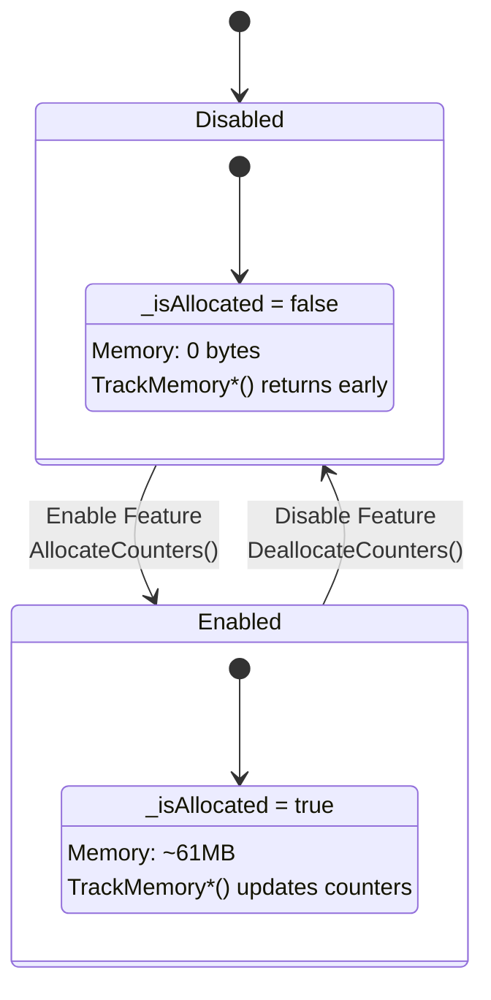
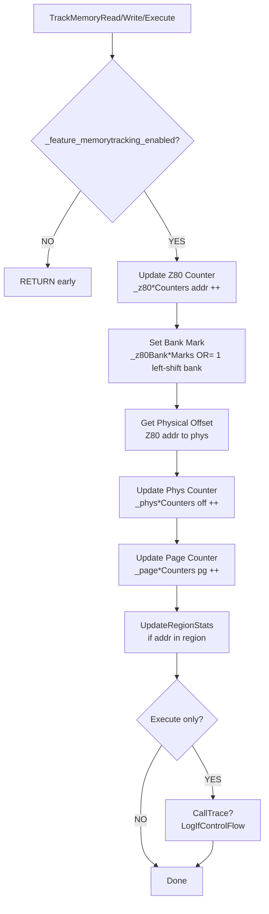
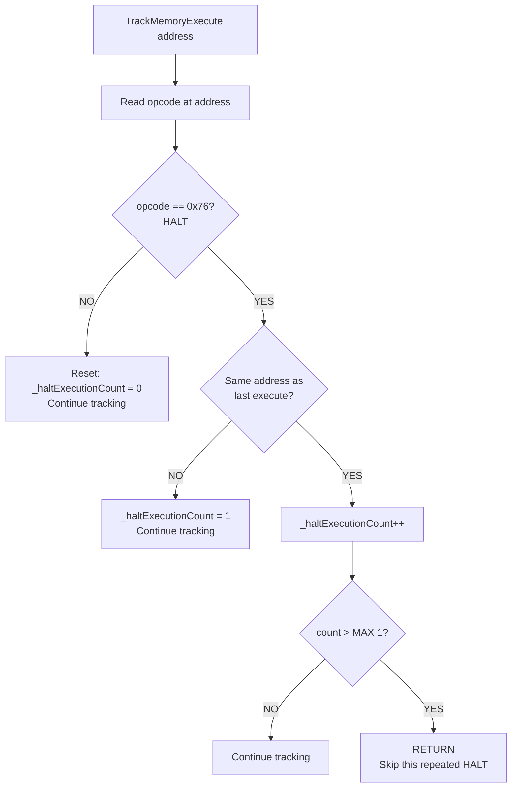
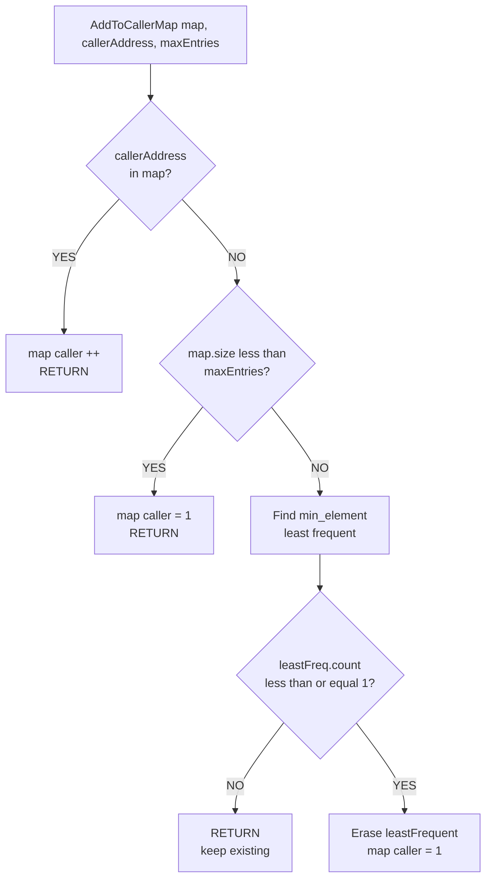
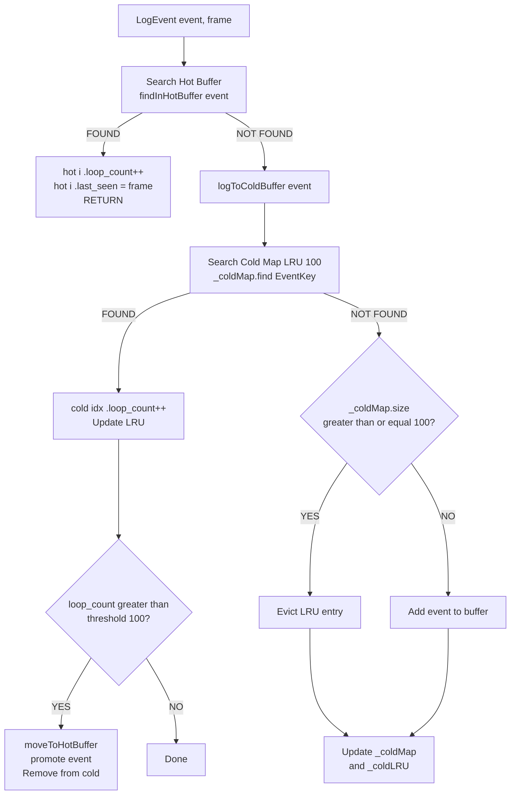
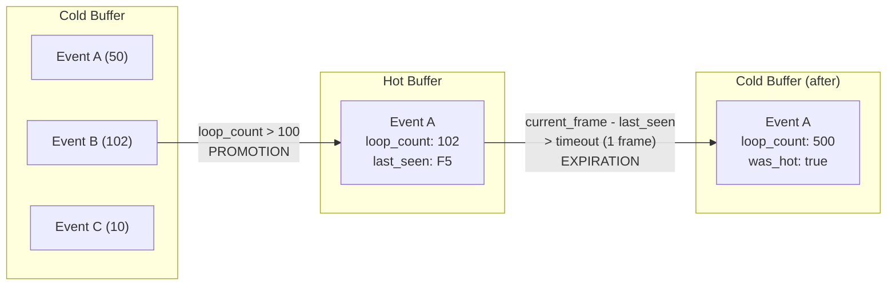
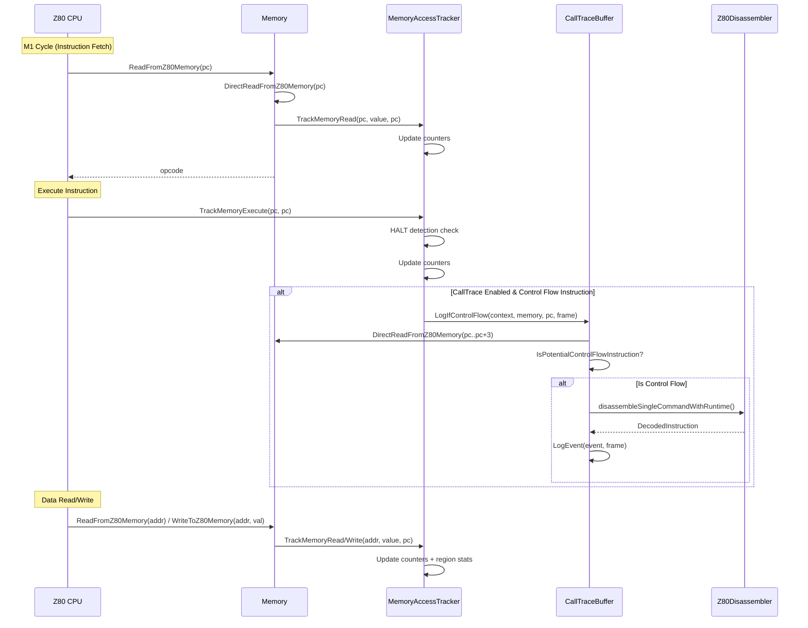

# Memory Counters: Architectural Design & TDD

**Purpose:** Technical design document for the memory access tracking and control flow tracing subsystems in unreal-ng.

**Status:** Fully implemented. This document serves as architectural reference and test-driven specification.

---

## 1. Overview

The memory counters subsystem provides comprehensive instrumentation for Z80 emulation, enabling:

1. **Memory Access Tracking** - Per-address read/write/execute counters
2. **Control Flow Tracing** - Logging of jumps, calls, returns, and loops
3. **Port Access Monitoring** - I/O port access statistics
4. **Time-Sliced Analysis** - Segmented tracking by frame/interrupt

### 1.1 Component Relationship

```
┌────────────────────────────────────────────────────────────────┐
│                        EmulatorContext                         │
│  ┌─────────────────────────────────────────────────────────┐   │
│  │                   MemoryAccessTracker                   │   │
│  │  ┌─────────────────┐  ┌─────────────────────────────┐   │   │
│  │  │ Z80 Counters    │  │ Physical Memory Counters    │   │   │
│  │  │ 64KB × 3 types  │  │ MAX_PAGES × PAGE_SIZE       │   │   │
│  │  │ (R/W/X)         │  │ × 3 types (R/W/X)           │   │   │
│  │  └─────────────────┘  └─────────────────────────────┘   │   │
│  │  ┌─────────────────┐  ┌─────────────────────────────┐   │   │
│  │  │ Monitored       │  │ Monitored Ports             │   │   │
│  │  │ Regions         │  │ (with caller/data tracking) │   │   │
│  │  └─────────────────┘  └─────────────────────────────┘   │   │
│  │  ┌─────────────────────────────────────────────────┐    │   │
│  │  │              CallTraceBuffer                    │    │   │
│  │  │  ┌──────────────┐  ┌──────────────────────┐     │    │   │
│  │  │  │ Cold Buffer  │  │ Hot Buffer (pinned)  │     │    │   │
│  │  │  │ (ring, 1M-1G)│  │ (LRU, 1024 events)   │     │    │   │
│  │  │  └──────────────┘  └──────────────────────┘     │    │   │
│  │  └─────────────────────────────────────────────────┘    │   │
│  └─────────────────────────────────────────────────────────┘   │
└────────────────────────────────────────────────────────────────┘
```

**Source Files:**
- [memoryaccesstracker.h](../../../core/src/emulator/memory/memoryaccesstracker.h)
- [memoryaccesstracker.cpp](../../../core/src/emulator/memory/memoryaccesstracker.cpp)
- [calltrace.h](../../../core/src/emulator/memory/calltrace.h)
- [calltrace.cpp](../../../core/src/emulator/memory/calltrace.cpp)

---

## 2. MemoryAccessTracker

### 2.1 Design Goals

| Goal | Implementation |
|------|----------------|
| Minimal hot-path overhead | Feature-gated, lazy allocation |
| Bank-aware tracking | Physical memory counters with page mapping |
| Flexible granularity | Global counters + opt-in detailed regions |
| Memory efficiency | LFU eviction for caller/data maps |
| Runtime toggle | Feature flags control allocation/deallocation |

### 2.2 Data Structures

#### 2.2.1 Access Types

```cpp
enum class AccessType : uint8_t {
    Read = 0x01,
    Write = 0x02,
    Execute = 0x04,
    All = Read | Write | Execute
};
```

#### 2.2.2 Tracking Modes

```cpp
enum class TrackingMode : uint8_t {
    Z80AddressSpace,  // Track in 64KB virtual address space
    PhysicalMemory    // Track in physical memory pages (bank-aware)
};
```

#### 2.2.3 Counter Arrays

| Counter Array | Size | Purpose |
|---------------|------|---------|
| `_z80ReadCounters` | 64KB | Per-address read count (Z80 space) |
| `_z80WriteCounters` | 64KB | Per-address write count (Z80 space) |
| `_z80ExecuteCounters` | 64KB | Per-address execute count (Z80 space) |
| `_physReadCounters` | PAGE_SIZE × MAX_PAGES | Physical memory reads |
| `_physWriteCounters` | PAGE_SIZE × MAX_PAGES | Physical memory writes |
| `_physExecuteCounters` | PAGE_SIZE × MAX_PAGES | Physical memory executes |
| `_pageReadCounters` | MAX_PAGES | Aggregated page-level reads |
| `_pageWriteCounters` | MAX_PAGES | Aggregated page-level writes |
| `_pageExecuteCounters` | MAX_PAGES | Aggregated page-level executes |

**Memory Budget:**
- Z80 counters: 3 × 64KB × 4 bytes = **768 KB**
- Physical counters: 3 × 323 × 16KB × 4 bytes = **~60.5 MB**
- Page counters: 3 × 323 × 4 bytes = **~4 KB**

#### 2.2.4 MonitoringOptions

```cpp
struct MonitoringOptions {
    bool trackCallers = false;     // Track PC addresses that access this region
    bool trackDataFlow = false;    // Track data values read/written
    uint32_t maxCallers = 100;     // LFU eviction limit for callers
    uint32_t maxDataValues = 100;  // LFU eviction limit for values
};
```

#### 2.2.5 AccessStats

```cpp
struct AccessStats {
    uint32_t readCount = 0;
    uint32_t writeCount = 0;
    uint32_t executeCount = 0;
    
    // Optional detailed tracking (when enabled via MonitoringOptions)
    std::unordered_map<uint16_t, uint32_t> callerAddresses;  // caller PC -> count
    std::unordered_map<uint8_t, uint32_t> dataValues;        // data value -> frequency
};
```

#### 2.2.6 MonitoredRegion

```cpp
struct MonitoredRegion {
    std::string name;           // User-friendly identifier
    uint16_t startAddress;      // Region start in Z80 space
    uint16_t length;            // Size in bytes
    MonitoringOptions options;  // Tracking configuration
    AccessStats stats;          // Accumulated statistics
    TrackingMode mode;          // Z80 or physical tracking
};
```

#### 2.2.7 MonitoredPort

```cpp
struct MonitoredPort {
    std::string name;           // User-friendly identifier
    uint16_t port;              // I/O port number
    MonitoringOptions options;  // Tracking configuration
    AccessStats stats;          // Accumulated statistics
};
```

### 2.3 Lazy Allocation Strategy

The tracker uses **lazy allocation** to avoid memory overhead when tracking is disabled:

```
┌─────────────────────────────────────────────────────────────────┐
│                  Feature Flag State Machine                     │
├─────────────────────────────────────────────────────────────────┤
│                                                                 │
│    ┌──────────────┐                    ┌──────────────┐         │
│    │   DISABLED   │                    │   ENABLED    │         │
│    │ _isAllocated │   Enable Feature   │ _isAllocated │         │
│    │   = false    │ ────────────────►  │   = true     │         │
│    │              │                    │              │         │
│    │ Memory: 0 B  │  ◄───────────────  │ Memory: ~61MB│         │
│    └──────────────┘   Disable Feature  └──────────────┘         │
│           │            (swap-dealloc)          │                │
│           │                                    │                │
│           ▼                                    ▼                │
│    TrackMemory*()                      TrackMemory*()           │
│    returns early                       updates counters         │
│                                                                 │
└─────────────────────────────────────────────────────────────────┘
```

<details>
<summary>Mermaid version (click to expand)</summary>



</details>

```cpp
void MemoryAccessTracker::UpdateFeatureCache() {
    FeatureManager* fm = _context->pFeatureManager;
    bool wasTrackingEnabled = _feature_memorytracking_enabled;
    _feature_memorytracking_enabled = fm->isEnabled(Features::kMemoryTracking);
    
    // Lazy allocation: allocate only when first enabled
    if (_feature_memorytracking_enabled && !_isAllocated) {
        AllocateCounters();
    }
    // Deallocation: free when disabled to reclaim memory
    else if (!_feature_memorytracking_enabled && wasTrackingEnabled && _isAllocated) {
        DeallocateCounters();
    }
}
```

**Deallocation** uses swap-with-empty to guarantee memory release:

```cpp
void MemoryAccessTracker::DeallocateCounters() {
    std::vector<uint32_t>().swap(_z80ReadCounters);  // Forces deallocation
    std::vector<uint32_t>().swap(_z80WriteCounters);
    // ... etc
    _isAllocated = false;
}
```

### 2.4 Memory Access Tracking Flow

```
┌─────────────────────────────────────────────────────────────────────────────┐
│                     TrackMemoryRead / Write / Execute                       │
└─────────────────────────────────────────────────────────────────────────────┘
                                    │
                                    ▼
                    ┌──────────────────────────────────┐
                    │ _feature_memorytracking_enabled? │
                    └──────────────────────────────────┘
                           │              │
                          NO             YES
                           │              │
                           ▼              ▼
                       [RETURN]   ┌────────────────────────┐
                                  │ Update Z80 Counter     │
                                  │ _z80*Counters[addr]++  │
                                  └────────────────────────┘
                                           │
                                           ▼
                                  ┌───────────────────┐
                                  │ Set Bank Mark     │
                                  │ _z80Bank*Marks |= │
                                  │   (1 << bank)     │
                                  └───────────────────┘
                                           │
                                           ▼
                                  ┌────────────────────┐
                                  │ Get Physical Offset│
                                  │ (Z80 addr → phys)  │
                                  └────────────────────┘
                                           │
                                           ▼
                                  ┌──────────────────────┐
                                  │ Update Phys Counter. │
                                  │ _phys*Counters[off]++│
                                  └──────────────────────┘
                                           │
                                           ▼
                                  ┌─────────────────────┐
                                  │ Update Page Counter │
                                  │ _page*Counters[pg]++│
                                  └─────────────────────┘
                                           │
                                           ▼
                                  ┌────────────────────┐
                                  │ UpdateRegionStats  │
                                  │ (if addr in region)│
                                  └────────────────────┘
                                           │
                                           ▼ (Execute only)
                                  ┌────────────────────┐
                                  │ CallTrace?         │
                                  │ LogIfControlFlow() │
                                  └────────────────────┘
```

<details>
<summary>Mermaid version (click to expand)</summary>



</details>

### 2.5 HALT Instruction Handling

The Z80 HALT instruction (0x76) spins at the same PC until an interrupt. Without mitigation, this would inflate execute counters to millions per second.

```
┌─────────────────────────────────────────────────────────────┐
│                    HALT Detection Flow                      │
└─────────────────────────────────────────────────────────────┘
        TrackMemoryExecute(address)
                    │
                    ▼
          ┌─────────────────┐
          │ Read opcode at  │
          │    address      │
          └─────────────────┘
                    │
                    ▼
          ┌─────────────────┐
          │ opcode == 0x76? │──NO──► Reset: _haltExecutionCount = 0
          │    (HALT)       │        Continue tracking
          └─────────────────┘
                    │
                   YES
                    │
                    ▼
          ┌─────────────────┐
          │ Same address as │──NO──► _haltExecutionCount = 1
          │  last execute?  │        Continue tracking
          └─────────────────┘
                    │
                   YES
                    │
                    ▼
          ┌─────────────────────┐
          │ _haltExecutionCount++│
          │ count > MAX (1)?    │──NO──► Continue tracking
          └─────────────────────┘
                    │
                   YES
                    │
                    ▼
               [RETURN]
          (Skip this repeated HALT)
```

<details>
<summary>Mermaid version (click to expand)</summary>



</details>

**Solution:** HALT detection with configurable limit:

```cpp
void MemoryAccessTracker::TrackMemoryExecute(uint16_t address, uint16_t callerAddress) {
    if (_memory != nullptr) {
        uint8_t opcode = _memory->DirectReadFromZ80Memory(address);
        if (opcode == 0x76) {  // HALT instruction
            if (address == _lastExecutedAddress) {
                _haltExecutionCount++;
                if (_haltExecutionCount > MAX_HALT_EXECUTIONS) {
                    return;  // Skip tracking repeated HALTs
                }
            } else {
                _lastExecutedAddress = address;
                _haltExecutionCount = 1;
            }
        } else {
            _lastExecutedAddress = address;
            _haltExecutionCount = 0;
        }
    }
    // ... continue with normal tracking
}
```

### 2.6 LFU Eviction for Caller/Data Maps

When caller or data value maps reach their limit, the **Least Frequently Used** entry is evicted:

```
┌─────────────────────────────────────────────────────────────┐
│                   LFU Eviction Algorithm                    │
└─────────────────────────────────────────────────────────────┘
        AddToCallerMap(map, callerAddress, maxEntries)
                        │
                        ▼
              ┌─────────────────┐
              │ callerAddress   │──YES──► map[caller]++
              │ in map?         │         [RETURN]
              └─────────────────┘
                        │
                       NO
                        │
                        ▼
              ┌─────────────────┐
              │ map.size() <    │──YES──► map[caller] = 1
              │   maxEntries?   │         [RETURN]
              └─────────────────┘
                        │
                       NO (map is full)
                        │
                        ▼
              ┌─────────────────────┐
              │ Find min_element    │
              │ (least frequent)    │
              └─────────────────────┘
                        │
                        ▼
              ┌─────────────────────┐
              │ leastFreq.count ≤ 1?│──NO──► [RETURN]
              └─────────────────────┘        (keep existing)
                        │
                       YES
                        │
                        ▼
              ┌─────────────────────┐
              │ Erase leastFrequent │
              │ map[caller] = 1     │
              └─────────────────────┘
```

<details>
<summary>Mermaid version (click to expand)</summary>



</details>

```cpp
void MemoryAccessTracker::AddToCallerMap(
    std::unordered_map<uint16_t, uint32_t>& map, 
    uint16_t callerAddress, 
    uint32_t maxEntries) 
{
    auto it = map.find(callerAddress);
    if (it != map.end()) {
        if (it->second < UINT32_MAX) it->second++;
    }
    else if (map.size() < maxEntries) {
        map[callerAddress] = 1;
    }
    else {
        // Find and evict least frequent entry
        auto leastFrequent = std::min_element(map.begin(), map.end(),
            [](const auto& a, const auto& b) { return a.second < b.second; });
        
        if (leastFrequent != map.end() && leastFrequent->second <= 1) {
            map.erase(leastFrequent);
            map[callerAddress] = 1;
        }
    }
}
```

### 2.6 Segmented Tracking

Time-sliced analysis divides execution into segments (frames, interrupts, custom events):

```cpp
struct TrackingSegment {
    std::string name;         // "Frame 1234", "Interrupt 5"
    TrackingEvent eventType;  // Frame, Interrupt, Custom
    uint32_t eventId;         // Sequence number
    
    // Snapshot of statistics at segment end
    std::unordered_map<std::string, AccessStats> regionStats;
    std::unordered_map<std::string, AccessStats> portStats;
};
```

**Usage:**
```cpp
// At frame boundary
memoryAccessTracker->StartSegment("Frame 100", TrackingEvent::Frame, 100);

// ... emulation runs ...

// At next frame boundary
memoryAccessTracker->EndSegment();  // Captures current stats
memoryAccessTracker->StartSegment("Frame 101", TrackingEvent::Frame, 101);
```

---

## 3. CallTraceBuffer

### 3.1 Design Goals

| Goal | Implementation |
|------|----------------|
| Capture all control flow | Log JP, JR, CALL, RST, RET, RETI, DJNZ |
| Compress loops efficiently | Increment `loop_count` for repeated events |
| Bound memory usage | Hot/cold buffer architecture with hard limits |
| Thread safety | Mutex-protected operations |
| Bank awareness | Record memory mapping for each event |

### 3.2 Hot/Cold Buffer Architecture

```
┌────────────────────────────────────────────────────────────┐
│                    CallTraceBuffer                         │
├────────────────────────────────────────────────────────────┤
│  Cold Buffer (Ring Buffer)                                 │
│  ┌─────────────────────────────────────────────────────┐   │
│  │ Initial: 1M events, grows to max 1GB                │   │
│  │ Loop compression via EventKey lookup                │   │
│  │ LRU map (100 entries) for fast duplicate detection  │   │
│  └─────────────────────────────────────────────────────┘   │
│                           ↑                                │
│                    promotion (loop_count > 100)            │
│                           ↓                                │
│  Hot Buffer (Pinned Events)                                │
│  ┌─────────────────────────────────────────────────────┐   │
│  │ Capacity: 1024 events                               │   │
│  │ Events expire after 1 frame of inactivity           │   │
│  │ Expired events return to cold buffer                │   │
│  └─────────────────────────────────────────────────────┘   │
└────────────────────────────────────────────────────────────┘
```

### 3.3 Data Structures

#### 3.3.1 Z80BankInfo

```cpp
struct Z80BankInfo {
    bool is_rom;       // true = ROM, false = RAM
    uint8_t page_num;  // Page number within ROM or RAM
    
    bool operator==(const Z80BankInfo& rhs) const {
        return is_rom == rhs.is_rom && page_num == rhs.page_num;
    }
};
```

#### 3.3.2 Z80ControlFlowEvent

```cpp
struct Z80ControlFlowEvent {
    uint16_t m1_pc;                     // PC at instruction fetch
    uint16_t target_addr;               // Jump/call/return target
    std::vector<uint8_t> opcode_bytes;  // Full instruction bytes
    uint8_t flags;                      // Z80 F register at execution
    Z80CFType type;                     // JP, JR, CALL, RST, RET, RETI, DJNZ
    std::array<Z80BankInfo, 4> banks;   // Memory mapping for all 4 banks
    uint16_t sp;                        // Stack pointer after execution
    std::array<uint16_t, 3> stack_top;  // Top 3 stack values (for RET analysis)
    uint32_t loop_count = 1;            // Compression counter
    bool was_hot = false;               // Pinned in hot buffer (never saved)
};
```

#### 3.3.3 Z80CFType

```cpp
enum class Z80CFType : uint8_t {
    JP,    // Absolute jump
    JR,    // Relative jump
    CALL,  // Subroutine call
    RST,   // Restart vector call
    RET,   // Return from subroutine
    RETI,  // Return from interrupt
    DJNZ   // Decrement and jump if not zero
};
```

#### 3.3.4 HotEvent

```cpp
struct HotEvent {
    Z80ControlFlowEvent event;  // The compressed event
    uint32_t loop_count;        // Accumulated iterations
    uint64_t last_seen_frame;   // Last frame this event occurred
};
```

#### 3.3.5 EventKey (Fast Lookup)

```cpp
struct EventKey {
    uint16_t m1_pc;
    uint16_t target_addr;
    uint32_t opcode_bytes_packed = 0;
    uint8_t opcode_len = 0;
    Z80CFType type;
    std::array<Z80BankInfo, 4> banks;
    
    bool operator==(const EventKey& rhs) const { ... }
};
```

### 3.4 Buffer Constants

```cpp
constexpr size_t CALLTRACE_INITIAL_SIZE = 1'000'000;  // 1M events
constexpr size_t CALLTRACE_MAX_SIZE = (1ull << 30) / sizeof(Z80ControlFlowEvent);  // ~12.5M events (1GB)
```

### 3.5 Event Logging Flow

```
┌─────────────────────────────────────────────────────────────────────────────┐
│                          LogEvent(event, frame)                             │
└─────────────────────────────────────────────────────────────────────────────┘
                                    │
                                    ▼
                    ┌───────────────────────────────┐
                    │    Search Hot Buffer          │
                    │    findInHotBuffer(event)     │
                    └───────────────────────────────┘
                           │              │
                        FOUND         NOT FOUND
                           │              │
                           ▼              │
               ┌────────────────────┐     │
               │ hot[i].loop_count++│     │
               │ hot[i].last_seen   │     │
               │   = current_frame  │     │
               │     [RETURN]       │     │
               └────────────────────┘     │
                                          │
                                          ▼
                          ┌───────────────────────────────┐
                          │     logToColdBuffer(event)    │
                          └───────────────────────────────┘
                                          │
                                          ▼
                          ┌───────────────────────────────┐
                          │  Search Cold Map (LRU, 100)   │
                          │  _coldMap.find(EventKey)      │
                          └───────────────────────────────┘
                                 │              │
                              FOUND         NOT FOUND
                                 │              │
                                 ▼              ▼
                     ┌─────────────────┐  ┌─────────────────┐
                     │ cold[idx]       │  │ _coldMap.size() │
                     │ .loop_count++   │  │ >= 100?         │
                     │ Update LRU      │  └─────────────────┘
                     └─────────────────┘         │        │
                                 │              YES       NO
                                 ▼               │        │
                     ┌─────────────────┐         ▼        ▼
                     │ loop_count >    │  ┌──────────┐ ┌──────────┐
                     │ threshold(100)? │  │ Evict LRU│ │Add event │
                     └─────────────────┘  │  entry   │ │to buffer │
                            │        │    └──────────┘ └──────────┘
                           YES       NO        │             │
                            │        │         └──────┬──────┘
                            ▼        ▼                │
                     ┌─────────────────┐              ▼
                     │ moveToHotBuffer │       ┌─────────────────┐
                     │ (promote event) │       │ Update _coldMap │
                     │ Remove from cold│       │ & _coldLRU      │
                     └─────────────────┘       └─────────────────┘
```

<details>
<summary>Mermaid version (click to expand)</summary>



</details>

### 3.6 Loop Compression

Identical consecutive events are compressed by incrementing `loop_count`:

**Without compression:** 1M iterations of a tight loop = 1M events = 80MB
**With compression:** 1M iterations = 1 event with loop_count=1,000,000 = 80 bytes

**Compression key fields:**
- `m1_pc` - Same instruction address
- `target_addr` - Same jump target
- `type` - Same instruction type
- `banks` - Same memory mapping
- `opcode_bytes` - Same instruction bytes

**Excluded from key:**
- `flags` - May vary between iterations
- `loop_count` - Accumulator field
- `sp` - May vary for some instructions
- `stack_top` - Return address data

### 3.7 Hot Buffer Eviction

Hot events expire when not seen for `hot_timeout_frames` (default: 1 frame):

```
┌─────────────────────────────────────────────────────────────┐
│              Hot Buffer Lifecycle                           │
└─────────────────────────────────────────────────────────────┘

  Cold Buffer                              Hot Buffer
  ┌────────────────┐                       ┌────────────────┐
  │                │                       │                │
  │  Event A (50)  │  loop_count > 100     │  Event A       │
  │  Event B (102) │ ═══════════════════►  │  loop_count:102│
  │  Event C (10)  │     PROMOTION         │  last_seen: F5 │
  │                │                       │                │
  └────────────────┘                       └────────────────┘
                                                   │
                    current_frame - last_seen      │
                         > timeout (1 frame)       │
                                                   │
  ┌────────────────┐                               │
  │                │        EXPIRATION             │
  │  Event A       │ ◄═════════════════════════════╯
  │  loop_count:500│     (back to cold with
  │  was_hot: true │      preserved loop_count)
  │                │
  └────────────────┘
```

<details>
<summary>Mermaid version (click to expand)</summary>



</details>

```cpp
void CallTraceBuffer::evictExpiredHotEvents(uint64_t current_frame) {
    for (auto it = _hotBuffer.begin(); it != _hotBuffer.end();) {
        if (current_frame - it->last_seen_frame > _hotTimeoutFrames) {
            // Transfer back to cold buffer with preserved loop_count
            Z80ControlFlowEvent ev = it->event;
            ev.loop_count = it->loop_count;
            ev.was_hot = true;
            logToColdBuffer(ev, current_frame);
            it = _hotBuffer.erase(it);
        } else {
            ++it;
        }
    }
}
```

### 3.8 Control Flow Detection

The `LogIfControlFlow` method performs fast-path filtering before expensive disassembly:

```cpp
bool CallTraceBuffer::LogIfControlFlow(EmulatorContext* context, Memory* memory, 
                                       uint16_t address, uint64_t current_frame) {
    // Read instruction bytes
    std::vector<uint8_t> buffer_bytes(Z80Disassembler::MAX_INSTRUCTION_LENGTH);
    for (size_t i = 0; i < Z80Disassembler::MAX_INSTRUCTION_LENGTH; ++i)
        buffer_bytes[i] = memory->DirectReadFromZ80Memory(address + i);
    
    // Fast-path check: skip non-control-flow instructions
    if (!IsPotentialControlFlowInstruction(buffer_bytes))
        return false;
    
    // Full disassembly for confirmed control flow
    DecodedInstruction decoded;
    disasm->disassembleSingleCommandWithRuntime(buffer_bytes, address, nullptr, regs, memory, &decoded);
    
    // ... determine if taken, extract target, log event
}
```

**Fast-path opcodes checked:**
- `0xC2-0xFB` (JP family)
- `0x18, 0x20, 0x28, 0x30, 0x38` (JR family)
- `0xC4-0xFD` (CALL family)
- `0xC0-0xF8` (RET family)
- `0xC7, 0xCF, 0xD7, 0xDF, 0xE7, 0xEF, 0xF7, 0xFF` (RST family)
- `0x10` (DJNZ)
- `0xE9` (JP (HL) / JP (IX) / JP (IY))
- `0xED 0x4D/0x45/...` (RETI/RETN variants)

---

## 4. Integration Points

### 4.1 System Integration Sequence



### 4.2 Memory Access Hooks

**Read:**
```cpp
// In memory.cpp
uint8_t Memory::ReadFromZ80Memory(uint16_t address) {
    uint8_t value = DirectReadFromZ80Memory(address);
    _memoryAccessTracker->TrackMemoryRead(address, value, _context->pCore->GetZ80()->pc);
    return value;
}
```

**Write:**
```cpp
// In memory.cpp
void Memory::WriteToZ80Memory(uint16_t address, uint8_t value) {
    DirectWriteToZ80Memory(address, value);
    _memoryAccessTracker->TrackMemoryWrite(address, value, _context->pCore->GetZ80()->pc);
}
```

**Execute:**
```cpp
// In z80.cpp (M1 cycle)
_memoryAccessTracker->TrackMemoryExecute(pc, pc);
```

### 4.2 Call Trace Integration

Control flow logging is triggered from `TrackMemoryExecute`:

```cpp
void MemoryAccessTracker::TrackMemoryExecute(uint16_t address, uint16_t callerAddress) {
    // ... counter updates ...
    
    // Call trace integration
    if (_feature_calltrace_enabled && _callTraceBuffer) {
        _callTraceBuffer->LogIfControlFlow(_context, _memory, address, 
                                           _context->emulatorState.frame_counter);
    }
}
```

### 4.3 Feature Flags

| Feature Flag | Effect |
|--------------|--------|
| `Features::kDebugMode` | Master gate - all tracking requires debug mode |
| `Features::kMemoryTracking` | Enables MemoryAccessTracker counters |
| `Features::kCallTrace` | Enables CallTraceBuffer logging |

---

## 5. Test-Driven Design Specifications

### 5.1 MemoryAccessTracker Tests

#### 5.1.1 Counter Overflow Protection

```cpp
TEST(MemoryAccessTracker, CountersSaturateAtMax) {
    // Given: A counter at UINT32_MAX - 1
    tracker._z80ReadCounters[0x1234] = UINT32_MAX - 1;
    
    // When: Two more reads occur
    tracker.TrackMemoryRead(0x1234, 0x00, 0x0000);
    tracker.TrackMemoryRead(0x1234, 0x00, 0x0000);
    
    // Then: Counter saturates at UINT32_MAX (no wrap)
    EXPECT_EQ(tracker._z80ReadCounters[0x1234], UINT32_MAX);
}
```

#### 5.1.2 HALT Detection

```cpp
TEST(MemoryAccessTracker, HaltInstructionLimitsExecutionCount) {
    // Given: HALT instruction at 0x8000
    memory.WriteToZ80Memory(0x8000, 0x76);
    
    // When: Execute is called 1000 times at same address
    for (int i = 0; i < 1000; i++) {
        tracker.TrackMemoryExecute(0x8000, 0x8000);
    }
    
    // Then: Only MAX_HALT_EXECUTIONS (1) is counted
    EXPECT_EQ(tracker._z80ExecuteCounters[0x8000], 1);
}
```

#### 5.1.3 Lazy Allocation

```cpp
TEST(MemoryAccessTracker, CountersNotAllocatedUntilEnabled) {
    // Given: Tracking disabled
    featureManager.disable(Features::kMemoryTracking);
    MemoryAccessTracker tracker(&memory, &context);
    
    // Then: No allocation
    EXPECT_FALSE(tracker._isAllocated);
    EXPECT_TRUE(tracker._z80ReadCounters.empty());
    
    // When: Tracking enabled
    featureManager.enable(Features::kMemoryTracking);
    tracker.UpdateFeatureCache();
    
    // Then: Counters allocated
    EXPECT_TRUE(tracker._isAllocated);
    EXPECT_EQ(tracker._z80ReadCounters.size(), 65536);
}
```

#### 5.1.4 LFU Eviction

```cpp
TEST(MemoryAccessTracker, CallerMapEvictsLeastFrequent) {
    MonitoringOptions opts{.trackCallers = true, .maxCallers = 3};
    tracker.AddMonitoredRegion("test", 0x4000, 1, opts);
    
    // Add 3 callers with different frequencies
    tracker.TrackMemoryRead(0x4000, 0x00, 0x1000);  // caller 0x1000: 1
    tracker.TrackMemoryRead(0x4000, 0x00, 0x2000);  // caller 0x2000: 1
    tracker.TrackMemoryRead(0x4000, 0x00, 0x2000);  // caller 0x2000: 2
    tracker.TrackMemoryRead(0x4000, 0x00, 0x3000);  // caller 0x3000: 1
    
    // Add 4th caller - should evict one with count=1
    tracker.TrackMemoryRead(0x4000, 0x00, 0x4000);
    
    const AccessStats* stats = tracker.GetRegionStats("test");
    EXPECT_EQ(stats->callerAddresses.size(), 3);
    EXPECT_TRUE(stats->callerAddresses.count(0x2000));  // Preserved (count=2)
}
```

### 5.2 CallTraceBuffer Tests

#### 5.2.1 Loop Compression

```cpp
TEST(CallTraceBuffer, CompressesIdenticalEvents) {
    CallTraceBuffer buffer(1000, 100, 100, 1);
    
    Z80ControlFlowEvent event{
        .m1_pc = 0x8000,
        .target_addr = 0x8000,
        .type = Z80CFType::JR,
        .loop_count = 1
    };
    
    // Log same event 500 times
    for (int i = 0; i < 500; i++) {
        buffer.LogEvent(event, 0);
    }
    
    // Should be compressed to 1 event
    EXPECT_EQ(buffer.ColdSize(), 1);
    auto events = buffer.GetLatestCold(1);
    EXPECT_EQ(events[0].loop_count, 500);
}
```

#### 5.2.2 Hot Buffer Promotion

```cpp
TEST(CallTraceBuffer, PromotesToHotAfterThreshold) {
    CallTraceBuffer buffer(1000, 100, 50, 1);  // threshold = 50
    
    Z80ControlFlowEvent event{.m1_pc = 0x8000, .target_addr = 0x8000, .type = Z80CFType::JR};
    
    // Log 51 times (crosses threshold)
    for (int i = 0; i < 51; i++) {
        buffer.LogEvent(event, 0);
    }
    
    EXPECT_EQ(buffer.HotSize(), 1);
}
```

#### 5.2.3 Hot Buffer Expiration

```cpp
TEST(CallTraceBuffer, ExpiresHotEventsAfterTimeout) {
    CallTraceBuffer buffer(1000, 100, 10, 2);  // timeout = 2 frames
    
    Z80ControlFlowEvent event{.m1_pc = 0x8000, .target_addr = 0x8000, .type = Z80CFType::JR};
    
    // Log enough to promote to hot
    for (int i = 0; i < 20; i++) {
        buffer.LogEvent(event, 0);  // frame 0
    }
    EXPECT_EQ(buffer.HotSize(), 1);
    
    // Flush at frame 3 (timeout exceeded)
    buffer.FlushHotBuffer(3);
    
    EXPECT_EQ(buffer.HotSize(), 0);  // Expired back to cold
}
```

#### 5.2.4 Thread Safety

```cpp
TEST(CallTraceBuffer, ThreadSafeLogging) {
    CallTraceBuffer buffer;
    std::atomic<int> logged{0};
    
    auto logEvents = [&](int start) {
        for (int i = 0; i < 1000; i++) {
            Z80ControlFlowEvent ev{.m1_pc = static_cast<uint16_t>(start + i)};
            buffer.LogEvent(ev, 0);
            logged++;
        }
    };
    
    std::thread t1(logEvents, 0);
    std::thread t2(logEvents, 10000);
    t1.join();
    t2.join();
    
    EXPECT_EQ(logged, 2000);
    EXPECT_LE(buffer.ColdSize(), 2000);
}
```

---

## 6. Performance Characteristics

### 6.1 Hot Path Overhead

| Operation | Tracking Disabled | Tracking Enabled |
|-----------|-------------------|------------------|
| Memory Read | 0 cycles | ~10-20 cycles (counter increment) |
| Memory Write | 0 cycles | ~10-20 cycles (counter increment) |
| Memory Execute | 0 cycles | ~50-100 cycles (includes HALT check) |
| Control Flow (non-CF) | N/A | ~5 cycles (fast-path rejection) |
| Control Flow (CF) | N/A | ~500-1000 cycles (disassembly + logging) |

### 6.2 Memory Budget by Configuration

| Configuration | Memory Usage |
|---------------|--------------|
| Disabled | ~0 bytes |
| Z80 counters only | ~768 KB |
| + Physical counters | ~61 MB |
| + 10 monitored regions (full tracking) | ~12 KB |
| + CallTraceBuffer (cold only) | 80 MB - 1 GB |
| + Hot buffer | ~82 KB |

---

## 7. Export Format

### 7.1 YAML Output

```yaml
memory_layout:
  banks:
    - bank: 0
      type: ROM
      page: 0
    - bank: 1
      type: RAM
      page: 5
    - bank: 2
      type: RAM
      page: 2
    - bank: 3
      type: RAM
      page: 0

page_summaries:
  - page: "RAM_5"
    read_count: 125000
    write_count: 3400
    execute_count: 98000
    
  - page: "ROM_0"
    read_count: 45000
    write_count: 0
    execute_count: 12000

calltrace:
  - idx: 0
    m1_pc: 0x8234
    type: CALL
    target: 0x9A00
    flags: 0x44
    loop_count: 50
    sp: 0xFFF8
    opcodes: [0xCD, 0x00, 0x9A]
    banks: [{is_rom: false, page: 5}, ...]
    stack_top: [0x8237, 0x0000, 0x0000]
```

---

## 8. References

### Source Code
- [memoryaccesstracker.h](../../../core/src/emulator/memory/memoryaccesstracker.h)
- [memoryaccesstracker.cpp](../../../core/src/emulator/memory/memoryaccesstracker.cpp)
- [calltrace.h](../../../core/src/emulator/memory/calltrace.h)
- [calltrace.cpp](../../../core/src/emulator/memory/calltrace.cpp)

### Related Documentation
- [Analysis Core Architecture](./analysis-core-architecture.md)
