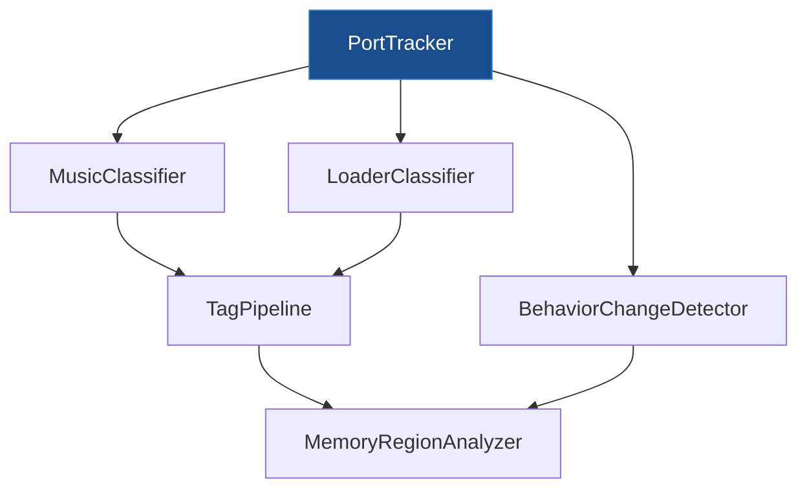

# PortTracker — I/O Port Activity Tracker

## Executive Summary

Design for a dedicated **PortTracker** component that tracks I/O port read/write activity with per-port caller tracking. Extracted from `MemoryAccessTracker` to follow Single Responsibility Principle — `MemoryAccessTracker` stays focused on memory R/W/X counters, while `PortTracker` handles the I/O port domain.

> [!IMPORTANT]
> This is a **prerequisite** for the [memory-segmentation.md](memory-segmentation.md) classifier pipeline. The `MusicClassifier` and `LoaderClassifier` depend on PortTracker to identify which code accesses AY sound registers, FDC ports, and tape edge timing.

---

## 1. Motivation

### 1.1 Why Not Extend MemoryAccessTracker?

| Concern | MemoryAccessTracker | PortTracker |
|:--------|:-------------------|:------------|
| **Domain** | 64KB Z80 address space R/W/X counters | I/O port reads/writes (up to 65536 ports, ~10–15 actually used) |
| **Data volume** | 3 × 64K counters = 768KB minimum | ~10–15 port entries = negligible |
| **Hot-path cost** | Every instruction touches memory | Only IN/OUT instructions touch ports |
| **Current size** | 530+ lines in header alone | Fresh, focused class |
| **Feature gating** | `Features::kMemoryTracking` | `Features::kPortTracking` (independent) |
| **Lifetime** | Tied to memory tracking sessions | Independent session lifecycle |

### 1.2 Consumers

| Consumer | What it needs from PortTracker |
|:---------|:------------------------------|
| **MusicClassifier** | AY register writes (ports 0xFFFD, 0xBFFD), beeper (port 0xFE bit 4), caller PCs |
| **LoaderClassifier** | FDC ports (0x1F, 0x3F, 0x5F, 0x7F), tape edge reads (port 0xFE bit 6), caller PCs |
| **BehaviorChangeDetector** | Port 0xFE read rate changes (tape loading detection) |
| **CLI / UI** | Port activity reports, port heatmap |
| **TRDOSAnalyzer** | Currently uses `MemoryAccessTracker::AddMonitoredPort()` — will migrate |

---

## 2. Feature Toggle

```cpp
namespace Features {
    constexpr const char* const kPortTracking = "analysis.porttracking";
    constexpr const char* const kPortTrackingAlias = "port";
    constexpr const char* const kPortTrackingDesc = 
        "Track I/O port read/write activity with per-port caller tracking. "
        "Required by MusicClassifier, LoaderClassifier. "
        "Lightweight — only accessed ports are tracked. Requires analysis master toggle.";
}
```

Hierarchy within the analysis feature tree:

```
Features::kAnalysis (master gate)                     [default: OFF]
  ├── Features::kAnalysisSegmentation                 [default: ON*]
  │     ├── Features::kAnalysisClassifiers            [default: ON*]
  │     └── Features::kAnalysisBehaviorDetection      [default: ON*]
  └── Features::kPortTracking                         [default: ON*]

* = ON when parent is enabled
```

> [!NOTE]
> `PortTracking` is a **sibling** of `AnalysisSegmentation`, not a child. This allows enabling port tracking independently of the full segmentation pipeline — useful for standalone port monitoring via CLI.

---

## 3. Class Design

### 3.1 PortTracker Class Declaration

```cpp
#pragma once
#include <cstdint>
#include <string>
#include <unordered_map>
#include <vector>

#include "emulator/memory/memoryaccesstracker.h"  // For ProfilerSessionState

class EmulatorContext;

/// @brief Tracks I/O port read/write activity with per-port caller tracking.
/// @details Separate from MemoryAccessTracker (which handles memory R/W/X).
///          Receives port events from the I/O dispatch layer.
///          Gated by Features::kPortTracking.
///
///          Data model: lazy allocation per-port. Only ports that are actually
///          accessed get entries. On a typical ZX Spectrum program, only 5–15
///          ports are used, so memory footprint stays very small (~1–5KB).
class PortTracker {
public:
    explicit PortTracker(EmulatorContext* context);
    ~PortTracker();
    
    // === Event Recording (called from I/O dispatch hot path) ===
    
    /// Record a port read event.
    /// @param port     Full 16-bit port address (Z80 uses all 16 bits for decoding)
    /// @param value    Byte value read from the port
    /// @param callerPC PC of the IN instruction that triggered this read
    void TrackRead(uint16_t port, uint8_t value, uint16_t callerPC);
    
    /// Record a port write event.
    /// @param port     Full 16-bit port address
    /// @param value    Byte value written to the port
    /// @param callerPC PC of the OUT instruction that triggered this write
    void TrackWrite(uint16_t port, uint8_t value, uint16_t callerPC);
    
    // === Query API (used by classifiers and reporting) ===
    
    /// Get total write count for a specific I/O port.
    uint32_t GetWriteCount(uint16_t port) const;
    
    /// Get total read count for a specific I/O port.
    uint32_t GetReadCount(uint16_t port) const;
    
    /// Get the set of PCs that wrote to a specific I/O port.
    /// @return Map: caller_PC → write_count. Empty map if port has no writes.
    const std::unordered_map<uint16_t, uint32_t>& GetWriteCallers(uint16_t port) const;
    
    /// Get the set of PCs that read from a specific I/O port.
    /// @return Map: caller_PC → read_count. Empty map if port has no reads.
    const std::unordered_map<uint16_t, uint32_t>& GetReadCallers(uint16_t port) const;
    
    /// Get list of all ports that had any activity.
    std::vector<uint16_t> GetActivePorts() const;
    
    /// Check if a specific port has any recorded activity.
    bool HasActivity(uint16_t port) const;
    
    /// Per-port summary for reports / CLI.
    struct PortSummary {
        uint16_t port;
        uint32_t readCount;
        uint32_t writeCount;
        uint32_t uniqueReadCallers;
        uint32_t uniqueWriteCallers;
    };
    
    /// Get summaries for all active ports, sorted by port number.
    std::vector<PortSummary> GetPortSummaries() const;
    
    /// Get summary for a specific port.
    /// @return PortSummary with all zeros if port has no activity.
    PortSummary GetPortSummary(uint16_t port) const;
    
    /// Get total number of tracked ports.
    size_t GetActivePortCount() const;
    
    // === Data Value Tracking ===
    
    /// Get the distribution of values written to a specific port.
    /// @return Map: value → write_count. Empty if no writes.
    const std::unordered_map<uint8_t, uint32_t>& GetWriteValues(uint16_t port) const;
    
    /// Get the distribution of values read from a specific port.
    /// @return Map: value → read_count. Empty if no reads.
    const std::unordered_map<uint8_t, uint32_t>& GetReadValues(uint16_t port) const;
    
    // === Lifecycle ===
    
    /// Reset all tracked data (clears all port entries).
    void Reset();
    
    /// Check if tracking is active (session is Capturing).
    bool IsActive() const;
    
    // === Session Control (mirrors MemoryAccessTracker pattern) ===
    
    /// Start a new tracking session (clears previous data).
    void StartSession();
    
    /// Pause tracking (retains data).
    void PauseSession();
    
    /// Resume a paused session.
    void ResumeSession();
    
    /// Stop tracking (retains data until cleared).
    void StopSession();
    
    /// Get current session state.
    ProfilerSessionState GetSessionState() const;
    
    // === Reporting ===
    
    /// Generate a human-readable port activity report.
    std::string GenerateReport() const;
    
private:
    EmulatorContext* _context;
    ProfilerSessionState _sessionState = ProfilerSessionState::Stopped;
    
    /// Per-port tracking data. Lazy allocation — only ports that are
    /// actually accessed get entries.
    struct PortData {
        uint32_t readCount = 0;
        uint32_t writeCount = 0;
        std::unordered_map<uint16_t, uint32_t> readCallers;    // caller_PC → count
        std::unordered_map<uint16_t, uint32_t> writeCallers;   // caller_PC → count
        std::unordered_map<uint8_t, uint32_t> readValues;      // value → count
        std::unordered_map<uint8_t, uint32_t> writeValues;     // value → count
    };
    std::unordered_map<uint16_t, PortData> _ports;
    
    /// Sentinel empty maps returned by const-ref getters when port has no data.
    static const std::unordered_map<uint16_t, uint32_t> _emptyCallerMap;
    static const std::unordered_map<uint8_t, uint32_t> _emptyValueMap;
};
```

### 3.2 Key Design Decisions

| Decision | Rationale |
|:---------|:---------|
| **Lazy port allocation** | Only ports actually accessed get `PortData` entries. ZX Spectrum uses ~10–15 ports, so memory footprint is negligible even with full caller/value tracking. |
| **16-bit port keys** | Z80 uses full 16-bit address bus for IN/OUT. Some peripherals decode high byte (e.g., AY uses A15+A14 for register select). Using the full 16-bit port captures this. |
| **Value tracking included** | MusicClassifier needs to see what AY register values are written (to distinguish register select from data). Small overhead — only 256 possible values per port. |
| **No pre-registration** | Unlike `MemoryAccessTracker::AddMonitoredPort()`, PortTracker doesn't require pre-registering ports. Any port that is accessed is automatically tracked. |
| **Session control mirrors MAT** | Same `Start/Pause/Resume/Stop` pattern as `MemoryAccessTracker` for consistency. |

---

## 4. Integration Points

### 4.1 EmulatorContext

Add `PortTracker` to the emulator context alongside existing profiling components:

```cpp
// In emulatorcontext.h:
class PortTracker;  // Forward declaration

struct EmulatorContext {
    // ... existing fields ...
    MemoryAccessTracker* pTracker = nullptr;   // Existing
    PortTracker* pPortTracker = nullptr;        // NEW
};
```

### 4.2 I/O Dispatch Integration

Currently, port tracking is handled by `MemoryAccessTracker::TrackPortRead/Write()`. With PortTracker:

```cpp
// In port decoder / I/O dispatch:
void onPortRead(uint16_t port, uint8_t value, uint16_t callerPC) {
    // NEW: dedicated PortTracker
    if (context->pPortTracker && context->pPortTracker->IsActive()) {
        context->pPortTracker->TrackRead(port, value, callerPC);
    }
}

void onPortWrite(uint16_t port, uint8_t value, uint16_t callerPC) {
    // NEW: dedicated PortTracker
    if (context->pPortTracker && context->pPortTracker->IsActive()) {
        context->pPortTracker->TrackWrite(port, value, callerPC);
    }
}
```

### 4.3 AnalysisContext

PortTracker is exposed to classifiers via `AnalysisContext`:

```cpp
struct AnalysisContext {
    const MemoryAccessTracker* tracker;     // R/W/X counters, memory caller maps
    const PortTracker* portTracker;         // Port I/O counts + caller maps  ← NEW
    const CallTraceBuffer* callTrace;       // CALL/RET/JP events
    const uint8_t* memory;                  // Raw Z80 memory (64KB)
    const TRDOSAnalyzer* trdosAnalyzer;     // Disk operation events
    uint64_t currentFrame;
    uint64_t totalTStates;
    const std::array<BlockType, 65536>* types;
};
```

### 4.4 Classifier Usage Examples

```cpp
// MusicClassifier — detect AY music player code:
void MusicClassifier::classify(/*...*/, const AnalysisContext& ctx) {
    if (!ctx.portTracker) return;
    
    // Check AY register select port (0xFFFD)
    uint32_t ayRegWrites = ctx.portTracker->GetWriteCount(0xFFFD);
    uint32_t ayDataWrites = ctx.portTracker->GetWriteCount(0xBFFD);
    
    if (ayRegWrites > 100 && ayDataWrites > 100) {
        // Get which CODE routines write to AY
        const auto& callers = ctx.portTracker->GetWriteCallers(0xFFFD);
        for (auto& [pc, count] : callers) {
            // Tag the caller routine as MusicPlayerCode
            if (types[pc] == BlockType::CODE) {
                tags[pc] |= MemoryTag::MusicPlayerCode;
            }
        }
    }
}

// LoaderClassifier — detect tape loading:
void LoaderClassifier::classify(/*...*/, const AnalysisContext& ctx) {
    if (!ctx.portTracker) return;
    
    // Tape loading reads port 0xFE bit 6 very frequently
    uint32_t feReads = ctx.portTracker->GetReadCount(0x00FE);
    if (feReads > 50000) {  // Typical tape loader threshold
        const auto& callers = ctx.portTracker->GetReadCallers(0x00FE);
        for (auto& [pc, count] : callers) {
            if (count > 10000) {
                tags[pc] |= MemoryTag::TapeLoaderCode;
            }
        }
    }
}
```

---

## 5. Migration from MemoryAccessTracker

### 5.1 Current Port-Related APIs on MemoryAccessTracker (to deprecate)

| API | Status | Replacement |
|:----|:-------|:-----------|
| `AddMonitoredPort(name, port, opts)` | **Deprecate** | `PortTracker` auto-tracks all accessed ports |
| `RemoveMonitoredPort(name)` | **Deprecate** | Not needed — PortTracker tracks everything |
| `GetPortStats(name)` | **Deprecate** | `PortTracker::GetPortSummary(port)` |
| `TrackPortRead(port, value, caller)` | **Deprecate** | `PortTracker::TrackRead(port, value, caller)` |
| `TrackPortWrite(port, value, caller)` | **Deprecate** | `PortTracker::TrackWrite(port, value, caller)` |
| `MonitoredPort` struct | **Deprecate** | `PortTracker::PortData` (internal) + `PortSummary` (public) |
| `GeneratePortReport()` | **Deprecate** | `PortTracker::GenerateReport()` |

### 5.2 Migration Steps

1. **Phase 1:** Create `PortTracker` class with full API. Add to `EmulatorContext`.
2. **Phase 2:** Wire I/O dispatch to call both `MemoryAccessTracker` (existing) AND `PortTracker` (new). Dual-tracking during transition.
3. **Phase 3:** Mark old APIs as `[[deprecated("Use PortTracker instead")]]`.
4. **Phase 4:** Migrate consumers:
   - TRDOSAnalyzer monitoring → `PortTracker`
   - CLI `port` commands → `PortTracker`
   - Any existing port-based analysis → `PortTracker`
5. **Phase 5:** Remove deprecated APIs from `MemoryAccessTracker` and stop dual-tracking in I/O dispatch.

### 5.3 Backward Compatibility

During the transition period (Phases 2–4), both `MemoryAccessTracker` port APIs and `PortTracker` are active. The `[[deprecated]]` compiler warnings guide developers to migrate. No runtime behavior changes — dual-tracking is harmless (slight performance redundancy, no data conflicts).

---

## 6. Performance Characteristics

| Metric | Value | Notes |
|:-------|:------|:------|
| **Hot-path overhead per IN/OUT** | ~50ns | One hash map lookup + increment |
| **Memory per tracked port** | ~200 bytes base + ~32 bytes per unique caller | Lazy allocation |
| **Typical total memory** | ~1–5KB | 10–15 ports × ~200 bytes + callers |
| **Maximum memory** | ~500KB | Pathological case: all 65536 ports, many callers |
| **Reset cost** | ~1µs | Clear one hash map |
| **Report generation** | ~10µs | Iterate ~10 ports |

> [!TIP]
> PortTracker is intrinsically lightweight because ZX Spectrum programs use very few ports. The lazy allocation model ensures zero cost for unused ports.

---

## 7. ZX Spectrum Port Reference

Common ports that PortTracker will see on a typical program:

| Port | Direction | Peripheral | Relevance to Classifiers |
|:-----|:----------|:-----------|:------------------------|
| `0x00FE` | R/W | ULA | **R:** Keyboard, tape input (bit 6). **W:** Border color, speaker (bit 4) |
| `0xFFFD` | W | AY-3-8910 | Register select. MusicClassifier key signal |
| `0xBFFD` | W | AY-3-8910 | Register data write. MusicClassifier key signal |
| `0xFFFD` | R | AY-3-8910 | Register data read (less common) |
| `0x7FFD` | W | 128K paging | Memory paging register. Bank switch detection |
| `0x1FFD` | W | +3 paging | Extended paging / disk motor |
| `0x001F` | R/W | Beta 128 (FDC) | WD1793 command/status register |
| `0x003F` | R/W | Beta 128 (FDC) | WD1793 track register |
| `0x005F` | R/W | Beta 128 (FDC) | WD1793 sector register |
| `0x007F` | R/W | Beta 128 (FDC) | WD1793 data register |
| `0x00FF` | R/W | Beta 128 (FDC) | System register (drive select, side, density) |
| `0xFBDF` | W | COVOX | Digital-to-analog audio output |

---

## 8. CLI Integration

```
# Session control
porttracker start              # Start tracking session (clears previous)
porttracker stop               # Stop tracking (data retained)
porttracker pause              # Pause tracking
porttracker resume             # Resume paused session
porttracker reset              # Clear all data

# Querying
porttracker list               # List all active ports with summary
porttracker detail 0xFFFD      # Show detailed stats for AY register select port
porttracker callers 0xFFFD w   # Show write callers for port 0xFFFD
porttracker callers 0x00FE r   # Show read callers for port 0xFE
porttracker values 0xBFFD w    # Show value distribution written to AY data port
porttracker report             # Full human-readable report
```

Example output:

```
> porttracker list
PORT     READS    WRITES   R-CALLERS  W-CALLERS
0x00FE   125000   3200     2          5
0xBFFD   0        15000    0          1
0xFFFD   200      15000    1          1
0x7FFD   0        3        0          1

> porttracker callers 0xFFFD w
PORT 0xFFFD WRITE CALLERS:
  0x8005   14500 writes  (96.7%)
  0x80A2   500   writes  (3.3%)

> porttracker values 0xFFFD w
PORT 0xFFFD VALUE DISTRIBUTION (writes):
  0x00 (R0/ToneA Fine)    3000  (20.0%)
  0x01 (R1/ToneA Coarse)  3000  (20.0%)
  0x07 (R7/Mixer)         1500  (10.0%)
  0x08 (R8/AmpA)          1500  (10.0%)
  ...
```

---

## 9. Source Files

### New Files

| File | Purpose | Est. LOC |
|:-----|:--------|:---------|
| `core/src/emulator/io/porttracker.h` | PortTracker class declaration | ~120 |
| `core/src/emulator/io/porttracker.cpp` | PortTracker implementation | ~200 |
| `core/tests/emulator/io/porttracker_test.cpp` | Unit tests | ~150 |

### Existing Files to Modify

| File | Changes |
|:-----|:--------|
| `core/src/emulator/emulatorcontext.h` | Add `PortTracker* pPortTracker` field |
| `core/src/base/featuremanager.h` | Add `kPortTracking` constant |
| `core/src/emulator/io/portdecoder*.cpp` | Wire I/O dispatch to call `PortTracker` |
| `core/src/emulator/memory/memoryaccesstracker.h` | Mark `TrackPortRead/Write`, `AddMonitoredPort`, `GetPortStats` as `[[deprecated]]` |
| `core/automation/cli/src/commands/cli-processor-analyzer-mgr.cpp` | Add `porttracker` CLI commands |

---

## 10. Implementation Roadmap

### Phase 1: Core class (~2 days)

- [ ] `PortTracker` class with `TrackRead()`, `TrackWrite()`, query APIs
- [ ] Session control (`Start/Pause/Resume/Stop`)
- [ ] `Features::kPortTracking` toggle registration
- [ ] Unit tests for tracking, querying, session lifecycle
- [ ] Add `pPortTracker` to `EmulatorContext`

### Phase 2: I/O dispatch wiring (~1 day)

- [ ] Wire port decoders to call `PortTracker::TrackRead/Write`
- [ ] Dual-tracking: both `MemoryAccessTracker` and `PortTracker` receive events during transition
- [ ] Integration test: run emulation, verify port data matches expectations

### Phase 3: CLI + deprecation (~1 day)

- [ ] CLI commands: `porttracker list/detail/callers/values/report`
- [ ] Mark old `MemoryAccessTracker` port APIs as `[[deprecated]]`
- [ ] `GenerateReport()` with human-readable port names

### Phase 4: Consumer migration (as classifiers are built)

- [ ] Migrate TRDOSAnalyzer from `AddMonitoredPort()` to `PortTracker`
- [ ] MusicClassifier uses `PortTracker`
- [ ] LoaderClassifier uses `PortTracker`
- [ ] BehaviorChangeDetector uses `PortTracker` for tape detection hints

---

## 11. Relationship to Memory Segmentation

This component is designed as a **prerequisite dependency** for the [Memory Region Segmentation](memory-segmentation.md) system:



The `AnalysisContext` struct (defined in [memory-segmentation.md](memory-segmentation.md) §15.4) includes a `const PortTracker* portTracker` field that classifiers use to query port activity.
