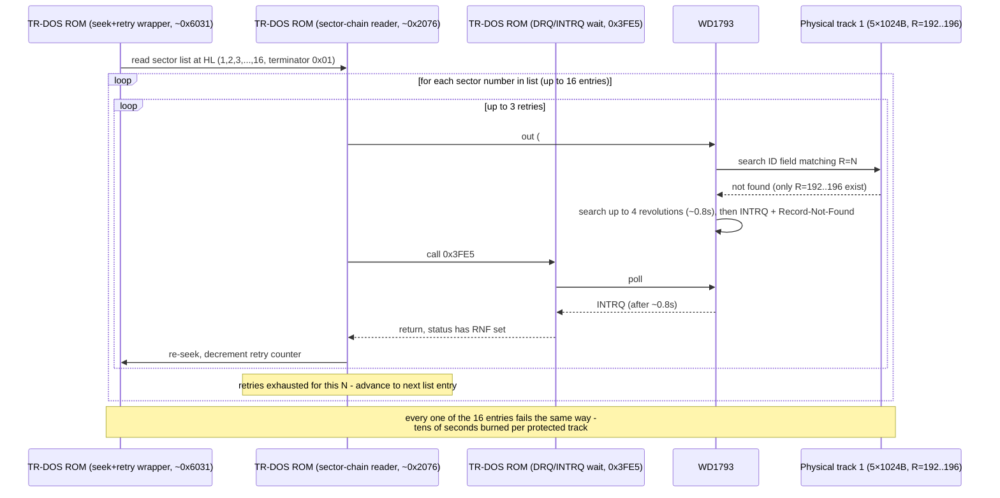
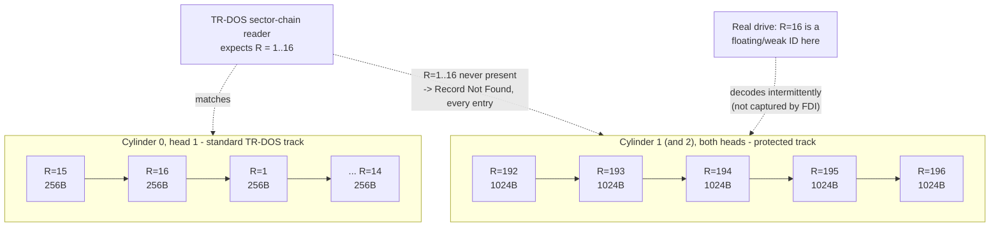
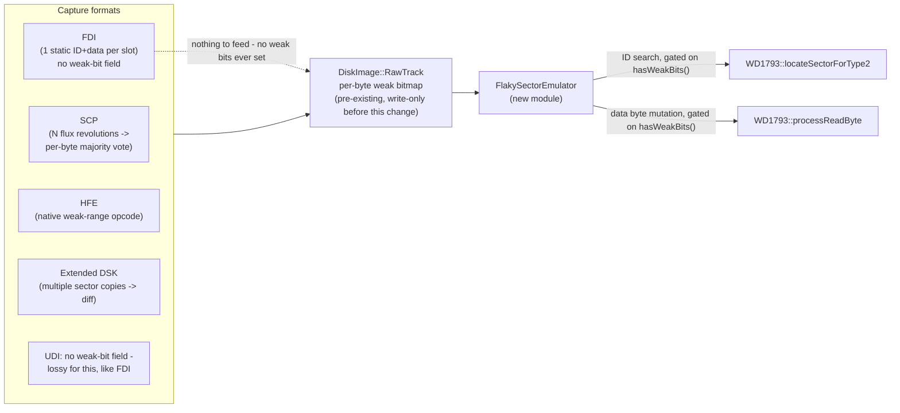

# Black Raven (VORON1.FDI) — "loading stops" protection analysis

**Fixture**: `testdata/loaders/fdi/VORON1.FDI` (`VORON2.FDI` shares the general protection
family but uses a different, incompatible track-0 layout - see §8.4)
**Repro snapshot**: [`snapshot.sna`](snapshot.sna) — Pentagon 128, disk inserted in drive A,
paused mid-load with WD1793 stuck retrying `Read Sector` (track 1, side 0, sector 16). Load
it, re-insert `VORON1.FDI` in drive A (snapshots don't carry disk contents), and resume.
**Related**: [Flaky/floating sector emulator](../../WD1793/FlakySectorEmulator.md) — the
emulation-strategy design and implementation that came out of this investigation.

## 1. Symptom

Booting `VORON1.FDI` under TR-DOS on Pentagon 128 shows the `TR-DOS Ver 5.04T` banner, the
drive motor turns on, and then loading appears to freeze — the screen never advances past
the banner, and the drive keeps clicking/seeking with no progress for a very long time
(tens of seconds to minutes, effectively "never" from a user's perspective).

## 2. Live evidence (via the `unreal-ng` MCP debugger)

Attaching to the running emulator and inspecting FDC state mid-hang:

```
fsm_state: S_WAIT
last_command: read_sector
registers: { command: 0x80, track: 1, sector: 16, status: 0x11 }
status_bits: { busy: true, record_not_found: true, drq: false, intrq: false }
drive: { track: 1, side: 0/1 (alternating), motor_on: true }
PC: 0x3FE5  →  in a,(#FF) / and #C0 / jr z,#3FE5 / ret m
```

`0x3FE5` is the standard Beta-128/TR-DOS ROM "wait for DRQ or INTRQ" primitive (poll the
system port `#FF`, bits 6–7). A call trace across repeated 40-frame (0.8 s) windows landed
on the *exact* same instruction sequence and loop iteration count every time — the retry is
completely periodic and deterministic, not a random stall.

Walking up the call stack from `0x3FE5` lands in a well-known TR-DOS ROM primitive at
`0x2076`-ish (every Beta-128 ROM disassembly documents this shape): read a physical sector
number from a list at `HL`, issue `WD1793` command `0x80` (Read Sector), wait, retry up to 3
times with a re-seek between attempts, then advance to the next sector number in the list
(terminated by a `0x01` sentinel) — the standard multi-sector chain reader. One level above
that is TR-DOS's seek-and-retry wrapper (compares an error counter before/after, retries the
whole seek+read up to 3 times, then gives up and moves the track register on). None of this
is game-specific code — it is stock TR-DOS ROM, doing exactly what it always does when asked
to read a sector.

## 3. Root cause: the physical track doesn't have sector 16

Parsing `VORON1.FDI`'s track headers directly (script in §6) for cylinder 1 (both sides):

```
cyl=1 head=0 sectorCount=5
   C=1 H=0 R=192 N=3 (1024 bytes) flags=0x08
   C=1 H=0 R=193 N=3 (1024 bytes) flags=0x08
   C=1 H=0 R=194 N=3 (1024 bytes) flags=0x08
   C=1 H=0 R=195 N=3 (1024 bytes) flags=0x08
   C=1 H=0 R=196 N=3 (1024 bytes) flags=0x08
```

Cylinder 0 side 1 (the standard TR-DOS system track) has the expected 16×256-byte layout
with sector numbers 1–16. From cylinder 1 onward, the disk has been **reformatted with 5
non-standard 1024-byte sectors carrying sector-ID numbers 192–196** instead of 1–16 or
1–5. There is no sector `R=16` anywhere on that physical track — nor `R=1..15` — under any
head. Cylinder 2 (both sides) repeats the same 192–196 pattern (dumped further out on the
same protected region).

So when TR-DOS's stock sector-chain reader walks its sector list (1, 2, 3, ... 16, the
ordinary interleaved TR-DOS geometry) against this track, **every single entry** in that
list gets `Record Not Found` — not just "16" (that's simply whichever list entry happened
to be current when the debugger was attached). Each failed entry costs up to 3 attempts × a
WD1793 ID-search window (up to 4 disk revolutions, ≈ 0.8 s each) before TR-DOS's own retry
logic gives up and advances — tens of seconds of dead time for one protected track, and the
disk has at least two such tracks in the captured region (cylinders 1 and 2 in this dump).
That reads as "stops loading" to anyone watching, whether or not the outer loop is
mathematically infinite.

Separately, cylinder 55/head 1 (physical position `cyl=59, head=1` in the dump — see §6
script) carries a sector whose **ID field lies about its own cylinder** (`C=55` while
physically on cylinder 59) and whose flags mark the data CRC as always-invalid
(`flags=0x00`, i.e. "data present, CRC error" per `docs/file-formats/disk-images/fdi.md`).
That is a second, independent protection check later in the disk (a classic "verify the
CRC-bad sector and the lying cylinder byte survived the copy" trap) — not the one that
produces the boot-time hang, but the same family of trick.

## 4. Why this worked on the original disk but not in FDI

A single deterministic capture — which is all FDI can express (see
[fdi.md](../../file-formats/disk-images/fdi.md): one fixed `(C,H,R,N,flags)` header and one
fixed data blob per physical slot, forever) — cannot distinguish "this track legitimately
has no sector 16" from "this track has a **floating/weak** sector 16 that only decodes on
some revolutions". Those look identical to a naive one-pass disk reader/dumper.

The standard explanation for exactly this shape of protection (reformat a track with
oddly-numbered large sectors, and rely on the *real* drive occasionally decoding a
weak/marginal ID as the "missing" small-sector number) is a **floating sector**: the
original media has a physically marginal spot where the flux pattern is ambiguous, so one
revolution's ID Address Mark decodes as `R=16` (satisfying the loader) while another
decodes as garbage or as one of the 192–196 IDs. A bit-perfect, single-pass image (FDI, but
also a plain TRD/SCL dump, or any tool that "cleans up" the disk) can only record one of
those outcomes — and it always records the *stable*, standard-formatted one, because that's
what a naive sector-by-sector copier/dumper actually samples. The floating ID never gets
captured at all. Hence: on real hardware the loader's retry eventually gets lucky and
proceeds in well under a second; in a deterministic dump, it never does.

This directly answers the question that kicked off this investigation — **does FDI already
store a map of "bad"/floating sectors that the emulator just isn't using?** No: FDI's 7-byte
sector header only has bits for "CRC valid for size N", "deleted DAM", and "no data field"
(`docs/file-formats/disk-images/fdi.md` §Sector Flags) — there is no field for "this ID/data
is unstable across reads", and there cannot be one without changing what a single FDI
capture pass records in the first place. What the codebase *does* already have — unused
until this investigation — is a **per-byte weak-bit bitmap on `DiskImage::RawTrack`**,
already populated by the SCP/HFE/DSK loaders (all of which support multi-revolution or
native weak-region capture) but never consulted by the live WD1793 model. See
[Flaky/floating sector emulator](../../WD1793/FlakySectorEmulator.md) for the fix built on
top of that.

## 5. Diagrams

### 5.1 Boot/load call chain observed at the hang



### 5.2 Disk layout: standard vs. protected track



### 5.3 Emulation strategy (implemented)



## 6. Reproduction script (FDI track dump)

```python
import struct
path = "testdata/loaders/fdi/VORON1.FDI"
data = open(path, "rb").read()
cylinders = struct.unpack_from("<H", data, 4)[0]
heads = struct.unpack_from("<H", data, 6)[0]
extra_len = struct.unpack_from("<H", data, 12)[0]
offset = 14 + extra_len
for cyl in range(cylinders):
    for head in range(heads):
        struct.unpack_from("<I", data, offset)  # track data offset (unused here)
        sector_count = data[offset + 6]
        offset += 7
        sectors = []
        for s in range(sector_count):
            sh = data[offset:offset + 7]
            sectors.append((sh[0], sh[1], sh[2], sh[3], sh[4]))  # C,H,R,N,flags
            offset += 7
        if cyl in (0, 1, 2):
            print(cyl, head, sectors)
```

## 7. What's implemented vs. still open

**Implemented** (see [FlakySectorEmulator.md](../../WD1793/FlakySectorEmulator.md) for
detail): `WD1793` now consults the existing `DiskImage::RawTrack` weak-bit bitmap through a
dedicated `FlakySectorEmulator` module — a weak IDAM becomes visible on 1 of every 4
revolutions instead of never, and a weak data byte is mutated per read attempt instead of
being static. This is purely additive and verified to change nothing for solid tracks
(all 249 WD1793/DiskImage/loader tests pass unchanged).

**Still open** (data problem, not a code problem): `VORON1.FDI`/`VORON2.FDI` carry zero weak
bits — FDI cannot record them, and no richer capture (SCP/HFE/extended DSK; not UDI,
which cannot store weak bits either) of this specific
media is known to exist yet. `FlakySectorEmulator` has nothing to act on until one does.
Making these two fixtures actually boot needs either (a) a real flux-level re-dump of the
original floppies converted to a weak-bit-capable format, or (b) a deliberately
hand-authored compatibility patch that marks the R=192..196 tracks' IDAM regions as weak in
a converted copy — the latter is a plausible, cheap way to validate the emulator change
against this exact title without new hardware, and is a reasonable next step if this game's
playability is a goal.

**Which sectors, specifically, need to be marked weak**: still undetermined precisely. §8
establishes that the track-1 sector-list reads traced in §§1-3 are issued by *code loaded
from the disk itself* (stage 2+, reached via catalog sector 1's `CALL 3D13h` / `JP 6000h`
chain), not by generic TR-DOS ROM behavior - confirming the sector list is parametrized in
VORON1's own loader, exactly as hypothesized at the start of this investigation, rather than
being a fixed, guessable interleave. Pinning down the exact list requires following that
chain (§8.3's suggested next step: a breakpoint on `0x6000-0x60FF` reached from a live
catalog-touching operation) to reach and read the actual parametrized sector table, which
this session did not complete.

> **Update (2026-09-22)** — narrowed to two candidates, and the storage side is now designed.
> See [UDI weak-bit storage + FlakySectorEmulator end-to-end](../../inprogress/2026-09-22-udi-weak-bit-storage/design.md) §6:
>
> - **M1 (prime suspect)** — cylinder 59 / head 1, `R=192` **data field**: the only CRC-bad
>   data on the disk, physically co-located with the lying-`C=55` ID. Marked weak, it models
>   the acetone spot as *fuzzy data* — a "read twice, expect different bytes" check fails
>   **silently** on deterministic media, matching the silent derailment observed in §8.3's
>   journal trace;
> - **M2** — a synthetic weak-IDAM "floating" sector (`R` in `1..16`) on a protected track,
>   if the check stub's `0x5DE0` poll (§8.3 update) turns out to wait for a sector that must
>   appear on some revolutions only.
>
> The choice between them is gated on the `0x5D8C–0x5E30` check-stub disassembly and
> io-write mining (ports `0x1F`/`0x5F`) of a fresh TTD journal. Storage no longer blocks
> either: the designed `UDIW` trailer chunk makes UDI round-trip weak bits, so the marks can
> be authored into a copy of the stock `VORON1.UDI` by a pure-python tool — no re-dump of
> the original media needed.

> **Update (2026-09-23)** — the M1/M2 gate dissolved: the "silent derailment" was a harness
> bug, not a protection check. The deterministic boot recipe entered 48K BASIC from the
> 128K menu, and that ROM transition ends with `OUT 0x7FFD,0x30` — bit 5 latches the
> paging lock — so every later loader bank write was ignored (0xC000 pinned to page 0,
> all game banks piled into one page, the `0x5DE0`/0xF5C9 derail). The emulator itself is
> faithful (pure-execution OUT test passes bank switch, lock, and reset-clears-lock).
> After fixing every harness script to boot via **128K BASIC**, **both the stock
> `VORON1.UDI` and the M1 weak fixture boot to a running game**: 149 READ commands
> (cyl 0–13 + 64–68, all `st=00`), full 8-page depack, animated intro, RAM-resident with
> no further FDC access. The boot path never reads cylinder 59 — the lying-C/CRC-bad
> sector is a *later-in-the-disk* check whose consumer remains unidentified, so the live
> weak-bit A/B on this title is still open. Full story and evidence:
> [design §10](../../inprogress/2026-09-22-udi-weak-bit-storage/design.md).

## 8. The real bootstrap: a forged catalog that TR-DOS's own `RUN "boot"` executes as code

Everything in §§1-7 traces what happens *after* TR-DOS starts loading something from this
disk. This section covers *why it starts loading at all*, and it's a second, independent
protection layer from the floating-sector one above: the disk carries no legitimate TR-DOS
filesystem, and getting TR-DOS to touch its catalog at all - which every one of `CAT`,
`LIST`, and the automatic boot sequence does - runs attacker-controlled code instead of
reading a directory.

### 8.1 TR-DOS unconditionally does `RUN "boot"` on entry

`core/src/emulator/io/fdc/diskautostart.cpp` documents (and byte-for-byte reproduces) a
fixed sequence present in `$027B-$02AE` of *every* TR-DOS ROM: on cold entry, before any
user input, it builds the literal text `RUN "boot"` in the BASIC input-line buffer
(`E_LINE`, system variable `#5C59`) and jumps into the command loop as if the user had
typed and entered it. This is not an emulator convenience feature - `DiskAutostart` is the
emulator's *own*, independent reimplementation of this behavior for its "insert and it just
starts" UX, gated on `catalog.Parse()` succeeding first. Confirmed against
`data/rom/trdos504t.rom` directly: the exact 53-byte sequence from `diskautostart.cpp`'s
`BOOT_LINE_BUILDER_BYTES` is present at ROM offset `0x027B`.

The practical consequence: entering TR-DOS on *any* disk, real hardware or emulated, tries
to find and run a BASIC file literally named `boot` - no keypress required. Real TR-DOS
disks conventionally ship exactly such a file for this reason.

### 8.2 VORON1's catalog fails every structural check

`testdata/loaders/fdi/VORON1.FDI`, track 0 side 1 (the standard TR-DOS system track,
confirmed 16×256-byte geometry - see §3):

- **Disk-info sector (logical sector 9)**: byte 0 is `0x80` (a valid TR-DOS disk-info sector
  requires `0x00` here - `TrdosCatalog::IsTrdos`, `core/src/emulator/io/fdc/trdoscatalog.cpp`),
  and the TR-DOS-id byte at offset `0xE7` is `0xF0`, not the required `0x10`. **This disk
  fails `IsTrdos()` outright** - this project's own catalog parser (and by extension its
  `CAT`/`DIR`-equivalent tooling, and the `DiskAutostart` convenience feature) correctly
  refuses to read it as a filesystem at all (confirmed live: `GET .../disk/A/catalog`
  reports `file_count: 0` for this disk, not because the catalog is genuinely empty, but
  because it isn't recognized as a catalog in the first place).
- **Catalog sector 1** (the first of the 8 sectors that would normally hold file entries):
  the very first byte is `0x00`, which a standards-following parser reads as "end of
  catalog, zero files" and stops immediately (`TrdosCatalog::Parse`'s exact behavior, byte
  for byte the same convention real TR-DOS ROM uses).

By every structural rule TR-DOS defines, this disk has **no filesystem and no files**.

### 8.3 ...except catalog sector 1 disassembles as a deliberate, working loader

Dumped and disassembled directly (`docs/disasm/black-raven-voron-protection/artifacts/`:
`voron1_fake-catalog.bin` is bytes 1-2048 of the "catalog", i.e. sectors 1-8 concatenated;
`voron1_fake-catalog.z80dasm.asm` is the raw `z80dasm` output). The first 36 bytes, hand
verified against `data/rom/trdos504t.rom`:

```
0000  00                NOP                      ; landing-pad NOP sled
0001  01 23 00          LD BC,0023h
0004  EA AF 32          JP PE,32AFh
0007  10 5D             DJNZ 0064h
0009  ED 5B F4 5C       LD DE,(5CF4h)
000D  0E 05             LD C,05h
000F  CD 13 3D          CALL 3D13h               ; <-- TR-DOS's own documented fast-disk
0012  C9                RET                       ;     service trap (see below)
0013  21 CE E5          LD HL,0E5CEh
0016  06 1B             LD B,1Bh
0018  CD 40 5D          CALL 5D40h                ; block copy/unpack, count=B, dest=HL
001B  21 00 60          LD HL,6000h
001E  06 5E             LD B,5Eh
0020  CD 40 5D          CALL 5D40h                ; second block, dest=6000h
0023  C3 00 60          JP 6000h                  ; hand off to the freshly loaded code
```

`0x3D13` is not a guess - it is the exact, documented address of TR-DOS's ROM-hook "fast
disk loading" service trap (`docs/inprogress/2026-09-16-fast-disk-loading/design.md`),
and service code `$05` in that same document is literally named `READ_SECTORS`. The `LD
C,05h` immediately before `CALL 3D13h` sets that exact service code. This is not noise that
happens to disassemble plausibly - it is a correctly-formed call into a real, documented
ROM service, using the real calling convention, followed by two calls to what is almost
certainly a decompressor (`5D40h`, invoked twice with different destinations/lengths) and a
jump to the standard `6000h` landing address many ZX Spectrum loaders use for the code they
just brought in.

**What this proves**: catalog sector 1 is not corrupted data - it is stage 1 of VORON1's
real bootstrap, planted at the exact location `RUN "boot"`'s file search would touch,
wearing a "no files here" mask (`entry[0] = 0x00`) against anything that checks the field
before reading the bytes as data rather than executing them.

**What this does not yet prove**: the *exact* ROM instruction where control transfers from
"legitimately parsing/printing the catalog" into "executing these bytes as code". `CAT` and
`LIST` were reported (by the person who commissioned this investigation, from direct
knowledge of the title) to trigger the same execution, which is the expected result if the
vulnerable step is the catalog-*read* itself (shared by `RUN "boot"`'s file search, `CAT`,
and `LIST`) rather than something specific to file execution - but this session could not
reach TR-DOS's interactive command prompt to confirm it directly. The blocker was mechanical,
not conceptual: this ROM's Pentagon-service-style "which ROM?" selector menu (reached via
`RANDOMIZE USR 15616`/`15619`, both land in the same menu) did not respond to scripted
arrow-key/digit input in this session despite multiple input strategies (`tap`, `press`
+`release`, `combo`, longer hold durations), and a direct `PC` register override into the
ROM's documented `$027B` boot-line-builder (skipping the menu) landed back in plain 48K
BASIC ROM code instead of TR-DOS - the jump alone doesn't replicate whatever paging/stack
state real menu selection sets up first. **Next step for whoever picks this up**: get a
real (or more patiently scripted) keypress through that menu to "TR-DOS", or - more
reliably - add a debugger breakpoint on execution of address range `0x6000-0x60FF` (the
`JP 6000h` target) before ever entering the menu, then let it run; if VORON1's real loader
is what we think it is, that breakpoint fires regardless of how TR-DOS was reached, and a
call-stack/register dump at that point identifies the exact triggering routine directly
from a live catalog-read attempt.

> **Update (2026-09-22)**: the menu-input blocker is solved — not by better keystroke
> timing, but by avoiding keystrokes entirely: `tools/voron1-detboot.py` reaches the
> TR-DOS prompt deterministically via `/basic/mode {"mode":"48k"}` followed by
> `/basic/run` `RANDOMIZE USR 15616` (the `$3D00` hook pages TR-DOS in directly), then
> issues `RUN"boot"` as a tokenized line. The first TTD-captured run of that sequence
> already refines the picture: the loader *does* start, then silently derails (see the
> `voron1-detboot.py` docstring for the recorded timeline — no error print ever fires).

### 8.4 VORON2 is not the same trick

`VORON2.FDI` cylinder 0 has no 16-sector catalog geometry at all on *either* head - just one
1024-byte sector (`R=9`) per head, total 2KB, matching VORON1's *data area* size but not its
catalog shape. Disassembling that sector's bytes shows no coherent instruction stream (no
plausible `CALL`/service-trap pattern, unlike VORON1's clean, verifiable sequence above) -
it reads as opaque/compressed data, not disguised code. VORON2 almost certainly uses a
different bootstrap trick (it can't rely on `RUN "boot"`'s catalog search at all, since
there's no catalog-shaped data for it to search) and needs its own investigation; the two
titles should not be assumed to share a bootstrap mechanism even though they share the
floating-sector protection family documented in §§1-7.

## 9. Tools and artifacts

All reproduction/analysis scripts live in [`tools/`](tools/) and the extracted code
images + disassembly listings in [`artifacts/`](artifacts/) — same convention as the
other `docs/disasm/` packages (`demo/`'s `trd_mlz.py`, `software/tfmplayer/`'s
`disasm_tfmplayer.py`). Live-run scripts talk to the WebAPI on `localhost:8090` and
create their own PENTAGON instances (except where noted); transient outputs (JSON,
logs, screen GIFs) are written to `scratch/`, never committed.

| Tool | Purpose |
|------|---------|
| `tools/voron1-detboot.py` | Deterministic TR-DOS entry + TTD journal capture: reset → 48K mode → insert → `RANDOMIZE USR 15616` → `RUN"boot"`; stamps error/FDC-region markers. The canonical way in (§8.3). |
| `tools/voron1-damage-map.py` | Offline: aggregates FDI per-sector anomalies (bad CRC / no-data / ID-lying-C/H) grouped by sector number R + track-shape histogram. §3/§7 ground truth. |
| `tools/voron1-revwalk2.py` | TTD backward analysis: last execution per ROM region (origin re-seeked after every `find-last`), deepest FDC progress before a given moment, instruction walk-back. Takes the instance id. |
| `tools/voron1-fwdwalk2.py` | TTD-precise disassembly at exact `(frame, tin)` moments + loop-compressed forward instruction walk. Takes the instance id. |
| `tools/voron1-catch-error.py` | Traps **off** (real FDC): breakpoints on the TR-DOS error path (`0x1D29`/`0x1E36`/`0x1E5A`), dumps regs/stack/ROM string/FDC per hit — built to catch the silent derailment actually firing an error. |
| `tools/voron1-trap-chain.py` | Traps **on** (working path): traces `0x3D13` service calls and loader-stage entries (`0x5F10`/`0x6000`/`0x6200`) — the §8.3 "breakpoint on 0x6000" step. |

Artifacts added alongside the original `voron1_fake-catalog.*`:

- `artifacts/loader-5F00.bin`, `artifacts/loader2-6000.bin`, `artifacts/helpers-5D40.bin`,
  `artifacts/catbuf-5CCD.bin` — RAM-dumped code images from the stage-1 bootstrap chain
  (`CALL 5D40h` blocks and their sources, §8.3);
- `artifacts/voron1-loader.asm`, `artifacts/voron1-loader2.asm`,
  `artifacts/voron1-helpers.asm` — working annotated disassemblies of those images.

Earlier one-off scripts that embedded scripted menu keystrokes (`ttd-boot`, `live-boot`,
`verify-scenario`, walk v1s, `errnr`, `rst08`) or dead instance ids were deliberately **not**
promoted: their methodology is superseded by `voron1-detboot.py`'s deterministic entry,
and their trace constants belong to journals that no longer exist. They remain only in
`scratch/` (git-ignored) as session records.
