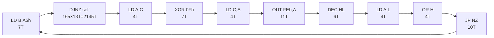
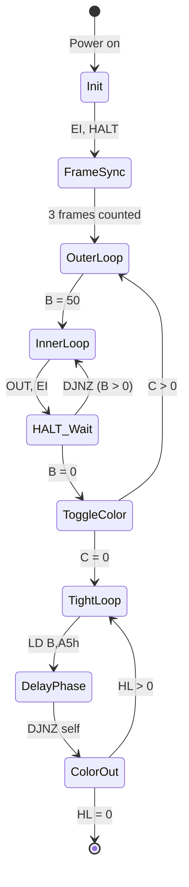

# Edge Demo - Border Synchronization Analysis

Analysis of border effect synchronization techniques used in the Edge demo for ZX Spectrum/Pentagon.

## Overview

The Edge demo uses a multi-stage synchronization approach to achieve stable border effects:

1. **Coarse sync**: HALT instruction waits for INT (frame boundary)
2. **Frame counting**: Multiple frames for effect setup
3. **Tight delay loops**: Counted T-state delays using DJNZ
4. **Color cycling**: XOR-based color toggling for visual effects

## Memory Map

| Address Range | Description |
|--------------|-------------|
| 8000h-8003h | Entry point / jump table |
| 8040h-80A0h | Initialization and frame sync |
| 80A9h-80B3h | Border color output routines |
| 88A2h-88C9h | Main border sync routine |
| BF26h-BF51h | IM2 interrupt handler |
| 625Ah-628Bh | ISR frame counter (not sync-critical) |

## Interrupt Setup

```
IM 2
I = BEh
Vector at BEFFh -> BF26h (INT handler)
```

The INT handler at BF26h is minimal:
```asm
BF26: DI
BF27: JP 625Ah     ; Jump to frame counter
```

## Synchronization Techniques

### 1. Initial Frame Sync (8043h-8046h)

```asm
; Wait for 3 frames to ensure stable starting point
8041: LD A,03h       ; 7T  - Wait 3 frames
8043: EI             ; 4T  - Enable interrupts
8044: HALT           ; 4T  - Wait for INT
8045: DEC A          ; 4T  
8046: JP NZ,8043h    ; 10T - Loop back
```

This ensures the demo starts at a known frame boundary with consistent timing.

### 2. Main Border Sync Routine (88A2h-88C9h)

This is the core synchronization routine:

```asm
; === Phase 1: Framed color cycling with HALT sync ===
88A2: LD A,02h       ; 7T   Border color 2 (red)
88A4: LD C,03h       ; 7T   Outer loop: 3 iterations
88A6: LD B,32h       ; 7T   Inner loop: 50 iterations

; Inner loop - runs 50 times per frame
88A8: OUT (FEh),A    ; 11T  Set border color
88AA: EI             ; 4T   Enable interrupts
88AB: HALT           ; 4T   Wait for next INT
88AC: DJNZ 88A8h     ; 13T  Loop 50 times (taken)

; Toggle color every 50 HALTs
88AE: XOR 07h        ; 7T   Toggle: 02h <-> 05h
88B0: DEC C          ; 4T   Decrement frame counter
88B1: JP NZ,88A6h    ; 10T  Loop 3 times total

; === Phase 2: Tight timing loop for precise positioning ===
88B4: LD HL,0C80h    ; 10T  3200 iterations
88B7: LD C,02h       ; 7T   Starting color

; Precise timing loop
88B9: LD B,A5h       ; 7T   Delay counter = 165
88BB: DJNZ 88BBh     ; 13T  Self-loop: 165 × 13T = 2145T
88BD: LD A,C         ; 4T   Get current color
88BE: XOR 0Fh        ; 7T   Toggle all color bits
88C0: LD C,A         ; 4T   Save new color
88C1: OUT (FEh),A    ; 11T  Change border
88C3: DEC HL         ; 6T   
88C4: LD A,L         ; 4T   
88C5: OR H           ; 4T   Check HL == 0
88C6: JP NZ,88B9h    ; 10T  Loop 3200 times
88C9: RET            ; 10T
```

### 3. Simple Delay Loop (80AFh-80B0h)

```asm
80A9: LD A,05h       ; 7T   Load border color (cyan)
80AB: OUT (FEh),A    ; 11T  Set border
80AD: LD A,7Eh       ; 7T   Delay counter = 126
80AF: DEC A          ; 4T   Decrement
80B0: JP NZ,80AFh    ; 10T  Loop back
```

Delay calculation: 126 × (4T + 10T) = 126 × 14T = **1764T**

## Timing Analysis

### Phase 1 Loop Timing (per HALT iteration)

```
OUT (FEh),A  : 11T
EI           :  4T
HALT         :  4T (+ variable wait for INT)
DJNZ         : 13T (when taken)
─────────────────
Total        : 32T per iteration (excluding INT wait)
```

### Phase 2 Precise Loop Timing



**Per iteration**: 7 + 2145 + 4 + 7 + 4 + 11 + 6 + 4 + 4 + 10 = **2202T**

With 3200 iterations: 3200 × 2202T = **7,046,400T** total

At 3.5MHz: ~2 seconds of border effect

## Color Cycling

The demo uses XOR for efficient color toggling:

| Operation | Input | Output | Visual Effect |
|-----------|-------|--------|---------------|
| XOR 07h | 02h (red) | 05h (cyan) | Complementary colors |
| XOR 07h | 05h (cyan) | 02h (red) | Back to original |
| XOR 0Fh | 02h (red) | 0Dh (magenta) | All bits toggle |
| XOR 0Fh | 0Dh (magenta) | 02h (red) | Full cycle |

## State Machine



## 1-Bit Audio & Sound Generation Architecture

### 1. Overview
The intro to *Across the Edge* by Demarche uses a sophisticated high-density 1-bit **PDM/PWM (Pulse-Density / Pulse-Width Modulation)** synthesis engine. Rather than relying solely on the AY-3-8910 sound chip, the demo drives the ZX Spectrum ULA speaker hardware via Port `#FE` (`OUT (#FE), A`).

### 2. Dual-Channel Hardware Interface (Beeper & Tape OUT)
The ULA output circuit combines two distinct digital bits from Port `#FE`:
- **Bit 4 (EAR / Beeper)**: Primary high-amplitude channel.
- **Bit 3 (MIC / Tape OUT)**: Secondary Tape OUT channel.

On physical ZX Spectrum hardware (Issue 2/3 and Pentagon), the ULA resistor network maps the four combinations of EAR and MIC to analog DAC output levels:

| Bit 4 (EAR) | Bit 3 (MIC) | DAC Amplitude | Relative Level | Use Case |
|:-----------:|:-----------:|:-------------:|:--------------:|:---------|
| 0 | 0 | `-8000` | Baseline Low | Silent / Reset |
| 0 | 1 | `-5500` | Low + MIC ($\Delta = +2500$) | MIC 1-Bit Channel |
| 1 | 0 | `+5500` | High Level | Beeper EAR Channel |
| 1 | 1 | `+8000` | High + MIC ($\Delta = +2500$) | MIC 1-Bit Channel |

Because MIC bit 3 produces an identical step delta ($\Delta = +2500$) regardless of EAR state (`EAR=0` or `EAR=1`), Demarche's 1-bit engine uses MIC (Tape OUT) as an independent audio channel with 1:1 step symmetry.

### 3. Band-Limited Synthesis (`blip_buf`) & Sub-Sample Precision
- The demo's PDM/PWM routine executes ~30,000 state transitions per second at precise T-state timestamps.
- Emulators synthesize this audio using **Blargg's `blip_buf`** band-limited step integrator. Each state transition inserts a step delta ($\Delta$) at sub-sample precision.
- `blip_buf` convolves each delta with a 16-point windowed-sinc impulse table (`bl_step`), producing alias-free 44.1 kHz PCM audio without requiring artificial low-pass filtering or oversampling.
- **Sub-Sample Phase Interpolation**: Precise 2D array row indexing (`in1`, `in2`, `rev1`, `rev2`) during phase interpolation (`delta2`) is essential to prevent phase jitter and parasitic harmonics on high-frequency PDM/PWM pulse trains.

### 4. Empirical 50 Hz Frame Interrupt Click Artifact Analysis
- **Empirical Bitstream Capture**: Capture of `beeper_bitstream.csv` and `lineout_bitstream.csv` over 10 seconds (500 frames @ 50 Hz, 7,982 transitions) confirms that **6,198 transitions** have an exact T-state delta of **2,197 T-states** ($796.54\text{ Hz}$ fundamental tone).
- **Z80 Interrupt Disruption**: Exactly once per 50 Hz frame (every 32 transitions, or 71,939 T-states), the Z80 execution loop is interrupted by hardware frame interrupts (`IM 1`/`IM 2`), stretching that single transition interval from 2,197 T-states to **3,832 T-states** (+1,635 T-states pause).
- **Audio Impact**: This 3,832 T-state pause inserted into the $796.54\text{ Hz}$ sound wave every 20 ms produces an **audible 50 Hz click / phase jump embedded directly in Demarche's Z80 sound code**. This is a hardware-faithful characteristic of the original Z80 demo code and not an emulator synthesis artifact.

---

## Files

- `sync_routine_88a2.asm` - Annotated main sync routine
- `int_handler_bf26.asm` - Interrupt handler disassembly
