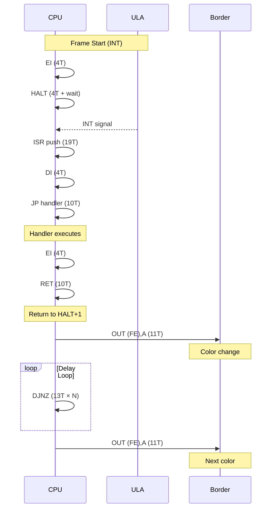

# Edge Demo - Timing Analysis

Detailed timing analysis of border synchronization techniques.

## T-State Reference

| Instruction | T-States | Notes |
|-------------|----------|-------|
| NOP | 4T | |
| LD A,n | 7T | |
| LD r,n | 7T | B, C, D, E, H, L |
| LD r,r' | 4T | |
| OUT (n),A | 11T | |
| IN A,(n) | 11T | |
| EI | 4T | |
| DI | 4T | |
| HALT | 4T | + wait for INT |
| DJNZ e | 13T/8T | taken/not taken |
| JR cc,e | 12T/7T | taken/not taken |
| JP nn | 10T | |
| JP cc,nn | 10T | always (condition checked) |
| CALL nn | 17T | |
| RET | 10T | |
| DEC r | 4T | |
| INC r | 4T | |
| DEC HL | 6T | |
| XOR n | 7T | |
| AND n | 7T | |
| OR r | 4T | |
| EXX | 4T | |
| PUSH rr | 11T | |
| POP rr | 10T | |

## Synchronization Flow



## Critical Path: HALT to Border Change

```
Event                           T-states    Cumulative
─────────────────────────────────────────────────────────
INT signal received             -           0
HALT completes                  4           4
ISR push PC                     11          15
ISR push PC (part 2)            8           23
Fetch opcode at handler         4           27
DI execute                      4           31
JP fetch                        4           35
JP execute                      6           41
... (ISR body)                  varies      varies
EI execute                      4           N
RET fetch                       4           N+4
RET pop + jump                  6           N+10
─────────────────────────────────────────────────────────
First instruction after HALT    -           ~70-100T
```

## Phase 1: HALT-Based Sync

### Loop Structure

```
┌──────────────────────────────────────────────────────┐
│  Outer Loop (C = 3)                                  │
│  ┌────────────────────────────────────────────────┐  │
│  │  Inner Loop (B = 50)                           │  │
│  │  ┌──────────────────────────────────────────┐  │  │
│  │  │  OUT (FE),A    ; 11T - set border       │  │  │
│  │  │  EI            ; 4T                      │  │  │
│  │  │  HALT          ; 4T + wait for INT      │  │  │
│  │  │  DJNZ loop     ; 13T (taken)            │  │  │
│  │  └──────────────────────────────────────────┘  │  │
│  │  XOR 07h          ; 7T - toggle color          │  │
│  │  DEC C            ; 4T                         │  │
│  │  JP NZ,outer      ; 10T                        │  │
│  └────────────────────────────────────────────────┘  │
└──────────────────────────────────────────────────────┘
```

### Timing per Inner Iteration

```
OUT (FE),A  :  11T
EI          :   4T
HALT        :   4T (not counting INT wait)
[INT wait]  :   ~70,000T (one frame @ 3.5MHz)
[ISR exec]  :   ~200T
DJNZ        :  13T
──────────────────────
Total       :  ~70,232T (dominated by frame wait)
```

### Total Phase 1 Duration

- Inner loop: 50 iterations × 70,000T ≈ 3,500,000T per outer
- Outer loop: 3 iterations
- Total: ~10,500,000T ≈ **3 seconds**

## Phase 2: Precise Timing Loop

### Self-Looping DJNZ Technique

```asm
88BB: DJNZ 88BBh      ; Jump to itself!
```

This creates an exact delay:
- B starts at A5h (165)
- Each DJNZ takes 13T (when jumping)
- Final DJNZ takes 8T (when B reaches 0)
- Total: 164 × 13T + 8T = **2140T**

### Full Loop Timing

```
Instruction      T-States    Notes
────────────────────────────────────────────
LD B,A5h              7      Load delay counter
DJNZ self          2140      164×13 + 8 = 2140T
LD A,C                4
XOR 0Fh               7      Toggle color bits
LD C,A                4
OUT (FE),A           11      Border color change
DEC HL                6
LD A,L                4
OR H                  4      Check HL = 0
JP NZ,loop           10      Loop if not zero
────────────────────────────────────────────
Total per iter:    2197T
```

With 3200 iterations: **7,030,400T** ≈ 2.0 seconds @ 3.5MHz

### Border Change Frequency

- One OUT (FE),A every 2197T
- At 3.5MHz: 2197 / 3,500,000 = 0.628ms between changes
- Frequency: ~1593 Hz

## Scanline Correlation

### Pentagon 128K Timing

| Parameter | Value |
|-----------|-------|
| CPU Clock | 3.5MHz |
| T-states per line | 224T |
| Lines per frame | 320 |
| T-states per frame | 71,680T |

### Phase 2 Border Stripes

With 2197T between color changes:
- Lines per stripe: 2197 / 224 ≈ **9.8 scanlines**
- This creates approximately 10-scanline-wide horizontal stripes

## Visual Effect

```
Frame Structure:
┌────────────────────────────────────────┐
│  Upper Border (56 lines)               │
├────────────────────────────────────────┤
│                                        │
│  Screen Area (192 lines)               │
│  ┌──────────────────────────────────┐  │
│  │ ~10 lines ████ Color A           │  │
│  │ ~10 lines ░░░░ Color B           │  │
│  │ ~10 lines ████ Color A           │  │
│  │ ~10 lines ░░░░ Color B           │  │
│  │           ...                    │  │
│  └──────────────────────────────────┘  │
│                                        │
├────────────────────────────────────────┤
│  Lower Border (56 lines)               │
└────────────────────────────────────────┘
```

## Stability Considerations

### Why HALT Sync Works

1. **INT is frame-aligned**: ULA generates INT at consistent beam position
2. **ISR timing is deterministic**: Same code path each time
3. **No contention during border**: No memory contention in border area

### Potential Jitter Sources

| Source | Impact | Mitigation |
|--------|--------|------------|
| ISR execution time | ±few T | Keep ISR minimal |
| Memory contention | 0T in border | N/A - no contention |
| INT acknowledge | Fixed | Hardware guarantees |
| HALT wake latency | Fixed 4T | Hardware guarantees |

### Why No Floating Bus Needed

The Edge demo achieves stability through:
1. HALT ensures frame alignment
2. Counted delays provide scanline precision
3. No sub-scanline precision required for this effect
4. Pentagon doesn't have useful floating bus anyway

## Comparison: HALT vs Floating Bus Sync

| Method | Precision | Complexity | Hardware Deps |
|--------|-----------|------------|---------------|
| HALT + loops | ±1 scanline | Low | Minimal |
| Floating bus | ±4T | High | ULA-specific |
| LD A,R timing | ±7T | Medium | R counter |
| Port contention | ±4T | Medium | ULA memory |

Edge demo uses the simplest approach that meets its requirements - HALT sync is sufficient for ~10-scanline stripe effects.
