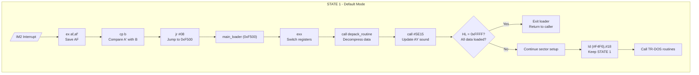
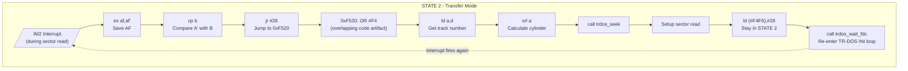
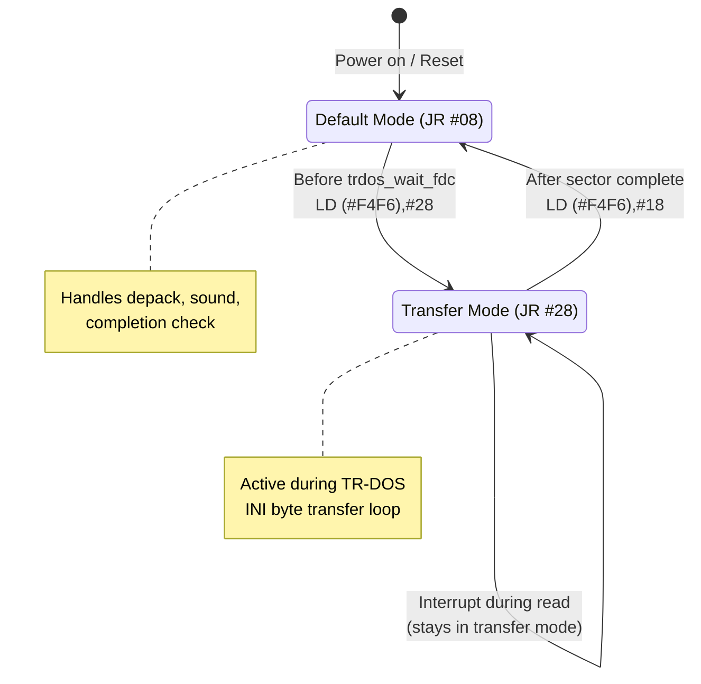

# Insult Demo IM2 Interrupt Handler Analysis

This document describes the self-modifying code (SMC) mechanism used by the Insult demo's IM2 disk loader.

## Overview

The interrupt handler at `0xF4F4` uses a self-modifying JR instruction to switch between two operational modes:

| State | JR Offset | Destination | Purpose |
|-------|-----------|-------------|---------|
| STATE 1 (Default) | `#08` | `0xF500` | Normal processing - depack & update |
| STATE 2 (Transfer) | `#28` | `0xF520` | Active during sector read |

## Handler Code

```z80
; IM2 Handler at 0xF4F4
0xF4F4: ex af,af'       ; Save AF
0xF4F5: cp b            ; Compare A' with B  
0xF4F6: jr XX           ; SMC: XX = #08 or #28
0xF4F8: ld (#F569),a    ; (fallthrough path - normally skipped)
0xF4FB: ex af,af'
0xF4FC: ei
0xF4FD: jp #3D2F        ; TRDOS entry
```

## STATE 1: Default Mode (JR #08)



**Purpose**: Between sector reads, process interrupts to:
- Decompress loaded data
- Update sound
- Check completion status

---

## STATE 2: Transfer Mode (JR #28)



**Purpose**: When interrupt fires during TR-DOS INI loop:
- Re-enter the loading code
- Resume sector reading
- Maintain transfer state

---

## State Transition Diagram



---

## SMC Modification Points

| Address | Instruction | Effect |
|---------|-------------|--------|
| `0xF51F` | `ld (#F4F6),#18` | → STATE 1 (after sector setup) |
| `0xF559` | `ld (#F4F6),#28` | → STATE 2 (before sector read) |
| `0xF565` | `ld (#F4F6),#18` | → STATE 1 (after sector complete) |

---

## Overlapping Code at 0xF520

The jump destination 0xF520 lands in the middle of a `ld (#F4F6),a` instruction:

```
Address:  F51D F51E F51F F520 F521 F522
Bytes:    3E   18   32   F6   F4   7A
          └────┘   └─────────┘   │
          ld a,#18  ld (#F4F6),a  ld a,d
```

When jumped to at 0xF520:
- `F6 F4` = `or #F4` (artifact instruction)
- Immediately overwritten by `ld a,d` at 0xF522

---

## Key Insight: B Register Check

The retry logic at `0xF56F`:
```z80
0xF56E: pop bc         ; Restore BC from before trdos_wait_fdc
0xF56F: ld a,b         ; Get B (INI loop counter residue)
0xF570: pop bc         ; 
0xF571: and a          ; Test if B = 0
0xF572: jr z,.check_status  ; If zero, all 256 bytes read
0xF574: pop hl         ; Otherwise...
0xF575: jr .continue_loading  ; RETRY the sector!
```

**If B ≠ 0 after TR-DOS returns, the sector read is retried.**
