# Insult Demo IM2 Disk Loader - Complete Reverse Engineering

> **Memory Range**: `0xF4F4 - 0xF700` (524 bytes)  
> **Entry Point**: `0xF4F4` (IM2 interrupt handler)  
> **Total Instructions**: 244

## Executive Summary

This loader is a sophisticated **interrupt-driven disk loader** that operates during the IM2 interrupt cycle. It loads data from TR-DOS floppy disk sectors while simultaneously running a visual "LOADING" effect via a depack/decrunching routine.

The architecture uses **self-modifying code (SMC)** to dynamically switch between two operating modes during interrupt handling, enabling seamless integration with the TR-DOS ROM gateway.

---

## Memory Map

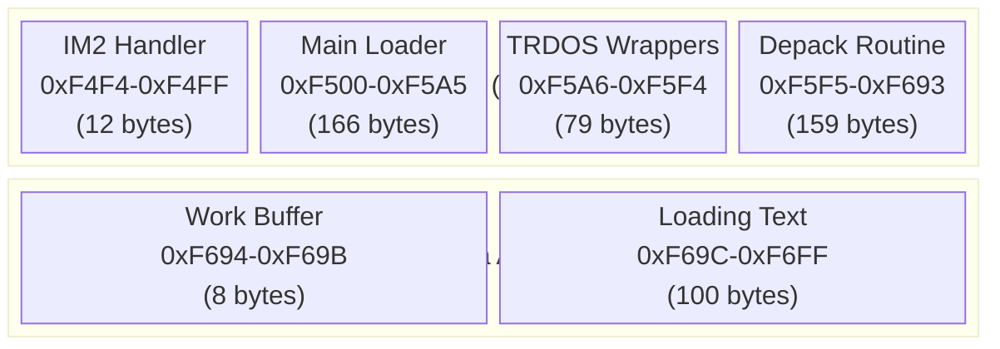

### Key Memory Variables

| Address | Name | Description |
|---------|------|-------------|
| `0x3D2F` | `TRDOS_ENTRY` | TR-DOS ROM gateway entry point |
| `0xF4F6` | `SMC_jump` | Self-modifying jump offset (switches handler behavior) |
| `0xF508` | `loader_status` | Loader completion/error status (0=done, 2=error) |
| `0xF569` | `transfer_state` | Active sector transfer flag |
| `0xF667` | `depack_flag` | Depack routine state toggle |
| `0xF66E` | `text_ptr` | Pointer to current loading text position |
| `0xF694` | `work_buffer` | 64-byte rotating graphics buffer |
| `0xF69C` | `loading_text` | Embedded "LOADING" message text |
| `0xF6D1` | `depack_flag2` | Secondary depack control flag |

---

## Architecture Overview

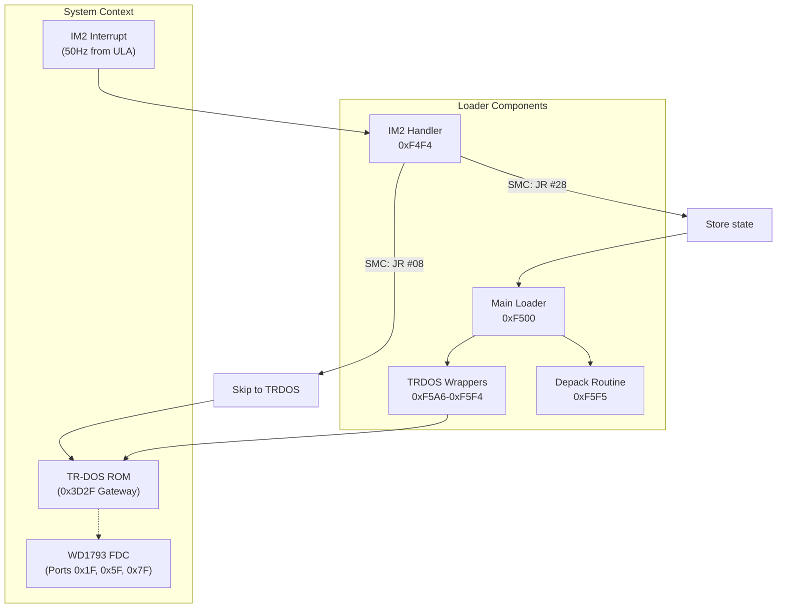

---

## Component Analysis

### 1. IM2 Interrupt Handler (0xF4F4-0xF4FF)

The interrupt handler is the **entry point** for all loader activity. It uses **self-modifying code** to switch between two modes:

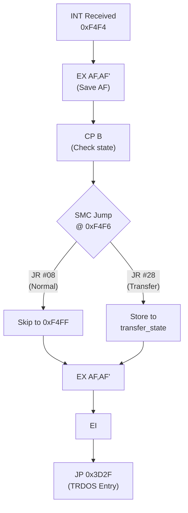

#### SMC Mechanism

| SMC Value | Jump Target | Mode | Description |
|-----------|-------------|------|-------------|
| `0x18` | `0xF4FE` | **Normal** | Standard interrupt - exit immediately to TRDOS |
| `0x28` | `0xF4F8` | **Transfer** | Active read - store state and synchronize with loader |

The loader writes to `0xF4F6` to toggle between these modes during sector transfers.

---

### 2. Main Disk Loader (0xF500-0xF5A5)

The main loader orchestrates the complete loading process:

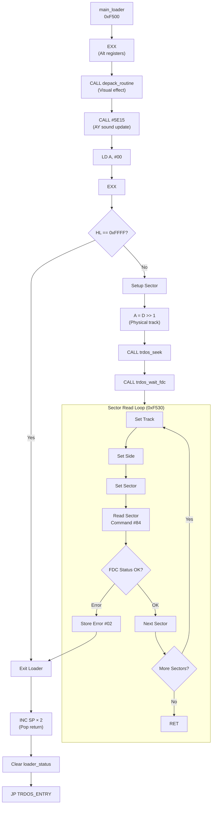

#### Load Completion Detection

The loader uses `HL = 0xFFFF` as the **end sentinel**:

```z80
0xF50A: ld a,h         ; Check high byte
0xF50B: inc a          ; H == 0xFF → A == 0x00
0xF50C: jr nz,.continue
0xF50E: ld a,l         ; Check low byte
0xF50F: inc a          ; L == 0xFF → A == 0x00
0xF510: jr nz,.continue
; Both matched = done loading
```

#### Track/Sector Calculation

The loader uses **interleaved** track/side addressing:

| Register D | Physical Track | Side |
|------------|----------------|------|
| 0 | 0 | 0 |
| 1 | 0 | 1 |
| 2 | 1 | 0 |
| 3 | 1 | 1 |
| ... | ... | ... |

```z80
0xF522: ld a,d         ; Get logical track
0xF523: srl a          ; Physical track = D >> 1
0xF536: bit 0,d        ; Side = D & 1
```

---

### 3. Sector Read Sequence

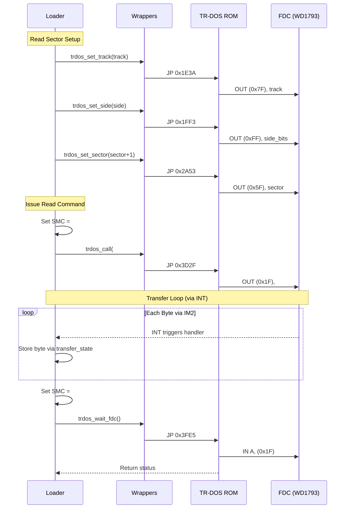

---

### 4. TRDOS Gateway Wrappers (0xF5A6-0xF5F4)

The loader uses a sophisticated **return address injection** technique to call TR-DOS ROM routines:

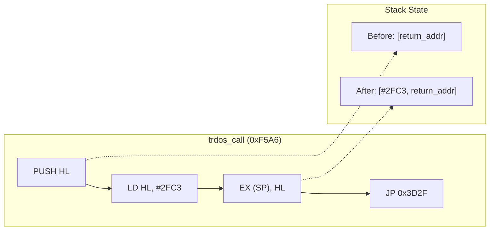

The magic address `0x2FC3` is the **return point** within TR-DOS that properly exits back to the caller.

#### Wrapper Functions

| Address | Name | Purpose | TR-DOS Routine |
|---------|------|---------|----------------|
| `0xF5A6` | `trdos_call` | Generic TRDOS call | Variable (A register) |
| `0xF5AE` | `fdc_read_status` | Read FDC status register | `0x3FEC` |
| `0xF5C6` | `trdos_set_track` | Set track register | `0x1E3A` |
| `0xF5CE` | `trdos_set_sector` | Set sector register | `0x2A53` |
| `0xF5E0` | `trdos_seek` | Seek to track | (shares `0x2A53`) |
| `0xF5E5` | `trdos_set_side` | Set disk side | `0x1FF3` |
| `0xF5ED` | `trdos_wait_fdc` | Wait for FDC completion | `0x3FE5` |

---

### 5. Depack/Decrunching Routine (0xF5F5-0xF693)

The depack routine creates a **visual loading effect** by rotating bits through a 32-byte buffer to create animated graphics:

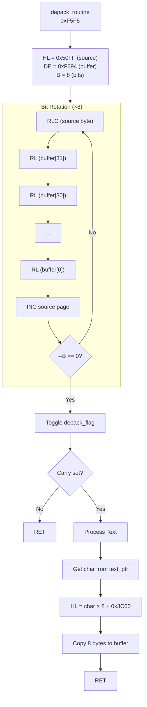

#### Rotation Chain

The routine performs a **32-byte chained rotation** - each `RL (HL)` instruction propagates the carry from the previous rotation, creating a smooth scrolling effect:

```
Source byte → Buffer[31] → Buffer[30] → ... → Buffer[0]
     ↓            ↓            ↓                 ↓
   RLC          RL           RL               RL
     ↓            ↓            ↓                 ↓
   Carry ────────────────────────────────────────→
```

---

## State Machine

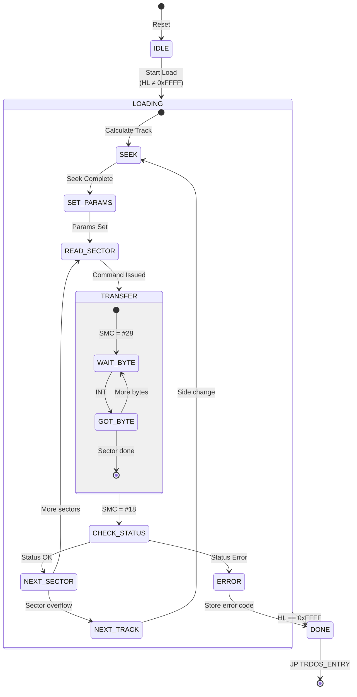

---

## Self-Modifying Code Analysis

| Location | Original | Modified | Purpose |
|----------|----------|----------|---------|
| `0xF4F6` | `JR #08` | `JR #28` | Switch INT handler to transfer mode |
| `0xF508` | `#00` | `#02` | Store error status |
| `0xF569` | `#00` | `#01` | Mark transfer active |
| `0xF667` | Variable | Toggle | Control depack alternation |

### SMC Timing Diagram

```mermaid
gantt
    title SMC State During Sector Read
    dateFormat X
    axisFormat %s
    
    section SMC @ 0xF4F6
    Normal Mode (#18)    :a1, 0, 1
    Transfer Mode (#28)  :a2, 1, 2
    Normal Mode (#18)    :a3, 2, 3
    
    section transfer_state
    Inactive (#00)       :b1, 0, 1
    Active (#01)         :b2, 1, 2
    Inactive (#00)       :b3, 2, 3
    
    section FDC Activity
    Seek                 :c1, 0, 1
    Read Sector          :c2, 1, 2
    Wait Complete        :c3, 2, 3
```

---

## Error Handling

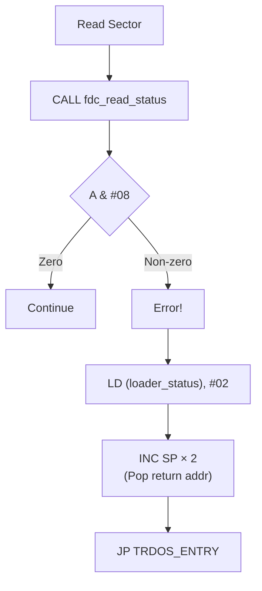

The loader checks **bit 3** of the FDC status register (CRC error or record not found) and terminates on error.

---

## Embedded Data

### Loading Text (0xF69C)

```
"> OF <INSULT> MEGADEMO...                                LOADING AND DECRUNCHING PART <INTRO"
```

This text scrolls across the screen during loading via the depack routine.

---

## Call Graph

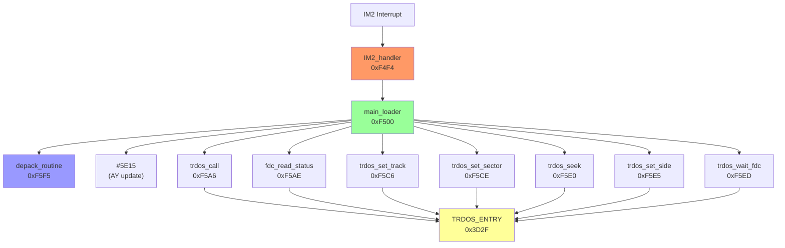

---

## Register Usage Summary

| Register | Usage |
|----------|-------|
| **A** | Command codes, status, calculations |
| **B** | Loop counters, remaining bytes |
| **C** | Sector count, port numbers |
| **D** | Logical track (physical track = D >> 1, side = D & 1) |
| **E** | Current sector (0-15) |
| **HL** | Destination address / pointer |
| **AF'** | Preserved across interrupt |
| **BC', DE', HL'** | Used by depack_routine |

---

## Key Techniques

1. **Self-Modifying Code (SMC)**: Dynamically switches interrupt handler behavior between normal and transfer modes.

2. **Return Address Injection**: Uses `EX (SP),HL` to inject a custom return address (`0x2FC3`) onto the stack before calling TR-DOS.

3. **Interleaved Track/Side**: Encodes both track and side in register D using bit manipulation (`SRL`, `BIT 0`).

4. **Chained Bit Rotation**: Creates smooth scrolling animation by propagating carry through 32 consecutive `RL (HL)` instructions.

5. **End Sentinel**: Uses `HL = 0xFFFF` as a termination marker rather than an explicit count.

---

## Hazards & Gotchas

> [!CAUTION]
> **Register Stasis Bug**: The loader's custom `0x2FC3` gateway return bypasses normal TR-DOS sector register updates. If an FDC NOTREADY status causes a retry, the sector register remains unchanged, leading to infinite reads of the same sector.

> [!WARNING]
> **SMC Race Condition**: The interrupt handler may be called while the SMC byte at `0xF4F6` is being modified. Critical timing ensures this window is very short.

> [!IMPORTANT]
> **Stack Manipulation**: The `EX (SP),HL` technique requires careful stack balance. The loader manually adjusts SP (`INC SP × 2`) on exit to account for unpopped addresses.

---

## Disassembly Cross-Reference

| Address Range | Function | Lines in Original |
|---------------|----------|-------------------|
| `0xF4F4-0xF4FF` | IM2_handler | 24-32 |
| `0xF500-0xF5A5` | main_loader | 34-143 |
| `0xF5A6-0xF5C5` | trdos_call, fdc_read_status | 146-169 |
| `0xF5C6-0xF5F4` | Set track/sector/side/seek/wait | 171-207 |
| `0xF5F5-0xF693` | depack_routine | 210-320 |
| `0xF694-0xF700` | Data area | 322-337 |
