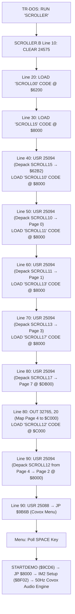

# "Scroller by Demarche" (1996) — Reverse Engineering & Boot Analysis

> **Artifact**: Complete disassembly, memory banking architecture, and boot failure analysis of "Scroller by Demarche", a landmark Soviet/Russian Covox demo released in 1996 for the **Pentagon 128**.
> **Disk Image**: [`testdata/sound/covox/scroller_by_demarche.trd`](testdata/sound/covox/scroller_by_demarche.trd)
> **Primary Test**: [`core/tests/loaders/disk/scroller_boot_test.cpp`](core/tests/loaders/disk/scroller_boot_test.cpp)

---

## 1. Directory Structure

| File | Description |
|---|---|
| [`README.md`](docs/disasm/demo/scroller/README.md) | This document — overview, catalog, boot flow, and quick reference. |
| [`TRIAGE.md`](docs/disasm/demo/scroller/TRIAGE.md) | Forensic triage report: Root cause analysis of the 128K Sinclair editor `$5B00` SWAP trap, bus traces, and fix proposals. |
| [`emulator-port-comparison.md`](docs/disasm/demo/scroller/emulator-port-comparison.md) | Cross-emulator audit: Port `#7FFD` decoding and boot vectors compared across Unreal-NG, SMT Unreal, USP, Xpeccy, and ZXMAK2. |
| [`memory-map.md`](docs/disasm/demo/scroller/memory-map.md) | 128K RAM banking map, port `#7FFD` paging states, MegaLZ decrunch destinations, and Covox port `#FB` mapping. |
| [`make_scroller_sna.py`](docs/disasm/demo/scroller/make_scroller_sna.py) | Standalone Python utility that extracts and decrunches all TRD files into a clean 128K `.sna` snapshot. |
| [`scroller_by_demarche.sna`](docs/disasm/demo/scroller/scroller_by_demarche.sna) | Pre-generated, verified 128K snapshot that launches directly into the Covox menu (`$9B6B`). |
| [`patch_scroller_trd.py`](docs/disasm/demo/scroller/patch_scroller_trd.py) | Python tool that patches `SCROLLER.B` on the TRD disk image with the dual-mode fix. |
| [`scroller_fixed.trd`](docs/disasm/demo/scroller/scroller_fixed.trd) | Patched TR-DOS disk image with the dual-mode Line 80 fix; boots across all emulators and configurations. |
| [`scroller-loader.bas`](docs/disasm/demo/scroller/scroller-loader.bas) | Annotated original Sinclair BASIC loader script (`SCROLLER.B`) with token decoding and line analysis. |
| [`scroller-loader-fixed.bas`](docs/disasm/demo/scroller/scroller-loader-fixed.bas) | Annotated patched dual-mode Sinclair BASIC loader script with detailed line breakdown. |
| [`scroller_fixed.$B`](docs/disasm/demo/scroller/scroller_fixed.$B) | Standalone Hobeta format binary of the patched BASIC loader (366 bytes, ready for TR-DOS import). |
| [`scroller_fixed.bin`](docs/disasm/demo/scroller/scroller_fixed.bin) | Raw tokenized Sinclair BASIC memory block (`$00`–`$015D`, 349 bytes). |
| [`scroller-dispatcher.asm`](docs/disasm/demo/scroller/scroller-dispatcher.asm) | Annotated Z80 disassembly of `SCROLL00.C` (`$6200`–`$62B1`): Entry point, depack table dispatcher, and embedded MegaLZ decruncher. |
| [`scroller-menu.asm`](docs/disasm/demo/scroller/scroller-menu.asm) | Annotated Z80 disassembly of the Covox menu (`$9B6B`), keyboard scanner, `STARTDEMO` routine (`$9CD6`), and IM2 audio engine (`$BF02`/`$BFBF`). |

---

## 2. Standalone 128K SNA Snapshot Generator (`make_scroller_sna.py`)

To completely bypass the BASIC loader and any Sinclair 128K editor SWAP-hook desynchronization issues, [`make_scroller_sna.py`](docs/disasm/demo/scroller/make_scroller_sna.py) extracts all raw payloads from `scroller_by_demarche.trd`, decompresses them in Python using the authentic MegaLZ routine directly into target RAM pages (0, 1, 2, 3, 4, 5, 7), and generates a standard 128K `.sna` snapshot (131,103 bytes) ready to run in any ZX Spectrum emulator:

```bash
# Generate clean 128K snapshot starting at the Covox menu ($9B6B):
python3 docs/disasm/demo/scroller/make_scroller_sna.py

# Or specify a custom entry point (menu=$9B6B, start=$6200, demo=$8000):
python3 docs/disasm/demo/scroller/make_scroller_sna.py --entry demo -o docs/disasm/demo/scroller/scroller_direct.sna
```

---

## 3. Patched TRD Disk Image Generator (`patch_scroller_trd.py`)

For users and emulators that require a standard TR-DOS diskette image rather than a `.sna` snapshot, [`patch_scroller_trd.py`](docs/disasm/demo/scroller/patch_scroller_trd.py) applies the universal dual-mode fix directly to `SCROLLER.B` on disk:

```bash
# Generate patched TRD (docs/disasm/demo/scroller/scroller_fixed.trd):
python3 docs/disasm/demo/scroller/patch_scroller_trd.py
```

- **Patched Line 80**:
  ```basic
  80 RANDOMIZE USR VAL "25094": POKE VAL "23388",VAL "20": OUT VAL "32765",VAL "20": RANDOMIZE USR VAL "15619": REM : LOAD "SCROLL12" CODE
  ```
- **Dual-Mode Operation**:
  - **Sinclair 128K Editor**: `POKE VAL "23388", VAL "20"` primes `BANK_M` (`$5B5C`). The `$5B00` SWAP trampoline reasserts Page 4 across ROM flips so `SCROLL12` loads into Page 4.
  - **48K BASIC / TR-DOS Boot**: `OUT VAL "32765", VAL "20"` writes directly to the hardware port latch on machines without the 128K editor hook.
- **Output**: [`scroller_fixed.trd`](docs/disasm/demo/scroller/scroller_fixed.trd) runs out-of-the-box in any emulator under any reset configuration (`RESET=128`, `RESET=BASIC`, `RESET=DOS`).

> [!NOTE]
> **How to Launch from TR-DOS**:
> The disk image does not contain an auto-executing `boot.B` file (the main file is named `SCROLLER.B`). When TR-DOS boots or is selected from the 128K menu, it displays the TR-DOS banner (`* TR-DOS Ver 5.04T *` / `BETA 128`) and waits at the `A>` prompt.
> Type:
> ```basic
> RUN "SCROLLER"
> ```
> To launch immediately without typing or disk delays, use [`scroller_by_demarche.sna`](docs/disasm/demo/scroller/scroller_by_demarche.sna).

---

## 4. Disk Catalog Overview

The demo distribution disk [`scroller_by_demarche.trd`](testdata/sound/covox/scroller_by_demarche.trd) is a standard TR-DOS 640 KB diskette image containing 8 files:

| File Name | Ext | Start Address | Length | Sectors | Track | Sector | Purpose |
|---|:---:|:---:|:---:|:---:|:---:|:---:|---|
| `SCROLLER` | `B` | `$014D` | 333 B | 2 | 1 | 0 | BASIC boot script (`CLEAR`, stream loader, decrunch calls) |
| `SCROLL00` | `C` | `$6200` | 178 B | 1 | 1 | 2 | Depack dispatcher, page-paging table, MegaLZ decompressor |
| `SCROLL15` | `C` | `$8000` | 1,708 B | 7 | 1 | 3 | MegaLZ-compressed audio playback engine & effect tables |
| `SCROLL10` | `C` | `$8000` | 4,601 B | 18 | 1 | 10 | MegaLZ-compressed audio sample block 1 &rarr; RAM Page 0 |
| `SCROLL11` | `C` | `$8000` | 5,342 B | 21 | 2 | 12 | MegaLZ-compressed audio sample block 2 &rarr; RAM Page 1 |
| `SCROLL13` | `C` | `$8000` | 2,962 B | 12 | 4 | 1 | MegaLZ-compressed audio sample block 3 &rarr; RAM Page 3 |
| `SCROLL17` | `C` | `$8000` | 4,371 B | 18 | 4 | 13 | MegaLZ-compressed audio sample block 4 &rarr; RAM Page 7 (`$DB00`) |
| `SCROLL12` | `C` | `$C000` | 12,155 B | 48 | 5 | 15 | MegaLZ-compressed main demo engine & menu &rarr; RAM Page 2 |

Total compressed data across all files: ~31.5 KB, expanding into ~80 KB across all 128K RAM banks.

---

## 5. High-Level Boot Pipeline



---

## 6. The Boot Bug & Root Cause Summary

### The Issue
When launching `RUN "SCROLLER"` from an emulator configured with `RESET=128` (booting through the 128K Sinclair service menu), the demo fails:
- Either the screen goes black/resets immediately upon loading `SCROLL12`, OR
- The Covox menu appears, but pressing SPACE immediately causes a hard reset back to the 1982 Sinclair boot screen.

### The Mechanism
In line 80:
```basic
80 RANDOMIZE USR VAL"25094": OUT VAL"32765",VAL"20": RANDOMIZE USR VAL"15619": REM : LOAD "SCROLL12" CODE
```
1. `OUT VAL"32765", VAL"20"` writes `0x14` directly to hardware I/O port `#7FFD` to page **RAM Page 4** into `$C000`.
2. However, the BASIC loader does not update the Spectrum 128K system variable `BANK_M` (`$5B5C` / 23388), which still contains `0x00`.
3. In the Sinclair 128K editor environment, inter-ROM and statement transitions route through a trampoline at `$5B14` &rarr; `$5B00` (`SWAP`).
4. `$5B00` reads the stale `BANK_M` (`0x00`), toggles bit 4, and **outputs `0x10` to `#7FFD`**.
5. `0x10` maps **RAM Page 0** to `$C000`, silently displacing Page 4!
6. TR-DOS then loads the 48 sectors of `SCROLL12` into **Page 0** instead of Page 4.
7. In Line 90, Call #6 of the depacker selects Page 4 (which is still all `0x00`), decodes zero-bytes into Page 2 (`$8000`), and jumping to `$9B6B` slides through 25,000 bytes of `0x00` (`NOP`) until wrapping past `$FFFF` into the ROM reset vector `$0000`.

### Why It Worked on Authentic Hardware in 1996
Soviet Pentagon 128 machines booted natively into **TR-DOS** (`RESET=DOS`) or **48K BASIC** (`RESET=BASIC`), never entering the Sinclair 128K editor. Without the 128K editor running, the `$5B00` SWAP routine was never installed in RAM, no statement hook existed, and port `#7FFD` remained stable on Page 4 throughout the transfer.

### The Universal Dual-Mode Software Fix
In `scroller_fixed.trd`, Line 80 is patched to:
```basic
80 RANDOMIZE USR VAL "25094": POKE VAL "23388",VAL "20": OUT VAL "32765",VAL "20": RANDOMIZE USR VAL "15619": REM : LOAD "SCROLL12" CODE
```
- Under 128K Editor: `POKE` updates `BANK_M` (`$5B5C`) so the `$5B00` SWAP routine preserves Page 4 across ROM toggles.
- Under 48K BASIC / TR-DOS: `OUT` ensures hardware port `#7FFD` receives the latch write even though no 128K SWAP routine exists.

For the exhaustive forensic investigation, hardware bus traces, and mitigation strategies, see [`TRIAGE.md`](docs/disasm/demo/scroller/TRIAGE.md).
