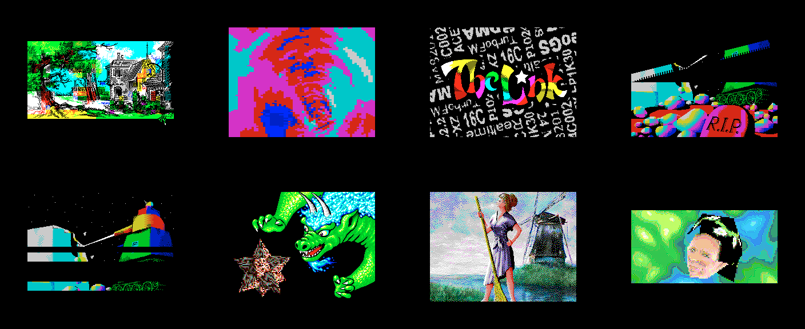

# The Link (invdemo, 2009) - source analysis

Code and music: Alone Coder; graphics: Alone Coder, Oimidrol, Shiru (from the
demo's own credits screen).

`testdata/machines/pentagon1024sl/TheLink.trd` is not a release disk: it is
the author's **working disk**. It holds the ALASM assembler, the STS debugger,
the ALASM sources of every part and all the data files. `RUN "THELINK"`
starts ALASM, which assembles the demo from its sources and runs it. The demo
needs a **Pentagon 1024** and a **NeoGS**: the card renders every effect and
the ZX fetches the pictures from it through NeoGS ZX-DMA.



Left to right, top row: the intro picture ("medieval", with the FM music),
tunnel, rotator (the logo), rotating bars; bottom row: multi-bars, hedgehog
(the dragon), "baba" (girl and mill), textured face.

## 1. Files

`extract_thelink.py` regenerates everything in this folder from the image:

```
python3 docs/disasm/demo/thelink/extract_thelink.py \
    testdata/machines/pentagon1024sl/TheLink.trd docs/disasm/demo/thelink
```

- `src/*.asm` - the 20 ALASM sources (TR-DOS type `H`), detokenized to UTF-8
  text; the Russian comments are converted from code page 866.
- `basic/*.bas` - the BASIC programs (type `B`) as listings.
- The binary files (type `C` and the numbered data files) are not copied;
  `--raw <dir>` writes every file raw for analysis.

**ALASM source format**, read from the assembler on the same disk
(`alasm_64.C`, keyword table with bit 7 set on the last letter of each word):
a 64-byte header (`NAME    H`, source length at `+#21`), then lines of
`[length including itself][body]`. In a body, `#01`-`#1F` are runs of spaces;
the first byte `>= #80` is a mnemonic or directive (`#80` INCLUDE, `#82`
MACRO, `#8E` LDIR, `#9B` ENDM, `#C1` OUT, `#D4` LD ... `#E6` RUN); later ones
are operands (`(BC)`..`(IY)` from `#9F`, `(C)` `(IX` `(IY` `AF'` from `#D0`,
`BC`..`I` from `#E0`); `#FF` is an editor flag on a line, not text. Inside
comments and strings the high bytes are cp866 letters.

### Which source builds what

| Source | Builds | Role |
|---|---|---|
| `THELINK.asm` | the demo itself: loader at `#7800`, the card program, the page plan | main module |
| `gsports.asm` | - | NeoGS port and bit names (GSCFG0, MPAGEX, DMA_*, VOL5-8, ...) |
| `GSTUNNE4.asm` | `TUNNELZX`, `TUNNELGS` | tunnel |
| `GSROTAT7.asm` | `ROTATEZX`, `ROTPREGS`, `ROTATEGS` | rotator with the logo |
| `GSRBARP3.asm` (`GSRBAR24.asm` is an earlier version) | `ROTBARZX`, `ROBPREGS`, `ROTBARGS` | rotating bars |
| `GSMULBA3.asm` | `MULBARZX`, `MULBARGS` | multi-bars |
| `hedge12.asm`, `hedgepre.asm` | `HEDGEZX1`, `HEDGEZX2`, `HEDGEGS` | hedgehog (dragon) |
| `baba5.asm` (`baba4.asm` earlier) | `BABAZX`, `BABAGS` | girl and mill |
| `TEX28.asm` | `TEXZX`, `TEXGS` | textured face |
| `texpp4.asm`, `instpp3.asm`, `instlpp.asm`, `vujump.asm` | - | shared texture mappers, included |
| `16CCON.asm`, `RECPIC.asm` | - | 16-colour picture converter, picture recorder |
| `m2hrust.asm`, `SAVEOBJ4.asm` | - | the author's release tools (a mono-loader with a Hrust depacker; an object saver) - not used by this disk's boot |

The `sin*`, `sectg`, `uv256d` BASIC + code pairs generate tables; `dplan2r.p`
and `torusr.p` are Hrust-packed (`hr21`) data.

## 2. How the demo starts

`THELINK.B` (250 bytes) is the author's work-environment launcher:

```basic
0 CLEAR VAL "24575": RANDOMIZE USR VAL "23893": REM <code>
10 OUT 32765,VAL "87": RANDOMIZE USR 23752: REM : LOAD "sts7 " CODE
20 OUT VAL "32765",VAL "81": RANDOMIZE USR VAL "15619": REM : LOAD "alasm_64" CODE 49152
40 RANDOMIZE USR 23996 <code>
```

- Line 0: the code in the REM (at `#5D55`) hides the line (RECLAIM through
  `JP #19E5`) and continues at line 10.
- Line 10 loads the STS 7 debugger into RAM page 7, line 20 loads ALASM into
  page 1 at `#C000`.
- Line 40's code copies the project name to ALASM and starts it: ALASM loads
  `THELINK.H`, includes `gsports`, pulls every data file in with `INCBIN`
  into its page (`ORG #C000,page`), assembles, and jumps to `GO` (`#7800`).

So the ~28 seconds of disk activity before the picture are **the demo being
assembled**. This phase switches `#7FFD` through `#D6`, `#91`, `#B4` ... -
`alasm_64` is the 64-page (1024K) build of the assembler, and the demo's page
plan uses pages above 512K too (section 6).

## 3. The page plan (`THELINK.asm`)

| Pages (`#7FFD` value) | Content |
|---|---|
| `#90`-`#97`, `#11`, `#13`, `#14` (`pgdata1`-`10`) | effect data for the card: pictures and textures (`kishki`, `baba`, `mill`, `girl13`, `blugr`) |
| `#52`, `#55`, `#30`-`#37` (`pgcode1`-`10`) | the card's effect code (`ROTPREGS` ... `TEXGS`) |
| `#B0`-`#B7` (`pgeffects`) | the ZX half of each effect (`TUNNELZX` ... `TEXZX`) |
| `#D0` (`pgeffects+#20`) | the credits screen |
| `#54` (`pgmusic`) | `thelinkm` - the music player (TurboSound FM) |
| `#5F00`-`#BFFF` resident | IM 2 vector table `#BE00`, frame counter `timer` at `#BF02`, resident loop `#BF04`, interrupt handler `#BFBF` |

## 4. The ZX and the card

**Card program.** `GO` sends the card its program with the standard GS
commands: `#18`/`#19` (write a byte to card memory, "as in RIFF TRACKER") for
`GSPROG` at `#5830`, then `#13` (jump). The program (`GSPROGGO`):

1. silences all eight channels (`VOL1`-`VOL8`, ports `#06`-`#09`, `#16`-`#19`);
2. `GSCFG0` = 24 MHz, NOROM, EXPAG (`#09`); `MPAG` 1, `MPAGEX` 2;
3. selects DMA module 1 (ZX-DMA), points it at card page `#20`, starts it
   (`CST` = `#80`) and answers the ZX (`OUT (ZXDATWR)`).

**Upload by ZX-DMA.** The ZX then copies each 16 KB page with
`LDIR #C000 -> #0000`: writes into its own ROM area, which change nothing on
the ZX, but NeoGS's ZX-DMA takes every one of them into card RAM. Command 3
starts the data pages (`#20` up), command 4 the code pages (`#10` up),
command 5 ends the upload.

**Running.** The card loops over its code pages: `OUT (MPAGEX)`, `CALL #C000`
(one effect), next page. The ZX's resident loop does the same with its effect
pages, passing each one its start and end frame from `zxtimings`:

| Part | Frames (`timer`, 50 per second) | ZX / card |
|---|---|---|
| intro picture + music | 0-895 | `medieval` on screen, the card waits |
| tunnel | 896-1778 | `TUNNELZX` / `TUNNELGS` |
| rotator | 1792-2674 | `ROTATEZX` / `ROTATEGS` |
| rotating bars | 2688-3248 | `ROTBARZX` / `ROTBARGS` |
| multi-bars | 3476-3556 | `MULBARZX` / `MULBARGS` |
| hedgehog | 3584-4466 | `HEDGEZX1`, `HEDGEZX2` / `HEDGEGS` |
| girl and mill | 4480-4914 | `BABAZX` / `BABAGS` |
| textured face | 4928-5824 | `TEXZX` / `TEXGS` |
| credits | after | `credits`, then `JR $` - the demo ends here by design |

**One effect frame, the rotator as an example** (`GSROTAT7.asm`):

- ZX, every frame: `HALT`; command 0 ("frame shown, stop the DMA"); flip
  screens; wait for the card's answer; command 1 ("start the DMA"); wait; then
  `LD D,(HL) : LD E,(HL) : PUSH DE` with `H` = 0 - 3,456 reads from the ROM
  area, each answered by ZX-DMA with the next byte of the picture the card has
  drawn - pushed into the hidden screen (6,912 bytes).
- Card: draws the next picture into one of two screens, waits for command 0,
  stops the DMA, waits for command 1 (a 65,536-poll timeout resets the card),
  points the DMA at the finished screen and starts it.

The card needs about two ZX frames per picture, so the rotator shows a new
picture every second frame (25 per second).

## 5. What the emulator must provide

| Feature | Used for | unreal-ng |
|---|---|---|
| Pentagon 1024 paging (`#7FFD` bits 5-7) | the page plan above | yes |
| NeoGS main ROM commands `#18`, `#19`, `#13` | sending the card program | the real firmware (flash image) |
| GSCFG0 24 MHz, NOROM, EXPAG, MPAGEX | card program | yes |
| ZX-DMA writes (ZX writes into the ROM area) | uploading 20 pages | yes (neogs-zxdma-design.md, Divert) |
| ZX-DMA reads (`LD r,(HL)` from the ROM area) | fetching each picture | yes |
| VOL5-VOL8 | silencing | yes |
| TurboSound FM | the music | yes |
| `#EFF7` bit 0 (16 colours) | hedgehog, bars, face | yes |

`#EFF7` bit 4 is written as "noturbo" by the author (his Pentagon 1024SL);
our port decoder names it GigaScreen and only logs it - no effect either way.

## 6. Why it "hangs"

| Machine | What happens |
|---|---|
| Pentagon 1024 + **NeoGS** | runs to the credits (checked in the emulator: frame counter 6,116, page `#D0`, the credits screen; see `parts.png`) |
| Pentagon 1024 + **classic GS** | assembly, then 18 s of the intro picture with the music; at the tunnel the ZX waits for the card for ever (the classic card has no ZX-DMA, no EXPAG) - **the reported hang** |
| Pentagon 512 (any card) | stops about 6 s in, during the assembly: the 1024K build of ALASM and the page plan need 1024K |

The reported hang came from a build of `master`, which has no NeoGS: its GS
slot holds the classic card (`GSType=Z80`). On the `neogs` branch the shipped
configs fit NeoGS (`GSType=NGS`) and the demo runs on "Pentagon" with 1024K.

**How to run it:** a build of the `neogs` branch, Pentagon with 1024K RAM,
insert `TheLink.trd`, `RUN "THELINK"` in TR-DOS. Expect about 28 s of disk
activity (the assembly) and 18 s of the static intro picture before the first
effect.

## 7. Regression test

`NeoGSTheLink_Test.DemoAssemblesItselfAndRunsItsCardRenderedEffects`
(`core/tests/emulator/sound/chips/neogs/soundchip_neogs_acceptance_test.cpp`):
Pentagon 1024 + NeoGS, `RUN "THELINK"`; the card must enter the demo's
configuration (`GSCFG0` = `#09`), the tunnel must change the picture every
frame, and the rotator every second frame.
