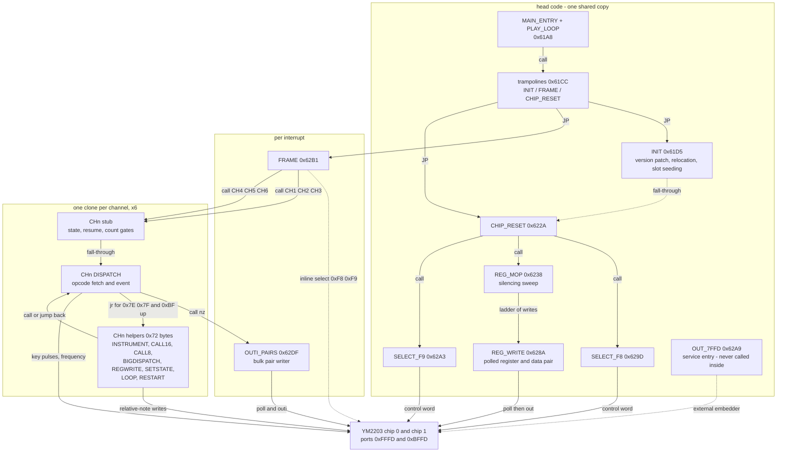
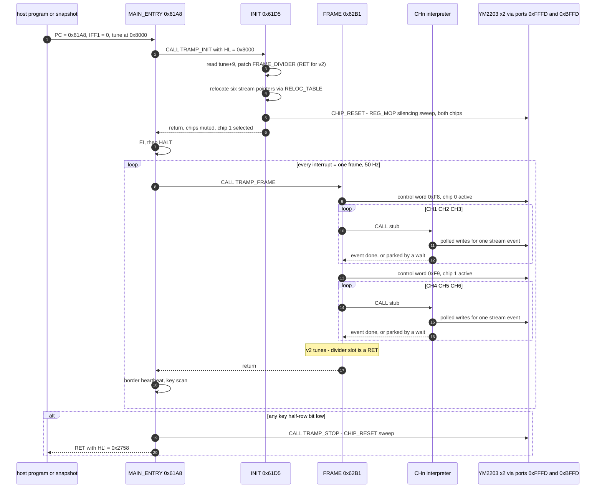

# TFM Music Compiler 1.12 player — reverse-engineering dossier

> **The hook.** 1,883 bytes of Z80 that turn two bare YM2203 chips into a
> six-channel FM orchestra. This folder documents the `_tsfmplaye` block of
> `TSFM-EL.TAP` — the runtime player emitted by the native ZX tracker
> **TFM Music Compiler 1.12** — from raw binary to a hand-written,
> fully annotated source that assembles **bit-identical** to the shipped code.
> The authors never published the source; every label, every comment and every
> structural claim here is derived from the binary and can be re-derived the
> same way.

## What's in this folder

| artifact | what it is |
|---|---|
| [`player_org61A8.bin`](player_org61A8.bin) | the raw player block, 1,883 bytes, org `0x61A8` |
| [`tfmplayer.asm`](tfmplayer.asm) | **hand-written annotated source — read this**; assembles bit-identical to the binary (sjasmplus) |
| [`tfmplayer-z80dasm.asm`](tfmplayer-z80dasm.asm) | machine-generated z80dasm reference (raw instruction stream) |
| [`tfmplayer-z80dasm.asm.sym`](tfmplayer-z80dasm.asm.sym) | z80dasm symbol dictionary |
| [`disasm_tfmplayer.py`](disasm_tfmplayer.py) | rebuilds the binary + z80dasm reference from the TAP |
| [`tsfm-sna-guide.md`](tsfm-sna-guide.md) | builder's guide: wrap this player + any tune into an instant-play `.sna` |

## Companion documents

- [`docs/file-formats/music/tfmcom-module.md`](../../../file-formats/music/tfmcom-module.md) —
  the recovered `TFMcom1.12` module data format: header layout, opcode
  grammar, frequency encoding, corpus statistics
- `docs/inprogress/2026-09-10-turbosound-fm/verification/player-entry-points.md`
  — the original entry-point record (harness/test view)
- `core/tests/_helpers/tsfmplayerharness.{h,cpp}` — the C++ test harness that
  runs this player inside the emulator

---

# Part I — How it was disassembled

## 1. The source: where the player lives

Everything starts from one tape image, `testdata/sound/tsfm/TSFM-EL.TAP`
(Lanex's 2021 MB03+ menu release of 106 TS-FM tunes):

| # | TAP block | Load at | Length | Role |
|---|---|---|---|---|
| 0/1 | `TSFM v2` | BASIC | 568 | Lanex MB03+ loader stub (menu, turbo-load) |
| 2/3 | `_tsfmplaye` | **25000** (`0x61A8`) | **1883** | **this player** |
| 4/5 | `lnxdata` | 31000 (`0x7918`) | 4704 | loader graphics; *not referenced by the player* |
| 6.. | 106 tune blocks | 32768 (`0x8000`) | 389–21885 | `TFMcom1.12` modules |
| last | `end` | — | — | terminator, not a tune |

`lnxdata` is loader chrome only — no `0x7918` constant exists inside the
player. Snapshots built without it play identically (the tune overwrites its
tail from `0x8000` in the hardware load order anyway).

The player block is a standard type-3 CODE header with start 25000. The
number is not arbitrary: 25000 + 1883 ends at `0x68F3`, comfortably below the
tune area at `0x8000`, and the whole player is **position-locked** to that
address (see Part II).

## 2. Isolation and extraction

[``disasm_tfmplayer.py``](disasm_tfmplayer.py) walks the TAP block pairs,
matches the type-3 header named `_tsfmplaye` with start `0x61A8`, and dumps
the 1,883 data bytes as `player_org61A8.bin`. From a bare `.bin` alone you
already know three things:

- the **entry point** (`0x61A8`, from the header),
- the **length** (1,883 = 12 bytes of relocation table + six ~0x100-byte
  blocks + ~0x140 of head code — a first hint of the clone structure),
- that it must sit **exactly** at `0x61A8`, because the binary is full of
  absolute `ld (nnnn),a` / `ld (nnnn),hl` references into itself.

## 3. First pass: z80dasm with a symbol dictionary

The raw pass is a plain:

```bash
z80dasm -a -t -g 0x61A8 -S tfmplayer-z80dasm.asm.sym \
        -o tfmplayer-z80dasm.asm player_org61A8.bin
```

Raw z80dasm output is correct but nearly unreadable: byte columns on every
line, `defb 0edh,070h` workarounds for the undocumented `in f,(c)`, `$+n`
relative jump targets, and no names. The workflow that made it tractable:

1. **Name before understanding.** A symbol table (`SYMS` in the script) maps
   every structurally identified address to a label plus comment lines;
   z80dasm threads those names through all call/jump sites. Re-disassemble,
   re-read, correct the table, repeat.
2. **Auto-labels for the rest.** Absolute `CALL`/`JP` targets inside the
   block that are not yet named get mechanical `R_xxxx` labels, so no target
   stays anonymous while reading.
3. **Annotate at the definition site.** The script injects the symbol
   comments at each label definition, turning the listing into a notebook.

The result of this stage is `tfmplayer-z80dasm.asm` — a complete, labeled,
but still machine-shaped reference. It is kept (and regenerated by the
script) as ground truth; it is *not* the thing to read.

## 4. The structural breakthrough: six stamped clones

Reading the head code (entry, init, reset, register writer, frame) is
straightforward. The breakthrough is in the remaining ~1,100 bytes:

- `FRAME` calls six addresses in strict periodic order:
  `0x6365, 0x6465, 0x6566, 0x6667, 0x6767, 0x6868`.
- Diffing those six blocks against each other shows they are **the same code,
  stamped out six times by the compiler**, one private copy per YM2203
  channel. Only a handful of immediates differ (see the table in Part II).
- Each copy has the same internal shape:
  `[helpers: 0x72 bytes][stub: 0x15 bytes][dispatch: 0x79/0x7A bytes]`,
  and clone *n+1*'s helpers begin immediately after clone *n*'s dispatch —
  which is why the stub-to-stub spacing wobbles between `0x100` and `0x101`.
- The stub of each clone contains **self-modifying code slots at identical
  offsets**: `+1` (state), `+6` (resume pointer), `+9` (instrument counter),
  `+19` (return pointer). Verified two independent ways: the runtime stores
  in `INIT` and the per-channel interpreter, and the six `defw` words of the
  trailing `RELOC_TABLE` (`636B 646B 656C 666D 676D 686E`) — each word is
  exactly stub+6 of its channel.

Once the clone structure is known, only one copy (channel 1) needs full
analysis; the other five reduce to a constants table.

## 5. Recovering semantics

Labels describe structure; semantics came from four directions:

- **The hardware protocol.** Every access polls `IN F,(C)` before `OUT`,
  flagging bit 7 as busy — that pins the ports (`0xFFFD` select/status,
  `0xBFFD` data) to TurboSound FM semantics, with `0xF8`/`0xF9` as the
  chip-select control words.
- **The tune corpus.** The 106 modules on the same tape are the player's
  input; correlating their bytes with the player's fetch patterns recovered
  the module format (header at `+0/+9/+10`, stream opcodes). That work is
  documented separately in `tfmcom-module.md`.
- **The emulator harness.** `tsfmplayerharness` runs the real binary inside
  the emulator with FM register logging; observed write sequences confirmed
  the register-sweep and key-control interpretations (and corrected several
  early guesses, e.g. the exact `REG_MOP` sweep ranges).
- **The legacy-TurboSound hang.** On a plain 2×AY TurboSound the status poll
  never exits (the AY mixer reads back `0xFF`) — the park site is `WAIT_DATA`,
  which both explains old compatibility reports and confirms the polling
  model.

## 6. Closing the loop: a source that assembles bit-identical

The final step replaces the machine-shaped listing with a hand-written one:
real labels, structured banners, the undocumented instructions spelled out,
and commentary where it teaches. The discipline that keeps it honest:

```bash
sjasmplus --raw=player.bin tfmplayer.asm    # 0 errors, 0 warnings
cmp player.bin player_org61A8.bin && echo BIT-IDENTICAL
```

- The listing ends with `assert $ == 0x6903`: if anything drifts by even one
  byte, assembly fails.
- The assemble-and-compare loop is not ceremonial — it caught a real
  transcription error during the rewrite (a "regularized" `ld b,e` in
  `REG_WRITE` that the original actually issues *after* its busy-poll).
- Both files hash to
  `d95a0705b5863718546c125228dc3d1d7e67e3be204793a75282b364487011e7`
  (SHA-256). `player_org61A8.bin` itself is re-extracted from the TAP by the
  script, so the chain *tape → binary → source* is closed end to end.

---

# Part II — How the player works

## 7. The machine it drives

TurboSound FM: **two YM2203 (OPN) chips**, each contributing three FM melodic
channels (twelve operators) plus an AY-compatible SSG half the player mostly
ignores. Chips sit behind one shared bus pair:

```
port 0xFFFD   register select (write) / status (read, bit7 = busy)
port 0xBFFD   data (write)
```

A **control word** written to `0xFFFD` picks the active chip: `0xF8` = chip 0,
`0xF9` = chip 1; all later register traffic hits that chip only. On real TSFM
hardware every write makes the chip busy for ~32 cycles (status bit7 set), so
the player polls before *every single OUT* — using `IN F,(C)` so the flags
absorb the status and A survives untouched.

The code keeps the port pair in registers, not immediates:
`C = 0xFD`, `D = 0xFF` (select port high byte), `E = 0xBF` (data port high
byte); callers load `B` from `D` or `E` to steer the OUT. `E` moonlights as
the `CP` constant `0xBF` in the dispatcher — one register, two jobs.

## 8. The playing model

One interrupt = one frame. Each frame:

1. select chip 0, run channels 1–3;
2. select chip 1, run channels 4–6;
3. (old-format tunes only) tick the frame divider.

Each channel interpreter executes **exactly one stream event per frame** —
notes, register-block writes and calls consume the frame; waits park the
channel without consuming events. The `HALT` loop around `FRAME` flips the
border black/white every interrupt: the classic visual heartbeat.

## 9. Memory map

| address | label | role |
|---|---|---|
| `0x61A8` | `MAIN_ENTRY` / `PLAY_LOOP` | halt loop, border heartbeat, any-key exit |
| `0x61CC` | trampolines | stable `JP` desks: INIT / FRAME / CHIP_RESET |
| `0x61D5` | `INIT` | version check, SMC patch, pattern relocation |
| `0x622A` | `CHIP_RESET` | → `REG_MOP`: silence and re-arm both chips |
| `0x6238` | `REG_MOP` | register sweep that parks both YMs |
| `0x628A` | `REG_WRITE` | one polled (register,data) pair write |
| `0x629D` | `SELECT_F8` / `SELECT_F9` | chip selects; `OUT_7FFD` service entry at `0x62A9` |
| `0x62B1` | `FRAME` | per-interrupt: six channel calls + divider |
| `0x62D2` | `FRAME_DIVIDER` | SMC: patched to `RET` for v2 tunes |
| `0x62DF` | `OUTI_PAIRS` | bulk (register,data) stream writer |
| `0x62F3` | channel 1 helpers | six clones, ~0x100 bytes each |
| `0x6365` | `CH1` stub | stub+21 = dispatch (per clone) |
| `0x68F7` | `RELOC_TABLE` | six `defw`: pattern-pointer slot addresses |

### The call map



Edge semantics: solid arrows are real `CALL`/`JP` edges, dotted ones are
fall-through or inline code (no call). The six channel clones collapse into
one node — each `FRAME` call enters its own stub, and nothing inside a clone
ever calls another channel's code. `OUT_7FFD` floats deliberately: it exists
only for embedding programs (§15).

## 10. Life of a session

```asm
MAIN_ENTRY:                        ; 0x61A8  <- .sna sets PC here
        ld hl,08000h               ; tune base (fixed!)
        call TRAMP_INIT            ; version check + relocation + chip reset
        ei                         ; interrupts were OFF in the snapshot
PLAY_LOOP:
        halt                       ; one INT = one frame
        ...
        call TRAMP_FRAME           ; interpret one frame of all 6 channels
        ...                        ; border heartbeat + key scan
        jr PLAY_LOOP               ; any key: mute chips, RET to caller
```

The player is **position-dependent twice over**: its own code must sit at
`0x61A8` (absolute self-references and the relocation table), and the tune
must sit at `0x8000` (`MAIN_ENTRY` hardcodes it; `INIT` only relocates
*within* the tune). Entry requires interrupts masked — the player `EI`s
itself right before the first `HALT`. On key exit it returns `HL' = 0x2758`
to the caller, a token BASIC loaders test.

### The session as a sequence



Steps 1–7 happen once; the loop is the entire concert. Each `Ch->>Ym`
burst is the poll/write traffic of §7 — and for parked channels (waits,
instrument countdowns) the burst is empty and the frame costs only the stub
checks. The border heartbeat in step 18 is what makes playback visible on
a real machine.

### `INIT` — validate, patch, relocate (0x61D5)

Three jobs, in order:

1. **Version check.** The tune's `+9` byte is the format digit: `'2'` =
   TFMcom 1.12 (one event per interrupt, 50 Hz). `INIT` then overwrites the
   `FRAME_DIVIDER` opcode with `RET` (0xC9); for anything else it writes
   `LD A,` (0x3E) instead, keeping the 1-in-6 divider for old-format data.
2. **Pattern relocation.** Six 16-bit offsets from the tune header
   (`tune+10..+21`, little-endian, relative to the tune base) are read, added
   to `0x8000`, and stored through the `RELOC_TABLE` pointers into each
   channel stub's `LD HL,nnnn` slot. The loop runs in the `EXX` shadow set,
   patching the `ld (0),hl` style stores in place.
3. **Channel state init.** Each stub's state slot gets `0xFF` ("pattern not
   started") and each instrument-counter slot gets `0` — then control falls
   straight through into `CHIP_RESET`, so init also silences the chips before
   the first frame.

### `CHIP_RESET` / `REG_MOP` — the silencing sweep (0x622A / 0x6238)

`CHIP_RESET` selects `0xF8` and calls `REG_MOP`, then selects `0xF9` —
leaving chip 1 active for the first frame. `REG_MOP` is a ladder of counted
register writes through `REG_WRITE`:

| registers | data | what it parks |
|---|---|---|
| `0x0D..0x00` | `0x00` | SSG periods, noise, envelope (AY half) |
| `0xB3..0x30` | `0x00` | FM operator block: DT/MULTI, TL, RS/AR, ...
| (`0x4F` redirected to `0x3F`) | `0x00` | skips one colliding TL register |
| `0x8F..0x80` | `0x0F` | release rates to maximum |
| `0x28 ← 0, 1, 2` | key data | key-off every FM channel |
| `0x27 ← 2` | timer off | no interrupts from the chip |
| `0x4F..0x40`, `0x2F` | `0x7F` | total level = max attenuation (silent) |
| `0x2D` | `0x7F` | mode register: test bits clear, SSG enabled |

### `REG_WRITE` — one polled pair (0x628A)

```asm
REG_WRITE:                         ; A = register, A' = data
        ld b,d                     ; B = 0xFF
WAIT_REG:
        in f,(c)                   ; status on 0xFFFD
        jp m,WAIT_REG              ; bit7 = busy -> wait
        out (c),a                  ; register select
        ex af,af'
WAIT_DATA:
        in f,(c)
        jp m,WAIT_DATA
        ld b,e                     ; B = 0xBF (the original arms B only here)
        out (c),a                  ; data write
        ex af,af'
        ret
```

`WAIT_DATA` is the famous park site on legacy 2×AY TurboSound boards: the
same `IN` returns the selected AY register, the mixer reads `0xFF`, bit7
stays set and the loop never exits — silent and frozen. That hang is why a
TSFM-capable machine config (status-word semantics) is a hard requirement to
run this player at all.

### `FRAME` and the divider (0x62B1)

Six calls — three per chip, chip select rewritten between the halves. The
tail is the SMC frame-rate divider: for v2 tunes `INIT` planted a `RET` at
`FRAME_DIVIDER` and the counter is dead code; for old-format tunes
`LD A,6 / DEC A / JR NZ` keeps the counter *inside the `LD A,nn` immediate*
(persisted by the `ld (FRAME_DIVIDER+1),a` store), running the frame body
only on every 6th interrupt.

## 11. The channel interpreter — six private state machines

This is the heart of the design. The compiler **stamped out the whole
interpreter once per YM2203 channel** — no shared code, no RAM variables, no
index tables. All per-channel state lives in self-modified immediates of the
channel's own code, which makes the player ROMmable and position-locked, and
makes each channel completely independent (an instrument running on channel
2 cannot disturb channel 5's stream pointer).

Each clone is three pieces:

| piece | size | role |
|---|---|---|
| helpers | `0x72` | instrument load, pattern calls, second-level dispatch, relative-note write, loop markers |
| stub | `0x15` | the per-frame prologue: three gates |
| dispatch | `0x79`/`0x7A` | opcode fetch and event execution |

| channel | chip | FM ch | stub at | F-num regs | key data | stub seed (shipped) |
|---|---|---|---|---|---|---|
| 1 | 0 | 1 | `0x6365` | `A4/A0` | `0` | `0xFD` |
| 2 | 0 | 2 | `0x6465` | `A5/A1` | `1` | `0xEC` |
| 3 | 0 | 3 | `0x6566` | `A6/A2` | `2` | `0xEC` |
| 4 | 1 | 1 | `0x6667` | `A4/A0` | `0` | `0xFE` |
| 5 | 1 | 2 | `0x6767` | `A5/A1` | `1` | `0xFD` |
| 6 | 1 | 3 | `0x6868` | `A6/A2` | `2` | `0xFF` |

"key data" is the channel's bit pattern for the key-control register `0x28`
(pulse before the event, `0xF0|bits` strobe after it). The stub seeds are
the as-shipped immediate bytes; `INIT` overwrites the state slot with `0xFF`
before the first frame, so they never execute.

### The three gates of the stub

Every interrupt, `FRAME` calls the stub. It walks three checks in order:

1. **state** — a wait counter (an opcode parked by the dispatcher). `INC A`
   until it wraps to zero: a wait of opcode `N` parks the channel for
   `255−N` frames. `INIT` seeds `0xFF`, so the very first call falls straight
   through to real work.
2. **resume** — `HL` is reloaded from the `LD HL,nnnn` slot: where the main
   stream continues.
3. **count** — an instrument is running. `OR nn` tests the counter living in
   the immediate, `DEC` consumes one instrument frame, and while nonzero
   `HL` stays inside the instrument's sub-stream. On wrap the second
   `LD HL,nnnn` slot (the return pointer) puts the main stream back.

Note the trick: the counter *is* the `OR` immediate — testing it,
decrementing it and storing it back are three views of the same code byte.

### The dispatcher — opcode grammar

The event opcodes (`0x00..0xBE`) are two packed fields plus a key bit:

| field | meaning |
|---|---|
| bit 7 | pulse the key-control register around the event |
| bit 0 | two absolute frequency bytes follow the opcode |
| bits 1–5 | `N` = number of inline (register,data) pairs that follow |

The famous twist: after the bit-0 test A holds `opcode>>1`, so the pair
count is `(opcode>>1) & 0x1F` — **bit 6 is simply lost by the shift**, which
is why `0x40..0x7D` duplicate the `0x00..0x3D` encodings in real tunes.

The special opcodes go elsewhere:

| opcode | operand | meaning |
|---|---|---|
| `0x7E` | — | **loop mark**: plant the current stream position into the restart slot; free, re-dispatches in the same frame |
| `0x7F` | — | **loop restart**: reload `HL` from that slot — the pattern's endless loop, same frame |
| `0xBF` | `off_hi off_lo` | **call16**: signed 16-bit **big-endian** offset from after the operand; execute one event from the target this frame, resume after the operand |
| `0xC0..0xDF` | — | **relative note** (except `0xD0`): new F-num low = `opcode + 0x30 + delta`, where delta is the cached low byte of the last absolute frequency — the `ADD` immediate self-updates every use |
| `0xD0` | `len off_hi off_lo` | **instrument**: run `len` frames of one event each from the target (after-operand + signed BE offset), then resume the main stream |
| `0xE0..0xFE` | — | **wait**: the opcode itself becomes the state counter |
| `0xFF` | `off8` | **call8**: unsigned byte; entered mid-sequence with `B = 0xFF`, giving a backward 256-byte window: target = after-operand − 256 + `off8` |

An event with bit 0 set writes an absolute frequency: the high byte is
cached into the `LD HL,nnnn` helper constant (feeding relative notes later)
and the low byte seeds the relative-delta base. The inline pairs go through
`OUTI_PAIRS` — the bulk writer shared by all six channels, `A` counting
pairs, one busy-poll per `OUTI`.

### Self-modifying code map (complete)

| site | instruction | who patches it | meaning |
|---|---|---|---|
| `0x62D2` | `ld a,06h` (→ `ret`) | `INIT`, from `tune+9` | frame divider: `'2'` = play every frame; else 1-in-6 |
| `stub+1` | `ld a,nn` operand | `INIT` (`0FFh`) / wait opcodes | channel state byte / wait counter |
| `stub+6` | `ld hl,nnnn` operand | `INIT` via `RELOC_TABLE` / events | current pattern pointer per channel |
| `stub+9` | `or nn` operand | instrument op | instrument frames remaining |
| `stub+19` | `ld hl,nnnn` operand | instrument op | position to resume at after the instrument |
| helper | `add a,nn` immediate | every absolute frequency | relative-note delta base |
| helper | `ld hl,nnnn` high byte | every absolute frequency | cached F-num high byte |
| helper | `ld hl,nnnn` operand | `0x7E` loop mark | pattern loop point |
| `0x632C` | `add a,0c3h` immediate | register-write op | opcode→register mapping (channel 1's copy) |

The six stubs are near-clones at `0x6365/0x6465/0x6566/0x6667/0x6767/
0x6868`; each owns its slots, which is why the clone spacing (`0x100`/
`0x101`) wobbles — the slots, not the code, fix the layout.

---

# Part III — The data format required

## 12. What must sit at `0x8000`

The player interprets a **`TFMcom1.12` module** — the tracker's own save
format, recovered in full in
[`tfmcom-module.md`](../../../file-formats/music/tfmcom-module.md).
The player only ever consumes two parts of it:

```text
+0    "TFMcom1.1"    9 bytes ASCII signature
+9    version digit  '2' (v2, 50 Hz events) or '1' (v1, 1-in-6 frames)
+10   offset[1..6]   6 × u16, LITTLE-ENDIAN, relative to module start
```
- **`+9`** drives the version patch: `'2'` → `FRAME_DIVIDER` becomes `RET`;
  anything else keeps the divide-by-six counter (≈ 8.33 Hz event rate).
- **`+10..+21`** are the six per-channel **stream pointers**. `INIT` adds the
  module base (`0x8000`) to each and stores the absolute addresses into the
  channel stubs — that is the entire relocation mechanism.
- Everything after `+21` (patterns, instruments as inline register blocks,
  call targets) is reachable only through stream opcodes; the player never
  parses it structurally.

Note the endianness split, a classic tracker-era wrinkle: the **header**
offsets are little-endian, while the **in-stream** call/instrument offsets
(`0xBF`, `0xD0`) are big-endian signed — `ld b,(hl)` simply reads the high
byte first.

## 13. What a stream looks like

Each of the six streams is a program in the opcode grammar of §11.
Opening of `03 DJ Tepp` stream 1 (module offset `0x5A`):

```text
00               event: no frequency, N=0 — a silent tick
7E               loop mark — the tune's endless loop body starts here
00 40            two more silent ticks (0x40: bit 6 is masked by N)
F7               wait 8 frames                  — 255 − 0xF7
20 | 50 1F 54 1F 58 12 5C 1F 60 00 64 00 68 00 6C 00 70 00 74 00
   | 78 01 7C 01 80 0F 84 0F 88 3F 8C 3F
                 event, N=(0x20>>1)&0x1F=16 pairs — a full voice setup
9B | 1C 62 | 30 74 34 34 38 74 3C 34 40 19 44 19 48 19 4C 06
   | 90 00 94 00 98 00 9C 00 B0 2C
                 key-on event: F-num 1C62, 13 pairs (DT/MULTI, TL, ...)
EB               wait 20 frames
```

Channel 6 of the same tune opens with the instrument idiom — a wait run
reused as the instrument body:

```text
00 7E            silent tick, loop mark
E0 × 16          sixteen 31-frame waits (intro rest)
D0 10 FF EC      instrument: len = 16 frames, offset 0xFFEC = −20
                 → target = +0x16 − 20 = +0x0002 (back onto the wait run)
```

A live emulator port trace of this tune reproduces exactly these pair
sequences, register byte first — the format doc's worked example has the
full decode and corpus statistics.

---

# Part IV — Embedding the player

## 14. The entry contract

| requirement | value |
|---|---|
| PC at entry | `0x61A8` (`MAIN_ENTRY`) |
| player location | `0x61A8`..`0x6902` (position-locked) |
| tune location | `0x8000` (hardcoded) |
| interrupts | masked on entry; the player `EI`s itself |
| on exit | `HL' = 0x2758`, both chips muted and re-armed |
| exit trigger | any key half-row bit low (ULA port, active low) |

Trampolines at `0x61CC`/`0x61CF`/`0x61D2` (`INIT`/`FRAME`/`CHIP_RESET`)
are the stable external contract — embedders can call them between compiler
builds.

## 15. The free `OUT 7FFD` entry

`OUT_7FFD` at `0x62A9` writes A to the Pentagon paging latch — never called
from inside the player. It is a service entry for whoever embeds the player
(a disk boot, a demo part) to restore ROM/bank paging around a TR-DOS load;
the tsfm-elite disk boot uses the same idiom.

## 16. Ready-made packaging

[`tsfm-sna-guide.md`](tsfm-sna-guide.md) shows the shortest path: player +
tune + crafted register file → an instant-play `.sna` that boots straight
into `MAIN_ENTRY`. The guide documents every register the snapshot must
preset and how to verify playback on the emulator's TSFM device.

---

## Provenance: is this published anywhere? (search results)

Short answer: **no — this exact player does not appear to exist in source
form on GitHub or elsewhere public.** The searches performed (2026-09):

- GitHub repository API: `"TFM Music"`, `"TFM Music Compiler"`, `TFM YM2203`,
  `TurboSound FM`, `tsfm zx`, `"music compiler" z80` — **zero matching repos**.
- The tape's own BASIC loader identifies only the *wrapper*, not the player:
  `"Loader, graphics, for MB03+ by Lanex 2021 www.ilnx.cz"` — an MB03+
  (divIDE-family) turbo-loader menu around the 106 tunes.

The name-collision family that **is** on GitHub belongs to a *different*
tracker: Shiru's **TFM Music Maker** (Sega Genesis YM2612, module formats
TF0/TFE) — e.g. `vitaflo/genesis-game-instruments` (TFI instrument patches),
`alexras/ym2612patch2json` (TFI converter). Distinguish carefully:

| | TFM Music **Compiler** (this) | TFM Music **Maker** (Shiru) |
|---|---|---|
| Host | native ZX tracker | PC (Windows) tracker |
| Target | ZX TurboSound FM (2×YM2203) | Genesis YM2612; v1.3+ also ZX TSFM |
| Module signature | `TFMcom1.12` | `TF0`/`TFE` |
| Sources published | **not found** | binaries+docs at shiru.untergrund.net |

Shiru's tool did output for the same 2×YM2203 board (v1.3+ writes `.tfe`
modules — see the TS-FM Dihalt 2007 entries at velesoft.speccy.cz), but the
module format and player are unrelated to the `TFMcom1.12` stream here.
Emulation-side precedent: UnrealSpeccy documented TSFM support
(`mkoloberdin/unrealspeccy`, `doc/unreal_e.txt`: *"TurboSound FM: two
YM2203 chips (6 AY channels + 6 FM channels)"*).

Everything in `tfmplayer.asm` is therefore original reverse engineering from
the binary — labels, semantics, and the SMC map are ours and may be
re-derived freely.

## Reproduce and verify this folder

```bash
cd docs/disasm/software/tfmplayer
python3 disasm_tfmplayer.py          # re-extracts binary + z80dasm reference
                                     # (tfmplayer.asm is hand-written, never touched)

sjasmplus --raw=player.bin tfmplayer.asm
cmp player.bin player_org61A8.bin && echo BIT-IDENTICAL   # verification
```

Requires `z80dasm` (`brew install z80dasm`) and `sjasmplus`
(github.com/z00m128/sjasmplus). The single data region (the
12-byte `RELOC_TABLE` tail) is emitted as `defw` by z80dasm; the
hand-written source ends with `assert $ == 0x6903` instead.

---
