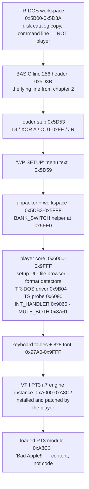
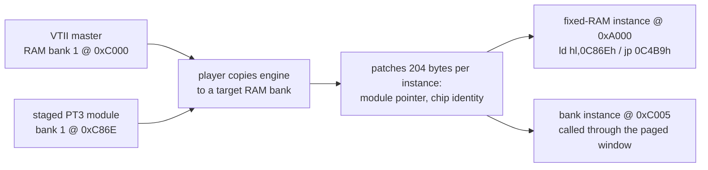
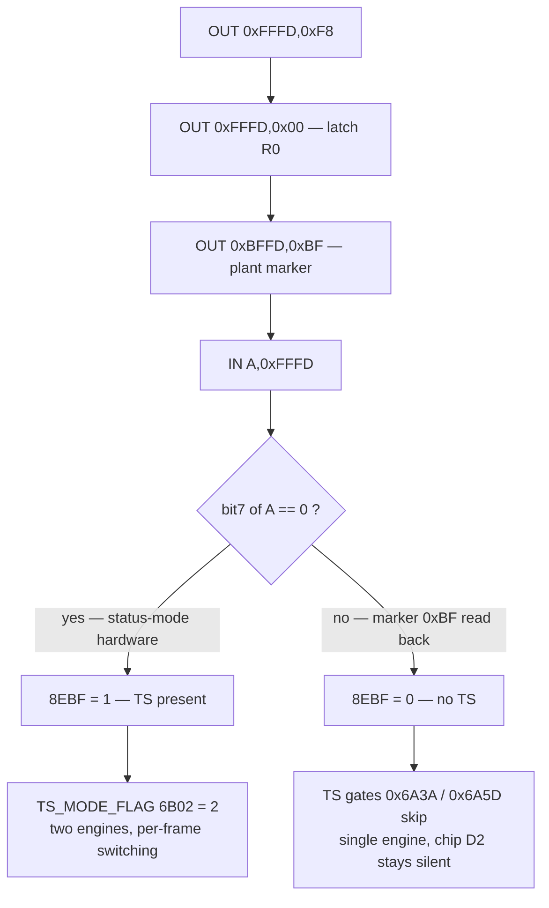
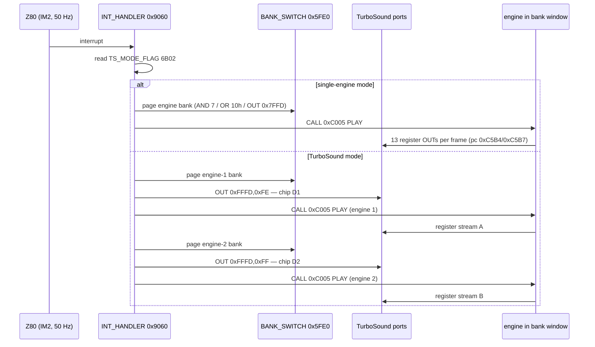
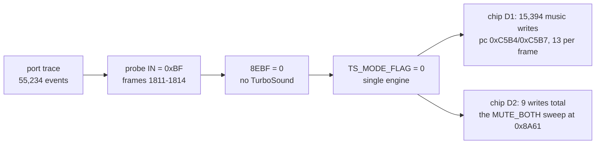

# WildPlayer v0.333 — an autopsy in ten chapters

> **The hook.** A Pentagon 128K boots a TR-DOS disk. A music player paints its
> setup screen, finds the module, starts playing — and one of its two AY chips
> never makes a sound. This folder is the full reverse-engineering of that
> player: the pure binary, the annotated disassembly, the tools, and the story
> of how a five-instruction probe decided the fate of a whole sound chip.

Everything here was extracted from **live memory dumps** of the emulator
running `ts_my.trd` (a real Wild Player disk) on a Pentagon model — not from
any published source. The player is **WildPlayer v0.333**, a multi-format
TurboSound-capable tracker player for the ZX Spectrum.

| artifact | what it is |
|---|---|
| [`wildplayer_body_org5D3B.bin`](wildplayer_body_org5D3B.bin) | the pure player body, 19,336 bytes, org `0x5D3B` |
| [`wildplayer_body.asm`](wildplayer_body.asm) | annotated disassembly of the body (read this) |
| [`wildplayer_bank1_vtii.asm`](wildplayer_bank1_vtii.asm) | VTII PT3 r.7 engine master (RAM bank 1, org `0xC000`) |
| [`wildplayer_bank4_unipt2.asm`](wildplayer_bank4_unipt2.asm) | UniPT2 engine (RAM bank 4, PT2-format support) |
| [`engine_install_patches.txt`](engine_install_patches.txt) | the 204 bytes the player patches per engine instance |
| [`WILDDISASM_NOTES.md`](WILDDISASM_NOTES.md) | terse companion notes (memory map, bank roles) |
| [`disasm_wildplayer.py`](disasm_wildplayer.py) | rebuilds everything above from [`dumps/`](dumps) |
| [`analyze_wildplayer_ts.py`](analyze_wildplayer_ts.py) | port-trace forensics tool (chapter 10) |
| [`dumps/`](dumps) | the raw live-memory captures this is all derived from |

---

## The cast

- **ZX Spectrum Pentagon 128K** — the Soviet-bloc clone this disk targets:
  128K of RAM in switchable 16K banks, TR-DOS 5.04 in ROM, and a `0x7FFD`
  port that decides which RAM bank shows at `0xC000`.
- **AY-3-8910 / YM2149** — the Spectrum's sound chip. Sixteen registers,
  three tone channels, one noise channel, one crude mixer. Programmed through
  two ports: `0xFFFD` (select register) and `0xBFFD` (write data).
- **TurboSound (TS)** — a beloved Eastern-scene upgrade: a *second* AY hung
  on the same two ports, plus a chip-select trick (chapter 7). Two AYs =
  six tone channels. Demo-scene music heaven.
- **Vortex Tracker II (VTII)** — the standard PT3-module play engine, the
  de-facto scene library that most players embed.

---

## Chapter 1 — The disk that boots itself

Slide `ts_my.trd` in and the TR-DOS ROM looks for a file named `boot` with
the *boot* attribute — here `boot.B`, a BASIC program file. `boot B` loads it
to the BASIC program area (`PROG = 0x5D3B`) and runs it. That's the entire
contract: the player gets one file, loaded at one known address, and one
`USR` call. Everything else it must do for itself.

The bytes just below, `0x5B00–0x5D3A`, are not the player's — that's TR-DOS
workspace (the disk catalog copy and the typed command line). The first byte
of the *player proper* is at `0x5D3B`. We know where the body *ends* just as
precisely: at `0xA8C3` the loaded *Bad Apple!!* PT3 module begins, with its
`'Vortex Tracker II 1.0 module'` header string. A module is content, not
code — so the body is exactly `0x5D3B..0xA8C2`, which is the 19,336-byte
binary in this folder.

## Chapter 2 — The line that lied

Here is the first little magic trick, four bytes of header plus a BASIC
statement that displays one thing and executes another:

```text
5D3B: 00 01          line number = 0x0100 = 256
5D3D: EC 00          line length = 236 bytes
5D3F: FD             token: CLEAR
5D40: 30 0E 00 00 B3 5F 00    '0' + CH-14 + <5-byte const: 0x5FB3 = 24499>
5D47: 3A             ':'
5D48: F9             token: RANDOMIZE
5D49: C0             token: USR
5D4A: 30 0E 00 00 53 5D 00    '0' + CH-14 + <5-byte const: 0x5D53 = 23891>
5D51: 3A             ':'
5D52: EA             token: REM     ... and the machine code follows to EOL
```

If you `LIST` this line, the Spectrum shows **`CLEAR 0 : RANDOMIZE USR 0 : REM`**
— because the ASCII digit really is a placeholder `'0'`. But ZX BASIC stores
every number *twice*: once as display digits, once as a hidden binary copy
after the CH-14 (`0x0E`) marker, and **execution uses the binary copy**.
Decode those five-byte constants (exponent `0x00` = small-integer form, value
in mantissa bytes 2–3) and the line *actually* means:

```basic
CLEAR 24499 : RANDOMIZE USR 23891 : REM <machine code>
```

`CLEAR 24499` sets RAMTOP to `0x5FB3`, pushing the stack *below* the code so
BASIC can't trample it. `RANDOMIZE USR 23891` jumps to `0x5D53` — one byte
after the `REM` token, i.e. straight into the "comment". And a `REM` swallows
everything to end-of-line, which is why the whole packed player can legally
live inside a BASIC line. The listing lies; the binary doesn't.

## Chapter 3 — Six bytes, then a hurricane

The USR target is just six bytes:

```asm
LOADER_ENTRY:                      ; 0x5D53
    di                             ; interrupts off - we're taking over
    xor a
    out (0feh),a                   ; border black, quietly
    jr STAGE2                      ; into the unpacker at 0x5DB3
```

Everything after that is packed data. The stage-2 unpacker at `0x5DB3`
decompresses the real player over `0x5DB3..0x9FFF`, parks helper routines,
prepares the RAM banks — and only then lets the interrupts back in, on the
player's own terms. From here on, the machine belongs to WildPlayer.

## Chapter 4 — A map of the beast

The unpacked player organizes main RAM like this (addresses grow downward
in the diagram):



And behind the `0xC000` window, the switchable RAM banks:

| bank | role (from dump analysis) |
|---|---|
| 0 | TR-DOS catalog cache + help screens (`WP333hlp`, `PlayHelp` …) |
| 1 | **VTII PT3 r.7 engine master** at `0xC000` + staged module at `0xC86E` |
| 4 | **UniPT2 engine** — PT2-format support |
| 5, 6 | data, tables, buffers |
| 7 | mostly empty + font-like bitmaps; was paged at dump time |

## Chapter 5 — A diplomat of formats

WildPlayer's selling point is that it plays *everything*. Embedded strings
betray the detector zoo around `0x6BF8–0x70E4`: `ProTracker 3.`,
`Vortex Tracker II 1.`, `TFMcom1.`, plus Pro Sound Creator probe tables at
`0x6EF8`. Pick a file in the browser (with its `HDD/CD`, `Len:`, `Drv:`,
`Fls/Free`, `Root Dir` chrome at `0x8E1A`) and the detectors sniff the
header, pick the matching engine — VTII for PT3, UniPT2 for PT2 — and stage
the module. Its own TR-DOS disk driver at `0x9B04` talks to the WD1793 FDC
directly, polling status like any well-behaved Pentagon program.

## Chapter 6 — Engines in the basement

The music engines never sit in plain RAM as files; the player *installs*
them like a stage crew rolling out instruments before a concert:



The diff between the installed instance at `0xA000` and the bank-1 master is
exactly 204 bytes — [`engine_install_patches.txt`](engine_install_patches.txt)
lists every one. The engine obeys the VTII contract: `+0` = INIT with
`HL` pointing at the module, `+5` = PLAY, called once per interrupt. Note the
instance's first instructions:

```asm
VTII_INSTANCE:                     ; 0xA000  (INIT)
    ld hl,0c86eh                   ; module staged INSIDE the paged bank
    ...
    jp 0c4b9h                      ; 0xA005  (PLAY) -> impl in bank coords
```

The play implementation and the module both live *behind the bank window* —
reachable only while the right 16K bank is paged at `0xC000`. Keep that
thought; it's load-bearing in chapter 9.

## Chapter 7 — Two chips, one port

TurboSound's whole design constraint: don't change the port map. Both AYs
still answer `0xFFFD`/`0xBFFD` — but writes of `0xFE`/`0xFF` to `0xFFFD`
(which a plain AY would read as "select register 14/15") are intercepted and
reinterpreted as *chip selects*:

| write | meaning |
|---|---|
| `OUT 0xFFFD, 0xFE` | select **first** chip (D1) |
| `OUT 0xFFFD, 0xFF` | select **second** chip (D2) |
| `OUT 0xFFFD, r` (r ≤ 13) | select register r *on the selected chip* |
| `OUT 0xBFFD, v` | write value v to that register |
| `IN 0xFFFD` | read current register of the selected chip |

(Aliased mirrors — `0xBEFD`, `0xDFFD` and friends — decode to the same
devices; the port traces show thousands of aliased data writes working
perfectly.)

## Chapter 8 — The handshake

Before it commits to two engines, WildPlayer must *prove* TurboSound exists.
At intro time it runs a five-instruction probe from an overlay at `0x6090`
(by dump time the intro code is gone and a key-table sits on top — the
port trace caught it red-handed in the act, frames 1811–1814):

```text
    pc 0x6090   OUT (0xFFFD),A     A = 0xF8  control word
    pc 0x6095   OUT (0xFFFD),A     A = 0x00  latch register 0
    pc 0x609A   OUT (0xBFFD),A     A = 0xBF  plant marker in R0
    pc 0x609F   IN  A,(0xFFFD)     read back
    pc 0x60A3   JP  P,TS_YES       bit7 == 0 -> "TurboSound present"
```

The logic is beautifully sneaky. On FM-capable TS hardware (TSFM), after a
control word like `0xF8` the readback returns a *status byte* — `0x00` when
idle. Bit 7 clear → “TSFM present”. On a plain two-AY TurboSound there is no
status mode, the `0xBF` marker just sits in R0 and reads back as itself:
bit 7 **set** → “no TS”:



The result lands in flag `8EBF` and is then double-gated (`0x6A3A`, `0x6A5D`)
before arming `TS_MODE_FLAG` at `6B02` — the master switch for everything
dual-chip.

## Chapter 9 — Fifty times a second

Once playing, everything happens in the interrupt handler at `0x9060`. In
TurboSound mode, every frame is a little ballet of banking and chip selects
(`PER_FRAME_PLAY` at `0x907D`):



The engine's own register-write loop is a tiny `outi` spiral at `0xC5B4`:

```asm
VTII_REG_OUT_SELECT:               ; 0xC5B4 (bank coords)
    out (c),a                      ; select register
    ld b,e
VTII_REG_OUT_DATA:
    outi                           ; write data byte  pc 0xC5B7
    ld b,d
    inc a
    cp 00dh
    jr nz,VTII_REG_OUT_SELECT
```

Thirteen register writes per frame per engine — that's the heartbeat of
PT3 music. And on stop, `MUTE_BOTH` at `0x8A61` sweeps both chips'
volume registers to zero through both selects (`0x8A66`, `0x8A6F`).

## Chapter 10 — Epilogue: the silent twin

Now the story this folder was built for. In our emulator, WildPlayer's
*Bad Apple!!* played — but TS or not, the second AY never whispered.
A full port trace (55,234 events, decoded `0xFFFD`/`0xBFFD` filter) told
the whole tale:

1. **The probe read `0xBF`.** Frames 1811–1814: `F8 / 00 / BF / IN` at pcs
   `6090/6095/609A/609F`, and the IN returned `0xBF` — the marker itself.
   Bit 7 set → “no TurboSound” → `8EBF = 0`.
2. **The gates stayed shut.** `TS_MODE_FLAG (6B02)` never left zero.
   `DUAL_CHIP_INIT (0x86EF)` never ran. The handler's switch block never
   executed.
3. **One chip got a symphony, the other got a eulogy.** Replay of all
   15,394 music writes through the chip-select semantics: *all of them*
   to chip D1. Chip D2 received exactly **9 writes, ever** — the volume
   sweep of `MUTE_BOTH`.



And the punchline: everything *else* the player did was flawless. The
15,379 aliased `0xBEFD`→`0xBFFD` data writes all decoded correctly; the
banking idiom worked; the engine ran at exactly 13 writes per frame. The
fault was a single semantic: the dispatch treated the probe's `0xF8`
control word as a register select, so the hardware never answered
“status-mode present”, and the player — rationally, correctly — muted the
second chip forever. The fix (TSFM control-word semantics in the
emulator's TurboSound chip) is documented with the port-trace evidence in
the emulator repo; this folder keeps the player's side of the story.

To re-run the forensics yourself:

```bash
python3 analyze_wildplayer_ts.py <porttrace-wildplayer.json>
```

---

## Reproduce this folder

```bash
cd docs/disasm/software/wildplayer
python3 disasm_wildplayer.py          # rebuilds .asm/.sym/.bin/NOTES from dumps/
```

Requires `z80dasm` (`brew install z80dasm`). The script disassembles *code
segments* — the complement of the known data ranges — so every segment
restarts on a clean instruction boundary (a naive linear sweep drifts
through fonts and tables and swallows boundary addresses as operand bytes;
that's how the engine entry at `0xA000` first vanished behind a `jr`).

## Symbol quick reference

| label | address | role |
|---|---|---|
| `BASIC_LINE256` | `0x5D3B` | the lying BASIC line (chapter 2) |
| `LOADER_ENTRY` | `0x5D53` | `DI / XOR A / OUT 0xFE / JR` |
| `BANK_SWITCH` | `0x5FE0` | `AND 7 / OR 10h / OUT (0x7FFD)` |
| `TS_PROBE_OVERLAY` | `0x6090` | TurboSound presence probe (intro overlay) |
| `TS_GATE_A` / `TS_MARKER_CHECK` | `0x6A3A` / `0x6A5D` | gates from probe result to TS mode |
| `TS_MODE_FLAG` | `0x6B02` | 0 = single chip, 1/2 = dual |
| `DUAL_CHIP_INIT` | `0x86EF` | installs and inits both engines |
| `MUTE_BOTH` | `0x8A61` | volume sweep on both chips |
| `TS_PRESENT_FLAG` | `0x8EBF` | written by the probe |
| `INT_HANDLER` | `0x9060` | 50 Hz entry |
| `PER_FRAME_PLAY` | `0x907D` | per-frame TS switch block |
| `FDC_POLL` | `0x9B04` | TR-DOS disk driver poll loop |
| `VTII_INSTANCE` | `0xA000` | installed VTII engine (+0 INIT / +5 PLAY) |
| `VTII_REG_OUT_SELECT` | `0xC5B4` | engine `outi` register loop (bank coords) |
