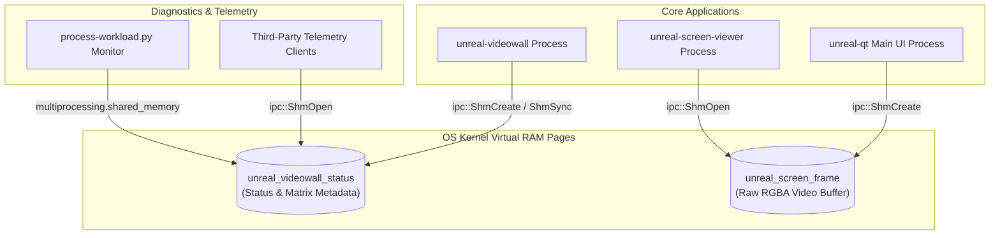

# Shared Memory Subsystem — Technical Design & API Reference

> Status: production · Target: `core/src/common/shmhelper.h` (header-only) · C++20 · Windows / macOS / Linux (MSVC, Clang, GCC, MinGW)

---

## 1. Overview & Architectural Goals

The **Shared Memory Subsystem** provides a zero-allocation, zero-copy, cross-platform Inter-Process Communication (IPC) layer for the Unreal-NG emulator suite. It enables decoupled processes (`unreal-videowall`, `unreal-screen-viewer`, `unreal-qt`, and Python automation scripts) to exchange real-time state, video frames, and telemetry at full memory speeds without disk file writes or socket serialization overhead.



### Key Requirements

1. **Zero Disk I/O Mandate**: Operational status and metrics MUST be exchanged strictly in RAM. Disk writes (e.g. `scratch/videowall_status.json`) are prohibited for high-frequency runtime polling.
2. **Cross-Platform Alignment**: Native binding to POSIX shared memory primitives (`shm_open`, `mmap`) on macOS and Linux, and Win32 file mappings (`CreateFileMappingA`, `MapViewOfFile`) on Windows.
3. **Zero Dependencies**: Implemented as a header-only library (`core/src/common/shmhelper.h`) using standard OS system headers.
4. **Python Standard Library Compatibility**: Named RAM segments must map directly to Python 3.8+ `multiprocessing.shared_memory.SharedMemory`.
5. **Deterministic Lifecycle (SPoR)**: Single Point of Responsibility ownership pattern (`isOwner`) ensures automatic unlinking (`shm_unlink`) upon creator destruction while non-owning attachers detach safely without destroying the underlying segment.

---

## 2. Platform Mechanics & OS Abstractions

The subsystem abstracts OS platform variations behind unified handle structures and helper functions within the `ipc` namespace.

| Feature / Action | POSIX Implementation (macOS / Linux) | Win32 Implementation (Windows) |
| :--- | :--- | :--- |
| **Namespace prefix** | Leading slash (e.g., `/unreal_videowall_status`) | `Local\` namespace (e.g., `Local\unreal_videowall_status`) |
| **Segment Creation** | `shm_open(O_CREAT \| O_RDWR, 0666)` + `ftruncate()` | `CreateFileMappingA(INVALID_HANDLE_VALUE, ...)` |
| **Memory Mapping** | `mmap(nullptr, size, PROT_READ \| PROT_WRITE, MAP_SHARED, fd, 0)` | `MapViewOfFile(handle, FILE_MAP_ALL_ACCESS, 0, 0, size)` |
| **Existing Segment Open**| `shm_open(name, O_RDWR, 0666)` | `OpenFileMappingA(FILE_MAP_ALL_ACCESS, FALSE, name)` |
| **Memory Sync Barrier** | `__sync_synchronize()` + `msync(MS_SYNC \| MS_INVALIDATE)` | `FlushViewOfFile(data, size)` |
| **Unmapping / Detach** | `munmap(data, size)` + `close(fd)` | `UnmapViewOfFile(data)` + `CloseHandle(handle)` |
| **Segment Destruction** | `shm_unlink(name)` (invoked by creator process) | Automatically released by Windows Kernel when all handles close |

---

## 3. Data Layout Standards & Struct Specifications

### 3.1 `ipc::ShmHandle`
The core descriptor holding mapped memory addresses and OS handles:

```cpp
namespace ipc {

struct ShmHandle {
#ifdef _WIN32
    HANDLE handle = INVALID_HANDLE_VALUE;  // Win32 kernel object handle
#else
    int fd = -1;                           // POSIX file descriptor
#endif
    void* data = nullptr;                 // Pointer to mapped virtual address
    size_t size = 0;                      // Segment size in bytes
    std::string name;                     // System identifier name
    bool isOwner = false;                 // True if process created the segment
};

} // namespace ipc
```

### 3.2 VideoWall Status Header Layout (`VWST`)
The 36-byte binary header layout written at byte offset 0 in `unreal_videowall_status`:

```cpp
#pragma pack(push, 1)
struct VideoWallStatusHeader {
    char magic[4];         // Magic signature: "VWST"
    uint32_t version;      // Header version (currently 1)
    uint32_t pid;          // Process ID of the VideoWall process
    double timestamp;      // UNIX timestamp (seconds since epoch)
    uint32_t tileCount;    // Total number of active emulator tiles
    uint32_t cols;         // Grid layout columns
    uint32_t rows;         // Grid layout rows
    uint32_t flags;        // Bit 0: GPU accelerated (1 = GL, 0 = Software)
    uint32_t jsonLen;      // Length of attached JSON metadata payload following header
};
#pragma pack(pop)
```

---

## 4. C++ API Reference & Usage Guide

Header File: [core/src/common/shmhelper.h](file:///Volumes/TB4-4Tb/Projects/Test/unreal-ng/core/src/common/shmhelper.h)

### 4.1 Function Signatures

```cpp
namespace ipc {

// Creates and maps a new named shared memory segment
bool ShmCreate(ShmHandle& shm, const std::string& name, size_t size);

// Opens and maps an existing named shared memory segment
bool ShmOpen(ShmHandle& shm, const std::string& name, size_t size);

// Unmaps memory and closes OS handles (unlinks if isOwner is true)
void ShmClose(ShmHandle& shm);

// Flushes CPU cache lines and memory barriers across processes
void ShmSync(ShmHandle& shm);

} // namespace ipc
```

### 4.2 C++ Producer Example (Publishing Status)

```cpp
#include <common/shmhelper.h>
#include <cstring>
#include <chrono>

void PublishVideoWallStatus(uint32_t cols, uint32_t rows, uint32_t tileCount, bool isGpu) {
    static ipc::ShmHandle statusShm;

    // Allocate 1024 bytes in RAM on first call
    if (statusShm.data == nullptr) {
        if (!ipc::ShmCreate(statusShm, "unreal_videowall_status", 1024)) {
            return;
        }
    }

    auto* header = static_cast<VideoWallStatusHeader*>(statusShm.data);
    std::memcpy(header->magic, "VWST", 4);
    header->version = 1;
    header->pid = static_cast<uint32_t>(getpid());
    header->timestamp = std::chrono::duration<double>(
        std::chrono::system_clock::now().time_since_epoch()).count();
    header->tileCount = tileCount;
    header->cols = cols;
    header->rows = rows;
    header->flags = isGpu ? 1 : 0;
    header->jsonLen = 0;

    ipc::ShmSync(statusShm);
}
```

---

## 5. Python Integration (`process-workload.py`)

Python 3.8+ provides native access to shared memory via `multiprocessing.shared_memory.SharedMemory`.

### Python Consumer Pattern

```python
import struct
from multiprocessing.shared_memory import SharedMemory
from typing import Optional, Dict, Any

def fetch_videowall_live_status(pid: int = 0) -> Optional[Dict[str, Any]]:
    shm_names = ["unreal_videowall_status"]
    if pid > 0:
        shm_names.insert(0, f"unreal_videowall_status_{pid}")

    for name in shm_names:
        try:
            shm = SharedMemory(name=name, create=False)
            buf = shm.buf
            if len(buf) >= 36:
                magic, ver, shm_pid, ts, tile_count, cols, rows, flags, json_len = struct.unpack(
                    "<4sIIdIIIII", buf[:36]
                )
                if magic == b"VWST" and ver == 1:
                    shm.close()
                    return {
                        "tile_count": tile_count,
                        "cols": cols,
                        "rows": rows,
                        "gpu_accelerated": bool(flags & 1),
                        "pid": shm_pid,
                        "timestamp": ts
                    }
            shm.close()
        except FileNotFoundError:
            pass
        except Exception:
            pass

    return None
```

---

## 6. Guidelines & Quality Requirements

- **Header Hygiene**: Do not include heavy platform headers inside general public headers. `shmhelper.h` isolates `<windows.h>` and `<sys/mman.h>` within standard include guards.
- **Naming Rule Compliance**: File names MUST NOT contain underscores. The header is named `shmhelper.h` (not `shm_helper.h`).
- **Clean Teardown**: Creators MUST invoke `ipc::ShmClose(shm)` during application exit or window cleanup to prevent orphaned `/dev/shm` entries on Linux/macOS.
