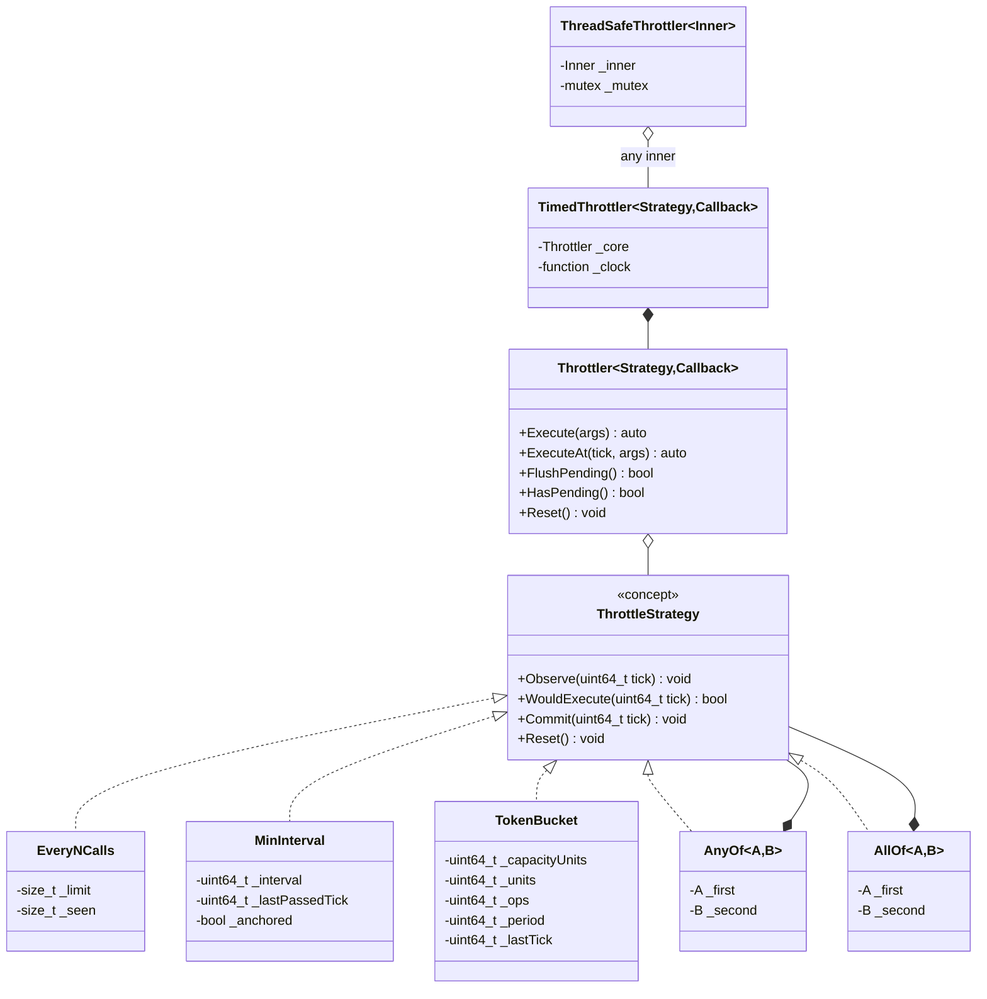
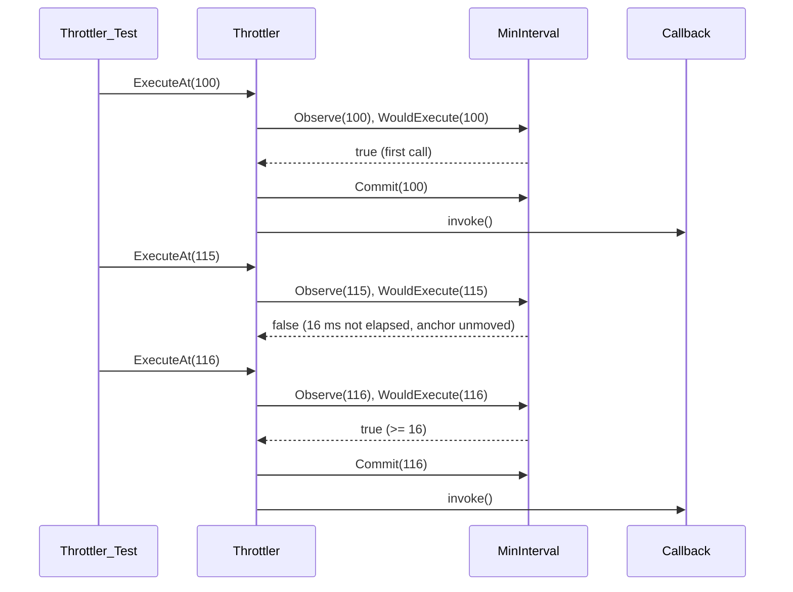

# Universal Throttling Helper — Technical Design

> Status: design · Target: `core/src/common/throttler.h` (header-only) · C++20 · Windows / macOS / Linux (MSVC, Clang, GCC, MinGW)

## 1. Overview & Goals

The throttling helper limits how often arbitrary callbacks and lambdas run: UI repaints triggered from the hot emulation loop, expensive metric logging, outgoing WebAPI bursts. It never blocks — a throttled call either executes the callback immediately or is skipped (optionally latched for later flush); the caller's thread is never delayed.

### Requirements

1. **Universal**: wraps any callable (lambda, `std::function`, functor, member function via wrapper), forwarding arbitrary arguments.
2. **Three mechanisms**:
   - **Grouped calls** — run once every N invocations.
   - **Minimum interval** — run at most once per T ticks.
   - **Sustained rate** — token bucket: burst of B, then steady R per interval.
3. **Perfectly testable core**: the decision layer never reads a clock. Time enters only as an explicit `uint64_t` tick supplied by the caller — every test is deterministic (no sleeps, no flaky boundaries).
4. **Convenience with injection**: timed wrappers auto-supply `steady_clock` milliseconds, but the clock is injectable — even the wrappers stay unit-testable.
5. **Cross-platform**: standard C++20 only, `<chrono>` touched solely by the default clock; zero warnings on MSVC / Clang / GCC / MinGW.

### Design Principles

1. **The decision core is a pure state machine.** A strategy holds counters and answers exactly one question: *may this call through, given this tick?*
2. **Static polymorphism.** A C++20 concept defines the strategy contract; no inheritance, no vtables, no heap — safe for hot loops.
3. **Integer arithmetic only** in the decision core (the token bucket is fixed-point). Boundaries are exact and identical on every compiler and platform.
4. **Composable layers.** Strategy → `Throttler` (binds callback) → `TimedThrottler` (adds clock) → `ThreadSafeThrottler` (adds mutex). Every layer is usable on its own.
5. **Nothing lost silently.** Leading-edge drop by default; an optional *KeepLast* policy latches the most recent skipped call so the final state can still land via `FlushPending()`.

## 2. Layered Architecture

- **Layer 0 — Strategies** (pure decision): a three-phase evaluation contract — `Observe(tick)`, `WouldExecute(tick) const`, `Commit(tick)` — plus `Reset()`. No clock, no callback, no side effects beyond their own counters. Combinators (§3.4) are strategies too.
- **Layer 1 — `Throttler`**: binds a strategy to a callback. Offers tickless `Execute(args...)` and tick-driven `ExecuteAt(tick, args...)`, the pending latch, and `Reset()`.
- **Layer 2 — `TimedThrottler`**: owns an injectable clock (`std::function<uint64_t()>`, default `SteadyClockMs`); its `Execute(args...)` becomes `core.ExecuteAt(clock(), args...)`.
- **Layer 3 — `ThreadSafeThrottler<Inner>`**: opt-in `std::mutex` shell around any throttler-like inner object.



### 2.1 Tick Contract

- A **tick** is a `uint64_t` in caller-defined units. The timed layers define it as **milliseconds since epoch** (`steady_clock`; wraps after ~585 million years — irrelevant).
- Ticks must be **monotonic non-decreasing** — guaranteed by `steady_clock`; tests drive them manually. A decreasing tick is a caller bug: detected by `assert` in `Observe` in debug builds, undefined behavior in release (documented, never silently accepted).
- Tickless strategies (`EveryNCalls`) ignore the tick entirely; the tickless `Execute(args...)` overload forwards tick `0`.

### 2.2 The Strategy Concept

```cpp
/// Anything that can decide, from a monotonic tick, whether a call may execute.
///
/// Three phases per evaluation:
///   Observe(tick)      — record the attempt; advance time-derived state (anchors, refills)
///   WouldExecute(tick) — PURE query on const state: is the condition met?
///   Commit(tick)       — consume: advance state as-if passed
template<typename S>
concept ThrottleStrategy = requires(S strategy, const S constStrategy, uint64_t tick)
{
    { strategy.Observe(tick) } -> std::same_as<void>;
    { constStrategy.WouldExecute(tick) } -> std::convertible_to<bool>;
    { strategy.Commit(tick) } -> std::same_as<void>;
    { strategy.Reset() } -> std::same_as<void>;
};
```

Why a concept and not an abstract interface: strategies are values copied into throttlers and evaluated in hot loops — static dispatch keeps the decision free of indirection, and every strategy stays a tiny, independently testable struct.

Contract details:

- The `const` on `WouldExecute` enforces purity mechanically — a strategy that mutates in its query does not satisfy the concept.
- `Commit(tick)` is legal after `Observe(tick)` at the same tick — **including when `WouldExecute(tick)` returned `false`**, because combinators commit every arm on an overall pass (§3.4). For the built-ins the post-`false` commit is total and safe: `EveryNCalls` zeroes its counter, `MinInterval` re-anchors, `TokenBucket` consumes one token or drains to zero (never underflows).
- Built-ins also provide a `ShouldExecute(tick)` sugar one-liner (`Observe` → `Would` → `Commit`) for standalone use; the throttler itself drives the phases directly (§4).

## 3. Strategies

All strategies are copyable value types with integer state, implementing the three-phase contract from §2.2. The tables below describe behavior at the `ShouldExecute` sugar level (one evaluation attempt): a call either *passes* (returns `true` and consumes) or *rejects* (returns `false`). The mechanics table maps each strategy onto the phases.

| Strategy | `Observe(tick)` | `WouldExecute(tick) const` | `Commit(tick)` |
|---|---|---|---|
| `EveryNCalls` | `++_seen` | `_seen >= _limit` | `_seen = 0` |
| `MinInterval` | anchor to `tick` if cold and `IntervalStart::FullInterval` | `!_anchored` (`Immediate`), else `tick - _lastPassedTick >= _interval` | `_lastPassedTick = tick`, `_anchored = true` |
| `TokenBucket` | refill: clamp `delta`, `_units = min(_capacityUnits, _units + delta * _ops)`, `_lastTick = tick` | `_units >= _period` | `_units -= _period`, clamped at zero |

The phase split costs nothing on the hot path (three inlined one-liners) and is what makes combinators (§3.4) possible: a compositor can query any arm without consuming it.

### 3.1 `EveryNCalls` — grouped calls

| | |
|---|---|
| Parameters | `limit` N (N ≥ 1; N = 1 is a pass-through) |
| State | `_seen` — attempts since the last pass |
| Passes | every Nth invocation: calls 1..N-1 rejected, call N passes, counter resets |
| Tick | ignored |

The first pass happens on call **N**, not on call 1: a "log every 10 000 instructions" throttle must observe a full group before firing. If an immediate first fire is wanted, call the callback directly once at setup.

### 3.2 `MinInterval` — at most once per T ticks

| | |
|---|---|
| Parameters | `interval` T (T ≥ 1) |
| State | `_lastPassedTick`, `_anchored = false` |
| Passes | the first call always passes; afterwards iff `tick - _lastPassedTick >= interval` |
| On pass | `_lastPassedTick = tick` — **re-anchored to the actual pass time** |
| Tick | required |

Semantics choices, made explicit:

- **Leading edge**: an allowed call executes immediately; rejected calls are dropped (or latched, §4.4). Nothing is ever scheduled for later — there is no timer inside the core.
- **`>=` boundary**: a call exactly `interval` ticks after the last pass passes.
- **Re-anchoring** instead of `_lastPassedTick += interval` accumulation: after an idle gap the throttle cannot "catch up" with a burst of passes; each pass buys a full fresh interval.

**Start policy** — `IntervalStart { Immediate, FullInterval }` (default `Immediate`):

- `Immediate`: the first call always passes — right for solo UI use (the first repaint must not wait).
- `FullInterval`: the first evaluation only anchors the clock; a full interval must elapse before the first pass — required when the strategy is an arm inside a combinator (§3.4), where "first call passes" would defeat the combined criterion.

### 3.3 `TokenBucket` — burst + sustained rate

| | |
|---|---|
| Parameters | `capacity` B (max burst, ≥ 1), `ops` R per `period` P ticks (R ≥ 1, P ≥ 1) |
| State | `_units` (integer fixed-point tokens), `_lastTick` |
| Initial | bucket **full** — an initial burst of B passes is allowed |
| Passes | when at least one whole token is available; passing consumes one |
| Tick | required |

Example: `TokenBucket(5, 10, 1000)` allows 5 immediate calls, then sustains 10 calls per 1000 ticks.

**Integer fixed-point scheme** — exact on every platform, no floating point anywhere in the core:

1. Tokens are stored as `_units`, where **1 token = `period` units**; one execution costs `period` units.
2. Each evaluation: `delta = tick - _lastTick` (clamped, step 4), `_lastTick = tick`, `_units = min(capacity * period, _units + delta * ops)`.
3. Pass iff `_units >= period`, then `_units -= _period` — clamped at zero when committed without a full token (combinator arms, §3.4): the bucket drains instead of underflowing.
4. **Overflow safety**: `delta * ops` could overflow after long idleness. Clamp `delta` to `UINT64_MAX / ops` before multiplying — after the clamp the bucket is saturated anyway, so the precision loss is unobservable.

Rate check: refill `ops` units per tick ÷ cost `period` units per call = `ops / period` calls per tick — exactly R calls per P ticks, with integer-exact boundaries.

### 3.4 Combinators — Combined Criteria

Real gates are often compound: *flush the sink every 1 000 entries or 100 ms, whichever happens earlier*; *commit a batch only when it holds at least 1 000 entries and at least 100 ms has passed*. Both combinators are themselves strategies — they satisfy `ThrottleStrategy` and nest — which is exactly what the three-phase contract enables: a compositor can query any arm (`WouldExecute`) without consuming it, and commit every arm on an overall pass.

#### `AnyOf<A, B>` — whichever happens earlier

| Phase | Behavior |
|---|---|
| `Observe(tick)` | `A.Observe(tick); B.Observe(tick)` |
| `WouldExecute(tick)` | `A.WouldExecute(tick) || B.WouldExecute(tick)` |
| `Commit(tick)` | `A.Commit(tick); B.Commit(tick)` — **every** arm commits |

Walkthrough — `AnyOf(EveryNCalls(1000), MinInterval(100, IntervalStart::FullInterval))`:

- Steady 1 call/ms: the interval arm wins at tick 100; the count arm commits too, so the next cycle starts from zero — the intended flush-gate behavior ("the timer fired, restart the batch").
- 1 000 calls in one burst at t=0: the count arm wins; the interval arm re-anchors to t=0.

#### `AllOf<A, B>` — whichever happens later

| Phase | Behavior |
|---|---|
| `Observe(tick)` | `A.Observe(tick); B.Observe(tick)` |
| `WouldExecute(tick)` | `A.WouldExecute(tick) && B.WouldExecute(tick)` |
| `Commit(tick)` | `A.Commit(tick); B.Commit(tick)` — **every** arm commits |

All built-in conditions are **monotone between commits** (`_seen` only grows, elapsed time only grows, bucket units only refill), so an arm that has become satisfied stays satisfied until the overall pass — `AllOf` therefore fires exactly when its *last* condition becomes true. A custom arm must preserve this monotonicity to be usable in `AllOf` (§12).

**Arm guidance**: use `IntervalStart::FullInterval` for time arms inside combinators — an `Immediate` interval arm makes `AnyOf` pass on the very first call, defeating the combined criterion.

**Nesting**: both combinators satisfy the concept, so `AnyOf(AllOf(...), ...)` composes; arity beyond two is expressed by nesting (a variadic form is sugar — §11).

## 4. `Throttler` — the Core Binding

```cpp
enum class ThrottlePolicy { Drop, KeepLast };

template<typename Strategy, typename Callback>
    requires ThrottleStrategy<Strategy>
class Throttler
{
public:
    Throttler(Strategy strategy, Callback callback,
              ThrottlePolicy policy = ThrottlePolicy::Drop);

    /// Tickless entry point (natural for EveryNCalls). Forwards as ExecuteAt(0, ...).
    template<typename... Args>
    auto Execute(Args&&... args);

    /// Tick-driven entry point (natural for MinInterval / TokenBucket).
    /// Drives the strategy phases: Observe → WouldExecute → Commit on pass.
    template<typename... Args>
    auto ExecuteAt(uint64_t tick, Args&&... args);

    /// Executes the latched pending call, if any. Returns true if one ran.
    bool FlushPending();
    bool HasPending() const;

    /// Resets strategy state and drops any pending call.
    void Reset();
};
```

### 4.1 Callable Requirements

`Callback` is deduced by the factory and stored **by value, never type-erased on the accept path** — whatever you pass is invoked as-is: no `std::function` conversion, no heap, no extra indirection beyond the callable's own. Invocation goes through `std::invoke`, so every callable category works through one code path:

| Category | Example | Notes |
|---|---|---|
| Lambda (stateless) | `[] { Update(); }` | |
| Lambda (capturing) | `[this] { update(); }` | the throttler owns its own copy |
| `std::function<R(Args...)>` | `std::function<void(int)>` | type-erased by the *caller* only, when they want it |
| Function pointer | `&LogProgramCounter` | covers the C-style `void (*)()` typedefs used by `CallbackCollection` |
| Functor | `struct Meter { void operator()(int); }` | |
| Member function | `std::bind_front(&Logger::Flush, this)` | C++20; `[this] { Flush(); }` is equivalent |

Static contract:

- `Execute` / `ExecuteAt` constrain each call site with `std::invocable<Callback, Args...>` — a mismatched argument list is a compile error, not a runtime surprise.
- Stored by value: copyable callbacks make the throttler copyable; move-only callbacks (e.g. a lambda capturing a `unique_ptr`) make it move-only.
- The `KeepLast` latch captures the stored callback by reference plus decayed argument copies, so move-only callbacks remain latch-compatible.

### 4.2 Return Values

| Callback returns | `Execute` / `ExecuteAt` returns | Rejected call returns |
|---|---|---|
| `void` | `bool` — did the callback run? | `false` |
| `R` (non-void) | `std::optional<R>` | `std::nullopt` |

Implemented with `if constexpr` on `std::invoke_result_t`. A skipped call has no honest `R` value, so `nullopt` is the only truthful answer; `bool` keeps the overwhelmingly common `void` case ergonomic.

### 4.3 Why Two Entry Points, Not One

A defaulted leading tick (`Execute(tick = 0, args...)`) is ambiguous whenever the callback's first parameter is an integer — is `Execute(100)` a tick or an argument? Separate names make every call site unambiguous:

```cpp
auto metrics = MakeThrottler(EveryNCalls(10'000), LogProgramCounter); // tickless
metrics.Execute(pc);                                                 // no dummy 0

auto repaint = MakeTimedThrottler(MinInterval(16), [this] { update(); });
repaint.Execute();                                                   // clock supplies the tick
```

Calling `Execute` (tickless) on a time-based strategy is a misuse: the tick never advances, so after the first pass nothing passes again. The failure mode is "never fires" — loud in any test, and it can never cause bursts.

### 4.4 `ThrottlePolicy` — Drop vs KeepLast

Pure leading-edge dropping loses the *final* state: a UI throttled to 16 ms whose last update lands at t+15.9 ms shows stale data until the next unrelated event. Two policies:

- **`Drop`** (default): rejected calls vanish. Right for metrics ("sampled anyway") and rate limiting ("excess dropped").
- **`KeepLast`**: the most recent rejected call is latched as a move-only type-erased thunk (capturing decayed-copied arguments; rvalues moved) — `std::function` cannot be used here, since before C++23 its callables must be copy-constructible and would reject move-only argument copies. Rules:
  1. Every newer rejected call **supersedes** the latch — last wins, matching coalescing semantics.
  2. A **successful** `ExecuteAt` drops the latch: the fresh call already delivered newer state than the stale one.
  3. `FlushPending()` executes the latch and clears it. Call it from an idle pump / timer to guarantee the last state lands.

Type-erasure cost is paid only on the rejected path, never on the hot accept path.

### 4.5 Reset

`Reset()` forwards to `Strategy::Reset()` (strategy back to construction state: counters zeroed, bucket full, interval anchor forgotten) and clears the pending latch. Used on emulator reset / session switch so throttles never leak state across timelines (TTD sessions included).

## 5. `TimedThrottler` and Factories

```cpp
struct SteadyClockMs
{
    uint64_t operator()() const;   // std::chrono::steady_clock -> ms since epoch
};

template<typename Strategy, typename Callback>
class TimedThrottler
{
public:
    TimedThrottler(Strategy strategy, Callback callback,
                   ThrottlePolicy policy = ThrottlePolicy::Drop,
                   std::function<uint64_t()> clock = {});

    template<typename... Args>
    auto Execute(Args&&... args);   // core.ExecuteAt(clock(), args...)

    bool FlushPending();
    void Reset();
private:
    Throttler<Strategy, Callback> _core;
    std::function<uint64_t()> _clock;   // empty -> SteadyClockMs
};
```

- The clock is a `std::function<uint64_t()>` **member, not a hardcoded call** — tests inject a mutable tick variable and keep even the wrapper deterministic.
- `SteadyClockMs` is the only `<chrono>` touchpoint in the component; it uses `std::chrono::steady_clock` (monotonic on Windows/macOS/Linux — never `system_clock`, which can jump).

### 5.1 Factories — Call Sites Never Spell Template Arguments

```cpp
template<typename S, typename C>
auto MakeThrottler(S strategy, C callback,
                   ThrottlePolicy policy = ThrottlePolicy::Drop);

template<typename S, typename C>
auto MakeTimedThrottler(S strategy, C callback,
                        ThrottlePolicy policy = ThrottlePolicy::Drop,
                        std::function<uint64_t()> clock = {});

template<typename Inner>
auto MakeThreadSafe(Inner inner);
```

Deduction does the work; compare with spelling `TimeThrottler<TimeIntervalStrategy, std::function<void()>>(...)` at every declaration site.

## 6. `ThreadSafeThrottler` — Opt-In Locking

```cpp
template<typename Inner>
class ThreadSafeThrottler
{
public:
    template<typename... Args> auto Execute(Args&&... args);              // locks
    template<typename... Args> auto ExecuteAt(uint64_t tick, Args&&...);   // locks
    bool FlushPending();                                                   // locks
    void Reset();                                                          // locks
private:
    Inner _inner;
    mutable std::mutex _mutex;
};
```

- The core stays lock-free — single-threaded hot paths (the emulation loop) pay nothing; cross-thread use (e.g., WebAPI thread + UI thread sharing a throttle) wraps explicitly.
- `Inner` is `Throttler` or `TimedThrottler`; each forwarding method requires the corresponding inner method (compile error otherwise), so only the combinations that make sense instantiate.
- **The callback runs under the lock.** The callback must not re-enter the same throttler (deadlock) — documented contract. This is the safe-by-default choice: releasing the lock around the callback would let two threads evaluate the strategy concurrently and break rate guarantees.

## 7. File Layout & Build Integration

- `core/src/common/throttler.h` — a single header-only file; no `.cpp`. Includes: `stdafx.h`, `<chrono>` (convenience layer only), `<concepts>`, `<cstddef>`, `<functional>`, `<mutex>`, `<optional>`, `<type_traits>`, `<utility>`.
- No new dependencies, no CMake options; picked up by the existing core build.
- Tests: `core/tests/common/throttler_test.cpp`, fixture class `Throttler_Test` (CUT pattern) — auto-globbed by `core/tests/CMakeLists.txt` (`GLOB_RECURSE`), no registration edit needed.

## 8. Test Plan — Determinism by Construction

Every test is deterministic by construction: explicit ticks, a fake injectable clock, **zero sleeps** — the whole suite runs in microseconds.

Conventions:

- All tests live in `core/tests/common/throttler_test.cpp` (auto-globbed, §7). Fixtures follow the project `ClassName_Test` CUT pattern: `Throttler_Test` (strategies + core + `KeepLast`), `TimedThrottler_Test`, `ThreadSafeThrottler_Test`. CUT access asserts state transitions directly (`_seen`, `_units`, `_lastPassedTick`, latch presence) instead of inferring them from call counts.
- A tiny `MutableClock` test helper (a mutable tick variable behind `std::function<uint64_t()>`) drives every timed test; the real `SteadyClockMs` gets a single smoke test.
- **Unit tests** exercise one strategy or one class with explicit ticks. **Integration tests** compose layers and simulate a realistic event stream — equally deterministic, still no wall clock.

### 8.1 Unit Tests

| Fixture / suite | Test | Verifies |
|---|---|---|
| `Throttler_Test` | `EveryNCallsPassesExactlyOnNthCall` | calls 1..N-1 rejected, Nth passes; counter resets after the pass |
| | `EveryNCallsPassThroughAtLimitOne` | N=1 → every call passes |
| | `EveryNCallsIgnoresTick` | identical outcomes under arbitrary tick values |
| | `EveryNCallsResetZeroesCounter` | mid-cycle `Reset()` restarts the group |
| | `MinIntervalFirstCallPasses` | `Immediate` start: no wait on the first call |
| | `MinIntervalRejectsBeforeBoundary` | rejected at `interval-1` |
| | `MinIntervalPassesAtExactBoundary` | `>=` semantics: `lastPassed + interval` passes |
| | `MinIntervalRejectionKeepsAnchor` | a rejection does not move `_lastPassedTick` (no drift, no catch-up burst) |
| | `MinIntervalFullIntervalStartWaits` | `FullInterval`: first evaluation only anchors; full interval before the first pass |
| | `MinIntervalResetForgetsAnchor` | after `Reset()` the first call passes again |
| | `TokenBucketInitialBurstEqualsCapacity` | B passes at one tick; B+1 rejected |
| | `TokenBucketSustainedCadenceExact` | R passes per P ticks at integer-exact boundaries |
| | `TokenBucketIdleSnapToFull` | long idle refills to full, capped at capacity |
| | `TokenBucketHugeDeltaClamps` | `UINT64_MAX`-scale delta: saturates without overflow/UB |
| | `TokenBucketResetRefills` | `Reset()` → full bucket |
| | `QueryDoesNotConsume` | repeated `WouldExecute` returns the same value; only `Commit` changes state |
| | `ObserveAdvancesTimeState` | `Observe(t)` refills/anchors; visible via subsequent `WouldExecute` |
| | `AnyOfTimeArmWinsAtInterval` | 1 call/ms → overall pass at tick 100 (§3.4 walkthrough) |
| | `AnyOfCountArmWinsOnBurst` | 1 000 same-tick calls → overall pass on call 1 000 |
| | `AnyOfCommitsBothArms` | a time-triggered pass restarts the count arm |
| | `AnyOfImmediateArmFiresOnFirstCall` | pins the documented `Immediate`-arm pitfall (guard test) |
| | `AllOfFiresWhenLastConditionMet` | count satisfied early; fires only once the interval arm is satisfied too |
| | `AllOfEarlierArmStaysSatisfied` | monotone conditions between commits |
| | `CombinatorsNest` | `AnyOf(AllOf(...), ...)` smoke: evaluate + commit behave correctly |
| | `ArgumentsForwardedExactly` | arities 0/1/3, exact values captured by the test callback |
| | `VoidCallbackReturnsBool` | `true` on pass, `false` on reject |
| | `ValueCallbackReturnsOptional` | `std::optional<int>`: value on pass, `nullopt` on reject |
| | `RejectedCallNeverInvokesCallback` | invocation count unchanged by a rejected call |
| | `TicklessOverloadMatchesZeroTick` | `Execute(args...)` ≡ `ExecuteAt(0, args...)` |
| | `KeepLastLatchesNewestRejectedCall` | supersede rule: the last arguments win |
| | `KeepLastSuccessDropsLatch` | a passed call clears any latched call |
| | `KeepLastFlushExecutesAndClears` | `FlushPending()` delivers exactly the last arguments; `HasPending()` → false |
| | `KeepLastMovesRvaluesIntoLatch` | a move-only argument type survives latching |
| | `ResetClearsStrategyAndLatch` | both strategy state and the pending call |
| `TimedThrottler_Test` | `InjectedClockDrivesCore` | `MutableClock` reproduces the manual-tick sequences 1:1 |
| | `DefaultClockIsMonotonic` | smoke: successive `SteadyClockMs()` reads are non-decreasing |
| | `FlushPendingAndResetForward` | wrapper passthrough to the core |
| `ThreadSafeThrottler_Test` | `SequentialMatchesInner` | single-threaded behavior identical to the inner throttler |
| | `ConcurrentCallsRespectStrategy` | N threads × M calls with a counter-based fake clock → pass count identical to serial order (the lock serializes evaluation) |

### 8.2 Integration Tests

| Scenario | Layers combined | Verifies |
|---|---|---|
| `UiRepaintPattern` | `TimedThrottler(MinInterval(16), KeepLast)` + `MutableClock` | 100 events at 1/ms → passes at t=0,16,…,96 (7 repaints); a final `FlushPending()` lands the trailing state |
| `LogFlushPattern` | `TimedThrottler(AnyOf(EveryNCalls(1000), MinInterval(100, FullInterval)), KeepLast)` | steady stream → the time arm flushes; a 1 000-line burst → the count arm flushes; the trailing latch drains via `FlushPending()` |
| `EgressRatePattern` | `TimedThrottler(TokenBucket(5, 10, 1000), Drop)` | 30 queued requests across simulated ticks → sent/parked counts exactly match the bucket math |
| `PhasesMatchSugarEndToEnd` | `Throttler` vs strategy `ShouldExecute` sugar | the same tick sequence produces an identical pass/reject pattern (contract equivalence) |
| `ResetAcrossSessions` | `TimedThrottler` mid-stream `Reset()` | no state leaks across a "session switch" (TTD-style): anchor, counters and latch all cleared |
| `ThreadSafeTimedFlush` | `ThreadSafeThrottler(TimedThrottler(AnyOf(...)))` + fake clock + 2–4 threads | combined flush count deterministic under the counter clock |

How a time test reads — deterministic, no `sleep_for`:



## 9. Use Cases

### 9.1 UI Refresh (time + keep-last) — the pattern the throttler exists for

```cpp
#include "common/throttler.h"

// At most one repaint per 16 ms (~60 FPS); the last state always lands.
auto repaint = MakeTimedThrottler(
    MinInterval(16),
    [this] { update(); },
    ThrottlePolicy::KeepLast);

void EmulatorWidget::OnFrameRendered()
{
    repaint.Execute();        // spam-safe; latches the newest skipped call
}

void EmulatorWidget::OnIdleTimer()   // e.g. a 16 ms UI timer
{
    repaint.FlushPending();   // the final frame is never lost
}
```

### 9.2 Expensive Metrics (grouped calls)

```cpp
auto pcLog = MakeThrottler(
    EveryNCalls(10'000),
    [](uint16_t pc) { LOG(TRACE) << "pc=" << std::hex << pc; });

void OnInstructionExecuted(uint16_t pc)
{
    pcLog.Execute(pc);        // tickless: no dummy tick argument
}
```

### 9.3 WebAPI / Network Egress (burst + sustained rate)

```cpp
// Burst of 5, then sustain 10 requests per 1000 ms.
auto egress = MakeTimedThrottler(
    TokenBucket(/*capacity=*/5, /*ops=*/10, /*period ticks=*/1000),
    [this](std::string_view endpoint) { Post(endpoint); });

for (const auto& request : queue)
{
    if (!egress.Execute(request))     // bucket empty -> dropped by policy
        ParkForRetry(request);
}
```

### 9.4 Deterministic Tests (the point of the design)

```cpp
TEST_F(Throttler_Test, MinIntervalBoundaryIsExact)
{
    int calls = 0;
    auto t = MakeThrottler(MinInterval(50), [&calls] { ++calls; });

    EXPECT_TRUE(t.ExecuteAt(0));    // first call passes
    EXPECT_FALSE(t.ExecuteAt(49));  // too soon
    EXPECT_TRUE(t.ExecuteAt(50));   // exact boundary passes
    EXPECT_EQ(calls, 2);
}
```

### 9.5 Combined Criteria (count OR time flush)

```cpp
// Flush the log sink every 1 000 buffered lines or 100 ms, whichever comes first.
auto flushSink = MakeTimedThrottler(
    AnyOf(EveryNCalls(1'000), MinInterval(100, IntervalStart::FullInterval)),
    [this] { _sink.Flush(); },
    ThrottlePolicy::KeepLast);   // trailing lines still land via FlushPending()

void Logger::OnLine(const std::string& line)
{
    _sink.Append(line);
    flushSink.Execute();         // per line; the time arm evaluates each tick
}
```

## 10. Design Decisions & Rationale

| Decision | Rationale | Rejected alternative |
|---|---|---|
| Explicit tick parameter; no clock in the core | perfect determinism; trivially unit-testable; emulator-grade reproducibility | internal `steady_clock::now()` — untestable boundaries |
| C++20 concept + templates (static dispatch) | zero indirection in hot loops; header-only; strategies stay tiny testable values | virtual `IThrottleStrategy` — vtable/heap for no benefit here |
| Integer fixed-point token bucket | exact boundaries on MSVC/GCC/Clang/MinGW; integer tests are exact assertions | `double` tokens — boundary drift across platforms/optimization levels |
| Separate `Execute` / `ExecuteAt` names | kills the tick-vs-first-argument ambiguity for integer-taking callbacks | defaulted leading tick parameter |
| Leading edge only in the core | a synchronous component cannot schedule future work without a timer — that would reintroduce time into the core | built-in trailing-edge timer |
| `KeepLast` latch + `FlushPending` | trailing-edge *semantics* (final state lands) while staying synchronous and deterministic — draining belongs to the caller's timer/pump | built-in deferred execution |
| Re-anchored interval on pass | idle periods cannot produce catch-up bursts | `_last += interval` accumulation (drift + burst bugs) |
| `EveryNCalls` fires on the Nth call | "every N calls" must observe a full group (metrics correctness) | fire-on-first-then-count (surprising first-call cost) |
| Callback under lock in `ThreadSafeThrottler` | unlocking around the callback would let two threads pass the strategy simultaneously, breaking rate guarantees | unlock-during-callback |
| Clock as `std::function` member | even convenience wrappers stay injectable/testable; one indirect call per `Execute` is negligible off the emulation hot path | template `Clock` parameter — infects every owning type's signature |
| Three-phase strategy contract (`Observe` / `WouldExecute` / `Commit`) | query/consume separation lets combinators evaluate arms without corrupting their state; `const` query enforces purity mechanically | single mutating `ShouldExecute` — cannot compose |
| Combinators commit every arm on overall pass | uniform cycle-restart semantics: a timer-triggered flush correctly restarts the count arm | preserving non-firing arms' partial state — surprising, arm-specific, hard to reason about |

## 11. Future Work (Explicitly Out of v1)

- **Variadic combinators** (3+ arms in a single object): binary `AnyOf`/`AllOf` compose by nesting today; a variadic form is pure sugar — add when a real use case wants it.
- **BatchingThrottler**: accumulate *all* rejected arguments (e.g., log-line buffers) rather than last-only. Different storage contract; separate design.
- **True debouncing** (fire after Q ms of silence): requires scheduler/timer integration — the `KeepLast` + caller-timer pattern covers the practical cases meanwhile.

## 12. Limitations

1. Value-returning callbacks + `KeepLast`: a flushed pending call's return value is discarded — the original requester is long gone; `FlushPending` returns only `bool`.
2. Rejected arguments are decay-copied into the latch (rvalues moved); reference semantics are not preserved across a latch.
3. A single monotonic tick domain per throttler: a throttler fed from two different clocks has no defined meaning (asserted in debug where detectable).
4. `ThreadSafeThrottler` callbacks run under lock — re-entrancy into the same throttler deadlocks (documented contract).
5. `AllOf` arms must have monotone conditions between commits (true for all built-ins); a custom arm whose condition can un-satisfy itself makes "fires when the last condition becomes true" ill-defined.
