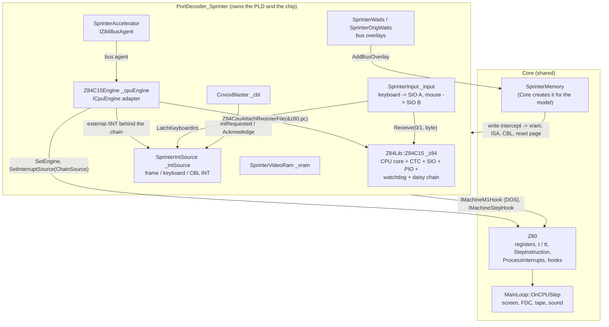
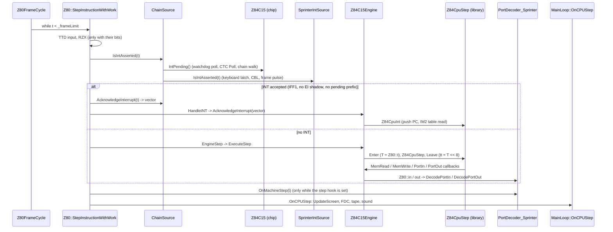
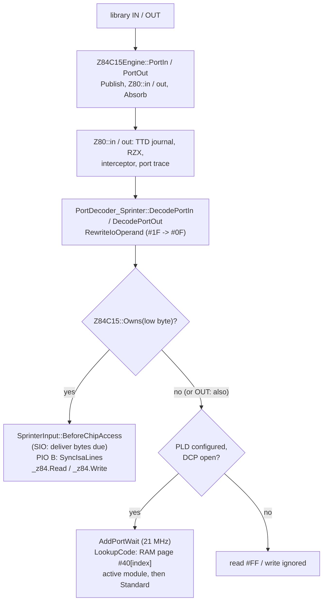

# Sprinter: how the CPU works with its peripherals in the emulator

| | |
|---|---|
| **Date** | 2026-10-09 |
| **Status** | Architecture description of the code as it is, with the idle-cycle fast-forward (section 8.2) |
| **Scope** | The software side: which object owns what, how one instruction step reaches every device, where time comes from, what the Z84C15's on-chip CTC, SIO, PIO and watchdog do on the Sprinter and how a program controls them |
| **Not here** | The board wiring ([peripherals-wiring.md](../../../inprogress/2026-09-28-sprinter/peripherals-wiring.md)), port codes and registers ([hardware-reference.md](../../../inprogress/2026-09-28-sprinter/hardware-reference.md)), the library design ([z84c15-cpu-library/design.md](../../../inprogress/2026-10-01-z84c15-cpu-library/design.md)) |
| **Line numbers** | Every `file:line` in sections 1-7 is relative to the repository root and refers to commit `22e79acfd`; the idle-cycle fast-forward (section 8.2) added lines to several of those files since, the function names stay |

## Contents

1. [Overview: components and ownership](#1-overview-components-and-ownership)
2. [One instruction step, end to end](#2-one-instruction-step-end-to-end)
3. [Memory path](#3-memory-path)
4. [Port path](#4-port-path)
5. [The on-chip peripherals](#5-the-on-chip-peripherals)
6. [The board's own interrupt sources](#6-the-boards-own-interrupt-sources)
7. [Event delivery and timing](#7-event-delivery-and-timing)
8. [Performance notes](#8-performance-notes)
9. [Where the older design documents differ from the code](#9-where-the-older-design-documents-differ-from-the-code)
10. [Glossary and links](#10-glossary-and-links)

## 1. Overview: components and ownership

The Sprinter runs on the shared `Z80` object (registers, frame time, interrupt sampling, hooks), but the
instructions are executed by a separate library: the Zilog Z84C15 (`core/src/3rdparty/z84c15`). The library
also contains the chip's on-chip block: CTC, SIO, PIO, watchdog, wait generator and the interrupt daisy chain.
The Sprinter's port decoder owns the chip and installs it as the CPU's engine.

| Object | Created / owned by | Wired where | Lifetime |
|---|---|---|---|
| `Z84Lib::Z84C15 _z84` (chip and CPU core) | member of `PortDecoder_Sprinter` (`core/src/emulator/ports/models/portdecoder_sprinter.h:374`) | clock and CTC triggers in the decoder constructor (`portdecoder_sprinter.cpp:104-115`) | the decoder's: the on-chip ports exist before the CPU is wired |
| `Z84C15Engine _cpuEngine` | `std::unique_ptr` in the decoder (`portdecoder_sprinter.h:378`), created once the `Z80` exists (`portdecoder_sprinter.cpp:165-172`) | `InstallHooks` installs it at every reset (`portdecoder_sprinter.cpp:605-618`) | the decoder's destructor resets it, which gives the CPU back to the native interpreter (`portdecoder_sprinter.cpp:209`) |
| `SprinterIntSource _intSource` | decoder member (`portdecoder_sprinter.h:368`) | the engine's `external` source (`Install(&_intSource)`, `portdecoder_sprinter.cpp:617`) | decoder |
| `SprinterInput _input` | decoder member (`portdecoder_sprinter.h:376`), references the chip, the INT source and the PLD state | PS/2 sink of the keyboard (`portdecoder_sprinter.cpp:155-156`), a mouse sink (`sprinterinput.cpp:43-44`) | decoder |
| `SprinterAccelerator` | decoder member `_accelerator`; the active module may supply its own (`portdecoder_sprinter.cpp:628-645`) | the engine's bus agent (`SetBusAgent`, `:639`), null while the PLD is not configured | decoder |
| `CovoxBlaster _cbl` | decoder member (`portdecoder_sprinter.h:390`) | INT through `_intSource` (`portdecoder_sprinter.cpp:91`), audio through SoundManager (`:92-93`) | decoder |
| `SprinterWaits`, `SprinterOrigWaits` | decoder (`portdecoder_sprinter.h:380-381`) | bus overlays added / removed by `ApplyTurbo` and `ApplyOrigWaits` (`portdecoder_sprinter.cpp:908-941`) | decoder |
| `SprinterMemory` | `Core` (model memory) | decoder attaches itself (`portdecoder_sprinter.cpp:158-163`); its write intercept is an overlay (`:619-620`) | Core |

`InstallHooks` sets three things on the `Z80` (`portdecoder_sprinter.cpp:605-626`): the engine with the
interrupt source (`Z84C15Engine::Install`, `core/src/emulator/io/z84c15/z84c15engine.cpp:63-69`), the M1 hook
(`z80->machineM1Hook = this`) and the write intercept overlay. The machine step hook is set and cleared on
demand (`RefreshStepHook`, section 7.3).

## 2. One instruction step, end to end

### 2.1 The call chain

The Sprinter always has two bits of the per-step work gate set: `kStepWorkEngine` (`Z80::SetEngine`,
`core/src/emulator/cpu/z80.cpp:961-965`) and `kStepWorkInterruptSource` (`Z80::SetInterruptSource`,
`z80.cpp:934-939`). The gate bits are in `core/src/emulator/emulatorcontext.h:280-289`. So every Sprinter step
leaves the plain path at `z80.cpp:764` and runs `StepInstructionWithWork` (`z80.cpp:795`).

Step by step, with the code:

1. **Frame loop.** `Z80::Z80FrameCycle` calls `StepInstruction` while `t < _frameLimit`
   (`z80.cpp:1006-1028`).
2. **Gate.** One relaxed load of `stepWork`; non-zero goes to `StepInstructionWithWork` (`z80.cpp:764-765`).
3. **Interrupt decision.** `ProcessInterruptsSelect` with `UseSource = true` (`z80.cpp:831`). NMI first: a
   machine with an engine takes it through `ICpuEngine::AcknowledgeNmi` (`z80.cpp:1595-1600`). Then
   `ChainSource::IsIntAsserted(t)` decides the /INT pin (`z80.cpp:1652-1674`;
   `z84c15engine.cpp:239-244`): the chip's daisy chain OR the board's PLD sources. The CPU accepts when
   `iff1` is set, the boundary is not `Z80_BOUNDARY_INT_SHADOW` and no DD/FD prefix is pending (`z80.cpp:1658`).
4. **Acceptance** (the step ends here, no opcode runs): `ChainSource::AcknowledgeInterrupt` returns the vector
   (section 5.6); the TTD vector journal may record or replay it (`z80.cpp:1662-1669`); `HandleINT` tells the bus
   overlays (`onInterruptAcknowledge`) and calls `Z84C15Engine::AcknowledgeInterrupt` (`z80.cpp:1762-1771`),
   which notifies the bus agent and runs `Z84CpuInt` (`z84c15engine.cpp:133-141`).
5. **Instruction.** `Z80::EngineStep` (`z80.cpp:555-585`) runs the instruction-start work (breakpoints and
   traps, `RecordInstructionStart`, call trace) and then `ICpuEngine::ExecuteStep`. The engine calls
   `Enter` (library T = `Z80::t`, boundary pushed when the host changed it), `Z84CpuStep`, `Leave` (`tt`,
   boundary, opcode word, HALT entry) (`z84c15engine.cpp:86-131`).
6. **Library step.** `Step` fetches the opcode with an M1 bus cycle and dispatches
   (`core/src/3rdparty/z84c15/z84step.inc:52-77`). A halted CPU or a pending prefix takes `SlowStep`
   (`z84step.inc:44-50`): `HaltedQuantum` runs one M1 read at PC + 1 through the host, 4 T plus the chip's M1
   waits, and advances R (`z84step.inc:16-24`; `opcodes-callback.cpp:119-125`).
7. **Bus callbacks.** Every memory and port cycle calls back into the engine (section 3 and 4).
8. **Machine step hook.** `OnMachineStep(t)` if the decoder set it (`z80.cpp:860-861`; section 7.3).
9. **Peripherals.** `Z80::OnCPUStep` calls `MainLoop::OnCPUStep` (`z80.cpp:1872-1878`), which runs
   `Screen::UpdateScreen` (only on rendered frames), `WD1793::handleStep`, `Tape::handleStep` and
   `SoundManager::handleStep` (`core/src/emulator/mainloop.cpp:631-654`).

RETI does not go through step 3. The library's `ED 4D` handler first calls the chip's `OnReti` and then the
host's RETI callback (`core/src/3rdparty/z84c15/opcodes-ed.inc:292-298`); the engine forwards that to the
interrupt observer and to `SprinterIntSource::OnReti` (`z84c15engine.cpp:225-233`).

### 2.2 The time model

Four time bases meet in a step. All of them derive from one counter, the CPU's frame position.

| Name | What it counts | Where |
|---|---|---|
| `Z80::t` / `Z80::tt` | CPU clocks since the frame start at the current clock (`tt` = `t << 8` + `t_l`, `rate` = 256) | union `core/src/emulator/cpu/z80.h:31-36`; `rate` set at `z80.cpp:72`, `:630`, `:994` |
| library T (`cpu->t`) | the same CPU clocks inside a step | `Enter` sets it from `Z80::t`, `Publish` / `Absorb` around each callback, `Leave` copies it back (`z84c15engine.cpp:86-119`) |
| base T | 3.5 MHz T-states of the frame: `t / multiplier` | `EmulatorState::CpuToBaseT` (`core/src/emulator/platform.h:1193-1199`); video, PLD INT positions, CBL, keyboard, ISA |
| chip clock | ticks of the 42 MHz crystal since power-on | `PortDecoder_Sprinter::ChipClock` = `t_states * 12 + t * 12 / multiplier` (`portdecoder_sprinter.cpp:862-867`) |

- **Frequency multiplier.** `current_z80_frequency_multiplier` = host speed x `hw_turbo_ratio` (6 at 21 MHz)
  (`z80.cpp:606-607`). The frame limit and the ULA INT window are `BaseToCpuT(config.frame)`
  (`z80.cpp:717-732`; `platform.h:1184-1190`).
- **Frame length.** `config.frame` is 320 x 224 = 71 680 or 312 x 224 = 69 888 base T, chosen by the PLD's
  frame-length latch and applied at a frame start (`core/src/emulator/video/sprinter/screensprinter.cpp:84-99`).
- **Frame end.** `Core::AdjustFrameCounters` subtracts the scaled frame from `Z80::t`
  (`core/src/emulator/cpu/core.cpp:1104-1123`); `MainLoop::OnFrameEnd` adds `config.frame` to
  `EmulatorState::t_states` (`mainloop.cpp:729`). `ChipClock` adds both, so it stays monotonic across frames.
- **Chip clock rate.** One CPU clock lasts `12 / multiplier` chip ticks: `SyncChipClock` calls
  `Z84C15::SetSystemClockPeriod(12, multiplier)` (`portdecoder_sprinter.cpp:869-872`). The CTC's trigger
  inputs are 875 kHz in real time (`kCtcTriggerHz`, `portdecoder_sprinter.h:83`), independent of the CPU clock.
- **Waits.** A device adds wait states with `Z80::AddWaitStates` (`tt += n * rate`, `z80.h:879-884`). Inside a
  library callback the engine takes `tt` back with `Absorb` (`z84c15engine.cpp:116-119`), so the library's
  instruction continues after the wait.

Worked example (320-line frame):

| | 3.5 MHz | 21 MHz |
|---|---|---|
| multiplier | 1 | 6 |
| frame in CPU T (`_frameLimit`) | 71 680 | 430 080 |
| chip ticks per CPU T | 12 | 2 |
| chip ticks per frame | 860 160 | 860 160 |
| CTC timer step, prescaler 16 | 16 CPU T = 192 ticks | 16 CPU T = 32 ticks |
| TRG0-TRG2 edge (875 kHz) | 48 ticks = 4 base T | 48 ticks = 4 base T |
| halted quantum (no waits) | 4 CPU T = 4 base T | 4 CPU T = 0.67 base T |

## 3. Memory path

### 3.1 The three kinds of read

The library tells the host which bus cycle a read is (`Z84CpuAccessKind`, `core/src/3rdparty/z84c15/z84cpu.h:37-55`).
`Z84C15Engine::MemRead` routes them (`z84c15engine.cpp:154-185`):

| Cycle | Engine call | Board logic around it |
|---|---|---|
| M1 opcode fetch (also every halted quantum) | `MemIf->MemoryReadM1(addr)` | `machineM1Hook->BeforeMachineM1` before, `OnMachineM1` after (`z84c15engine.cpp:165-169`); then the bus agent's `OnOpcodeFetch` (`:170-171`) |
| operand byte at PC | `MemIf->MemoryRead(addr, true)` | the bus agent's `OnRead` while it watches data (`:175-177`) |
| data read (also the IM2 table read) | `MemIf->MemoryRead(addr, false)` | same |
| write | `BeforeWrite`, `MemIf->MemoryWrite`, `AfterWrite` | `z84c15engine.cpp:187-201` |

`Publish` sets `Z80::tt` from the library's T before each callback and `Absorb` takes it back after
(`z84c15engine.cpp:111-119`). Inside a callback `Z80::t` is the T after the cycle's 3 T, before the chip's
programmed waits (`z84cpu.h:63-65`; `opcodes-callback.cpp:21-30`).

**The M1 hook: the DOS signal.** `PortDecoder_Sprinter::BeforeMachineM1` follows the PLD's /DOS line: a
fetch from `#4000` up sets `_pld.dos = 1` (DOS off), a fetch from `#3D00-#3DFF` with `#7FFD` bit 4 set clears it
(DOS on); each change remaps the windows (`portdecoder_sprinter.cpp:837-854`). The value enters the port table
index (section 4).

### 3.2 Memory interfaces and overlays

The engine always calls through `Z80::MemIf`. Because the Sprinter installs its write intercept at every reset,
`MemIf` is an overlay interface: the inner read or write runs first, then the overlay
(`core/src/emulator/memory/memory.cpp:233-262`). With two or more overlays installed, `Core` points the interface
at a chain that calls them in install order (`core/src/emulator/memory/hostbusoverlay.h:62-86`).

| Overlay | Installed | Reads | Writes |
|---|---|---|---|
| `SprinterMemory::WriteIntercept` | always (`portdecoder_sprinter.cpp:619-620`) | not observed (`observesReads = false`, `sprintermemory.h:141-150`) | `SprinterMemory::OnWrite` (below) |
| `SprinterWaits` | while the CPU runs at 21 MHz (`portdecoder_sprinter.cpp:908-919`) | waits | waits |
| `SprinterOrigWaits` | ALL_MODE bit 2 = 0, 3.5 MHz, PLD configured (`portdecoder_sprinter.cpp:923-942`) | waits | waits |

`SprinterMemory::MemoryReadFast` overrides the plain read: windows with a read redirect return main RAM at the
graphics video address or run an ISA cycle (`core/src/emulator/memory/sprinter/sprintermemory.cpp:189-224`).

`SprinterMemory::OnWrite` (`sprintermemory.cpp:296-363`) acts after the plain store:

| Window state | Effect |
|---|---|
| PLD loading | the byte is a configuration write (`_decoder->OnConfigurationWrite`, `:301-309`) |
| graphics page `#50-#5F` | the byte goes to main RAM and video RAM at `PORT_Y x 1024 + A9-A0`; bit 3 of the page = `#FF` transparent, bit 2 = video RAM only (`:314-335`) |
| ISA view | an ISA write cycle instead of RAM (`:336-341`) |
| page `#A0` with `#1FFD = #10` | CPU reset request (`:342-344`) |
| page `#40` while the PLD journal is on | counted as a port table write (`:345-347`) |
| page `#FD` | Covox-Blaster ring write when the accelerator copies with the CBL INT on (`:348-350`; `portdecoder_sprinter.cpp:1276-1286`) |
| any RAM window, ALL_MODE bit 0 = 0 | the Spectrum screen shadow into video RAM (`:355-362`) |

### 3.3 Wait states

`MemoryWaitOverlay::Wait` asks the rule with `Z80::AccessStartClock()` (`tt / rate - 3`, the cycle's first T)
and adds the result with `AddWaitStates` (`core/src/emulator/memory/memorywaitoverlay.cpp:5-12`; `z80.h:559`).

- **21 MHz** (`SprinterWaits::Rule`, `core/src/emulator/memory/sprinter/sprinterwaits.h:30-34`): extra clocks =
  `(6 - t mod 6) mod 6 + 6 - taken`, `taken` = 3 for memory, 4 for a port. Example: a RAM read starting at clock
  100: 100 mod 6 = 4, so 2 + 3 = 5 extra clocks; at clock 102: 3. Only windows that show main RAM wait
  (`OnBanksChanged`, `portdecoder_sprinter.cpp:959-969`).
- **ZX "original waits"** (`SprinterOrigWaits::Rule`, `sprinterwaits.h:96-99`): by `(T1 - 2) mod 4` in base T
  the waits are 0, 2, 1, 0. Example: a data read starting at frame T 1 003: (1 003 - 2) mod 4 = 1, so 2 T; at
  T 1 004: 1 T; at 1 005 and 1 006: none. Window 1 always, window 3 while `#7FFD` bit 2 is set (`:102-105`).
- **Chip waits** come from the library's wait generator, after the host's (section 5.4).

### 3.4 The accelerator as the bus agent

`SprinterAccelerator` implements `IZ84BusAgent` (`core/src/emulator/memory/sprinter/sprinteraccelerator.h:70`;
interface `z84c15engine.h:20-38`). It sees every opcode fetch, so it decodes the same-register `LD r,r`
mode selects and RETI from the opcode stream (`sprinteraccelerator.cpp:80`). While a mode is armed
(`watchData`), the engine passes operand, data and write accesses to it; it repeats them through
`SprinterMemory::AcceleratorRead` / `AcceleratorWrite` and charges `(length - 1) x 6` ticks of 42 MHz as waits
(`sprinteraccelerator.cpp:130-147`). The INT acknowledge reaches it through `OnInterruptAcknowledge`
(`z84c15engine.cpp:135-136`); it blocks new operations only with `[SPRINTER] AccelIntSuspend=1`
(`sprinteraccelerator.cpp:85-91`; default 0, `core/src/emulator/config.cpp:404`).

### 3.5 Video RAM writes and the screen

The picture is drawn by catching up to the CPU's time, not per pixel event.

1. **Per step.** `ScreenSprinter::UpdateScreen` draws from the last drawn base T to now
   (`core/src/emulator/video/sprinter/screensprinter.cpp:202-205`, `DrawTo` `:266-300`). It returns at once when
   the base T has not moved (`:284-290`).
2. **Before a video RAM byte changes.** `SprinterVideoRam::Write` calls the before-change listener only when the
   byte differs (`core/src/emulator/video/sprinter/sprintervideoram.h:52-64`). The decoder's listener
   (`portdecoder_sprinter.cpp:97`) calls `ScreenSprinter::CatchUpToWrite`, which draws up to
   `(t - kWriteLandsBeforeEndT) / multiplier` with the old byte (`screensprinter.cpp:207-216`;
   `screensprinter.h:103`).
3. **Border writes.** Code `#C2` draws ahead to `t + 4` (`CatchUpToBorderLatch`, `screensprinter.cpp:218-225`;
   `screensprinter.h:119`).
4. **PLD video latches.** HOLD, RGMOD and `#7FFD` call `CatchUpScreen` before the change
   (`portdecoder_sprinter.cpp:1013-1017`, `:1456`, `:1470`, `:1068`).

## 4. Port path

- **The engine side.** `PortIn` / `PortOut` call `Z80::in` / `Z80::out` (`z84c15engine.cpp:203-218`), so the
  TTD port journal, RZX, the port interceptor and the port trace work as on the native core.
- **On-chip ports.** `Z84C15::Owns` decodes A7-A0 only: `#10-#13` CTC, `#18-#1F` SIO and PIO, `#EE`, `#EF`,
  `#F0`, `#F1`, `#F4` (`core/src/3rdparty/z84c15/z84waits.cpp:33-38`). A read is answered by the chip alone; the
  PLD does not see it (`portdecoder_sprinter.cpp:1140-1148`).
- **Writes to on-chip ports reach the PLD too.** After `_z84.Write`, the configured PLD also looks the port up
  in its table (`portdecoder_sprinter.cpp:1189-1236`), as MAME does. The trace code stays the chip's
  (`kTraceZ84Base + low`, `:1203`, `:1230-1231`).
- **DCP ports.** The index is built from the map (CNF bits 4-3), PN5, /DOS, /WR and nine address bits
  (`portdecoder_sprinter.h:41-45`; `portdecoder_sprinter.cpp:1046-1057`). The byte in RAM page `#40` is the
  internal code; the active configuration module answers first, then Standard (`:1167-1170`, `:1229-1235`).
- **Start-up gate.** After a PLD reset, writes are ignored until the first port read opens the decoder
  (`portdecoder_sprinter.cpp:1149-1157`, `:1211`).
- **Port waits at 21 MHz.** `AddPortWait` applies the same `t mod 6` rule with `taken = 4` from the I/O cycle
  start (`portdecoder_sprinter.cpp:950-957`; `sprinterwaits.h:36-44`). The chip adds no I/O waits for its own
  ports (`z84waits.cpp:73-78`).
- **The `#1F` rewrite.** `IN A,(#1F)` / `OUT (#1F),A` with the operand byte in RAM reach the bus as `#xx0F`
  (`RewriteIoOperand`, `portdecoder_sprinter.cpp:1104-1123`). The rewrite happens before `Owns`, so such an
  access goes to the DCP, not to PIO port B.

What goes where:

| Device | Road | Code that answers |
|---|---|---|
| CTC, SIO, PIO, WCR / MWBR / CSBR / MCR, watchdog, `#F4` | on-chip | `Z84C15::Read` / `Write` (`z84c15.cpp:109-213`) |
| AY, FDC, IDE, CMOS, Covox, CBL, keyboard matrix `#FE`, Kempston mouse view, PLD cells `#C0-#FF` | DCP | `StandardReadCode` / `StandardWriteCode` (`portdecoder_sprinter.cpp:1288-1553`) |
| `IN #FB` / `IN #7B` (fast RAM), `#3C` / `#7C` (ROM), `#5C` | fixed in the PLD before the table | `portdecoder_sprinter.cpp:1158-1163`, `:1213-1226` |
| video RAM, ISA, port table, reset page | memory-mapped | section 3.2 |

## 5. The on-chip peripherals

### 5.1 CTC

**What the board connects.** TRG0, TRG1 and TRG2 are 875 kHz clocks; TRG3 is ZC/TO2 (cascade)
(`portdecoder_sprinter.cpp:111-115`). ZC/TO0 is SIO B's receive clock (section 5.2). Nothing else on the board
uses the CTC: channels 1-3 are free for programs.

**How a program controls it.** A write with bit 0 = 1 is a control word (bit 7 interrupt, 6 counter mode, 5
prescaler 256, 4 rising edge, 3 timer started by a trigger edge, 2 time constant follows, 1 reset); with bit
0 = 0 to channel 0 it is the vector base (bits 7-3). A read returns the down-counter
(`core/src/3rdparty/z84c15/z84c15.h:53-68`; `z84ctc.cpp:281-352`).

**How time is computed (lazy).** A running channel is an anchor plus the count at the anchor: a clock for a
timer, an input edge count for a counter (`z84ctc.cpp:1-8`). Nothing runs per instruction.

- `InputEdges` gives the edges of a clock trigger as `clock x hz / unitsPerSecond` (875 000 / 42 000 000 = 1 / 48
  after reduction), or the cascade source's zero counts (`z84ctc.cpp:73-115`).
- `ZeroCountsAt(ch, now)` returns the ZC/TO pulses up to `now`; `ZeroTime(ch, k)` the clock of pulse `k`
  (`z84ctc.cpp:170-205`).
- A control word, a time constant or a clock speed change folds the channel: it is re-anchored at now with its
  count, zero counts and phase (`Fold`, `z84ctc.cpp:207-224`).
- `_nextDue` is the earliest clock at which a channel with its interrupt enabled reaches its next zero count
  (`UpdateNextDue`, `z84ctc.cpp:226-240`). `Poll` returns after one clock read and one compare until then;
  at or after it, it sets `ip` on the channels whose zero counts grew (`z84ctc.cpp:354-377`).
- `Poll` is called only from `Z84C15::IntPending` (`z84c15.cpp:514`), at every instruction boundary while some
  source can interrupt.

**Who uses which channel.**

| Use | Programming | Result |
|---|---|---|
| SIO B mouse clock (DSS 1.71, per the comment in `sprinterinput.cpp:55-56`) | channel 0 counter, time constant 45 | ZC/TO0 = 875 000 / 45 = 19 444 Hz; SIO B x16 = 1 215 baud, within 5 % of 1 200 (`sprinterinput.cpp:53-66`) |
| frame-rate tick used by demos (`z84c15.h:87-92`) | channel 2 `#57`, 112; channel 3 `#D7`, 160 | ZC/TO2 = 7 812.5 Hz; channel 3 interrupts at 48.828 125 Hz with vector base `#00` answering `#06` |

Worked example: the 48.83 Hz tick lasts 860 160 chip ticks, exactly one 320-line frame (71 680 base T,
20.48 ms). Its phase against the frame INT depends on when the program wrote the time constant, so the two
interrupts drift only if the frame length changes to 312 lines.

### 5.2 SIO

**What it is responsible for on the Sprinter.**

| Channel | Ports | Device | Fed by | When the byte lands |
|---|---|---|---|---|
| A | `#18` data, `#19` control | AT keyboard, raw set 2 scan codes | `Ps2KeyboardStream` byte sink: `sio.Receive(0, byte)` (`sprinterinput.cpp:22-28`) | before an access to `#18` / `#19`, before an ALL_MODE write, and after each step while the step hook runs (section 7) |
| B | `#1A` data, `#1B` control | Microsoft serial mouse, 1 200 baud | `MsSerialMouse` byte sink: `sio.Receive(1, byte)` only while the receive clock is in tune (`sprinterinput.cpp:33-41`) | before an access to `#1A` / `#1B` only (`sprinterinput.cpp:291-307`) |

A mouse byte that arrives while ZC/TO0 x WR4 clock mode is more than 5 % away from 1 200 baud is counted as a
framing error and dropped (`sprinterinput.cpp:53-66`). Transmit (`WriteData`) goes to a sink
(`z84sio.cpp:68-72`); the Sprinter connects none, so bytes the program sends are dropped.

**How a program controls it** (`z84sio.cpp:74-135`):

| Register | Use in the model |
|---|---|
| WR0 | bits 2-0 point at the next register; commands: 3 channel reset (WR2 kept), 4 arm "interrupt on next character", 6 error reset (clears the RR1 overrun latch), 7 return from interrupt (channel A only) |
| WR1 | bits 4-3 receive interrupt mode: 00 none, 01 first character, 10 / 11 every character; bit 2 of channel B: status affects vector |
| WR2 (channel B) | the vector |
| WR3, WR5, WR6, WR7 | stored only; `Receive` does not check the receiver enable (WR3 bit 0) |
| WR4 | stored; bits 7-6 (clock mode) are read by `SprinterInput::MouseReceiverBaud` |
| RR0 | bit 0 a character is waiting, bit 2 transmit buffer empty (always) |
| RR1 | bit 0 all sent (always), bit 5 overrun (latched) |
| RR2 | channel B's WR2, status-modified while WR1B bit 2 is set; both channels read it |

**Receive FIFO and overrun.** Three bytes per channel. A byte that finds the FIFO full overwrites the newest
entry and carries an overrun flag; RR1 bit 5 latches when that entry reaches the top and stays until command 6.
In mode 01 a read does not advance past a flagged character until the error reset (`z84sio.cpp:22-66`;
`z84c15.h:210-222`). `SprinterInput` counts refused keyboard bytes (`KeyboardOverruns`).

**Interrupts.** Receive only; transmit and external / status interrupts are not modeled (`z84c15.h:224-226`).
`RxIp` is "a character is waiting" in modes 10 / 11 and the armed first-character request in mode 01
(`z84sio.cpp:152-162`). The request is not cleared by the acknowledge: it lasts until the FIFO is read
(`ClearIpOnAcknowledge`, `z84c15.cpp:488-496`). Vector: WR2B, or with WR1B bit 2 `(WR2B & #F1) | code << 1`
with code `010` for B receive and `110` for A receive (`z84sio.cpp:164-172`).

**What the firmware does.** BIOS SETUP and DSS poll channel A from their frame INT handler and leave WR1 = 0
(no SIO interrupt; [tdd-accel-sound-input.md](../../../inprogress/2026-09-28-sprinter/tdd-accel-sound-input.md)
§3.3). This matters for the delivery rules: a program that enabled SIO receive interrupts without the PLD's
keyboard INT, or on channel B, would see its interrupt only after it touched the SIO ports, because nothing
else delivers the bytes (`sprinterinput.cpp:309-313` advances the keyboard only; `NeedsStepHook`,
`sprinterinput.h:140`).

Worked example (`z84c15.h:228-231`): `OUT (#19),#00 / #01` writes WR1 = 0; `#03 / #C1` sets WR3. A scan code
`#1C` pushed with `Receive(0, #1C)` makes `IN A,(#19)` return bit 0 = 1; `IN A,(#18)` returns `#1C` and RR0 bit
0 = 0 again.

### 5.3 PIO

Ports `#1C` A data, `#1D` A control, `#1E` B data, `#1F` B control (`z84c15.h:296-310`). Control words: mode
(`%mm..1111`, mode 3 takes a direction byte), interrupt control (`%....0111`, a mask may follow), enable only
(`%....0011`), vector (bit 0 = 0) (`z84pio.cpp:57-101`). Control reads return `#FF` (`z84pio.cpp:103-109`).

- **Port A.** The output latch: printer data and BIOS POST codes (BIOS 3.04 `#0154`: mode 3, all outputs, `#EA`,
  `z84c15.h:308-310`). No input line is driven by the emulator; input lines read `#FF` (`Port::inputs`,
  `z84c15.h:323`).
- **Port B.** Its inputs are the ISA slots' IRQ and DRQ lines: PB0 slot 1 IRQ, PB1 slot 2 IRQ, DRQ bits `#10`,
  `#04` (`core/src/emulator/io/sprinter/isa/sprinterisabus.h:121-122`). `PushIsaLines` hands a change to
  `pio.SetInputs(1, lines)` (`portdecoder_sprinter.cpp:717-747`).
- **Interrupts.** Mode 3 only, on the edge where the AND / OR, high / low condition over the monitored lines
  becomes true (`Evaluate`, `z84pio.cpp:40-55`). The request is latched until the acknowledge.
- **When lines are current.** Before a read of `#1E` or a write of `#1F` (`SyncIsaLines`,
  `portdecoder_sprinter.cpp:1144-1145`, `:1194-1196`), and from the step hook at the cards' next line event while
  the PIO waits for an ISA IRQ (`IsaIrqArmed`, `RescheduleIsaLines`, `:694-709`). The observer
  `IZ84InterruptObserver` lets the ISA report count acknowledges and RETIs of port B (`:771-809`).

### 5.4 System registers and the wait generator

`#EE` selects, `#EF` reads / writes WCR (0), MWBR (1), CSBR (2), MCR (3) (`z84c15.cpp:118-130`, `:159-186`).
WCR and MWBR program the library's wait generator, which adds waits after each of the core's own bus cycles
(`z84waits.cpp:40-86`): memory waits inside the MWBR range, one more per M1 with WCR bit 4, I/O waits by WCR
bits 1-0 (none on on-chip ports), INTA waits by WCR bits 7-5, the RETI extension. For the first 15 M1 cycles
after power-on WCR acts as `#FF` unless written (`z84c15.cpp:62-69`). CSBR / MCR matter only while the PLD loads:
addresses outside CS0 read fast RAM (`sprintermemory.cpp:199-200`, `:305-306`). Details:
[z84c15-cpu-library/design.md](../../../inprogress/2026-10-01-z84c15-cpu-library/design.md) §6.

### 5.5 Watchdog

- WDTMR resets to `#FB`: enable bit 7 set, period `2^(16 + 2n)` system clocks with `n` = bits 6-5 = 3, i.e.
  2^22 = 4 194 304 CPU clocks (`z84c15.h:357`; `WatchdogDeadline`, `z84c15.cpp:217-224`). So it runs from power
  on (`z84c15.cpp:71`).
- WDTCR `#4E` restarts the count; `#B1` disables it, only after WDTMR bit 7 was cleared (`z84c15.cpp:187-206`).
- /WDTOUT is not connected on the Sprinter: the decoder sets no handler (`portdecoder_sprinter.cpp:107-110`;
  `SetWatchdogHandler`, `z84c15.h:404`). `PollWatchdog` returns at once without a handler
  (`z84c15.cpp:233-242`), so `_wdtFired` never sets.

Consequence: a debugger or the automation state (`sprinterdevicestate.cpp:305`, `:488`) shows the watchdog as
"running" with a deadline that is already in the past (about 1.2 s after power-on at 3.5 MHz) when the program
never restarts it. That is the expected state, not a fault.

### 5.6 The daisy chain, IM2 vectors and RETI

**Order.** `#F4` (`system.irqPriority`) selects one of six device orders; values 6 and 7 are taken `& 3`
(`z84c15.cpp:17-19`, `Order` `:429-445`). Inside a device the order is CTC channel 0-3, SIO A then B, PIO A then
B.

| `#F4` | 0 | 1 | 2 | 3 | 4 | 5 |
|---|---|---|---|---|---|---|
| order | CTC, SIO, PIO | SIO, CTC, PIO | CTC, PIO, SIO | PIO, SIO, CTC | PIO, CTC, SIO | SIO, PIO, CTC |

**IntPending** (`z84c15.cpp:498-526`): poll the watchdog; fast exit when no CTC channel or SIO receiver has its
interrupt enabled and no source is pending or under service; `ctc.Poll()`; walk the order: a source under
service blocks everything after it (IEO low), the first pending source wins.

**AcknowledgeInterrupt** (`z84c15.cpp:528-544`): the winner goes under service (IUS), the CTC and PIO clear
their request, and the vector is returned: CTC `base | channel x 2`, SIO as in 5.2, PIO the port's vector byte
(`Vector`, `z84c15.cpp:478-486`).

**RETI.** The library calls `Z84C15::OnReti` on `ED 4D`: the highest-priority source under service leaves service
(`z84c15.cpp:546-558`). SIO WR0 command 7 on channel A does the same for the SIO only (`z84c15.cpp:560-570`).

**With the board's /INT.** `ChainSource` (`z84c15engine.cpp:239-262`):

- the pin is asserted when the chip has a pending source or the PLD asserts its /INT;
- on acknowledge, if the chip has a pending source, the chip supplies the vector and the PLD's
  `AcknowledgeInterrupt` is still called: the PLD presets its INT flip-flop on any INTA, so a frame or keyboard
  INT pending at the same moment is consumed without being served (comment at `z84c15engine.cpp:248-251`);
- otherwise the PLD answers `#FF`.

The PLD's /INT is not gated by on-chip service: the chip's IEI is tied high and IEO goes nowhere on the board
([hardware-reference.md](../../../inprogress/2026-09-28-sprinter/hardware-reference.md) §11), and `ChainSource`
does not consult `AnyUnderService`. A frame INT can therefore interrupt a CTC handler that re-enabled
interrupts.

Worked example: `#F4` = 0, CTC vector base `#00`, channel 3 counting the 48.83 Hz tick, `I` = `#BE`, IM 2.
Channel 3 reaches zero: at the next boundary `IntPending` polls it, `ChainSource` asserts /INT, the CPU accepts,
`AcknowledgeInterrupt` returns `#06`, channel 3 goes under service, the library reads the handler address from
`#BE06`. A frame INT that falls inside that handler (after `EI`) is taken at once with vector `#FF` (table entry
`#BEFF`). The handler's `RETI` ends channel 3's service.

## 6. The board's own interrupt sources

`SprinterIntSource` is the PLD's /INT: one flip-flop for three sources, all answering `#FF`
(`core/src/emulator/video/sprinter/sprinterintsource.h:39`, `AcknowledgeInterrupt` `sprinterintsource.cpp:125-134`).

| Source | Asserted when | Cleared by |
|---|---|---|
| frame INT | the base T is inside a 32-T pulse at one of the positions computed from the mode table (`PulseAt`, `sprinterintsource.cpp:90-113`) | the acknowledge: the pulse id is remembered, one INT per pulse (`_ackedPulse`) |
| keyboard INT | a byte reached SIO A while ALL_MODE bits 0 and 3 are set (`sprinterinput.cpp:25-26`, `:281-284`) | any PLD acknowledge (`_keyboardInt = false`) |
| Covox-Blaster INT | control bit 4 set and the play index crossed a half of the ring (`covoxblaster.h:68-71`, `IntRequested` `:119-126`) | `CovoxBlaster::Acknowledge` from the PLD acknowledge |

**Frame INT positions.** Walk the squares row by row; a square whose Mode0 matches `%1111 11x1` arms, the
first following square without the pattern fires on the eighth line of that square row, 10 T before MAME's
column (`ComputePositions`, `sprinterintsource.cpp:42-72`; rule and worked example `sprinterintsource.h:11-38`:
row 30, squares 40-45 armed, square 46 fires at base T 59 110). The list is rebuilt lazily after a mode table
change, an RGMOD bit 0 change or a frame length change (`Invalidate`, `SetModePage`, `SetFrameLines`;
`portdecoder_sprinter.cpp:89`, `:1388`, `:1472`).

`IsIntAsserted(t)` checks the keyboard latch, then the CBL, then the frame pulse at `t / multiplier`
(`sprinterintsource.cpp:115-123`). It has no side effect except advancing the CBL's play ticks to `t`.

## 7. Event delivery and timing

### 7.1 What is lazy, what is pushed, what is stepped

| Device | Model | Brought up to date |
|---|---|---|
| CTC counts and zero counts | computed from the chip clock | on a port read, a control write, `Poll` at each boundary (`IntPending`) |
| watchdog | computed from the chip clock | `IntPending` and WDTMR / WDTCR writes; no effect on the Sprinter (5.5) |
| frame INT | position list, compared with the base T | every boundary (`IsIntAsserted`) |
| Covox-Blaster | play ticks run to a base T | INT check, port writes, `#FE` read, frame end (`covoxblaster.h:107-132`) |
| screen | catch-up to the base T | every step, before a video RAM change, before a border or PLD latch change (3.5) |
| AY | register file written at `OUT` | `SoundManager::handleStep` every step (`mainloop.cpp:653`) |
| FDC, tape | own state machines on the base clock (`portdecoder_sprinter.cpp:174-180`) | every step (`mainloop.cpp:651-652`) |
| keyboard bytes | queue in base T, one byte per 917 µs (`ps2keyboardstream.h:48`) | SIO A access, ALL_MODE write, the step hook while it runs |
| mouse bytes | packets at 1 200 baud in base T | SIO B access only |
| ISA IRQ / DRQ lines | the cards' own clocks (base T, `IsaNow`) | PIO B access, the step hook at the next line event |

The keyboard and mouse use the base T clock `t_states + t / multiplier` (`sprinterinput.cpp:206-213`).

### 7.2 Host input

A host key travels as a journaled `PcKeyEvent` to `SprinterInput::OnPcKey`, which queues set 2 bytes in
`Ps2KeyboardStream` and asks the decoder to re-evaluate the step hook (`sprinterinput.cpp:215-221`). Each byte
is delivered at its due base T: into SIO A (`Receive`), into the PLD's keyboard INT latch when ALL_MODE bits 0
and 3 are set, and into the PLD's own decoder (`OnWireByte`: Ctrl / Alt / Shift flags, F12 turbo switch,
Ctrl+Alt+Del reset; `sprinterinput.cpp:223-259`).

Worked example (`sprinterinput.h:57-62`): F4 pressed at the BIOS IDE wait. The make code `#0C` lands in SIO A
917 µs (about 3 210 base T) later; SETUP's next frame INT reads RR0 bit 0 = 1, then `#0C` from `#18`.

### 7.3 The machine step hook

`RefreshStepHook` sets the hook only while one of these holds (`portdecoder_sprinter.cpp:647-661`):

| Condition | Why every step | Work in `OnMachineStep` (`:663-685`) |
|---|---|---|
| `_pld.resetPending` | a PLD reset (Ctrl+Alt+Del, code `#2E`, page `#A0`, load end) acts at the next boundary | `PerformPendingReset` (`:497-545`) |
| `configState == Loading` | the loader's frame-count watchdog | in `OnMachineFrameRollover` (`:856-860`) |
| `_input.NeedsStepHook()` | a keyboard byte or typematic repeat is on its way and the keyboard INT is on, or a byte the PLD acts on (`#07`, `#71`) is queued (`sprinterinput.h:140`; `sprinterinput.cpp:261-272`) | `_input.Advance()` |
| `_isaDeadline != UINT64_MAX` | a card's IRQ line will change while the PIO waits for it | `SyncIsaLines` when `IsaNow() >= _isaDeadline` |
| `_isaRescheduleOnStep` | after a TTD restore | recompute the deadline |

With none of them the configured Sprinter has no step hook, and `kStepWorkMachineStep` is clear
(`z80.cpp:950-959`).

### 7.4 Clock switches

- **21 MHz on / off.** CNF/SYS writes with bit 1 = 1 set the turbo request (`portdecoder_sprinter.cpp:1481-1485`);
  F12 on the wire toggles the front-panel switch (`:122-129`). `ApplyTurbo` sets `hw_turbo_ratio` to 6 only when
  both are on, calls `Z80::ApplyHardwareTurboNow`, which rescales `Z80::t` mid-frame so the raster instant is kept
  (`z80.cpp:967-1003`), resyncs the chip clock, and adds or removes `SprinterWaits` (`portdecoder_sprinter.cpp:887-921`).
- **Host speed multiplier.** Queued, applied at the frame start (`Z80::BeginFrame`, `z80.cpp:734-748`); the
  decoder's `OnFrameEnd` resyncs the chip clock at the same boundary (`portdecoder_sprinter.cpp:874-885`).
- The CTC timers and the watchdog keep their counts across a switch: `SetSystemClockPeriod` folds them at the
  switch instant (`z84c15.cpp:92-102`; `z84ctc.cpp:54-65`). The 875 kHz triggers do not change.

## 8. Performance notes

### 8.1 What a step costs

The DNTBLINK demo was profiled on 2026-10-09 (`dont_blink_test1` build on the MAME pack's system disk, 21 MHz, no
sound cards: 5.6 ms of host CPU per 20.48 ms frame). Event counters per frame: 55 000 steps, of which **45 000
(82 %) are idle cycles of a halted CPU** at `#0216` (`EI : HALT`, waiting for CTC 3); 55 000 daisy-chain walks
of ~7.4 sources each; 59 000 screen catch-ups drawing 7 pixels each on average. The structural costs:

| Cost per step | Where |
|---|---|
| the slow path of the work gate on every step (engine and interrupt source bits are always set) | `z80.cpp:764`, `:795-863` |
| `Z84C15::IntPending`: once the program enables a CTC interrupt the fast exit no longer applies, so every boundary reads the chip clock through `std::function` (a 64-bit multiply and divide in `ChipClock`), builds the 8-entry order and walks it | `z84c15.cpp:498-526`; `portdecoder_sprinter.cpp:862-867` |
| a second `IntPending` walk when an INT is accepted | `z84c15engine.cpp:252` |
| `SprinterIntSource::IsIntAsserted`: a division by the multiplier and a linear scan of the position list | `sprinterintsource.cpp:90-123` |
| the halted quantum is a real M1 read: the M1 hook, the overlay interface, the accelerator's `OnOpcodeFetch` | `z84c15engine.cpp:161-172` |
| screen catch-up after every step (`CpuToBaseT` and `DrawTo`'s early return) | `mainloop.cpp:646-649`; `screensprinter.cpp:202-205`, `:284-290` |

At 21 MHz an idle cycle is 4 CPU T plus the turbo's wait to the next 6-clock slot (`SprinterWaits`), about 11 T:
some 39 000 of them in a frame spent in HALT.

### 8.2 Idle cycles in one go (`Z84C15Engine::RunIdleCycles`)

A halted CPU repeats one M1 cycle (the byte after the HALT) until an interrupt is taken. The engine runs these
cycles as arithmetic - T-states and one R tick each - up to the next moment something may happen, with the same
result as one cycle per step: the same pictures, sound, registers (R included), T-states and memory.

**When.** After a step that was an idle cycle (the CPU was halted, no pending prefix), only while:

| Party | Must say | Code |
|---|---|---|
| the driver | it runs a stretch of time, not single steps: `Z80::idleSkipLimit` > 0. Set by the frame loop (`Z80FrameCycle`, up to the frame end), `RunNFrames` (the remaining budget) and `RunTStates` (the target); 0 for single steps, the debugger's stepping and the run-until loops | `z80.h` `IdleSkipScope`; `emulator.cpp` |
| the CPU's per-step work | nothing acts per step: no work-gate job but the engine and the interrupt source, no NMI request, no debug mode, no bus / M1 tracer, TTD probe or coverage, CPU-step analyzer, call trace, opcode profiler, TTD session, TR-DOS session switch or trap at this PC, the tape stopped, the floppy controller asleep or idle with the motor off | `Z80::IdleStepsInert` |
| the board's M1 hook | another M1 at this address changes nothing (the Sprinter: the DOS signal is where it would be set) | `IMachineM1Hook::RepeatM1IsInert` |
| the bus agent | another fetch of this byte leaves every latch (the accelerator's mode, FN, RETI and prefix latches) | `IZ84BusAgent::RepeatFetchIsInert` |
| the chip's wait generator | past the power-on window, no RETI rule pending or armed by this byte | `Z84CpuIdleM1Repeats` |
| the memory | the fast read has no side effect here (not the ISA view) | `Memory::RepeatFetchIsPure` |
| the bus overlays | their only effect is waits that depend on the start clock modulo a period (turbo 6, original waits 4) | `HostBusOverlay::RepeatFetchIsPure`, `MemoryWaitOverlay::PhasePeriod` |

**How.** The idle cycle's length is learned per start phase (`t mod period`) from real cycles - a few per call.
The INT question that `ProcessInterrupts` asks at every boundary is asked for real at the boundaries where an
answer may change, from lower bounds the sources give after a "no":

- the board (`IInterruptSource::NextAssertT`, Sprinter: `SprinterIntSource`): the next frame-INT pulse start of
  the mode-table list, the Covox-Blaster's next request (`CovoxBlaster::NextIntT`: the play tick whose count
  crosses into the next half of the ring), "now" while the keyboard INT is latched;
- the chip (`Z84C15::NextEventClock`): the next zero count of an interrupting CTC channel (`Z84Ctc::NextDue`), the
  watchdog's timeout while a handler is connected. The Sprinter's watchdog has none (its `/WDTOUT` is not wired):
  it reports running with a deadline long past, which must not count. The chip clock is mapped to host T by a
  binary search (`ChipClockAt`; the clock never decreases with T);
- host input (keyboard bytes, ISA lines) arrives through the machine step hook, whose work-gate bit turns the
  fast-forward off while it is armed (section 7.3).

The run stops at the driver's limit, at the frame end, or when an INT is asserted and IFF1 allows it; an INT
asserted under DI is asked again at every boundary, as the step loop would. A switch
(`Z84C15Engine::SetIdleCyclesInOneGo`) turns it off for comparisons.

**Exactness test.** `SprinterIdleCycles_Test` runs two machines, one with the fast-forward off, and compares the
picture, the sound frame, the CPU (R and T included) at every checkpoint and the whole RAM at the end, through
`RunNFrames`, `RunTStates` chunks ending inside idle stretches and `MainLoop`'s frame: a CTC-driven `EI : HALT`
loop at 21 MHz (no disk), and DNTBLINK with the shipped sound cards (with `UNREAL_SPRINTER_HDD`).

**Measured** (2026-10-09, DNTBLINK `dont_blink_test1`, 1 500 frames after the start, host CPU per frame, the same
build with the fast-forward off / on, rounds interleaved in both orders, load 24-31):

| Sound cards | Off | On | Speed-up |
|---|---|---|---|
| none | 5.55-5.68 ms | 2.41-2.43 ms | 2.3x |
| shipped (AY, NeoGS) | 6.54-6.61 ms | 3.15 ms | 2.1x |

About 38 800 idle cycles a frame run as arithmetic. The other machines run on the native interpreter and gain
only a per-frame scope and a per-step store in `RunNFrames` / `RunTStates`. `BM_HostFrame_{48K,Pentagon,Scorpion}_
{Fast,Debug}`, A = `22e79acfd`, B = the change, rounds A B A B A B B A B A, load 16-25: mean paired difference
-1.1 % to -0.2 %, minimums -0.7 % to 0.0 % - within noise, no cost.

### 8.3 The INT question from a kept "no" (`ChainSource::IsIntAsserted`)

`ProcessInterrupts` asks the interrupt source at every instruction boundary; on the Sprinter that is the chip's
daisy chain (with a CTC interrupt enabled: the clock read, the 8-entry order, the walk) and the PLD's sources (the
pulse list, the Covox-Blaster). After a "no" from both, the engine keeps it for the boundaries before the next
moment a source may assert (`NextCheckT`, the same lower bounds as section 8.2), while nothing it depends on
changed. A change is not tracked by calls at the places that make it but by counts inside the sources:

| Count | Bumped by | Code |
|---|---|---|
| `Z84C15::StateVersion` | every register access of the CTC, SIO, PIO and system block, `Receive`, the PIO's inputs, mutable access to a sub-device's state, the acknowledge, RETI, a state load, a watchdog timeout | `Z84Ctc` / `Z84Sio` / `Z84Pio::Version`, `z84c15.h` |
| `IInterruptSource::changeCount` (Sprinter: `SprinterIntSource`) | the keyboard INT latch, the acknowledge, the mode page, the frame height, a mode-table INT byte, a reset or restore; the Covox-Blaster's control and data writes, acknowledge, frame end and mutable access (`CovoxBlaster::SetChangeCounter` points them at the same count) | `sprinterintsource.*`, `covoxblaster.*` |

The kept answer also holds the frame and the clock multiplier. The check is a few loads and compares, no call:
the counts are plain fields. A source without a count (`countsChanges` false) is asked at every boundary, as before.
`SetIntAnswerKept` turns it off for comparisons.

One laziness had to go with it: `CovoxBlaster::Acknowledge` returned early when no request was pending, without
reaching `t` first. Asked at every boundary the source was always caught up; answered from a kept "no" it was not,
and an acknowledge of a CTC interrupt (the PLD presets its INT flip-flop on any acknowledge) missed a CBL request
raised by a play tick just before - the request then came as an extra interrupt later. It now reaches `t` first
(also more exact in the one corner the old code had: a keyboard INT latched at a CBL tick).

**Exactness:** `SprinterIdleCycles_Test` compares both fast paths on against both off: the halted CTC loop, a busy
loop (`INC (HL) : JR`, running code with the CTC interrupt), and DNTBLINK with the shipped sound cards.

**Measured** (2026-10-09, the idle-cycle fast-forward on in both, the kept answer off / on, host CPU per frame,
rounds alternating, load 9-14): 94-99.9 % of the boundaries answered from the kept "no".

| Demo | Off | On | |
|---|---|---|---|
| DNTBLINK (`dont_blink_test1`) | 1.99-2.01 ms | 1.87-1.91 ms | -5.5 % |
| ROTOZOOM (busy, no CTC interrupt) | 3.62-3.65 ms | 3.44 ms | -5.5 % |
| PLASMA2 | 0.90-0.94 ms | 0.88 ms | -4 % |
| BADAPPLE | 1.65 ms | 1.44-1.51 ms | -10 % |

A first version read the counts through calls (an out-of-line `StateVersion`, a virtual for the board): ROTOZOOM
and PLASMA2 got 3-5 % slower - their chip has no interrupt enabled, so the plain question is already cheap.

### 8.4 The screen drawn on its own events (`Screen::CatchesUpOnEvents`)

`MainLoop::OnCPUStep` drew the screen after every step: on the Sprinter `DrawTo` the step's few pixels, with the
inputs rebuilt each time (59 000 calls a frame on DNTBLINK, 7 pixels each). Every input of the Sprinter's picture
already has a catch-up that draws the beam up to the moment before it changes (section 3.5): the video RAM's
before-change listener (palette and mode table included), `CatchUpToBorderLatch`, the decoder's `CatchUpScreen` at
HOLD, RGMOD and `#7FFD` bit 3. So `ScreenSprinter::CatchesUpOnEvents` says so, and MainLoop - which reads it at
the frame start next to the turbo render decimation - draws such a screen only on the frame's last step (the
tail); a classic screen keeps the per-step call, behind the same one flag test as before. Where something looks
mid-frame the picture is drawn up to the beam too: at the end of a direct run (`DirectStepScope`) and when the
machine parks on a pause (`WaitWhilePaused`). Not while a configuration's beam-ordered picture runs (Game: its
state advances with every catch-up). `SetCatchUpOnEvents` turns it off for comparisons.

**Exactness:** `SprinterIdleCycles_Test` and `SprinterFastPathsDemo_Test` (DNTBLINK, ROTOZOOM, PLASMA2, BADAPPLE
with the shipped sound cards) compare all three fast paths on against all off; the pictures are equal at every
checkpoint.

**Measured** (2026-10-09, the other two fast paths on in both, host CPU per frame, rounds alternating, load 9-14):

| Demo | Per step | On events | |
|---|---|---|---|
| DNTBLINK | 1.85-1.88 ms | 1.55-1.56 ms | -17 % |
| ROTOZOOM | 3.38-3.41 ms | 2.78-2.83 ms | -17 % |
| PLASMA2 | 0.87-0.89 ms | 0.81 ms | -8 % |
| BADAPPLE | 1.40-1.43 ms | 1.21 ms | -15 % |

The per-step call for the classic screens stays one flag test (`MainLoop::_stepScreen` replaces `_renderThisFrame`
there): `BM_HostFrame_{48K,Pentagon,Scorpion}_{Fast,Debug}`, A = `cfc87408c`, B = the change, rounds A B A B A B
B A B A, load 10-14: mean paired difference -1.0 % to +0.1 %, within noise.

The first prototype drew the tail in `MainLoop::OnFrameEnd`, after the frame's T had been rebased: `DrawTo` took
the small T for a step back and the tail was lost - the frame's last step is the place.

### 8.5 The renderer by square segments (`SprinterVideoRenderer::DrawSpan`)

The span loop asked the per-pixel rules for every pixel: `GraphicsPen` worked out the source address again,
`SymbolPen` read the attribute and the font byte again. It now goes by square segments: a graphics segment works
out its source address once and steps it (`(line x 1024 + column + (sub >> shift)) & mask`), a symbol unit - the
square, or one 8-pixel half of a 640 square, whose right half takes its bytes from Line2 - reads its Mode0, the
attribute and the font byte once; the font latch is checked per pixel only inside a unit it covers. Plane B (ZX
DLSS) stays per pixel. `PenAt`, `GraphicsPen` and `SymbolPen` keep the rules for one pixel (the debugger, tests).

**Exactness:** `SprinterVideoRenderer_Test` draws random video RAM (every square kind, low-res, 640 halves with
their own Line2, Spectrum cells) with random inputs (mode and text page, border, flash, HOLD, 320 / 312 lines, a
font latch) in random span cuts, with and without plane B, against the per-pixel rules: every pixel equal.

**Measured** (2026-10-09): `BM_SprinterRender_Logo` (the BIOS 3.04 logo frame, 736 x 288 in one go), A =
`cfc87408c`, B = the change, A B A B B A, load 5-8: 549-558 us -> 261-263 us (2.1x). Demo frames with all the
fast paths: DNTBLINK 1.55 -> 1.36-1.39 ms, ROTOZOOM 2.80 -> 2.54, PLASMA2 0.81 -> 0.62-0.63, BADAPPLE 1.21 -> 1.04
(after / before runs of the same session, load 6-14).

### 8.6 The per-step checks every machine pays

The analyzer-subscriber check in `RunInstructionStartHooks` went through an out-of-line
`DebugManager::GetAnalyzerManager`; `WD1793::handleStep` and `Tape::handleStep` were calls that return at once
while the controller sleeps or the tape is stopped. All three are inline tests now (`9715951d2`):
`BM_HostFrame_48K_*` -1.4 % in every round, the other classic frames and the Sprinter logo frame -0.1 % to -1.1 %.

### 8.7 The sound cards

Profile of DNTBLINK with the shipped sound cards (2026-10-09, 3.3 ms per frame under the profiler): the NeoGS
12.6 %, the AY slot 8.3 %, the decimators ~3 %.

- **NeoGS: idle sleep.** The card's CPU is not halted. The firmware polls for a host command in a
  six-instruction loop with interrupts disabled: `#026E IN A,(#04) : RRCA : JR C,#0295 : LD A,(#4084) : OR A :
  JR Z,#026E`. That loop is nearly all of the card's steps.
  - A first look judged an exact fast-forward not worth it. The idea was to wake at every card event: a DAC
    side every 1 600 ticks, the timer every 3 200, against an iteration of 250-500 ticks.
  - The events need no wake-up. The timer strobe and the DAC sides change nothing the loop reads, so they run
    inside the sleep at the instruction boundary the loop would have reached them on.
  - `GSCardRunner` now sleeps through the loop until the host's access, the frame end or a DMA event, then
    steps the last partial iteration for real. The design is in `neogs-tdd.md` §5.3.
  - Result: 99.6 % of the card's steps slept, all exact (`SoundChip_NeoGS_IdleSleep`,
    `SprinterFastPathsDemo_Test`). DNTBLINK with the shipped sound went from 2.22 to 1.73 ms per frame (-22 %).
- **AY.** The cost is the HQ rendering of the samples (generator ticks and the FIR decimators), not the per-step
  call. The slot renders its second chip in single-AY mode too; it is not silent at zero registers (volume 0 is
  level 1, a period-0 tone and the noise toggle), so dropping it changes the sound slightly. Measured without it:
  2.34-2.37 -> 2.26-2.31 ms per frame (-2 to -4 %) - not worth a change of the output.

### 8.8 The memory bus in one call (`IZ84FastBus`, `SprinterMemory::FusedRead` / `FusedWrite`)

Every CPU memory access went through the memory interface: a member-function pointer to
`Memory::MemoryReadOverlay[M1]`, the virtual `SprinterMemory::MemoryReadFast` (the bank read and the redirect
test), then `HostBusOverlayChain` calling each overlay virtually - the write intercept on writes, the turbo or
the original waits (`MemoryWaitOverlay::Wait`, the virtual `ExtraClocks`). The engine now takes a board's fused
bus (`Z84C15Engine::SetFastBus`) for each access while the board says the memory configuration is one it
reproduces exactly: `SprinterMemory::FusedBusMatches` accepts the plain memory interface with the installed
overlays being its own in their install order - the write intercept, then the turbo or the original waits, each
over the whole address space - and nothing else (a card's ZX-DMA overlay, the debug interface, contention: the
memory interface as before). `FusedRead` / `FusedWrite` do the same steps in the same order (the read, the
redirects, the wait by the overlay's rule; the store, the intercept, the wait), in one call. The engine asks
again whenever `Core::GetMemoryInterfaceGeneration` moves (`SelectMemoryInterface` bumps it: an overlay added
or removed, debug mode). `SetFastBusOn` turns it off for comparisons.

**Exactness:** the two-machine tests (`SprinterIdleCycles_Test`, `SprinterFastPathsDemo_Test`) switch it with the
other fast paths: equal.

**Measured** (2026-10-09, all other fast paths on, the fused bus off / on alternating, load 28-39): DNTBLINK
1.43-1.45 -> 1.28-1.29 ms per frame (-10.5 %), ROTOZOOM 2.70 -> 2.43 (-10 %), PLASMA2 0.66 -> 0.62 (-5.5 %),
BADAPPLE 1.10-1.12 -> 0.98-0.99 (-11 %). The other machines keep their memory interface; they gain only the
generation counter in `SelectMemoryInterface` (no per-access or per-step change).

### 8.9 The accelerator's quiet opcode fetches skipped (`IZ84BusAgent::fetchQuiet`, `fetchMatters`)

The engine called the bus agent's `OnOpcodeFetch` (virtual) on every M1. While no latch a fetch reads is set - no
mode, no FN, no prefix, ED or RETI latch (`SprinterAccelerator::RefreshFetchQuiet`) - a fetch changes nothing
unless its opcode is a same-register LD r,r or HALT (ACC_MODE), an ALU opcode (FN_ACC) or a prefix: the agent's
256-entry `fetchMatters` table. The engine skips the call for the others. The agent sets `fetchQuiet` after each
fetch, a reset and a disable; mutable access to its state (`State()`, a TTD restore) clears it until the next fetch.
`SetFetchFilterOn` turns it off for comparisons. `SprinterAccelerator_Test.QuietFetch_OutsideTheTableChangesNothing`
fetches every opcode outside the table from the quiet state (accelerator on and off, ACC_BLK set or not): not a
byte of the state changes; the two-machine tests switch it with the other fast paths.

**Measured** (2026-10-09, alternating, load 26-57): ROTOZOOM 2.38 -> 2.27-2.29 ms per frame (-4.5 %), DNTBLINK
1.27 -> 1.25 (-1 %), PLASMA2 and BADAPPLE within noise (their accelerator is often in a mode, or the ALU opcodes
set FN).

### 8.10 What remains

The instruction itself (`Z84CpuStep`), the engine's per-access glue (`Publish` / `Absorb`) and the write
intercept's video RAM path with its screen catch-ups.
General rules for such changes: [performance-guidelines.md](../../../guidelines/performance-guidelines.md).

## 9. Where the older design documents differ from the code

The code wins for this document. The older documents are not changed here.

| Document | Says | Code |
|---|---|---|
| [peripherals-wiring.md](../../../inprogress/2026-09-28-sprinter/peripherals-wiring.md) §5 (lines 213, 226) | the keyboard INT needs ALL_MODE bit 0 | bits 0 and 3 (`sprinterinput.cpp:281-284`); hardware-reference §13 and tdd-video §5 agree with the code |
| [tdd-accel-sound-input.md](../../../inprogress/2026-09-28-sprinter/tdd-accel-sound-input.md) status (line 6), §1.3 (line 59) | accelerator INT suspend is a config option, default on | default off: `config.cpp:404`, `platform.h:866`; `sprinteraccelerator.h:63` says "default 0 since S6" |
| same, §1.3 (line 64) | unblocked through the interrupt source's `OnReti()` | RETI decoded from the opcode stream (`sprinteraccelerator.cpp:80`); §1.4 of the same document already says so |
| same, §4 and §5.3 (lines 291-340) | one M1 hook does DOS, accelerator control and the `#1F` operand rewrite, the rewrite in `SprinterMemory::MemoryRead` | the M1 hook does only DOS (`portdecoder_sprinter.cpp:837-854`); the accelerator is the engine's bus agent; the rewrite is done at the I/O cycle (`portdecoder_sprinter.cpp:1104-1123`) |
| same, §5 table (line 308) | SIO: "receive and special condition interrupts"; transmit to a sink for keyboard commands and mouse power | receive interrupts only (`z84c15.h:224-226`; `z84sio.cpp:164-172` has only the receive vector codes); no transmit sink is connected on the Sprinter |
| same, §5 table (line 309) | CTC ZC/TO outputs as callbacks | no callbacks; consumers read `ZeroCounts` / `OutputHz` lazily (`z84c15.h:153-160`; `sprinterinput.cpp:58`) |
| same, §5 table (line 310) | PIO port B inputs read ISA IRQ / DRQ = inactive | driven from the ISA slots (`portdecoder_sprinter.cpp:717-747`) |
| same, §5 table (line 311) | watchdog logged if enabled | no handler, nothing logged (`portdecoder_sprinter.cpp:107-110`; `z84c15.cpp:235`) |
| [technical-design.md](../../../inprogress/2026-09-28-sprinter/technical-design.md) §3 (line 69) | a mid-frame 21 MHz request takes effect at the next frame boundary | applied at once by `Z80::ApplyHardwareTurboNow` (`portdecoder_sprinter.cpp:898-903`; `z80.cpp:967-1003`) |
| [high-level-design.md](../../../inprogress/2026-09-28-sprinter/high-level-design.md) (lines 18, 24-28, 102) | `Z84Sio` / `Z84Ctc` / `Z84Pio` in `core/src/emulator/io/z84c15/`, beside the existing Z80 core | in the library `core/src/3rdparty/z84c15/`, which also executes the instructions; `io/z84c15/` holds only `Z84C15Engine` |
| [z84c15-cpu-library/design.md](../../../inprogress/2026-10-01-z84c15-cpu-library/design.md) §4 (line 164) | the first M1 callback runs the instruction-start observers | `Z80::EngineStep` runs them before `ExecuteStep` (`z80.cpp:555-564`); `MemRead` does not |
| same, §4 (line 169) | the chip's vector when an on-chip source wins, else the external source's | also calls the external source's `AcknowledgeInterrupt` when the chip wins (`z84c15engine.cpp:252-259`) |
| [hardware-reference.md](../../../inprogress/2026-09-28-sprinter/hardware-reference.md) §2 | "the INT acknowledge reads `#FF`" | true for the PLD sources only; on-chip sources supply their own vectors (`z84c15.cpp:478-486`) |

Two smaller points: the comment in `sprinterwaits.h:81` names `PortDecoder_Sprinter::ApplyWaits`, the function
is `ApplyOrigWaits`. The mouse setup is described two ways: peripherals-wiring.md §6 (line 237) says CTC 0 =
`#55` with time constant 45 (decimal), tdd-accel-sound-input.md §5 (line 309) cites MAN §9.1 as `#85`, `#45`;
the code comment (`sprinterinput.cpp:56`) uses 875 kHz / 45 / 16. Not resolved here.

## 10. Glossary and links

| Term | Meaning |
|---|---|
| **engine** | an `ICpuEngine` that executes instructions for a machine instead of the native interpreter (`z80.h:384`) |
| **chip** | `Z84Lib::Z84C15`: the CPU core plus the on-chip block |
| **ChainSource** | the engine's `IInterruptSource`: chip daisy chain first, the PLD's /INT behind it |
| **bus agent** | `IZ84BusAgent`: board logic that sees every bus cycle with its kind (the accelerator) |
| **bus overlay** | a `HostBusOverlay` the memory interface calls after the normal access (waits, write intercept) |
| **base T** | a 3.5 MHz T-state of the frame; video, PLD INT, keyboard, CBL and ISA run on it |
| **chip clock** | 42 MHz crystal ticks since power-on; the CTC and the watchdog run on it |
| **step hook** | `IMachineStepHook`: decoder work after every step, set only while needed |
| **work gate** | `EmulatorContext::stepWork`: one word whose bits send the step to the slow path |
| **IP / IUS** | interrupt pending / under service, per daisy-chain source |
| **DCP** | the PLD's port table in RAM page `#40` |
| **PLD** | the Sprinter's ACEX FPGA (memory manager, DCP, video, accelerator, INT) |

Related documents:

- [peripherals-wiring.md](../../../inprogress/2026-09-28-sprinter/peripherals-wiring.md): the board, what is wired to what
- [hardware-reference.md](../../../inprogress/2026-09-28-sprinter/hardware-reference.md): ports, codes, registers, sources
- [high-level-design.md](../../../inprogress/2026-09-28-sprinter/high-level-design.md),
  [technical-design.md](../../../inprogress/2026-09-28-sprinter/technical-design.md): the Sprinter design and the shared hooks
- [tdd-ports-memory.md](../../../inprogress/2026-09-28-sprinter/tdd-ports-memory.md): port decoder, PLD state, windows
- [tdd-video.md](../../../inprogress/2026-09-28-sprinter/tdd-video.md): renderer, mode table, INT source
- [tdd-accel-sound-input.md](../../../inprogress/2026-09-28-sprinter/tdd-accel-sound-input.md): accelerator, Covox-Blaster, keyboard, mouse
- [z84c15-cpu-library/design.md](../../../inprogress/2026-10-01-z84c15-cpu-library/design.md): the library and the engine seam
- [performance-guidelines.md](../../../guidelines/performance-guidelines.md): hot paths, the work gate, A/B measurement
