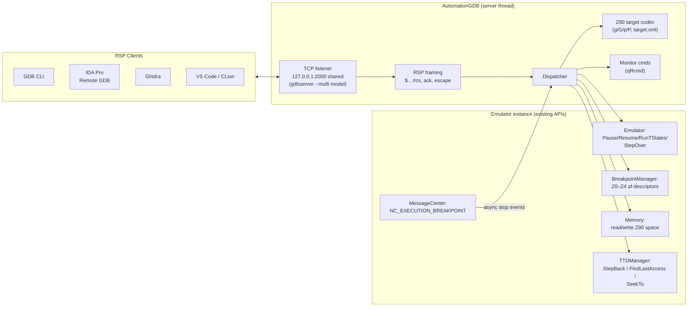
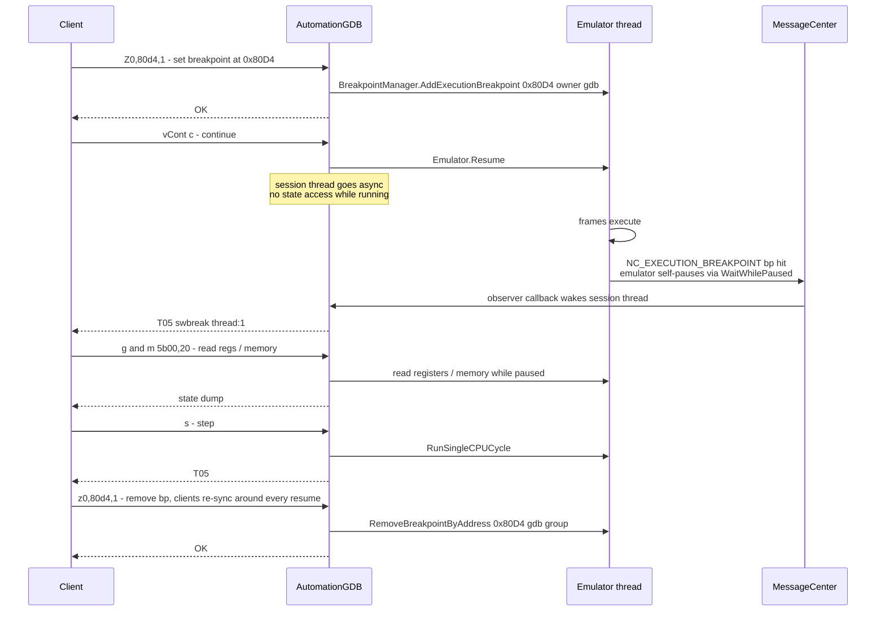
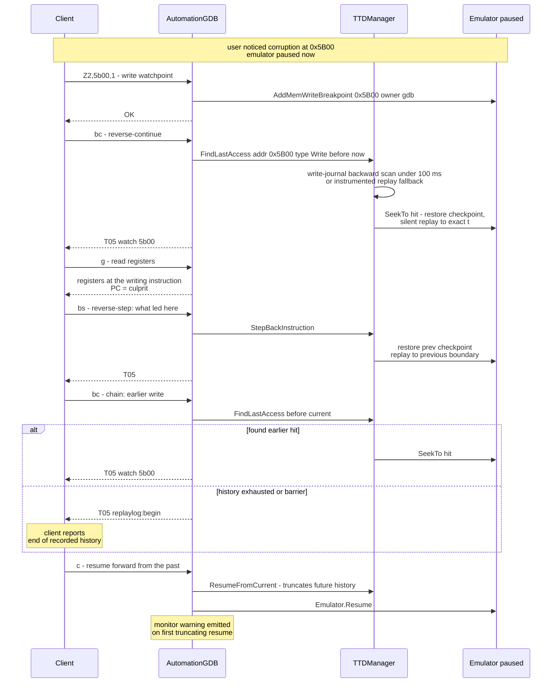

# GDB Remote Serial Protocol with Reverse Debugging — Technical Design Document

| | |
|---|---|
| **Status** | Draft for review |
| **Version** | 1.0 |
| **Last updated** | 2026-07-19 |
| **Scope** | `core/automation/` — new GDB transport |
| **Depends on** | [time-travel-debugging-tdd.md](./time-travel-debugging-tdd.md) (TTDManager: seek, step-back, reverse search); existing `BreakpointManager`, `Emulator` control API |

---

## 1. Overview

Expose the emulator as a **GDB Remote Serial Protocol (RSP) target** so third-party frontends — GDB CLI, IDA Pro (Remote GDB debugger), Ghidra, VS Code / CLion — can debug Z80 code running in the emulator, including **reverse execution** (`reverse-step`, `reverse-continue`) backed by the TTD engine.

The value proposition: users keep their reversing environment (IDA/Ghidra databases, symbols, decompiler) and gain live + time-travel debugging against a cycle-accurate emulator, without us building those UIs.

### 1.1 Goals

- Standard RSP over TCP: registers, memory, breakpoints/watchpoints, step/continue, stop replies.
- Reverse packets `bs`/`bc` mapped onto `TTDManager` (graceful degradation to forward-only when TTD is off).
- Z80 target description XML so generic clients decode registers correctly.
- Multi-instance aware (one server per emulator instance).
- Monitor commands (`qRcmd`) for emulator-specific operations that RSP cannot express (bank mapping, TTD status, port I/O).

### 1.2 Non-Goals

- Anything outside the Z80 / ZX Spectrum clone family. The stub is Z80-only by scope; clone differences are handled as *peripheral/memory-model variation*, not as CPU-architecture variation (Section 4.6).
- GDB *client* functionality, ELF/DWARF loading, symbol handling (client-side concerns).
- Non-TCP transports (serial/pipe).
- Full `vCont` thread machinery beyond the single-thread minimum (one Z80 = one thread; secondary sound-card CPUs like General Sound's Z80, if ever exposed, would be a second *thread* of the same architecture — explicitly deferred).
- **Full RSP multiprocess** (simultaneous control of several instances over *one* connection, pid-qualified thread ids in every packet). We support the `vAttach`-based *selection* subset (Section 6.1) — one instance per connection at a time; users who want two instances side-by-side open two connections (`add-inferior` + second `target extended-remote` in GDB).

---

## 2. Placement: an Automation Transport

**Decision: yes — the GDB server is a transport of the automation library**, structurally identical to the existing ones.

`core/automation/` already hosts a singleton `Automation` that owns optional transports behind compile-time gates: `AutomationLua`, `AutomationPython`, `AutomationWebAPI`, `AutomationCLI` (`ENABLE_*_AUTOMATION`). The GDB server becomes the fifth:

```
core/automation/
    gdb/
        automation-gdb.h/.cpp     // Transport lifecycle (start/stop, port config),
                                  //  owned by Automation singleton, ENABLE_GDB_AUTOMATION
        gdbserver.h/.cpp          // TCP listener + per-client session
        gdbpacket.h/.cpp          // RSP framing: $data#cs, ack/no-ack, RLE, escaping
        gdbdispatcher.h/.cpp      // Packet → handler routing
        gdbtarget_z80.h/.cpp      // Z80 register layout, target.xml, encode/decode 'g'/'G'/'p'/'P'
        gdbmonitor.h/.cpp         // qRcmd ("monitor ...") command handlers
```

Rationale:

- Same lifecycle needs as WebAPI: background listener thread, started with automation, stopped before emulator teardown, config-driven port.
- Same dependency direction: transports talk to `Emulator`/`EmulatorContext` public APIs only. The GDB stub is *thin protocol adaptation*, not new debugger logic — everything it exposes already exists on `Emulator`, `BreakpointManager`, `Memory`, `TTDManager`.
- CLI/WebAPI conventions for multi-instance addressing carry over (Section 6).

Rejected alternative — putting the stub in `core/src/debugger/`: the debugger core should stay transport-agnostic; RSP is wire protocol, which is exactly what `automation/` exists for.

---

## 3. Architecture



### 3.1 Threading & Run Control

The RSP session thread never touches emulator state while the emulator is running. The protocol maps naturally onto the existing pause discipline:

| RSP state | Emulator state | Server behavior |
|---|---|---|
| Client issues `c`/`s`/`bs`/`bc` | Running (or executing a TTD operation) | Server goes *async*: no state access until stop |
| Stop event (breakpoint hit, step complete, TTD op done) | Paused | Server sends stop-reply (`T05…`), accepts state queries |
| State queries (`g`, `m`, `Z`, …) | Paused (enforced) | Executed inline on session thread via public APIs |

- **Continue (`c`)** → `Emulator::Resume()`. The server subscribes to `NC_EXECUTION_BREAKPOINT` (MessageCenter) — when a breakpoint pauses the emulator, the observer wakes the session thread to emit the stop-reply — and to `NC_EMULATOR_STATE_CHANGE` for externally-initiated pauses per §3.3 (both instance-filtered per §6.3). Ctrl-C from the client (RSP interrupt `0x03`) → `Emulator::Pause()` → `T02` (SIGINT).
- **Step (`s`)** → `Emulator::RunSingleCPUCycle` semantics (existing single-instruction step), then `T05`.
- **Breakpoint sync:** GDB clients typically remove and re-insert all breakpoints around every resume. `Z`/`z` handlers therefore must be cheap and idempotent; they map onto `BreakpointManager::AddExecutionBreakpoint/AddMemWrite…/Remove…ByAddress` with a GDB-owned group (`owner="gdb"`), keeping them distinct from user breakpoints in the Qt UI.

### 3.2 Reverse Execution Mapping

| RSP packet | TTD operation | Stop reply |
|---|---|---|
| `bs` (reverse step) | `TTDManager::StepBackInstruction()` | `T05` with `replaylog:begin` if at session start |
| `bc` (reverse continue), **write/read/access watchpoints armed** | `FindLastAccess(addr,type)` over armed set; seek to most recent hit across all of them | `T05watch:ADDR;` (exact syntax GDB expects for watchpoint stops) |
| `bc`, **execution breakpoints armed** | `FindLastAccess(addr, Execute)` per bp; seek to most recent | `T05` (breakpoint stop) |
| `bc`, nothing armed | Seek to session start | `T05` + `replaylog:begin` |

Notes:

- GDB's contract for `bc` is "run backward until any breakpoint/watchpoint would have fired" — our reverse-search engine answers this *exactly*, and typically in <100 ms via the write journal (parent TDD §9.3) instead of actually executing backward.
- The `replaylog:begin` stop-reason (GDB's standard way to say "history exhausted") maps to hitting the session start or an **external-event barrier** (parent TDD §5.1). Barriers also annotate `qRcmd ttd status` output so the user can see *why* history ends.
- When TTD is disabled: `qSupported` simply omits `ReverseStep+;ReverseContinue+`, and clients grey out reverse controls — graceful degradation for free.
- While detached in history, forward `s`/`c` follow the TTD semantics (replayed forward; `c` past the end of history transitions to live execution with the truncation rule of parent TDD §8.3 — a `monitor` warning is emitted the first time).
- **Forward-only sessions:** users who only want live debugging should simply leave `timetravel` off — the stub omits the reverse capabilities and pays zero TTD overhead. There is deliberately **no lazy auto-arm** ("start capturing on first `bs`"): reverse debugging answers questions about the *past*, and a lazily-armed session has none — the first `bc` would return `replaylog:begin` instantly and look broken. A user who anticipates needing reverse mid-session arms it explicitly with `monitor ttd start` (history begins at that moment, stated in the reply).

### 3.3 Run-Control Ownership (Multiple Control Surfaces)

GDB is not alone: WebAPI, Lua, Python, CLI, and the Qt UI can all issue `Pause/Resume/Step/Seek` on the same instance. For most surfaces last-writer-wins is tolerable, but RSP makes it untenable in one specific direction: **all-stop RSP has no "target started running" notification.** If GDB holds the target paused and another surface resumes it, there is no legal packet to tell the client — its world-model is silently wrong and its next `g`/`m` reads state in motion.

Therefore the stub introduces a per-instance advisory **run-control claim**:

| Event | Policy |
|---|---|
| GDB client attaches to an instance | Session takes the run-control claim for that instance |
| Another surface calls `Pause` while claimed | **Allowed** — an external stop is expressible: the session emits a stop-reply (`T05`, detail via `monitor laststop`). The session learns of it via `NC_EMULATOR_STATE_CHANGE` (already broadcast by `Emulator::Pause`), instance-filtered per §6.3 |
| Another surface calls `Resume`/`Step`/`Seek`/state-write while claimed **and the target is GDB-paused** | **Refused** with "busy: GDB session holds run control on instance N" (surfaced in that surface's own error channel). **Reset and media loads count as state-writes** for claim purposes — this is what makes the §3.4 reset/load rows reachable only when the target is not GDB-paused |
| Another surface calls `Resume` while claimed and the target is running (GDB issued `c`) | Redundant no-op — allowed. (`Step`/`Seek` while running are *not* no-ops: their **implicit pause succeeds** and surfaces to the client as the external-pause row above via `NC_EMULATOR_STATE_CHANGE`; the step/seek operation itself is **then refused** as a state-write under claim — net result: target paused, no step/seek executed, client re-syncs on the stop-reply) |
| Read-only queries from other surfaces | Always allowed |
| GDB detaches / disconnects / `D` / `k` | Claim released; other surfaces regain full control |

The claim lives in the instance's `EmulatorContext` (a lightweight owner token, not a mutex) so the Qt timeline UI and WebAPI can honor it with one check. This subsection is the control-plane-vs-control-plane companion to the emu-thread-vs-control-thread discipline in the parent TDD §7.2; the parent TDD's Qt timeline must respect the same token.

### 3.4 Out-of-Band State Changes While Attached

Events originating outside the GDB session, with their protocol disposition:

| Out-of-band event | Stop-reply to client | gdb-owned breakpoints | Session |
|---|---|---|---|
| External `Pause` (Qt UI, WebAPI…) | `T05` (bare); reason via `monitor laststop` = "external pause" | untouched | continues |
| Emulator reset (allowed only when target not GDB-paused, per §3.3) | `T05`; `monitor laststop` = "target reset externally" | **survive** (BreakpointManager persists across reset) — client re-syncs on next resume anyway | continues; TTD history invalidated (parent §4.2) |
| Snapshot / tape / disk loaded from another surface | `T05`; `monitor laststop` = "media loaded externally" | survive | continues; TTD history invalidated |
| Machine model change | — | dropped with session | **session dropped** (target description is frozen per session, §4.2.1) |
| Emulator instance destroyed | `W00` (exited) | gone with instance | closed |
| Automation shutdown / app exit | `W00`, listener closed | — | closed (§6 teardown ordering) |

---

## 4. Protocol Details

### 4.1 Handshake

Response to `qSupported`:

```
PacketSize=4000;QStartNoAckMode+;qXfer:features:read+;qXfer:osdata:read+;
swbreak+;hwbreak+;ReverseStep+;ReverseContinue+;vContSupported+
```

- `QStartNoAckMode` — drop per-packet `+` acks on reliable TCP (both IDA and modern GDB request it).
- `qXfer:features:read:target.xml` serves the Z80 description (4.2).
- `qXfer:osdata:read:processes` serves the emulator-instance list (6.1) — `info os processes` in GDB.
- Reverse capabilities advertised only when TTD is enabled at connect time.
- The server runs in **extended-remote** semantics: a fresh connection is attached to nothing until `vAttach` (6.1); single-instance deployments may auto-attach when exactly one instance exists (config flag, default on) so the classic `target remote` workflow keeps working.

### 4.2 Z80 Target Description & Register Packet

There is no single canonical GDB Z80 XML; we serve the layout used by contemporary Z80 toolchains (z88dk/z80-gdb lineage) and IDA's expectations, and *define the order authoritatively for our stub* — clients follow the XML, so internal consistency is what matters:

```xml
<target version="1.0">
  <architecture>z80</architecture>
  <feature name="org.gnu.gdb.z80.cpu">
    <reg name="af"  bitsize="16" regnum="0"/>
    <reg name="bc"  bitsize="16"/>
    <reg name="de"  bitsize="16"/>
    <reg name="hl"  bitsize="16"/>
    <reg name="sp"  bitsize="16" type="data_ptr"/>
    <reg name="pc"  bitsize="16" type="code_ptr"/>
    <reg name="ix"  bitsize="16" type="data_ptr"/>
    <reg name="iy"  bitsize="16" type="data_ptr"/>
    <reg name="af'" bitsize="16"/>
    <reg name="bc'" bitsize="16"/>
    <reg name="de'" bitsize="16"/>
    <reg name="hl'" bitsize="16"/>
    <reg name="ir"  bitsize="16"/>
    <!-- extras exposed read-mostly; clients that don't know them ignore by XML -->
    <reg name="iff" bitsize="8"/>   <!-- bit0=IFF1 bit1=IFF2 -->
    <reg name="im"  bitsize="8"/>
    <reg name="memptr" bitsize="16"/>
  </feature>
</target>
```

`g`/`G` pack these little-endian in `regnum` order, sourced from/written to `Z80State` (writes only while paused; `G`/`P` while detached in history are refused with `E0D` — the past is read-only, matching the UX rule).

#### 4.2.1 Serving the Description (Manifest Mechanics)

The description is a small tree of XML documents ("annexes") served over `qXfer:features:read:<annex>:<offset>,<length>` with standard chunked `m`/`l` framing:

```
target.xml                 ← root manifest: <architecture> + xi:include list
  z80-cpu.xml              ← the CPU feature (§4.2), model-independent
  zx-ula.xml               ← always included
  zx-paging-<model>.xml    ← generated per active model (§4.6)
  zx-ay.xml / zx-ay2.xml   ← per sound configuration
  zx-fdc.xml               ← Beta Disk models only
```

Rules:

- The root `target.xml` is **assembled at client connect** from the active model's device registry and then frozen for the session — regnums never change while a client is attached. A model change (machine reconfiguration) drops the GDB session.
- Splitting via `xi:include` keeps the per-model generation trivial (include or omit files) and matches how GDB itself ships descriptions. Clients that don't resolve includes are handled by also serving a **flattened** single-document form: annex `target-flat.xml` (and `monitor tdesc` prints which form the session negotiated).
- **File-based fallback:** some clients (older IDA builds, hand-configured GDB) don't fetch `qXfer` descriptions at all. `monitor tdesc export <path>` writes the flattened XML to disk so the user can load it client-side (`set tdesc filename <path>` in GDB). The per-client setup guides (Phase G4 docs) include this recipe.
- Without any description (client ignores XML entirely), the stub still works: `g`/`p` layouts stay exactly as §4.2 defines, so a client configured with a matching static register map (IDA's manual register definition, Ghidra's z80 language) decodes correctly. The XML is the source of truth; the packet layout never depends on whether the client read it.

#### 4.2.2 Client-Specific Manifest Notes

| Client | Description handling | What we must guarantee |
|---|---|---|
| **GDB (z88dk / z80 builds)** | Full `qXfer` + `xi:include` support; tdesc drives its register model | Reference client for conformance; regnum layout validated here first (Open Question 1) |
| **IDA Pro** | Reads target XML in recent versions but is conservative: unknown `type` attributes and exotic features may be ignored; register grouping follows feature names; user must select the Z80 processor module manually | Serve the flattened form when includes fail; keep pseudo-register features to plain `int` types; document IDA's *Debugger → Setup → Set specific options* XML path in the setup guide |
| **Ghidra** | Typically drives a real GDB binary (tdesc flows through GDB); its own RSP client also parses target.xml | Nothing special beyond the GDB path; verify the z80 language mapping in G4 |
| **VS Code / CLion** | Front-ends over a real GDB → standard tdesc path | Nothing special |

Conformance tests include a **manifest round-trip**: fetch annexes with adversarial chunk sizes (1 byte, 3 bytes, exact-boundary), verify reassembly, verify the flattened and included forms describe identical regnum layouts.

### 4.3 Memory Access and Banking

RSP addresses are flat; the Z80 sees 64 KB through banking. Two views:

1. **Default view (addresses `0x0000–0xFFFF`):** current Z80 address space via the debug memory read path — what the CPU sees *right now* (or at the current historical position). This is what IDA/Ghidra expect and what makes symbols line up.
2. **Physical view (addresses `0x0100'0000 + absPage×0x4000 + offset`):** raw access to any physical page regardless of mapping, for tools that understand it. Advertised via `qRcmd bankinfo` (returns current mapping, page list) rather than a memory-map XML — simplest thing that works; revisit if a client needs `qXfer:memory-map:read`.

`m`/`M` are chunked reads/writes through `Memory` public accessors; `M` (write) is refused while detached (same read-only rule; `monitor` explains).

### 4.4 Breakpoints and Watchpoints

| RSP | Meaning | Mapping |
|---|---|---|
| `Z0`/`Z1` addr,kind | sw/hw execution breakpoint | `AddExecutionBreakpoint(addr, owner="gdb")` (identical — we're an emulator) |
| `Z2` addr,len | write watchpoint | `AddMemWriteBreakpoint` per byte of range (BreakpointManager is per-address; len>4 → range descriptor when available) |
| `Z3` addr,len | read watchpoint | `AddMemReadBreakpoint` |
| `Z4` addr,len | access watchpoint | combined R|W descriptor |
| `z*` | remove | `RemoveBreakpointByAddress` within the gdb group |

Stop replies carry the reason: `T05watch:5b00;` / `T05rwatch:…;` / `T05awatch:…;` so clients position correctly. The `swbreak+`/`hwbreak+` features let modern GDB distinguish; both map to the same emulator mechanism.

### 4.5 Monitor Commands (`qRcmd`)

Escape hatch for everything RSP can't say; output is hex-encoded text per protocol. Initial set:

```
monitor model                 → active machine model + capability list
monitor instances             → list emulator instances: pid, symbolic id, model, state
monitor gdbport <pid>         → allocate ephemeral dedicated port for instance (6.2)
monitor ttd status            → session bounds, position, memory usage, barrier list
monitor ttd start             → arm TTD recording mid-session (history begins now — §3.2)
monitor ttd seek <frame>      → SeekTo frame boundary
monitor ttd findlast w <addr> → reverse search without arming a watchpoint
monitor laststop              → detail of last stop (breakpoint info, external-event reason)
monitor bankinfo              → current paging decode + page table (model-aware)
monitor out <port> <val>      → port write (paused only)
monitor in <port>             → port read side-effect-aware variant TBD
monitor frame                 → current frame / t-state / beam position
monitor tdesc                 → which description form the session negotiated
monitor tdesc export <path>   → write flattened target XML to disk (client-side loading)
monitor load snap <path>      → load SNA/Z80 snapshot          (paused only; invalidates TTD history)
monitor load tape <path>      → attach tape image              (paused only; invalidates TTD history)
monitor load disk <d> <path>  → insert disk into drive A–D     (paused only; invalidates TTD history)
monitor reset                 → hard reset                     (paused only; invalidates TTD history)
```

`monitor reset` preserves the active machine model — model switching is only possible from the Qt UI or WebAPI and drops the GDB session per §3.4 (the target description is frozen per session).

The `load`/`reset` group exists for **headless pipelines**: a scripted GDB session can provision its own target (`monitor load snap crash.z80` → set watchpoints → `bc`) without touching the Qt UI or WebAPI. All four wrap the existing `Emulator::LoadSnapshot/LoadTape/LoadDisk/Reset`; each emits the TTD-invalidation consequences of parent TDD §4.2 and reports them in its reply text.

### 4.6 Exposing Clone Peripherals

The emulator's models (48K, 128K, Pentagon 128/512/1024, Scorpion, ATM, TS-Conf, GMX, Quorum) share the Z80 but differ in paging schemes, extended-memory sizes, and peripheral sets. RSP has no native concept of any of this, but three protocol mechanisms cover it cleanly. The guiding rule: **whatever varies per clone is data served at connect time, never a different stub build.**

**1. Pseudo-registers via extra target-XML features (state the user wants *visible in the register pane*).**

The target description is **generated at connect time from the active model**, appending device features after the CPU feature. Clients render unknown features generically as extra register groups — IDA, Ghidra and GDB all display them without special support:

```xml
<!-- always present -->
<feature name="org.unreal-ng.zx.ula">
  <reg name="border"   bitsize="8"/>
  <reg name="pFE"      bitsize="8"/>
  <reg name="frame_t"  bitsize="32" type="int"/>   <!-- t-state in frame: beam position -->
</feature>

<!-- 128K-family paging; extended latches appear only on models that have them -->
<feature name="org.unreal-ng.zx.paging">
  <reg name="p7FFD" bitsize="8"/>
  <reg name="p1FFD" bitsize="8"/>   <!-- Scorpion/+3 models -->
  <reg name="pEFF7" bitsize="8"/>   <!-- Pentagon 1024 -->
  <reg name="pDFFD" bitsize="8"/>   <!-- Profi/Pentagon ext -->
</feature>

<feature name="org.unreal-ng.zx.ay">    <!-- ×2 on TurboSound models: ay0_*, ay1_* -->
  <reg name="ay0_sel" bitsize="8"/>
  <reg name="ay0_r0" bitsize="8"/> … <reg name="ay0_r15" bitsize="8"/>
</feature>

<feature name="org.unreal-ng.zx.fdc">   <!-- Beta Disk models -->
  <reg name="wd_cmd" bitsize="8"/> <reg name="wd_trk" bitsize="8"/>
  <reg name="wd_sec" bitsize="8"/> <reg name="wd_dat" bitsize="8"/>
  <reg name="wd_sys" bitsize="8"/>
</feature>
```

Reads come from `EmulatorState` latches / device state; writes (`P` packet) are allowed only where the emulator has a safe setter (paging latches route through the port decoder so bank mapping stays consistent), otherwise `E0D`. Register *count and numbering are stable per model* within a session — clients cache the XML.

- **Payoff for the paging registers specifically:** watching `p7FFD` in IDA's register pane while stepping makes bank-switch bugs visible with zero extra tooling; combined with reverse-step it answers "when did the screen page flip?" natively.

**2. Physical memory view scaled per model (state the user wants *in memory windows*).**

The physical view (§4.3, `0x0100'0000 + absPage×0x4000`) already generalizes across clones — only the page count differs (8 for 128K … 64 for Pentagon 1024, plus ROM/cache pages). `monitor bankinfo` reports the model's page table so clients/scripts can compute addresses. TS-Conf's larger address space fits the same scheme.

**3. Monitor namespaces per device (state that is *commands, not registers*).**

Device-specific inspection that doesn't map to fixed-width registers goes under namespaced monitor commands, generated from the same device registry the emulator already has:

```
monitor ay dump [chip]        → full PSG state incl. envelope phase (human-readable)
monitor fdc dump              → WD1793 state machine, motor, DRQ/INTRQ, track positions
monitor tape status           → tape position/phase
monitor tsconf dump           → TS-Conf specific blocks (when that model is active)
monitor ports                 → all latched port values for the active model
```

#### 4.6.1 Triggering and Monitoring Bank Switching from GDB

Paging on the clones is driven by extension-port latches (`0x7FFD`, `0x1FFD`, `0xEFF7`, `0xDFFD`, …). GDB has no concept of ports, so the stub offers three explicit paths:

**Triggering a switch (writes):**

1. **Pseudo-register write** — `P <regnum>=<val>` on `p7FFD`/`p1FFD`/… (or `set $p7FFD = 0x11` in the GDB console, register edit in IDA's pane). The write is routed **through the port decoder**, not into the latch variable: bank remapping, screen page selection, and ROM selection all take effect exactly as if the emulated CPU had executed `OUT`. After the reply, the Z80-view memory (`m` packets) reads through the *new* mapping.
2. **`monitor out 7ffd 11`** — same decoder path, works for any port including ones without a pseudo-register.
3. **`monitor out --raw 7ffd 11`** — escape hatch that sets the latch *and* remaps but bypasses write-protection semantics (see the lock-bit caveat below). Refused while detached in history, like all writes.

Caveats the stub must honor (and report, not silently swallow):

- **128K lock bit:** once bit 5 of `0x7FFD` is set, real hardware ignores further `7FFD` writes until reset. The decoder honors this, so path 1/2 on a locked machine replies `E0D` with a `monitor`-visible explanation ("paging locked by 7FFD bit 5 — use monitor out --raw to override"). The `--raw` path exists precisely for this debugging situation.
- **Client memory caches:** IDA and Ghidra cache memory reads. After any paging write the stub can't force a client refresh; the setup guides document the refresh action per client, and `monitor bankinfo` lets the user confirm the active mapping first.
- **Consistency with TTD:** a paging write from GDB while *recording* is a debugger-initiated state edit → it truncates history after the current point (parent TDD §4.2), same as a memory poke from the Qt UI.

**Monitoring switches (reads and traps):**

| Need | Mechanism |
|---|---|
| "What's mapped right now?" | `p7FFD`… pseudo-registers in the register pane (update on every stop); `monitor bankinfo` for the decoded page table |
| "Break when paging changes" | `monitor bport 7ffd out` — port-OUT breakpoint via `BRK_IO`; stop is `T05`, detail via `monitor laststop` (port, value, writer PC) |
| "Break when paging changes *to a specific bank*" | `monitor bport 7ffd out mask=0x07 value=0x03` — conditional variant over the existing descriptor |
| "When did it last change?" (history) | `bc` with the port breakpoint armed (reverse search over journaled OUTs), or `monitor ttd findlast out 7ffd` without arming anything |
| "Show me all switches this session" | client-side scripting over `monitor ttd findlast` iteration; full lists are the Qt Event Inspector's job (UX doc §5.2) — the stub exposes the primitive, not the browsing UI |

**Port-access breakpoints** deserve a note: GDB watchpoints (`Z2–Z4`) cover memory only. `BreakpointManager` already supports port IN/OUT breakpoints (`BRK_IO`), so we expose them as `monitor bport <port> in|out|both` / `monitor bport del <port>`; a hit pauses and reports a plain `T05` with the detail retrievable via `monitor laststop` (which wraps the existing `GetLastTriggeredBreakpointInfo()`). Not as smooth as native watchpoints, but fully functional from any client's console.

**Capability discovery:** `monitor model` returns the model name plus a feature list (`paging=7ffd,1ffd ay=2 fdc=wd1793 tape=yes`), so scripts (and our own docs' per-client setup guides) can adapt without parsing XML.

### 4.7 Supported Packet Reference

Complete contract of what the stub answers. Per RSP convention, any packet not listed replies empty (`$#00`) — "not supported" — which clients handle gracefully.

| Packet | Meaning | Support | Mapping / notes |
|---|---|---|---|
| `qSupported:…` | capability negotiation | ✅ | reply per §4.1; `ReverseStep+;ReverseContinue+` only when TTD on |
| `QStartNoAckMode` | disable per-packet acks | ✅ | `OK`; TCP is reliable |
| `!` | extended mode | ✅ | `OK` (no behavioral change) |
| `?` | reason for last stop | ✅ | `T05…` with detail (`watch:`/`rwatch:`/`awatch:`/`swbreak:`); `S02` after interrupt |
| `qXfer:features:read:<annex>:o,l` | target description | ✅ | chunked annex tree §4.2.1 |
| `qXfer:osdata:read:processes:o,l` | instance list | ✅ | one row per emulator instance §6.1 |
| `vAttach;pid` | attach to instance | ✅ | binds session to instance, takes run-control claim §3.3/§6.1 |
| `D` / `D;pid` | detach | ✅ | releases claim, removes gdb-owned breakpoints, `OK` |
| `g` / `G…` | read / write all registers | ✅ | `Z80State` codec §4.2; `G` refused `E0D` while detached |
| `p n` / `P n=v` | read / write one register | ✅ | regnum per XML incl. pseudo-registers §4.6; writes gated per feature |
| `m addr,len` / `M addr,len:…` | read / write memory | ✅ | Z80 view + physical view §4.3; `M` refused `E0D` while detached |
| `X addr,len:…` | binary-escaped write | ✅ | same path as `M`, faster bulk loads |
| `c` / `C sig` | continue | ✅ | `Emulator::Resume()`; signal value ignored |
| `s` / `S sig` | step one instruction | ✅ | existing single-step; signal ignored |
| `vCont?` | probe vCont | ✅ | `vCont;c;C;s;S` — the reply *is* the capability list; conforming clients never send unadvertised actions (`t`, `r`), so no ignore-handling is needed |
| `vCont;…` | resume with actions | ✅ | single thread → degenerates to `c`/`s` |
| `bs` | reverse step | ✅ (TTD) | `TTDManager::StepBackInstruction()` §3.2 |
| `bc` | reverse continue | ✅ (TTD) | reverse search over armed bp/wp set §3.2 |
| `Z0/z0 addr,kind` | sw breakpoint set/remove | ✅ | `AddExecutionBreakpoint` (owner `gdb`) |
| `Z1/z1` | hw breakpoint | ✅ | identical to `Z0` (we're an emulator) |
| `Z2/z2 addr,len` | write watchpoint | ✅ len ≤ 16 | per-address descriptors for `len ≤ 16` (covers 1–4-byte variables GDB actually emits); `E22` beyond until `BreakpointRangeDescription` is wired (G2) |
| `Z3/z3 addr,len` | read watchpoint | ✅ len ≤ 16 | same rule, `AddMemReadBreakpoint` |
| `Z4/z4 addr,len` | access watchpoint | ✅ len ≤ 16 | same rule, combined R\|W |
| `0x03` (raw byte) | interrupt (Ctrl-C) | ✅ | `Emulator::Pause()` → `T02` |
| `qRcmd,hex` | monitor commands | ✅ | §4.5 command set |
| `qAttached` | attached to existing process? | ✅ | `1` (client detach ≠ kill) |
| `k` | kill | ✅ | treated as detach — **never terminates the emulator** |
| `H c/g tid` | set thread for ops | ✅ | `OK` (single thread) |
| `qC` | current thread | ✅ | `QC1` |
| `qfThreadInfo` / `qsThreadInfo` | thread list | ✅ | `m1` / `l` |
| `T tid` | thread alive? | ✅ | `OK` |
| `vMustReplyEmpty` | conformance probe | ✅ | empty reply (spec-mandated) |
| `qOffsets`, `qSymbol`, `vFile:*`, `R` (restart), `A` (args), non-stop `QNonStop` | — | ❌ empty | not applicable to an emulator target / deferred (§9.4) |

#### 4.7.1 Stop-Reply Exact Forms

Byte-exact reference — the trailing `;` and the **empty value after `swbreak:`** are load-bearing; getting them wrong silently breaks stop classification in some clients:

| Situation | Exact reply |
|---|---|
| Execution breakpoint | `T05swbreak:;thread:1;` |
| Write watchpoint at 0x5B00 | `T05watch:5b00;thread:1;` |
| Read watchpoint | `T05rwatch:5b00;thread:1;` |
| Access watchpoint | `T05awatch:5b00;thread:1;` |
| Single-step complete (fwd or `bs`) | `T05thread:1;` |
| History exhausted / barrier (`bs`/`bc`) | `T05replaylog:begin;thread:1;` |
| Client interrupt (0x03) | `T02thread:1;` |
| External pause / initial attach stop | `T05thread:1;` (detail via `monitor laststop`) |
| Instance destroyed | `W00` |

`watch:` values are plain hex addresses per the RSP spec — **no `=value` suffix**. If G2 conformance testing shows a client (IDA has been rumored) requires `watch:ADDR=VALUE`, it is added behind a per-session quirk flag negotiated at connect, never as the default — we don't deviate from spec preemptively.

#### 4.7.2 Error Replies

| Code | Meaning | Emitted by |
|---|---|---|
| `E01` | malformed packet / bad arguments | any parser |
| `E02` | unknown register number | `p`/`P` |
| `E03` | address unmapped / out of range | `m`/`M`/`X` (bad physical page, past page table) |
| `E0D` | refused: read-only context | `G`/`P`/`M`/`X` while detached in history; write to read-only pseudo-register; paging locked (§4.6.1); `monitor load`/`out` while running |
| `E22` | unsupported length / range | `Z2–Z4` with len > 16 (until G2 ranges); oversized `qRcmd` |
| `E31` | no instance attached / attach failed | state packets before `vAttach`; `vAttach` to dead pid; `vAttach` to an instance already claimed by another session (§6.1) |

Conformance tests assert these exact codes so client behavior is predictable and regressions are table-driven.

### 4.8 Protocol Flows

#### Handshake & Capability Discovery

```mermaid
sequenceDiagram
    participant C as Client GDB or IDA
    participant S as AutomationGDB
    participant E as Emulator / TTD

    C->>S: TCP connect to 127.0.0.1 port 2000 (shared, gdbserver --multi model)
    C->>S: qSupported packet
    S-->>C: PacketSize=4000, NoAckMode, qXfer:features:read,<br/>qXfer:osdata:read, swbreak, hwbreak,<br/>ReverseStep, ReverseContinue, vCont
    Note right of S: Reverse caps omitted<br/>when TTD disabled
    C->>S: QStartNoAckMode
    S-->>C: OK - both sides stop acking
    C->>S: ! packet - extended mode
    S-->>C: OK
    C->>S: qXfer:osdata:read processes
    S-->>C: instance list: pid, symbolic id, model, state
    C->>S: vAttach 137 - pick an instance
    Note over S,E: Pause if running;<br/>run-control claim taken (§3.3)
    S-->>C: T05 thread 1 - attached and stopped
    C->>S: qAttached
    S-->>C: 1 - attached to existing target, detach not kill
    C->>S: qXfer:features:read target.xml
    S-->>C: root manifest with xi:include
    loop each included annex
        C->>S: qXfer:features:read annex
        S-->>C: chunked m/l data
    end
    C->>S: qfThreadInfo
    S-->>C: m1
    C->>S: qsThreadInfo
    S-->>C: l
    C->>S: qC
    S-->>C: QC1
    C->>S: ? stop reason query
    S-->>C: T05 thread 1 - exact form per §4.7.1
    C->>S: g - read registers
    S->>E: read Z80State and latches
    S-->>C: hex register block per XML regnum order
    Note over C: client UI ready<br/>registers decoded, reverse buttons lit
```

When `gdb_autoattach` is on and exactly one instance exists, the osdata/`vAttach` steps are implicit — the server binds the connection to that instance at connect and the classic `target remote :2000` flow proceeds straight to the description fetch. An implementer must not *require* the explicit `vAttach` packet in that configuration.

#### Forward Debugging (breakpoint session)



#### Reverse Debugging (corruption hunt)



---

## 5. Client Compatibility

| Client | Status expectation | Notes |
|---|---|---|
| **GDB CLI** (z88dk `z80-elf-gdb`, or multiarch builds with z80 patches) | Primary conformance target | Full reverse command set (`reverse-stepi`, `reverse-continue`); our XML matches its register model. CI integration test drives it headlessly via `pygdbmi`. |
| **IDA Pro** (Remote GDB debugger) | Must-work | Z80 processor module + gdb config with our XML; reverse buttons appear when `ReverseStep+` advertised. Known quirk: IDA is strict about `qSupported` ordering-independent parsing — covered by conformance tests. |
| **Ghidra** | Should-work | Native RSP client; has Z80 language module. Its debugger traces + our reverse ops compose but Ghidra's timeline is its own. |
| **VS Code (Native Debug / cppdbg)** | Best-effort | Works through a z80-gdb binary; reverse via GDB console commands even where UI buttons are absent. |
| **CLion** | Best-effort | Custom GDB remote config; same path as VS Code. |

The conformance suite (Section 7) is written against packet transcripts, not against any single client's behavior.

---

## 6. Multi-Instance Model, Configuration & Lifecycle

### 6.1 One Shared Port, Attach-Time Selection

The emulator can run **up to ~200 instances** (videowall configuration) — a port-per-instance scheme is a non-starter. The stub therefore uses the standard **`gdbserver --multi` model**: one well-known port, instance selection at attach time.

```
target extended-remote :2000     ← connected, attached to nothing
info os processes                ← qXfer:osdata:read:processes — all instances:
                                   pid | symbolic id | model | state
attach 137                       ← vAttach;89 — bind to instance 137,
                                   run-control claim taken (§3.3)
…debug…
detach                           ← claim released
attach 42                        ← hop to another instance, same connection
```

- **pid** is a small stable integer from the instance registry (RSP pid syntax can't carry UUIDs); the osdata rows and `monitor instances` map pid ⇄ emulator UUID/symbolic id.
- One instance per connection at a time; two instances side-by-side = two connections (GDB: `add-inferior` + second `target extended-remote`). Full RSP multiprocess is a non-goal (§1.2).
- One client per *instance* at a time; `vAttach` to an already-claimed instance returns `E31` with a monitor-visible explanation. Sessions on *different* instances are independent and concurrent. Claim take/release is mutex-guarded on the instance registry, so a detach-then-attach race between two clients resolves deterministically (one wins, the other gets `E31`).
- **Single-instance convenience:** when exactly one instance exists, a config flag (`gdb_autoattach`, default on) auto-attaches the connection so the classic `target remote :2000` workflow works unchanged.

### 6.2 Ephemeral Dedicated Ports (Fallback)

For clients that handle extended-remote/`vAttach` poorly (older IDA configurations), a dedicated single-instance listener can be allocated on demand:

- `monitor gdbport <pid>` (from any session) or `POST /api/v1/emulator/{id}/gdb/allocate` (WebAPI) → server opens an ephemeral port bound to that one instance, returns the port number; the listener closes on detach/instance destruction.
- Realistic session counts are 1–5 even on a videowall — listeners are allocated per *debugging session*, never per instance, so the standing-socket count stays trivial.

### 6.3 Instance-Tagged Notifications (Prerequisite)

The async stop path (§3.1) subscribes to **two** notifications: `NC_EXECUTION_BREAKPOINT` (breakpoint hits — payload is currently `SimpleNumberPayload(breakpointID)`) and `NC_EMULATOR_STATE_CHANGE` (external Pause, §3.3). **Neither payload currently carries an emulator instance id** (`notifications.h` carries the same TODO for other events). With multiple instances, a session would wake on *another* instance's event and emit a bogus stop-reply. **G1 prerequisite:** both notifications must carry the emulator UUID (or the observer must verify which instance the event originated from before reacting). This fix benefits every multi-instance consumer, not just GDB.

### 6.4 Configuration & Lifecycle

- Feature flag: `gdbserver` (alias `gdb`), category debug, independent of `timetravel` (live-only debugging works without TTD; reverse capabilities light up when both are on).
- Config (`unreal.ini` automation section, mirroring WebAPI): `gdb_port` (default 2000), `gdb_bind` (default `127.0.0.1` — **never** 0.0.0.0 by default; this is an unauthenticated protocol), `gdb_autoattach` (default on).
- Logging: `AutomationGDB` uses `ModuleLogger` like every other manager (new submodule under the automation module) — packet-level tracing at `LogTrace` for conformance debugging, session lifecycle at `LogInfo`.
- Shutdown: `AutomationGDB::stop()` closes listeners (shared + ephemeral), sends `W00` (exited) to connected clients if the emulator is being torn down, joins session threads — ordering follows the shutdown precedent used by WebAPI (`shutdown-race-condition-fix.md`).

---

## 7. Testing

1. **Packet-level unit tests** (`core/tests/automation/gdb/`, registered in the test CMakeLists alongside the existing suites): framing (checksums, escaping, RLE, NoAck), dispatcher routing, register codec round-trip against a `Z80State` fixture, `Z/z` idempotency, banking address translation, error-code table (§4.7.2).
2. **Transcript conformance tests**: golden request/response transcripts for the handshake (incl. osdata + `vAttach` selection), breakpoint session, watchpoint stop (byte-exact §4.7.1 forms), reverse session (bs at history start → `replaylog:begin`), detached-write refusal, out-of-band event dispositions (§3.4), run-control refusal from a second surface (§3.3).
3. **Integration test with real GDB** via `pygdbmi` (Python automation harness already exists in `core/automation/python`): `monitor load snap` → set watchpoint → run to corruption → `reverse-continue` → assert stop at planted writer PC. This doubles as the end-to-end proof that TTD + RSP compose. A second scenario starts two instances and verifies attach/detach/hop and stop-notification isolation (§6.3).
4. **Fuzz-lite**: malformed packets (bad checksum, oversized, interrupted) must never crash the session thread or touch emulator state.

The **reference GDB client** (exact fork + commit; candidates: z88dk's gdb, the z80-gdb forks from the DeZog ecosystem) is pinned in CI as a G1 exit criterion — conformance is defined against transcripts first, the pinned client second, any other client third.

---

## 8. Implementation Phases

| Phase | Content | Exit criteria |
|---|---|---|
| **G1. Forward-only stub** | Transport skeleton, framing, handshake+XML, osdata + `vAttach` selection, **instance-tagged notifications (§6.3)**, run-control claim (§3.3), `g/G/p/P/m/M`, `Z0/z0`, `s/c`, byte-exact stop replies, monitor `instances`/`bankinfo`/`frame`/`load`/`reset` | Real GDB connects to a chosen instance among several, sets breakpoint, steps, inspects — transcript tests green; **reference client fork+commit pinned in CI** |
| **G2. Watchpoints + monitor** | `Z2–Z4` (len ≤ 16 rule), watch stop replies, full monitor set, out-of-band dispositions (§3.4) | Watchpoint session transcript green; IDA smoke test (incl. `vAttach` path and `watch:=value` quirk check §4.7.1) |
| **G3. Reverse** | `bs`/`bc` → TTDManager, `replaylog:begin`, detached read-only rules, barrier reporting, `monitor ttd start` | `pygdbmi` reverse-continue integration test green |
| **G4. Polish** | Physical memory view, ephemeral dedicated ports (§6.2), range descriptors for len > 16, fuzz-lite, per-client setup docs | Compatibility table validated per client; two-instance isolation test green |

G1–G2 depend only on existing debugger APIs and can proceed in parallel with TTD Phases 1–3; G3 requires TTD Phase 4 (reverse search).

---

## 9. Open Questions

1. ~~Register XML dialect~~ → **resolved into a G1 exit criterion**: the reference client fork + commit is pinned in CI (Section 7) and regnums are frozen against it before G1 closes.
2. **`in` monitor command side effects**: reading some ports (`0xFE` EAR, FDC status) has emulation-visible semantics — expose a side-effect-free peek variant from the port decoder, or document the hazard?
3. ~~Watchpoint ranges~~ → **resolved**: `len ≤ 16` via per-address descriptors in v1, `E22` beyond, `BreakpointRangeDescription` wiring in G4 (§4.7 table).
4. **Non-stop mode / async notifications (`%Stop`)**: modern GDB can use async notification instead of blocking stop-replies; not needed by IDA/Ghidra — defer until a client demands it.
