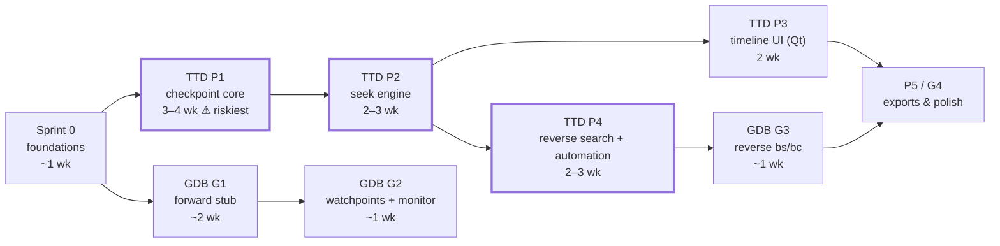

# TTD & GDB — Implementation Plan

| | |
|---|---|
| **Status** | Proposed |
| **Version** | 1.0 |
| **Last updated** | 2026-07-19 |
| **Governs** | [time-travel-debugging-tdd.md](./time-travel-debugging-tdd.md) (phases 1–5), [gdb-reverse-debugging-tdd.md](./gdb-reverse-debugging-tdd.md) (G1–G4), [time-travel-ux.md](./time-travel-ux.md), [overhead-and-gating.md](./overhead-and-gating.md) |

This document fixes the *order* of work across the four design documents and the rationale for that order. Scope and acceptance criteria live in the TDDs; this plan only sequences them, assigns milestones, and tracks cross-document dependencies. When a TDD and this plan disagree on content, the TDD wins; on ordering, this plan wins.

---

## 1. Sequence Overview

- **Critical path:** Sprint 0 → P1 → P2 → P4 → G3. Everything else hangs off it without feeding back into it.
- **The two tracks touch exactly once** (P4 → G3), so a slip in either track doesn't cascade until the end.
- **First shippable increment:** G2 ("live IDA/Ghidra debugging", no TTD needed) at ~3–4 weeks.
- Rough wall-clock, one core developer + occasional second pair of hands on GDB/Qt: **~10–14 weeks** to the full set.

### Milestone value ladder

Each milestone is independently shippable; no milestone's value is hostage to a later one:

| After | Shippable capability |
|---|---|
| G2 | Live debugging of the emulator from IDA Pro / Ghidra / GDB (breakpoints, watchpoints, stepping, monitor commands) |
| P2 | Rewind/step-back provable end-to-end via automation API (no UI yet) |
| P2+P3 | "Rewind & scrub" — timeline panel, event lanes, frame compare basics |
| P4 | "Find who corrupted this byte" — reverse search from Qt UI and WebAPI/Lua/Python/CLI |
| G3 | Reverse debugging (`reverse-step`, `reverse-continue`) inside IDA/Ghidra/GDB |
| P5/G4 | Tenet/Perfetto exports, heatmaps, ephemeral GDB ports, per-client docs, more clone models |

---

## 2. Sprint 0 — Shared Foundations (~1 week)

Small items that unblock both tracks and touch shared code. Doing them first avoids retrofitting under two dependent tracks. All are prerequisites named in the TDDs.

| # | Item | Spec | Notes |
|---|---|---|---|
| 0.1 | **Instance-tagged notifications**: add emulator UUID to `NC_EXECUTION_BREAKPOINT` and `NC_EMULATOR_STATE_CHANGE` payloads | GDB TDD §6.3 | Benefits every multi-instance consumer (videowall); `notifications.h` already carries the TODO. Update all existing observers to tolerate the richer payload |
| 0.2 | **Run-control claim token** in `EmulatorContext`; Qt UI + WebAPI honor it | GDB TDD §3.3, parent TDD §7.2 | Mutex-guarded take/release on the instance registry; refusal surfaced in each surface's own error channel |
| 0.3 | **Feature flags**: register `timetravel` (+modes/knobs) and `gdbserver`; cached-bool plumbing via `UpdateFeatureCache` pattern | parent TDD §10.3, overhead doc §5.2 | Hot-path gates are single cached bools, flipped at frame boundaries only |
| 0.4 | **Divergence-test harness + machine-state hash** — the oracle, built *before any serializer exists* | parent TDD §5, §15.1 | Live-run N frames capturing per-frame hashes → restore+replay → compare. Corpus wiring: BASIC idle, scroller, contention-sensitive multicolor, AccuracyCoinZX (self-modifying), TR-DOS loader (read-only), scripted-input game |
| 0.5 | **Benchmark scaffolding**: `ttd_capture_benchmark` skeleton + **debug-vs-fast memory interface microbenchmark** | overhead doc §6 | The microbenchmark settles the "TTD-lite third interface" question with data before anyone argues about it (overhead doc §5, last row) |

**Exit:** 0.1–0.3 merged with existing tests green; 0.4 harness runs against the current emulator (trivially passing — no TTD yet); 0.5 produces baseline numbers recorded in the overhead doc.

---

## 3. Track A — TTD Core (critical path)

### A1. TTD Phase 1 — Checkpoint Core (3–4 wk) ⚠ dominant risk

Risk = peripheral state completeness; that is exactly why the oracle (0.4) exists first. Every serializer lands against a live divergence check, not against hope.

Order within the phase (each step keeps the divergence suite green):

1. `TTDSerializable` interface + **Z80/chipset** capture (full `Z80State` copy incl. MEMPTR/Q/prefix; port latches from `EmulatorState`) — parent TDD §6.1, §6.4.
2. **Dirty tracker** + `MemoryWriteDebug` hook + never-touched sentinel logic — §6.2, §6.3.
3. **COW page store** (intern/refcount/release, budget, thinning) — §6.3, §6.5.
4. Per-frame capture at `OnFrameEnd` (+ the `RunTStates` frame-wrap boundary) — §7.1.
5. Peripheral serializers, one at a time, each with a round-trip test and a divergence-corpus pass: **AY register file → tape → WD1793+FDD → Covox**. FDC is the hardest audit; schedule it last within the group when serializer experience is highest.
6. Session lifecycle + invalidation hooks (`Reset`/`Load*`/speed change/debugger edits) — §4.2.
7. `GET /ttd/status` WebAPI endpoint (test observability) — §10.4.

**Exit (parent TDD §16 P1):** divergence test green over the full corpus; `TTD_RoundTrip_AnchorOnly`, `TTD_PageStore_CowRefcountEviction`, all `TTD_Serializer_RoundTrip_*` green; `ttd_capture_benchmark` < 5% (goal ~1%, overhead doc §2).

### A2. TTD Phase 2 — Seek Engine (2–3 wk)

1. Restore path: CPU copy + MemIf fixups, paging rebuild through the port decoder, page-diff memcpy, peripheral `TTDLoadState`, `Screen::InitFrame()` — §8.1.
2. Silent-replay mode + suppression flags (`ttdReplayActive`: breakpoints, analyzers, notifications, audio mute-at-host-boundary, checkpoint capture off, input-journal injection) — §8.2, Appendix C.
3. Input journal (capture + injection) — §5.1, §7.1.
4. `SeekTo` / `StepBackInstruction` / `StepForward*` / `StepBackFrame` — §8.1.
5. Resume-from-past truncation — §8.3.
6. External-event markers as replay barriers — §5.1.

**Exit:** `TTD_Seek_ArbitraryPoint`, `TTD_Session_TruncateOnResume`, `TTD_Thinning_EveryPointReachable` green; `ttd_seek_benchmark` targets met (1–20 ms dense tier).

### A3. TTD Phase 3 — Timeline UI (2 wk; parallelizable with A4 given a second person)

With one developer, do P3 **before** P4 despite reverse search being the headline: scrubbing a real demo is the best dogfooding of the seek engine and will surface P2 edge-case bugs (seek coalescing, detached-state handling) that P4's correctness sits on.

1. `TimelineWidget` (lanes, ruler, density strip, scrubbing with coalesced seeks) — UX doc §3.
2. Session-zoom lanes from per-frame aggregates (`GetTimelineSummary`) — UX §4, §11.
3. Detached banner + resume-from-past confirmation + invalidation toasts — UX §3.4, §3.5, §9.
4. Bookmarks; status-bar indicator; keyboard map — UX §2, §10.
5. Frame zoom (raster view) — UX §3.3 — may slip into the P4 window if needed.

**Exit:** interactive scrubbing ≥ 10 seeks/s on a real demo; manual UX review against UX doc §9 state table.

### A4. TTD Phase 4 — Reverse Search + Automation (2–3 wk)

1. Write journal (12 B records, ring, `io_only` mode) + hook — parent §9.3, overhead §5.
2. Instrumented-replay probe + two-pass fallback search — §9.2.
3. `FindLastAccess` with conditional filters — §9.4.
4. Qt: Reverse Search dialog, Event Inspector, contextual entry points, chain breadcrumbs — UX §5.
5. Full automation surface (WebAPI/Lua/Python/CLI) — parent §10.4.

**Exit:** `TTD_FindLast_PlantedWrite` (journal *and* fallback paths), `TTD_Journal_RingWrap`, `TTD_ExternalEvent_Barrier` green; WebAPI round-trip integration test green.

---

## 4. Track B — GDB Transport (starts right after Sprint 0)

Starts early for two reasons: **standalone value with zero TTD** (live IDA/Ghidra debugging is shippable by itself), and it touches only existing APIs, so it's ideal for a second contributor or for interleaving during A1's slower audit work.

### B1. GDB G1 — Forward-Only Stub (~2 wk)

Transport skeleton (`core/automation/gdb/`), RSP framing, handshake + target-XML annex tree, osdata + `vAttach` selection (+ `gdb_autoattach`), run-control claim integration, `g/G/p/P/m/M/X`, `Z0/z0`, `s/c/vCont`, byte-exact stop replies (§4.7.1), error table (§4.7.2), monitor `instances/bankinfo/frame/load/reset/laststop/tdesc`.

**Exit (GDB TDD §8):** real GDB connects to a chosen instance among several, sets breakpoint, steps, inspects — transcript tests green; **reference client fork+commit pinned in CI**.

### B2. GDB G2 — Watchpoints + Monitor Completion (~1 wk)

`Z2–Z4` (len ≤ 16 rule), watch stop replies, out-of-band dispositions (§3.4), full monitor set incl. `bport`, pseudo-register features (§4.6).

**Exit:** watchpoint transcripts green; IDA smoke test incl. `vAttach` path and the `watch:=value` quirk check.

### B3. GDB G3 — Reverse (~1 wk, **blocked on A4**)

`bs`/`bc` → `TTDManager`, `replaylog:begin`, detached read-only rules, barrier reporting, `monitor ttd start`.

**Exit:** `pygdbmi` reverse-continue integration test green (planted-writer scenario, GDB TDD §7.3).

### B4. GDB G4 — Polish (with P5)

Ephemeral dedicated ports (§6.2), physical memory view completion, range descriptors for len > 16, fuzz-lite, per-client setup docs, two-instance isolation test.

---

## 5. Final Phase — P5 / G4 Together

Tenet trace export, Perfetto/Speedscope export, temporal heatmaps (parent §13); UX extras that earned their keep during dogfooding (thumbnails, Frame Compare polish, Rewind HUD **only if** the Sprint-0 microbenchmark justified the TTD-lite interface); model-support expansion beyond Pentagon per the audit checklist (parent §12.4); disk-write journaling (parent §12.2 phase 2) if TR-DOS write workloads demand it.

This phase is intentionally a menu, not a queue — pick by observed demand, not by plan.

---

## 6. Sequencing Principles (why this order)

1. **Oracle before implementation, at every level.** Divergence harness before serializers; transcript tests before the dispatcher; benchmarks before optimization debates. A verifier built after the thing it verifies inherits its blind spots.
2. **Riskiest work first on the critical path, cheap standalone value first off it.** P1 (state completeness) starts immediately with maximum schedule buffer; G1/G2 deliver a shippable feature while P1 grinds.
3. **Dogfood before headline.** UI scrubbing (P3) before reverse search (P4) under single-developer constraints — usage finds seek-engine bugs faster than tests do.
4. **Data over debate for deferred decisions.** TTD-lite interface, `watch:=value` quirk, thumbnail budget, disk-write journaling — each has a designated measurement or conformance checkpoint instead of an upfront commitment.
5. **Tracks converge once.** P4→G3 is the only cross-track edge; any other coupling discovered during implementation should be treated as a design smell and raised against the TDDs.

---

## 7. Risk Register (plan-level)

| Risk | Trigger | Mitigation / early warning |
|---|---|---|
| Peripheral audit overruns (P1) | WD1793 state machine harder to serialize than estimated | FDC scheduled last in the serializer group; divergence corpus includes a TR-DOS loader from day one; P1 has the largest estimate range |
| Divergence failures from unaudited nondeterminism | Hash mismatch on a corpus title | The §5 audit table is the checklist; each failure adds a row (checkpoint / journal / prove-inert) — budgeted as normal P1 work, not exceptional |
| Seek latency misses targets on thinned tiers | `ttd_seek_benchmark` regression | Silent-replay throughput is the constant to optimize (batch-render reuse); tier densities are knobs, not architecture |
| IDA conformance surprises (vAttach, XML strictness) | G2 smoke test | Transcript-first conformance keeps the blast radius in the stub; quirk flags per §4.7.1 pattern |
| Two-track resource contention (single developer) | G-track starves during P1 | Acceptable by design — G1 slips without touching the critical path; re-sequence G1 after P2 if needed |
| Scope creep from P5 menu into earlier phases | "While we're here…" | P5 items require observed demand recorded in dogfooding notes; TDD change proposals otherwise |

---

## 8. Tracking

- Each phase gets a `docs/inprogress/<date>-<phase>/` working folder on start (existing project convention) with an execution log; on completion, the relevant TDD's status/estimates are updated with actuals.
- The overhead doc (§6) is the ledger for measured numbers: every benchmark landing replaces an estimate there.
- CI gates accumulate monotonically: divergence suite (from P1), capture benchmark (P1), seek benchmark (P2), search benchmark (P4), GDB transcripts (G1+), pinned-client integration (G1+), two-instance isolation (G4).
