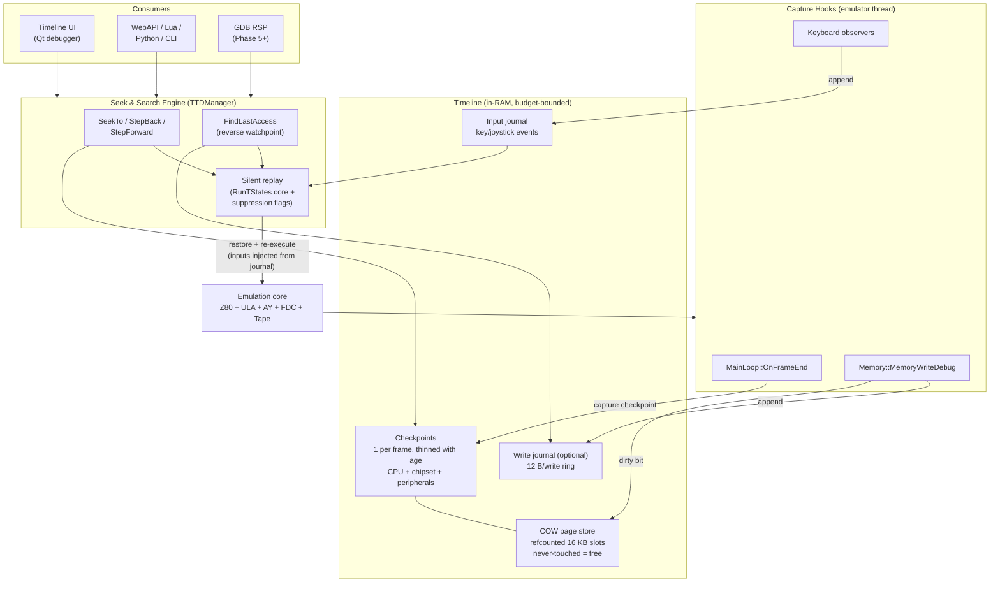
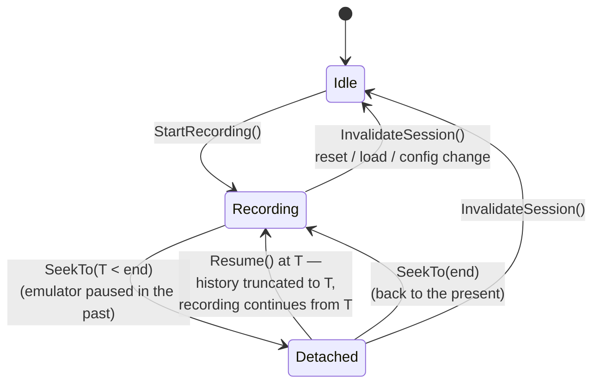
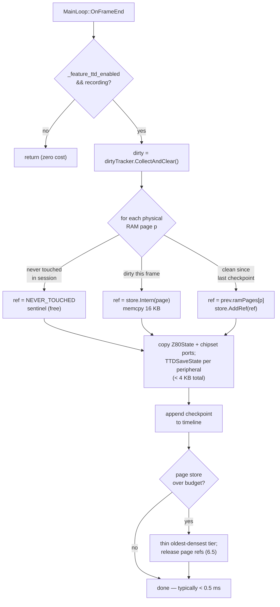
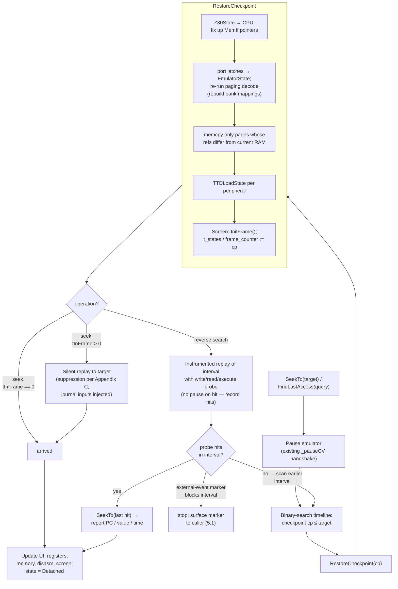

# Time-Travel Debugging (TTD) — Technical Design Document

| | |
|---|---|
| **Status** | Draft for review |
| **Version** | 2.1 |
| **Last updated** | 2026-07-19 |
| **Scope** | UnrealSpeccy-NG core + Qt debugger UI |
| **Companion docs** | [time-travel-ux.md](./time-travel-ux.md) (GUI/UX), [overhead-and-gating.md](./overhead-and-gating.md) (budgets & runtime gates), [gdb-reverse-debugging-tdd.md](./gdb-reverse-debugging-tdd.md) (RSP integration) |

---

## 1. Overview

### 1.1 Problem Statement

When debugging demos and games, the typical failure scenario is: a visual glitch or crash is observed *now*, but the root cause (a stray memory write, a mistimed interrupt, a bad bank switch) happened seconds or minutes earlier. Today the developer must guess where to place breakpoints, restart, and reproduce — often dozens of times.

Time-Travel Debugging (TTD) eliminates the reproduce-loop: the emulator continuously records its own history so the developer can:

1. **Rewind** — jump to any earlier point in time and inspect full machine state.
2. **Step backward** — instruction-level and frame-level reverse stepping.
3. **Reverse-continue to a watchpoint** — "rewind until the last write to address X" — the single most valuable operation for corruption bugs.
4. **Scrub a timeline** — drag a slider, see the screen/registers/memory at that moment.

### 1.2 Why Not Input Replay (RetroArch-style)?

RetroArch-style rewind/replay records controller inputs plus a start state. This is useless for our primary target — **demos** — which have no input at all: their behavior is a pure function of machine state and timing. Conversely, this property is a gift: *a demo run is fully deterministic*, so history can be reconstructed by re-execution from checkpoints instead of storing every state.

For games (which do read the keyboard), determinism is preserved by journaling host input events (Section 5).

### 1.3 Goals

- Frame-accurate rewind over at least 5 minutes of history at < 5% runtime overhead with default settings.
- T-state-accurate seek within any recorded frame (granularity: one Z80 instruction, same as the existing stepping engine).
- Reverse memory watchpoints ("find last write/read/execute at address").
- Timeline UI in the Qt debugger.
- Zero overhead when the feature is disabled (same pattern as `screenhq`, `memorytracking` feature gates).

### 1.4 Non-Goals (This Iteration)

- Anything outside the ZX Spectrum family: this emulator targets Spectrum and its clones (Pentagon, Scorpion, ATM, TS-Conf, GMX, Quorum), and so does TTD.
- GDB RSP server and IDA/Ghidra integration (Phase 5+, Section 13).
- Network streaming of history to an external server.
- Rewind as a *gameplay* feature (smooth 60fps backward playback). TTD is a debugging tool; backward navigation may take tens of milliseconds per jump.

---

## 2. Existing Infrastructure

The design deliberately maximizes reuse. Verified against the current codebase:

| Component | Location | What TTD uses it for |
|-----------|----------|----------------------|
| `EmulatorState` | `core/src/emulator/platform.h:755` | `t_states` (uint64, cumulative), `frame_counter` (uint64), all port latches (`p7FFD`, `pFE`, `pEFF7`, `p1FFD`, `pDFFD`, AY ports, GMX/ATM/TS extended state) — the canonical machine-state struct to checkpoint |
| `Z80State` | `core/src/emulator/cpu/z80.h:283` | Complete CPU state incl. undocumented internals (MEMPTR, Q register, `eipos`, `haltpos`, IFF1/2, IM, halted). POD, `#pragma pack(1)` for the register block — trivially copyable |
| Atomic stepping engine | `Emulator::RunTStates / RunFrame / RunNFrames / RunNCPUCycles` (`emulator.cpp:1316–1550`) | **The replay engine.** Already handles INT timing, frame boundaries, `OnFrameStart/End`, `skipBreakpoints`. TTD seek = restore checkpoint + `RunTStates(delta, /*skipBreakpoints*/ true)` |
| `MainLoop::OnFrameEnd()` | `core/src/emulator/mainloop.cpp:258` | Checkpoint capture hook — runs on the emulator thread at every frame boundary, after `t_states` is updated |
| `Memory::MemoryWriteDebug()` | `core/src/emulator/memory/memory.cpp:237` | Dirty-page marking + write journal hook. Already demonstrates the exact pattern: cached feature flag → tracker call → breakpoint check |
| Fast/Debug memory interfaces | `Memory::GetFastMemoryInterface / GetDebugMemoryInterface` | Feature gating: TTD recording requires the debug interface (or a third, lighter "TTD" interface — see 7.3) |
| `MemoryAccessTracker` | `core/src/emulator/memory/memoryaccesstracker.h` | RWX counters reused for heatmap UI; `TrackMemoryWrite` is a model for the TTD write hook |
| `CallTraceBuffer` | `core/src/emulator/memory/calltrace.h` | Stack reconstruction when presenting a restored point; no changes needed |
| `BreakpointManager` | `core/src/debugger/breakpoints/` | Reverse watchpoint conditions reuse `BreakpointDescriptor` addressing (Z80-space and bank+offset matching) |
| `FeatureManager` | `core/src/base/featuremanager.h` | New feature id `timetravel` (alias `ttd`), gated under master `debugmode` |
| Emulator snapshot format | `docs/emulator/design/snapshots/emulator_snapshots.md` | Reference inventory of "what is machine state"; TTD checkpoints capture the same logical set, but in-memory binary, not YAML |
| Keyboard | `core/src/emulator/io/keyboard/keyboard.h` | Input journal source: matrix state changes arrive via MessageCenter observers |

**Gap analysis** — what does *not* exist yet and must be built:

1. A complete in-memory machine checkpoint (existing SNA/Z80 loaders capture only the classic subset; peripherals like WD1793 internals, tape position, AY envelope phase are not covered by any serializer).
2. Dirty-page tracking (the `video_memory_changed` flag is the only precedent).
3. Input journal.
4. The TTD manager itself (checkpoint store, timeline, seek, reverse search).
5. Timeline UI.

---

## 3. Fundamental Design Decision: Checkpoint + Replay

### 3.1 Two Candidate Architectures

**A. Delta/undo log** — record every state mutation (memory writes, register changes, port writes) into a ring buffer; step backward by applying inverse deltas.

**B. Checkpoint + deterministic re-execution** — snapshot full machine state periodically; to reach time T, restore the nearest checkpoint ≤ T and re-execute forward. Backward step to T−1 = restore + replay to T−1.

### 3.2 Comparison

| Criterion | A: Delta log | B: Checkpoint + replay |
|---|---|---|
| Recording overhead | Every instruction must log register changes (~10–20 bytes/instr × ~1M instr/s ≈ 10–20 MB/s) | Only frame-boundary snapshot + dirty-page bit set on write (~1 extra AND/OR per write) |
| Correctness risk | Must enumerate *every* mutable bit (AY envelope counters, FDC state machine, ULA line counters…). Any missed field silently corrupts reverse state | Only the *checkpoint* must be complete. Replay re-derives all intermediate state through the real emulation code — cannot desync from itself |
| Backward step cost | O(1) per instruction | O(instructions since checkpoint) — worst case one frame ≈ 71,680 t-states ≈ < 20 ms at full host speed |
| Implementation size | Large: per-subsystem delta emit + revert code | Small: one serializer + reuse of existing `RunTStates` |
| Determinism requirement | None | **Hard requirement** — see Section 5 |

### 3.3 Decision

**Architecture B (checkpoint + replay) is the primary mechanism.** Rationale:

- The emulator is single-threaded per instance and already deterministic in its core execution path (`ExecuteCPUFrameCycle` / `RunTStates` produce identical results for identical starting state and inputs — this is what makes the existing test suite viable).
- A ZX Spectrum frame is *tiny* by modern standards: replaying a full frame is milliseconds. The classic argument for delta logs (systems where re-executing a replay window is expensive) does not apply here.
- Reuse: `RunTStates` with `skipBreakpoints=true` **is** the replay engine, already debugged, already handling INT timing and frame-boundary bookkeeping.

A **write journal** (delta-log-like structure) is still built — but as an *optional accelerator* for reverse watchpoint search (Section 9), not as the source of truth. If it is disabled or overflows, reverse watchpoints fall back to instrumented replay; correctness never depends on it.

### 3.4 Architecture at a Glance



Reading order: the emulation core feeds three cheap capture hooks (bottom); they populate the timeline (checkpoints backed by the COW page store, plus two journals); the seek/search engine consumes the timeline and drives the emulation core in silent-replay mode to reach exact intra-frame points; UI and automation sit on top of the engine only — they never touch the stores directly.

---

## 4. Timeline Model

### 4.1 Coordinates

A point in time is identified by:

```cpp
struct TTDTimePoint
{
    uint64_t frame;      // EmulatorState::frame_counter value
    uint32_t tInFrame;   // Z80 t counter within frame [0, config.frame * multiplier)
                         // Granularity: instruction boundary (identical to RunTStates)

    bool operator<(const TTDTimePoint& o) const
    {
        return frame != o.frame ? frame < o.frame : tInFrame < o.tInFrame;
    }
};
```

Notes:

- `config.frame` is t-states per frame (71680 for Pentagon). With the speed multiplier the intra-frame limit is `config.frame * current_z80_frequency_multiplier` — matching the logic already present in `Emulator::RunTStates`.
- **Granularity is one Z80 instruction**, not one t-state. This is the same resolution as every existing stepping facility and is sufficient: no observable state changes mid-instruction from the debugger's point of view. (ULA beam position within an instruction is derivable from `t`.)
- The global monotonic key used for indexes is `globalT = frame * tStatesPerFrame + tInFrame` stored as `uint64_t`. At 3.5 MHz this wraps after ~167,000 years.

### 4.2 Recording Session

A recording session is the unit of history validity:

- Starts when TTD recording is enabled (or at emulator reset while enabled).
- **Invalidated** (history cleared, new session started) by any event that breaks determinism or teleports state:
  - Snapshot/tape/disk load, `Emulator::Reset()`, ROM reload
  - Manual memory/register edits from the debugger UI *while running* (edits while paused at time T truncate history *after* T instead — the past is still valid)
  - Speed multiplier change (`next_z80_frequency_multiplier`) — simpler to invalidate than to model; revisit if it proves annoying
  - Media write-back to mounted disk images (see 12.2 for the staged handling)
- The session records `sessionStartTime` (TTDTimePoint) and monotonically grows `sessionEndTime` = "now".

The **current position** may be in the past (after a rewind). The state machine:



"Detached" corresponds to the emulator being **paused** at a historical point. Resuming execution from a historical point discards the future beyond it (like `git reset --hard` + new commits). A "branch and keep both" model was considered and rejected for v1 — it complicates the UI and index for a rare use case; a user who wants to preserve the future can save an emulator snapshot first.

---

## 5. Determinism Audit

Replay correctness requires: **identical checkpoint state + identical external inputs ⇒ identical execution.** Every source of nondeterminism must be either (a) part of the checkpoint, (b) journaled and replayed, or (c) proven not to affect emulated state.

| # | Source | Class | Handling |
|---|--------|-------|----------|
| 1 | Keyboard matrix state | External input | **Journal.** Host key events arrive asynchronously via MessageCenter and mutate the matrix between instructions. Journal entries: `(TTDTimePoint, key, press/release)` recorded when the matrix mutation is applied. On replay, the TTD engine injects matrix changes at the recorded points instead of live input (live input is suppressed during replay). |
| 2 | Joystick / mouse | External input | Same journal mechanism, same event stream. |
| 3 | Tape (`pTape`) playback position | Internal state | **Checkpoint.** Tape position/phase is deterministic once captured; `handleFrameStart/End` derive everything from counters. Tape *insertion/start/stop* commands are session-invalidating events in v1 (journaled in a later phase). |
| 4 | WD1793 FDC + disk images | Internal state + persistent media | **Checkpoint the controller**, journal sector writes (12.2). FDC internal state (state machine phase, track/sector regs, DRQ/INTRQ timers) must be fully serialized — this is new code in `wd1793.*`. |
| 5 | AY/YM state | Internal state | **Checkpoint the register file + selected register exactly** — that is the only CPU-visible part (`pFFFD` readback exposes R0–R15, never envelope internals). Envelope phase / tone counters / noise LFSR **cannot cause CPU divergence**; they are captured anyway (~100 B, trivial) so audio is correct at the seek destination, but a bug there degrades sound only, never determinism. |
| 6 | Floating bus / `portFF` reads | Timing-derived | Deterministic — derived from beam position (`t`), no action needed. Verified by config flags `floatbus/floatdos` living in `CONFIG` (checkpointed indirectly since config doesn't change mid-session). |
| 7 | `R` register, memory refresh | CPU state | Already in `Z80State` (`r_low`, `r_hi`). Deterministic. |
| 8 | Uninitialized RAM pattern at reset | Initial state | Irrelevant — sessions begin from a concrete state; reset invalidates the session. |
| 9 | Host audio callback (`handleAudioBufferHalfFull`), frame pacing, `TimeHelper` timestamps | Host-side | Proven non-state-affecting: they throttle the loop but never write emulated state. Replay runs unpaced (no audio wait). |
| 10 | Breakpoints pausing mid-frame (`WaitWhilePaused` inside `MemoryWriteDebug`) | Debugger interaction | Replay always runs with `skipBreakpoints=true`; user breakpoints cannot fire during internal seeks. Reverse-search instrumentation uses its own hook, not BreakpointManager (Section 9.3). |
| 11 | Analyzers (`AnalyzerManager::dispatchFrameStart`) | Debugger feature | Analyzers may mutate state (e.g., TR-DOS analyzer injects breakpoints). During replay, analyzer dispatch is suppressed; analyzers observe only live execution. |
| 12 | MessageCenter notifications (video frame ready, etc.) | Host-side | Suppressed during replay (Section 8.2) — they are outputs, not inputs. |
| 13 | Speed multiplier queued change (`next_z80_frequency_multiplier`) | Config change | Session-invalidating in v1 (see 4.2). |
| 14 | Shared memory export, recording subsystem | Host-side outputs | Non-state-affecting; recording is disabled during replay windows. |
| 15 | Contended memory / ULA snow timing | Timing-derived | Deterministic — contention is recomputed from `t` and scanline position by the same code on live run and replay. **Verify, don't assume:** the divergence-test corpus (Section 15) must include contention-sensitive multicolor demos. |

### 5.1 External-Event Markers

Any nondeterministic event that is *not* covered by a journal gets an `ExternalEvent` marker on the timeline instead of silently corrupting replay: tape control commands, debugger-initiated state edits, disk writes (Phase 1), anything added later before its journal exists. Rules:

- A marker either **invalidates the session** (4.2) or, where the past remains valid, becomes a **replay barrier**: seek and reverse-search refuse to cross it silently and surface the marker to the caller/UI instead.
- Markers are visible on the timeline widget (Section 11) so the user understands why history ends where it does.
- This keeps TTD honest: it never pretends to reproduce what it cannot. Journals (input today, disk/tape later) progressively convert marker classes into replayable events.

**Determinism is enforced by test, not by hope:** the test suite gains a *divergence test* — run N frames live, checkpoint every frame, then for random frames: restore checkpoint k, replay to frame k+m, hash full machine state, compare with the live-run hash recorded earlier. Any mismatch is a P0 bug in either the serializer or an unaudited nondeterminism source. (Section 15.)

---

## 6. Checkpoint Subsystem

### 6.1 Checkpoint Content

A checkpoint is a complete, self-sufficient machine state. Inventory (mirrors the emulator snapshot format, plus runtime-only internals that the file format omits):

```cpp
struct TTDCheckpoint
{
    TTDTimePoint time;              // Always at a frame boundary: tInFrame == 0
    uint64_t     globalT;           // Denormalized sort key

    // --- CPU ---
    Z80State     cpu;               // Full struct copy (~250 bytes incl. debug fields).
                                    // MemIf pointers are fixed up on restore, not serialized.

    // --- Chipset / ports ---
    // Snapshot of the port-latch subset of EmulatorState:
    // p7FFD, pFE, pEFF7, pXXXX, pBFFD, pFFFD, pDFFD, pFDFD, p1FFD, pFF77,
    // GMX/Quorum/ATM/TS extended state, cram[], sfile[], border color, screen mode.
    TTDChipsetState chipset;        // ~1.5 KB (dominated by cram/sfile for TS models)

    // --- Peripherals (each device implements TTDSerializable, Section 6.4) ---
    std::vector<uint8_t> ayState;       // Per-chip full runtime state
    std::vector<uint8_t> fdcState;      // WD1793 + FDD positions
    std::vector<uint8_t> tapeState;     // Playback position/phase
    std::vector<uint8_t> covoxState;    // DAC latches (trivial)

    // --- Memory ---
    // References into the page store (Section 6.3); COW — pages shared
    // between checkpoints that didn't modify them.
    std::vector<TTDPageRef> ramPages;   // One per physical RAM page
    // ROM pages: not stored (immutable within a session; ROM identity captured
    //            once per session). Cache/MISC pages: stored iff dirty support
    //            confirms they are writable on the active model.

    // --- Journals ---
    uint64_t inputJournalOffset;    // First input-journal entry at/after this checkpoint
    uint64_t writeJournalOffset;    // Ditto for write journal (if enabled)
};
```

**Serializer reuse:** the checkpoint writer is the native snapshot serializer (`emulator_snapshots.md`) with an **in-RAM blob target** (`SerializeToBlob`) instead of YAML+files — same state inventory, same code path, no disk I/O. This keeps the file-snapshot feature and TTD from ever disagreeing about "what is machine state," and the peripheral `TTDSerializable` implementations (6.4) serve both consumers.

Restore fixups (things that are pointers/derived and must be recomputed, not copied):

- `Z80State::FastMemIf / DbgMemIf / MemIf` — reattach to current `Memory` interfaces.
- Memory bank mapping (`_bank_write[]`, `_bank_read[]`) — recomputed by re-applying `p7FFD/p1FFD/...` through the existing port-decode path (`Memory::SetRomPage`-family), *not* by serializing raw pointers. This guarantees consistency with paging logic.
- Screen internal counters — reinitialized via `Screen::InitFrame()` since checkpoints sit on frame boundaries (this is why checkpoints are frame-aligned: mid-frame ULA rendering state never needs serializing).
- `MemoryAccessTracker` counters, CallTrace — **not** restored (they are observability data, monotone across the session; Section 12.5).

### 6.2 Dirty Page Tracking

Physical RAM on supported models: 128 KB (8 pages) to 4 MB (256 pages) of 16 KB pages. Tracking is per physical page:

```cpp
class TTDDirtyTracker
{
public:
    // Called from the memory write path. absPage = physical page index.
    inline void MarkDirty(uint16_t absPage) { _dirty[absPage >> 6] |= (1ULL << (absPage & 63)); }

    uint64_t   _dirty[MAX_PAGES / 64];   // 256 pages -> 4 × uint64
    void       CollectAndClear(std::vector<uint16_t>& outDirtyPages);
};
```

Hook placement — `Memory::MemoryWriteDebug()`, immediately after the physical write, following the exact pattern of the existing tracker call:

```cpp
// memory.cpp, MemoryWriteDebug(), after "*(_bank_write[bank] + addressInBank) = value;"
if (_feature_ttd_enabled)   // cached bool, same pattern as _feature_memorytracking_enabled
{
    _ttdDirtyTracker->MarkDirty(GetPhysicalPageForBank(bank));
    // Optional write journal (Section 9): _ttdWriteJournal->Append(addr, oldValue, ...)
}
```

Cost: one predictable branch + OR when enabled; zero when disabled (flag cached, same as today's tracker gate). Note that `MarkDirty` needs the *physical* page — `Memory` already maintains the bank→page mapping, so this is a table lookup, not a computation.

**Non-CPU writers:** on ZX Spectrum, only the CPU writes RAM (no DMA on base models). Beta Disk sector reads into RAM go *through* CPU instructions (TR-DOS is programmed I/O), so the hook catches everything. If a future model adds DMA (TS-Conf), its write path must call `MarkDirty` too — this is called out as a checklist item in the model-support matrix (12.4).

### 6.3 Copy-on-Write Page Store

Naive per-frame full-RAM copies would cost 6.4 MB/s on a 128K model (acceptable) but 200 MB/s on a maxed TS-Conf (not). The page store deduplicates:

```cpp
struct TTDPageRef { uint32_t storeIndex; };   // Index into page store

class TTDPageStore
{
    // Fixed-size pool of 16 KB slots, refcounted.
    // Checkpoint N+1 copies only pages dirty since checkpoint N;
    // clean pages share the previous checkpoint's slot (refcount++).
    uint32_t Intern(const uint8_t* pageData16k);   // Copies into a free slot
    void     AddRef(uint32_t idx);
    void     Release(uint32_t idx);                // Frees slot at refcount 0
};
```

Capture at `OnFrameEnd` (emulator thread):



A typical demo dirties 2–6 pages per frame (working set + screen), so the steady-state copy cost is ~32–96 KB/frame ≈ 2–5 MB/s and **< 0.5 ms** — well within the frame budget.

**Untouched pages cost nothing.** A page never written during the session has identical contents at every point of the session, so it needs no copy at all — not even a baseline: checkpoints carry a `NEVER_TOUCHED` sentinel ref for it, and restore leaves live RAM as-is (its content *is* the historical content). A page's first intern happens at the first checkpoint after its first write. Consequences:

- **TTD cost scales with the software's working set, not the machine's RAM size.** A 512K Pentagon running ordinary 128K software consumes exactly the same TTD memory as a 128K config — the extra 384 KB of never-touched pages contribute zero bytes and zero capture time. Only software that actually exercises extended memory pays for it.
- The dirty-tracker doubles as the ever-touched set: a second bitmap (`_everDirty`), set on first write and never cleared within the session, distinguishes `NEVER_TOUCHED` from "clean since last checkpoint".
- Invariant for the restore path: a `NEVER_TOUCHED` page must never be written by a *later* part of the session either — the first write anywhere in the session upgrades every existing checkpoint's sentinel to a real ref lazily (equivalently: the page is interned once from its pre-first-write content, and all sentinel refs resolve to that baseline slot).

### 6.4 Peripheral Serialization Interface

New minimal interface, implemented by AY/TurboSound, WD1793+FDD, Tape, Covox:

```cpp
class TTDSerializable
{
public:
    virtual size_t TTDStateSize() const = 0;                  // Fixed per device
    virtual void   TTDSaveState(uint8_t* dst) const = 0;      // memcpy-style, no allocation
    virtual void   TTDLoadState(const uint8_t* src) = 0;
};
```

Design constraints: no heap allocation in `TTDSaveState` (runs every frame on the emulator thread); versioning is unnecessary (checkpoints never persist across process runs in v1 — see Open Questions for on-disk sessions).

The initial per-device state audit (what fields constitute complete state) is the riskiest part of the whole project and gets its own implementation checklist per device, cross-checked against the divergence test.

### 6.5 Checkpoint Tiering and Eviction

All frames are checkpointed while recording (cheap, per 6.3). Memory is bounded by a **budget** (default 64 MB, configurable — a 128K machine with typical COW sharing fits 5+ minutes in this; see the worksheet in Appendix A). When the page store exceeds budget, the timeline is *thinned*, oldest-densest first:

| Age of history | Kept checkpoint density | Max replay distance to any point |
|---|---|---|
| Last 10 s (500 frames) | Every frame | ≤ 1 frame (~20 ms replay) |
| 10 s – 60 s | Every 10th frame | ≤ 10 frames (~200 ms) |
| 60 s – budget limit | Every 50th frame | ≤ 50 frames (~1 s) |

Thinning releases page refs; COW sharing means dropping a checkpoint frees only pages unique to it. Numbers grounded: a 128K model has 8 RAM pages = 128 KB *upper bound* per checkpoint, but the COW cost per checkpoint is only its dirty pages (typically 2–6 × 16 KB); a demo dirtying 4 pages/frame consumes ~3.2 MB/s in the dense tier and far less in thinned tiers. The 64 MB default comfortably yields minutes of history; pathological all-pages-dirty workloads degrade gracefully to less retention, never to failure. The budget is a `features.ini` knob (Section 10.3) for users who want more.

The input journal and write journal are never thinned within the session window (they are tiny relative to pages) — this is what keeps *every* instruction reachable even in thinned regions: restore sparse checkpoint, replay forward with journaled inputs.

---

## 7. Recording Path (Runtime Integration)

### 7.1 Hook Map

| Hook | File / function | Action when TTD recording |
|---|---|---|
| Frame boundary | `MainLoop::OnFrameEnd()` (and the equivalent boundary in `Emulator::RunTStates` frame-wrap block) | Capture checkpoint (6.3) |
| Memory write | `Memory::MemoryWriteDebug()` | `MarkDirty` (+ optional write journal) |
| Port write | `Ports` out path (where `p7FFD` etc. are latched) | Nothing extra — port latches are read from `EmulatorState` at checkpoint time. (Write journal optionally records OUTs for the event track UI.) |
| Keyboard/joystick mutation | `Keyboard` observer callbacks | Append input-journal entry with current `TTDTimePoint` |
| Session invalidators | `Emulator::Reset / LoadSnapshot / LoadTape / LoadDisk / SetSpeed...`, debugger memory-edit paths | `TTDManager::InvalidateSession(reason)` |

### 7.2 Threading Model

- **Emulator thread** (runs `MainLoop::Run` → `RunFrame`): all capture work — checkpoint copy, dirty collection, journal appends. No locks on the hot path: the timeline vector is appended only here.
- **UI / control thread**: initiates seeks and reverse searches, but *never* while the emulator thread is running a frame. The protocol reuses the existing pause discipline: `Emulator::Pause()` → wait for `_isPausedConfirmed` (already implemented via `_pauseCV` in MainLoop) → TTD operations execute on the control thread while the emulator thread sits in its pause loop → `Resume()` if the user continues.
  - This is exactly how `RunTStates` and the stepping commands already operate; TTD adds no new concurrency pattern.
- Timeline reads for UI display (drawing the slider, event ticks) use a small mutex-protected summary struct updated once per frame, not the raw timeline vector.
- **Control-surface vs control-surface:** multiple control planes (Qt UI, WebAPI, Lua/Python, CLI, GDB) can issue Pause/Resume/Seek on the same instance. A per-instance advisory **run-control claim** in `EmulatorContext` arbitrates: while a surface holds the claim with the target paused, other surfaces' Resume/Step/Seek/state-writes are refused (Pause and read-only queries always allowed). The GDB TDD §3.3 defines the policy (it is protocol-mandatory there — RSP cannot express an external resume); the Qt timeline and WebAPI honor the same token.

### 7.3 Interaction with Fast/Debug Memory Interfaces

Recording requires the debug write path (that's where the dirty hook lives). Options considered:

1. Require `debugmode` + debug interface while recording (**chosen for v1**) — matches how memory tracking works today; overhead of the debug read path is already accepted by anyone using the debugger.
2. A third "TTD-only" `MemoryInterface` with just the dirty hook (fast reads, hooked writes) — nice optimization, deferred; the `MemoryInterface` struct makes this a 20-line addition later.

When TTD is enabled via FeatureManager, it forces `Z80::MemIf = DbgMemIf` (same mechanism the debugger uses).

---

## 8. Seek and Replay Engine

### 8.1 SeekTo Algorithm

```
SeekTo(target: TTDTimePoint):
  precondition: emulator paused (enforced; see 7.2), target within session bounds

  1. cp = latest checkpoint with cp.time <= target      // binary search
  2. RestoreCheckpoint(cp):
       a. Copy cpu -> Z80 object; fix up MemIf pointers
       b. Copy port latches -> EmulatorState; re-run paging decode to rebuild
          bank mappings from p7FFD/p1FFD/... (reuses existing SetRomPage path)
       c. memcpy referenced pages -> physical RAM arrays (only pages that differ
          from current RAM contents — tracked by comparing current position's
          page refs with target's; often a handful of pages)
       d. TTDLoadState for each peripheral
       e. Screen::InitFrame(); reset frame-local counters
       f. emulatorState.t_states / frame_counter := cp values
  3. if target.tInFrame > 0:
       ReplayRun(target)          // Section 8.2
  4. currentPosition = target; notify UI (registers/memory/screen refresh)
```



Complexity: O(log #checkpoints) + O(changed pages × 16 KB memcpy) + O(replayed instructions). Worst case with maximally thinned history: restore + 1 s of emulated time ≈ 50 frames ≈ 3.5M t-states ≈ **tens of milliseconds** on a modern host (the emulator runs hundreds× real time when unpaced and unrendered — see 8.2).

Step-level operations build on SeekTo:

- `StepBackInstruction()`: current position T → find T′ = the instruction boundary immediately before T. Since instruction lengths vary, T′ is found by replaying from the previous checkpoint while remembering the last-seen boundary (the replay engine counts instructions; cost = one intra-frame replay, ≤ 20 ms).
- `StepBackFrame()`: SeekTo(frame−1, same tInFrame) — the "same beam position, previous frame" comparison view, invaluable for raster effects.

### 8.2 Silent Replay Mode

Replay must be *observationally silent* and *fast*. `TTDManager::ReplayRun` wraps the existing stepping core (`ProcessInterrupts` / `Z80Step` / `OnCPUStep` loop, as in `Emulator::RunTStates`) with a replay context flag `_context->ttdReplayActive` that:

| Subsystem | Behavior during replay |
|---|---|
| Breakpoints | Skipped (`skipBreakpoints=true` — mechanism exists) |
| MessageCenter notifications (frame ready, breakpoint, etc.) | Suppressed |
| Audio (`SoundManager`) | `handleStep/handleFrameStart` still run (AY state must advance deterministically!) but host buffer submission is muted |
| Video | Per-t-state rendering may be skipped except for the final frame segment before the target (screen must be visually correct at the destination). Batch-render path (`RenderFrameBatch`) regenerates the final image cheaply — reuse of the screenhq=off machinery |
| Analyzers | `dispatchFrameStart` suppressed (5.11) |
| Recording subsystem | Not invoked |
| Live keyboard input | Blocked from mutating the matrix; the input journal injects recorded events at their timestamps instead |
| Checkpoint capture | Disabled (we're re-traversing existing history) |

**Audio-state-advancing-but-muted** deserves emphasis: it is the classic replay bug. AY tone/envelope counters are machine state (5.5); skipping `handleStep` during replay would desync them. The mute point is at the host-buffer boundary, not the device tick.

### 8.3 Resume-from-Past (History Truncation)

When the user resumes execution while positioned at T < end:

```
1. Truncate timeline: drop checkpoints > T, release their page refs
2. Truncate input journal and write journal after T
3. Recording continues normally from T (next OnFrameEnd checkpoints frame T.frame+1)
```

This is atomic with respect to the UI (done under pause, before Resume()).

---

## 9. Reverse Watchpoints (Write/Read/Execute Search)

### 9.1 The Operation

"Position me at the moment of the **last write to address A before current time T**" (analogously: read, execute; range variants `[A, A+len)`).

### 9.2 Two-Pass Replay Search (Always Available)

Works with zero recording overhead beyond baseline TTD:

```
FindLastWrite(A, before=T):
  for each checkpoint interval [cpK, cpK+1) walking BACKWARD from T:
    // Pass 1: instrumented replay of the interval
    restore cpK silently
    replay to min(cpK+1, T) with a write-probe on A active,
      recording ONLY the TTDTimePoint of each hit (no pause)
    if hits: answer = last hit; break
  // Pass 2: position exactly
  SeekTo(answer)  // and report PC / instruction that performed the write
```

Cost: proportional to how far back the culprit is, one silent replay of each scanned interval. With every-frame checkpoints, scanning 10 s of history ≈ 500 frame replays ≈ a few seconds — acceptable for an interactive "find the corruption" operation, and the write journal (9.3) makes the common case instant.

The **write probe** is not a BreakpointManager breakpoint (those pause the emulator and post notifications — 5.10). It is a dedicated lightweight check compiled into the TTD replay hook in `MemoryWriteDebug`:

```cpp
if (_context->ttdReplayActive && _ttdProbe.armed && _ttdProbe.Matches(addr))
    _ttdProbe.RecordHit(currentTimePoint(), z80.m1_pc, value);
```

### 9.3 Write Journal (Fast Path)

Optional feature (`timetravel` mode flag `journal=on`), on by default when memory budget allows:

```cpp
#pragma pack(push, 1)
struct TTDWriteRecord            // 12 bytes
{
    uint64_t globalT : 40;       // ~9 years of t-states — ample for a session
    uint64_t addr    : 16;       // Z80 address
    uint64_t isIo    : 1;        // Port OUT vs memory write
    uint64_t pad     : 7;
    uint16_t m1pc;               // PC of the writing instruction
    uint8_t  value;
    uint8_t  physPage;           // Physical page (disambiguates banked writes)
};
#pragma pack(pop)
```

Appended from the same `MemoryWriteDebug` hook. Ring buffer, default 256 MB ≈ 22M writes ≈ minutes of typical demo activity. `FindLastWrite` first scans the journal backward (memory-bandwidth-fast, no emulation); only if the journal has already wrapped past the target window does it fall back to 9.2.

Rejected alternative — full per-address index (`unordered_map<addr, vector<timestamp>>` from TDD v1): memory-unbounded, poor locality, and pointless given how fast a linear backward scan over a packed array is (a 256 MB journal scans in well under 100 ms). A simple per-frame Bloom filter or per-frame dirty-page summary can accelerate the scan later if profiling demands it.

### 9.4 Conditional Variants

The search predicate accepts optional filters, mirroring `BreakpointDescriptor` semantics: match on written value, on writer PC range, on physical page (bank-aware, using `physPage`). Execute-search ("when was address A last executed") uses the journal's M1 record variant or falls back to replay with an execute probe.

---

## 10. Component Design

### 10.1 New Files

```
core/src/debugger/timetravel/
    ttdmanager.h/.cpp        // Facade + session state machine (4.2)
    ttdcheckpoint.h/.cpp     // Checkpoint struct, capture/restore
    ttdpagestore.h/.cpp      // COW page pool (6.3)
    ttddirtytracker.h        // Header-only, hot-path (6.2)
    ttdjournal.h/.cpp        // Input journal + write journal rings
    ttdreplay.h/.cpp         // Silent replay engine + probes (8.2, 9.2)
    ttdserializable.h        // Peripheral interface (6.4)

unreal-qt/src/debugger/widgets/
    timelinewidget.h/.cpp    // Slider + event track (11)
```

### 10.2 TTDManager Facade

```cpp
class TTDManager
{
public:
    explicit TTDManager(EmulatorContext* context);

    // --- Session ---
    void StartRecording();
    void StopRecording();                       // Keeps history browsable until invalidated
    void InvalidateSession(const char* reason); // Called by Reset/Load/etc. hooks
    bool IsRecording() const;
    TTDSessionInfo GetSessionInfo() const;      // Bounds, memory usage, checkpoint count

    // --- Capture (emulator thread only) ---
    void OnFrameBoundary();                     // Called from MainLoop::OnFrameEnd
    void OnMemoryWrite(uint16_t addr, uint8_t oldVal, uint8_t newVal,
                       uint16_t m1pc, uint8_t physPage);   // Inlined fast path
    void OnInputEvent(const TTDInputEvent& ev);

    // --- Navigation (control thread, emulator must be paused) ---
    bool SeekTo(TTDTimePoint target);
    bool StepBackInstruction();
    bool StepForwardInstruction();              // Replay-based when detached
    bool StepBackFrame();
    bool StepForwardFrame();
    void ResumeFromCurrent();                   // Truncates future, re-enters Recording

    // --- Reverse search ---
    std::optional<TTDSearchResult> FindLastAccess(const TTDSearchQuery& q);
    // TTDSearchQuery: address/range, access type (W/R/X/OUT), value filter,
    //                 PC filter, search-before time. TTDSearchResult: TTDTimePoint,
    //                 pc, value, physPage.

    // --- UI support ---
    TTDTimelineSummary GetTimelineSummary() const;   // Thread-safe snapshot for widget
};
```

`EmulatorContext` gains `TTDManager* pTTDManager` (same lifecycle pattern as `pDebugManager`), plus the `ttdReplayActive` flag checked by the suppression points (8.2).

### 10.3 Feature Gating

FeatureManager registration (in `featuremanager.h` constants + registration site):

```
id: "timetravel"   alias: "ttd"   category: debug
desc: "Record execution history for rewind and reverse debugging"
depends: debugmode=on  (enforced like memorytracking/breakpoints)
```

All hot-path checks use a cached bool (`_feature_ttd_enabled`), refreshed via the existing `UpdateFeatureCache` pattern. Session lifecycle reuses the shared `ProfilerSessionState { Stopped, Capturing, Paused }` enum so TTD behaves like every other profiler from the automation layer's point of view (stopping retains data until an explicit clear).

Configurable knobs (`features.ini`, mode string of the `timetravel` feature):

| Key | Default | Meaning |
|-----|---------|---------|
| `budget_mb` | `64` | Page-store hard cap; thinning/eviction beyond it (6.5) |
| `journal` | `on` | Write journal for fast reverse search (9.3) |
| `journal_mb` | `64` | Write-journal ring size |
| `dense_seconds` | `10` | Every-frame checkpoint window before thinning starts |

### 10.4 Automation API Surface

TTD is exposed through all four existing control planes, following their established conventions (`profiler_api.cpp` response shapes, `emu.*` binding style, CLI verb style):

**WebAPI** (`/api/v1/emulator/{id}/...`):

| Method | Path | Body / Query | Description |
|--------|------|--------------|-------------|
| `POST` | `/ttd/start` | — | Start recording session |
| `POST` | `/ttd/stop` | — | Stop capturing, retain history |
| `POST` | `/ttd/clear` | — | Drop all captured data |
| `GET`  | `/ttd/status` | — | Session state, bounds, memory usage |
| `GET`  | `/ttd/timeline` | `?from=&to=` | Timeline summary entries (paginated) |
| `POST` | `/ttd/seek` | `{"frame": N}` or `{"tstate": T}` | Seek to a target point |
| `POST` | `/ttd/step` | `{"dir": "back"\|"fwd", "unit": "instruction"\|"frame"}` | Relative navigation |
| `POST` | `/ttd/find_last` | `{"addr": A, "access": "write"\|"read"\|"execute", "value"?: V, "pc_from"?, "pc_to"?}` | Reverse search (`FindLastAccess`) |

**Lua / Python** (mirroring `emu.memcounters()` style):

```lua
emu.ttd_start()
emu.ttd_seek(frame)                          -- or emu.ttd_seek_tstate(t)
r = emu.ttd_find_last(0x5800, "write")       -- r.frame, r.tstate, r.pc, r.value
emu.ttd_step_back()                          -- one instruction
status = emu.ttd_status()
```

```python
emu.ttd_start()
result = emu.ttd_find_last(addr=0x5800, access="write")
print(hex(result.pc))
```

**CLI:** `emulator ttd start|stop|status|seek --frame N|find-last --addr 0x5800 --access write|step-back`

Seek results report `{ok, reached_frame, reached_tstate, halt_reason}` where `halt_reason ∈ {target, external_event, out_of_range}` — external-event barriers (5.1) surface here rather than being silently skipped. The automation surface lands with Phase 4 (search) except `status`, which ships in Phase 1 for test observability.

---

## 11. Debugger UI

### 11.1 Timeline Widget

```
┌──────────────────────────────────────────────────────────────────────┐
│ ⏺ REC  Session: 04:12.5   Mem: 212/512 MB   Frame 12,345  t=30,144   │
│                                                                      │
│  |◀◀   ◀|   ◀   ▶   |▶   ▶▶|        🔍 Find last: [W▼] [0x5800  ] Go │
│ ┌──────────────────────────────────────────────────────────────────┐ │
│ │ ▂▂▃▂▅▂▂▇▂▂▂▃▂▂▂▂▅▂▂▂▂▂▂▃▂▂▇▂▂▂●━━━━━━━━━━━━━ (future, truncates) │ │
│ └──────────────────────────────────────────────────────────────────┘ │
│    ▲ write-activity sparkline        ▲ current position (detached)   │
│  Events: ▼7FFD bank switches  ▼session marks  ▼user bookmarks        │
└──────────────────────────────────────────────────────────────────────┘
```

- Buttons map to `StepBackFrame / StepBackInstruction / StepForwardInstruction / StepForwardFrame`; `|◀◀`/`▶▶|` jump to session bounds.
- Slider drag issues throttled `SeekTo` (coalesced to the latest position while a seek is in flight — seeks are tens of ms, so live scrubbing at ~10–20 Hz is realistic).
- Event track ticks come from the write journal (OUT to `0x7FFD`/`0x1FFD` = bank switches) and user bookmarks.
- The sparkline is per-frame dirty-page counts — already collected, zero extra cost.

### 11.2 Debugger Window Integration

- All existing panels (registers, memory, disassembly, stack via CallTrace) simply refresh after `SeekTo` — they already render from live emulator state, and restore *is* live state. No panel changes required beyond a "⏪ viewing past @ frame N" banner while detached.
- Memory view context menu gains: *"Find last write to this address"* → `FindLastAccess` → seek + flash the disassembly line of the culprit instruction.
- Existing step buttons work unmodified when detached (stepping forward from a past point = resume-from-past semantics with confirmation if it truncates a long future).

---

## 12. Edge Cases and Failure Modes

### 12.1 Mid-Frame Session Start

Recording can only start at a frame boundary (the first checkpoint anchors the session). `StartRecording` while running sets a pending flag consumed by the next `OnFrameEnd`. While paused mid-frame, the session starts at the next boundary after resume; the UI reflects "armed".

### 12.2 Disk Writes (TR-DOS `FORMAT`/`SAVE` etc.)

Problem: a demo/game writing to disk mutates `DiskImage`, which is *outside* the checkpoint. Rewinding past a sector write without restoring it desyncs replay (the FDC would read back different data).

Staged handling:

- **Phase 1 (v1):** first sector write while recording → `InvalidateSession("disk write")` + status-bar notice. Read-only workloads (vast majority of demos) unaffected.
- **Phase 2:** journal sector writes `(TTDTimePoint, drive, track, sector, 256-byte old + new data)`; checkpoint restore rolls the image back through the journal. Bounded and simple — deferred only to keep v1 small.

The same logic applies to NVRAM writes (rare; Phase 1 invalidates).

### 12.3 Turbo / Speed Multiplier

`current_z80_frequency_multiplier` scales t-states per frame, which changes the meaning of `tInFrame`. v1 invalidates the session on multiplier change (4.2). The checkpoint records the active multiplier so a session recorded entirely at ×2 replays correctly at ×2.

### 12.4 Model Support Matrix

TTD v1 is validated on: **Pentagon 128/512** (primary demo platform). Each additional model requires: peripheral serializer audit + divergence-test pass. Models with DMA-capable hardware (TS-Conf) additionally require dirty-hook coverage of the DMA write path (6.2). The feature is enabled per-model via a whitelist until audited — enabling TTD on an unaudited model shows a warning.

### 12.5 Observability Data vs Machine State

`MemoryAccessTracker` counters, CallTrace, opcode profiler data are **not** rewound — they are cumulative diagnostics of *host wall-clock* activity, and rewinding them would be both expensive and semantically murky (should replayed instructions count?). Decision: replay does not feed trackers (suppressed with the other 8.2 items); counters keep their live-run values; the UI banner notes this while detached. Revisit if users find it confusing.

### 12.6 Failure Handling

| Failure | Behavior |
|---|---|
| Page store exhausted despite thinning | Drop oldest history (slide session start forward); never block emulation |
| Divergence detected at runtime (optional paranoia mode: hash check on seek) | Invalidate session, log loudly, keep emulator in a valid live state (the restored checkpoint itself is always internally consistent) |
| Seek requested outside session bounds | Clamp + UI feedback |
| OOM during checkpoint capture | Disable recording, keep existing history browsable |

---

## 13. Future Phases (Design Sketches Only)

Retained from v1 of this document, deliberately compressed — none of it affects the core architecture above:

- **GDB RSP server** — now specified in its own TDD: [gdb-reverse-debugging-tdd.md](./gdb-reverse-debugging-tdd.md) (automation-library transport; `bs`/`bc` map onto `StepBackInstruction`/`FindLastAccess`; IDA Pro / Ghidra / GDB frontends).
- **Tenet trace export** (IDA plugin): a bounded window of history replayed once with a full-trace probe (`pc=…, reg=…, mr=…, mw=…` per instruction) — the replay engine already supports instrumented passes (9.2), this is just a different probe.
- **Perfetto / Speedscope export**: per-frame counters and call-stack flame graphs from CallTrace + write journal.
- **Temporal memory heatmap**: X = address, Y = frame, RGB = W/R/X intensity; data is exactly the per-frame RWX counters already collected by `MemoryAccessTracker` segments.
- **Session persistence**: serialize page store + journals to disk to reopen a session later (requires versioned peripheral serializers — the one place versioning enters the design).

---

## 14. Performance Budget (Pentagon 128, 3.5 MHz, 50 fps)

| Cost center | When | Estimate | Notes |
|---|---|---|---|
| Dirty-bit set | Every RAM write | ~1–2 ns | Cached-flag branch + OR; hidden in the existing debug-write path cost |
| Write journal append | Every RAM write (if journal on) | ~3–5 ns | 12-byte packed append to ring |
| Checkpoint capture | Per frame (20 ms budget) | 0.1–0.5 ms | 2–6 dirty pages memcpy + <4 KB serializers |
| Input journal | Per host key event | negligible | |
| **Total recording overhead** | | **≈ 2–4% of frame budget** | Meets the < 5% goal; measured, not assumed — benchmark is part of Phase 1 acceptance |
| SeekTo (dense region) | Interactive | 1–20 ms | Page diff memcpy + ≤ 1 frame replay |
| SeekTo (thinned region) | Interactive | ≤ ~200 ms | ≤ 50-frame replay, unpaced |
| FindLastAccess via journal | Interactive | < 100 ms | Linear backward scan |
| FindLastAccess via replay | Interactive | ~seconds per 10 s scanned | Fallback path |
| Memory | Steady state | ≤ budget (default 64 MB) | 6.5 |

---

## 15. Testing Strategy

Tests live in `core/tests/timetravel/`, following the fixtures and helpers in `core/tests/_helpers/` (`EmulatorTestHelper` provides deterministic headless runs with the audio callback stubbed).

1. **Determinism divergence test** (the keystone, Section 5): live-run N frames capturing per-frame state hashes → random restore+replay → hash compare. Corpus: BASIC idle, a scroller demo, a **contention-sensitive multicolor demo**, **self-modifying code** (`AccuracyCoinZX` accuracy suite), a TR-DOS loader (read-only), a keyboard-driven game with scripted journal input (`testdata/demos/` provides real-world material). Any hash mismatch fails CI.
2. **Unit tests** — key named cases:

| Test | Phase | Verifies |
|------|-------|----------|
| `TTD_FeatureGating_ZeroCostWhenOff` | 1 | All hooks early-return; no allocation when disabled |
| `TTD_PageStore_CowRefcountEviction` | 1 | Intern/AddRef/Release invariants; slot reuse; no leaks |
| `TTD_Serializer_RoundTrip_<Device>` | 1 | Save → mutate → load → full-state compare, one per `TTDSerializable` |
| `TTD_RoundTrip_AnchorOnly` | 1 | Seek to a checkpoint frame reproduces live state byte-for-byte |
| `TTD_TimePoint_FrameBoundaryArithmetic` | 2 | tInFrame wrap, multiplier scaling |
| `TTD_Seek_ArbitraryPoint` | 2 | Restore + intra-frame replay lands exactly on target |
| `TTD_Session_TruncateOnResume` | 2 | Resume-from-past drops future checkpoints/journal entries atomically |
| `TTD_Thinning_EveryPointReachable` | 2 | ∀ t in session: ∃ checkpoint ≤ t with journal coverage of [checkpoint, t] |
| `TTD_Journal_RingWrap` | 4 | Write-journal order preserved across wrap; fallback engages past wrap point |
| `TTD_FindLast_PlantedWrite` | 4 | Reverse search locates a known poke (journal path *and* replay-fallback path) |
| `TTD_ExternalEvent_Barrier` | 4 | Search/seek refuse to cross a marker and report `external_event` |

3. **Integration tests**: record 100 frames → `SeekTo` 20 random points → screen CRC + register compare vs reference run; WebAPI full round-trip (start → status → seek → find_last) over HTTP against the existing test client; Lua binding smoke test.
4. **Benchmarks** (`core/benchmarks/`, regression-gated): `ttd_capture_benchmark` (overhead % vs TTD off, target < 5%), `ttd_seek_benchmark` (latency distribution across dense and thinned regions), `ttd_find_last_benchmark` (journal path < 100 ms; replay fallback measured per scanned second).

---

## 16. Implementation Plan

Phases are strictly ordered by dependency; each has a demoable acceptance criterion.

| Phase | Content | Exit criteria (named tests must pass) | Est. |
|---|---|---|---|
| **1. Checkpoint core** | `TTDSerializable` + audits for Z80/chipset/AY/tape/FDC; `SerializeToBlob` in-RAM target; dirty tracker + hook; page store; per-frame capture; feature flag; `GET /ttd/status` | Divergence test green over full corpus; `TTD_RoundTrip_AnchorOnly`, `TTD_PageStore_CowRefcountEviction`, all `TTD_Serializer_RoundTrip_*`; `ttd_capture_benchmark` < 5% | 3–4 wk |
| **2. Seek engine** | Restore path incl. paging rebuild; silent replay mode + suppression flags; `SeekTo`/step-back/step-forward; session state machine + invalidation hooks + external-event markers | `TTD_Seek_ArbitraryPoint`, `TTD_Session_TruncateOnResume`, `TTD_Thinning_EveryPointReachable`; `ttd_seek_benchmark` targets met | 2–3 wk |
| **3. Timeline UI** | `TimelineWidget`, debugger banner, scrubbing, bookmarks, marker display | Manual UX review; scrubbing ≥ 10 seeks/s on a real demo | 2 wk |
| **4. Reverse search + automation** | Replay probe; write journal + backward scan; memory-view context action; conditional filters; full WebAPI/Lua/Python/CLI surface (10.4) | `TTD_FindLast_PlantedWrite` (both paths), `TTD_Journal_RingWrap`, `TTD_ExternalEvent_Barrier`; WebAPI round-trip integration test | 2–3 wk |
| **5+. External** | GDB stub, Tenet export, heatmaps, disk-write journaling, more models | Per-item | — |

Phase 1 carries the dominant risk (peripheral state completeness). The divergence test is built **first**, before any serializer, so every serializer lands against a live oracle.

---

## 17. Open Questions

1. **Session persistence to disk** — worth the serializer-versioning cost? (Deferred; revisit after v1 usage feedback.)
2. **Tape-driven workloads** — v1 checkpoints tape position but invalidates on tape control commands; is that acceptable for tape-loader debugging, or does Phase 2 need tape-command journaling?
3. **Branching history** (keep the future when resuming from the past) — rejected for v1 (4.2); is a single "auto-save emulator snapshot before truncation" safety net wanted instead?
4. **Third memory interface** (fast reads + TTD-hooked writes, 7.3) — measure first; implement only if debug-read overhead is noticeable in recording sessions.
5. **Multi-instance** — TTDManager is per-`EmulatorContext` and therefore per-instance by construction; is per-instance memory budgeting needed when many instances run (videowall scenario), or a global pool?

---

## Appendix A. Checkpoint Size Worksheet (Pentagon 128)

| Component | Size |
|---|---|
| Z80State | ~250 B |
| Chipset/ports (incl. TS cram/sfile worst case) | ~1.5 KB |
| AY ×2 (TurboSound) full runtime state | ~200 B |
| WD1793 + 4×FDD | ~300 B |
| Tape | ~100 B |
| Page refs (8 pages × 4 B) | 32 B |
| **Fixed cost per checkpoint** | **< 2.5 KB** |
| Page payload (COW, typical) | 2–6 × 16 KB dirty |
| Page payload (worst case, all dirty) | 128 KB |

Never-touched pages are free (6.3), so these numbers are identical for a 512K Pentagon running software with the same working set — TTD memory scales with what the program touches, not with installed RAM. A 512K machine only costs more when the software genuinely uses the extra pages (RAM-disk, big unpacked data), and then proportionally to actual writes.

## Appendix B. Why Frame-Aligned Checkpoints

Aligning checkpoints to `OnFrameEnd` means: ULA rendering state, sound frame buffers, INT timing phase, and per-frame counters are all at their canonical "between frames" values — none of them need serializing. `Screen::InitFrame()` + `handleFrameStart` reconstruct everything, exactly as they do on every live frame. A mid-frame checkpoint would require serializing the renderer and audio pipeline mid-flight for zero user-visible benefit (mid-frame points are reached by replay in ≤ 20 ms).

## Appendix C. Interaction Cheat-Sheet (What Suppresses What)

| Mode | Breakpoints | Analyzers | Notifications | Audio out | Video render | Checkpoints | Live input |
|---|---|---|---|---|---|---|---|
| Live recording | ✓ | ✓ | ✓ | ✓ | ✓ | ✓ | ✓ |
| Silent replay (seek) | ✗ | ✗ | ✗ | muted (state advances) | final segment only | ✗ | ✗ (journal injected) |
| Instrumented replay (search) | ✗ (probe instead) | ✗ | ✗ | muted | ✗ | ✗ | ✗ (journal injected) |
| Detached (paused in past) | n/a | n/a | UI-only | n/a | n/a | n/a | n/a |

---

## References

- rr — record/replay debugging: https://rr-project.org/
- WinDbg Time Travel Debugging (checkpoint+replay in production tooling): https://learn.microsoft.com/windows-hardware/drivers/debuggercmds/time-travel-debugging-overview
- Tenet IDA plugin (trace format): https://github.com/gaasedelen/tenet
- GDB Remote Serial Protocol, reverse execution packets: https://sourceware.org/gdb/current/onlinedocs/gdb/Packets.html
- Internal: `docs/emulator/design/snapshots/emulator_snapshots.md` (state inventory, serializer reused for checkpoints), `docs/inprogress/2026-01-14-t-state-counters/` (timing counters), `docs/inprogress/2026-01-11-debugger-events/` (debugger eventing), `docs/emulator/design/ui/shutdown-race-condition-fix.md` (manager shutdown-ordering precedent TTDManager follows), `core/tests/_helpers/` (deterministic headless test fixtures)
