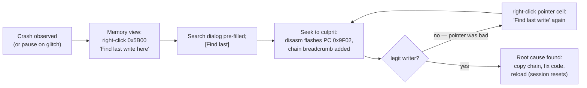

# Time-Travel Debugging — UX Design

| | |
|---|---|
| **Status** | Draft for review |
| **Version** | 1.0 |
| **Last updated** | 2026-07-19 |
| **Scope** | Qt debugger UI (unreal-qt) |
| **Parent TDD** | [time-travel-debugging-tdd.md](./time-travel-debugging-tdd.md) — engine architecture, capabilities, constraints |

This document specifies the user experience for TTD: the timeline panel, event marks, search and event-list views, and the per-persona workflows. Engine capabilities and limits (seek latency, thinning, external-event barriers, session invalidation) are taken as given from the parent TDD and referenced by section number.

---

## 1. Design Principles

1. **Time is a first-class spatial dimension.** The timeline is not a toolbar accessory — it is a full panel with zoom, lanes, and marks, the same way the memory view treats address space.
2. **Never lie about fidelity.** Thinned history regions, external-event barriers (TDD §5.1), and journal-wrap boundaries are *visible* on the timeline. The user must always be able to see why navigation stops where it stops.
3. **The past is read-only until you commit.** While detached (viewing history), all state panels render historical state but editing is disabled. Resuming from the past is an explicit, confirmed action when it would truncate significant future history.
4. **Every "when?" question should be one interaction away.** Right-click on anything that has a history — memory cell, register, port, breakpoint — offers "Find last change / access".
5. **Progressive disclosure per persona.** A gamer sees one hotkey and an overlay. A developer sees the timeline panel. A demo-maker additionally opens the intra-frame (raster) view. Nobody pays UI complexity they don't use.
6. **Match existing debugger idioms.** Same docking, refresh, and widget conventions as `debuggerwindow` and the existing widget set (`unreal-qt/src/debugger/widgets/`).

---

## 2. UI Inventory

| Element | Type | Persona focus | Phase (parent TDD §16) |
|---|---|---|---|
| Timeline Panel (session zoom → frame zoom) | Dockable panel | Developer, demo-maker | 3 |
| Intra-frame (raster) timeline | Mode of Timeline Panel | Demo-maker | 3–4 |
| Transport controls + keyboard map | Panel header | All | 3 |
| Event marks + lanes | Timeline overlay | Developer, demo-maker | 3 (basic), 4 (journal-fed) |
| Event Inspector (filtered/sorted list) | Dockable panel | Developer, demo-maker | 4 |
| Reverse Search dialog + chain breadcrumbs | Dialog + breadcrumb bar | Developer | 4 |
| Frame Compare (A/B same beam position) | Mode of screen view | Demo-maker | 4 |
| Bookmarks | Timeline lane + list | All | 3 |
| Rewind HUD (hold-to-rewind overlay) | Main-window overlay | Gamer | 5+ (needs fast memory interface, TDD §7.3) |
| Status-bar TTD indicator | Status bar widget | All | 3 |

---

## 3. The Timeline Panel

### 3.1 Anatomy (session zoom)

```
┌─ Timeline ──────────────────────────────────────────────────────────────────┐
│ ⏺ REC 04:12.5 │ 64/64 MB │ Frame 12,345  t=30,144 │ ⏪ DETACHED @ 11,802    │ ← header/status row
├─────────────────────────────────────────────────────────────────────────────┤
│ |◀◀  ◀|  ◀  ▮▮  ▶  |▶  ▶▶|      zoom [── session ─●─ frame ──]   🔖  🔍     │ ← transport row
├─────────────────────────────────────────────────────────────────────────────┤
│ activity    ▂▂▃▂▅▂▂▇▂▂▂▃▂▂▂▂▅▂▂▂▂▂▂▃▂▂▇▂▂▄▆▂▂▂▂▃▂▂▂▂▂▅▂▂░░░░░░░░░░░         │ ← lane 1: write activity
│ paging     ····|······||····|·········|······|··········░░░░░░░░░░░         │ ← lane 2: bank switches
│ io/fdc     ──────▬▬▬──────────────▬▬──────────────────────░░░░░░░░░         │ ← lane 3: FDC/tape activity
│ input       ·····↓·↑·······↓↑···········↓·↑···············░░░░░░░░░         │ ← lane 4: input events
│ marks      ⚑        ✖breakpoint    🔖"before crash"   ⛔disk-write          │ ← lane 5: marks & barriers
│           ┌────────────────────────────●━━━━━━━━━━━━━━━━━━━━━━━━━┐          │
│ ruler     └┬─────────┬─────────┬───────┼─────────┬─────────┬─────┘          │ ← scrubber + ruler
│          03:00     03:30     04:00   04:12    04:30      05:00              │
│           ▒▒▒▒▒▒▒▒▒▒░░░░░░░░░░████████                                      │ ← density strip
│           thinned 1/50  thinned 1/10  every frame                           │
└─────────────────────────────────────────────────────────────────────────────┘
```

Legend of structural elements:

- **Header/status row** — session state (`⏺ REC` / `⏸ STOPPED` / `⏪ DETACHED @ frame`), memory budget usage, current position in frame + t-state. Clicking the DETACHED chip jumps back to "now".
- **Transport row** — from left: jump-to-session-start, step back frame, step back instruction, pause/play, step forward instruction, step forward frame, jump-to-now. Zoom slider morphs the panel between session zoom and frame zoom (Section 3.3). `🔖` drops a bookmark at the current position; `🔍` opens Reverse Search (Section 5).
- **Lanes** — horizontally scrollable, vertically collapsible tracks (Section 4). The set of visible lanes is a per-user setting; right-click on the lane gutter toggles lanes.
- **Scrubber + ruler** — the position handle `●` with a solid line for recorded-and-dense history, and `░` for the not-yet-recorded future (or, when detached, the truncatable future rendered hollow `━`).
- **Density strip** — visualizes checkpoint thinning tiers (TDD §6.5): `█` every-frame, `▒` 1/10, `░` 1/50. Tooltip explains expected seek latency in each tier. This is Principle 2 made visible.

### 3.2 Scrubbing Behavior

- Dragging the handle issues coalesced `SeekTo` calls: while a seek is in flight, only the *latest* requested position is kept (engine seeks are 1–200 ms depending on tier — TDD §14). During a drag, all state panels update live; the screen view shows the restored frame.
- Wheel over the ruler: scrub by frame. Shift+wheel: by 10 frames. Ctrl+wheel: zoom.
- Clicking anywhere on the ruler or a lane seeks to that time.
- Clicking any **event mark** seeks to that exact event's TTDTimePoint (not just its frame).
- When a seek lands in a thinned tier, the status row transiently shows `seek: 142 ms (thinned region)` — making cost visible without blocking.

### 3.3 Frame Zoom (Intra-Frame / Raster View)

Zooming in past ~1 frame/pixel morphs the ruler into a **single-frame raster view** — the demo-maker's primary instrument:

```
┌─ Timeline — Frame 12,345 (Pentagon: 71,680 t) ──────────────────────────────┐
│ scanline  0        64        128       192      239   (vblank)              │
│          ┌─────────┬─────────┬─────────┬────────┬───┐                       │
│ beam     │ border  │▓▓ paper (192 lines) ▓▓▓▓▓▓▓│bdr│ INT─┤                 │
│          └─────────┴─────────┴─────────┴────────┴───┘                       │
│ writes    ·║··║║···║···························║║║··                        │ ← writes this frame
│ io        ····▲FE···········▲7FFD······················                     │ ← OUTs this frame
│ exec      ────────╥─────────╥─────────╥──────────────                       │ ← PC in watched range
│           ────────●─────────────────────────────────                        │ ← position: line 38, t=8,612
│ t-state   0     8,612    17,920    35,840    53,760    71,680               │
└─────────────────────────────────────────────────────────────────────────────┘
```

- The ruler axis is t-states, annotated with **scanline numbers and border/paper regions** (from `CONFIG` timing: 224 t/line on Pentagon) and the INT window. "Same t = same beam position" becomes directly visible.
- Marks at this zoom are individual journal events (writes, OUTs) rather than aggregates.
- Stepping here uses instruction granularity; the position readout shows `line 38, t-in-line 68` alongside absolute t.
- **Prev/next frame at same beam position** buttons (`⇞`/`⇟`) implement the demo-maker's frame-compare navigation (`StepBackFrame` — TDD §8.1).

### 3.4 Detached Mode & Resume

While detached (position < end):

- All panels show a persistent slim banner: `⏪ Viewing frame 11,802 — 543 frames before present. [Back to now] [Resume from here]`.
- State-editing controls (memory poke, register edit) are disabled with a tooltip "Read-only while viewing history — Resume from here to branch".
- **Resume from here**: if the future being discarded is longer than a threshold (default 5 s), a confirmation dialog appears with a one-click escape hatch: *"Discard 543 frames of future history? [Save snapshot of 'now' first] [Discard & resume] [Cancel]"*. The snapshot option covers the branching use case rejected from the engine (TDD §4.2) at pure-UI cost.

### 3.5 Session Invalidation Feedback

When a session-invalidating event occurs (TDD §4.2 — reset, snapshot load, disk write in v1, speed change), the timeline clears and a non-modal toast explains *why*: `TTD history cleared: disk write at frame 13,001 (see docs)`. The previous session's bookmarks are offered for export before clearing. Silent history loss is forbidden (Principle 2).

---

## 4. Event Marks: Taxonomy and Lanes

Marks are the "important events" layer. Sources: write journal (OUT records), input journal, engine events (barriers, invalidation), BreakpointManager (hits during live run), user (bookmarks).

| Mark | Glyph/color | Lane | Source | Available from |
|---|---|---|---|---|
| Bank switch (`OUT 0x7FFD/0x1FFD/…`) | `\|` tick, blue | paging | Write journal (isIo) | Phase 4 |
| Border/FE OUT burst | `▲`, cyan | io/fdc | Write journal | Phase 4 |
| FDC command / tape motor | `▬` span, amber | io/fdc | Peripheral events | Phase 4 |
| Key press / release | `↓`/`↑`, green | input | Input journal | Phase 3 |
| Breakpoint hit (live run) | `✖`, red | marks | BreakpointManager | Phase 3 |
| Reverse-search result | `◎`, red outline | marks | Search engine | Phase 4 |
| User bookmark | `🔖` + label | marks | User | Phase 3 |
| External-event barrier | `⛔` + hatched region beyond | marks | Engine (TDD §5.1) | Phase 3 |
| Session start | `⚑` | marks | Engine | Phase 3 |
| Write-activity histogram | bar height | activity | Dirty-page counts (free) | Phase 3 |

Rules:

- At session zoom, high-frequency marks (writes, OUTs) render as **aggregated density**, not individual glyphs; individual marks appear from ~1000 t/pixel zoom.
- Every mark has a tooltip with its exact TTDTimePoint and payload (`OUT 0x7FFD ← 0x11 @ frame 12,001 t=8,612 PC=0x80D4`), and click-to-seek.
- Lane visibility presets per persona: *Minimal* (activity + marks), *Developer* (all), *Demo* (activity + paging + io + marks, input hidden).

---

## 5. Reverse Search & the Event Inspector

### 5.1 Reverse Search Dialog

Invoked by `🔍`, by `Ctrl+Shift+F` in the debugger, or contextually (Section 5.3). Front-end to `FindLastAccess` (TDD §9):

```
┌─ Find in history ───────────────────────────────────────────┐
│ What:   (•) Write  ( ) Read  ( ) Execute  ( ) Port OUT      │
│ Where:  Address [ 0x5B00 ]  Length [ 1   ]  Bank [ any ▼]   │
│ Filters (optional):                                         │
│   [ ] Value written  = [ 0xFF ]                             │
│   [ ] Writer PC in   [ 0x0000 ] .. [ 0xFFFF ]               │
│   [ ] Exclude PC in  [ 0x8000 ] .. [ 0x9FFF ]  ("my code")  │
│ Search: (•) backward from current   ( ) backward from end   │
│                                                             │
│ ⓘ journal covers last 03:12 — older ranges use replay scan │
│                        [ Find last ]  [ Find all in range ] │
└─────────────────────────────────────────────────────────────┘
```

- **Find last** seeks straight to the hit (the 90% case).
- **Find all in range** populates the Event Inspector with every hit instead (Section 5.2).
- The `ⓘ` line implements Principle 2: it states the journal coverage window and warns when the query will fall back to slow replay scanning, with a live progress bar + cancel during that scan.

### 5.2 Event Inspector (filtered/sorted event list)

A dockable table over journal-backed events — the "supplementary list" view. Populated by *Find all*, by lane double-click ("show these events as a list"), or by canned queries:

```
┌─ Event Inspector ── query: writes to 0x5B00–0x5B1F ─────────────────────────┐
│ [query chips: W 0x5B00+32 ✕] [+ add filter]     sort: time ↓   1,204 hits   │
├──────────┬─────────┬────────┬───────┬────────┬──────────────────────────────┤
│ Frame    │ t       │ Type   │ Addr  │ Value  │ PC       (symbol if known)   │
├──────────┼─────────┼────────┼───────┼────────┼──────────────────────────────┤
│ 12,344   │ 61,004  │ W      │ 5B02  │ FF     │ 80D4  sprite_blit+0x14       │
│ 12,344   │ 60,996  │ W      │ 5B01  │ FF     │ 80D1  sprite_blit+0x11       │
│ 12,290   │  8,612  │ W      │ 5B00  │ 00     │ 9F02  music_irq+0x22   ⚠ odd │
│ …        │         │        │       │        │                              │
├──────────┴─────────┴────────┴───────┴────────┴──────────────────────────────┤
│ [Seek to selected]  [Mark all on timeline]  [Export CSV]                    │
└─────────────────────────────────────────────────────────────────────────────┘
```

- Columns sortable (time, address, value, PC); filter chips are composable (address range ∧ value ∧ PC range ∧ type), matching the engine's conditional filters (TDD §9.4).
- Row selection previews the event's context in the disassembly panel *without* seeking; double-click / **Seek to selected** performs the seek.
- **Mark all on timeline** projects the result set onto the marks lane — turning a query into a visual rhythm ("this address is written once per frame except *here*").
- Symbols come from the existing label manager when loaded.
- Canned queries menu: *Writes to selected memory range*, *All bank switches*, *All OUTs to port…*, *All input events*, *Executes in range* — one click from the respective panels.

### 5.3 Contextual Entry Points ("one interaction away")

| Context | Right-click action | Resulting query |
|---|---|---|
| Memory view cell/selection | "Find last write here" / "List all writes here" | W @ addr/range |
| Disassembly line | "When was this last executed?" | X @ addr |
| Disassembly line (self-modifying suspicion) | "Who modified this instruction?" | W @ addr range of instruction |
| Register pane (SP) | "List stack writes this frame" | W @ [SP−32, SP+32], current frame |
| Breakpoint list entry | "Find previous hit in history" | type-matching query at bp address |
| Timeline paging lane | "List all bank switches" | OUT 0x7FFD/0x1FFD |

### 5.4 Root-Cause Chain Breadcrumbs

Corruption hunts are iterative: find who wrote the value → discover the *pointer* was bad → find who wrote the pointer → … The UI keeps this chain explicit as a breadcrumb bar above the timeline:

```
chain: ✖ crash @12,345 → ◎ W 0x5B00 by 9F02 @12,290 → ◎ W 0xC011(ptr) by 84A0 @12,101 → …
```

Each breadcrumb is clickable (re-seek), the chain is saved with bookmarks, and "copy chain as text" produces a bug-report-ready trail. This is deliberately cheap to build (a list of search results) and disproportionately valuable to the developer persona.

---

## 6. Frame Compare (Demo-Maker View)

A/B comparison of two frames at the same beam position — the raster-debugging killer feature (TDD §8.1 `StepBackFrame`):

```
┌─ Frame Compare ─────────────────────────────────────────────┐
│  A: frame 12,344   B: frame 12,345   lock: ● same t-in-frame│
│ ┌───────────────┐  ┌───────────────┐  mode: [side-by-side ▼]│
│ │  screen A     │  │  screen B     │        side-by-side    │
│ │               │  │      ▓glitch  │        onion-skin      │
│ └───────────────┘  └───────────────┘        diff-highlight  │
│ regs @ same t:  A: HL=4000 BC=0010 …   B: HL=4000 BC=000F … │
│                 diff: BC, F                                 │
│ [◀ A−1] [A=B−1] [swap] [B+1 ▶]      [step both +1 instr]    │
└─────────────────────────────────────────────────────────────┘
```

- **Onion-skin** and **diff-highlight** modes overlay the two framebuffers; diff-highlight paints changed pixels magenta — a glitching scanline is instantly visible.
- Register/port state at the locked t is shown for both sides with differences emphasized.
- **Step both** advances A and B by the same instruction count, keeping the comparison locked while the user walks toward the divergence point. Implementation note: each "step both" is two seeks; at dense-tier latency this stays interactive.

---

## 7. Gamer Persona: Rewind HUD

Deliberately minimal — no debugger window required. Availability gated on the fast-interface work (TDD §7.3); until then this section is design-only.

- **Hold `Backspace`** (configurable): enters rewind — the screen plays backward at the achievable seek rate with a translucent HUD:

```
        ┌──────────────────────────────┐
        │  ⏪⏪  −3.2 s   [██████░░░░] │
        └──────────────────────────────┘
```

- Release: instant resume from that point (truncation is silent here — by definition the gamer *wants* to discard the failed future; threshold confirmation from §3.4 is suppressed in HUD mode).
- Tap (not hold): jump back a fixed 2 s.
- The HUD shows remaining rewind depth (the dense-tier window). No timeline, no marks, no lists.

---

## 8. Persona Walkthroughs (End-to-End)

### 8.1 Developer: "sprite table corrupted, crash follows"



Touchpoints used: contextual search (5.3), chain breadcrumbs (5.4), Event Inspector if the write pattern needs surveying first (5.2), thinned-region warning if the hunt goes back minutes (5.1 `ⓘ`).

### 8.2 Demo-maker: "multicolor jitters on line 38 once per loop"

1. Pause on a glitched frame (or scrub the activity lane to find the anomalous frame — its write rhythm differs visibly).
2. Zoom to frame view (§3.3); the raster ruler shows writes near scanline 38 — one `OUT (0xFE)` tick is late relative to the previous frame.
3. Open Frame Compare (§6), lock t-in-frame, diff-highlight: the glitching line lights up.
4. `[A=B−1]` walk backward frame by frame until the glitch first appears; use "step both" to find the instruction where register timing diverges.
5. Bookmark the finding, export the chain.

### 8.3 Gamer: "missed the jump"

Hold Backspace ~1.5 s watching the HUD, release just before the jump, replay the jump. Total interactions: one key. No timeline panel ever opens.

---

## 9. Empty States, Errors, Status

| Situation | UI treatment |
|---|---|
| TTD feature off | Timeline panel shows a single enable card: "Time travel is off — [Enable] (requires debug mode; ~3% overhead)" |
| Recording just started | Timeline present but near-empty; density strip grows rightward — no special state needed |
| Seek into external-event barrier | Scrubber refuses to cross `⛔`; snap-to-barrier + tooltip "keyboard/tape event not journaled in this build — history beyond this point can't be replayed faithfully" |
| Journal wrapped, search falls back to replay | Progress dialog with cancel; result annotated "found via replay scan" |
| Budget pressure / heavy thinning | Density strip turns mostly `░`; header memory chip turns amber with tooltip suggesting `budget_mb` |
| Session invalidated | Toast with reason + bookmark export offer (§3.5) |
| Status bar (main window) | Compact `⏺ 04:12` chip; click opens the timeline panel; turns `⏪` when detached — the user can never *not know* they're viewing the past |

---

## 10. Keyboard Map (defaults, configurable)

| Key | Action |
|---|---|
| `Ctrl+←` / `Ctrl+→` | Step back / forward one instruction (works detached and paused-live) |
| `Ctrl+Shift+←` / `Ctrl+Shift+→` | Step back / forward one frame (same beam position) |
| `Ctrl+Home` / `Ctrl+End` | Session start / back to now |
| `Ctrl+Shift+F` | Reverse Search dialog |
| `Ctrl+B` | Drop bookmark at current position |
| `Backspace` (hold, main window) | Rewind HUD (gamer mode) |
| `[` / `]` in Frame Compare | A−1 / B+1 |

---

## 11. Implementation Notes for unreal-qt

- New widgets under `unreal-qt/src/debugger/widgets/`: `timelinewidget` (lanes+ruler custom-painted, QAbstractScrollArea-based), `eventinspectorwidget` (QTableView over a lazily-populated model backed by journal queries), `framecomparewidget` (two framebuffer views + diff shader in QPainter), `rewindhud` (translucent overlay on the screen widget).
- All engine access goes through `TTDManager` public API + `GetTimelineSummary()` (TDD §10.2) — widgets never touch stores directly (mirrors how existing widgets consume tracker pointers).
- Seek requests from UI marshal through the existing pause discipline; the timeline widget owns a single-slot "pending seek" to implement coalescing (§3.2).
- Lane rendering budget: the summary struct delivers per-frame aggregates (write count, paging-OUT count, input count, marks) — O(visible pixels) redraw, no journal iteration on paint.
- Event Inspector pages journal queries in chunks (e.g., 1,000 rows) to keep multi-second replay-backed queries responsive.

---

## 12. Open Questions

1. **Thumbnail strip** (tiny screenshots along the session ruler, like video editors): high recognition value, but requires storing per-checkpoint thumbnails (~2–6 KB each compressed). Worth the budget? Proposal: opt-in lane, captured only at bookmark/anchor frames in v1.
2. **Rewind HUD audio**: silent vs. reversed-chunk audio feedback (RetroArch-style). Silent proposed for v1.
3. **Event Inspector persistence**: should query chips + chains persist per-project (alongside labels/breakpoints)? Leaning yes, same store as bookmarks.
4. **Frame Compare "step both" granularity**: instruction pairs can drift when instruction streams differ between frames; may need "advance to next t ≥ X" mode instead. Decide during Phase 4 prototyping.
