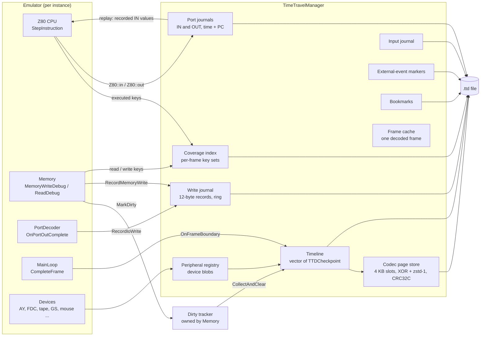
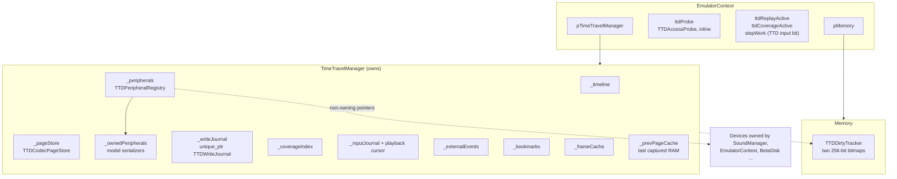
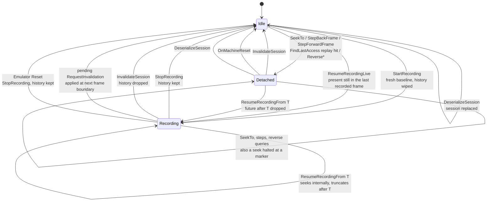
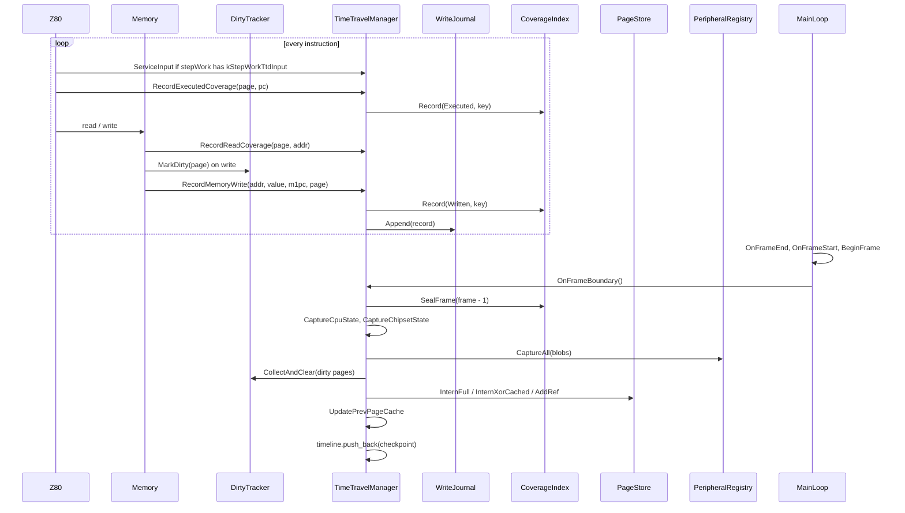
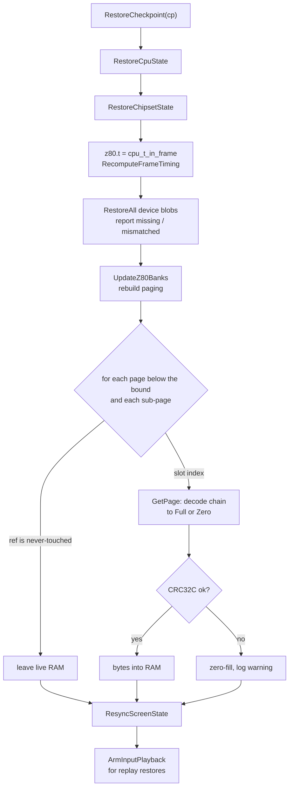
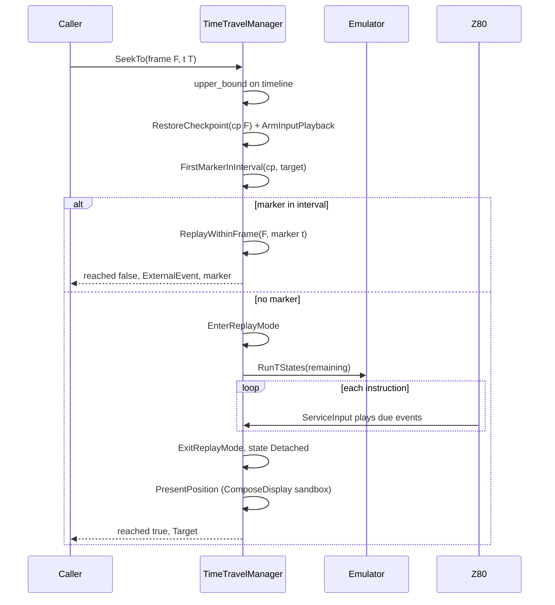
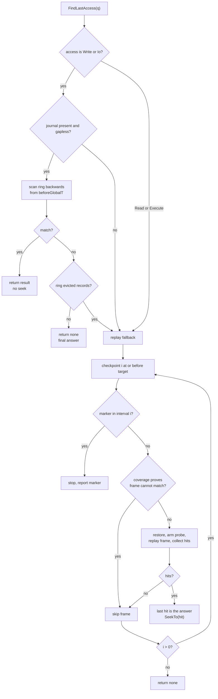
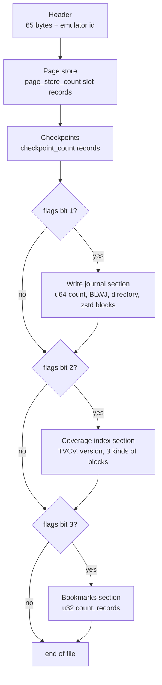
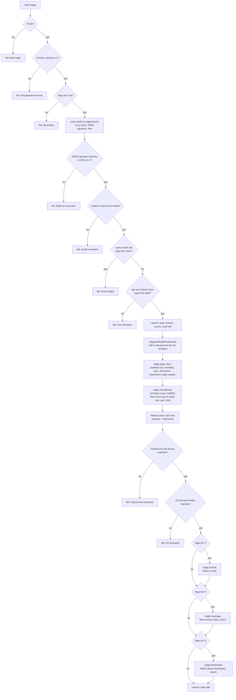

# TTD v1: architecture, data streams and the .ttd file format (as built)

| | |
|---|---|
| **Status** | Reference. Describes the code on master, 2026-09-29, including the saved replay inputs, the port journals and NeoGS layout 4 (commits `0a8236fa`, `280e4ae2`). |
| **Scope** | Time-travel debugging (TTD) v1 in `core/src/debugger/ttd/`: recording, in-memory storage, compression, restore/seek/replay, and the `.ttd` file (serialization and deserialization). |
| **Source of truth** | The code. Where an older document disagrees, this document follows the code and lists the difference in [Appendix A](#appendix-a-discrepancies-with-older-documents). |
| **Schema** | [`ttd.ksy`](../../../../../core/src/debugger/ttd/ttd.ksy) (Kaitai), [`ttddumpformat.h`](../../../../../core/src/debugger/ttd/ttddumpformat.h) (C++ constants) |
| **Related** | [time-travel-debugging-tdd.md](./time-travel-debugging-tdd.md) (design intent), [ttd-container-format.md](./ttd-container-format.md) (proposed chunked container), [overhead-and-gating.md](./overhead-and-gating.md) (measured costs), [TTD v2 migration](../../../../inprogress/2026-09-25-ttd-v2-migration/README.md) |

Citations have the form `file:line`. They were taken on master before the
saved replay inputs and the port journals landed (`435eb0cc`); those commits
grew `timetravelmanager.cpp`, so its later line numbers are off by up to a few
hundred lines - the function names given with them are the reliable
reference. Sections added for those commits (3.10, 4.13, 5.10, 7.9-7.11, 8.5)
cite functions, not lines.
Unless a path is given, `tm.cpp` means
`core/src/debugger/ttd/timetravelmanager.cpp` and `tm.h` means
`core/src/debugger/ttd/timetravelmanager.h`. Other TTD files are named without
their `core/src/debugger/ttd/` prefix.

---

## 0. Summary

TTD v1 lets a user (or a tool) go back in time inside a running ZX Spectrum
emulator. It works like this:

1. While recording, the emulator saves one **checkpoint** at the start of every
   emulated frame (50 per second). A checkpoint holds the CPU registers, the
   standard port latches, the state of every connected device, and a list of
   references to RAM contents.
2. RAM is stored once per change, not once per frame. It is cut into 4 KB
   **sub-pages**. A sub-page that did not change is shared with the previous
   checkpoint. A changed sub-page is stored as an XOR difference against its
   previous version and compressed with zstd level 1. Every 50th checkpoint is a
   **key frame** that stores every non-empty sub-page in full.
3. Side streams record extra facts: every memory and port write (the **write
   journal**), which addresses each frame executed, read and wrote (the
   **coverage index**), user input (the **input journal**), events TTD cannot
   replay (**external-event markers**), named positions (**bookmarks**), and
   every IN result and OUT of the CPU with its time and PC (the **port
   journals**, section 3.10).
4. To go to any instant, TTD restores the checkpoint at or before it and
   re-executes the machine silently up to the target (**replay**).
5. A session can be saved to a `.ttd` file and loaded back. The file holds the
   checkpoints, the page store, the write journal, the coverage index, the
   bookmarks, the input journal, the external-event markers and the port
   journals (section 7). What it still does not hold is in section 9.
6. On the classic machines a replay feeds the CPU the recorded IN values, so it
   needs no media file or host device, and the port journals answer "when did
   the program ..." questions without replaying anything
   ([ttd-port-read-journal.md](./ttd-port-read-journal.md)).



---

## 1. Terms

| Term | Meaning in this document |
|---|---|
| **Frame** | One emulated video frame. On a Pentagon it lasts 71 680 CPU T-states (20 ms at 50 Hz). `EmulatorState::frame_counter` counts them. |
| **T-state** | One CPU clock tick. |
| **tInFrame** | The position inside a frame, counted in **TTD time units** (next row). `TTDTimePoint{frame, tInFrame}` names one instant (`ttdcheckpoint.h:46`). |
| **TTD time unit / top clock** | One T-state at the model's fastest CPU clock. A machine with a hardware turbo (Scorpion, ATM 7.10: ×2; ZX-Evo: ×4; ZX Next: ×8) counts `ttd_clock_units` units per base T-state (`core/src/emulator/platform.h:1032`). Without turbo, one unit is one T-state. So a frame always spans `FrameSpan() = config.frame × ttd_clock_units` units (`tm.cpp:1987`). This keeps time monotonic when the turbo switches mid-frame. |
| **globalT** | A single number for an instant: `frame × FrameSpan() + tInFrame` (`tm.h:729`). The write journal stores it. **Careful:** the `globalT` field of a checkpoint is a different thing: it equals the frame number (`tm.cpp:890`). |
| **Checkpoint** | A saved machine state at the start of one frame (`TTDCheckpoint`, `ttdcheckpoint.h:290`). "Checkpoint N" is the machine ready to run the first instruction of frame N. |
| **Overshoot** | The last instruction of a frame usually ends a few T-states past the frame boundary. The CPU therefore starts the next frame at `z80.t` = 1..23, not 0. The checkpoint stores this in `cpu_t_in_frame` (`ttdcheckpoint.h:214`). |
| **Timeline** | The ordered list of checkpoints (`std::vector<TTDCheckpoint> _timeline`, `tm.h:1617`). |
| **Key frame (I-frame)** | A checkpoint whose RAM references do not depend on older delta chains. Every sub-page that holds data is stored as a Full slot (`tm.cpp:1044-1065`). |
| **Delta frame (P-frame)** | A checkpoint that stores only changed sub-pages, as XOR against the previous version. |
| **Page** | A 16 KB physical RAM page, numbered 0..255 (`ttdphyspage.h:19`). The emulator banks memory in these units. |
| **Sub-page** | A 4 KB quarter of a page. The compression unit (`TTDCodecPageStore::kPageSize = 4096`, `ttdcodecpagestore.h:44`). |
| **Slot** | One stored sub-page version in the page store. It has an encoding (Full, XorPrev or Zero), a reference count, an optional previous slot, a CRC32C and a compressed payload (`ttdcodecpagestore.h:205`). |
| **Refcount** | How many holders a slot has. Holders are checkpoint references and XorPrev slots that depend on it. A slot is freed when its refcount reaches 0 (`ttdcodecpagestore.cpp:213`). |
| **Delta chain** | A sequence of XorPrev slots, each pointing to the slot it was XORed against, ending at a Full or Zero slot. |
| **Page bound (`model_ram_pages`)** | The number of RAM pages TTD walks: page numbers `0 .. bound-1`. It is a bound, not a count: the 48K machine uses pages 0, 2 and 5, so its bound is 6 (`tm.cpp:1221`). |
| **Never-touched ref** | Sentinel `0xFFFFFFFF` in a slot reference meaning "not stored, the live RAM is correct". The v1 capture never produces it in practice (section 5.1). |
| **Peripheral / device blob** | The saved state of one device, produced by its `TTDSaveState` and wrapped by the registry in a 12-byte header (`ttdperipheralregistry.h:31`). |
| **Dirty page** | A 16 KB page that received at least one write since the last checkpoint (`ttddirtytracker.h`). |
| **Write journal** | A ring buffer of 12-byte records, one per memory write or port OUT (`ttdwritejournal.h:54`). |
| **Coverage index** | Per frame, the sets of physical addresses that were executed, written and read (`ttdcoverageindex.h:102`). It lets reverse searches skip frames. |
| **Input journal** | Time-stamped keyboard, mouse and General Sound host events (`ttdinputjournal.h:91`). |
| **External-event marker / barrier** | A time-stamped note that something TTD cannot reproduce happened (tape control, disk write, debugger edit). Seek and search stop at it instead of crossing it (`ttdexternalevents.h:84`). |
| **Bookmark** | A named position. It is only a note: it never stops a seek (`ttdbookmarks.h:71`). |
| **Probe** | A cheap filter armed during a replay. It records every access that matches a query, for reverse search (`ttdprobe.h:144`). |
| **Replay** | Running the emulator forward from a restored checkpoint with breakpoints, sound output and notifications suppressed (`tm.cpp:1549`). |
| **Detached** | The session state after a seek: the machine sits at a point in recorded history. |
| **Frame cache** | The decoded instruction list of one frame, built by replay, for fast reverse browsing (`timetravelframecache.h:76`). |

---

## 2. Architecture

### 2.1 Components and ownership

`TimeTravelManager` is the facade. One instance exists per emulator instance.
`Emulator::Init` creates it and stores it in `EmulatorContext::pTimeTravelManager`
(`core/src/emulator/emulator.cpp:278`). It owns everything except the dirty
tracker and the devices.



| Component | Class, file | Owner | Runs on | When |
|---|---|---|---|---|
| Facade and capture orchestrator | `TimeTravelManager`, `tm.h:311` | `EmulatorContext` | emulator thread (capture), control thread (everything else, emulator paused) | always exists |
| Timeline | `std::vector<TTDCheckpoint>`, `tm.h:1617` | manager | appended on the emulator thread only | one entry per frame while recording |
| Codec page store | `TTDCodecPageStore`, `ttdcodecpagestore.h:38` | manager | single-threaded, no locks (`ttdcodecpagestore.h:25`) | intern at capture, decode at restore |
| Dirty tracker | `TTDDirtyTracker`, `ttddirtytracker.h:48` | `Memory` (`core/src/emulator/memory/memory.h:485`) | any thread (atomic OR), collected on the emulator thread | every RAM write while TTD is enabled |
| Peripheral registry | `TTDPeripheralRegistry`, `ttdperipheralregistry.h:64` | manager; devices themselves are owned elsewhere, model serializers by `_ownedPeripherals` (`tm.h:1630`) | emulator thread (capture), control thread (restore) | built at `StartRecording` and at file load (`tm.cpp:202`, `tm.cpp:3431`) |
| Write journal | `TTDWriteJournal`, `ttdwritejournal.h:76` | manager (`unique_ptr`, `tm.h:1752`) | single producer (emulator thread), queries under pause | every write and OUT while recording |
| Coverage index | `TTDCoverageIndex`, `ttdcoverageindex.h:102` | manager | emulator thread (record, seal), control thread (queries) | every fetch, read, write while recording; sealed per frame |
| Input journal | `TTDInputJournal`, `ttdinputjournal.h:112` | manager | the thread executing the machine | when live input is applied while recording |
| External-event journal | `TTDExternalEventJournal`, `ttdexternalevents.h:104` | manager | any thread (internal mutex) | when a hook reports an unreplayable event |
| Bookmarks | `TTDBookmarkJournal`, `ttdbookmarks.h:78` | manager | any thread (internal mutex) | on user or agent request |
| Access probe | `TTDAccessProbe`, `ttdprobe.h:144` | `EmulatorContext` (inline) | armed on control thread, hit on emulator thread during replay | reverse searches only |
| Frame cache | `TTDFrameCache`, `timetravelframecache.h:76` | manager (`tm.h:1550`) | control thread | on demand, one frame at a time |
| Machine state hash | `machinestatehash.h` | free functions | any | divergence tests and `CaptureRestoreSelfTest` (`tm.cpp:3879`) |

Threading rule (`tm.h:27-31`): capture runs on the thread that completes the
frame. Every other operation (start, stop, seek, search, save, load) runs on
the control thread while the emulator is paused. There is no lock on the
timeline or on the page store.

### 2.2 Recording modes

`TTDRecordMode` (`tm.h:110`) has two values:

| Mode | Used by | Behavior |
|---|---|---|
| `Session` (0) | scrubber, WebAPI, CLI | `StartRecording` wipes and re-baselines. Protected by `RecordingGuard` (section 2.4). |
| `DebuggerLive` (1) | DeZog and other debugger adapters | Recording continues across browse cycles (`BeginDebuggerLiveHistory`, `tm.cpp:342`). Not protected by `RecordingGuard` (`tm.cpp:738`). |

### 2.3 Session state machine

`TTDSessionState` (`tm.h:79`): `Idle = 0`, `Recording = 1`, `Detached = 2`.
Every write of the state goes through `SetState` (`tm.cpp:469`), which also
engages the **recording lock** on entering `Recording` and releases it on
entering `Idle` (`tm.cpp:478-520`). The lock forces the host speed to 1x and
turns off turbo mode and the tape/disk shortcuts.



| Transition | Trigger | Code |
|---|---|---|
| Idle → Recording | `StartRecording()`: pauses the emulator, switches on the `timetravel` and `debugmode` features if needed, registers device serializers, drops old history, captures the baseline checkpoint | `tm.cpp:127-289` |
| Idle → Recording | `ResumeRecordingLive()`: only if the timeline is not empty and the present is still in the frame of the last checkpoint; else refused | `tm.cpp:2708-2791` |
| Idle / Recording → Recording (DebuggerLive) | `BeginDebuggerLiveHistory()`: adopts a running recording, else `ResumeRecordingLive`, else `StartRecording` | `tm.cpp:342-373` |
| Recording → Idle | `StopRecording()`: flushes coverage blocks, restores the `debugmode` feature if TTD switched it on | `tm.cpp:291-340` |
| Recording → Idle | `EndDebuggerLiveHistory()` calls `StopRecording` | `tm.cpp:375-386` |
| any → Idle | `InvalidateSession(reason)`: releases all refs, resets the page store, clears all journals and the coverage index | `tm.cpp:388-437` |
| Recording → Idle | a device calls `RequestInvalidation`; applied at the next `OnFrameBoundary` before the capture | `tm.cpp:776-801` |
| Recording → Idle | machine reset: `Emulator::Reset` calls `StopRecording` then `OnMachineReset` | `emulator.cpp:835-842`, `emulator.cpp:895-913` |
| Idle / Detached → Detached | public `SeekTo` (refused while Recording) | `tm.cpp:2018-2063`, `tm.cpp:2326`, `tm.cpp:2344` |
| Detached / Recording → Recording | `ResumeRecordingFrom(T)`: refused when Idle | `tm.cpp:2590-2706` |
| Detached → Idle | `OnMachineReset()` | `tm.cpp:1893-1902` |
| any → Idle | successful `DeserializeSession` | `tm.cpp:3862` |

Notes:

- `Detached` does not mean "paused". The user may resume the emulator in
  `Detached`. It then runs forward through recorded history, with input taken
  from the input journal (`OwnsInput`, `tm.cpp:1737-1751`). When the frame
  counter passes the last checkpoint, `OnFrameBoundary` pauses the emulator
  (`tm.cpp:853-870`). The state stays `Detached`.
- `GetFrameCache` replays a frame and then restores the exact previous state,
  including the session state (`tm.cpp:5234-5300`).

### 2.4 Recording guard

While a `Session` recording runs, `RecordingGuard(action)` refuses ten actions
that would end or corrupt it (`TTDGuardedAction`, `tm.h:210-222`;
messages at `tm.cpp:733-774`): load snapshot, load tape, load disk, create disk,
load ROM, discard the session, switch `timetravel` off, switch `debugmode` off,
change the write-journal mode, switch the General Sound card type. A stopped
session with history is still invalidated by these actions
(`emulator.cpp:1433`, `1650`, `1779`, `1845`, `2738`) and by a host speed
change (`emulator.cpp:618`).

---

## 3. Recording flow

### 3.1 Hook map

| Event | Hook site | TTD work | Gate |
|---|---|---|---|
| RAM write by the CPU | `Memory::MemoryWriteDebug`, `core/src/emulator/memory/memory.cpp:410-437` | `MarkDirty(physPage)`; `RecordMemoryWrite` (coverage "written" + journal record); probe check | `_feature_ttd_enabled && physPage != kPhysPageNone` (`memory.cpp:411`). ROM and cache writes are not tracked. |
| RAM write by a tool (WebAPI, Lua, snapshot loader) | `Memory::DirectWriteToZ80Memory`, `memory.cpp:1750-1785`; `MarkRamPageEdited`, `memory.cpp:1744` | `MarkDirty` only | `_feature_ttd_enabled` |
| Tool edit while recording | `Emulator::EditMemoryFromTool`, `emulator.cpp:645-660` | `RecordExternalEvent(DebuggerEdit)` then the edit | recording |
| Data read | `Memory` read path, `memory.cpp:301-323` | coverage "read" key; probe check | `ttdCoverageActive` (coverage), `_feature_ttd_enabled && probe armed` (probe) |
| Instruction fetch (M1) | `Z80` M1 path, `core/src/emulator/cpu/z80.cpp:782-803` | coverage "executed" key; probe check | `ttdCoverageActive`, probe armed |
| Before every instruction | `Z80::StepInstruction` → `StepInstructionWithWork` | `ServiceInput()`: plays due journal events, applies queued live input | `EmulatorContext::stepWork` bit `kStepWorkTtdInput` (one relaxed atomic load per step, shared with every other rare per-step job) |
| Port OUT | `PortDecoder::OnPortOutComplete`, `core/src/emulator/ports/portdecoder.cpp:353-367` | `RecordIoWrite` (journal record, `isIo = 1`); probe check | manager present; journal enabled and Recording inside |
| Frame boundary | `MainLoop::CompleteFrame`, `core/src/emulator/mainloop.cpp:420-470` | `OnFrameBoundary()`: seal coverage, capture a checkpoint | manager present; work only while Recording |
| Tape control, disk write, NeoGS media | `tape.cpp` (9 sites), `floppydriveslot.cpp:52`, `mediamanager.cpp`, `soundchip_neogs.cpp:212` | `RecordExternalEvent(...)` | Recording (checked inside, `tm.cpp:1923`) |
| Keyboard, mouse, GS automation | `DebugKeyboardManager`, `DebugMouseManager`, `Keyboard` via `SubmitLiveInput` | journal and apply on the machine's thread | refused while `OwnsInput()` |

`_feature_ttd_enabled` is `debugmode && timetravel`, or `ttdReplayActive`
(`memory.cpp:107`, `memory.cpp:1931`). This is why `StartRecording` switches
both features on (`EngageCaptureFeatures`, `tm.cpp:439-467`): without
`debugmode` the CPU uses the fast memory path, which has no dirty hook.

### 3.2 What happens on each memory write

1. The byte lands in RAM.
2. `MarkDirty(physPage)` sets one bit in `_dirty` and one in `_everDirty`
   (atomic `fetch_or`, relaxed order; `ttddirtytracker.h:65-74`).
3. `RecordMemoryWrite(addr, 0, value, m1pc, physPage)` (`tm.cpp:3956-3999`):
   - if a frame-cache build is running, the access is attached to the current
     instruction record;
   - if the state is not `Recording`, stop;
   - if coverage is on, add key `(physPage << 14) | (addr & 0x3FFF)` to the
     frame's "written" set;
   - if the journal is on, append a 12-byte record with
     `globalT = GlobalT({frame_counter, TInFrameNow()})`, `addr`, `isIo = 0`,
     `m1pc`, `value`, `physPage` (8 bits).
4. If the probe is armed (only during a reverse-search replay), a matching write
   is recorded as a hit.

The old value is not stored (`tm.cpp:3995`).

### 3.3 What happens on each port write

`RecordIoWrite(port, value, m1pc)` (`tm.cpp:4001-4026`) appends a journal record
with `isIo = 1` and `physPage = 0`. Port writes are not in the coverage index.
Port latches that matter for paging are captured at the next checkpoint from
`EmulatorState` (standard ports) or from model serializers (extended ports).

### 3.4 What happens on each instruction

Before the instruction: `ServiceInput` if the `kStepWorkTtdInput` bit of `stepWork` is set
(`z80.cpp:596`). At M1: the "executed" coverage key and the execute probe
(`z80.cpp:782-803`). The coverage `Record` is inline and uses a 16 KB
direct-mapped "recent" filter plus a 1 MB membership bitmap per kind, so a
repeated address costs one table compare (`ttdcoverageindex.h:141-173`).

### 3.5 What happens at the frame boundary

`MainLoop::CompleteFrame` runs `OnFrameEnd`, `OnFrameStart`,
`Z80::BeginFrame`, resets the screen draw cursor, applies pending media
changes, and only then calls `OnFrameBoundary` (`mainloop.cpp:420-463`). So
checkpoint N is the machine after frame N started, ready to run its first
instruction. Host input injected by automation at the boundary comes after the
capture and is journaled at `(N, t)`.

`OnFrameBoundary` (`tm.cpp:787-871`):

1. If an invalidation was requested, invalidate and return.
2. If `Recording`:
   1. drop the frame cache;
   2. seal the coverage sets under `frame_counter - 1` (the frame that just
      ended; `tm.cpp:827-829`);
   3. `CaptureNow(cp)` and append it to the timeline.
3. If `Detached` and not replaying and the frame counter passed the last
   checkpoint: request an emulator pause (auto-pause).

`CaptureNow` (`tm.cpp:882-954`):

1. `time = {frame_counter, 0}`, `globalT = frame_counter`.
2. `cpu = CaptureCpuState(z80)` (48 bytes, zeroed first so padding is
   deterministic; `ttdcheckpoint.cpp:22-73`).
3. `chipset = CaptureChipsetState(emulatorState, z80.t)` (120 bytes;
   `ttdcheckpoint.cpp:132-182`). `z80.t` is the overshoot.
4. `_peripherals.CaptureAll(peripheralBlobs)`: each registered device writes its
   state; the registry wraps and maybe compresses it (section 5.8).
5. Key or delta decision (section 3.6).
6. RAM references:
   - first checkpoint of a session: `CaptureBaselineRamPages` interns every
     sub-page of every page in `[0, model_ram_pages)` as Full or Zero
     (`tm.cpp:956-985`);
   - later: `CollectAndClear` the dirty pages, then `UpdateRamPages`
     (`tm.cpp:1005-1151`).
7. `UpdatePrevPageCache` copies all model RAM into `_prevPageCache`
   (`tm.cpp:1171-1198`). The next frame XORs against this copy instead of
   decompressing the previous slot.

### 3.6 Key frame or delta frame

```cpp
// tm.cpp:915-917
const bool isKeyFrame = _timeline.empty()
                        || _forceNextKeyFrame
                        || (out.time.frame - _lastKeyFrameIdx >= kKeyFrameInterval);   // 50
```

`kKeyFrameInterval = 50` (`tm.h:320`). `_forceNextKeyFrame` is set by
`InvalidateSession` and by a file load (`tm.cpp:426`, `tm.cpp:3848`).
`keyFrameAnchor` is the frame of the key frame the checkpoint depends on: its
own frame for a key frame, `_lastKeyFrameIdx` for a delta frame
(`tm.cpp:931-940`).

`UpdateRamPages` decides per 16 KB page, then per 4 KB sub-page:

| Page is | Key frame | Delta frame |
|---|---|---|
| dirty | each sub-page: `InternFull` | each sub-page: `InternXorCached` against the previous slot (or `InternXor` if the cache is invalid); `InternFull` if the previous ref is never-touched |
| clean, holds data (not all zero) | each sub-page: `InternFull` (key frames must be self-contained) | `AddRef` the previous 4 slots |
| clean, all zero | `AddRef` the previous 4 slots | `AddRef` the previous 4 slots |

Clean pages are never released and re-interned; the previous checkpoint keeps
its own references (`tm.cpp:1010-1032`). Dirty pages at or above the page bound
are not captured; the first such case is logged once per session
(`tm.cpp:1141-1150`).

### 3.7 Input and external events

Live input from any thread goes through `SubmitLiveInput` (`tm.cpp:1753-1777`).
If the emulator loop runs on another thread, the event is queued and
the `kStepWorkTtdInput` bit of `stepWork` is set. The machine's own thread applies it at the next
instruction boundary in `ServiceInput`. `ApplyLiveInput` journals the event
**before** applying it, stamped with the current time (`tm.cpp:1801-1810`).
So the journal time is the first instant the program can see the change.

External events: `RecordExternalEvent(kind, reason)` stores
`{frame_counter, TInFrameNow(), kind, reason[64]}` while recording
(`tm.cpp:1914-1956`). Emitted today for tape control (`TapeControl`), disk
writes (`DiskWrite`), tool memory edits (`DebuggerEdit`) and NeoGS media
actions. `HardwareReset` exists in the enum but no code emits it.

Both lists are saved in the `.ttd` file (sections 7.9 and 7.10).

### 3.8 Sequence of one recorded frame



### 3.9 Cost gating: what is on the hot path

| Path | Cost when TTD is off | Cost when recording | Source |
|---|---|---|---|
| RAM write | one cached-bool branch | 2 atomic ORs + a coverage record + a 12-byte ring append | `memory.cpp:411`, `ttddirtytracker.h:72-73`, `ttdwritejournal.cpp:57-66` |
| Data read | one bool branch (`ttdCoverageActive`) | inline filter compare, rarely a bitmap test | `memory.cpp:301` |
| Instruction | one relaxed atomic load + one bool branch | inline filter compare | `z80.cpp:596`, `z80.cpp:782` |
| Port OUT | one pointer test and a state test | 12-byte ring append | `portdecoder.cpp:353`, `tm.cpp:4010-4025` |
| Frame end | one pointer test | seal coverage (sort + varint encode, zstd every 64 frames), capture, copy all model RAM to the prev-page cache | `tm.cpp:787-834` |

Measured on Apple Silicon (release): a Pentagon frame costs 915 µs without TTD
and about 1115 µs with TTD recording, before the coverage index; the coverage
index adds about 241 µs per frame ([overhead-and-gating.md §1a](./overhead-and-gating.md)).
A full-RAM capture runs at about 750 MB/s, so a 4 MB machine's key frame costs
about 5.4 ms (same source).

Port journals (section 3.10): with no session, one pointer test per `IN` and
per `OUT`; while recording or replaying, about 10 ns per access recorded and
15 ns replayed (`BM_TTD_PortJournal_Record` / `_Play`).

### 3.10 Port journals

`Z80::in` and `Z80::out` (`core/src/emulator/cpu/z80.cpp`) hand every access
to `EmulatorContext::ttdPortReads` / `ttdPortWrites` when they are set - only
while the journals record or play:

- **Recording:** each IN result and each OUT is appended as a
  `TTDPortRecord` (section 4.13): the frame and T-state at the start of the
  I/O cycle, the PC of the instruction (`m1_pc`), the port and the value. The
  block instructions (INI/INIR/IND/INDR, OUTI/OTIR/OUTD/OTDR) add one record
  per iteration.
- **Replay:** a restore for replay (`RestoreCheckpointForReplay`) positions
  both journals at the checkpoint's cursors. The device still sees the read
  (and its side effects); the CPU gets the recorded value. A read whose live
  value differs is a *mismatch* (a missing or changed medium); an IN or OUT
  at another time, from another instruction, to another port, or an OUT of
  another value is a *divergence*. Both are counted in the session status.
  At the end of the journal the accesses go to the live devices again.
- **Lifecycle:** cleared by `StartRecording` and `InvalidateSession`; cut at
  the resume point by `ResumeRecordingFrom`; given up (with the reason) by
  `ResumeRecordingLive` after the machine ran unrecorded; saved and restored
  with the live-state snapshot around throwaway replays; loaded from the file.
- **Off**, with the reason in `TTDSessionInfo::portJournalOffReason`, on
  configurations where the outside world reaches memory or the CPU without an
  IN (`PortJournalUnsupportedReason`): TSConf, ZX Next, NeoGS in the GS slot
  (ZX-DMA), and any machine that installs an `IInterruptSource` (device IM2
  vector) or an `IMachineStepHook` (a DMA engine stepped with the CPU).

The journals are also searched without replay (`SearchPortEvents`,
`ttdportsearch.h`): "when did the program see key A", "when did it write AY
register 7" - see [ttd-port-read-journal.md](./ttd-port-read-journal.md) §10.

---

## 4. In-memory data model

Sizes marked "(host)" were measured with Apple clang on macOS arm64 (libc++).
Other 64-bit builds should match for the POD structs (they carry
`static_assert`s); containers may differ.

### 4.1 `TTDTimePoint` (`ttdcheckpoint.h:46`, 16 bytes host)

| Field | Type | Meaning |
|---|---|---|
| `frame` | `uint64_t` | frame index (`frame_counter`) |
| `tInFrame` | `uint32_t` | position in TTD time units; 0 = frame start |

Ordering is lexicographic `(frame, tInFrame)` (`ttdcheckpoint.h:55`).

### 4.2 `TTDCheckpoint` (`ttdcheckpoint.h:290`, 272 bytes host plus heap)

| Field | Type | Meaning |
|---|---|---|
| `time` | `TTDTimePoint` | `{frame, 0}` |
| `globalT` | `uint64_t` | equals `time.frame` (not the journal `globalT`) |
| `frameKind` | `TTDFrameKind` (u8) | 0 KeyFrame, 1 DeltaFrame |
| `keyFrameAnchor` | `uint64_t` | frame of the key frame this checkpoint builds on |
| `cpu` | `TTDCpuState` | 48 bytes |
| `chipset` | `TTDChipsetState` | 120 bytes |
| `peripheralBlobs` | `unordered_map<uint8_t, vector<uint8_t>>` | device id → wrapped blob |
| `ramPages` | `vector<TTDPageRef>` | one entry per page in `[0, model_ram_pages)` |
| `portReadCursor`, `portWriteCursor` | `uint64_t` each | the port journals' sizes at the capture: a replay from this checkpoint starts there (0 without journals) |

### 4.3 `TTDCpuState` (`ttdcheckpoint.h:67`, 48 bytes, byte layout pinned by `static_assert` at `ttdcheckpoint.h:131-142`)

| Offset | Field | Type | Notes |
|---|---|---|---|
| 0 | `pc` | u16 | |
| 2 | `sp` | u16 | |
| 4 | `af` | u16 | |
| 6 | `bc` | u16 | |
| 8 | `de` | u16 | |
| 10 | `hl` | u16 | |
| 12 | `ix` | u16 | |
| 14 | `iy` | u16 | |
| 16 | `alt_af` | u16 | |
| 18 | `alt_bc` | u16 | |
| 20 | `alt_de` | u16 | |
| 22 | `alt_hl` | u16 | |
| 24 | `i` | u8 | |
| 25 | `r_low` | u8 | |
| 26 | `r_hi` | u8 | bit 7 of R |
| 27 | `iff1` | u8 | |
| 28 | `iff2` | u8 | |
| 29 | `im` | u8 | |
| 30 | `halted` | u8 | |
| 31 | `reserved0` | u8 | always 0; named so member-wise copies carry it |
| 32 | `memptr` | u16 | WZ |
| 34 | `q` | u8 | |
| 35 | `boundary` | u8 | Z80BoundaryEnum: INT shadow, pending prefix, LD A,I/R quirk, NMI acknowledged |
| 36 | `eipos` | u16 | legacy, unused |
| 38 | `haltpos` | u16 | |
| 40 | `nmi_in_progress` | u8 | |
| 41 | `int_pending` | u8 | |
| 42 | `int_gate` | u8 | |
| 43 | `int_acked_in_pulse` | u8 | |
| 44 | `halt_cycle` | u32 | |

Not captured on purpose: memory-interface pointers, debugger cursors, CPU
variant configuration, decode scratch (`ttdcheckpoint.h:21-28`,
`ttdcheckpoint.cpp:118-125`). `z80.t` is captured through the chipset
(`cpu_t_in_frame`).

### 4.4 `TTDChipsetState` (`ttdcheckpoint.h:153`, 120 bytes, `static_assert` at `ttdcheckpoint.h:218-223`)

| Offset | Size | Field | Notes |
|---|---|---|---|
| 0 | 8 | `t_states` | |
| 8 | 8 | `frame_counter` | |
| 16 | 1 | `p7FFD` | 128K paging, screen, ROM |
| 17 | 1 | `pFE` | border, beeper |
| 18 | 1 | `pEFF7` | |
| 19 | 1 | `pBFFD` | AY data latch (name as in code) |
| 20 | 1 | `pFFFD` | AY register select latch (name as in code) |
| 21 | 1 | `pFF77` | |
| 22 | 1 | `border_attr` | |
| 23 | 1 | `flags` | CF_TRDOS and other run flags |
| 24 | 4 | `wd_shadow[4]` | WD1793 shadow registers |
| 28 | 16 | `comp_pal[16]` | |
| 44 | 1 | `ulaplus_mode` | |
| 45 | 1 | `ulaplus_reg` | |
| 46 | 64 | `ulaplus_cram[64]` | |
| 110 | 1 | `hw_turbo_shift` | queued hardware turbo, log2 |
| 111 | 1 | `hw_turbo_shift_applied` | |
| 112 | 1 | `current_z80_frequency_multiplier` | 0 in old files is read as 1 (`ttdcheckpoint.cpp:215`) |
| 113 | 1 | `next_z80_frequency_multiplier` | |
| 114 | 3 | `cpu_t_in_frame` | `z80.t` at capture, 24-bit little-endian (the overshoot) |
| 117 | 3 | `reserved` | always 0 |

Everything model-specific (ATM, Profi, Scorpion, +3 latches, video modes) lives
in device blobs, not here (`ttdcheckpoint.h:151`).

### 4.5 `TTDPageRef` (`ttdcheckpoint.h:262`, 16 bytes)

| Field | Type | Meaning |
|---|---|---|
| `pageSlots[4]` | `uint32_t[4]` | slot index for bytes `[0..4095]`, `[4096..8191]`, `[8192..12287]`, `[12288..16383]`, or `kNeverTouched = 0xFFFFFFFF` |

### 4.6 Page store slot (`ttdcodecpagestore.h:205`, 40 bytes host plus payload)

| Field | Type | Meaning |
|---|---|---|
| `encoding` | `Encoding` (u8) | 0 Full, 1 XorPrev, 2 Zero |
| `refcount` | `uint32_t` | holders: checkpoint refs plus XorPrev dependents |
| `prevSlot` | `uint32_t` | slot this delta applies to; 0 and meaningless unless XorPrev |
| `crc32c` | `uint32_t` | CRC32C of the reconstructed 4 KB (never of the XOR buffer) |
| `payload` | `vector<uint8_t>` | one zstd frame; empty for Zero |

The store also keeps a free list of slot indices and a 4 KB decode scratch
(`ttdcodecpagestore.h:213-219`).

### 4.7 `TTDWriteRecord` (`ttdwritejournal.h:54`, 12 bytes packed)

| Bits / bytes | Field | Meaning |
|---|---|---|
| bits 0..39 | `globalT` | TTD time of the write |
| bits 40..55 | `addr` | Z80 address, or port number |
| bit 56 | `isIo` | 1 = port OUT |
| bits 57..63 | `pad` | 0 |
| bytes 8..9 | `m1pc` | address of the first byte of the writing instruction |
| byte 10 | `value` | byte written |
| byte 11 | `physPage` | RAM page 0..255; 0 for port writes |

### 4.8 Coverage key and block

A key is 23 bits: `(pageField << 14) | (z80Address & 0x3FFF)`
(`ttdcoverageindex.h:89-92`). `pageField` is the RAM page 0..255, or 256
(`kCoverageNoPageField`) for ROM and cache, which all share one bucket.
In-memory block (`ttdcoverageindex.h:124-130`):

| Field | Type | Meaning |
|---|---|---|
| `compressed` | `vector<uint8_t>` | zstd frame of the raw block |
| `rawSize` | `uint32_t` | raw size |
| `baseFrame` | `uint64_t` | first frame |
| `frameCount` | `uint32_t` | frames covered, at most 64 |

Per kind (Executed 0, Written 1, Read 2) the index also holds one open block
being filled, the pending key list, the 16 KB recent filter and a 1 MB seen
bitmap (`ttdcoverageindex.h:266-311`). Three kinds therefore reserve about
3 MB of bitmaps plus 48 KB of filters as soon as the manager exists
(`ttdcoverageindex.cpp:47-54`).

### 4.9 `TTDInputEvent` (`ttdinputjournal.h:91`, 32 bytes host)

| Field | Type | Used by kinds |
|---|---|---|
| `time` | `TTDTimePoint` | all |
| `kind` | `TTDInputKind` (u8) | 0 Key, 1 MouseMove, 2 MouseButtons, 3 MouseWheel, 4 MouseCounters, 5 KeyboardReset, 6 GSCommand, 7 GSData, 8 GSNmi, 9 GSResetCard, 10 GSReset |
| `key` | u8 | Key (ZXKeysEnum) |
| `pressed` | bool | Key |
| `dx`, `dy` | i16 | MouseMove (delta), MouseCounters (absolute) |
| `buttonMask` | u8 | MouseButtons (active low) |
| `wheelSteps` | i8 | MouseWheel |
| `value` | u8 | GSCommand, GSData |

`ApplyInputEvent` (`ttdinputapply.cpp:26-110`) is the single place that turns
an event into a device call, for live input and playback alike.

### 4.10 `TTDExternalEvent` (`ttdexternalevents.h:84`, 88 bytes host)

| Field | Type | Meaning |
|---|---|---|
| `time` | `TTDTimePoint` | when it happened |
| `kind` | u8 | 0 TapeControl, 1 DiskWrite, 2 DebuggerEdit, 3 HardwareReset, 255 Other |
| `reason` | `char[64]` | text, truncated to 63 characters |

### 4.11 `TTDBookmark` (`ttdbookmarks.h:71`, 40 bytes host plus label)

| Field | Type | Rule |
|---|---|---|
| `time` | `TTDTimePoint` | must be at or before the session end (`tm.cpp:2084`) |
| `label` | `std::string` | non-empty, at most 63 characters, unique (`ttdbookmarks.cpp:11-35`) |

### 4.12 Other runtime structures

| Structure | File | Size (host) | Role |
|---|---|---|---|
| `TTDSearchQuery` | `ttdprobe.h:60` | — | address range, access type, optional value / PC range / physical page filters, `beforeGlobalT` |
| `TTDSearchResult` | `ttdprobe.h:107` | 24 B | time, pc, value, physPage, access |
| `TTDM1Record` | `ttdprobe.h:131` | 16 B | one instruction start: globalT, pc, physPage |
| `TTDFrameCacheEntry` | `timetravelframecache.h:53` | 56 B | per instruction: tInFrame, registers, 4 opcode bytes, word at SP, bank slots, access range |
| `TTDFrameCacheAccess` | `timetravelframecache.h:40` | 4 B | addr, value, kind |
| `LiveStateSnapshot` | `tm.h:1567` | — | CPU, chipset, all model RAM, device blobs, input cursor, keyboard, framebuffer: used to put the machine back after a sandbox replay |
| `_prevPageCache` | `tm.h:1699` | `model_ram_pages × 16 KB` | RAM at the last capture, the XOR base for the next frame |

### 4.13 `TTDPortRecord` (`ttdportjournal.h`, 24 bytes host)

| Field | Type | Meaning |
|---|---|---|
| `frame` | `uint64_t` | frame counter at the access |
| `tInFrame` | `uint32_t` | TTD time in the frame at the start of the I/O cycle |
| `port` | `uint16_t` | full 16-bit port address |
| `pc` | `uint16_t` | `m1_pc` of the IN / OUT instruction |
| `value` | `uint8_t` | the value the CPU got (IN) or wrote (OUT) |

`TTDPortJournal` keeps them in blocks of 32 768: sealed blocks compressed
(section 5.10), the newest block raw. Two journals per session:
`_portReads`, `_portWrites`.

---

## 5. Compression

### 5.1 The codec page store

RAM is stored in 4 KB sub-pages. The design note in the code: 92.9% of dirty
16 KB pages have only one dirty 4 KB quarter, so 4 KB granularity cuts storage
by about half on real workloads (`ttdcheckpoint.h:255-257`). Dirty tracking stays
at 16 KB because that is the banking unit (`ttddirtytracker.h:7-17`).

Each slot has one of three encodings (`ttdcodecpagestore.h:47-51`):

| Encoding | Value | Payload | Decode |
|---|---|---|---|
| Full | 0 | zstd frame of the 4 KB | decompress |
| XorPrev | 1 | zstd frame of `new XOR previous` (4 KB) | decode `prevSlot` (recursively), decompress the mask, XOR |
| Zero | 2 | none | fill with zeros |

**Intern functions** (`ttdcodecpagestore.cpp`):

| Function | Used for | Behavior |
|---|---|---|
| `InternFull(page)` (`:38-71`) | baseline, key frames, first capture of a sub-page | all-zero → new Zero slot; else compress; refcount 1 |
| `InternXorCached(prev, page, cachedPrev)` (`:139-181`) | delta frames, normal case | XOR against the cached previous RAM; if the XOR is all zero, `prev.refcount++` and return `prev` (no new slot); else compress both the XOR and the page and keep the smaller: XorPrev (and `prev.refcount++`) or Full |
| `InternXor(prev, page)` (`:73-137`) | delta frames when the cache is invalid (after a resume or a load) | decode `prev` without CRC check, then as above; a corrupt `prev` falls back to `InternFull` |
| `InternDirect(enc, prev, crc, payload)` (`:183-204`) | file load | stores the payload as is; XorPrev takes a ref on `prev` |

The size test (`compressedXor.size() < compressedFull.size()`,
`ttdcodecpagestore.cpp:113`, `:166`) means every dirty sub-page in a delta frame
costs two zstd compressions.

**Deduplication** is limited. There is no content hash. A sub-page is shared
only when (a) its 16 KB page was not dirty, so the previous refs are copied with
`AddRef`, or (b) it was in a dirty page but its bytes did not change, so the XOR
is zero and the previous slot is returned with an extra ref. Two identical
pages at different addresses or times are stored twice.

**Never-touched refs.** The v1 baseline interns every page of the bound, so the
`0xFFFFFFFF` sentinel is written only when `Memory::RAMPageAddress` returns null
(`tm.cpp:970-976`, `tm.cpp:1098-1102`), which cannot happen for a page below 256
(`core/src/emulator/memory/memory.cpp:1302-1312`). The five corpus files contain
no never-touched refs. The ever-dirty bitmap is maintained but not used by the
manager. Pages inside the bound that the model does not own (48K: pages 1, 3, 4)
are interned like the others.

### 5.2 zstd parameters

| Setting | Value | Source |
|---|---|---|
| Level | 1 (`kDefaultZstdLevel`) | `ttdcompression.h:42` |
| API | `ZSTD_compress` / `ZSTD_decompress` one-shot, default frame parameters | `ttdcompression.h:49-90` |
| Content size | recorded in the frame header (zstd default); `DeclaredContentSize` reads it | `ttdcompression.h:96-104` |
| Checksum | none (the zstd frame checksum flag is not set) | `ttd.ksy:259` |
| Dictionary | none | — |

A zstd-1 frame of 4096 zero bytes is 19 bytes; Zero slots avoid even that.

### 5.3 CRC32C

| Property | Value |
|---|---|
| Polynomial | Castagnoli `0x1EDC6F41`, reflected `0x82F63B78`, init `~0`, final XOR `~0` (`ttdcompression.h:138-228`) |
| Check value | `crc32c("123456789") = 0xE3069283` (standard) |
| CRC of a zero sub-page | `0x98F94189` (every Zero slot carries it) |
| Implementation | x86 SSE4.2 `crc32` builtin, ARM64 `crc32cx`/`crc32cb`, else table |
| Covers | the reconstructed 4 KB content of the slot, not the payload |
| Computed | at intern time from the live page bytes (`ttdcodecpagestore.cpp:53`, `:67`, `:111`, `:164`); taken from the file by `InternDirect` |
| Verified | only in `GetPage`, called by `RestoreRamPages` on every restore (`tm.cpp:1534`). Not verified at file load. `InternXor` decodes the previous slot without verification. The Python analyzer verifies every slot in `validate`. |
| On mismatch | the sub-page is zero-filled and a warning is logged; the restore continues (`tm.cpp:1534-1540`) |

### 5.4 Reference counting and delta chains

Invariant (`tm.cpp:1010-1032`): every slot index that appears in any
checkpoint has one refcount per appearance, and each XorPrev slot holds one more
ref on its `prevSlot`.

- `AddRef` / fresh intern: +1 (`ttdcodecpagestore.cpp:206`).
- `Release` (`ttdcodecpagestore.cpp:213-247`) walks the chain iteratively: when a
  slot reaches 0 it goes to the free list; if it was XorPrev, its `prevSlot` is
  released too, and so on.
- `ReleaseCheckpointRefs` releases all 4 × `model_ram_pages` refs of one
  checkpoint (`tm.cpp:1153-1169`). It is called by `InvalidateSession`,
  `StartRecording` (old timeline), `TruncateTimelineAfter`, the destructor and
  the capture self-test.
- Freed indices are reused LIFO by `AllocateSlot` (`ttdcodecpagestore.cpp:21-32`).

Chain depth is bounded by the key-frame interval: a key frame re-interns every
data-holding sub-page as Full, so a chain has at most 49 XorPrev links. The
corpus confirms a maximum depth of 49. Decoding a slot at depth d costs d + 1
decompressions, because `GetPageNoVerify` recurses down the chain
(`ttdcodecpagestore.cpp:253-295`).

**Thinning is not implemented.** There is no memory budget and no eviction:
`GetUsedBytes` says so (`ttdcodecpagestore.h:178-180`). The timeline grows
until the session ends. The only operations that remove checkpoints are
`TruncateTimelineAfter` (resume from the past) and invalidation.

### 5.5 Write-journal block compression

In memory the journal is a ring of 12-byte records (section 11 for sizes). In a
file it is written as blocks of up to 2048 records (`kRecordsPerBlock`,
`ttdwritejournal.cpp:167`). Each block is turned into columns, then compressed
with zstd-1 (`EncodeBlock`, `ttdwritejournal.cpp:217-264`). Columns compress far
better than interleaved records: measured 13.5x against 3.4x
(`ttdwritejournal.cpp:153-159`).

Raw block layout (before zstd), for `n` records:

| Part | Size | Content |
|---|---|---|
| `gt_bytes` | varint | byte length of the time column |
| `base_t` | varint | `globalT` of the first record |
| time column | `gt_bytes` | per record a varint `t[i] - t[i-1]` (the first is 0); a negative step is stored as 0 |
| address column | `2n` | `addr` little-endian |
| writer PC column | `2n` | `m1pc` little-endian |
| value column | `n` | `value` |
| page column | `n` | `physPage` |
| I/O bit column | `ceil(n/8)` | bit `i & 7` of byte `i >> 3` = `isIo` of record `i` |

Varints are LEB128: 7 bits per byte, low bits first, high bit = "more".
The decoder rejects any inconsistency (`DecodeBlock`, `ttdwritejournal.cpp:268-315`).
Note: because a backwards step is clamped to 0, a record whose time goes
backwards does not round-trip exactly (TTD v2 current-state B4 saw this on ATM3
before the top-clock fix).

### 5.6 Coverage-index encoding

Per kind, per frame, the distinct keys touched in that frame are sorted and
stored as (`EncodePending`, `ttdcoverageindex.cpp:136-181`):

```text
varint count
varint key[0] - 0
varint key[1] - key[0]
...
```

An empty frame still stores `count = 0`, so a block covers exactly
`[baseFrame, baseFrame + frameCount)`. Every 64 frames the raw bytes become one
zstd-1 frame (`CloseOpenBlock`, `ttdcoverageindex.cpp:183-205`). Varints here
are 32-bit LEB128 (`ttdcoverageindex.cpp:20-43`).

Queries (`FrameMayContain`, `ttdcoverageindex.cpp:101-134`) answer "maybe" when
the frame is outside the covered range or a block fails to decode. The index can
cause extra replays but must never hide a hit.

### 5.7 Device blob encoding

`TTDPeripheralRegistry::EncodeBlob` (`ttdperipheralregistry.cpp:145-169`) wraps
each device's raw state:

| Offset | Size | Field | Value |
|---|---|---|---|
| 0 | 1 | `peripheralId` | same as the map key |
| 1 | 1 | `flags` | 0 (reserved) |
| 2 | 2 | `reserved` | 0 |
| 4 | 4 | `uncompressedSize` | `TTDStateSize()` |
| 8 | 4 | `compressedSize` | zstd size, or 0 when stored raw |
| 12 | … | payload | zstd-1 frame if smaller than the raw state, else the raw state |

There is no XOR delta between checkpoints for blobs, and no per-blob version
field. `DecodeBlob` (`ttdperipheralregistry.cpp:171-209`) rejects a blob whose
header id differs from the expected id, whose raw payload size differs from
`uncompressedSize`, or whose `compressedSize` differs from the payload length.
`RestoreAll` then rejects a decoded state whose size differs from the live
device's `TTDStateSize()` (`ttdperipheralregistry.cpp:127-132`). Device layout
changes are therefore detected only by size.

The devices and their blob sizes are listed in section 5.8.

### 5.8 Registered devices

`RegisterModelPeripherals` (`tm.cpp:1286-1376`) builds the device set at
`StartRecording` and at file load. Core devices are registered by pointer
(owned by the emulator). Model serializers come from the port decoder
(`PortDecoder::CreateTTDSerializers`) and are owned by the manager. If the
decoder declares a state id (`GetTTDModelStateIds`) that no serializer covers,
recording is refused (`tm.cpp:1349-1366`).

| Model (`mem_model`) | Model serializers (ids) | Source |
|---|---|---|
| Scorpion, ProfROM Scorpion | ScorpionProfROM (6), Ds12887 (18, the SMUC clock) | `core/src/emulator/ports/portdecoder_scorpion256.cpp` `CreateTTDSerializers` |
| Profi | ProfiPaging (9), Ds12887 (18) | `portdecoder_profi.cpp` `CreateTTDSerializers` |
| ATM 7.10 | AtmPaging (8) | `portdecoder_atm710.cpp:859-868` |
| ATM3 / ZX-Evo | AtmPaging (8), EvoSdCard (15), Ds12887 (18) | `portdecoder_atm3.cpp` `CreateTTDSerializers` |
| +2A, +3 | Plus3Paging (13); Upd765 (14) only when the uPD765 exists (+3) | `portdecoder_spectrum3.cpp:445-460` |
| 48K, 128K, +2, Pentagon 128/512/1024 | none | — |

Device blobs. "Raw" is `TTDStateSize()`; the stored blob is the 12-byte header
plus the payload, compressed when that is smaller. "Hash" means the device
contributes to the peripheral hash. Paths are under `core/src/`.

| Id | Device | Class, file | Raw size (bytes) | Internal version tag | Large memory inside | Hash |
|---|---|---|---|---|---|---|
| 0 | TurboSound (two AY) | `SoundChip_TurboSound`, `emulator/sound/chips/soundchip_turbosound.cpp:472` | 981 (chip index, 2 × 73-byte AY state, write-queue timeline, phases) | none | no | no |
| 1 | Beta Disk (WD1793 + 4 drives) | `WD1793`, `emulator/io/fdc/wd1793.cpp:3829` | 251 = 143 controller + 4 × 27 drive mechanics (`static_assert` at `:3826-3827`) | none | no: disk image bytes are not captured | no |
| 2 | Tape | `Tape`, `emulator/io/tape/tape.cpp:1157` | 71 (`static_assert` at `:1155`); tape content not captured | none | no | no |
| 3 | Covox | `Covox`, `emulator/sound/covox.cpp:383` | 9 | none | no | no |
| 4 | TurboSound FM | `SoundChip_TurboSoundFM`, `emulator/sound/chips/soundchip_turbosoundfm.cpp:815` | 2008 (`static_assert` at `:794`) | u8 version 5 (checked only by `assert`) | no | yes |
| 5 | General Sound (full emulation) | `SoundChip_GeneralSound`, `emulator/sound/chips/gs/soundchip_gs.cpp:835` | 95 + card RAM: 131 167 (128 KB), 262 239 (256 KB), 524 383 (512 KB) | none | whole card RAM; the GS ROM is not captured or fingerprinted | fixed part |
| 6 | Scorpion ProfROM | `TTDScorpionProfROM`, `debugger/ttd/scorpion/ttdscorpionprofrom.h:63` | 8 | none | no | yes |
| 7 | Kempston mouse | `Mouse`, `emulator/io/mouse/mouse.cpp:218` | 8 | u8 version 1 (not checked) | no | yes |
| 8 | ATM paging | `TTDAtmPaging`, `debugger/ttd/atm/ttdatmpaging.h:75` | 136 | none | no: CMOS / NVRAM contents excluded | yes |
| 9 | Profi paging | `TTDProfiPaging`, `debugger/ttd/profi/ttdprofipaging.h:42` | 34 | none | no | yes |
| 10 | MoonSound (OPL4) | `SoundChip_Moonsound`, `emulator/sound/chips/soundchip_moonsound.cpp:480` | 40 + OPL4 state; about 4 366 on arm64 (not `static_assert`ed) | `"MSND"` magic + layout 2, inner `"OPL4"` v5 (checked) | wave SRAM **not** captured | yes |
| 11 | General Sound, lightweight player | `SoundChip_GSLightweight`, `emulator/sound/chips/gs/soundchip_gslw.cpp:1311` | 334 + uploaded module bytes, up to 524 622 (**varies at run time**) | ends with a `"GSMP"` guard | uploaded module | yes, without the module |
| 12 | NeoGS | `SoundChip_NeoGS`, `emulator/sound/chips/neogs/soundchip_neogs.cpp` `TTDStateSize` | 21 536: registers and device state only | u8 layout 4 (checked) | no: RAM and flash are left out (layout 3 carried them, up to 4.7 MB a checkpoint); large memories wait for TTD v2 regions | yes |
| 13 | +2A/+3 paging | `TTDPlus3Paging`, `debugger/ttd/plus3/ttdplus3paging.h:33` | 4 | none | no | yes |
| 14 | +3 uPD765 | `TTDPlus3Fdc` → `UPD765`, `emulator/io/fdc/upd765.cpp:1376` | 384 (drives travel in blob 1) | none | no | yes |
| 15 | ZX-Evo SD card interface | `TTDEvoSdCard`, `debugger/ttd/atm/ttdevosdcard.cpp:20` | 2692 (Z-Controller latch + SPI protocol state) | u8 version 1 (checked) | no: card sectors excluded by design | yes |
| 17 | IDE board (ATA channel) | `TTDAtaChannel`, `debugger/ttd/ide/ttdatachannel.cpp` | 4 + adapter latches + 2 units (task file, transfer, ATAPI sense); registered on any machine with an `[HDD] Scheme` | none | no: the media are not captured | yes |
| 18 | MC146818 / DS12887 clock | `TTDDs12887` → `Ds12887`, `debugger/ttd/ttdds12887.cpp` | 336 (80 + 256 cells: cells, address latch, time base) | none | no | yes |

The AY chip (73 bytes), the floppy drive (27 bytes) and the uPD765 implement
`TTDSerializable` too, but they travel inside the blobs above instead of being
registered on their own.

What the corpus shows after compression (Pentagon 128K with TurboSound FM,
classic GS and MoonSound): Beta Disk 64 B, tape 34 B, Covox 21 B, TurboSound FM
112–517 B, GS 77–5 487 B (131 KB raw), mouse 20 B, MoonSound 204–415 B.

Findings about the blobs:

- **Blob size limit, the same both ways** (fixed in `0a8236fa`). `WriteBlob`
  and `ReadBlob` share `kMaxPeripheralBlobBytes` (16 MiB, `ttddumpformat.h`):
  a file that saves also loads. Before, only the reader had a limit (1 MiB),
  and a NeoGS card with incompressible RAM saved and then failed to load; NeoGS
  blobs no longer carry the RAM anyway.
- **Variable size breaks restore for the lightweight GS player.** Its
  `TTDStateSize()` depends on the uploaded module. `RestoreAll` skips a blob
  whose size differs from the live device's size and counts a size mismatch
  (`ttdperipheralregistry.cpp:127-132`).
- **A device that refuses its blob is still counted as restored.**
  `TTDLoadState` returns nothing, so a device that rejects a bad magic or
  version keeps its live state while `RestoreAll` counts it in `restored`
  (`ttdperipheralregistry.cpp:134-135`).

### 5.9 Worked example: 300 frames of a Pentagon 128K

Numbers below come from the fixture `testdata/ttd/active_demo.ttd` (Dizzy Y,
Pentagon 128K, 301 checkpoints, 1 101 658 bytes), parsed with the analyzer's
reader. The model has 8 pages, so 32 sub-pages.

**Baseline (checkpoint 0).** 32 sub-pages become 32 new slots, Full or Zero.

**A delta frame.** On average 2.26 new slots appear per delta checkpoint (max
16). A typical XorPrev payload is 39 bytes (median 38). On disk each slot adds a
17-byte record header, so the RAM change of an average frame costs about
2.26 × (17 + 39) ≈ 127 bytes.

**A key frame.** Every 50th checkpoint. In this file each key frame adds 16 new
slots (the pages that hold data); the rest are shared zero pages. A Full payload
averages 1 402 bytes (a 2.9x ratio on 4 096 bytes).

**Totals for the page store.** 710 live slots: 84 Full (117 770 payload bytes),
582 XorPrev (22 471 bytes), 44 Zero. With record headers the page-store section
is 152 311 bytes. The raw RAM it represents is 301 × 128 KiB = 39.5 MB, so
the page store is about 260x smaller than raw.

**The checkpoint records cost more than the RAM.** Each checkpoint record is 323
bytes of fixed fields (25 + 48 + 120 + 128 refs + 2) plus the device blobs. In
this file the blobs are: Beta Disk 64 B, tape 34 B, Covox 21 B, TurboSound FM
112–190 B, General Sound 77–5 487 B (mean 2 031 B), Kempston mouse 20 B,
MoonSound 204–415 B. The checkpoint section is 906 982 bytes, 3 013 bytes per
checkpoint, 82% of the file.

**Other sections.** Write journal: 39 432 records (131 per frame), 20 blocks,
33 363 compressed bytes (14.2x against 12-byte records). Coverage index: 8 281
bytes for three kinds over 300 frames.

Across the corpus the ratios vary:

| Fixture | File | Page store | Checkpoints | Journal | Coverage | New slots / delta frame | XorPrev mean payload |
|---|---|---|---|---|---|---|---|
| `active_demo.ttd` | 1 101 658 | 152 311 | 906 982 | 34 019 (14.2x) | 8 281 | 2.26 | 39 B |
| `demo_7threality.ttd` | 1 257 553 | 670 383 | 492 631 | 82 879 (8.8x) | 11 595 | 2.95 | 54 B |
| `demo_across-the-edge-second.ttd` | 3 804 649 | 697 185 | 491 706 | 2 600 782 (3.4x) | 14 911 | 6.80 | 62 B |
| `idle_session.ttd` | 1 232 610 | 64 825 | 897 712 | 264 560 (8.1x) | 5 448 | 1.17 | 45 B |
| `tsfm_tech_support.ttd` | 1 727 169 | 470 284 | 998 459 | 229 789 (7.2x) | 28 572 | 2.60 | 93 B |

(Section sizes in bytes include their headers; the journal ratio is against
12-byte records. Coverage totals include the 8-byte section header and 20-byte
block headers.)

### 5.10 Port-journal block encoding

A block of up to 32 768 records is five columns, each one field of every
record, then zstd level 1 and a CRC32C of the raw block
(`TTDPortJournal::RawLayout`, `MakeBlock`):

| Column | Width | Content |
|---|---|---|
| ports | u16 | the port of each record |
| values | u8 | the value |
| PCs | u16 | the instruction address |
| frame deltas | u32 | frames since the previous record (0 for the first; the block header holds its base frame) |
| T-states | u32 | absolute for the first record and when the frame changed, else the step from the previous record |

A polling loop repeats its port, PC and T-state step, so those columns shrink
to almost nothing. Measured on real recordings
(`testdata/ttd/port-journals/`): the ROM loading a game from tape (36 000 IN
a second) costs about 7.7 KB of journal a second; a game played from the
keyboard about 1.7 KB.

---

## 6. Restore, seek and replay

### 6.1 Restoring a checkpoint

`RestoreCheckpoint(cp)` (`tm.cpp:1387-1461`) runs in this order:

1. CPU registers: `RestoreCpuState` (host-side fields are kept).
2. Chipset: `RestoreChipsetState` into `EmulatorState`.
3. `z80.t = cpu_t_in_frame`, then `RecomputeFrameTiming()` (frame length and INT
   window follow the restored clock multiplier).
4. Devices: `_peripherals.RestoreAll(blobs)`. This runs **before** the paging
   rebuild because model serializers restore latches that feed the paging logic
   (Scorpion ProfROM plane, #1FFD). An incomplete result (missing blobs, size
   mismatches, unclaimed blobs) is logged, not fatal (`tm.cpp:1431-1436`).
5. `Memory::UpdateZ80Banks()` rebuilds the four 16 KB banks from the latches.
6. RAM: `RestoreRamPages` decodes and copies **every** referenced sub-page
   (`tm.cpp:1501-1543`). Decoding an XorPrev slot walks its chain. A CRC
   failure zero-fills that sub-page.
7. Screen: `ResyncScreenState` re-detects the video mode, the active screen, the
   border color, resets the draw cursor and calls `InitFrame`. It does not paint
   pixels (`tm.cpp:1463-1499`).

`RestoreCheckpointForReplay` adds `ArmInputPlayback`: the input cursor is placed
at the first journal event at or after the restored time (`tm.cpp:1873-1884`,
`tm.cpp:1904-1908`).



### 6.2 Seek

Public `SeekTo(target)` (`tm.cpp:2018-2063`) is refused while `Recording`.
`SeekToInternal` (`tm.cpp:2188-2357`):

1. Refuse if the timeline is empty or `target.frame` is past the last
   checkpoint's frame.
2. Binary search (`upper_bound`) for the last checkpoint with
   `cp.time <= target`.
3. `RestoreCheckpointForReplay(cp)`.
4. If `target.tInFrame` is past the restored overshoot:
   - if a marker lies in `(cp.time, target]`, replay only up to the marker,
     set `Detached`, and report `haltReason = ExternalEvent` with the marker;
   - else `ReplayWithinFrame(frame, target.tInFrame)`.
5. Set `Detached`, report `Target`.

After a successful seek (or a marker halt), `PresentPosition` composes the
picture in a sandbox (`ComposeDisplay`, `tm.cpp:2418-2517`): for a frame
target (tInFrame 0) the frame's final picture, for a time target what the beam
drew up to that instant. It saves and restores the full live state around the
extra replays.

Frame steps go to `{frame ± 1, 0}` (`tm.cpp:2552`, `tm.cpp:2583`).

### 6.3 Silent replay

`ReplayWithinFrame` (`tm.cpp:2359-2401`) wraps `RunToTInFrame` in
`EnterReplayMode` / `ExitReplayMode`:

| Effect of `EnterReplayMode` (`tm.cpp:1549-1594`) |
|---|
| `ttdReplayActive = true` (breakpoints skipped, notifications and analyzers suppressed, no capture, no journaling since the state is not `Recording`) |
| sound output muted; devices still advance |
| CPU debug memory path forced on for the replay (probes and frame-cache capture live there); restored afterwards |

`RunToTInFrame` (`tm.cpp:1995-2009`) calls `Emulator::RunTStates` with the
remaining T-states at the current clock, loops while the frame and the turbo
allow, and stops if no progress is made. Recorded input is applied by
`ServiceInput` before each instruction, at the exact recorded boundaries.



### 6.4 Barriers

A marker at `m` blocks any replay that would run through `m`:
`FirstMarkerInInterval(from, to)` returns the first marker with
`from < m.time <= to` (`ttdexternalevents.cpp:14-40`). A marker exactly at the
restore point does not block: its effect is already in the checkpoint.
Frame-aligned seeks never replay, so they never meet a barrier.

Seek, `FindLastAccess`, `EnumerateM1InRange` (and so the reverse step and
reverse continue operations built on it) all check barriers. Bookmarks never
act as barriers.

### 6.5 Reverse search: find-last

`FindLastAccess(query)` (`tm.cpp:4028-4285`) finds the newest access before
`beforeGlobalT` (default: now):



Rules:

- The journal answers only when `_journalGapless` is true: the journal ran from
  the session start without a pause (`tm.cpp:4100-4106`). A "no match" is final
  only if the ring evicted nothing (`tm.cpp:4123-4130`).
- The journal path returns without moving the machine. The replay path seeks to
  the hit (`tm.cpp:4275`).
- Coverage pruning applies to Read and Execute queries whose address range fits
  one non-wrapping 16 KB offset interval (`CanPruneByCoverage`, `tm.h:1057-1071`).

### 6.6 Reverse step and reverse continue

| Operation | Method | Strategy |
|---|---|---|
| Step back one instruction | `StepBackInstruction` (`tm.cpp:4287`) | `FindLastAccess(Execute, before = now - 1)` |
| Step forward one instruction | `StepForwardInstruction` (`tm.cpp:4330`) | `RunTStates(1)` in replay mode |
| Step back N instructions | `ReverseStepInstructions` (`tm.cpp:4558`) | N ≤ 4: repeat the single step (`kReverseSeqStepMaxN`, `tm.h:1175`); else enumerate all M1 records in `[now - 23N - FrameSpan, now)` and seek to the N-th from the end |
| Step back N T-states | `ReverseStepTStates` (`tm.cpp:4667`) | enumerate one frame before the target, land on the last M1 at or before it |
| Reverse continue | `ReverseContinue` (`tm.cpp:4743`) | with coverage: walk frames newest first, enumerate only candidate frames (breakpoint offsets present), stop at the first hit or at a marker; then scan the uncovered prefix; without coverage: enumerate everything |

`EnumerateM1InRange` (`tm.cpp:4385-4556`) restores each checkpoint in the range,
arms the Execute probe for the whole address space, replays, and collects
`TTDM1Record`s, walking backwards and stopping at a barrier.

### 6.7 Frame cache

`GetFrameCache(frame)` (`tm.cpp:5234-5300`) returns decoded per-instruction
records for one frame. On a miss it saves the live state (`SaveLiveState`), replays
the frame with an M1 capture hook (`BuildFrameCache`, `tm.cpp:5064`), and puts
the live state back (`RestoreLiveState`). Only one frame is cached at a time.
It is dropped on every recorded frame boundary, on `StartRecording`,
`ResumeRecordingFrom`, `ResumeRecordingLive`, `InvalidateSession` and file load.
It is not allowed while `Recording`, except in `DebuggerLive` mode with the
emulator paused.

### 6.8 Resume from the past

`ResumeRecordingFrom(T)` (`tm.cpp:2590-2706`):

1. `SeekToInternal(T)`.
2. `TruncateTimelineAfter(T)`: release and erase checkpoints with
   `cp.time > T` (`tm.cpp:2793-2828`).
3. Invalidate the prev-page cache (the next delta decodes the previous slot).
4. Cut the input journal, markers, bookmarks and write journal after
   `max(T, current position)` (the restore leaves the CPU at the overshoot).
5. Re-engage capture features and set `Recording`.

The coverage index is cut at the resume point too (since `0a8236fa`; a resume in
the middle of a frame marks that frame a hole the index proves nothing
about), and so are the port journals.

---

## 7. The .ttd file format

### 7.1 General rules

- **Endianness:** little-endian for every multi-byte field. The writer
  `static_assert`s a little-endian host (`tm.cpp:56-63`) and writes structs
  in host order. Flag bit 0 must be set; a reader refuses a file without it
  (`tm.cpp:3309`).
- **Packing:** fields are written one after another with no padding. The CPU and
  chipset structs are written whole (`WritePod`), and they have no implicit
  padding by construction (section 4.3, 4.4).
- **One pass, no seeks:** the writer streams sections in order; so does the
  reader (`tm.h:441`, `tm.h:455`).
- **Section order:** header, page store, checkpoints, then the optional write
  journal, coverage index and bookmarks, in that order, each present only if
  its flag bit is set.



### 7.2 Header

Written at `tm.cpp:2987-3057`. `L` is the emulator id length.

| Offset | Size | Type | Field | Writer value | Reader check |
|---|---|---|---|---|---|
| 0 | 4 | char[4] | `magic` | `"TTDD"` (`ttddumpformat.h:32`) | must match (`tm.cpp:3291`) |
| 4 | 2 | u16 | `schema_version` | 1 (`ttddumpformat.h:48`) | must equal 1 (`tm.cpp:3299`) |
| 6 | 2 | u16 | `flags` | see 7.3 | bit 0 required; bit 5 required on turbo models |
| 8 | 1 | u8 | `model_id` | `config.mem_model` (eModel) | must equal the live model (`tm.cpp:3356-3365`) |
| 9 | 2 | u16 | `model_ram_pages` | page bound (1..256) | not checked against the live model |
| 11 | 2 | u16 | `cpu_state_size` | `sizeof(TTDCpuState)` = 48 | must equal (`tm.cpp:3378`) |
| 13 | 2 | u16 | `chipset_state_size` | `sizeof(TTDChipsetState)` = 120 | must equal (`tm.cpp:3384`) |
| 15 | 8 | u64 | `rom_signature` | FNV-1a 64 of the ROM region (7.13) | must match unless either side is 0 (`tm.cpp:3335-3347`) |
| 23 | 8 | u64 | `captured_at_unix_ms` | wall clock at save time | stored as provenance |
| 31 | 1 | u8 | `emulator_id_len` | 0..255 | — |
| 32 | L | UTF-8 | `emulator_id` | `Emulator::GetSymbolicId()`, cut to 255 bytes | ignored |
| 32+L | 1 | u8 | `session_state` | 0 idle, 1 recording, 2 detached, at save time | ignored |
| 33+L | 8 | u64 | `session_start_frame` | first checkpoint's frame, or 0 | logged only |
| 41+L | 8 | u64 | `session_end_frame` | last checkpoint's frame, or 0 | logged only |
| 49+L | 4 | u32 | `page_store_count` | number of live slots | drives the slot loop |
| 53+L | 4 | u32 | `checkpoint_count` | timeline length | drives the checkpoint loop (no pre-allocation) |
| 57+L | 8 | u8[8] | `reserved` | zeros | skipped, not checked |
| 65+L | | | end of header | | |

The five corpus files have `L = 0`, so a 65-byte header.

### 7.3 Flags

| Bit | Mask | Constant (`ttddumpformat.h`) | Meaning | Set by the writer when | Reader |
|---|---|---|---|---|---|
| 0 | `0x0001` | `kFlagsLittleEndian` (`:52`) | little-endian | always | required |
| 1 | `0x0002` | `kFlagsHasWriteJournal` (`:56`) | write-journal section follows the checkpoints | journal enabled **now**, exists and not empty (`tm.cpp:2994-2997`) | parses the section; failure is fatal |
| 2 | `0x0004` | `kFlagsHasCoverageIndex` (`:66`) | coverage section follows | coverage enabled and at least one executed frame sealed (`tm.cpp:3004-3008`) | parses; failure drops the index only |
| 3 | `0x0008` | `kFlagsHasBookmarks` (`:75`) | bookmarks section follows | at least one bookmark (`tm.cpp:3011-3013`) | parses; failure drops bookmarks only |
| 4 | `0x0010` | `kFlagsWriteJournalComplete` (`:83`) | the journal holds every write of the session | bit 1 set, `_journalGapless`, no evicted records (`tm.cpp:2998-2999`) | decides whether find-last may trust the journal |
| 5 | `0x0020` | `kFlagsTopClockTime` (`:92`) | all in-frame positions are in top-clock units | always (`tm.cpp:2995`) | required when `ttd_clock_units > 1` (`tm.cpp:3366-3371`) |
| 6 | `0x0040` | `kFlagsHasInputJournal` | input-journal section follows the bookmarks (section 7.9) | always, empty or not | parses; failure is fatal. Absent: the session loads and reports its input history incomplete |
| 7 | `0x0080` | `kFlagsHasExternalEvents` | external-event section follows (section 7.10) | always | parses; failure is fatal |
| 8 | `0x0100` | `kFlagsHasPortJournals` | the port journals follow (section 7.11) | the session holds all of its history's I/O (a configuration they isolate, recorded without a gap) | parses and checks every block; failure is fatal. Absent: replay reads the live devices |
| 9..15 | | | reserved | 0 | not checked |

The corpus files carry `flags = 0x0037`: bits 0, 1, 2, 4 and 5 (recorded before
bits 6-8; no bookmarks). The port-journal fixtures
(`testdata/ttd/port-journals/`) carry `0x01F7`.

### 7.4 Page-store section

`page_store_count` records, one per live slot (refcount > 0), in ascending
in-memory slot order, renumbered `0 .. N-1` (`tm.cpp:2975-2984`, `tm.cpp:3071-3127`).

| Offset | Size | Type | Field | Notes |
|---|---|---|---|---|
| 0 | 1 | u8 | `encoding` | 0 Full, 1 XorPrev, 2 Zero |
| 1 | 4 | u32 | `refcount` | in-memory refcount at save time; informational, the reader rebuilds its own |
| 5 | 4 | u32 | `prev_slot` | compact index of the base slot for XorPrev; `0xFFFFFFFF` otherwise |
| 9 | 4 | u32 | `crc32c` | CRC32C of the reconstructed 4 KB |
| 13 | 4 | u32 | `payload_size` | 0 for Zero; else the zstd frame length |
| 17 | n | u8[n] | `payload` | zstd frame, decompresses to 4096 bytes |

Slot remapping: `slotRemap[inMemoryIndex] = compactIndex`, built by walking the
store and numbering live slots in order. `prev_slot` and every checkpoint
reference go through the map. A reference to a slot not in the map aborts the
save (`tm.cpp:3088-3094`, `tm.cpp:3165-3174`). Dead slots (refcount 0) are not
written, so the file size follows the live working set.

The payload is copied from memory as is: no decompress and recompress
(`tm.cpp:3069-3070`).

### 7.5 Checkpoint table

`checkpoint_count` records, in timeline order (ascending time). Written at
`tm.cpp:3130-3200`. `P = model_ram_pages`.

| Offset | Size | Type | Field | Notes |
|---|---|---|---|---|
| 0 | 8 | u64 | `frame` | |
| 8 | 8 | u64 | `global_t` | equals `frame` |
| 16 | 1 | u8 | `frame_kind` | 0 key, 1 delta |
| 17 | 8 | u64 | `keyframe_anchor` | |
| 25 | 48 | struct | `cpu` | `TTDCpuState`, section 4.3 |
| 73 | 120 | struct | `chipset` | `TTDChipsetState`, section 4.4 |
| 193 | 16P | u32[4P] | `ram_sub_slots` | `[page × 4 + sub]`, compact slot index or `0xFFFFFFFF` |
| 193+16P | 2 | u16 | `peripheral_blob_count` | at most 64 on read |
| 195+16P | … | | blob list | `count` entries, sorted by id ascending |

Each blob entry:

| Offset | Size | Type | Field |
|---|---|---|---|
| 0 | 1 | u8 | `peripheral_id` |
| 1 | 4 | u32 | `size` (bytes that follow; at most 1 MiB on read) |
| 5 | size | u8[] | the wrapped blob: 12-byte `PeripheralBlobHeader` + payload (section 5.7) |

If a checkpoint has fewer page refs than `P` (should not happen), the missing
refs are written as `0xFFFFFFFF` (`tm.cpp:3152-3160`).

For a Pentagon 128K (`P = 8`), the fixed part of a checkpoint record is
`25 + 48 + 120 + 128 + 2 = 323` bytes.

### 7.6 Write-journal section (flag bit 1)

Written by `TTDWriteJournal::Serialize` (`ttdwritejournal.cpp:319-387`).

| Part | Size | Type | Content |
|---|---|---|---|
| `record_count` | 8 | u64 | live records in the ring |
| `magic` | 4 | u32 | `0x4A574C42`, bytes `42 4C 57 4A` = `"BLWJ"` |
| `block_count` | 4 | u32 | `ceil(record_count / 2048)` |
| directory | 32 × `block_count` | | one entry per block, below |
| payloads | sum of `compressed_size` | | zstd frames, back to back, in directory order |

Directory entry (`BlockDirEntry`, `ttdwritejournal.cpp:179-187`):

| Offset | Size | Type | Field |
|---|---|---|---|
| 0 | 8 | u64 | `first_global_t` |
| 8 | 8 | u64 | `last_global_t` |
| 16 | 4 | u32 | `record_count` (1..2048) |
| 20 | 4 | u32 | `compressed_size` |
| 24 | 4 | u32 | `raw_size` |
| 28 | 4 | u32 | `reserved` (0) |

Records are written oldest first (`_seqTail .. _seqHead`). The raw block layout
is in section 5.5. `global_t` values here are TTD time units since frame 0.

### 7.7 Coverage-index section (flag bit 2)

Written by `TTDCoverageIndex::Serialize` (`ttdcoverageindex.cpp:477-529`). The
open block is compressed on the fly so the tail of a live session is not lost.

| Part | Size | Type | Content |
|---|---|---|---|
| `magic` | 4 | u32 | `0x56435654`, bytes `54 56 43 56` = `"TVCV"` |
| `version` | 2 | u16 | 2 (1 is parsed and then dropped) |
| `kind_count` | 2 | u16 | 3 |
| per kind, in order Executed, Written, Read: | | | |
| `block_count` | 4 | u32 | |
| per block: `base_frame` | 8 | u64 | |
| `frame_count` | 4 | u32 | 1..64 |
| `raw_size` | 4 | u32 | |
| `comp_size` | 4 | u32 | |
| payload | comp_size | u8[] | zstd frame of the raw block (section 5.6) |

The covered range is rebuilt from the blocks on load, never stored
(`ttdcoverageindex.cpp:579-594`).

### 7.8 Bookmarks section (flag bit 3)

Written at `tm.cpp:3234-3255`, field by field (no padding).

| Part | Size | Type |
|---|---|---|
| `count` | 4 | u32 (at most 4096 on read) |
| per bookmark: `frame` | 8 | u64 |
| `t_in_frame` | 4 | u32 |
| `label_len` | 1 | u8 (1..63) |
| `label` | label_len | UTF-8 bytes |

Bookmarks are written in time order (their journal keeps them sorted).

### 7.9 Input-journal section (flag bit 6)

Written by `WriteInputJournalSection` after the bookmarks, field by field.

| Part | Size | Type |
|---|---|---|
| `count` | 4 | u32 (at most `kMaxInputEvents` = 2^24) |
| per event: `frame` | 8 | u64 |
| `t_in_frame` | 4 | u32 |
| `kind` | 1 | u8, `TTDInputKind` 0..10 (Key, MouseMove, MouseButtons, MouseWheel, MouseCounters, KeyboardReset, GSCommand, GSData, GSNmi, GSResetCard, GSReset); unknown refused |
| `key` | 1 | u8 |
| `pressed` | 1 | u8, 0 or 1 (anything else refused) |
| `dx`, `dy` | 2 + 2 | s16 |
| `button_mask` | 1 | u8 |
| `wheel_steps` | 1 | s8 |
| `value` | 1 | u8 |

21 bytes an event; events in time order (an earlier one after a later one is
refused).

### 7.10 External-event section (flag bit 7)

Written by `WriteExternalEventSection` after the input journal.

| Part | Size | Type |
|---|---|---|
| `count` | 4 | u32 (at most `kMaxExternalEvents` = 2^20) |
| per marker: `frame` | 8 | u64 |
| `t_in_frame` | 4 | u32 |
| `kind` | 1 | u8, `TTDExternalEventKind`; unknown values are kept (every marker is a barrier) |
| `reason_len` | 1 | u8, 0..63 |
| `reason` | reason_len | bytes, no terminator |

### 7.11 Port-journal section (flag bit 8)

The IN journal, then the OUT journal (`TTDPortJournal::Serialize`), each:

| Part | Size | Type |
|---|---|---|
| `record_count` | 8 | u64 |
| `block_records` | 4 | u32, 32 768 (other values refused) |
| `block_count` | 4 | u32, ceil(record_count / block_records) |
| per block: `records` | 4 | u32, 1..32 768; all but the last full |
| `base_frame` | 8 | u64, the first record's frame |
| `crc32c` | 4 | u32, of the raw block (section 5.10) |
| `compressed_size` | 4 | u32, at most 32 768 × 13 + 4096 |
| payload | compressed_size | zstd frame of `records × 13` bytes |
| `cursor_count` | 4 | u32, equals the checkpoint count |
| per checkpoint: `cursor` | 8 | u64, non-decreasing, at most `record_count` |

### 7.12 Determinism of the output

The same session saved twice gives the same bytes except `captured_at_unix_ms`:

- device blobs are written sorted by id, because the in-memory map is unordered
  (`tm.cpp:3182-3191`);
- CPU and chipset structs are zeroed before capture and have named filler bytes
  instead of implicit padding (`ttdcheckpoint.cpp:31`, `:140`);
- reserved header bytes are written as zeros (`tm.cpp:3052-3057`);
- the page store is walked in index order;
- bookmarks are written field by field.

The corpus README confirms that 4 of 5 fixtures re-record byte-identical except
the timestamp; `idle_session` differs because power-on RAM is randomized
(`testdata/ttd/README.md`).

### 7.13 Checksums and hashes

| Name | Algorithm | Covers | Computed | Stored | Verified |
|---|---|---|---|---|---|
| Slot CRC | CRC32C (Castagnoli) | the reconstructed 4 KB of one slot | at intern (`ttdcodecpagestore.cpp:53`, `:67`, `:111`, `:164`) | page-store record, offset 9 | at every restore (`GetPage`, `tm.cpp:1534`); by the analyzer's `validate`; **not** at load |
| ROM signature | FNV-1a 64 (`HashBytes`, `machinestatehash.cpp:25-38`) | the whole ROM region: `MAX_ROM_PAGES × 16 KB = 128 × 16 KB = 2 MiB` (`tm.cpp:1270-1284`) | at save and at load | header offset 15; 0 = unknown, a real hash of 0 is stored as 1 | at load (`tm.cpp:3335-3347`) |
| Struct sizes | not a checksum; layout drift guard | `TTDCpuState`, `TTDChipsetState` | at save | header offsets 11, 13 | at load, must match |
| Blob id | duplicate id | map key vs `PeripheralBlobHeader.peripheralId` | at capture | both | at decode (`ttdperipheralregistry.cpp:183`) |
| zstd content size | zstd frame header | declared decompressed size | by zstd | inside each frame | coverage blocks: must equal `raw_size` at load (`ttdcoverageindex.cpp:570`); all frames: `Decompress` requires the exact size |
| Machine state hash | FNV-1a 64 over `MachineStateSnapshot` (CPU, standard ports, registry hash, counters, RAM digest) | architectural state | divergence tests, `CaptureRestoreSelfTest` (`tm.cpp:3879-3937`) | not stored in the file | tests only |
| Peripheral hash | XOR of each device's `TTDHashState()` rotated left by its id (`ttdperipheralregistry.cpp:52-78`) | model-specific state | inside the machine state hash | not stored | tests only |
| Port-journal block CRC | CRC32C | the raw five-column block | when a block is sealed and when the open block is written | per block header | at load, every block (with the decompressed size and the time order of the records) |

There is no checksum over the header, the checkpoint records, the device blobs,
the write journal, the input journal, the markers or the file as a whole. A flipped bit in a journal block that
still decodes is not detected (`testdata/ttd/README.md`, "Inspecting a fixture").

---

## 8. Deserialization

### 8.1 Validation order

`DeserializeSession(in, err)` (`tm.cpp:3285-3877`) reads the header and checks,
in this order:



| Step | Check | Fatal? | Code |
|---|---|---|---|
| 1 | magic `TTDD` | yes | `tm.cpp:3288-3295` |
| 2 | `schema_version == 1` | yes | `tm.cpp:3297-3305` |
| 3 | flag bit 0 | yes | `tm.cpp:3307-3313` |
| 4 | ROM signature equal, unless the file or the live machine reports 0 | yes | `tm.cpp:3335-3347` |
| 5 | `model_id` equals `config.mem_model` | yes | `tm.cpp:3356-3365` |
| 6 | flag bit 5 present when `ttd_clock_units > 1` | yes | `tm.cpp:3366-3371` |
| 7 | `cpu_state_size == 48`, `chipset_state_size == 120` | yes | `tm.cpp:3378-3389` |
| 8 | model serializers can be built for every declared state id | yes | `tm.cpp:3429-3436` |
| 9 | per slot: `payload_size <= 8192`, known encoding, XorPrev `prev_slot < i`, compact index preserved | yes | `tm.cpp:3450-3512` |
| 10 | per checkpoint: each ref `< page_store_count` or `0xFFFFFFFF`; blob count `<= 64`; each blob `<= 16 MiB` (`kMaxPeripheralBlobBytes`) | yes | `tm.cpp:3521-3591`, `tm.cpp:2907-2930` |
| 11 | TurboSound slot: the baseline's blob (id 0 legacy or id 4 TSFM) matches the live device; a blob with no live device is refused | yes | `tm.cpp:3601-3647` |
| 12 | General Sound slot: the baseline's GS blob (id 5, 11 or 12) matches the live card | yes | `tm.cpp:3649-3692` |
| 13 | write journal: count fits the ring, magic, block count, per-block bounds, decode, total count | yes | `tm.cpp:3695-3708`, `ttdwritejournal.cpp:389-449` |
| 14 | coverage: magic, version 1 or 2, kind count 3, per-block bounds, zstd declared size | no: index dropped | `tm.cpp:3715-3723`, `ttdcoverageindex.cpp:531-608` |
| 15 | bookmarks: count `<= 4096`, label length 1..63, unique labels | no: bookmarks dropped - unless bit 6, 7 or 8 is set, then fatal (the sections behind them could not be found) | `tm.cpp:3731-3799` |
| 16 | input journal: count cap, known kinds, `pressed` 0/1, time order | yes | `ReadInputJournalSection` |
| 17 | external events: count cap, `reason_len <= 63`, time order | yes | `ReadExternalEventSection` |
| 18 | port journals: block size, block count, per-block record count, compressed size cap, decompression to the exact size, CRC32C, records in time order, one cursor per checkpoint, cursors in order and within the journal | yes | `TTDPortJournal::Deserialize` |

Not checked on load: reserved header bytes and flag bits 9..15; `session_state`;
`frame_kind` values; checkpoint order; `keyframe_anchor`; `model_ram_pages`
against the live model or `MAX_RAM_PAGES`; the slot CRCs; bookmark positions
against the session end; trailing bytes after the last section.

### 8.2 Staging and atomic commit

Everything is parsed into local objects first (`tm.cpp:3415-3424`):
`stagedStore`, `stagedTimeline`, `stagedJournal` (a fresh 64 MB-class ring),
`stagedCoverage`, `stagedBookmarks`. Any fatal error returns before the live
session is touched, with one exception: `RegisterModelPeripherals` runs before
staging and replaces the registry's device list in place (`tm.cpp:3431`). On
the same machine model this rebuilds the same registrations.

The commit (`tm.cpp:3801-3862`) cannot fail:

| Replaced by the file | Cleared | Reset |
|---|---|---|
| timeline, page store, `model_ram_pages`, coverage index, bookmarks, write journal (if the file has one), input journal, external-event markers, port journals and their checkpoint cursors (when the file has them) | input playback cursor, dirty scratch, the frame cache; the old write journal if the file has none | prev-page cache invalid, next capture forced to a key frame, dirty tracker reset, `ttdCoverageActive = false`, provenance (`loadedFromFile`, timestamp, model id), journal gap state, session state `Idle` |

The source path is set separately by the caller (`SetSessionSourcePath`,
`tm.h:494`).

### 8.3 Refcount correction

`InternDirect` gives each slot refcount 1, plus 1 on its `prev_slot` for
XorPrev. Each checkpoint reference adds 1 (`tm.cpp:3555`). After all checkpoints
are read, every slot is released once (`tm.cpp:3598-3599`). The result: each
slot's refcount equals its checkpoint references plus its XorPrev dependents,
the same as after a live capture. The `refcount` values stored in the file are
ignored.

### 8.4 Error handling summary

- Fatal errors return `false` with a message in `err`; the previous session
  stays loaded.
- Advisory sections (coverage, bookmarks) fail soft: a warning, the section is
  empty, the load succeeds. Bookmarks are the last section, so a bad one leaves
  nothing unread behind it.
- A coverage section written as version 1 is read to keep the stream aligned,
  then dropped (its ROM bucket collided with page 255).
- Unknown device ids are kept in the checkpoint as is. `RestoreAll` counts them
  as unclaimed; a re-save writes them back unchanged.

### 8.5 Reading only the port journals

`SearchPortEventsInFile` reads a file through the same parser
(`DeserializeSessionImpl` with `journalsOnly`) and every check above except
the ones that tie a session to this machine (ROM signature, model, the
TurboSound and General Sound slots). Nothing is committed: the port journals
are handed to the search and the instance keeps its own session, even a
recording in progress. A file without bit 8 is refused with the reason.

---

## 9. What is NOT in the file today

### 9.1 Input journal and external-event markers - saved since `0a8236fa`

Until `0a8236fa` both lived only in memory, and a loaded session replayed
inside frames without the recorded input and crossed former barriers
silently (ttd-offline-analysis O-1, `docs/inprogress/2026-09-28-debugger-family/ttd-offline-analysis.md`).
They are now sections 7.9 and 7.10, always written. A file without them
(bits 6 and 7 clear) still loads, and `TTDSessionInfo::inputHistoryComplete`
is false for it. On the classic machines the port journals (section 7.11)
make the keyboard, mouse and tape reads exact on replay even without the input
journal: the CPU gets the recorded IN values.

### 9.2 Other known gaps (facts from the code)

| Gap | Effect | Where |
|---|---|---|
| ~~No host-time capture for RTC / CMOS chips~~ **Resolved on master** | ATM3 / ZX-Evo, Profi and the Scorpion SMUC now share one MC146818 / DS12887 chip (`core/src/emulator/io/rtc/ds12887.h`): while a session records it runs on emulated time from the recording's start, and its cells, latch and time base are device 18 in every checkpoint. On the classic machines its reads are in the port journals as well. | `ds12887.h`, `ttdds12887.cpp` |
| No configuration fingerprint | Frame length, audio rate, decimator, `soundhq` / `screenhq`, card RAM sizes (GS, NeoGS, MoonSound), the GS / NeoGS / MoonSound ROMs are not in the header. Only model id, struct sizes, the main ROM signature and the TurboSound / GS slot kinds are checked. A load into a differently configured instance may replay differently; a different card RAM size shows up only as a per-device size mismatch. | header, `tm.cpp:2987-3057`; V3 plan |
| Device RAM copied whole | The classic GS card's RAM (up to 512 KB) and the lightweight player's module are in every checkpoint's blob; no delta between checkpoints. NeoGS leaves its RAM and flash out since layout 4 (so the card itself is not replayed exactly after a seek until TTD v2). | section 5.8; TTD v2 V1 "memory regions" |
| MoonSound wave SRAM not captured | A seek does not restore sample memory the program uploaded. | `core/src/emulator/sound/chips/soundchip_moonsound.h:169-172` |
| No media identity | Disk and tape images are not identified; a checkpoint's FDC or tape blob refers to whatever medium is inserted at load time. On the classic machines the port journals make the CPU's view independent of the medium (the recorded IN values); the devices themselves still read the medium present. | V3/V5 plans |
| Replay can write to media | Nothing stops a replayed disk controller from writing to its image. | TTD v2 FR-20 |
| Port journals off on DMA machines | TSConf, ZX Next, NeoGS, and machines with an `IInterruptSource` or `IMachineStepHook`: their outside world reaches memory or the CPU without an IN, so those sessions replay against the live devices. | section 3.10; TTD v2 FR-21 |
| `HardwareReset` marker never emitted | The enum value exists (`ttdexternalevents.h:70`); no call site. A reset stops the recording instead. | grep of `core/src` |
| `RequestInvalidation` has no caller in `core/src` | The mechanism exists (`tm.cpp:776`), nothing uses it today. | grep of `core/src` |
| Journal flag depends on the switch at save time | Bit 1 is set only if the write journal is enabled when saving (`tm.cpp:2994`). A session recorded with the journal, then saved after switching it off, loses the journal section. | `tm.cpp:2994-2997` |
| No memory budget, no thinning | The timeline and page store grow for the whole session; the journal is a fixed ring. | `ttdcodecpagestore.h:178-180` |
| Slot CRCs not checked at load | A corrupt payload is found only when that sub-page is restored. | `tm.cpp:3450-3512` |
| No session identity (UUID) | Nothing outside the file can refer to one recording. | [ttd-container-format.md §2](./ttd-container-format.md) |
| Frame cache and prev-page cache are not saved | By design; rebuilt on demand. | — |

### 9.3 Suspected defects found while reading the code

Listed when this document was first written; the first three were confirmed
by tests and fixed in `0a8236fa`.

1. **Fixed: `prev_slot < index` did not hold after a resume from the past.**
   After `TruncateTimelineAfter` freed slots, `AllocateSlot` reused them and a
   later delta slot could get a lower index than the slot it XORs against; the
   file was refused on load ("invalid prev_slot"). The writer now numbers the
   slots in dependency order (each XorPrev slot after its chain). Test:
   `TimeTravelManager_ResumeSave_Test.SessionSavedAfterAResumeFromThePastLoads`.
2. **Fixed: the coverage index was not cut on resume and not cleared by
   `StartRecording`.** `ResumeRecordingFrom` now drops the index from the
   resume frame on (`TTDCoverageIndex::DropFramesFrom`; a mid-frame resume
   makes that frame a hole) and `StartRecording` clears it. A stale
   open-block cache found on the way was fixed too. Tests:
   `ReverseSearchAfterAResumeFindsTheNewHistory`,
   `MidFrameResumeKeepsTheRetainedPartOfTheFrameSearchable`, the
   `DropFramesFrom*` coverage tests.
3. **Fixed: coverage was not collected after resuming a loaded session.**
   `ResumeRecordingFrom` sets `ttdCoverageActive` again. Test:
   `ResumingALoadedSessionCollectsCoverageAgain`.
4. **Key-frame counter after truncation.** `_lastKeyFrameIdx` is not reset by
   `TruncateTimelineAfter`. If the last key frame was in the dropped future,
   `frame - _lastKeyFrameIdx` wraps around (unsigned) and the next capture
   becomes a key frame. This is safe, but it is an accident of unsigned
   arithmetic rather than an explicit rule.

---

## 10. Compatibility and versioning

### 10.1 Schema version

`kSchemaVersion = 1` (`ttddumpformat.h:48`) and `meta.schema-version: 1`
(`ttd.ksy:57`) must be equal. The C++ reader accepts only exactly 1
(`tm.cpp:3299`); the Python reader too (`ttd_format.py:711`).

The format has not shipped. It is amended **in place** without a version bump
(`ttddumpformat.h:37-47`, `ttd.ksy:38-42`). Examples of past in-place changes:
`model_ram_pages` widened from u8 to u16; the chipset struct shrank to 120 bytes;
checkpoints moved to after the new frame's start; `boundary`,
`int_acked_in_pulse` and `cpu_t_in_frame` took former padding bytes. Older files
either fail the size checks or load with a different meaning; they must be
re-recorded.

### 10.2 Flags as additive sections

New optional data is added as a new flag bit plus a trailing section, written
after all existing sections (coverage after the journal, bookmarks after the
coverage, then the input journal, the markers and the port journals). This lets an older reader that stops after the
sections it knows still read a complete session, **provided it stops reading**
instead of treating the rest as an error. The C++ reader ignores unknown flag
bits and does not check for trailing bytes. The Python reader reports trailing
bytes in `validate`.

A new bit that changes the meaning of existing fields (bit 5, top-clock time) is
different: a reader must refuse a file that lacks it when the meaning matters
(turbo models).

Device blobs evolve by size only. A device whose state layout changes keeps its
id; an old blob then fails the size check in `RestoreAll` and is counted as a
mismatch (the device keeps its live state). Some device blobs carry their own
internal version (section 5.8).

### 10.3 The fixture corpus

`testdata/ttd/` holds five 300-frame Pentagon 128K recordings (301 checkpoints
each). `TTD_Corpus_Test` (`core/tests/debugger/ttd/ttdcorpus_test.cpp`) loads
each one, restores checkpoints, compares every device byte for byte and replays
25 frames. **Any change to the file layout, to a device blob layout or to
capture timing makes the fixtures stale, and they must be re-recorded** with
`tools/verification/ttd-analyzer/scripts/record_fixtures.py`
([testdata/ttd/README.md](../../../../../testdata/ttd/README.md)). The recorder
pins a fresh instance, 44 100 Hz audio, `soundhq` and `screenhq` on, and the
classic GS card, because replay is exact only under the same settings (the
missing configuration fingerprint, section 9.2).

### 10.4 The Python reader and the Kaitai schema

- [`ttd.ksy`](../../../../../core/src/debugger/ttd/ttd.ksy) describes the header,
  the page store and the checkpoints. It does **not** model the trailing
  sections; it documents their layouts in the `flags` field's text, and the C++
  writer is authoritative for them.
- [`ttd_format.py`](../../../../../tools/verification/ttd-analyzer/src/ttd_format.py)
  is a hand-written reader. It parses all sections, including the journal
  directory, the coverage blocks and the bookmarks, decodes device blob
  headers, and verifies slot CRCs. It caps a slot payload at 16 MiB
  (`ttd_format.py:909`), much looser than the C++ reader's 8 KiB. It reads the
  input journal, the markers and the port journals (checking every block's
  CRC), and its `search` command answers the same "when did the program ..."
  questions as the emulator; `tests/test_port_search.py` checks it against
  the emulator's answers recorded with the port-journal fixtures.

---

## 11. Limits and sizes

| Item | Value | Source |
|---|---|---|
| Sub-page size | 4096 bytes | `ttdcodecpagestore.h:44`, `ttddumpformat.h:146` |
| Sub-pages per 16 KB page | 4 | `ttddumpformat.h:149` |
| Page bound | 1..256 (`MAX_RAM_PAGES`); 48K = 6 | `tm.cpp:1200-1232`, `tm.cpp:251` |
| Physical page type | u16, `kPhysPageNone = 0xFFFF` | `ttdphyspage.h:19-25` |
| Key-frame interval | 50 frames | `tm.h:320` |
| Longest delta chain | 49 XorPrev links (measured on the corpus) | section 5.4 |
| zstd level | 1 | `ttdcompression.h:42` |
| Slot payload cap on read | 8192 bytes | `tm.cpp:3461` |
| Device blobs per checkpoint on read | 64 | `ttddumpformat.h:124` |
| Serialized blob size on read | 1 MiB | `tm.cpp:2914` |
| Emulator id | 255 bytes | `tm.cpp:2956-2957` |
| Write-journal record | 12 bytes | `ttdwritejournal.h:67` |
| Write-journal ring | requested 64 MiB, rounded up to a power of two in records: 8 388 608 records = 96 MiB if every chunk is committed | `ttdwritejournal.cpp:27-34`, `tm.cpp:231` |
| Ring memory commit | lazily, 65 536 records (768 KiB) per chunk | `ttdwritejournal.h:216` |
| Journal time field | 40 bits: about 85 hours on a Pentagon (3.58 M units per second), about 11 hours at 8 units per T-state | `ttdwritejournal.h:56-58` |
| Journal block | 2048 records; raw at most 2048 × 17 + 32 bytes; compressed at most twice that | `ttdwritejournal.cpp:167-173` |
| Coverage block | 64 frames | `ttdcoverageindex.h:111` |
| Coverage key space | 23 bits; seen bitmap 1 MiB per kind; recent filter 16 KiB per kind | `ttdcoverageindex.h:261-267` |
| Bookmark label | 1..63 characters; at most 4096 bookmarks on read | `ttdbookmarks.h:68`, `tm.cpp:3739` |
| External-event reason | 63 characters | `ttdexternalevents.h:88` |
| Reverse step strategy switch | N ≤ 4 sequential; else M1 enumeration | `tm.h:1175-1176` |
| Frame cache | one frame | `tm.h:1550` |
| Prev-page cache | `model_ram_pages × 16 KiB` (128 KiB on 128K, 4 MiB on a 4 MB machine), copied in full at every capture | `tm.cpp:1171-1198` |
| Memory budget | none enforced | `ttdcodecpagestore.h:178-180` |
| Per-checkpoint in-memory overhead | 272 bytes (struct) + 16 bytes per page ref + blob bytes | section 4.2 |

`GetSessionInfo().sessionHeapBytes` sums the real heap: page store (slot table
and payloads), checkpoint structs, blobs and ref vectors, both event journals,
the dirty scratch, and, while a session exists, the committed journal chunks,
the coverage index and the frame cache (`tm.cpp:683-727`).

---

## 12. Source map

| File | Responsibility | Main entry points (line) |
|---|---|---|
| `timetravelmanager.h` | facade API, session types, private state | `TTDSessionState` 79, `TTDRecordMode` 110, `TTDSessionInfo` 118, `TTDGuardedAction` 210, `kKeyFrameInterval` 320, `SerializeSession` 447, `DeserializeSession` 466, `OnFrameBoundary` 533, `TTDSeekResult` 807, `RecordReadCoverage` 997, `RecordExecutedCoverage` 1011, `CanPruneByCoverage` 1057, `kReverseSeqStepMaxN` 1175, `LiveStateSnapshot` 1567, `_timeline` 1617 |
| `timetravelmanager.cpp` | everything the manager does | `StartRecording` 127, `StopRecording` 291, `BeginDebuggerLiveHistory` 342, `InvalidateSession` 388, `EngageCaptureFeatures` 439, `SetState` 469, `GetSessionInfo` 555, `SetEnableWriteJournal` 636, `EstimateSessionHeapBytes` 683, `RecordingGuard` 733, `RequestInvalidation` 776, `OnFrameBoundary` 787, `CaptureNow` 882, `CaptureBaselineRamPages` 956, `UpdateRamPages` 1005, `ReleaseCheckpointRefs` 1153, `UpdatePrevPageCache` 1171, `ResolveModelRamPages` 1200, `ComputeRomSignature` 1270, `RegisterModelPeripherals` 1286, `RestoreCheckpoint` 1387, `ResyncScreenState` 1463, `RestoreRamPages` 1501, `EnterReplayMode` 1549, `ExitReplayMode` 1596, `RecordInputEvent` 1641, `OwnsInput` 1737, `SubmitLiveInput` 1753, `ApplyLiveInput` 1801, `ServiceInput` 1812, `ArmInputPlayback` 1873, `OnMachineReset` 1893, `RecordExternalEvent` 1914, `CurrentPosition` 1962, `FrameSpan` 1987, `RunToTInFrame` 1995, `SeekTo` 2018, `AddBookmark` 2069, `SeekToInternal` 2188, `ReplayWithinFrame` 2359, `ComposeDisplay` 2418, `StepBackFrame` 2525, `ResumeRecordingFrom` 2590, `ResumeRecordingLive` 2708, `TruncateTimelineAfter` 2793, `ReadBlob` 2907, `SerializeSession` 2934, `TurboSoundSessionKindMatches` 3260, `DeserializeSession` 3285, `CaptureRestoreSelfTest` 3879, `RecordMemoryWrite` 3956, `RecordIoWrite` 4001, `FindLastAccess` 4028, `StepBackInstruction` 4287, `StepForwardInstruction` 4330, `EnumerateM1InRange` 4385, `ReverseStepInstructions` 4558, `ReverseStepTStates` 4667, `ReverseContinue` 4743, `BuildFrameCache` 5064, `SaveLiveState` 5119, `GetFrameCache` 5234, `QueryCoverageProbe` 5304 |
| `ttdcheckpoint.h/.cpp` | `TTDTimePoint`, `TTDCpuState`, `TTDChipsetState`, `TTDPageRef`, `TTDCheckpoint`; field-copy capture and restore | `TTDCpuState` h:67, `TTDChipsetState` h:153, `TTDPageRef` h:262, `TTDCheckpoint` h:290, `CaptureCpuState` cpp:22, `CaptureChipsetState` cpp:132 |
| `ttdcodecpagestore.h/.cpp` | 4 KB slots, three encodings, refcounts, free list, decode | `InternFull` cpp:38, `InternXor` cpp:73, `InternXorCached` cpp:139, `InternDirect` cpp:183, `Release` cpp:213, `GetPageNoVerify` cpp:253, `GetPage` cpp:297 |
| `ttdcompression.h` | zstd wrappers, `ReadExact`, CRC32C, XOR, zero test | `Compress` 49, `Decompress` 73, `DeclaredContentSize` 96, `Crc32C` 177, `XorBuffers` 242 |
| `ttddirtytracker.h/.cpp` | per-page dirty and ever-dirty bitmaps | `MarkDirty` h:65, `CollectAndClear` cpp:16, `ResetSession` cpp:53 |
| `ttdphyspage.h` | `PhysPage` type, `kPhysPageNone` | 19, 22 |
| `ttddumpformat.h` | file constants: magic, version, flags, encodings, sentinels | 32, 48, 52-92, 99-104, 124-146 |
| `ttd.ksy` | Kaitai schema: header, slots, checkpoints | header 108, page_slot 221, cpu_state 276, chipset_state 370, checkpoint 497 |
| `ttdwritejournal.h/.cpp` | 12-byte records, lazy ring, columnar block format | `TTDWriteRecord` h:54, `LazyRing` h:213, `Append` cpp:57, `FindLast` cpp:72, `DropAfter` cpp:110, `EncodeBlock` cpp:217, `DecodeBlock` cpp:268, `Serialize` cpp:319, `Deserialize` cpp:389 |
| `ttdcoverageindex.h/.cpp` | per-frame key sets, 64-frame zstd blocks, queries, section format | `Record` h:141, `SealFrame` cpp:56, `FrameMayContain` cpp:101, `EncodePending` cpp:136, `CloseOpenBlock` cpp:183, `FindBlockForFrame` cpp:265, `Serialize` cpp:477, `Deserialize` cpp:531 |
| `ttdinputjournal.h/.cpp` | input event list and time lookups | `TTDInputKind` h:72, `TTDInputEvent` h:91, `FirstIndexAtOrAfter` cpp:39, `DropAfter` cpp:51 |
| `ttdinputapply.h/.cpp` | event → device call | `InputDevicesOf` cpp:15, `ApplyInputEvent` cpp:26 |
| `ttdexternalevents.h/.cpp` | marker list, barrier query | `TTDExternalEventKind` h:65, `FirstMarkerInInterval` cpp:14 |
| `ttdbookmarks.h/.cpp` | named positions | `Add` cpp:7, `DropAfter` cpp:78 |
| `ttdportjournal.h/.cpp` | IN / OUT journals: record, replay with verification, blocks, section format | `OnRead`, `OnWrite`, `StartPlayback`, `TruncateTo`, `Serialize`, `Deserialize` |
| `ttdportsearch.h/.cpp` | "when did the program ..." queries, named events, text options | `BuildPortEventQuery`, `ApplyPortQueryOption`, `SearchPortEvents` |
| `ttdserializable.h` | device interface and `PeripheralId` | `PeripheralId` 44, `TTDSerializable` 66 |
| `ttdperipheralregistry.h/.cpp` | device registration, blob wrap / unwrap, restore report, peripheral hash | `PeripheralBlobHeader` h:31, `TTDRestoreReport` h:47, `ComputePeripheralHash` cpp:52, `CaptureAll` cpp:80, `RestoreAll` cpp:102, `EncodeBlob` cpp:145, `DecodeBlob` cpp:171 |
| `ttdprobe.h/.cpp` | search query, probe, results | `TTDSearchQuery` h:60, `TTDAccessProbe` h:144, `Matches` h:172 |
| `machinestatehash.h/.cpp` | FNV-1a hashes, snapshot, divergence compare | `HashBytes` cpp:25, `CaptureSnapshot` cpp:61, `CompareHistories` cpp:182 |
| `timetravelframecache.h` | decoded frame records | `TTDFrameCacheEntry` 53, `TTDFrameCache` 76 |
| `atm/`, `plus3/`, `profi/`, `scorpion/` | model serializers returned by port decoders | see section 5.8 |
| `core/src/emulator/mainloop.cpp` | frame boundary hook | `CompleteFrame` 420, `OnFrameBoundary` call 459-463 |
| `core/src/emulator/memory/memory.cpp` | write, read and tool-edit hooks | read coverage 301, write hooks 410-437, `MarkRamPageEdited` 1744, `DirectWriteToZ80Memory` 1750 |
| `core/src/emulator/cpu/z80.cpp` | input service and M1 hooks | `ServiceInput` call 596, coverage 782, execute probe 790 |
| `core/src/emulator/ports/portdecoder.cpp` | port write hook | 353-367 |
| `core/src/emulator/emulator.cpp` | creation, invalidation and reset hooks | 278, 618, 645, 835, 895, 1433, 1650, 1779, 1845, 2738 |
| `tools/verification/ttd-analyzer/src/ttd_format.py` | Python reader | `parse_header` 703, `parse_slot` 889, `parse_checkpoint` 946, `parse_bytes` 1017, `parse_journal_section` 1111 |

---

## 13. References

- [time-travel-debugging-tdd.md](./time-travel-debugging-tdd.md) — the original design.
- [ttd-container-format.md](./ttd-container-format.md) — the proposed chunked container.
- [overhead-and-gating.md](./overhead-and-gating.md) — measured costs and runtime gates.
- [implementation-plan.md](./implementation-plan.md) — phase plan.
- [gdb-reverse-debugging-tdd.md](./gdb-reverse-debugging-tdd.md) — reverse execution over GDB RSP.
- [TTD v2 migration](../../../../inprogress/2026-09-25-ttd-v2-migration/README.md): [current-state.md](../../../../inprogress/2026-09-25-ttd-v2-migration/current-state.md) (B-items), [migration-trajectory.md](../../../../inprogress/2026-09-25-ttd-v2-migration/migration-trajectory.md) (V0..V5), [integrity-and-versioning.md](../../../../inprogress/2026-09-25-ttd-v2-migration/integrity-and-versioning.md).
- `docs/inprogress/2026-09-28-debugger-family/ttd-offline-analysis.md` — O-1 and the offline-analysis program.
- [ttd-port-read-journal.md](./ttd-port-read-journal.md) — the port journals and the port-events search.
- [testdata/ttd/README.md](../../../../../testdata/ttd/README.md) — fixture corpus and re-recording.
- Code: [`core/src/debugger/ttd/`](../../../../../core/src/debugger/ttd/), [`ttd.ksy`](../../../../../core/src/debugger/ttd/ttd.ksy), [`ttd_format.py`](../../../../../tools/verification/ttd-analyzer/src/ttd_format.py).
- CRC32C (Castagnoli): RFC 3720 appendix B.4. FNV-1a: draft-eastlake-fnv. zstd: RFC 8878.

---

## Appendix A. Discrepancies with older documents

Where these documents disagree with the code, this document follows the code.

| Document, place | Says | Code does |
|---|---|---|
| TDD §6.1 | checkpoint holds a full `Z80State` (~250 B) and `inputJournalOffset` / `writeJournalOffset` | `TTDCpuState` (48 B); no journal offsets (`ttdcheckpoint.h:290-317`) |
| TDD §6.3, §7.1, Appendix B | capture at `MainLoop::OnFrameEnd`, 16 KB `Intern` per dirty page | capture in `MainLoop::CompleteFrame` **after** the new frame's start; 4 KB sub-pages with XOR + zstd |
| TDD §6.3, §6.2a, §14.4, overhead §1a | never-touched pages cost nothing and are never interned; lazy upgrade | v1 baseline interns every page of the bound; the sentinel is effectively unused (`tm.cpp:956-985`; the header comment `tm.h:33-41` says so) |
| TDD §6.4 | "versioning is unnecessary: checkpoints never persist across process runs" | checkpoints persist in `.ttd` files |
| TDD §6.4.1, §14.3 | blob header has an `isDelta` flag and a 2-byte `uncompressedSize`; blobs are XOR-delta encoded against the previous checkpoint | 12-byte header, `flags` always 0, u32 sizes; no XOR delta for blobs (`ttdperipheralregistry.cpp:145-169`). The registry's own header comment (`ttdperipheralregistry.h:9`) also still mentions XOR delta |
| TDD §6.5, §4.2 (budget), overhead §2-3 | 64 MB budget with tiered thinning | no budget and no thinning (`ttdcodecpagestore.h:178-180`) |
| TDD §4.2 state diagram | `Recording → Detached` by `SeekTo`; `Detached → Recording` by `SeekTo(end)` | `SeekTo` is refused while `Recording`; returning to recording is `ResumeRecordingFrom` or `ResumeRecordingLive` |
| TDD §8.1 | restore copies only pages that differ; peripherals restored after the paging rebuild; `StepBackFrame` keeps `tInFrame` | all referenced pages are restored; peripherals before `UpdateZ80Banks`; frame steps land on `tInFrame = 0` |
| TDD §9.3 | journal ring default 256 MB; 40-bit time lasts ~9 years | 64 MiB requested (rounded to 96 MiB of records); ~85 h on a Pentagon at 1 unit per T-state (the `ttdwritejournal.h:15` file comment also still says ~9 years) |
| TDD §9.4 | `kPhysPageNone` is `0xFF` | `0xFFFF` (`ttdphyspage.h:22`) |
| TDD Appendix A | page refs cost 8 × 4 B = 32 B per checkpoint | 4 refs per page: 8 × 16 B = 128 B |
| TDD header row | links `../../../core/src/debugger/ttd/ttd.ksy` | that relative path does not resolve from `docs/emulator/design/debugger/time-travel-debug/`; the file is at `../../../../../core/src/debugger/ttd/ttd.ksy` |
| `ttd.ksy:140-146` | "Bits 5-15 reserved (must be 0)" | bit 5 is `kFlagsTopClockTime`, always set |
| `ttd.ksy:545-549`, `:563` | stray `doc:` lines ("AY / TurboSound state", "WD1793 FDC + FDD state", "Tape state", "Covox 4-channel DAC state") inside `ram_sub_slots` and `peripheral_blobs` | leftovers of the old fixed device slots; they duplicate the `doc` key |
| `ttd.ksy:65`, `:278` | `ttd_dump_format_test.cpp`, `ttd_checkpoint.h` | files are `ttddumpformat_test.cpp`, `ttdcheckpoint.h` |
| `ttdwritejournal.h:163` | `Serialize` writes "u8 count, then count × 12 bytes" | u64 count, magic, block directory, zstd columnar blocks |
| `ttdinputjournal.h:23`, `ttdexternalevents.h:31` | event sizes 17 B and 80 B | 32 B and 88 B on a 64-bit host |
| `machinestatehash.cpp:133-137` | "we hash field-by-field" | hashes the raw struct bytes |
| `ttd_format.py:984-986` | "model_ram_pages stores the total sub-page count directly" | it is the page bound; the code multiplies by 4 |
| `tm.cpp:2912-2913` (`ReadBlob` comment) | device blobs are tiny: AY 64, FDC ~200, tape 16, Covox 4 bytes | raw sizes are 981 / 2008 (TurboSound / TSFM), 251, 71, 9 bytes, and up to 4.7 MB for NeoGS (section 5.8) |
| `ttd-container-format.md` §2 | file sections end at the write journal | coverage index and bookmarks sections follow (the same document's bullet list says so) |
