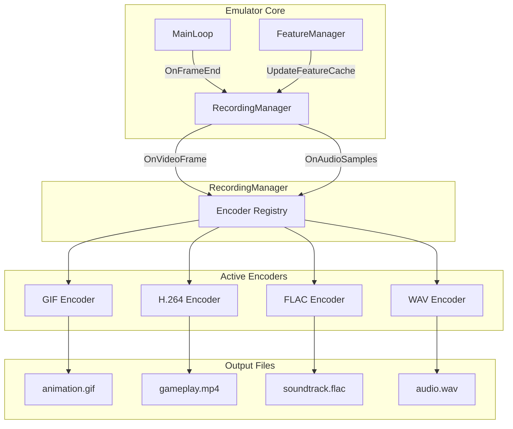
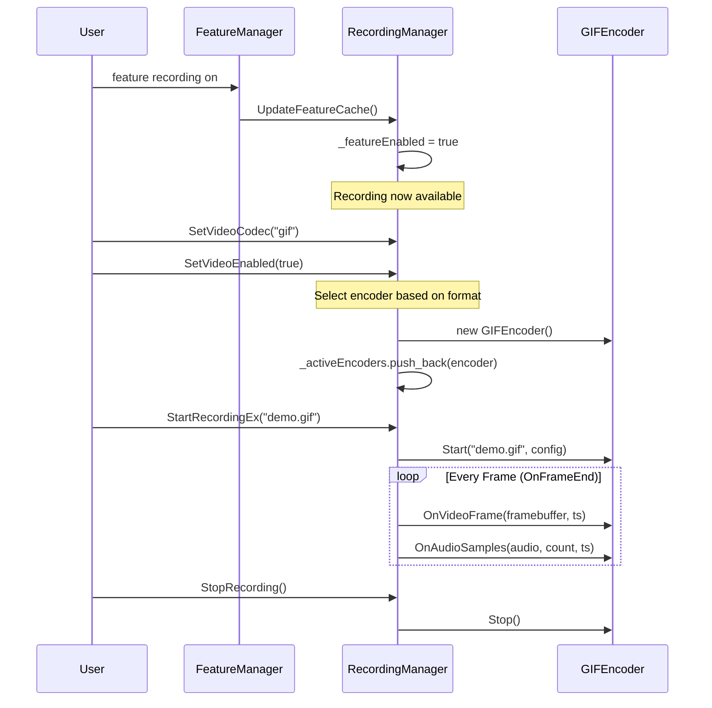
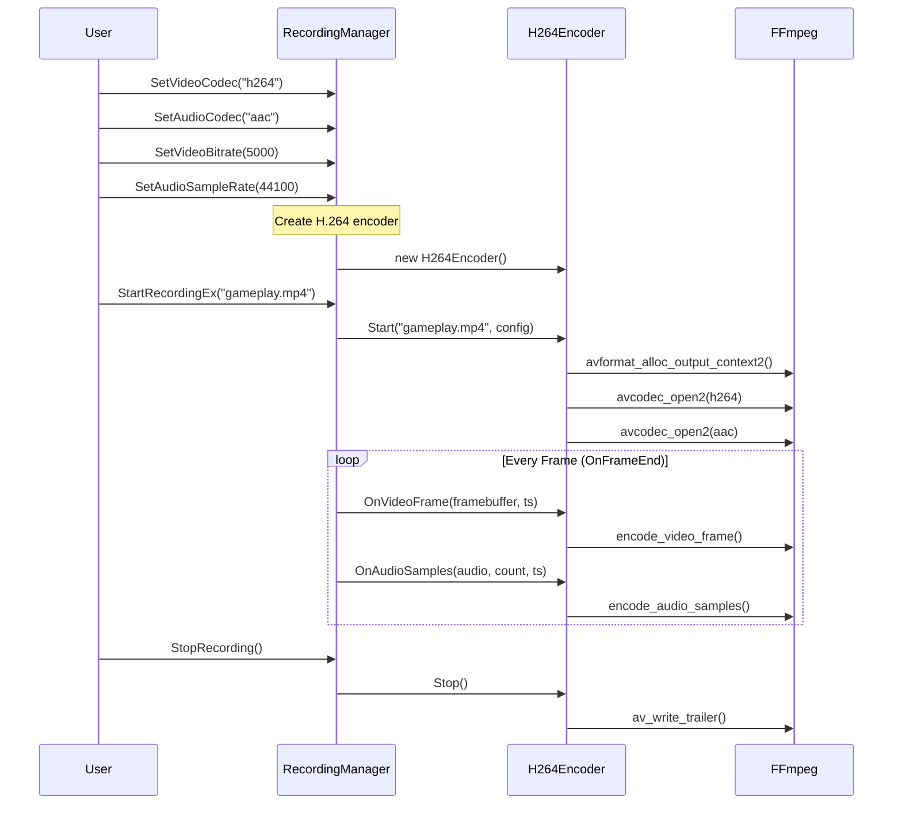
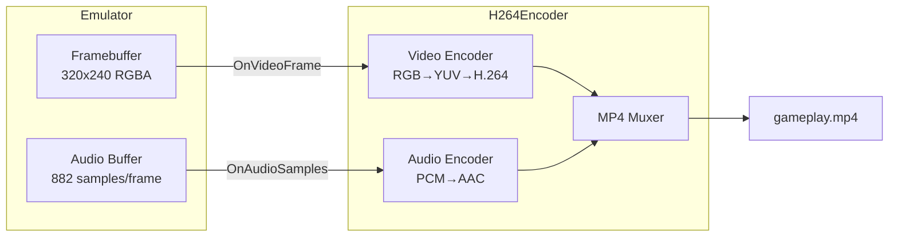
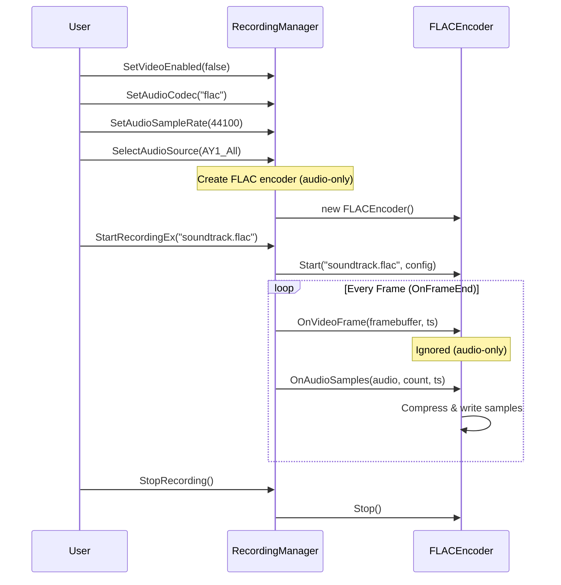
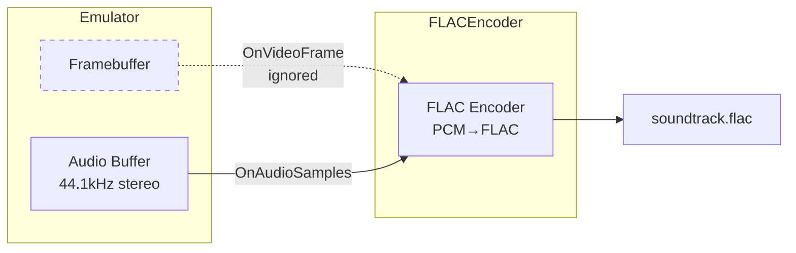
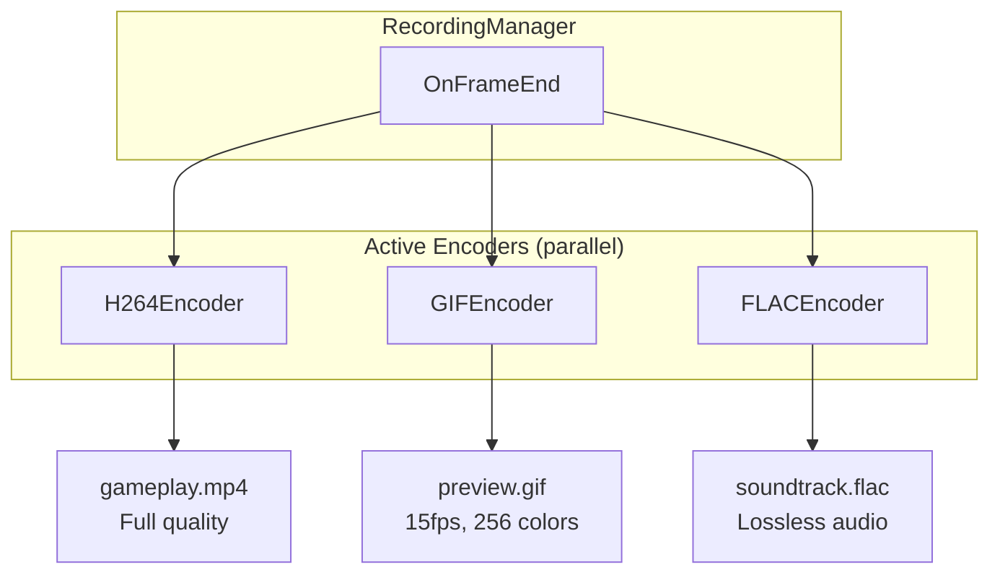

# Encoder Architecture

## Overview

The Encoder Architecture provides a flexible, extensible system for recording emulator output to various formats. All encoders implement a common interface (`EncoderBase`) and are managed by `RecordingManager`.

---

## Architecture Diagram



---

## Feature Flag Guard

Recording is controlled by the `recording` feature in FeatureManager:



---

## EncoderBase Interface

All encoders implement this abstract interface:

```cpp
class EncoderBase {
public:
    // Lifecycle
    virtual bool Start(const std::string& filename, const EncoderConfig& config) = 0;
    virtual void Stop() = 0;
    
    // Frame input (encoders implement what they need)
    virtual void OnVideoFrame(const FramebufferDescriptor& fb, double timestamp) {}
    virtual void OnAudioSamples(const int16_t* samples, size_t count, double timestamp) {}
    
    // State queries
    virtual bool IsRecording() const = 0;
    virtual std::string GetType() const = 0;
    virtual bool SupportsVideo() const = 0;
    virtual bool SupportsAudio() const = 0;
};
```

---

## Encoder Registry

RecordingManager maintains a flat list of active encoders:

```cpp
std::vector<EncoderPtr> _activeEncoders;
```

**OnFrameEnd dispatch:**
```cpp
void RecordingManager::OnFrameEnd(framebuffer, audio, audioCount) {
    if (!_featureEnabled) return;
    
    for (auto& encoder : _activeEncoders) {
        encoder->OnVideoFrame(framebuffer, timestamp);
        encoder->OnAudioSamples(audio, audioCount, timestamp);
    }
}
```

---

## Encoder Categories

| Category | Video | Audio | Examples |
|----------|-------|-------|----------|
| **Video+Audio** | ✅ | ✅ | H.264+AAC, VP9+Opus, AVI |
| **Video-only** | ✅ | ❌ | GIF, PNG sequence, WebP |
| **Audio-only** | ❌ | ✅ | FLAC, WAV, MP3, AAC |

---

## Video Capture Region

Recording can capture different regions of the emulator framebuffer:

### Capture Modes

| Mode | Dimensions | Description |
|------|------------|-------------|
| **MainScreen** | 256×192 | ZX Spectrum main display area only (no border) |
| **FullFrame** | Varies by model | Full framebuffer including border |

### Model-Specific Full Frame Sizes

| Platform | Full Frame Size | Notes |
|----------|-----------------|-------|
| **ZX Spectrum 48K/128K** | 320×240 | Standard PAL timing |
| **Pentagon 128** | 320×240 | Slightly different border timing |
| **Scorpion ZS 256** | 320×240 | Standard size |
| **TSConf** | 360×288 (configurable) | Extended border modes available |
| **ATM Turbo 2+** | 320×240 | Standard |

### Configuration

```cpp
enum class VideoCaptureRegion
{
    MainScreen,     // 256×192 - main display only
    FullFrame       // Full framebuffer with border
};

// RecordingManager API
recordingManager->SetCaptureRegion(VideoCaptureRegion::MainScreen);  // Smaller files
recordingManager->SetCaptureRegion(VideoCaptureRegion::FullFrame);   // Includes border effects
```

### Use Cases

| Region | Use Case |
|--------|----------|
| **MainScreen** | Smaller files, game content only, consistent size across models |
| **FullFrame** | Border effects, loading stripes, demos with border tricks |

> **Note:** Hi-res modes (Timex, TSConf multicolor) typically use FullFrame capture.

## Recording Scenarios

### H.264 Video + AAC Audio Recording

Full gameplay recording with video and audio to MP4 container:



**Data Flow - Video + Audio:**



---

### Audio-Only Recording (FLAC)

High-quality lossless audio capture for music preservation:



**Data Flow - Audio Only:**



---

### Simultaneous Multiple Encoders

Record to multiple formats at once (e.g., MP4 + GIF preview):



## Envisioned Encoders

### Implemented

| Encoder | Type | Format | Status |
|---------|------|--------|--------|
| **GIF** | Video-only | .gif | ✅ Implemented |

### Planned - Video

| Encoder | Type | Format | Priority | Notes |
|---------|------|--------|----------|-------|
| **H.264** | Video+Audio | .mp4 | High | FFmpeg/libx264, HW accel available |
| **VP9** | Video+Audio | .webm | Medium | Royalty-free, FFmpeg |
| **PNG Sequence** | Video-only | .png | Low | Frame-by-frame, lossless |
| **WebP Animation** | Video-only | .webp | Low | Modern GIF alternative |

### Planned - Audio

| Encoder | Type | Format | Priority | Notes |
|---------|------|--------|----------|-------|
| **WAV** | Audio-only | .wav | High | Lossless, simple, no dependencies |
| **FLAC** | Audio-only | .flac | High | Lossless, compressed |
| **MP3** | Audio-only | .mp3 | Medium | Lossy, widely compatible |
| **Ogg Vorbis** | Audio-only | .ogg | Medium | Lossy, royalty-free |

---

## Hardware Acceleration

Video encoding can be HW accelerated for significantly improved performance. This is highly platform-specific:

| Platform | SDK | API | H.264 | HEVC | Notes |
|----------|-----|-----|-------|------|-------|
| **macOS** | VideoToolbox | `VTCompressionSession` | ✅ | ✅ | Apple Silicon optimized |
| **Windows** | Media Foundation | `IMFTransform` | ✅ | ✅ | Requires Windows 10+ |
| **Windows** | NVENC | NVIDIA SDK | ✅ | ✅ | NVIDIA GPUs only |
| **Windows** | AMF | AMD SDK | ✅ | ✅ | AMD GPUs only |
| **Linux** | VA-API | `libva` | ✅ | ✅ | Intel/AMD integrated |
| **Linux** | NVENC | NVIDIA SDK | ✅ | ✅ | NVIDIA GPUs only |

> **Note:** HW acceleration requires custom SDK integration and may not be available on all systems. Software fallback (libx264) should always be provided.

**Encoder Selection Priority:**
1. HW accelerated (if available and enabled)
2. Software fallback (libx264/libx265 via FFmpeg)

---

## Files Structure

```
core/src/emulator/recording/
├── encoder_base.h          # Abstract interface
├── encoder_config.h        # Configuration struct
├── recordingmanager.h      # Main manager
├── recordingmanager.cpp
└── encoders/               # Encoder implementations
    ├── gif_encoder.h
    ├── gif_encoder.cpp
    ├── wav_encoder.h       (planned)
    ├── flac_encoder.h      (planned)
    ├── mp3_encoder.h       (planned)
    ├── ogg_encoder.h       (planned)
    └── h264_encoder.h      (planned - SW + optional HW)
```

---

## See Also

- [Recording System](./recording-system.md) - High-level recording overview
- [Video+Audio Encoding](./video-audio-encoding.md) - Codec details
- [GIF Encoder](./encoders/gif-encoder.md) - GIF implementation details
