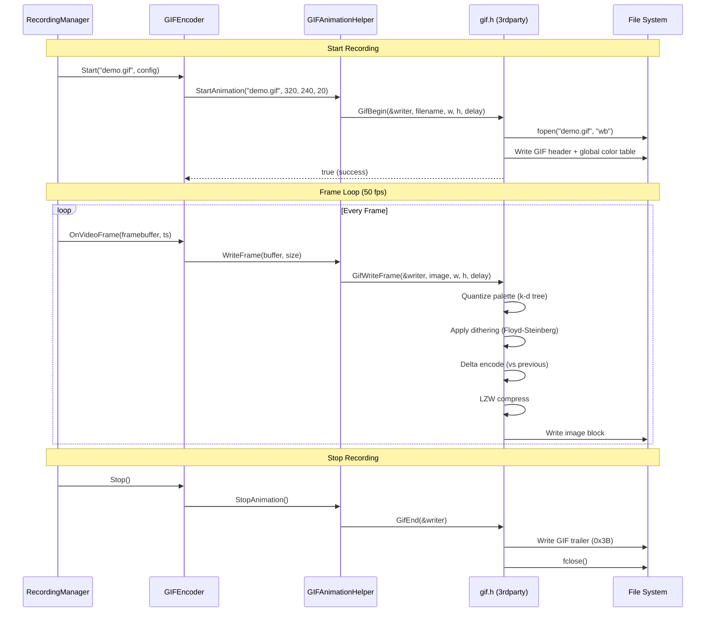
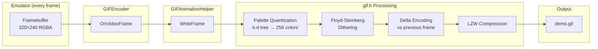
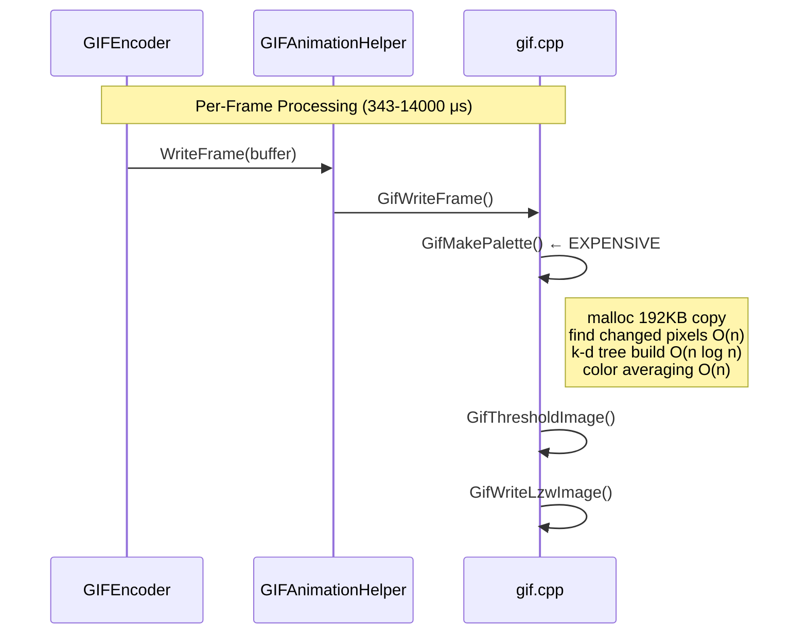
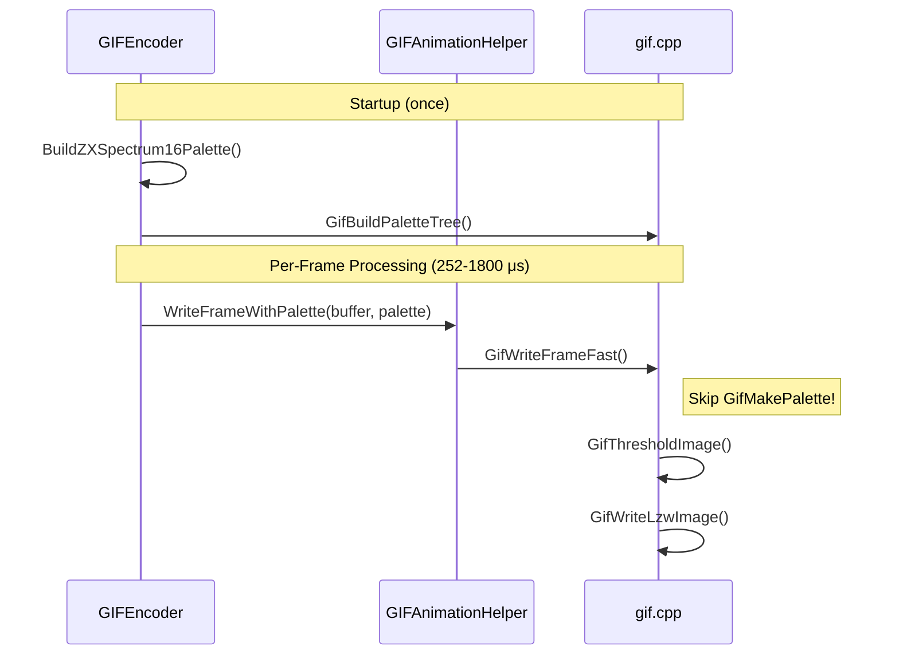

# GIF Encoder

## Overview

The GIF Encoder produces animated GIF files from emulator video frames. It wraps the existing `GIFAnimationHelper` class to implement the `EncoderBase` interface.

---

## Specifications

| Property | Value |
|----------|-------|
| **Type** | Video-only |
| **Format** | .gif |
| **Audio** | Not supported |
| **Colors** | 256 (8-bit palette) |
| **Frame Delay** | Configurable (default: 20ms = 50 fps) |
| **Dithering** | Floyd-Steinberg (optional) |

---

## Dependencies

### 3rdparty Library: gif.h

| File | Size | Description |
|------|------|-------------|
| `core/src/3rdparty/gif/gif.h` | 6.8 KB | Header-only GIF writer |
| `core/src/3rdparty/gif/gif.cpp` | 25 KB | Implementation |

**Library Info:**
- **Author:** Charlie Tangora
- **License:** Public Domain
- **Input Format:** RGBA8 (alpha ignored)
- **Features:** Delta encoding, Floyd-Steinberg dithering, LZW compression

**Key Functions:**
```cpp
bool GifBegin(GifWriter* writer, const char* filename, uint32_t width, uint32_t height, uint32_t delay);
bool GifWriteFrame(GifWriter* writer, const uint8_t* image, uint32_t width, uint32_t height, uint32_t delay);
bool GifEnd(GifWriter* writer);
```

---

## Implementation Stack

```
┌─────────────────────────────────────────────────┐
│              GIFEncoder (EncoderBase)           │
│        encoders/gif_encoder.h/.cpp              │
├─────────────────────────────────────────────────┤
│            GIFAnimationHelper                   │
│      common/image/gifanimationhelper.h/.cpp     │
├─────────────────────────────────────────────────┤
│              gif.h / gif.cpp                    │
│            3rdparty/gif/                        │
│   (LZW, palette quantization, delta encoding)   │
└─────────────────────────────────────────────────┘
```

---

## Recording Lifecycle

### Sequence Diagram



### Data Flow Diagram



---

## Dual-Mode Architecture

The GIF encoder supports two palette modes optimized for different use cases.

### Mode Comparison

| Aspect | Auto Mode | FixedZX16 Mode |
|--------|-----------|----------------|
| **Palette source** | Calculated per-frame from image | Pre-built ZX Spectrum 16 colors |
| **Best for** | Unknown content, photos | Standard ZX software |
| **CPU cost** | High (k-d tree, quantization) | Low (direct lookup) |
| **Accuracy** | Optimal per-frame | Perfect for ZX palette |
| **Speed** | Baseline | **1.4× to 7.8× faster** |

### Auto Mode Flow (Default)



### FixedZX16 Mode Flow (Optimized)



### Performance Comparison

```mermaid
gantt
    title Frame Encoding Time Comparison for different content types (μs, lower is better)
    dateFormat X
    axisFormat %s
    
    section Static content
    Auto 343μs      :0, 343
    FixedZX16 252μs :0, 252
    
    section Menu Scroll
    Auto 1169μs     :0, 1169
    FixedZX16 593μs :0, 593
    
    section High-change
    Auto 13900μs    :0, 13900
    FixedZX16 1800μs:0, 1800
```



| Scenario | Auto Time | Auto Throughput | FixedZX16 Time | FixedZX16 Throughput | Speedup | Bottleneck |
|----------|-----------|-----------------|----------------|----------------------|---------|------------|
| **Static content** | 343 μs | ~547 MB/s | 252 μs | ~745 MB/s | **1.4×** | LZW compression |
| **Menu scrolling** | 1.17 ms | ~160 MB/s | 593 μs | ~316 MB/s | **2.0×** | Threshold + LZW |
| **High-change** | 13.9 ms | - | 1.8 ms | - | **7.8×** | Palette quantization |

### ZX Spectrum 16-Color Palette

```
┌────────────────────────────────────────────────────────────┐
│  Normal Intensity (0xCD)          Bright Intensity (0xFF)  │
├────────────────────────────────────────────────────────────┤
│  0: Black    1: Blue    2: Red    │  8: Black   9: Blue    │
│  3: Magenta  4: Green   5: Cyan   │ 10: Red    11: Magenta │
│  6: Yellow   7: White             │ 12: Green  13: Cyan    │
│                                   │ 14: Yellow 15: White   │
└────────────────────────────────────────────────────────────┘
```

### Usage Example

```cpp
// Auto mode (default - compatible with any content)
EncoderConfig autoConfig;
autoConfig.gifPaletteMode = EncoderConfig::GifPaletteMode::Auto;

// FixedZX16 mode (optimized for ZX Spectrum)
EncoderConfig fastConfig;
fastConfig.gifPaletteMode = EncoderConfig::GifPaletteMode::FixedZX16;

encoder.Start("demo.gif", fastConfig);
```

---

## Interface

```cpp
class GIFEncoder : public EncoderBase {
public:
    bool Start(const std::string& filename, const EncoderConfig& config) override;
    void Stop() override;
    void OnVideoFrame(const FramebufferDescriptor& fb, double timestamp) override;
    
    bool IsRecording() const override;
    std::string GetType() const override { return "gif"; }
    std::string GetDisplayName() const override { return "GIF Animation"; }
    bool SupportsVideo() const override { return true; }
    bool SupportsAudio() const override { return false; }

private:
    GIFAnimationHelper _gifHelper;
    bool _isRecording = false;
    uint64_t _framesEncoded = 0;
};
```

---

## Configuration

| Parameter | Type | Default | Description |
|-----------|------|---------|-------------|
| `videoWidth` | uint32_t | (from source) | Output width |
| `videoHeight` | uint32_t | (from source) | Output height |
| `gifDelayMs` | uint32_t | 20 | Delay between frames (ms) |
| `gifDither` | bool | false | Enable Floyd-Steinberg dithering (Auto mode only) |
| `gifPaletteMode` | enum | Auto | Palette mode (see below) |

### Palette Modes

| Mode | Description | Use Case |
|------|-------------|----------|
| **Auto** | Recalculate palette per-frame (original behavior) | Unknown content, maximum compatibility |
| **FixedZX16** | Pre-computed ZX Spectrum 16-color palette | Standard ZX Spectrum software (fast) |
| **FixedZX256** | Pre-computed 256-color palette | TSConf/modern clones (fast) |

### Benchmark Comparison (Auto vs FixedZX16)

| Scenario | Auto | FixedZX16 | Speedup |
|----------|------|-----------|---------|
| MainScreen (256×192) | 343 μs | 252 μs | **1.4×** |
| Menu scroll | 1169 μs | 593 μs | **2.0×** |
| High-change | 13.9 ms | 1.8 ms | **7.8×** |

> **Recommendation:** Use `FixedZX16` for standard ZX Spectrum recordings. Use `Auto` only when palette is truly dynamic.

---

## Physical Implementation

### GIFAnimationHelper Wrapper

```cpp
// gifanimationhelper.cpp
void GIFAnimationHelper::StartAnimation(std::string filename, unsigned width, unsigned height, unsigned delayMs)
{
    GifBegin(&_gifWriter, filename.c_str(), width, height, delayMs / 10);
    _width = width;
    _height = height;
    _started = true;
}

void GIFAnimationHelper::WriteFrame(uint32_t* buffer, size_t size)
{
    GifWriteFrame(&_gifWriter, (uint8_t*)buffer, _width, _height, _delayMs / 10);
}

void GIFAnimationHelper::StopAnimation()
{
    GifEnd(&_gifWriter);
    _started = false;
}
```

### GIFEncoder Implementation

```cpp
// gif_encoder.cpp
bool GIFEncoder::Start(const std::string& filename, const EncoderConfig& config)
{
    _gifHelper.StartAnimation(filename, config.videoWidth, config.videoHeight, config.gifDelayMs);
    _isRecording = true;
    return true;
}

void GIFEncoder::OnVideoFrame(const FramebufferDescriptor& framebuffer, double timestampSec)
{
    _gifHelper.WriteFrame(framebuffer.buffer, framebuffer.width * framebuffer.height);
    _framesEncoded++;
}

void GIFEncoder::Stop()
{
    _gifHelper.StopAnimation();
    _isRecording = false;
}
```

---

## Algorithm Details

### Color Quantization (Modified Median Split)

The 3rdparty library uses k-d tree based color quantization:
1. Place all pixels in a k-d tree organized by RGB
2. Split palette by median color values
3. Average leaf nodes to get final 256-color palette

### ZX Spectrum Palette - Lossless Encoding

> **Good news:** GIF's 256-color limit is **perfect** for ZX Spectrum recording!

| Platform | Colors | GIF Palette | Result |
|----------|--------|-------------|--------|
| **Standard ZX Spectrum** | 16 colors (8 + bright variants) | 256 max | ✅ **Lossless** |
| **Timex 2068** | 16 colors + hi-color modes | 256 max | ✅ **Lossless** |
| **TSConf (modern clone)** | Up to 256 colors | 256 max | ✅ **Exact match** |
| **ATM Turbo 2+** | 64 colors | 256 max | ✅ **Lossless** |

Since all ZX Spectrum variants have ≤256 colors, **every pixel is recorded exactly as displayed**. The k-d tree quantization will simply map each source color to itself without any approximation or dithering artifacts.

**Optimal Encoding Path:**
```
ZX Spectrum (16 colors) → k-d tree finds 16 unique colors → GIF palette has 16 entries → Lossless
```

> **Note:** Dithering (`gifDither` option) is only useful for true-color sources. For ZX Spectrum, disable dithering for pixel-perfect output.

### Delta Encoding

For each frame after the first:
1. Compare to previous frame
2. Find changed pixels
3. Build palette only from changed pixels
4. Encode only the changed rectangular region

### LZW Compression

Standard GIF LZW compression with 256-ary dictionary tree.

---

## Performance

### Frame Buffer (RGBA Uncompressed)

| Region | Dimensions | Pixels | RGBA Size (4 bytes/pixel) |
|--------|------------|--------|---------------------------|
| **MainScreen** | 256×192 | 49,152 | 192 KB |
| **FullFrame** | 320×240 | 76,800 | 300 KB |

### GIF Output (Compressed)

| Region | 5 sec @ 50fps | Typical Compression |
|--------|---------------|---------------------|
| **MainScreen** | ~30-50 KB | ~15-25× |
| **FullFrame** | ~50-100 KB | ~15-20× |

> File sizes depend on content complexity. Static screens compress better than animations.

### Encoding Time

Measured on Apple Silicon (Release build):

#### Auto Mode (per-frame palette calculation)

| Scenario | Time per Frame | Throughput |
|----------|----------------|------------|
| MainScreen (256×192) | 343 μs | ~546 MB/s |
| FullFrame (320×240) | 383 μs | ~776 MB/s |
| Menu scroll | 1.17 ms | ~160 MB/s |
| High-change | 13.9 ms | (palette limited) |

#### FixedZX16 Mode (pre-built ZX Spectrum palette)

| Scenario | Time per Frame | Throughput | vs Auto |
|----------|----------------|------------|---------|
| MainScreen (256×192) | 252 μs | ~745 MB/s | **1.4× faster** |
| Menu scroll | 593 μs | ~316 MB/s | **2.0× faster** |
| High-change | 1.8 ms | - | **7.8× faster** |

> **Benchmark:** `./bin/core-benchmarks --benchmark_filter=GIF`
> 
> See [`gif_encoder_benchmark.cpp`](../../../../../core/benchmarks/emulator/recording/gif_encoder_benchmark.cpp)

---

## Limitations

1. **No audio** - GIF format has no audio support
2. **256 colors** - May cause banding on gradients
3. **Large files** - Long recordings produce large files
4. **No alpha** - Transparency is binary (on/off)
5. **Frame delay precision** - GIF delay is in centiseconds (10ms units)

---

## Files

| File | Description |
|------|-------------|
| [`core/src/emulator/recording/encoders/gif_encoder.h`](../../../../../core/src/emulator/recording/encoders/gif_encoder.h) | GIFEncoder class declaration |
| [`core/src/emulator/recording/encoders/gif_encoder.cpp`](../../../../../core/src/emulator/recording/encoders/gif_encoder.cpp) | Implementation |
| [`core/src/common/image/gifanimationhelper.h`](../../../../../core/src/common/image/gifanimationhelper.h) | Wrapper class |
| [`core/src/common/image/gifanimationhelper.cpp`](../../../../../core/src/common/image/gifanimationhelper.cpp) | Wrapper implementation |
| [`core/src/3rdparty/gif/gif.h`](../../../../../core/src/3rdparty/gif/gif.h) | Public domain GIF library |
| [`core/src/3rdparty/gif/gif.cpp`](../../../../../core/src/3rdparty/gif/gif.cpp) | Library implementation |

---

## See Also

- [Encoder Architecture](../encoder-architecture.md)
- [Recording System](../recording-system.md)

