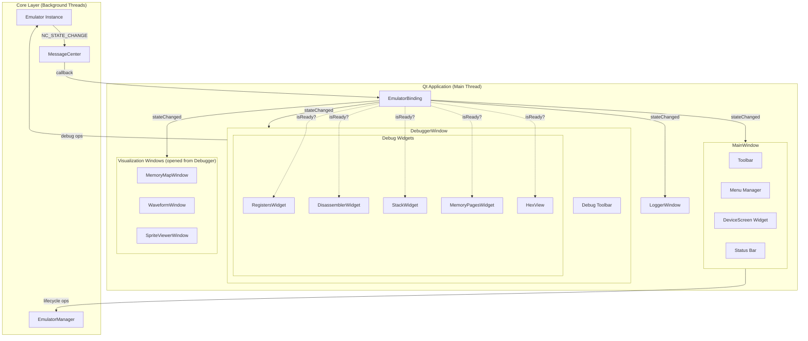
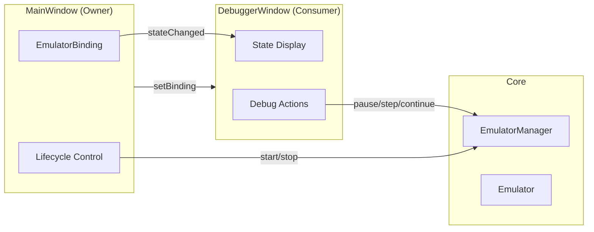
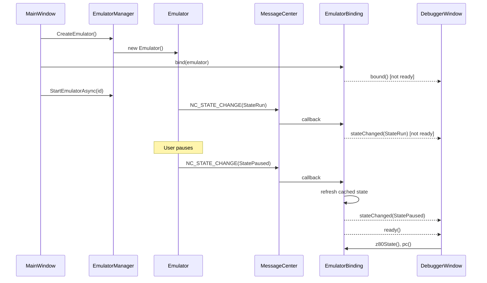
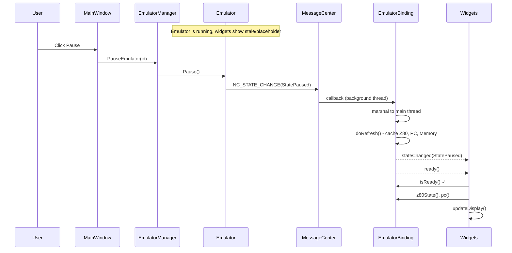
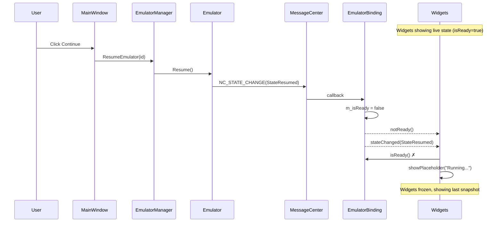
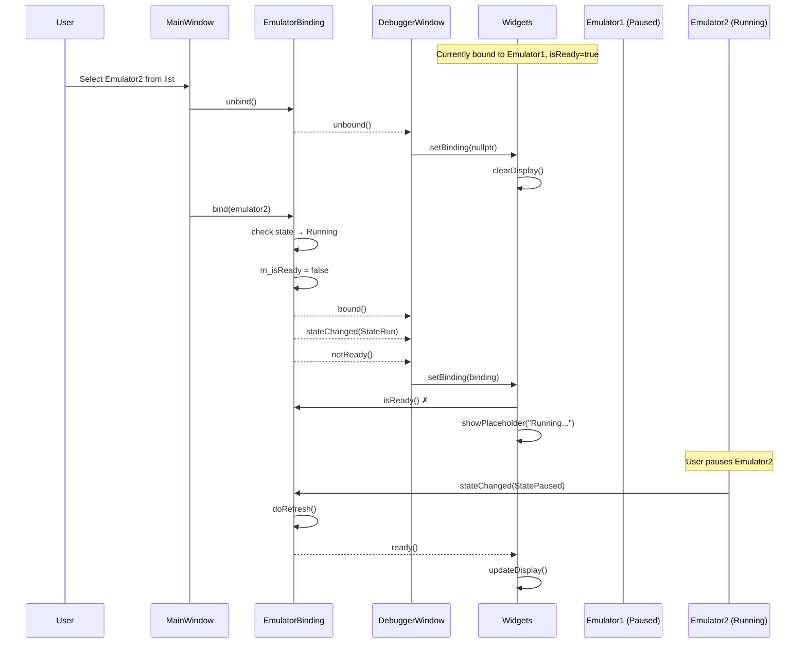
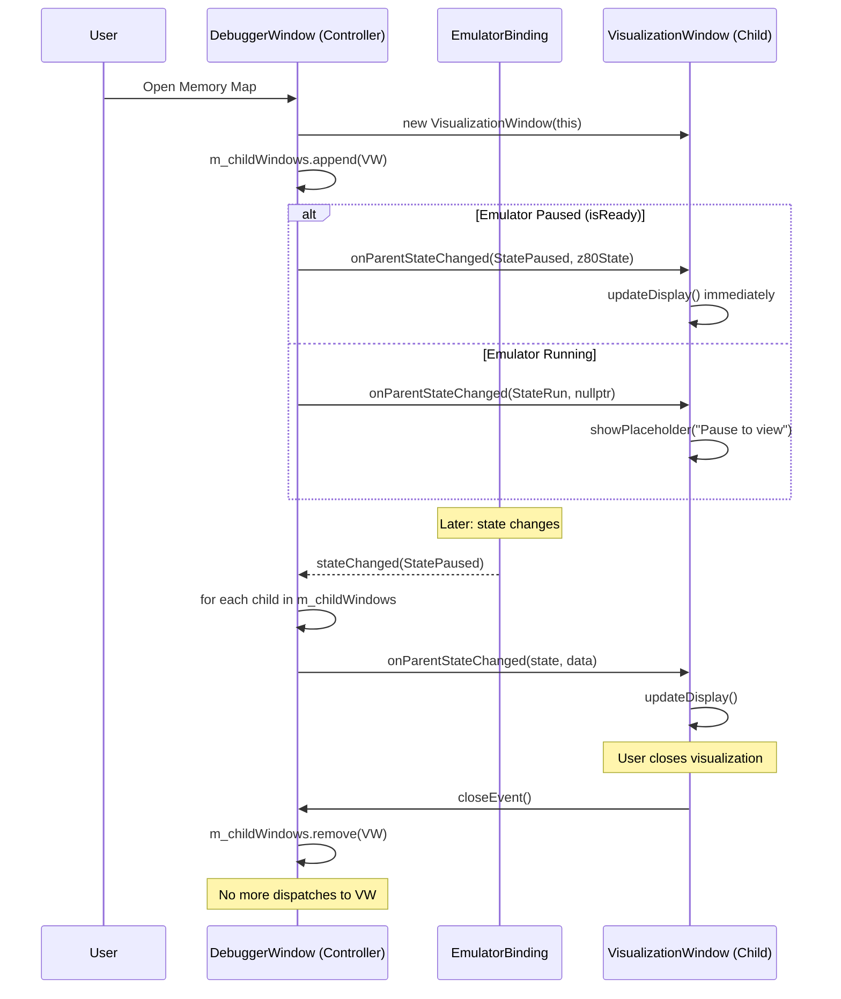

# UI Events Wiring Architecture

**Status:** Design Proposal  
**Date:** 2026-01-11

---

## Design Goals

1. **Single source of truth** - One state owner, widgets are consumers
2. **Ready-state gating** - No operations on uninitialized emulators
3. **No propagation loops** - Events flow one direction only
4. **Minimal overhead** - Lazy refresh, no redundant updates
5. **Thread-safe** - All emulator access marshalled to main thread

---

## Architecture Overview



### Component Hierarchy

| Scope | Component | Widgets/Children |
|-------|-----------|------------------|
| **App** | EmulatorBinding | Owned by MainWindow, shared to children |
| **MainWindow** | Primary UI | DeviceScreen, Toolbar, Menu, StatusBar |
| **DebuggerWindow** | Debug UI | Registers, Disassembler, Stack, Memory, HexView |
| **DebuggerWindow** | Opens → | MemoryMapWindow, WaveformWindow, SpriteViewer |
| **LoggerWindow** | Logging | LogListView, FilterControls |

---

## Window Communication Architecture

### Ownership and Responsibilities



### Responsibilities

| Component | Role | Does | Does NOT |
|-----------|------|------|----------|
| **MainWindow** | Owner | Creates/destroys EmulatorBinding, owns lifecycle | Execute debug commands |
| **DebuggerWindow** | Consumer | Displays state, executes debug commands | Create/destroy binding |
| **EmulatorBinding** | Mediator | Caches state, emits signals | Execute any commands |

### Communication Flow

| Direction | Mechanism | Example |
|-----------|-----------|---------|
| MainWindow → DebuggerWindow | `setBinding(m_binding)` | Passes binding at startup |
| Binding → DebuggerWindow | `stateChanged` signal | State updated → refresh display |
| DebuggerWindow → Core | Direct `EmulatorManager` call | User clicks "Step In" |
| Core → Binding | MessageCenter callback | Emulator paused |

### Why DebuggerWindow Calls Core Directly

DebuggerWindow calls `EmulatorManager` directly for debug actions (not through MainWindow) because:
1. **No round-trip needed** - Debug actions are commands, not owned by MainWindow
2. **Response comes via binding** - After step, emulator sends state change → binding → widgets
3. **Cleaner separation** - MainWindow handles lifecycle, DebuggerWindow handles debugging

---

## EmulatorBinding Class

The central binding between Core and UI:

```cpp
class EmulatorBinding : public QObject {
    Q_OBJECT
public:
    explicit EmulatorBinding(QObject* parent = nullptr);
    ~EmulatorBinding();
    
    // === Binding Lifecycle ===
    void bind(Emulator* emulator);    // Connect to emulator events
    void unbind();                     // Disconnect, clear state
    
    // === State Accessors (Always Safe) ===
    bool isReady() const;              // Can widgets safely read state?
    bool isBound() const;              // Is an emulator bound?
    Emulator* emulator() const;        // Nullptr if not ready
    
    // === Cached State (Thread-safe reads) ===
    EmulatorStateEnum state() const;
    uint16_t pc() const;
    const Z80State* z80State() const;  // Nullptr if not ready
    
    // === Operations (Marshalled to main thread) ===
    void requestRefresh();              // Force state re-read
    
signals:
    void bound();                       // Emulator bound (not yet ready)
    void unbound();                     // Emulator unbound
    void stateChanged(EmulatorStateEnum state);  // State transition
    void ready();                       // Emulator is now inspectable
    void notReady();                    // Emulator no longer inspectable
    
private slots:
    void onMessageCenterEvent(int id, Message* msg);
    void doRefresh();                   // Actual refresh on main thread
    
private:
    Emulator* m_emulator = nullptr;
    EmulatorStateEnum m_state = StateUnknown;
    bool m_isReady = false;
    Z80State m_cachedZ80State{};
    uint16_t m_cachedPC = 0;
};
```

---

## Ready-State Gating

Widgets can only access emulator data when `isReady() == true`:

| State | isBound | isReady | Widgets Can |
|-------|---------|---------|-------------|
| No emulator | ❌ | ❌ | Display empty state |
| Initializing | ✅ | ❌ | Show "Loading..." |
| Running | ✅ | ❌ | Show "Running..." (stale data) |
| Paused | ✅ | ✅ | Read live state |
| Stopped | ✅ | ❌ | Display last snapshot |

```cpp
bool EmulatorBinding::isReady() const {
    return m_isReady && m_emulator && 
           (m_state == StatePaused || m_state == StateStopped);
}
```

---

## Event Flow

### Emulator Creation → Widget Ready



### Running → Pause



### Pause → Running (Resume)



### Switch Active Emulator Instance



### Open Visualization Window (Hierarchical Dispatch)

> **Design Principle:** Child windows do NOT subscribe to `EmulatorBinding` directly.  
> The parent window (DebuggerWindow) acts as **controller/router** and dispatches events to its children.



### Child Window Lifecycle Management

```cpp
class DebuggerWindow {
    QList<QWidget*> m_childWindows;  // Active visualization windows
    
    void openVisualization(VisualizationType type) {
        auto* window = new VisualizationWindow(type, this);
        m_childWindows.append(window);
        
        // Connect close signal to cleanup
        connect(window, &QWidget::destroyed, this, [this, window]() {
            m_childWindows.removeOne(window);
        });
        
        // Initial state dispatch
        dispatchToChild(window);
        window->show();
    }
    
    void onStateChanged(EmulatorStateEnum state) {
        // Update own widgets
        updateWidgets();
        
        // Dispatch to all open child windows
        for (auto* child : m_childWindows) {
            dispatchToChild(child);
        }
    }
    
    void dispatchToChild(QWidget* child) {
        if (auto* viz = qobject_cast<VisualizationWindow*>(child)) {
            if (m_binding && m_binding->isReady()) {
                viz->onParentStateChanged(m_binding->state(), m_binding->z80State());
            } else {
                viz->onParentStateChanged(m_binding ? m_binding->state() : StateUnknown, nullptr);
            }
        }
    }
};
```

### Child Window Pattern

```cpp
class VisualizationWindow : public QWidget {
    // NO direct EmulatorBinding reference!
    // All data comes from parent via dispatch
    
public:
    void onParentStateChanged(EmulatorStateEnum state, const Z80State* data) {
        if (state == StatePaused && data) {
            updateDisplay(*data);
        } else {
            showPlaceholder(state == StateRun ? "Running..." : "No data");
        }
    }
};
```

### Widget State Handler Pattern

```cpp
void DebuggerWidget::onStateChanged(EmulatorStateEnum state) {
    if (!m_binding->isReady()) {
        showPlaceholder();  // "Emulator running..." or empty
        return;
    }
    
    // Safe to access cached state
    updateDisplay(m_binding->z80State());
}
```

---

## Integration Points

### MainWindow

```cpp
class MainWindow {
    EmulatorBinding* m_binding;
    
    void onEmulatorCreated(Emulator* emu) {
        m_binding->bind(emu);
        debuggerWindow->setBinding(m_binding);
        visualizationWindow->setBinding(m_binding);
    }
    
    void onEmulatorDestroyed() {
        m_binding->unbind();
    }
};
```

### DebuggerWindow

```cpp
class DebuggerWindow {
    EmulatorBinding* m_binding = nullptr;
    
    void setBinding(EmulatorBinding* binding) {
        if (m_binding) {
            disconnect(m_binding, nullptr, this, nullptr);
        }
        m_binding = binding;
        if (m_binding) {
            connect(m_binding, &EmulatorBinding::stateChanged, 
                    this, &DebuggerWindow::onStateChanged);
            connect(m_binding, &EmulatorBinding::ready, 
                    this, &DebuggerWindow::onReady);
        }
        // Propagate to child widgets
        for (auto* widget : m_widgets) {
            widget->setBinding(binding);
        }
    }
};
```

### Individual Widget

```cpp
class RegistersWidget {
    EmulatorBinding* m_binding = nullptr;
    
    void setBinding(EmulatorBinding* binding) {
        m_binding = binding;
        if (m_binding) {
            connect(m_binding, &EmulatorBinding::stateChanged,
                    this, &RegistersWidget::onStateChanged);
        }
    }
    
    void onStateChanged(EmulatorStateEnum) {
        if (m_binding && m_binding->isReady()) {
            const Z80State* state = m_binding->z80State();
            if (state) updateDisplay(*state);
        } else {
            clearDisplay();
        }
    }
};
```

---

## Thread Safety

### MessageCenter → Main Thread Marshalling

```cpp
void EmulatorBinding::onMessageCenterEvent(int id, Message* msg) {
    // Called from MessageCenter thread - marshal to main thread
    QMetaObject::invokeMethod(this, [this, state = extractState(msg)]() {
        m_state = state;
        
        if (state == StatePaused || state == StateStopped) {
            doRefresh();  // Read emulator state
            m_isReady = true;
            emit ready();
        } else {
            m_isReady = false;
            emit notReady();
        }
        
        emit stateChanged(state);
    }, Qt::QueuedConnection);
}
```

---

## Benefits

| Aspect | Before | After |
|--------|--------|-------|
| **Emulator refs** | Each widget stores pointer | Single binding, passed down |
| **Null checks** | Every widget, every method | One check in `isReady()` |
| **State sync** | Manual refresh calls | Automatic via signals |
| **Thread safety** | Per-widget marshalling | Centralized in binding |
| **Crash safety** | Guard in every accessor | Single gated access point |

---

## Implementation Checklist

1. [ ] Create `EmulatorBinding` class in `unreal-qt/src/emulator/`
2. [ ] Add MessageCenter subscription handling
3. [ ] Implement main-thread marshalling
4. [ ] Wire into `MainWindow`
5. [ ] Update `DebuggerWindow` to use binding
6. [ ] Update individual widgets
7. [ ] Remove `m_emulator` from widgets
8. [ ] Add unit tests for state transitions

---

## Related Documents

- [emulator-lifecycle-management.md](./emulator-lifecycle-management.md) - Emulator ownership model
- [pause-stop-race-condition-fix.md](./pause-stop-race-condition-fix.md) - Thread safety patterns
- [Debugger events analysis](../../inprogress/2026-01-11-debugger-events/) - Root cause of crash

