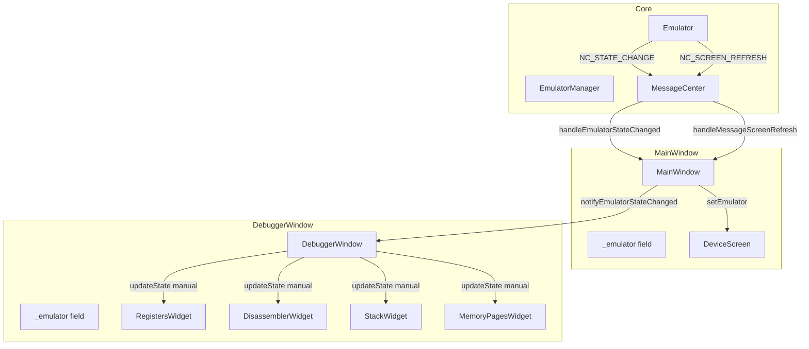
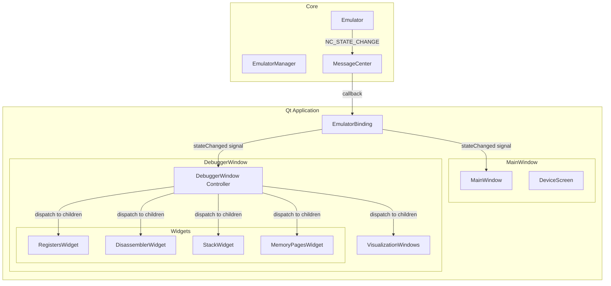
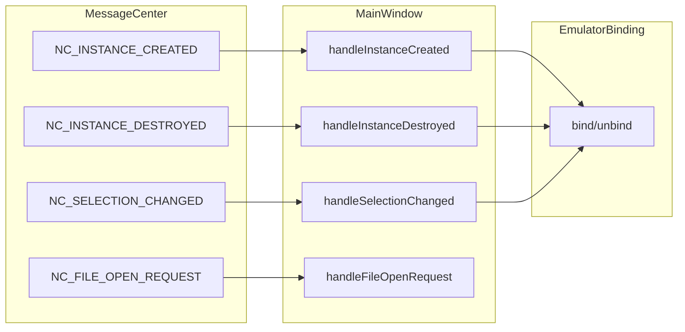
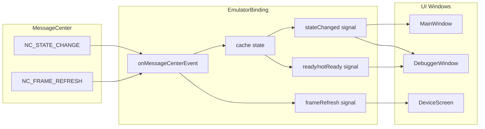
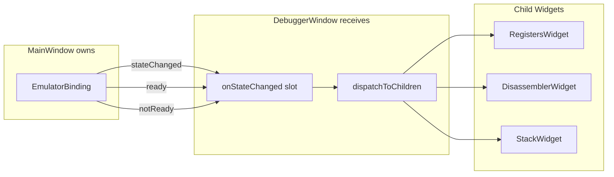

# EmulatorBinding Implementation Plan

## Goal

Replace scattered emulator references and manual event dispatching with centralized `EmulatorBinding` class using hierarchical event dispatch.

---

## Part 1: Current State

> **Summary:** MainWindow and DebuggerWindow both subscribe to MessageCenter directly. Each stores its own `_emulator` reference. MainWindow manually calls `notifyEmulatorStateChanged()` on DebuggerWindow. DebuggerWindow manually iterates widgets in `updateState()`. No ready-state guards.

### Component Architecture (Current)



### Current Data Flow

| Step | Source | Action | Target |
|------|--------|--------|--------|
| 1 | Emulator | Sends `NC_STATE_CHANGE` | MessageCenter |
| 2 | MessageCenter | Callback | `MainWindow::handleEmulatorStateChanged` |
| 3 | MainWindow | Marshals to main thread | Qt event loop |
| 4 | MainWindow | Calls `notifyEmulatorStateChanged()` | DebuggerWindow |
| 5 | DebuggerWindow | Calls `updateState()` | Iterates all widgets |
| 6 | updateState | Manual calls | `widget->setZ80State()`, `widget->refresh()` |

### Current Problem Points

| Problem | Location | Impact |
|---------|----------|--------|
| Duplicate `_emulator` refs | MainWindow, DebuggerWindow, widgets | Sync issues |
| Manual widget iteration | `DebuggerWindow::updateState()` | Easy to miss widgets |
| No ready-state gating | All widgets | Crash on early access |
| Direct MessageCenter subscriptions | DebuggerWindow (some branches) | Race conditions |

---

## Part 2: Desired State

> **Summary:** Only MainWindow subscribes to MessageCenter. EmulatorBinding (owned by MainWindow) emits Qt signals. DebuggerWindow and LogWindow connect to these signals. DebuggerWindow propagates events to its child widgets and visualization windows.

### Component Architecture (Desired)



### Desired Data Flow

| Step | Source | Action | Target |
|------|--------|--------|--------|
| 1 | Emulator | Sends `NC_STATE_CHANGE` | MessageCenter |
| 2 | MessageCenter | Callback | `EmulatorBinding::onMessageCenterEvent` |
| 3 | EmulatorBinding | Marshal + cache state | Main thread |
| 4 | EmulatorBinding | Emit `stateChanged()` signal | Connected windows |
| 5 | DebuggerWindow | `dispatchToChildren()` | All registered children |
| 6 | Widgets | `onParentStateChanged()` | Update display |

### Window Roles

| Component | Role | Responsibilities |
|-----------|------|------------------|
| **MainWindow** | Owner | Creates EmulatorBinding, passes to DebuggerWindow, handles lifecycle (start/stop) |
| **DebuggerWindow** | Consumer | Receives binding, displays state, calls EmulatorManager for debug ops (step/pause) |
| **EmulatorBinding** | Mediator | Caches state, handles MessageCenter, emits signals - executes no commands |

> **Key:** DebuggerWindow calls `EmulatorManager` directly for debug actions (step, pause, continue).  
> Response comes back via MessageCenter → Binding → widgets. No round-trip through MainWindow.

---

## Part 3: Implementation Differences

### Files to Create

| File | Purpose |
|------|---------|
| `unreal-qt/src/emulator/emulatorbinding.h` | EmulatorBinding class definition |
| `unreal-qt/src/emulator/emulatorbinding.cpp` | Implementation + MessageCenter handling |

### Files to Modify

| File | Changes |
|------|---------|
| `mainwindow.h` | Add `EmulatorBinding* m_binding` |
| `mainwindow.cpp` | Create binding, pass to children, remove direct dispatch |
| `debuggerwindow.h` | Add `setBinding()`, `m_childWindows`, remove `_emulator` |
| `debuggerwindow.cpp` | Connect to binding signal, implement hierarchical dispatch |
| `registerswidget.*` | Add `onParentStateChanged()`, remove `m_emulator` |
| `disassemblerwidget.*` | Add `onParentStateChanged()`, remove `m_emulator` |
| `stackwidget.*` | Add `onParentStateChanged()` |
| `memorypageswidget.*` | Add `onParentStateChanged()` |

### Key Changes Summary

| Aspect | Current | Desired |
|--------|---------|---------|
| Emulator refs | 3+ separate `_emulator` fields | 1 in EmulatorBinding |
| State access | Direct emulator calls | Cached in binding |
| Event dispatch | Manual `notifyEmulatorStateChanged` | Qt signal/slot |
| Widget updates | Manual `updateState()` iteration | Auto via signal |
| Ready gating | Per-widget null checks | `binding->isReady()` |
| Child windows | Not tracked | `m_childWindows` list |

---

## Implementation Phases

### Phase 1: Create EmulatorBinding (Est: 1h)

#### MessageCenter Events (Currently in MainWindow)

| Event | MainWindow Reacts | DebuggerWindow Reacts | Mechanism |
|-------|-------------------|----------------------|-----------|
| `NC_EMULATOR_INSTANCE_CREATED` | ✅ Bind emulator | ✅ Receives binding | MW subscribes MC → calls `m_binding->bind()` → DW gets `setBinding()` |
| `NC_EMULATOR_INSTANCE_DESTROYED` | ✅ Unbind emulator | ✅ Clears state | MW subscribes MC → calls `m_binding->unbind()` → DW gets `unbound` signal |
| `NC_EMULATOR_SELECTION_CHANGED` | ✅ Switch binding | ✅ Refreshes state | MW subscribes MC → rebinds → DW gets new binding |
| `NC_EMULATOR_STATE_CHANGE` | ✅ Update menus | ✅ Update widgets | Binding subscribes → emits `stateChanged` → both receive via signal |
| `NC_VIDEO_FRAME_REFRESH` | ✅ Refresh screen | ❌ No reaction | Binding subscribes → emits `frameRefresh()` → DeviceScreen only |
| `NC_FILE_OPEN_REQUEST` | ✅ Load file | ❌ No reaction | MW subscribes MC → handles directly |

#### EmulatorBinding Signal/Slot Specification

##### MainWindow Event Flow



##### EmulatorBinding Event Flow (Per-Emulator)



##### DebuggerWindow Event Flow (receives from EmulatorBinding)



| Signal | When Emitted | Who Connects | What They Do |
|--------|--------------|--------------|--------------|
| `bound()` | After `bind()` | MainWindow, DebuggerWindow | Store reference, prepare UI |
| `unbound()` | After `unbind()` | MainWindow, DebuggerWindow | Clear state, disable UI |
| `stateChanged(state)` | On NC_STATE_CHANGE | MainWindow, DebuggerWindow | MainWindow: menus; DebuggerWindow: dispatch |
| `ready()` | State → Paused | DebuggerWindow | Dispatch cached state |
| `notReady()` | State → Running | DebuggerWindow | Show placeholders |
| `frameRefresh()` | On NC_FRAME_REFRESH | DeviceScreen | Refresh screen |

#### Accessors (Always Safe)

| Method | Returns | When `!isReady()` |
|--------|---------|-------------------|
| `isReady()` | `bool` | Returns `false` |
| `isBound()` | `bool` | Returns `true` if emulator set |
| `state()` | `EmulatorStateEnum` | Returns current state |
| `emulator()` | `Emulator*` | Returns pointer (may be null) |
| `z80State()` | `const Z80State*` | Returns `nullptr` |
| `pc()` | `uint16_t` | Returns cached PC |

- [ ] Create header with signals/slots (as specified above)
- [ ] Implement MessageCenter subscription
- [ ] Implement main-thread marshalling (`QMetaObject::invokeMethod`)
- [ ] Implement state caching
- [ ] **Add comprehensive autodocs for all methods**

#### Documentation Requirements

All methods must have inline comments documenting:
- **What** - Purpose of the method
- **Triggered by** - Full list of callers  
- **Calls** - Methods this invokes
- **Conditions** - Prerequisites, state requirements
- **Special cases** - Edge cases, error handling
- **Behavior changes** - What triggers different behavior

#### Example Autodoc Format

```cpp
/**
 * @brief Binds this instance to an emulator for state tracking.
 * 
 * @what Stores emulator reference, subscribes to MessageCenter events,
 *       checks initial state and emits appropriate signals.
 * 
 * @triggered_by
 *   - MainWindow::handleEmulatorInstanceCreated() - new emulator created
 *   - MainWindow::handleEmulatorSelectionChanged() - user switches emulator
 * 
 * @calls
 *   - MessageCenter::AddObserver() - subscribe to NC_EMULATOR_STATE_CHANGE
 *   - updateReadyState() - check if emulator is in ready state
 *   - emit bound() - notify consumers
 *   - emit ready() or notReady() - based on initial state
 * 
 * @conditions
 *   - Must be called on main thread
 *   - emulator must not be nullptr
 *   - Previous binding (if any) should be unbound first
 * 
 * @special_cases
 *   - If emulator is already paused: emits ready() immediately
 *   - If emulator is running: emits notReady(), widgets show placeholder
 *   - If called with same emulator: no-op (returns early)
 * 
 * @behavior_changes
 *   - After bind(): isReady() may return true (if paused) or false (if running)
 *   - After bind(): isBound() always returns true
 */
void bind(Emulator* emulator);
```

### Phase 2: Integrate into MainWindow (Est: 30m)
- [ ] Add `EmulatorBinding* m_binding` field
- [ ] **Remove** `_emulator` field (use `m_binding->emulator()` instead)
- [ ] Create binding in constructor
- [ ] In `handleEmulatorInstanceCreated()`: call `m_binding->bind(emulator)`
- [ ] In `handleEmulatorInstanceDestroyed()`: call `m_binding->unbind()`
- [ ] Pass `m_binding` to DebuggerWindow, DeviceScreen
- [ ] **Remove** `notifyEmulatorStateChanged()` call (binding signals replace it)
- [ ] For lifecycle ops (pause/resume/stop): use `m_binding->emulator()->GetId()`

### Phase 3: Update DebuggerWindow (Est: 1h)
- [ ] Add `setBinding()` method
- [ ] **Remove** `_emulator` field
- [ ] Add `m_childWindows` tracking
- [ ] Implement `dispatchToChildren()`
- [ ] Connect to `m_binding->stateChanged` signal
- [ ] Remove `notifyEmulatorStateChanged()` method

### Phase 4: Update Debug Widgets (Est: 1.5h)
- [ ] Add `onParentStateChanged()` to each widget
- [ ] Remove direct emulator access
- [ ] Test each widget individually

### Phase 5: Update Visualization Windows (Est: 30m)
- [ ] Add parent dispatch pattern
- [ ] Register with DebuggerWindow
- [ ] Test lifecycle

---

## Verification Checklist

- [ ] App starts without crash
- [ ] Pause → widgets populate
- [ ] Resume → widgets show placeholder
- [ ] Switch emulator → widgets update
- [ ] Open visualization → works in paused/running
- [ ] Close visualization → no more dispatches
