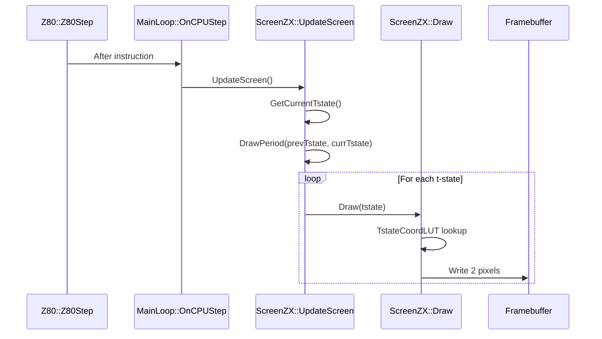

# ZX-Spectrum Screen Rendering Pipeline

**Last Updated**: 2026-01-11  
**Status**: Complete (ScreenHQ optimization integrated)

---

## Overview

The ZX-Spectrum screen rendering system emulates the ULA video signal generator that produces
the composite video output on original hardware. The emulator supports two rendering modes
controlled by the `ScreenHQ` feature flag:

| Mode | ScreenHQ | Description | Performance |
|:---|:---:|:---|---:|
| **Per-T-State** | ON | Pixel-accurate demo multicolor support | ~343 μs/frame |
| **Batch 8-Pixel** | OFF | Fast rendering for non-demo content | ~13 μs/frame |

---

## Architecture

### Class Hierarchy

```
Screen (base class)
├── ScreenZX (ZX-Spectrum implementation)
└── (other platform-specific screens)
```

### Key Components

| Component | File | Responsibility |
|:---|:---|:---|
| `Screen` | [screen.h](core/src/emulator/video/screen.h) | Base class, feature flag caching, framebuffer management |
| `ScreenZX` | [screenzx.h](core/src/emulator/video/zx/screenzx.h) | ZX-Spectrum ULA emulation, LUT-based rendering |
| `MainLoop` | [mainloop.cpp](core/src/emulator/mainloop.cpp) | Frame orchestration, calls render at frame end |
| `FeatureManager` | [featuremanager.cpp](core/src/base/featuremanager.cpp) | ScreenHQ feature state management |

---

## Rendering Modes

### Mode 1: Per-T-State Rendering (ScreenHQ=ON)

**Default mode** - Required for demos using "racing the beam" multicolor effects.

#### How It Works

The ULA draws 2 pixels per T-state at 3.5MHz. The emulator simulates this by:
1. After each Z80 instruction, `OnCPUStep()` is called
2. `Screen::UpdateScreen()` calculates elapsed T-states
3. `Screen::DrawPeriod()` iterates over each T-state in the period
4. For each T-state, `ScreenZX::Draw()` renders the 2 pixels at that position

#### Render Flow



#### Key Methods

| Method | Description |
|:---|:---|
| `UpdateScreen()` | Entry point, calculates T-state delta |
| `DrawPeriod(from, to)` | Iterates over T-state range |
| `Draw(tstate)` | Renders 2 pixels for specific T-state |

#### LUT Optimization (Phase 2)

Pre-computed lookup tables eliminate expensive division/modulo operations:

```cpp
struct TstateCoordLUT {
    RenderTypeEnum renderType;  // RT_BLANK, RT_BORDER, RT_SCREEN
    uint16_t framebufferX;      // Pre-computed X coordinate
    uint16_t framebufferY;      // Pre-computed Y coordinate
    uint16_t screenOffset;      // ZX screen memory offset
    uint16_t attrOffset;        // ZX attribute memory offset
    uint8_t symbolX;            // Character column (0-31)
    uint8_t pixelXBit;          // Bit position within byte (0-6)
};
```

**Performance gain**: 2.5x faster than runtime calculation (343μs → 139μs)

---

### Mode 2: Batch 8-Pixel Rendering (ScreenHQ=OFF)

**Performance mode** - For non-demo content where multicolor effects are not needed.

#### How It Works

Instead of rendering 2 pixels per T-state (~70,000 Draw calls per frame), the entire
256×192 screen is rendered in a single pass at frame end:

1. `Screen::DrawPeriod()` returns immediately (bypassed)
2. At frame end, `MainLoop::OnFrameEnd()` calls `Screen::RenderFrameBatch()`
3. `ScreenZX::RenderScreen_Batch8()` iterates over 768 character symbols (32×24 grid)
4. For each symbol, 8 pixels are rendered using the same attribute byte

#### Render Flow

```mermaid
sequenceDiagram
    participant CPU as Z80::Z80Step
    participant ML as MainLoop::OnCPUStep
    participant Screen as Screen::DrawPeriod
    participant End as MainLoop::OnFrameEnd
    participant Batch as ScreenZX::RenderFrameBatch
    participant FB as Framebuffer

    CPU->>ML: After instruction
    ML->>Screen: UpdateScreen()
    Screen-->>Screen: Early return (ScreenHQ=OFF)
    Note over Screen: No per-t-state rendering
    
    Note over End: Frame boundary reached
    End->>End: Check IsScreenHQEnabled()
    End->>Batch: RenderFrameBatch()
    Batch->>Batch: RenderScreen_Batch8()
    loop For each of 768 symbols
        Batch->>FB: Write 8 pixels
    end
```

#### Key Methods

| Method | Description |
|:---|:---|
| `RenderFrameBatch()` | Virtual dispatch to optimized batch renderer |
| `RenderScreen_Batch8()` | Renders all 768 8×1 pixel groups |
| `DrawBatch8_Scalar()` | Scalar implementation (branch-free) |
| `DrawBatch8_NEON()` | ARM NEON SIMD implementation |

#### Branch-Free Color Selection

Each pixel's color is determined without branching using arithmetic mask generation:

```cpp
// Extract bit and extend to 32-bit mask
uint32_t bit = (pixels << bitPos) & 0x80;
uint32_t mask = static_cast<uint32_t>(-static_cast<int32_t>(bit >> 7));
// mask = 0xFFFFFFFF (ink) or 0x00000000 (paper)

// Select color without branching
uint32_t color = (colorInk & mask) | (colorPaper & ~mask);
```

**Performance gain**: ~4% improvement over conditional logic

---

## Bypass Logic Documentation

### Screen::DrawPeriod() Bypass

Located in [`screen.cpp`](core/src/emulator/video/screen.cpp) at the start of `DrawPeriod()`:

```cpp
// =============================================================================
// SCREENHQ OPTIMIZATION BYPASS
// =============================================================================
// When ScreenHQ feature is disabled (OFF), we skip the per-t-state rendering
// loop entirely. This bypasses ~70,000 Draw() calls per frame.
//
// WHAT IS BYPASSED:
//   - The for loop that calls Draw(tstate) for each t-state in the period
//   - Draw() -> TstateCoordLUT lookup + pixel calculation + framebuffer write
//   - All per-t-state attribute reads for "racing the beam" multicolor effects
//
// WHAT HAPPENS INSTEAD:
//   - MainLoop::OnFrameEnd() calls Screen::RenderFrameBatch()
//   - Which calls ScreenZX::RenderScreen_Batch8() for 25x faster batch rendering
// =============================================================================
if (!_feature_screenhq_enabled)
{
    return;  // Skip per-t-state rendering; batch render happens at frame end
}
```

### MainLoop::OnFrameEnd() Batch Render

Located in [`mainloop.cpp`](core/src/emulator/mainloop.cpp):

```cpp
// =========================================================================
// SCREENHQ=OFF BATCH RENDERING
// =========================================================================
// When ScreenHQ feature is disabled, per-t-state Draw() calls are skipped
// in Screen::DrawPeriod(). Instead, we render the entire screen here in
// one batch using RenderScreen_Batch8() - approximately 25x faster.
//
// This MUST happen BEFORE we capture the frame for recording or display,
// as the framebuffer would otherwise be empty (no per-t-state rendering).
// =========================================================================
if (!_context->pScreen->IsScreenHQEnabled())
{
    _context->pScreen->RenderFrameBatch();
}
```

---

## Performance Benchmarks

### Methodology

Benchmarks run on Apple M1 Pro using Google Benchmark framework with 100 iterations:

```bash
./build/bin/core-benchmarks --benchmark_filter="BM_DrawFrame|BM_RenderScreen"
```

### Results

| Method | Time (μs) | vs Original | vs LUT | Notes |
|:---|---:|:---:|:---:|:---|
| `DrawFrame_Original` | 343.7 | 1.0× | - | Runtime coordinate calculation |
| `DrawFrame_LUT` (Phase 2) | 139.5 | 2.5× | 1.0× | Pre-computed LUT |
| `RenderScreen_PerPixel` | 17.8 | 19.3× | 7.8× | Legacy batch method |
| `RenderScreen_Batch8_NEON` | 16.6 | 20.7× | 8.4× | ARM NEON SIMD |
| `RenderScreen_Batch8_Scalar` | 14.5 | 23.7× | 9.6× | Scalar loop |
| **RenderScreen_Batch8** | **13.6** | **25.3×** | **10.2×** | Auto-selects best |

### Benchmark Visualization

```
                    Screen Rendering Performance (lower is better)
                    ├─────────────────────────────────────────────────────────────┤
DrawFrame_Original  ████████████████████████████████████████████████████████  343.7μs
DrawFrame_LUT       ██████████████████████                                    139.5μs
PerPixel            ██                                                         17.8μs
Batch8_NEON         ██                                                         16.6μs
Batch8_Scalar       ██                                                         14.5μs
Batch8              █                                                          13.6μs
                    └────────────┴─────────────┴─────────────┴─────────────┴────────┘
                    0           100           200           300           400μs
```

### Surprising Finding: Scalar > NEON

The scalar version outperforms ARM NEON by ~15%. Possible reasons:

1. **NEON mask generation overhead** - Creating separate masks per vector element adds latency
2. **Apple M-series scalar efficiency** - Modern ARM cores have highly optimized scalar pipelines
3. **Short loop penalty** - 8-iteration loop doesn't amortize SIMD setup costs

> **Recommendation**: Use scalar implementation on Apple Silicon. NEON may benefit older ARM cores.

---

## Feature Flag Control

### ScreenHQ Feature

| Property | Value |
|:---|:---|
| **ID** | `screenhq` |
| **Alias** | `vhq` |
| **Default** | ON (demo-compatible) |
| **Category** | Performance |

### Usage

**CLI**:
```bash
feature screenhq off   # Enable 25x faster batch rendering
feature screenhq on    # Demo-compatible per-t-state (default)
```

**WebAPI**:
```http
PUT /api/v1/emulator/{id}/feature/screenhq
Content-Type: application/json

{"state": "off"}
```

**Code**:
```cpp
context->pFeatureManager->setFeature(Features::kScreenHQ, false);
```

### Videowall Automatic Optimization

The `unreal-videowall` application automatically disables ScreenHQ for all emulator instances
to maximize performance when running many concurrent emulators:

```cpp
// VideoWallWindow.cpp - addEmulatorTile()
featureManager->setFeature(Features::kScreenHQ, false);
```

---

## Trade-offs and Use Cases

| Use Case | ScreenHQ | Reason |
|:---|:---:|:---|
| Demo playback | ON | Multicolor effects require per-t-state rendering |
| Game playing | OFF | Most games don't use mid-scanline attribute changes |
| Videowall | OFF | Performance critical with many instances |
| Screenshot/recording | ON | Ensures accurate capture |
| Benchmarking | OFF | Maximum emulator throughput |

---

## Related Files

| File | Description |
|:---|:---|
| [screen.h](core/src/emulator/video/screen.h) | Base screen class |
| [screen.cpp](core/src/emulator/video/screen.cpp) | DrawPeriod bypass implementation |
| [screenzx.h](core/src/emulator/video/zx/screenzx.h) | ZX-Spectrum screen class |
| [screenzx.cpp](core/src/emulator/video/zx/screenzx.cpp) | Batch rendering implementation |
| [mainloop.cpp](core/src/emulator/mainloop.cpp) | Frame-end batch render call |
| [featuremanager.cpp](core/src/base/featuremanager.cpp) | ScreenHQ feature registration |
| [command-interface.md](docs/emulator/design/control-interfaces/command-interface.md) | Feature documentation |

---

## Verification

```bash
# Run unit tests
./build/bin/core-tests --gtest_filter="ScreenZX_Test.*"

# Run benchmarks
./build/bin/core-benchmarks --benchmark_filter="BM_DrawFrame|BM_RenderScreen"

# Test ScreenHQ toggle via CLI
echo "feature screenhq off" | nc localhost 7070
echo "feature screenhq on" | nc localhost 7070
```
