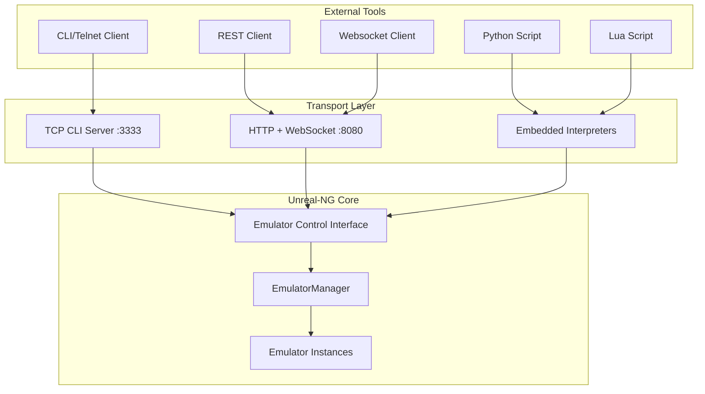

# Automation & Control Interface

> CLI, WebAPI, Lua, Python - Multiple paths to programmatic control

## Architecture Overview



---

## Command Line Interface (CLI)

### Connection
```bash
# Connect via telnet (port 3333)
telnet localhost 3333

# Or use netcat
nc localhost 3333
```

### Command Reference

#### Lifecycle Management
```
list                    # List all emulator instances
create [model]          # Create new instance
start                   # Start selected instance
stop / remove           # Destroy instance
select <uuid>           # Set active instance
status                  # Show all instances status
models                  # List supported models and RAM configurations
```

Supported models: `48K`, `128K`, `PENTAGON` (128/256/512/1024K), `PLUS3`, `SCORPION`, `PROFI`, `KAY`, `ATM710`, `ATM450`, `ATM3`, `TSL`, `PHOENIX`

#### Execution Control
```
pause                   # Pause emulation
resume                  # Resume emulation
reset                   # Hardware reset
step / stepin           # Execute one instruction
stepover                # Step over CALL/RST
steps <N>               # Execute N instructions
run_frame               # Run one video frame
run_frames <N>          # Run N video frames
run_tstates <N>         # Run N T-states (1 = ULA step / 2 pixels)
run_to_scanline <N>     # Run until scanline N boundary
run_scanlines <N>       # Run N scanlines
run_to_pixel            # Run to next screen pixel
run_to_interrupt        # Run until next interrupt
```

#### State Inspection
```
registers               # Show all Z80 registers
reg <name>              # Get single register by name
reg get <name>          # Get single register (alias)
reg <name> <value>      # Set register value
reg set <name> <value>  # Set register (alias)
memory <addr> [len]     # Hex dump memory
state memory            # Bank mapping info
state screen            # Video state
state audio             # Sound chip state
state ports             # I/O port state
state sysvars           # ZX-Spectrum system variables
```

#### Breakpoints
```
bp <addr>               # Set execution breakpoint
wp <addr> <r|w|rw>      # Set memory watchpoint
bport <port> <in|out>   # Set I/O breakpoint
bplist                  # List all breakpoints
bpclear [id|all]        # Remove breakpoints
bpon / bpoff            # Toggle breakpoints
```

#### Media Operations
```
open <file>             # Auto-detect and load file
snapshot save <file>    # Save snapshot (.sna/.z80)
snapshot info           # Current snapshot status
tape load/eject/play    # Tape control
disk insert/eject       # Disk control
disk catalog            # List TR-DOS directory
```

#### Features & Settings
```
feature list            # List all toggleable features
feature <name> on/off   # Toggle feature
setting <name> [value]  # Query or set configuration
```

#### VideoWall Control
```
videowall singlesync on [id]    # Enable single sync mode (sync all tiles to one emulator)
videowall singlesync off        # Disable single sync mode (independent tile rendering)
```

---

## WebAPI (REST)

### Base URL
```
http://localhost:8080/api
```

### OpenAPI/Swagger
Interactive documentation available at `/api/swagger`

### Endpoints

#### Emulator Management
| Method | Endpoint | Description |
|:-------|:---------|:------------|
| GET | `/api/v1/emulator` | List all instances |
| GET | `/api/v1/emulator/models` | List available machine models |
| POST | `/api/v1/emulator/create` | Create new instance |
| POST | `/api/v1/emulator/start` | Create and start instance |
| DELETE | `/api/v1/emulator/{id}` | Destroy instance |
| GET | `/api/v1/emulator/{id}` | Instance details |
| POST | `/api/v1/emulator/{id}/model` | Switch machine model |

#### Execution Control
| Method | Endpoint | Description |
|:-------|:---------|:------------|
| POST | `/api/v1/emulator/{id}/start` | Start |
| POST | `/api/v1/emulator/{id}/stop` | Stop |
| POST | `/api/v1/emulator/{id}/pause` | Pause |
| POST | `/api/v1/emulator/{id}/resume` | Resume |
| POST | `/api/v1/emulator/{id}/reset` | Reset |
| POST | `/api/v1/emulator/{id}/step` | Step one instruction |
| POST | `/api/v1/emulator/{id}/run_frame` | Run one frame |
| POST | `/api/v1/emulator/{id}/run_frames` | Run N frames |
| POST | `/api/v1/emulator/{id}/run_tstates` | Run N T-states |
| POST | `/api/v1/emulator/{id}/run_to_scanline` | Run to scanline N |
| POST | `/api/v1/emulator/{id}/run_scanlines` | Run N scanlines |
| POST | `/api/v1/emulator/{id}/run_to_pixel` | Run to next pixel |
| POST | `/api/v1/emulator/{id}/run_to_interrupt` | Run to interrupt |

#### State & Memory
| Method | Endpoint | Description |
|:-------|:---------|:------------|
| GET | `/api/v1/emulator/{id}/registers` | All CPU registers |
| GET | `/api/v1/emulator/{id}/registers/{name}` | Single register |
| PUT | `/api/v1/emulator/{id}/registers/{name}` | Set register |
| GET | `/api/v1/emulator/{id}/memory?addr=&len=` | Memory dump |
| PUT | `/api/v1/emulator/{id}/memory` | Poke memory |

#### Files & Snapshots
| Method | Endpoint | Description |
|:-------|:---------|:------------|
| POST | `/emulators/{id}/open` | Load file |
| POST | `/emulators/{id}/snapshot/save` | Save snapshot |
| GET | `/emulators/{id}/snapshot/info` | Snapshot status |

#### VideoWall Control
| Method | Endpoint | Description |
|:-------|:---------|:------------|
| POST | `/videowall/singlesync` | Set single sync mode |

**Request body:**
```json
{
  "enable": true,
  "emulator_id": "optional-uuid"
}
```

#### Machine Model Switching
Switch between ZX Spectrum models at runtime:
```bash
# Get available models
curl http://localhost:8090/api/v1/emulator/models

# Switch to Spectrum 48K
curl -X POST http://localhost:8090/api/v1/emulator/{id}/model \
  -H "Content-Type: application/json" \
  -d '{"model": "48K"}'

# Switch to Pentagon 512K
curl -X POST http://localhost:8090/api/v1/emulator/{id}/model \
  -H "Content-Type: application/json" \
  -d '{"model": "PENTAGON", "ram_size": 512}'
```

**Note**: Model switching destroys the current emulator instance and creates a new one. The response includes both old and new emulator IDs.

#### Command Batching
For VideoWall and bulk operations:
```json
POST /batch
{
  "commands": [
    {"id": "uuid1", "action": "open", "file": "game1.z80"},
    {"id": "uuid2", "action": "open", "file": "game2.z80"},
    {"id": "uuid3", "action": "reset"}
  ]
}
```

---

## Lua Scripting

### Embedded Lua 5.4.7
Scripts run in-process with direct access to emulator API.

### Example: Simple Game Bot
```lua
-- Wait for specific memory value
function waitForLives(targetLives)
    while emu.peek(0x5C00) ~= targetLives do
        emu.step()
    end
end

-- Auto-fire script
function autofire()
    while true do
        emu.keyDown("z")    -- Fire
        emu.runFrames(2)
        emu.keyUp("z")
        emu.runFrames(5)
    end
end
```

### API Objects
- `emu` - Emulator control (step, run, pause, reset)
- `memory` - Memory access (peek, poke, dump)
- `cpu` - Register access
- `sound` - AY chip control
- `disk` - Disk operations
- `videowall` - VideoWall control

### VideoWall Control
```lua
-- Enable single sync mode (all tiles sync to first emulator)
videowall.setSingleSync(true)

-- Enable single sync to specific emulator
videowall.setSingleSync(true, "emulator-uuid")

-- Disable single sync mode
videowall.setSingleSync(false)
```

---

## Python Integration

### Embedded Python 3
Full Python interpreter with pybind11 bindings.

### Example: AI Training Loop
```python
import emu

def get_reward():
    """Calculate reward from game state"""
    score = emu.peek16(SCORE_ADDR)
    lives = emu.peek(LIVES_ADDR)
    return score * 10 + lives * 100

def training_step(action):
    # Take action
    emu.set_joystick(action)
    
    # Run one frame
    emu.run_frames(1)
    
    # Get observation
    screen = emu.get_screen_buffer()  # numpy array
    reward = get_reward()
    done = emu.peek(LIVES_ADDR) == 0
    
    return screen, reward, done
```

### Advanced Features
- NumPy integration for screen buffer access
- Async event loop support (planned)
- Virtual environment package management (planned)

### VideoWall Control
```python
import videowall

# Enable single sync mode (all tiles sync to first emulator)
videowall.set_single_sync(True)

# Enable single sync to specific emulator
videowall.set_single_sync(True, emulator_id="uuid-string")

# Disable single sync mode
videowall.set_single_sync(False)
```

---

## Feature Parity Matrix

| Feature | CLI | WebAPI | Lua | Python | Qt Menu |
|:--------|:---:|:------:|:---:|:------:|:-------:|
| Create/Destroy | ✅ | ✅ | ✅ | ✅ | ✅ |
| Model Switch | ✅ | ✅ | ✅ | ✅ | ✅ |
| Pause/Resume | ✅ | ✅ | ✅ | ✅ | ✅ |
| Step/Run | ✅ | ✅ | ✅ | ✅ | ✅ |
| Registers | ✅ | ✅ | ✅ | ✅ | ✅ |
| Memory R/W | ✅ | ✅ | ✅ | ✅ | ❌ |
| Breakpoints | ✅ | ✅ | ✅ | ✅ | ✅ |
| Load/Save | ✅ | ✅ | ✅ | ✅ | ✅ |
| Feature Toggle | ✅ | ✅ | ✅ | ✅ | 🔶 |
| VideoWall Control | ✅ | ✅ | ✅ | ✅ | ❌ |
| Keyboard Input | ❌ | ✅ | ✅ | ✅ | ❌ |
| Screen Buffer | ❌ | ✅ | ✅ | ✅ | ❌ |
| Event Callbacks | ❌ | 🔶 | 🔶 | 🔶 | ❌ |

---

## Planned: Advanced AI Agent API

### Perception (Sensing)
```python
emu.get_screen_buffer()           # Screen as numpy array
emu.peek(addr) / emu.peek_range() # Memory access
emu.get_registers()               # Full CPU state
emu.find_in_memory(pattern)       # Pattern search
```

### Action (Affecting)
```python
emu.press_key(key) / emu.release_key(key)
emu.set_joystick(direction, fire)
emu.poke(addr, value)
emu.save_state(slot) / emu.load_state(slot)
```

### Control
```python
emu.run_frames(n) / emu.run_tstates(n)
emu.pause() / emu.resume()
emu.reset()
await emu.wait_for_interrupt()
await emu.wait_for_mem_write(addr)
await emu.wait_for_raster_pos(line, tstate)
```

---

## See Also
- [Debugging](debugging.md) - Breakpoint details
- [ECI Command Surface](../emulator/design/control-interfaces/) - Full specification
