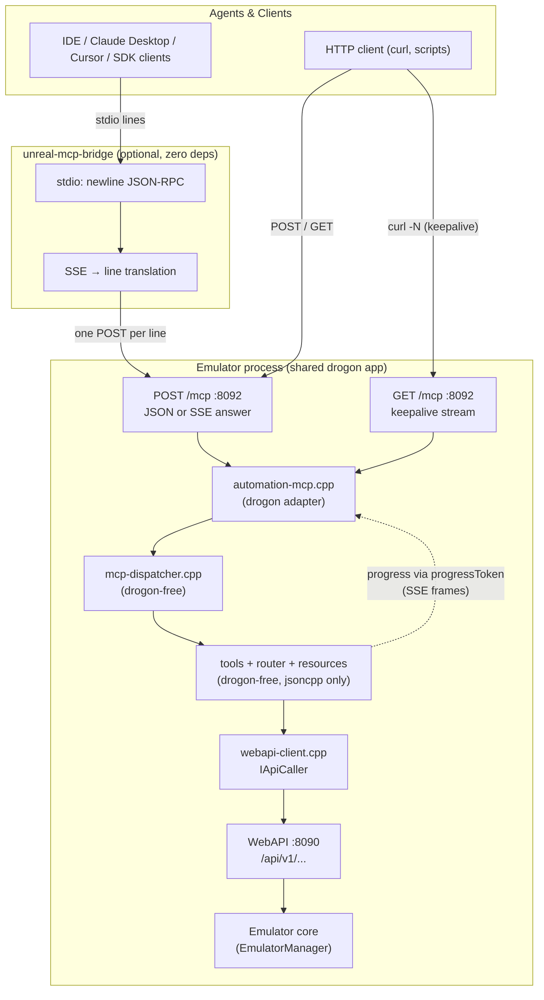

# MCP Server (Model Context Protocol)

> AI-agent control surface for Unreal-NG: 11 smart tools + 2 router tools,
> 6 resources, Streamable HTTP with optional SSE progress streaming, and a
> zero-dependency stdio bridge for IDE integration.

## Overview

The MCP server lets LLM-driven agents (Claude Desktop, Claude Code, Cursor,
Cline, Continue, VS Code, custom SDK clients) operate the emulator the way a
human does — through high-level intent ("load this tape and run it", "why is
this frame slow?", "record a GIF of the effect") instead of raw register
poking. It sits on top of the existing WebAPI: every tool fans out to loopback
HTTP calls, so the WebAPI stays the single source of truth for emulator
state.

Design facts at a glance:

| Property | Value |
|:--|:--|
| Protocol | MCP `2025-03-26` (JSON-RPC 2.0) |
| Transport | Streamable HTTP — JSON or SSE answers, stateless |
| Endpoint | `http://localhost:8092/mcp` (also reachable on :8090) |
| stdio | via `unreal-mcp-bridge` (one process, no deps) |
| Tools | 11 smart + `search_api`/`invoke_api` schema-driven router |
| Resources | 6 (`unreal://…`) |
| Sessions | none — no `Mcp-Session-Id`, every request is self-contained |
| Prompts | none advertised (empty `prompts/list`) |
| Token cost | ~1.6k for the tool catalog |

Implementation: [`core/automation/mcp/`](../../../core/automation/mcp/README.md)
(module internals, tool→endpoint mapping, test layout). Client hookup:
[integration-guide.md](integration-guide.md). Bridge details:
[bridge README](../../../core/automation/mcp/bridge/README.md).

## Architecture



Key properties:

- **Drogon-free core**: the dispatcher, all tools, the router and resources
  depend only on jsoncpp — `core-tests` drives the entire protocol stack
  against a synchronous `FakeApiCaller`, no HTTP in sight.
- **Loopback orchestration**: tools never touch the emulator directly; they
  call `http://127.0.0.1:8090/api/v1/...` through `IApiCaller`. One transport,
  one truth.
- **Bridge stays a byte pipe**: it never parses JSON; SSE answers are
  translated at the line level (each `data:` payload → one stdout line).

## Transport matrix

| Path | Client speaks | Request framing | Answer | Best for |
|:--|:--|:--|:--|:--|
| stdio bridge | newline JSON-RPC on stdin | one POST per line | JSON body → one stdout line; SSE body → one line per event | Claude Desktop, IDEs, sandboxed tool environments |
| HTTP JSON (`curl`, SDKs) | HTTP POST | JSON-RPC body | `application/json` (202 + empty for notifications) | scripts, tests, simple clients |
| HTTP SSE | HTTP POST + `Accept: text/event-stream` + `_meta.progressToken` | JSON-RPC body | `text/event-stream`: `notifications/progress` frames, final frame = response | long tools (bounded recordings, multi-aspect inspection) |
| GET stream | HTTP GET | — | `text/event-stream`, `: keepalive` comment every 15 s | future lifecycle events; liveness probing |

The SSE answer mode is strictly opt-in on both ends: without the `Accept`
header **or** without a `progressToken` the server answers plain JSON — every
existing client keeps working unmodified. `DELETE /mcp` and `HEAD /mcp`
return `405` (`Allow: GET, POST`): the server is stateless, there are no
sessions to manage.

## Tool catalog

All tools accept `target` (emulator id or `"auto"`) and answer with dual
content: `content[]` (human/LLM text summary) + `structuredContent`
(machine-readable data). Tools that perform real multi-step work report
progress when the request carries a `_meta.progressToken` (see
[Protocol details](#protocol-details)).

| Tool | Purpose | Progress |
|:--|:--|:--|
| `emulator_manage` | create/list/status/start/stop/pause/resume/reset/destroy, `list_models` | — |
| `load_software` | `.sna/.z80` snapshots, `.tap/.tzx` tapes (auto-play), `.trd/.scl/.fdi` disks | — |
| `control_execution` | run/pause/resume/step/step_n/step_over/step_out, `run_frames`/`run_tstates`/`run_to_interrupt`, breakpoints | — |
| `inspect_state` | aspect fan-out: machine, registers, memory, disasm, stack, breakpoints, memory_banks, screen_ocr, screen_image, screen_digest, timing | one notification per aspect |
| `type_input` | type (tokenized BASIC entry), tap/press/release, combo, macro, `release_all`, status, `list_keys` | — |
| `manage_symbols` | `load_labels`, list, resolve, `load_listing`, `source_at`, `step_line`, `run_to_line` (sjasmplus `.lst`) | — |
| `debug_code` | disassemble, assemble (two-pass, labels), `find_bytes`, `trace` (calltrace sessions), `porttrace` | `trace`: per phase (start/run/stop/read) |
| `analyze_performance` | coverage_* (+gaps), `frame_cost`, profiler suites, `profile_report`, `porttrace` | `profile_report` + `porttrace`: per phase |
| `capture_media` | screenshot (PNG/GIF + metadata), `screen_digest`, video recording (GIF native, `every_nth:"auto"` quantum sampling), `audio_capture` (RMS/peak/dominant-Hz, WAV) | bounded `every_nth` recordings: captured-frame counter (throttled to ~20 updates) |
| `search_api` | keyword search over the OpenAPI spec (scored), optional `auto_invoke` | — |
| `invoke_api` | direct WebAPI call with `{id}` target substitution | — |

The router pair (`search_api` / `invoke_api`) exposes the entire WebAPI —
28 endpoint groups, 212 paths — without minting a tool per endpoint. Agents
discover the surface via `search_api` and fall back to `invoke_api` when a
smart tool doesn't cover the use case.

## Resources

| URI | Content |
|:--|:--|
| `unreal://keyboard-layout` | ZX Spectrum key names for `type_input` |
| `unreal://basic-reference` | BASIC tokens/commands cheat sheet |
| `unreal://z80-isa` | Z80 instruction set reference (markdown) |
| `unreal://trdos-commands` | TR-DOS command reference |
| `unreal://memory-map` | 48K/128K memory map |
| `unreal://emulator-state` | live instance overview (dynamic — fetched per read) |

## Protocol details

### initialize negotiation

```json
→ {"jsonrpc":"2.0","id":1,"method":"initialize",
   "params":{"protocolVersion":"2025-03-26","capabilities":{},"clientInfo":{"name":"curl","version":"0"}}}
← {"jsonrpc":"2.0","id":1,"result":{
     "protocolVersion":"2025-03-26",
     "capabilities":{"tools":{"listChanged":false},"resources":{"subscribe":false,"listChanged":false}},
     "serverInfo":{"name":"unreal-ng","version":"1.0.0"},
     "instructions":"…agent-facing briefing…"}}
```

The server echoes the client's `protocolVersion` when supported, otherwise
answers with `2025-03-26`. `notifications/initialized` completes the
handshake (acknowledged with `202` + empty body, like every notification).

### Progress streaming

A client opts in per call by sending a `progressToken` (any string or number)
inside `_meta`:

```json
→ {"jsonrpc":"2.0","id":2,"method":"tools/call",
   "params":{"name":"inspect_state","arguments":{"aspects":["registers","disasm","screen_ocr"]},
             "_meta":{"progressToken":42}}}
```

- Over **HTTP with `Accept: text/event-stream`**, the answer becomes an SSE
  stream: one `event: message` frame per `notifications/progress` (params echo
  the token, `progress` increases monotonically, `total`/`message` describe
  the step), the final frame carries the JSON-RPC response, then the stream
  closes.
- Over the **stdio bridge**, each progress notification and the final response
  arrive as separate stdout lines — stdio clients get progress for free.
- Without a token (or over plain JSON HTTP) progress is silently dropped —
  never a protocol violation.

### Statelessness

No `Mcp-Session-Id` is ever issued or required. Consequences: any number of
clients may share the server; requests may be retried; load-balancing is
trivial; `DELETE /mcp` (session termination in the spec) is `405`. State that
*matters* (emulator instances, breakpoints, recordings) lives in the
emulator, addressed by `target`.

### Error model

| Situation | Result |
|:--|:--|
| Tool ran, work failed | tool result with `isError: true` + remediation hint (e.g. "Already recording — stop it first (record_stop)") — never a JSON-RPC error |
| Unknown tool | `-32602` Invalid params |
| Unknown method | `-32601` Method not found (`resources/subscribe` etc.) |
| Batch array | `-32600` (batching removed in `2025-03-26`) |
| Malformed JSON body | HTTP `400` + `-32700` |
| WebAPI unreachable | tool `isError` result: "WebAPI unreachable — is the emulator running with WebAPI enabled (port 8090)?" |
| Bridge cannot connect | `{"error":{"code":-32603,"message":"bridge: cannot reach <url> (…)"}}` on stdout, bridge keeps running |

## Comparison with xspeccy-mcp

| Aspect | xspeccy-mcp | unreal-ng (this server) |
|:--|:--|:--|
| Transport | stdio only | Streamable HTTP :8092 (JSON/SSE) + stdio bridge |
| Backend | direct core calls | loopback WebAPI — single source of truth |
| Tool count | 48 flat tools | 11 smart tools + schema-driven router |
| Context cost | ~4k tokens | ~1.6k tokens |
| Progress | — | `notifications/progress` per real work unit (SSE or stdio lines) |
| Resources | — | 6 (keyboard/BASIC/Z80/TR-DOS/memory map/state) |
| Sessions | per-process | stateless — share one server between clients |

## Security

- The MCP listener binds all interfaces (`0.0.0.0:8092`) with **no
  authentication** — the trust boundary is the network itself. This matches
  the WebAPI (:8090) and CLI (:8765) listeners. Run on a trusted machine or
  behind a firewall; anyone who can reach the port can control the emulator
  and read/write emulator memory.
- There is no path traversal or file access through MCP beyond what WebAPI
  itself exposes (load files the emulator process can already read, write
  recordings to the scratch dir).
- The bridge adds no surface of its own: it only connects to
  `http://127.0.0.1:8092/mcp` (or `--url`/`UNREAL_MCP_URL`).

## Quick test

```bash
# JSON round-trip
curl -s -X POST http://localhost:8092/mcp \
  -H 'Content-Type: application/json' \
  -d '{"jsonrpc":"2.0","id":1,"method":"tools/list"}' | jq '.result.tools | length'
# → 11

# SSE progress stream
curl -N -s -X POST http://localhost:8092/mcp \
  -H 'Content-Type: application/json' -H 'Accept: text/event-stream' \
  -d '{"jsonrpc":"2.0","id":2,"method":"tools/call",
       "params":{"name":"inspect_state","arguments":{"aspects":["registers","screen_ocr"]},
                  "_meta":{"progressToken":1}}}'

# stdio bridge
echo '{"jsonrpc":"2.0","id":1,"method":"ping"}' | ./cmake-build-release/bin/unreal-mcp-bridge
```

The emulator application must be running (it serves `/mcp`; a busy :8092
disables MCP for that instance with a console warning — the app keeps
running).

## Testing

Unit tests (drogon-free, `FakeApiCaller`-driven) run in `core-tests`:

```bash
ninja -C cmake-build-release && cmake-build-release/bin/core-tests \
  --gtest_filter='McpSse_Test.*:McpDispatcher_*:McpRouter_Test.*:McpTools_Test.*'
```

- `McpSse_Test` — SSE frame encoding, progress notification shape
- `McpDispatcher_Test` / `McpDispatcher_Progress_Test` — JSON-RPC routing,
  notification ordering, progressToken plumbing
- `McpTools_Test` — action→endpoint mapping + progress sequences
- `McpRouter_Test` — OpenAPI search/invoke against a scripted spec

End-to-end: `scripts/mcp-smoke-test.sh` (HTTP + bridge + SSE round-trips
against a running emulator).
