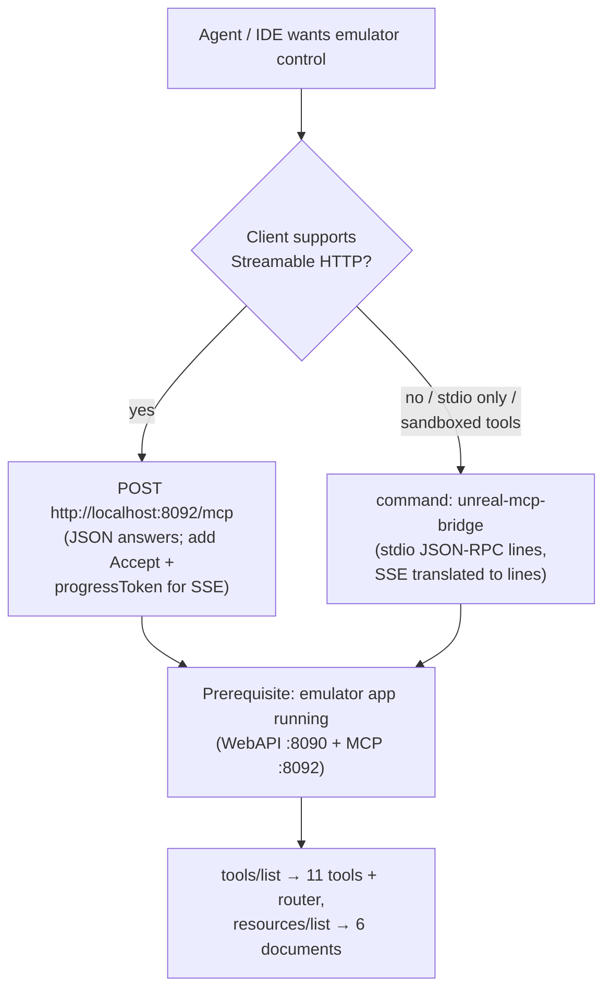

# MCP Integration Guide

> Connecting agents and IDEs to the Unreal-NG MCP server — stdio bridge for
> sandboxed clients, direct Streamable HTTP for everything else.

Companion to [README.md](README.md) (architecture, tool catalog, protocol).
Copy-paste configs live in [examples/](examples/).

## Picking a connection mode



Both modes expose the identical protocol surface — same tools, same
resources, same progress notifications (the bridge converts SSE frames into
one stdout line each). Pick whichever the client supports natively; when in
doubt use the bridge (works everywhere stdio works, zero dependencies).

**Build the bridge first**: `ninja -C cmake-build-release unreal-mcp-bridge`
→ `cmake-build-release/bin/unreal-mcp-bridge` (macOS/Linux) or
`cmake-build-release\bin\unreal-mcp-bridge.exe` (Windows).

## Claude Desktop

Claude Desktop speaks stdio only — use the bridge as the server command.

`~/Library/Application Support/Claude/claude_desktop_config.json` (macOS) or
`%APPDATA%\Claude\claude_desktop_config.json` (Windows) — see
[examples/claude-desktop-config.json](examples/claude-desktop-config.json):

```json
{
  "mcpServers": {
    "unreal-ng": {
      "command": "/absolute/path/to/unreal/cmake-build-release/bin/unreal-mcp-bridge",
      "env": { "UNREAL_MCP_URL": "http://127.0.0.1:8092/mcp" }
    }
  }
}
```

Notes:

- Absolute path to the bridge — Claude Desktop doesn't expand `~` or relative
  paths. On Windows double the backslashes in JSON
  (`"C:\\dev\\unreal\\cmake-build-release\\bin\\unreal-mcp-bridge.exe"`).
- Start the emulator **before** (or after — the bridge retries per request)
  chatting; Claude lists tools via the hammer/power-user icon.
- First thing to ask: *"list the emulators"* (`emulator_manage` action `list`)
  — if that answers, the whole chain works.

## Claude Code

Two options — repository `.mcp.json` (shared with the team, see
[examples/mcp-json.md](examples/mcp-json.md)) or a one-liner:

```bash
# stdio bridge (recommended — works inside sandboxed tool environments)
claude mcp add unreal-ng -- /absolute/path/to/cmake-build-release/bin/unreal-mcp-bridge

# or direct HTTP (Claude Code supports Streamable HTTP servers)
claude mcp add --transport http unreal-ng http://localhost:8092/mcp
```

Repository-root `.mcp.json`:

```json
{
  "mcpServers": {
    "unreal-ng": {
      "command": "cmake-build-release/bin/unreal-mcp-bridge",
      "args": [],
      "env": {}
    }
  }
}
```

Verify inside a session with `/mcp` — the 11 tools appear as
`unreal-ng:*` (`mcp__unreal-ng__inspect_state` in tool-use logs). Progress
notifications show as normal stdio messages while long tools run.

## Cursor

`.cursor/mcp.json` in the project (or global via Cursor Settings → MCP →
Add server):

```json
{
  "mcpServers": {
    "unreal-ng": {
      "command": "cmake-build-release/bin/unreal-mcp-bridge"
    }
  }
}
```

Cursor also accepts Streamable HTTP servers directly:

```json
{
  "mcpServers": {
    "unreal-ng": {
      "url": "http://localhost:8092/mcp"
    }
  }
}
```

After saving, click "Refresh" in the MCP pane; the tool list appears with the
`unreal-ng` prefix. Agent mode can then be told *"snapshot the machine and
disassemble at PC"* — Cursor maps that to `inspect_state`/`debug_code`.

## Cline

Cline (VS Code extension) → Cline icon → MCP Servers → Configure → writes
`cline_mcp_settings.json`:

```json
{
  "mcpServers": {
    "unreal-ng": {
      "command": "/absolute/path/to/unreal-mcp-bridge",
      "args": [],
      "env": {},
      "disabled": false,
      "autoApprove": []
    }
  }
}
```

Cline is stdio-first — the bridge is the natural fit. Consider adding
`inspect_state`, `search_api` and `invoke_api` to `autoApprove` for smoother
debugging loops (they are read-mostly).

## Continue

Continue (`config.yaml`, MCP support enabled in settings):

```yaml
mcpServers:
  - name: unreal-ng
    command: /absolute/path/to/unreal-mcp-bridge
    env:
      UNREAL_MCP_URL: http://127.0.0.1:8092/mcp
```

Tools appear as `unreal-ng_<tool>` in the tool list; slash commands and chat
@-mentions can then drive the emulator ("@unreal-ng what's on screen?" →
`inspect_state` with `screen_ocr`).

## VS Code (native MCP)

VS Code 1.99+ ships native MCP support — `.vscode/mcp.json` in the workspace
(or user-level via chat `MCP: Add Server`):

```json
{
  "servers": {
    "unreal-ng": {
      "type": "stdio",
      "command": "cmake-build-release/bin/unreal-mcp-bridge"
    }
  }
}
```

HTTP variant:

```json
{
  "servers": {
    "unreal-ng": {
      "type": "http",
      "url": "http://localhost:8092/mcp"
    }
  }
}
```

Enable with `Chat: MCP: List Servers` → start `unreal-ng`; tools show up in
Copilot Chat's tool picker (`#`).

## Direct HTTP (curl / scripts)

No client SDK needed — the server is plain JSON-RPC over HTTP POST.

```bash
# 1. Handshake (stateless server: initialize is courtesy, not a session)
curl -s -X POST http://localhost:8092/mcp -H 'Content-Type: application/json' -d '{
  "jsonrpc":"2.0","id":1,"method":"initialize",
  "params":{"protocolVersion":"2025-03-26","capabilities":{},
            "clientInfo":{"name":"curl","version":"0"}}}'

# 2. Notification (202 + empty body)
curl -s -X POST http://localhost:8092/mcp -H 'Content-Type: application/json' -d '{
  "jsonrpc":"2.0","method":"notifications/initialized"}'

# 3. Discover tools
curl -s -X POST http://localhost:8092/mcp -H 'Content-Type: application/json' -d '{
  "jsonrpc":"2.0","id":2,"method":"tools/list"}' | jq '.result.tools[].name'

# 4. Call a tool (JSON answer)
curl -s -X POST http://localhost:8092/mcp -H 'Content-Type: application/json' -d '{
  "jsonrpc":"2.0","id":3,"method":"tools/call",
  "params":{"name":"emulator_manage","arguments":{"action":"list"}}}' | jq .

# 5. Same call, streamed progress (SSE answer): -N + Accept + progressToken
curl -N -s -X POST http://localhost:8092/mcp \
  -H 'Content-Type: application/json' -H 'Accept: text/event-stream' -d '{
  "jsonrpc":"2.0","id":4,"method":"tools/call",
  "params":{"name":"inspect_state","arguments":{"aspects":["registers","disasm"]},
            "_meta":{"progressToken":"demo"}}}'

# 6. Server-initiated stream (keepalive every 15 s)
curl -N -s http://localhost:8092/mcp
```

SSE answers look like:

```
event: message
data: {"jsonrpc":"2.0","method":"notifications/progress","params":{"message":"registers","progress":1.0,"progressToken":"demo","total":2.0}}

event: message
data: {"id":4,"jsonrpc":"2.0","result":{...}}

```

(the final frame carries the same result a JSON answer would; then the server
closes the stream).

A ready-made script covering the full session lives at
[examples/curl-session.sh](examples/curl-session.sh).

## Python SDK client

`pip install mcp` (the official SDK, ≥ 1.9 for Streamable HTTP) — full script
at [examples/python-client.py](examples/python-client.py):

```python
import asyncio

from mcp import ClientSession
from mcp.client.streamable_http import streamablehttp_client

URL = "http://127.0.0.1:8092/mcp"


async def main() -> None:
    async with streamablehttp_client(URL) as (read_stream, write_stream, _):
        async with ClientSession(read_stream, write_stream) as session:
            await session.initialize()

            tools = await session.list_tools()
            print("tools:", [t.name for t in tools.tools])

            # progress_callback makes the SDK attach a progressToken and
            # surface notifications/progress as callbacks
            def on_progress(progress: float, total: float | None, message: str | None) -> None:
                print(f"  progress {progress}/{total} {message or ''}")

            result = await session.call_tool(
                "inspect_state",
                {"aspects": ["registers", "disasm"]},
                progress_callback=on_progress,
            )
            print(result.content[0].text)


asyncio.run(main())
```

For sandboxed environments where no HTTP egress is allowed, spawn the bridge
instead: `StdioClientParameters(command="…/unreal-mcp-bridge")` with the
SDK's stdio client — progress notifications arrive as ordinary session
messages.

## TypeScript SDK client

`npm i @modelcontextprotocol/sdk`:

```ts
import { Client } from "@modelcontextprotocol/sdk/client/index.js";
import { StreamableHTTPClientTransport } from "@modelcontextprotocol/sdk/client/streamableHttp.js";

const client = new Client({ name: "example", version: "0.0.1" }, { capabilities: {} });
const transport = new StreamableHTTPClientTransport(new URL("http://127.0.0.1:8092/mcp"));

await client.connect(transport);

const tools = await client.listTools();
console.log(tools.tools.map((t) => t.name));

// onprogress makes the SDK attach a progressToken and hook notifications/progress
const result = await client.callTool(
    { name: "inspect_state", arguments: { aspects: ["registers", "disasm"] } },
    undefined,
    {
        onprogress: (progress, info) =>
            console.log(`  progress ${progress}${info.total ? `/${info.total}` : ""} ${info.message ?? ""}`),
    },
);

await client.close();
```

## Troubleshooting

| Symptom | Likely cause | Fix |
|:--|:--|:--|
| Console warning "MCP server cannot start — Port 8092 is already in use" | second emulator instance grabbed :8092 | stop the other instance; `/mcp` also answers on :8090 of the older one |
| Bridge prints `bridge: cannot reach http://… (connection refused)` | emulator not running (or :8092 disabled) | start the emulator app; the bridge keeps retrying per request |
| Tool call returns `isError: true` "WebAPI unreachable — is the emulator running with WebAPI enabled (port 8090)?" | MCP up, WebAPI down (unusual — they start together) | check console logs for WebAPI errors |
| Tools don't appear in the client | wrong path in config (relative path / unescaped Windows backslashes) | use the absolute path to `unreal-mcp-bridge`; in JSON double every `\` |
| Agent sandbox can't spawn the bridge | sandbox denies spawning subprocesses or network | allow-list the bridge command; the bridge only talks to `127.0.0.1:8092` |
| No SSE stream even though the tool supports progress | missing `Accept: text/event-stream` or missing `_meta.progressToken` | both are required for SSE answers (curl: add both) |
| Progress notifications missing over the bridge | client SDK ignores progress without a handler | attach a `progress_callback` (Python) / `onprogress` (TS) so the SDK sends the token |
| `DELETE /mcp` returns 405 | expected — the server is stateless | nothing to fix; session termination doesn't apply |
| Nothing on `GET /mcp` for 15 s | expected — keepalive interval is 15 s | `curl -N` and wait, or watch the stream with a longer timeout |
| Client hangs on a very long tool | bridge receive ceiling is 5 min; tools like big recordings take minutes | split the work (`record_start` bounded `frames`, then `record_status`) |

## Next steps

- [README.md](README.md) — tool catalog, protocol details, SSE semantics
- [examples/](examples/) — ready-to-copy configs and scripts
- [core/automation/mcp/README.md](../../../core/automation/mcp/README.md) —
  module internals and test layout
- [bridge README](../../../core/automation/mcp/bridge/README.md) — bridge
  protocol behavior and URL configuration
