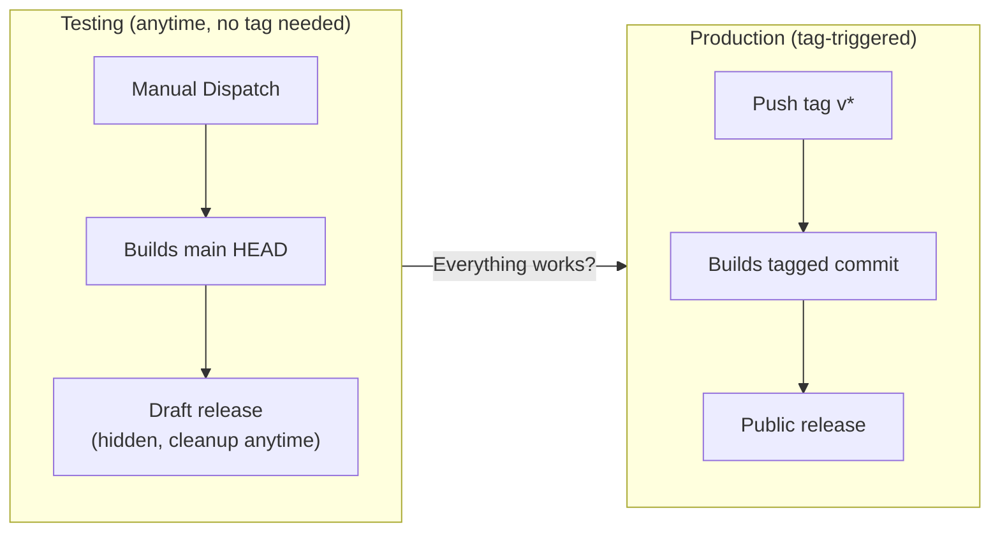
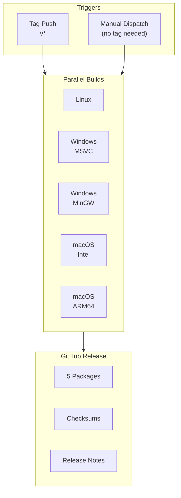

# Release Documentation

This directory contains documentation for the UnrealNG release process.

## Contents

| Document | Description |
|----------|-------------|
| [Release Strategy](./release-strategy.md) | Overall release process, versioning, and build matrix |
| [Release Testing](./release-testing.md) | How to test and validate the release workflow |

## Two Ways to Build a Release



### Quick Test (No Tag Needed)

You can test the full release pipeline on main HEAD at any time. It builds all platforms and creates a **hidden draft release** that you can inspect and delete. No tags are created.

1. Go to **Actions** → **Release Build**
2. Click **Run workflow**
3. Leave version as `dev` (or enter `test`)
4. Click **Run workflow**
5. Wait for build to complete (~15-25 min)
6. Inspect the draft release on the **Releases** page
7. Delete the draft when done

See [Release Testing](./release-testing.md) for detailed options.

### Production Release

```bash
# 1. Tag the release
git tag -a v1.0.0 -m "Release v1.0.0"

# 2. Push the tag (triggers build)
git push origin v1.0.0

# 3. Monitor at: https://github.com/alfishe/unreal-ng/actions
```

## Architecture Overview



## Related Files

| File | Location | Purpose |
|------|----------|---------|
| Release Workflow | `.github/workflows/release.yml` | Main release automation |
| CI Workflow | `.github/workflows/cmake-ci.yml` | Continuous integration |
| Docker Build | `.github/workflows/docker-build.yml` | Build container |
| Dockerfile | `docker/Dockerfile.universal` | Linux build environment |
| CMakeLists.txt | `CMakeLists.txt` | Build configuration |
