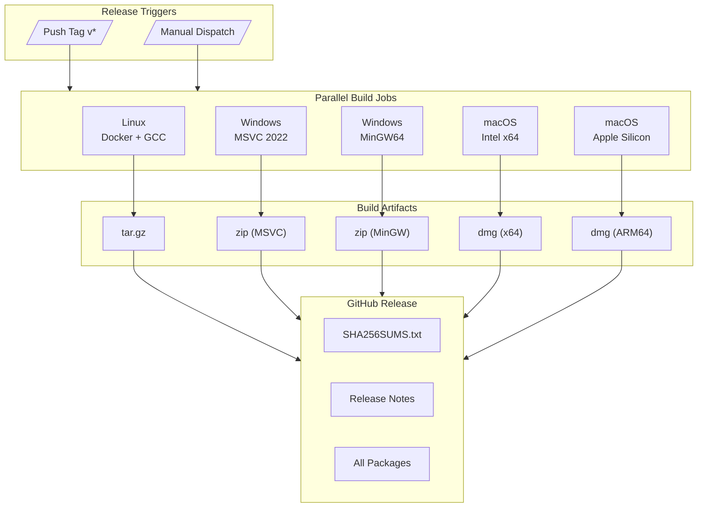
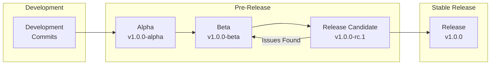
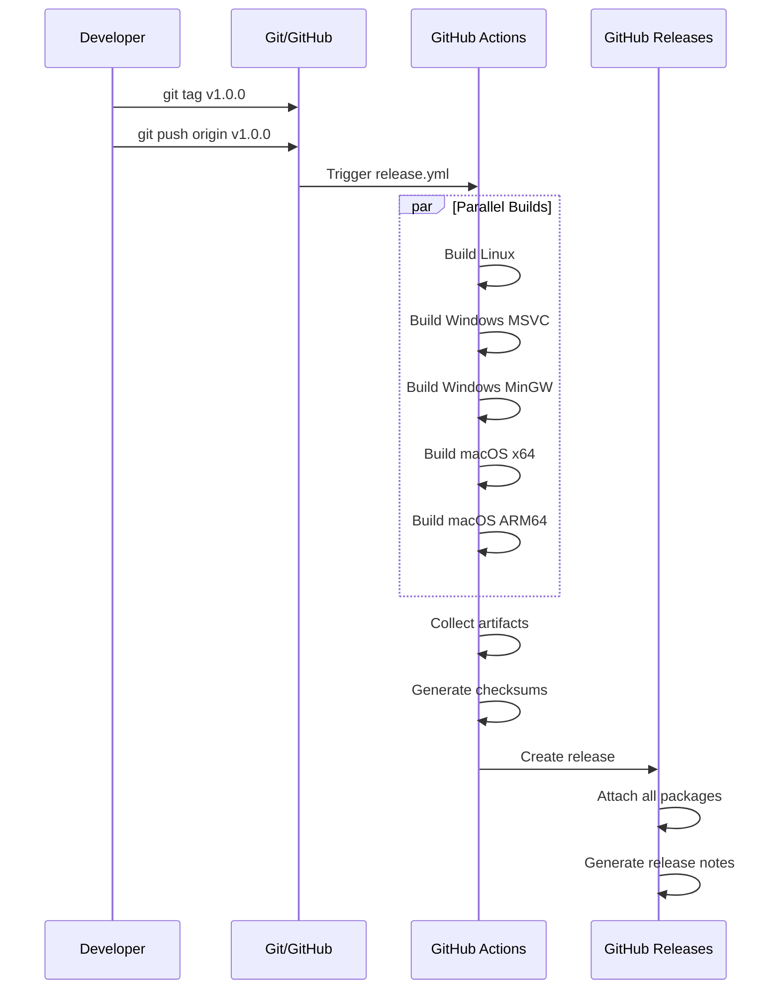
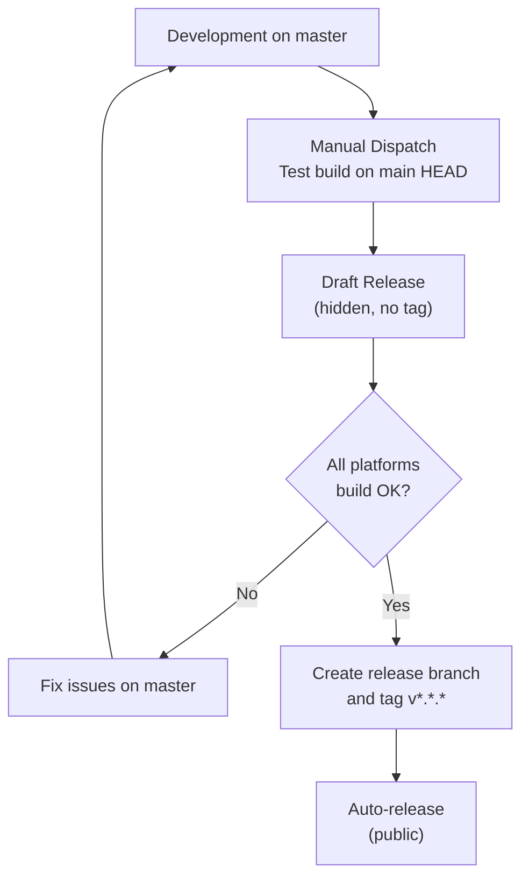
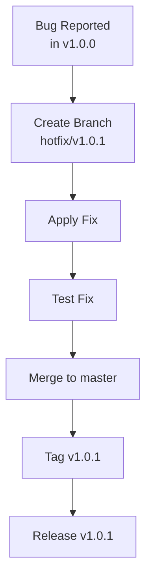

# UnrealNG Release Strategy

This document describes the release process, versioning strategy, and build pipeline for UnrealNG Suite.

## Overview

UnrealNG uses GitHub Actions for automated multi-platform builds and releases. The release workflow produces ready-to-distribute packages for all supported platforms.



## Versioning

UnrealNG follows [Semantic Versioning](https://semver.org/):

```
v<MAJOR>.<MINOR>.<PATCH>[-<PRERELEASE>]

Examples:
  v1.0.0        - Stable release
  v1.1.0        - Feature release
  v1.1.1        - Patch/bugfix release
  v2.0.0-alpha  - Major version alpha
  v2.0.0-beta.1 - Beta release
  v2.0.0-rc.1   - Release candidate
```

### Version Increment Guidelines

| Change Type | Version Bump | Example |
|------------|--------------|---------|
| Breaking API/format changes | MAJOR | v1.x.x → v2.0.0 |
| New features (backward compatible) | MINOR | v1.0.x → v1.1.0 |
| Bug fixes, performance improvements | PATCH | v1.0.0 → v1.0.1 |
| Pre-release testing | PRERELEASE | v1.0.0-alpha |

## Release Types



### 1. Development Builds (Draft)

- Triggered manually via `workflow_dispatch` (no tag needed)
- Builds the current HEAD of `master`
- Creates a **draft release** that is:
  - **Not visible to the public**
  - **Not associated with any tag**
  - Fully deletable from the Releases page
- Use this to validate the full pipeline anytime before cutting a real release

### 2. Pre-Release (Alpha/Beta/RC)

- Tags containing `alpha`, `beta`, or `rc`
- Marked as pre-release on GitHub
- Visible to users but flagged as unstable

### 3. Stable Release

- Clean version tags (e.g., `v1.0.0`)
- Full public release
- Auto-generated release notes from commits

## Build Matrix

```mermaid
flowchart TB
    subgraph Linux["Linux Build"]
        L1["Docker Container<br/>ghcr.io/alfishe/unreal-ng:qt6.9.3"]
        L2["GCC + Ninja"]
        L3["Qt 6.9.3 (pre-installed)"]
        L1 --> L2 --> L3
    end

    subgraph WindowsMSVC["Windows MSVC Build"]
        W1["windows-latest Runner"]
        W2["MSVC 2022 + MSBuild"]
        W3["Qt 6.9.3 msvc2022_64"]
        W1 --> W2 --> W3
    end

    subgraph WindowsMinGW["Windows MinGW Build"]
        M1["windows-latest + MSYS2"]
        M2["MinGW64 GCC + Ninja"]
        M3["Qt 6.9.3 mingw_64"]
        M1 --> M2 --> M3
    end

    subgraph macOS["macOS Builds"]
        MA1["macos-13 (Intel)"]
        MA2["macos-14 (Apple Silicon)"]
        MA3["Clang + Ninja"]
        MA4["Qt 6.9.3"]
        MA1 --> MA3
        MA2 --> MA3
        MA3 --> MA4
    end
```



### Platform Details

| Platform | Runner | Compiler | Qt Architecture | Output |
|----------|--------|----------|-----------------|--------|
| Linux x64 | Docker container | GCC 13+ | `linux_gcc_64` | `.tar.gz` |
| Windows x64 (MSVC) | windows-latest | MSVC 2022 | `win64_msvc2022_64` | `.zip` |
| Windows x64 (MinGW) | windows-latest + MSYS2 | MinGW GCC | `win64_mingw` | `.zip` |
| macOS Intel | macos-13 | Apple Clang | `clang_64` | `.dmg` |
| macOS ARM64 | macos-14 | Apple Clang | `clang_64` | `.dmg` |

## Package Contents

Each release package includes:

```
UnrealNG-Suite/
├── unreal-qt[.exe]           # Main emulator
├── unreal-screen-viewer[.exe] # Screen viewer
├── unreal-videowall[.exe]    # Video wall application
├── rom/                      # ROM files
│   ├── 48.rom
│   ├── 128.rom
│   ├── pentagon.rom
│   ├── trdos.rom
│   └── ... (50+ ROM files)
├── fonts/
│   └── consolas.ttf
├── unreal.ini                # Default configuration
└── [Qt dependencies]         # Platform-specific
```

## Release Workflow

### Creating a Release



### Step-by-Step Process

1. **Prepare the release**
   ```bash
   # Ensure all changes are committed
   git status
   
   # Update version in relevant files (if any)
   # Run tests locally
   ```

2. **Create and push the tag**
   ```bash
   git tag -a v1.0.0 -m "Release v1.0.0"
   git push origin v1.0.0
   ```

3. **Monitor the build**
   - Go to Actions tab on GitHub
   - Watch "Release Build" workflow progress
   - Build typically takes 15-25 minutes

4. **Verify the release**
   - Check GitHub Releases page
   - Verify all 5 packages are attached
   - Verify checksums file is present
   - Test download and extraction

### Recommended Workflow: Test First, Then Release

The recommended approach is to test the full pipeline on main HEAD before creating any tags or release branches:



1. **Iterate on master** until the code is ready
2. **Run a draft build** via manual dispatch to verify all platforms build and package correctly
3. **Delete the draft** after verification
4. **Create a release branch** and push a version tag to trigger the production release
5. The tag-triggered build creates a public release with auto-generated notes

### Manual Test Build (Draft)

No tag is needed. This builds main HEAD and creates a hidden draft release:

```bash
# Via GitHub UI:
# 1. Go to Actions → Release Build
# 2. Click "Run workflow"
# 3. Leave version as "dev" (or enter "test")
# 4. Click "Run workflow"
#
# Result: Draft release (not public, no tag created)
# Cleanup: Delete the draft from Releases page when done
```

### Production Release (Tag-Triggered)

```bash
# Tag and push to trigger auto-release
git tag -a v1.0.0 -m "Release v1.0.0"
git push origin v1.0.0
```

### Step-by-Step Production Release

## Hotfix Process



## File Locations

| File | Purpose |
|------|---------|
| `.github/workflows/release.yml` | Release workflow definition |
| `.github/workflows/cmake-ci.yml` | CI build (Linux only) |
| `.github/workflows/docker-build.yml` | Docker image build |
| `docker/Dockerfile.universal` | Linux build environment |
| `CMakeLists.txt` | Build configuration with packaging targets |

## See Also

- [Release Testing Guide](./release-testing.md) - How to test the release workflow
- [Docker Build Environment](../../docker/Dockerfile.universal) - Linux container setup
