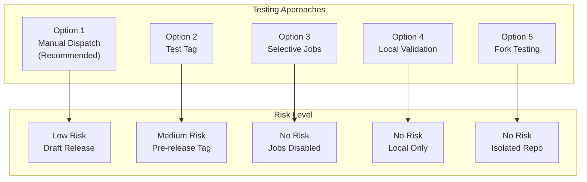
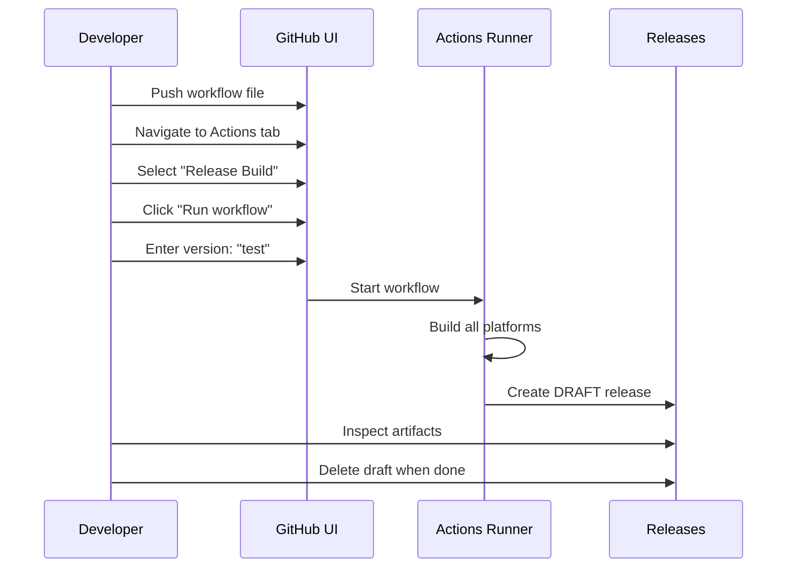
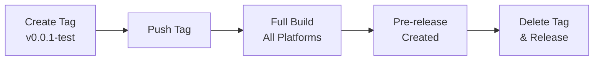
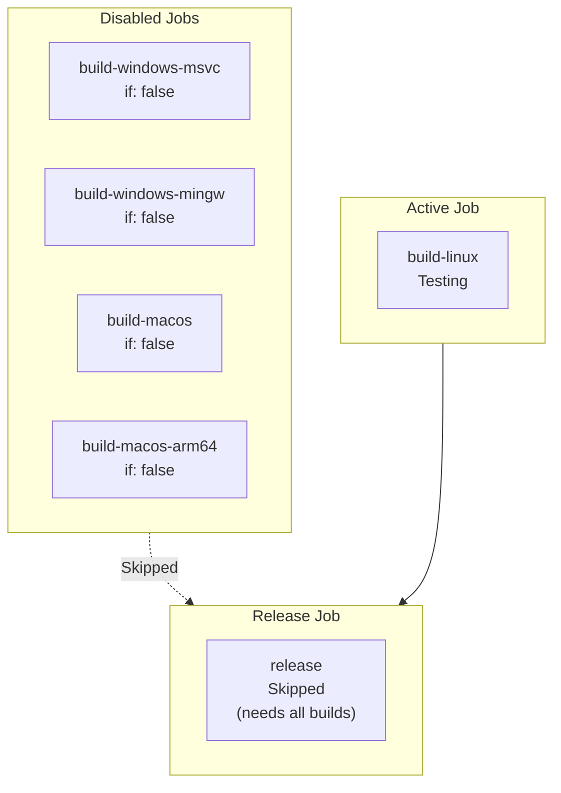
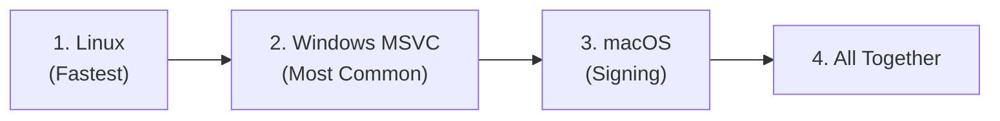
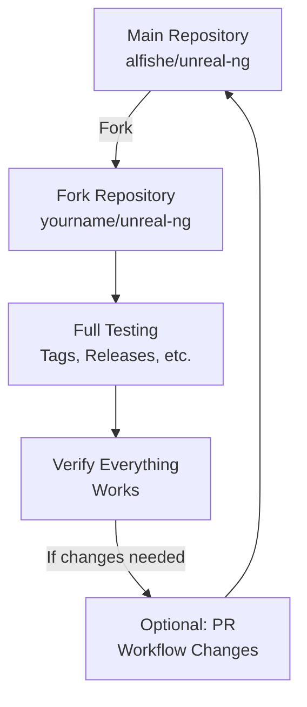
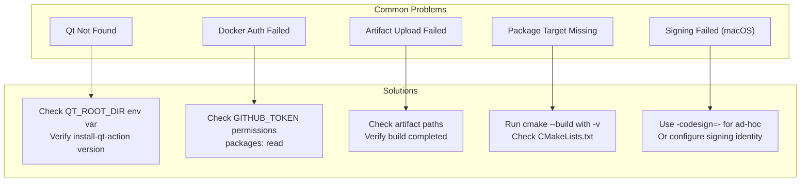

# Release Workflow Testing Guide

This document describes how to test and validate the GitHub Actions release workflow before using it for production releases.

## Testing Options Overview



## Option 1: Manual Dispatch (Recommended)

The safest way to test the complete workflow. **No tag is needed** -- it builds the current HEAD of `master` and creates a **draft release** that is invisible to the public and leaves no tags in the repository. You can run this anytime.



### Steps

1. **Push the workflow file**
   ```bash
   git add .github/workflows/release.yml
   git commit -m "Add release workflow"
   git push origin master
   ```

2. **Trigger manual dispatch**
   - Go to repository on GitHub
   - Click **Actions** tab
   - Select **Release Build** from left sidebar
   - Click **Run workflow** dropdown
   - Enter version: `test` (or `dev`, `debug`, etc.)
   - Click green **Run workflow** button

3. **Monitor progress**
   - Click on the running workflow
   - Expand each job to see logs
   - Build takes approximately 15-25 minutes

4. **Verify results**
   - Go to **Releases** page
   - Find the draft release (marked with "Draft" badge)
   - Check all artifacts are present:
     - `UnrealNG-Suite-Linux.tar.gz`
     - `UnrealNG-Suite-Windows-MSVC.zip`
     - `UnrealNG-Suite-Windows-MinGW.zip`
     - `UnrealNG-Suite-macOS-x64.dmg`
     - `UnrealNG-Suite-macOS-ARM64.dmg`
     - `SHA256SUMS.txt`

5. **Clean up**
   - Delete the draft release from the Releases page when testing is complete
   - No tags are created with manual dispatch -- nothing to clean up in git
   - You can re-run this as many times as needed

### Advantages
- **No tag required** -- runs on current main HEAD
- Creates draft release (hidden from public)
- No tags polluting the repository
- Full end-to-end test of all 5 platforms
- Easy to repeat anytime
- Fully deletable with no trace

---

## Option 2: Test Tag

Trigger the workflow with a test/pre-release tag. The release will be marked as "pre-release" on GitHub.



### Steps

1. **Create a test tag**
   ```bash
   # Use a version that clearly indicates testing
   git tag v0.0.1-test
   git push origin v0.0.1-test
   ```

2. **Monitor the workflow**
   - Watch progress in Actions tab
   - All 5 platform builds will run

3. **Verify the release**
   - Release appears with "Pre-release" label
   - Download and test packages if needed

4. **Clean up**
   ```bash
   # Delete remote tag
   git push origin --delete v0.0.1-test
   
   # Delete local tag
   git tag -d v0.0.1-test
   ```
   - Also delete the release from GitHub Releases page

### Tag Naming for Tests

| Tag Pattern | Release Type | Visibility |
|-------------|--------------|------------|
| `v0.0.1-test` | Pre-release | Public but flagged |
| `v0.0.1-alpha` | Pre-release | Public but flagged |
| `v0.0.1-dev` | Pre-release | Public but flagged |
| `v1.0.0` | Full release | Fully public |

---

## Option 3: Selective Job Testing

Test individual platform builds by temporarily disabling other jobs.



### Steps

1. **Modify workflow temporarily**
   ```yaml
   # Add to jobs you want to skip:
   build-windows-msvc:
     if: false  # Temporarily disabled
     runs-on: windows-latest
     # ...

   build-windows-mingw:
     if: false  # Temporarily disabled
     # ...
   ```

2. **Push and trigger**
   ```bash
   git add .github/workflows/release.yml
   git commit -m "Test: Linux build only"
   git push origin master
   ```

3. **Run manual dispatch or use test tag**

4. **Restore workflow**
   ```bash
   # Remove the 'if: false' lines
   git commit -am "Restore all build jobs"
   git push origin master
   ```

### Testing Order Recommendation



1. **Linux first** - Uses Docker, fastest feedback
2. **Windows MSVC** - Most common Windows build
3. **macOS** - Has additional signing steps
4. **All platforms** - Full integration test

---

## Option 4: Local Validation

Validate workflow syntax and simulate execution locally using `act` or manual checks.

### Syntax Validation with `act`

```bash
# Install act (https://github.com/nektos/act)
# macOS
brew install act

# Windows (scoop)
scoop install act

# Linux
curl -s https://raw.githubusercontent.com/nektos/act/master/install.sh | sudo bash
```

```bash
# Dry-run (validate syntax without running)
act -n

# List all jobs
act -l

# Run specific job in dry-run mode
act -n -j build-linux
```

### Manual YAML Validation

```bash
# Using yq (YAML processor)
yq eval '.github/workflows/release.yml' .

# Using Python
python -c "import yaml; yaml.safe_load(open('.github/workflows/release.yml'))"
```

### Local Build Test

Test the CMake build locally before relying on CI:

```bash
# Linux/macOS
cmake -B build -G Ninja -DCMAKE_BUILD_TYPE=Release -DBUILD_QT_APPS=ON
cmake --build build --parallel
cmake --build build --target package_suite_linux  # or package_suite_macos

# Windows (PowerShell)
cmake -B build -G "Visual Studio 17 2022" -A x64 -DBUILD_QT_APPS=ON
cmake --build build --config Release
cmake --build build --config Release --target package_suite_windows
```

---

## Option 5: Fork Testing

Test the workflow in a forked repository to avoid any impact on the main repository.



### Steps

1. **Fork the repository** on GitHub

2. **Clone your fork**
   ```bash
   git clone https://github.com/YOUR_USERNAME/unreal-ng.git
   cd unreal-ng
   ```

3. **Enable Actions in fork**
   - Go to fork's **Settings** → **Actions** → **General**
   - Enable "Allow all actions"

4. **Test freely**
   - Create tags, trigger workflows
   - No impact on main repository

5. **Sync changes back** (if needed)
   - Create PR from fork to main repository

---

## Troubleshooting

### Common Issues



### Debug Mode

Add debug output to workflow:

```yaml
- name: Debug environment
  run: |
    echo "QT_ROOT_DIR: ${{ env.QT_ROOT_DIR }}"
    echo "GitHub Ref: ${{ github.ref }}"
    ls -la build/packages/ || echo "No packages directory"
```

### Checking Logs

1. Go to **Actions** tab
2. Click on the failed workflow run
3. Expand the failed job
4. Click on the failed step
5. Look for error messages in red

### Re-running Failed Jobs

- Click **Re-run failed jobs** button
- Or **Re-run all jobs** for full retry

---

## Testing Checklist

Use this checklist when testing the release workflow:

```markdown
### Pre-Test
- [ ] Workflow file committed and pushed
- [ ] All submodules up to date
- [ ] No uncommitted changes

### Build Verification
- [ ] Linux build completes
- [ ] Windows MSVC build completes
- [ ] Windows MinGW build completes
- [ ] macOS x64 build completes
- [ ] macOS ARM64 build completes

### Artifact Verification
- [ ] All 5 packages uploaded
- [ ] Package sizes reasonable (50-150 MB each)
- [ ] SHA256SUMS.txt generated

### Release Verification
- [ ] Release created (draft or pre-release)
- [ ] All artifacts attached
- [ ] Release notes generated
- [ ] Version tag correct

### Package Contents
- [ ] Executables present and runnable
- [ ] ROM files included
- [ ] Configuration file included
- [ ] Fonts included
- [ ] Qt dependencies bundled (Windows/macOS)

### Cleanup
- [ ] Test tags deleted
- [ ] Draft releases deleted
- [ ] Workflow file restored (if modified)
```

---

## Quick Reference

| Goal | Command/Action |
|------|----------------|
| Push workflow | `git push origin master` |
| Manual trigger | Actions → Release Build → Run workflow |
| Create test tag | `git tag v0.0.1-test && git push origin v0.0.1-test` |
| Delete remote tag | `git push origin --delete v0.0.1-test` |
| Delete local tag | `git tag -d v0.0.1-test` |
| Validate syntax | `act -n` |
| Check workflow logs | Actions → [workflow run] → [job] → [step] |

## See Also

- [Release Strategy](./release-strategy.md) - Overall release process
- [GitHub Actions Documentation](https://docs.github.com/en/actions)
- [act - Local Actions Runner](https://github.com/nektos/act)
