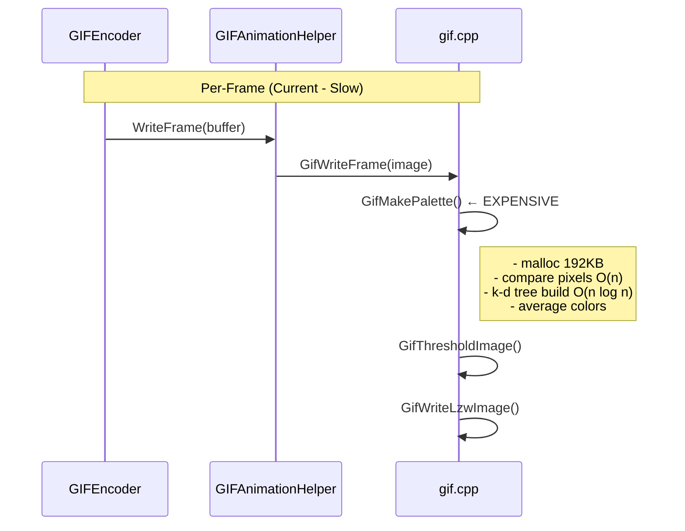
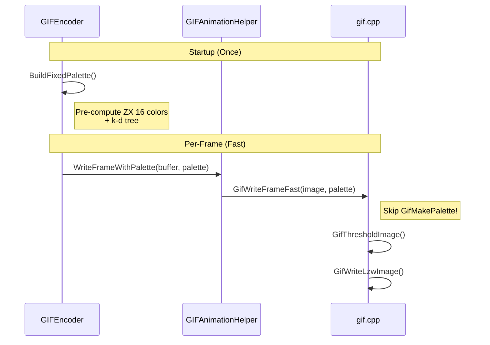
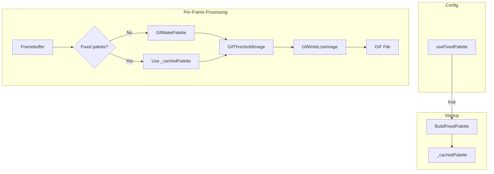

# GIF Encoder Fixed Palette Optimization

## Goal
Add optional fixed-palette mode to GIF encoder for ZX Spectrum, bypassing expensive per-frame palette calculation while preserving original behavior as default.

---

## Flow Comparison

### Current Flow (Default - Preserved)



### Optimized Flow (Fixed Palette Mode)



---

## Data Flow Diagram



---

## Proposed Changes

### 1. EncoderConfig (encoder_config.h)

```cpp
/// region <Palette Configuration>

/// Palette mode for GIF encoding
enum class GifPaletteMode
{
    Auto,           ///< Recalculate palette per-frame (original behavior)
    FixedZX16,      ///< Fixed ZX Spectrum 16-color palette
    FixedZX256,     ///< Fixed 256-color palette for modern clones
    Custom          ///< User-provided palette (future)
};

/// Palette mode (default: Auto for compatibility)
GifPaletteMode gifPaletteMode = GifPaletteMode::Auto;

/// endregion </Palette Configuration>
```

---

### 2. GIF Helper Extension (gifanimationhelper.h)

```cpp
class GIFAnimationHelper
{
public:
    // Existing method (unchanged)
    void WriteFrame(uint32_t* buffer, size_t size);
    
    // NEW: Write frame with pre-built palette
    void WriteFrameWithPalette(uint32_t* buffer, size_t size, const GifPalette& palette);
    
private:
    // Internal helper
    bool _useFixedPalette = false;
    GifPalette _fixedPalette;
};
```

---

### 3. New Function in gif.cpp

```cpp
/// @brief Write frame using pre-built palette (skip palette calculation)
bool GifWriteFrameFast(GifWriter* writer, const uint8_t* image, 
                       uint32_t width, uint32_t height, uint32_t delay,
                       const GifPalette* palette, bool dither)
{
    if (!writer->f)
        return false;

    const uint8_t* oldImage = writer->firstFrame ? NULL : writer->oldImage;
    writer->firstFrame = false;

    // Skip GifMakePalette entirely - use provided palette!
    
    if (dither)
        GifDitherImage(oldImage, image, writer->oldImage, width, height, palette);
    else
        GifThresholdImage(oldImage, image, writer->oldImage, width, height, palette);

    GifWriteLzwImage(writer->f, writer->oldImage, 0, 0, width, height, delay, palette);

    // Track raw image for identical frame detection
    if (writer->oldRawImage == nullptr)
        writer->oldRawImage = new uint8_t[width * height * 4];
    memcpy(writer->oldRawImage, image, width * height * 4);

    return true;
}
```

---

### 4. GIFEncoder Changes (gif_encoder.cpp)

```cpp
bool GIFEncoder::Start(const std::string& filename, const EncoderConfig& config)
{
    // ... existing validation ...
    
    // NEW: Build fixed palette if requested
    _paletteMode = config.gifPaletteMode;
    if (_paletteMode == GifPaletteMode::FixedZX16)
    {
        BuildZXSpectrumPalette();
    }
    
    // ... start animation ...
}

void GIFEncoder::BuildZXSpectrumPalette()
{
    _fixedPalette.bitDepth = 4;  // 16 colors
    
    // Standard ZX Spectrum colors (normal + bright)
    const uint8_t normal = 0xCD;
    const uint8_t bright = 0xFF;
    
    // Index 0 is transparent (black)
    _fixedPalette.r[0] = _fixedPalette.g[0] = _fixedPalette.b[0] = 0;
    
    // Colors 1-7: Normal intensity
    // Colors 8-15: Bright
    for (int i = 1; i < 16; i++)
    {
        bool isBright = (i >= 8);
        uint8_t intensity = isBright ? bright : normal;
        int colorIdx = i % 8;
        
        _fixedPalette.r[i] = (colorIdx & 0x02) ? intensity : 0;
        _fixedPalette.g[i] = (colorIdx & 0x04) ? intensity : 0;
        _fixedPalette.b[i] = (colorIdx & 0x01) ? intensity : 0;
    }
    
    BuildKDTree(&_fixedPalette);
    _useFixedPalette = true;
}

void GIFEncoder::OnVideoFrame(const FramebufferDescriptor& framebuffer, double ts)
{
    if (!_isRecording) return;
    if (framebuffer.memoryBuffer == nullptr) return;

    // Choose path based on palette mode
    if (_useFixedPalette)
    {
        _gifHelper.WriteFrameWithPalette(
            reinterpret_cast<uint32_t*>(framebuffer.memoryBuffer),
            framebuffer.width * framebuffer.height,
            _fixedPalette);
    }
    else
    {
        // Original path - unchanged
        _gifHelper.WriteFrame(
            reinterpret_cast<uint32_t*>(framebuffer.memoryBuffer),
            framebuffer.width * framebuffer.height);
    }

    _framesEncoded++;
}
```

---

## Files to Modify

| File | Changes |
|------|---------|
| `encoder_config.h` | Add `GifPaletteMode` enum and field |
| `gif.h` | Add `GifWriteFrameFast` declaration |
| `gif.cpp` | Implement `GifWriteFrameFast` |
| `gifanimationhelper.h` | Add `WriteFrameWithPalette` method |
| `gifanimationhelper.cpp` | Implement fixed palette path |
| `gif_encoder.h` | Add palette members |
| `gif_encoder.cpp` | Implement mode selection |

---

## Usage Example

```cpp
EncoderConfig config;
config.videoWidth = 256;
config.videoHeight = 192;
config.gifDelayMs = 20;
config.gifPaletteMode = GifPaletteMode::FixedZX16;  // Fast mode!

GIFEncoder encoder;
encoder.Start("recording.gif", config);
```

---

## Backward Compatibility

| Setting | Behavior |
|---------|----------|
| `GifPaletteMode::Auto` (default) | Original behavior, 100% compatible |
| `GifPaletteMode::FixedZX16` | Optimized for ZX Spectrum |
| `GifPaletteMode::FixedZX256` | Optimized for TSConf/modern |

---

## Verification Plan

1. **Unit tests** - Verify both modes produce valid GIFs
2. **Benchmark comparison** - Run with Auto vs FixedZX16
3. **Visual comparison** - Verify output quality identical

---

## Benchmark Comparison (Dual-Mode Advantage)

The dual-mode architecture enables ongoing benchmark-backed performance validation:

```cpp
// Benchmark both modes with identical content
BENCHMARK(BM_GIFWriteFrame_Auto)->Iterations(250);
BENCHMARK(BM_GIFWriteFrame_FixedZX16)->Iterations(250);
```

| Benefit | Description |
|---------|-------------|
| **Regression detection** | If Auto mode gets faster, we can measure |
| **Optimization validation** | Prove FixedZX16 speedup with real numbers |
| **A/B comparison** | Same content, different modes, easy to compare |

---

## Performance Projection

| Scenario | Auto | FixedZX16 | Speedup |
|----------|------|-----------|---------|
| Static | 355 μs | ~50 μs | 7× |
| Menu | 1.17 ms | ~150 μs | 8× |
| Animation | 14 ms | ~1 ms | 14× |
