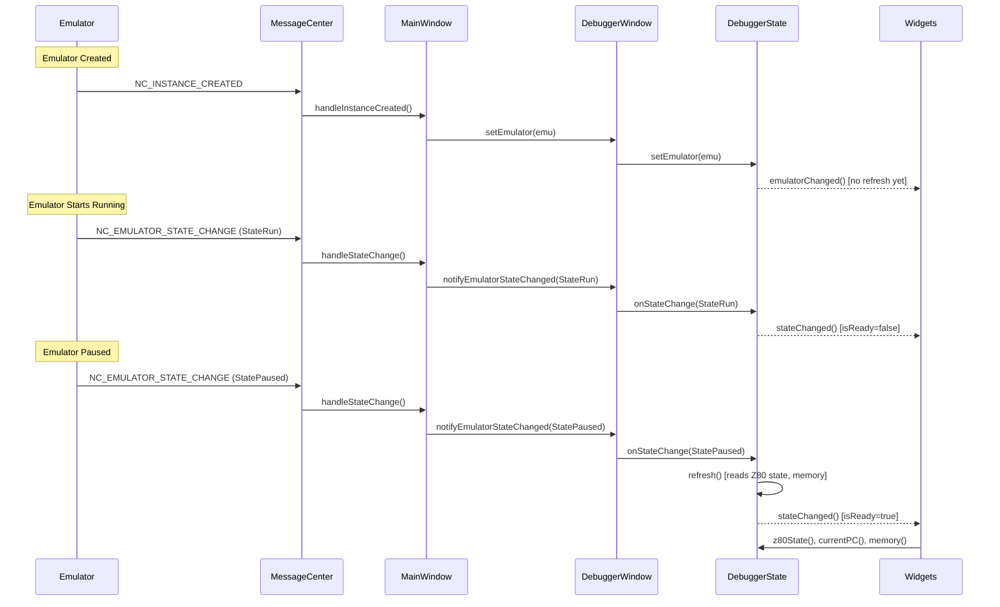
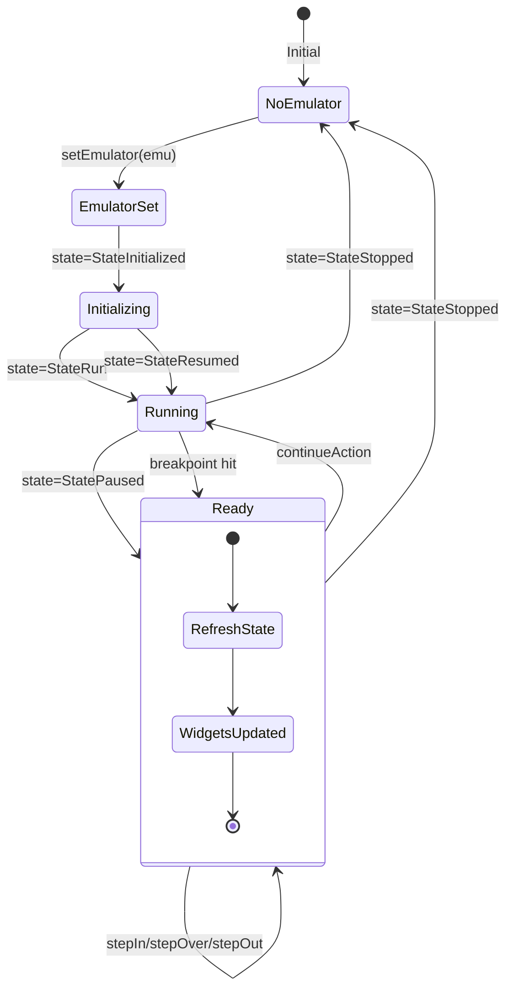
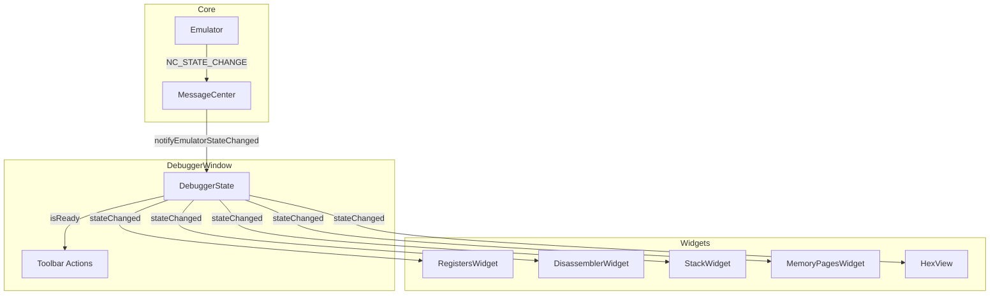

# Proposal: Centralized DebuggerState Architecture

**Status:** Proposed for Master  
**Priority:** Medium (after hotfix stabilization)

---

## State Update Sources

Debugger state can be updated from three sources:

| Source | Trigger | Current Handling | Proposed Handling |
|--------|---------|------------------|-------------------|
| **Direct calls** | `setEmulator(emu)` from MainWindow | Cascades through all widgets | DebuggerState stores reference, notifies via signal |
| **Callbacks** | Z80 step completion, breakpoint hit | `dispatchToMainThread` → `updateState()` | DebuggerState.refresh() → `stateChanged` signal |
| **MessageCenter** | `NC_EMULATOR_STATE_CHANGE` | `notifyEmulatorStateChanged()` → `updateState()` | DebuggerState.onStateChange() → conditional refresh |

---

## Event Flow Diagram



---

## State Machine Diagram



---

## Actions by State

| State | isReady | Actions Allowed | Widgets |
|-------|---------|-----------------|---------|
| `NoEmulator` | ❌ | None | Disabled, cleared |
| `EmulatorSet` | ❌ | None | Disabled, waiting |
| `Initializing` | ❌ | None | Disabled, waiting |
| `Running` | ❌ | Pause | Enabled, stale data |
| `Ready` (Paused) | ✅ | Continue, Step*, Reset | Enabled, live data |

---

## Proposed DebuggerState Class

```cpp
class DebuggerState : public QObject {
    Q_OBJECT
public:
    // Called from MainWindow
    void setEmulator(Emulator* emu);
    
    // Called from notifyEmulatorStateChanged()
    void onStateChange(EmulatorStateEnum state);
    
    // Force refresh (for callbacks like step completion)
    void refresh();
    
    // Safe accessors (read cached data)
    bool isReady() const { return m_isReady; }
    Z80State* z80State() const { return m_isReady ? &m_cachedZ80State : nullptr; }
    uint16_t currentPC() const { return m_cachedPC; }
    Memory* memory() const;
    
signals:
    void emulatorChanged();  // When emulator pointer changes
    void stateChanged();     // When any data changes
    void pcChanged(uint16_t); // For disassembler focus
    
private:
    void updateReadyState();
    
    Emulator* m_emulator = nullptr;
    EmulatorStateEnum m_state = StateUnknown;
    bool m_isReady = false;
    Z80State m_cachedZ80State;
    uint16_t m_cachedPC = 0;
};
```

---

## UI Integration Architecture



### Integration Points

| Component | Integration Method | Current Code | Proposed Change |
|-----------|-------------------|--------------|-----------------|
| **MainWindow** | `setEmulator()` | Calls `DebuggerWindow::setEmulator()` | Calls `DebuggerState::setEmulator()` |
| **MainWindow** | `handleStateChange()` | Calls `notifyEmulatorStateChanged()` | Calls `DebuggerState::onStateChange()` |
| **DebuggerWindow** | Owns widgets | Manually calls `refresh()` on each | Widgets auto-update via `stateChanged()` signal |
| **Toolbar** | Action enablement | Checks `_emulatorState` field | Checks `DebuggerState::isReady()` |
| **DisassemblerWidget** | Emulator access | Stores `m_emulator` pointer | Uses `DebuggerState::currentPC()`, `memory()` |
| **RegistersWidget** | Z80 state | Receives via `setZ80State()` | Reads `DebuggerState::z80State()` |

### Widget Connection Pattern

```cpp
// In DebuggerWindow constructor
m_debuggerState = new DebuggerState(this);

// Connect all widgets to state changes
connect(m_debuggerState, &DebuggerState::stateChanged, 
        ui->registersWidget, &RegistersWidget::onStateChanged);
connect(m_debuggerState, &DebuggerState::stateChanged, 
        ui->disassemblerWidget, &DisassemblerWidget::onStateChanged);
connect(m_debuggerState, &DebuggerState::stateChanged, 
        ui->stackWidget, &StackWidget::onStateChanged);
// ... etc
```

### Widget Implementation Pattern

```cpp
// Each widget implements:
void RegistersWidget::onStateChanged() {
    if (!m_debuggerState->isReady()) {
        reset();  // Clear display when not ready
        return;
    }
    // Safe to access state
    Z80State* state = m_debuggerState->z80State();
    updateDisplay(state);
}
```

---

## Implementation Checklist

- [ ] Create `DebuggerState` class
- [ ] Wire `setEmulator()` → `DebuggerState`
- [ ] Wire `notifyEmulatorStateChanged()` → `DebuggerState::onStateChange()`
- [ ] Connect all widgets to `stateChanged()` signal
- [ ] Remove `m_emulator` from individual widgets
- [ ] Replace `updateState()` with `DebuggerState::refresh()`

**Estimated effort:** 2-3 hours  
**Risk:** Medium (affects all debugger widgets)
