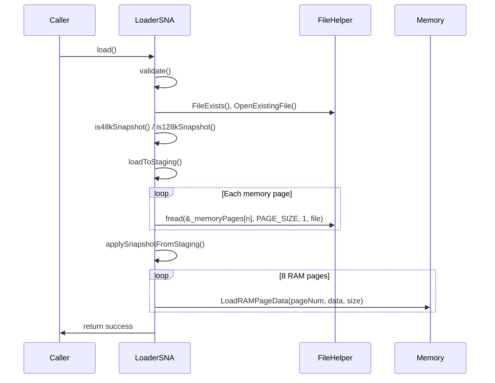
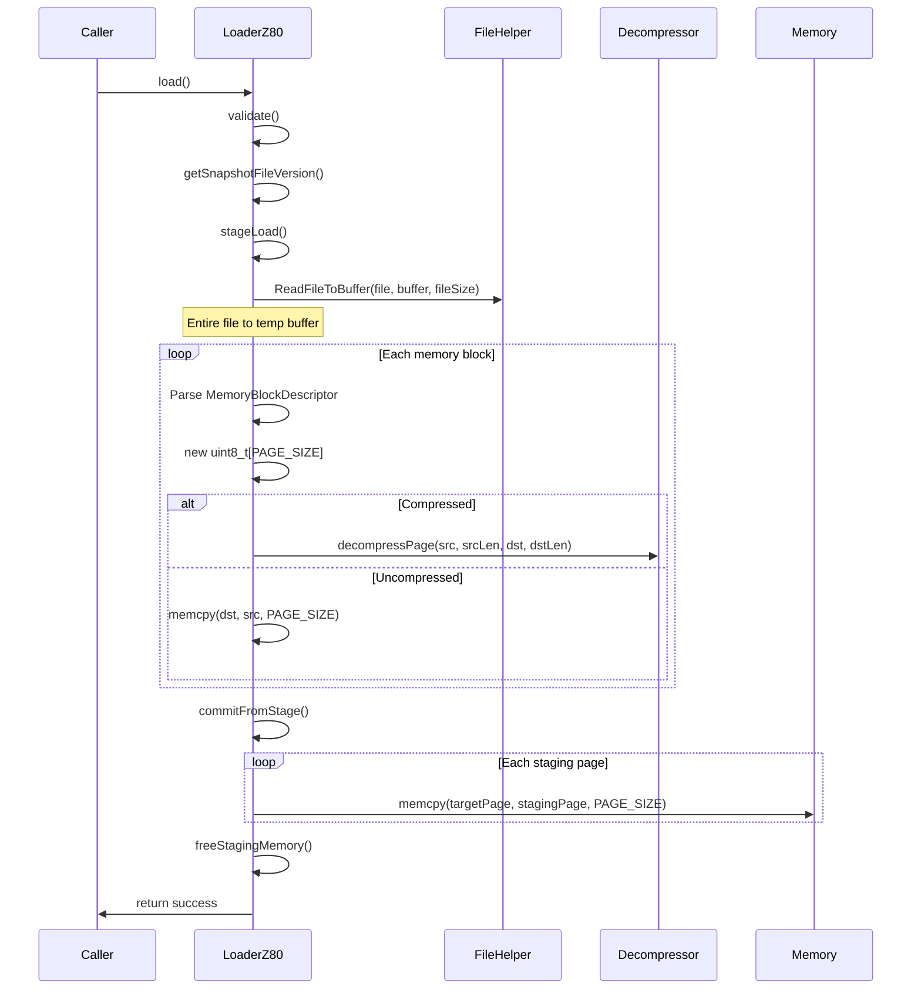

# Snapshot Loading Performance Analysis

**Date:** 2026-01-13  
**Status:** Discovery Phase

---

## Executive Summary

This document analyzes the current snapshot loading implementations for `.sna` and `.z80` formats in the Unreal-NG ZX Spectrum emulator. The goal is to identify performance bottlenecks and optimization opportunities.

---

## Current Architecture Overview

Both loaders follow a **multi-stage loading architecture**:


This design ensures that invalid/corrupted snapshots don't affect the current emulator state.

---

## SNA Loader Analysis

### File Structure
- **Location:** [loader_sna.cpp](core/src/loaders/snapshot/loader_sna.cpp), [loader_sna.h](core/src/loaders/snapshot/loader_sna.h)
- **Lines:** 475 (cpp) + 193 (h) = **668 total**

### Format Specifications
| Format | Header Size | Memory Size | Total File Size |
|--------|-------------|-------------|-----------------|
| SNA-48K | 27 bytes | 48KB (3 pages) | 49,179 bytes |
| SNA-128K | 27 + 4 bytes | 128KB (8 pages) | 131,103 bytes |

### Key Data Structures

```cpp
// Common header (27 bytes)
typedef struct {
    uint8_t i;
    uint8_t _l, _h, _e, _d, _c, _b, _f, _a;     // Alt registers
    uint8_t l, h, e, d, c, b, ly, hy, lx, hx;   // Main registers
    uint8_t flag19;                             // IFF2 in bit 2
    uint8_t r;
    uint8_t f, a;                               // AF
    uint8_t lsp, hsp;                           // SP
    uint8_t imod;                               // Interrupt mode
    uint8_t border;                             // Border color
} snaHeader;

// Extended header for 128K (4 bytes)
typedef struct {
    uint16_t reg_PC;
    uint8_t port_7FFD;  // RAM bank selection
    uint8_t is_TRDOS;
} sna128Header;
```

### Current Loading Flow



### Performance Hotspots

#### 1. Multiple File I/O Operations

```cpp
// loader_sna.cpp:196-223 - Multiple fread() calls
if (fread(&_header, sizeof(_header), 1, _file) != 1) return false;
if (fread(&_memoryPages[5], PAGE_SIZE, 1, _file) != 1) return false;  // 16KB
if (fread(&_memoryPages[2], PAGE_SIZE, 1, _file) != 1) return false;  // 16KB
if (fread(&_memoryPages[0], PAGE_SIZE, 1, _file) != 1) return false;  // 16KB
```

**Issue:** 4 separate system calls for 48K mode, up to 12+ for 128K mode.

#### 2. Staging Buffer Overhead

```cpp
// loader_sna.h:121 - Pre-allocated staging area
uint8_t _memoryPages[8][PAGE_SIZE];  // 8 × 16KB = 128KB always allocated
```

**Issue:** Fixed 128KB allocation regardless of snapshot type (48K snapshots only need 48KB).

#### 3. Memory Copy in 128K Mode

```cpp
// loader_sna.cpp:306-309 - Extra copy for page remapping
if (currentTopPage != 0) {
    memcpy(&_memoryPages[currentTopPage], &_memoryPages[0], PAGE_SIZE);  // 16KB copy
    memset(&_memoryPages[0], 0x00, PAGE_SIZE);  // 16KB zero fill
}
```

**Issue:** Extra 32KB of memory operations for 128K snapshots when top page ≠ 0.

#### 4. Per-Page Memory Transfer

```cpp
// loader_sna.cpp:361-369 - Individual page loading
for (int pageNum = 0; pageNum < 8; pageNum++) {
    if (_memoryPagesUsed[pageNum]) {
        memory.LoadRAMPageData(pageNum, _memoryPages[pageNum], PAGE_SIZE);
    }
}
```

**Issue:** Multiple calls instead of bulk transfer.

---

## Z80 Loader Analysis

### File Structure
- **Location:** [loader_z80.cpp](core/src/loaders/snapshot/loader_z80.cpp), [loader_z80.h](core/src/loaders/snapshot/loader_z80.h)
- **Lines:** 702 (cpp) + 254 (h) = **956 total**

### Format Specifications
| Version | Header Size | Compression | Models Supported |
|---------|-------------|-------------|------------------|
| Z80v1 | 30 bytes | Optional | 48K only |
| Z80v2 | 55 bytes | Always | 48K, 128K, SamRam |
| Z80v3 | 86-87 bytes | Always | 48K, 128K, +2, +3, Pentagon, Scorpion |

### RLE Compression Scheme

The Z80 format uses a simple RLE compression:

```
ED ED xx yy → byte 'yy' repeated 'xx' times
```

Only sequences of 5+ identical bytes are compressed. The escape sequence `ED ED` marks run-length data.

### Key Data Structures

```cpp
struct Z80Header_v1 {
    uint8_t reg_A, reg_F;
    uint16_t reg_BC, reg_HL, reg_PC, reg_SP;
    uint8_t reg_I, reg_R, flags;
    uint16_t reg_DE, reg_BC1, reg_DE1, reg_HL1;
    uint8_t reg_A1, reg_F1;
    uint16_t reg_IY, reg_IX;
    uint8_t IFF1, IFF2, im;
};

struct MemoryBlockDescriptor {
    uint16_t compressedSize;  // 0xFFFF = uncompressed
    uint8_t memoryPage;
};
```

### Current Loading Flow



### Performance Hotspots

#### 1. Full File Copy to Temporary Buffer

```cpp
// loader_z80.cpp:295-302
auto buffer = std::unique_ptr<uint8_t[]>(new uint8_t[_fileSize]);
uint8_t* pBuffer = buffer.get();
rewind(_file);
FileHelper::ReadFileToBuffer(_file, pBuffer, _fileSize);  // Full file copy
```

**Issue:** Complete file loaded to heap, then processed. For 128K snapshots with minimal compression, this could be ~131KB allocation + read.

#### 2. Dynamic Memory Allocation Per Page

```cpp
// loader_z80.cpp:338 (in loop)
uint8_t* pageBuffer = new uint8_t[PAGE_SIZE];  // 16KB per page
```

**Issue:** Up to 8 dynamic allocations (128KB total) during load, plus deallocation overhead in `freeStagingMemory()`.

#### 3. Decompression Algorithm

```cpp
// loader_z80.cpp:538-566
void LoaderZ80::decompressPage(uint8_t *src, size_t srcLen, uint8_t *dst, size_t dstLen) {
    memset(dst, 0, dstLen);  // 16KB zero fill before decompress
    while (srcLen > 0 && dstLen > 0) {
        if (srcLen >= 4 && src[0] == 0xED && src[1] == 0xED) {
            for (uint8_t i = src[2]; i; i--) {  // Byte-by-byte copy
                *dst++ = src[3], dstLen--;
            }
            srcLen -= 4; src += 4;
        } else {
            *dst++ = *src++;  // Byte-by-byte copy
            --dstLen; --srcLen;
        }
    }
}
```

**Issues:**
- Pre-zeroing entire page (16KB memset) before decompression
- Byte-by-byte copying instead of `memset` for RLE sequences
- Byte-by-byte copying for non-RLE data instead of bulk copy

#### 4. Double Memory Copy

```cpp
// Stage allocation + copy to emulator memory
uint8_t *targetPage = memory.RAMPageAddress(idx);
memcpy(targetPage, ptr, PAGE_SIZE);  // Second 16KB copy per page
```

**Issue:** Data flows: File → Temp Buffer → Staging Page → Emulator RAM (3 copies).

---

## Memory Operation Summary

### SNA Loader Memory Operations (128K)

| Operation | Size | Count | Total |
|-----------|------|-------|-------|
| Constructor memset | 16KB | 8 | 128KB |
| fread to staging | 16KB | 8 | 128KB |
| Extra page copy (if needed) | 16KB | 2 | 32KB |
| LoadRAMPageData calls | 16KB | 8 | 128KB |
| **Maximum Total** | | | **416KB** |

### Z80 Loader Memory Operations (128K compressed)

| Operation | Size | Count | Total |
|-----------|------|-------|-------|
| Temp buffer allocation | ~100KB | 1 | ~100KB |
| fread entire file | ~100KB | 1 | ~100KB |
| Staging page allocations | 16KB | 8 | 128KB |
| Decompress memset (zero) | 16KB | 8 | 128KB |
| Decompress byte copies | ~100KB | 1 | ~100KB |
| memcpy to emulator RAM | 16KB | 8 | 128KB |
| **Maximum Total** | | | **~684KB** |

---

## Optimization Opportunities

### Priority 1: Critical (High Impact, Low Risk)

#### 1.1 Bulk File I/O
**SNA:** Replace multiple `fread()` calls with single read to contiguous buffer.

```cpp
// Current: 4-12 fread() calls
// Proposed: Single read
uint8_t buffer[131103];  // Max SNA size
fread(buffer, _fileSize, 1, _file);
// Then parse header and copy pages from buffer
```

**Expected Impact:** 4-12× fewer system calls.

#### 1.2 Optimize Z80 Decompression
Replace byte-by-byte operations with bulk operations:

```cpp
// Current
for (uint8_t i = src[2]; i; i--) { *dst++ = src[3], dstLen--; }

// Proposed
memset(dst, src[3], src[2]);  // Single memset for RLE
dst += src[2]; dstLen -= src[2];
```

**Expected Impact:** 5-10× faster decompression for RLE sequences.

#### 1.3 Remove Pre-Zeroing in Decompression
The `memset(dst, 0, dstLen)` at start is unnecessary since all bytes are overwritten.

**Expected Impact:** Saves 16KB memset per page (up to 128KB total).

### Priority 2: Medium (Moderate Impact)

#### 2.1 Direct-to-Emulator Memory Loading
Skip staging buffers entirely for validated snapshots:

```cpp
// Instead of: file → staging → emulator
// Propose: file → emulator directly
uint8_t* targetPage = memory.RAMPageAddress(pageNum);
fread(targetPage, PAGE_SIZE, 1, file);
```

**Risk:** Requires careful error handling to restore on failure.
**Expected Impact:** Eliminates one 128KB copy operation.

#### 2.2 Memory Pool for Z80 Staging
Pre-allocate reusable page buffers instead of `new/delete` per load:

```cpp
class LoaderZ80 {
    static thread_local uint8_t stagingPool[8][PAGE_SIZE];
};
```

**Expected Impact:** Eliminates 8 allocations + 8 deallocations per load.

### Priority 3: Lower Priority (Diminishing Returns)

#### 3.1 Memory-Mapped I/O
Use `mmap()` instead of `fread()` for zero-copy file access.

**Complexity:** Platform-specific, requires fallback for Windows.

#### 3.2 SIMD Decompression
Use NEON/SSE for RLE decompression hot loops.

**Complexity:** Limited benefit since `memset` is already SIMD-optimized.

---

## Test Data Available

### SNA Files
| File | Size | Type | Notes |
|------|------|------|-------|
| 48k.sna | 49,179 | 48K | Minimal test case |
| multifix.sna | 131,103 | 128K | Standard 128K demo |
| 7threality.sna | 147,487 | 128K+ | Extended format |

### Z80 Files
| File | Size | Type | Notes |
|------|------|------|------|
| newbench.z80 | 2,883 | 48K | Highly compressed |
| BBG128.z80 | 3,566 | 128K | Highly compressed |
| dizzyx.z80 | 66,515 | 128K | Medium compression |
| Binary Love III.z80 | 107,864 | 128K | Low compression |

---

## Benchmark Strategy

### Metrics to Capture
1. **Total Load Time** - End-to-end `load()` call duration
2. **File I/O Time** - Time spent in file operations
3. **Decompression Time** (Z80 only) - RLE decode duration
4. **Memory Transfer Time** - Staging to emulator RAM

### Benchmark Configurations
1. **SNA-48K** - Smallest format, baseline
2. **SNA-128K** - Full memory, no compression
3. **Z80-Compressed** - RLE-heavy snapshots
4. **Z80-Uncompressed** - Large file, minimal RLE

### Implementation Plan
Create `core/benchmarks/loaders/snapshot_benchmark.cpp` following the existing Google Benchmark patterns from [screenzx_benchmark.cpp](core/benchmarks/emulator/video/screenzx_benchmark.cpp).

---

## Baseline Benchmark Results

**Date:** 2026-01-13  
**Platform:** Apple M1 Ultra (20 cores @ 24 MHz), macOS  
**Build:** Release (-O3)

### Full Benchmark Suite

| Benchmark | Time (μs) | Throughput | Notes |
|-----------|-----------|------------|-------|
| **SNA-48K** | 880 | 53 MB/s | 48KB uncompressed |
| **SNA-128K** | 1005 | 124 MB/s | 128KB uncompressed |
| **SNA-128K Multiple** | 953 | 131 MB/s | Varied snapshots |
| **Z80 Compressed** | 171 | 16 MB/s | Highly compressed (2.8KB file) |
| **Z80 Medium Compression** | 239 | 265 MB/s | 66KB file → 128KB output |
| **Z80 Low Compression** | 293 | 351 MB/s | 107KB file → 128KB output |
| **Z80 128K** | 173 | 20 MB/s | 3.5KB file highly compressed |
| **Z80 Multiple** | 253 | - | Varied snapshots |

### Format Comparison (128K)

| Format | Load Time (μs) | Speed Ratio |
|--------|----------------|-------------|
| SNA-128K | 943 | 1.0× (baseline) |
| Z80-128K | 170 | **5.5× faster** |

### Baseline Measurements

| Operation | Time (μs) | Throughput |
|-----------|-----------|------------|
| File I/O 48K | 14.0 | 3.3 GB/s |
| File I/O 128K | 16.8 | 7.3 GB/s |
| memcpy 48K | 0.001 | 44 TB/s (cached) |
| memcpy 128K | 0.001 | 119 TB/s (cached) |

### Key Observations

1. **Z80 is significantly faster than SNA** for equivalent data sizes
   - Z80-128K: 170μs vs SNA-128K: 943μs (5.5× faster)
   - This is due to compression reducing file I/O

2. **SNA loading is I/O-bound**
   - File I/O baseline (14μs) is only ~1.5% of total SNA-48K load time (880μs)
   - Most time is spent in emulator initialization, staging, and memory transfer

3. **Z80 decompression is efficient**
   - Highly compressed Z80 (171μs for 2.8KB file) vs low compression (293μs for 107KB file)
   - Decompression adds only ~120μs despite processing more data

4. **Memory operations dominate**
   - memcpy baselines show memory bandwidth is not the bottleneck
   - Overhead comes from emulator state setup and multiple stage copies

### Optimization Targets

Based on profiling, the primary optimization targets are:
1. **Reduce staging overhead** - Direct-to-memory loading
2. **Consolidate file I/O** - Single read instead of multiple fread() calls
3. **Optimize Z80 decompression** - Use memset for RLE runs

---

## Next Steps

1. ✅ Complete discovery report
2. ✅ Create benchmark infrastructure
3. ✅ Capture baseline metrics
4. ⬜ Implement Priority 1 optimizations
5. ⬜ Benchmark and compare
6. ⬜ Document results in walkthrough

---

## References

- [SNA Format Specification](https://worldofspectrum.org/faq/reference/formats.htm)
- [Z80 Format Specification](https://worldofspectrum.org/faq/reference/z80format.htm)
- [Z80 Format Extended Info](https://k1.spdns.de/Develop/Projects/zasm/Info/z80format.htm)
