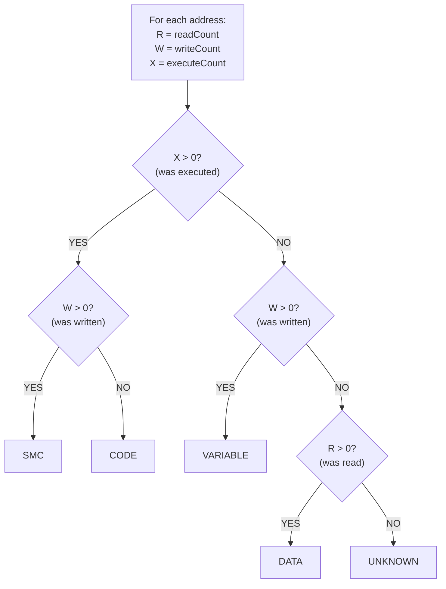

# Block Segmentation: CODE / DATA / VARIABLE Classification

**Purpose:** Algorithm design for classifying memory addresses based on access patterns.

**Status:** Design Draft - Not Yet Implemented

**Parent:** [Analyzer Architecture](./analyzer-architecture.md)

---

## 1. Overview

Block Segmentation analyzes R/W/X counters to classify each memory address into one of five categories:

| Type | Definition | Detection Rule |
|------|------------|----------------|
| **CODE** | Executed instructions | X > 0, W = 0 |
| **DATA** | Read-only data (constants, tables) | R > 0, W = 0, X = 0 |
| **VARIABLE** | Read-write data | W > 0, X = 0 |
| **SMC** | Self-Modifying Code | X > 0 AND W > 0 |
| **UNKNOWN** | Never accessed | R = 0, W = 0, X = 0 |

### 1.2 Two-Layer Classification Model

Each memory block has:

1. **Primary Type** (mutually exclusive) — Execution behavior based on R/W/X counters
2. **Tags** (combinable) — Semantic role based on higher-level analysis

```
┌─────────────────────────────────────────────────────────────────┐
│                        Block Classification                     │
├─────────────────────────────────────────────────────────────────┤
│  Primary Type (one of):  CODE | DATA | VARIABLE | SMC | UNKNOWN │
├─────────────────────────────────────────────────────────────────┤
│  Tags (set of):  {screen, sound, sprite, isr, decompressor,     │
│                   loader, copy_protection, frame_counter,       │
│                   input_handler, music_data, level_data, ...}   │
└─────────────────────────────────────────────────────────────────┘
```

| Primary Type | + Tags | Real-World Example |
|--------------|--------|-------------------|
| `CODE` | `[isr, im2_handler]` | Interrupt service routine |
| `CODE` | `[sound_driver, beeper]` | Music playback code |
| `CODE` | `[screen_blit, sprite_engine]` | Sprite rendering |
| `DATA` | `[sprite_graphics]` | Sprite sheet (read-only) |
| `DATA` | `[music_data, ay_pattern]` | AY music pattern table |
| `DATA` | `[level_data, compressed]` | Compressed level layout |
| `VARIABLE` | `[frame_counter, game_state]` | Per-frame updated state |
| `VARIABLE` | `[player_position]` | Player X/Y coordinates |
| `VARIABLE` | `[screen_buffer]` | Active display memory |
| `SMC` | `[decompressor, lz_variant]` | Self-modifying unpacker |
| `SMC` | `[copy_protection]` | Anti-debug tricks |

**Key insight:** Primary Type comes from raw R/W/X counters (fast, per-address). Tags come from higher-level analyzers (RoutineClassifiers, InterruptAnalyzer, etc.) and require cross-referencing with timing, call traces, and port activity.

### 1.1 Why This Matters

| Use Case | Benefit |
|----------|---------|
| Disassembler | Only disassemble CODE regions; display DATA as bytes/strings |
| Memory map visualization | Color-coded overview of program structure |
| SMC detection | Alert on self-modifying code for debugging |
| ROM/RAM separation | Identify which memory is actually used |
| Save state optimization | Only save VARIABLE regions |

---

## 2. Classification Algorithm

### 2.1 Core Logic

```cpp
enum class BlockType : uint8_t {
    Unknown   = 0,
    Code      = 1,
    Data      = 2,
    Variable  = 3,
    SMC       = 4
};

BlockType ClassifyAddress(uint32_t readCount, uint32_t writeCount, uint32_t executeCount) {
    const bool wasRead = (readCount > 0);
    const bool wasWritten = (writeCount > 0);
    const bool wasExecuted = (executeCount > 0);
    
    if (wasExecuted && wasWritten) {
        return BlockType::SMC;  // Self-modifying code
    }
    else if (wasExecuted) {
        return BlockType::Code;
    }
    else if (wasWritten) {
        return BlockType::Variable;
    }
    else if (wasRead) {
        return BlockType::Data;
    }
    else {
        return BlockType::Unknown;
    }
}
```

### 2.2 Decision Tree

```
                    ┌───────────────────────────┐
                    │   For each address:       │
                    │   R = readCount           │
                    │   W = writeCount          │
                    │   X = executeCount        │
                    └───────────────────────────┘
                                 │
                                 ▼
                    ┌───────────────────────────┐
                    │        X > 0 ?            │
                    │    (was executed)         │
                    └───────────────────────────┘
                           │          │
                          YES         NO
                           │          │
                           ▼          ▼
              ┌─────────────────┐  ┌─────────────────┐
              │    W > 0 ?      │  │    W > 0 ?      │
              │  (was written)  │  │  (was written)  │
              └─────────────────┘  └─────────────────┘
                 │         │          │         │
                YES        NO        YES        NO
                 │         │          │         │
                 ▼         ▼          ▼         ▼
              ┌─────┐  ┌──────┐  ┌──────────┐  ┌─────────────────┐
              │ SMC │  │ CODE │  │ VARIABLE │  │    R > 0 ?      │
              └─────┘  └──────┘  └──────────┘  │  (was read)     │
                                               └─────────────────┘
                                                  │         │
                                                 YES        NO
                                                  │         │
                                                  ▼         ▼
                                              ┌──────┐  ┌─────────┐
                                              │ DATA │  │ UNKNOWN │
                                              └──────┘  └─────────┘
```

<details>
<summary>Mermaid version (click to expand)</summary>



</details>

---

## 3. Data Structures

### 3.1 Per-Address Classification

```cpp
// Compact storage: 1 byte per address = 64KB for full Z80 space
struct BlockClassificationMap {
    std::array<BlockType, 65536> types;
    
    BlockType GetType(uint16_t address) const {
        return types[address];
    }
    
    void SetType(uint16_t address, BlockType type) {
        types[address] = type;
    }
};
```

### 3.2 Region Aggregation

For UI display, contiguous addresses of the same type are merged into regions:

```cpp
struct BlockRegion {
    uint16_t startAddress;
    uint16_t length;
    BlockType type;
    BlockTags aggregatedTags;  // OR of all per-address tags in region
    
    // Optional statistics (aggregated from per-address counters)
    uint32_t totalReads = 0;
    uint32_t totalWrites = 0;
    uint32_t totalExecutes = 0;
    
    uint16_t EndAddress() const { return startAddress + length - 1; }
    
    bool HasTag(BlockTag tag) const {
        return (aggregatedTags & static_cast<uint32_t>(tag)) != 0;
    }
};
};

struct BlockSegmentation {
    BlockClassificationMap perAddress;
    std::vector<BlockRegion> regions;
    
    // Summary statistics
    uint32_t codeBytes = 0;
    uint32_t dataBytes = 0;
    uint32_t variableBytes = 0;
    uint32_t smcBytes = 0;
    uint32_t unknownBytes = 0;
};
```

### 3.3 Region Aggregation Algorithm

```cpp
std::vector<BlockRegion> AggregateRegions(const BlockClassificationMap& map) {
    std::vector<BlockRegion> regions;
    
    uint16_t regionStart = 0;
    BlockType currentType = map.GetType(0);
    
    for (uint32_t addr = 1; addr <= 0x10000; addr++) {
        BlockType type = (addr < 0x10000) ? map.GetType(addr) : BlockType::Unknown;
        
        if (type != currentType || addr == 0x10000) {
            // End current region
            regions.push_back({
                .startAddress = regionStart,
                .length = static_cast<uint16_t>(addr - regionStart),
                .type = currentType
            });
            
            regionStart = static_cast<uint16_t>(addr);
            currentType = type;
        }
    }
    
    return regions;
}
```

### 3.4 Semantic Tags

Tags add semantic meaning beyond raw R/W/X classification:

```cpp
// Semantic tags — combinable, assigned by higher-level analyzers
enum class BlockTag : uint32_t {
    // === Interrupt-related ===
    ISR              = 1 << 0,   // Interrupt Service Routine
    IM1_Handler      = 1 << 1,   // IM1 handler (called at 0x0038)
    IM2_Handler      = 1 << 2,   // IM2 handler (vectored)
    NMI_Handler      = 1 << 3,   // NMI handler (0x0066)
    
    // === Sound-related ===
    SoundDriver      = 1 << 4,   // Audio playback code
    Beeper           = 1 << 5,   // Beeper output (port 0xFE bit 4)
    AY_Driver        = 1 << 6,   // AY-3-8912 driver
    MusicData        = 1 << 7,   // Music pattern/note data
    
    // === Graphics-related ===
    ScreenBlit       = 1 << 8,   // Writes to screen memory
    SpriteEngine     = 1 << 9,   // Sprite rendering code
    SpriteGraphics   = 1 << 10,  // Sprite image data
    AttrManipulation = 1 << 11,  // Attribute (color) manipulation
    
    // === Compression/Loading ===
    Decompressor     = 1 << 12,  // Decompression routine
    Loader           = 1 << 13,  // Tape/disk loader
    Compressed       = 1 << 14,  // Compressed data block
    
    // === Game State ===
    FrameCounter     = 1 << 15,  // Updated every frame
    GameState        = 1 << 16,  // Game state variables
    InputHandler     = 1 << 17,  // Keyboard/joystick handling
    LevelData        = 1 << 18,  // Level layout data
    
    // === Protection/SMC ===
    CopyProtection   = 1 << 19,  // Copy protection code
    Patcher          = 1 << 20,  // Code that patches other code
    
    // === Initialization ===
    BootSequence     = 1 << 21,  // Part of startup sequence
    OneShot          = 1 << 22,  // Executed only once
};

using BlockTags = uint32_t;  // Bitmask of BlockTag values

// Per-address tag storage
struct BlockTagMap {
    std::array<BlockTags, 65536> tags{};
    
    void AddTag(uint16_t address, BlockTag tag) {
        tags[address] |= static_cast<uint32_t>(tag);
    }
    
    void RemoveTag(uint16_t address, BlockTag tag) {
        tags[address] &= ~static_cast<uint32_t>(tag);
    }
    
    bool HasTag(uint16_t address, BlockTag tag) const {
        return (tags[address] & static_cast<uint32_t>(tag)) != 0;
    }
    
    BlockTags GetTags(uint16_t address) const {
        return tags[address];
    }
};
```

#### Tag Assignment Sources

| Tag | Assigned By | Detection Method |
|-----|-------------|------------------|
| `ISR`, `IM1_Handler`, `IM2_Handler` | InterruptAnalyzer | Call from interrupt context |
| `SoundDriver`, `Beeper`, `AY_Driver` | RoutineClassifier | Port 0xFE/AY access during execution |
| `ScreenBlit`, `AttrManipulation` | RoutineClassifier | Writes to 0x4000-0x5AFF, timing analysis |
| `SpriteEngine`, `SpriteGraphics` | RoutineClassifier | Pattern matching, data access patterns |
| `Decompressor` | SMCAnalyzer | Burst writes → execute pattern |
| `FrameCounter` | VariableProfiler | Write frequency = ~50Hz |
| `OneShot` | TemporalAnalyzer | Executed once during boot only |
| `Patcher` | SMCAnalyzer | Code that writes to other CODE regions |

---

### 3.5 Storage Architecture Options

When storing classified regions, there are three architectural options to consider. **Decision pending** — implementation should evaluate based on actual usage patterns.

#### Option A: Single Address-Ordered List

```cpp
struct BlockSegmentation_OptionA {
    std::array<BlockType, 65536> perAddress;  // Source of truth
    std::vector<BlockRegion> regions;          // Sorted by startAddress
};
```

**Pros:**
- Simplest implementation
- Direct sequential iteration for disassembler/memory map
- Easy incremental updates
- Binary search for address queries: O(log n)

**Cons:**
- "Show all CODE regions" requires O(n) filter
- Statistics require full scan

---

#### Option B: Type-Segregated Lists

```cpp
struct BlockSegmentation_OptionB {
    std::array<BlockType, 65536> perAddress;  // Source of truth
    std::vector<BlockRegion> codeRegions;      // Sorted by address
    std::vector<BlockRegion> dataRegions;      // Sorted by address
    std::vector<BlockRegion> variableRegions;  // Sorted by address
    std::vector<BlockRegion> smcRegions;       // Sorted by address
    std::vector<BlockRegion> unknownRegions;   // Sorted by address
};
```

**Pros:**
- O(1) access to "all regions of type X"
- Natural grouping for type-based export
- Statistics per type: O(1) (just count list size)

**Cons:**
- Sequential address iteration requires merging 5 sorted lists
- "What type is address X?" requires searching 5 lists
- Incremental update requires finding region in old type list AND adding to new type list
- Memory map visualization complex (merge required)

---

#### Option C: Hybrid (Primary List + Type Indices)

```cpp
struct BlockSegmentation_OptionC {
    std::array<BlockType, 65536> perAddress;  // Source of truth
    
    std::vector<BlockRegion> allRegions;      // Sorted by startAddress (primary)
    
    // Indices into allRegions (secondary)
    std::vector<size_t> codeIndices;
    std::vector<size_t> dataIndices;
    std::vector<size_t> variableIndices;
    std::vector<size_t> smcIndices;
    
    // Pre-computed statistics
    struct Stats {
        uint32_t codeBytes = 0;
        uint32_t codeRegionCount = 0;
        uint32_t dataBytes = 0;
        uint32_t dataRegionCount = 0;
        uint32_t variableBytes = 0;
        uint32_t variableRegionCount = 0;
        uint32_t smcBytes = 0;
        uint32_t smcRegionCount = 0;
        uint32_t unknownBytes = 0;
    } stats;
    
    bool regionsDirty = true;
};
```

**Pros:**
- Best of both worlds: sequential AND type-based access
- O(1) type queries via indices
- O(log n) address queries via binary search on primary list
- Pre-computed statistics
- Single source of region data (no duplication)

**Cons:**
- More complex implementation
- Indices must be rebuilt when regions change
- Slightly higher memory (index vectors)

---

#### Use Case Comparison Matrix

> **Reference:** See [Analysis Use Cases](./analysis-use-cases.md) for detailed workflow descriptions.

##### Basic Operations

| Use Case | Option A | Option B | Option C |
|----------|----------|----------|----------|
| **Disassembler** (sequential by address) | ✅ Direct | ❌ Merge 5 lists | ✅ Direct |
| **"Show all CODE"** | ❌ Filter O(n) | ✅ Direct O(1) | ✅ Via index O(1) |
| **"Type at address X?"** | ✅ Binary search | ❌ Search 5 lists | ✅ Binary search |
| **Memory map visualization** | ✅ Sequential | ❌ Merge required | ✅ Sequential |
| **Export (sequential)** | ✅ One loop | ❌ Merge | ✅ One loop |
| **Export (grouped by type)** | ❌ Filter each type | ✅ Natural | ✅ Via indices |
| **Statistics** | ❌ Full scan | ✅ List sizes | ✅ Pre-computed |
| **Incremental update** | ✅ Simple | ❌ 2 list updates | ⚠️ Rebuild indices |
| **Implementation complexity** | ✅ Simple | ⚠️ Medium | ❌ Complex |
| **Memory overhead** | ✅ Minimal | ⚠️ Potential duplication | ⚠️ Index vectors |

##### RE Workflow Support

| Use Case ID | Workflow | Option A | Option B | Option C | Additional Data Needed |
|-------------|----------|----------|----------|----------|------------------------|
| **UC-NAV-01** | Code→Data xrefs | ⚠️ | ⚠️ | ⚠️ | Xref index (separate) |
| **UC-NAV-02** | Data→Code xrefs | ⚠️ | ⚠️ | ⚠️ | Xref index (separate) |
| **UC-NAV-05** | Address context | ✅ | ❌ | ✅ | None |
| **UC-STR-01** | Memory map | ✅ | ❌ | ✅ | None |
| **UC-STR-02** | Disasm guidance | ✅ | ✅ | ✅ | None |
| **UC-STR-03** | SMC regions | ❌ O(n) | ✅ O(1) | ✅ O(1) | None |
| **UC-STR-04** | Function bounds | ⚠️ | ⚠️ | ⚠️ | CallTraceBuffer |
| **UC-STR-05** | Code+data groups | ⚠️ | ⚠️ | ⚠️ | Xref analysis |
| **UC-BEH-01** | Access frequency | ⚠️ | ⚠️ | ⚠️ | MemoryAccessTracker |
| **UC-BEH-02** | Scope inference | ⚠️ | ⚠️ | ⚠️ | callerAddresses |
| **UC-SMC-03** | Patcher ID | ❌ | ✅ direct | ✅ | callerAddresses for SMC |

**Legend:** ✅ = Native support | ⚠️ = Requires external data | ❌ = Poor fit

##### Key Insight: BlockSegmenter Is Just One Component

The comparison reveals that **block classification alone is insufficient** for most RE workflows. The storage architecture choice matters less than proper integration with:

1. **Cross-Reference Index** — Maps address → {accessor PCs, access types}
2. **CallTraceBuffer** — Provides call graph, function boundaries
3. **MemoryAccessTracker** — Provides access frequency, caller sets
4. **TagMap** — Provides semantic annotations

**Recommendation:** Use **Option A** (simple) for block storage, but ensure rich integration APIs with other analyzers. The block type is just one attribute of an address; real queries span multiple data sources.

---

#### Memory Budget Comparison

| Component | Option A | Option B | Option C |
|-----------|----------|----------|----------|
| `perAddress` | 64 KB | 64 KB | 64 KB |
| Region storage | ~5 KB | ~5 KB (split across 5) | ~5 KB |
| Indices | — | — | ~3 KB |
| Stats struct | — | — | ~48 bytes |
| **Total** | **~69 KB** | **~69 KB** | **~72 KB** |

---

#### API Design (Option-Agnostic)

Regardless of storage choice, the public API should support all use cases:

```cpp
class BlockSegmenter {
public:
    // === Address Queries ===
    BlockType GetTypeAt(uint16_t address) const;
    const BlockRegion* GetRegionAt(uint16_t address) const;
    
    // === Type Queries ===
    std::vector<BlockRegion> GetRegionsOfType(BlockType type) const;
    // Or with span for zero-copy (Option C only):
    // std::span<const BlockRegion> GetCodeRegions() const;
    
    // === Sequential Access ===
    const std::vector<BlockRegion>& GetAllRegions() const;
    std::vector<BlockRegion> GetRegionsInRange(uint16_t start, uint16_t end) const;
    
    // === Statistics ===
    uint32_t GetByteCount(BlockType type) const;
    uint32_t GetRegionCount(BlockType type) const;
};
```

---

#### Decision Criteria

Based on the RE workflow analysis above:

| Criterion | Recommendation |
|-----------|----------------|
| **Primary storage** | **Option A** — simplicity wins; complex queries need external data anyway |
| **SMC-heavy analysis** | Option C — if SMC region queries are frequent |
| **Real-time updates** | Option A — minimal overhead per update |
| **Dashboard/stats UI** | Option C — pre-computed stats avoid repeated scans |

**Final Recommendation: Option A + Rich Integration Layer**

```cpp
// Simple block storage (Option A)
class BlockSegmenter {
    std::array<BlockType, 65536> _perAddress;
    std::vector<BlockRegion> _regions;  // Sorted by address
    
    // Integration points (not storage, just queries)
    const MemoryAccessTracker* _tracker;
    const CallTraceBuffer* _callTrace;
    const BlockTagMap* _tags;
    
public:
    // === Core queries (native) ===
    BlockType GetTypeAt(uint16_t address) const;
    const BlockRegion* GetRegionAt(uint16_t address) const;
    const std::vector<BlockRegion>& GetAllRegions() const;
    
    // === Type-filtered queries (O(n) but acceptable for 64K) ===
    std::vector<BlockRegion> GetRegionsOfType(BlockType type) const;
    std::vector<BlockRegion> GetSMCRegions() const;
    
    // === Integrated queries (delegate to other analyzers) ===
    std::vector<uint16_t> GetAccessors(uint16_t address) const;  // → _tracker
    std::vector<uint16_t> GetCallers(uint16_t address) const;    // → _callTrace
    BlockTags GetTags(uint16_t address) const;                   // → _tags
    
    // === Composite queries ===
    struct AddressInfo {
        uint16_t address;
        BlockType type;
        BlockTags tags;
        uint32_t readCount;
        uint32_t writeCount;
        uint32_t executeCount;
        std::vector<uint16_t> accessors;
    };
    AddressInfo GetFullInfo(uint16_t address) const;
};
```

---

## 4. Special Cases

### 4.1 Multi-Byte Instructions

Z80 instructions can span 1-4 bytes. When classifying:

- **First byte** is the M1 fetch → definitely CODE
- **Subsequent bytes** are data fetches → technically reads, but part of instruction

**Current approach:** Mark all accessed-as-execute bytes as CODE. The disassembler handles instruction boundaries.

**Issue:** If address 0x8001 is read as data in one context and executed as second byte of instruction in another, it gets classified as SMC even though it's not truly self-modifying.

**Mitigation:** Consider execute-only classification based on X counter, ignore R for CODE classification:

```cpp
if (wasExecuted && wasWritten) {
    return BlockType::SMC;
}
else if (wasExecuted) {
    return BlockType::Code;  // Ignore reads for CODE
}
```

### 4.2 ROM Writes

Writes to ROM are no-ops on real hardware. However, buggy code might attempt them:

```cpp
BlockType ClassifyROMAddress(uint32_t R, uint32_t W, uint32_t X, bool isROM) {
    if (isROM) {
        // Ignore writes to ROM (they have no effect)
        W = 0;
    }
    return ClassifyAddress(R, W, X);
}
```

### 4.3 I/O Port Shadowed Memory

On some Spectrum models, I/O port accesses also affect memory. This is handled at the tracking level, not classification.

### 4.4 Bank-Switched Memory

Different pages mapped to the same Z80 address have independent classifications:

```cpp
struct BankAwareClassification {
    // For Z80 address space view (64KB)
    BlockClassificationMap z80View;
    
    // For physical memory view (per-page)
    std::unordered_map<uint16_t, BlockClassificationMap> physicalPages;
    // Key: page number (0-322 for 128K Spectrum)
};
```

**Recommendation:** Primary classification uses Z80 view for user-facing analysis. Physical view used for advanced debugging.

---

## 5. Incremental Updates

For real-time analysis during emulation, the segmenter supports incremental updates:

### 5.1 Delta-Based Update

```cpp
class BlockSegmenter {
public:
    void UpdateFromCounterDelta(uint16_t address, 
                                 int32_t deltaR, 
                                 int32_t deltaW, 
                                 int32_t deltaX) {
        // Update cached counters
        _cachedR[address] += deltaR;
        _cachedW[address] += deltaW;
        _cachedX[address] += deltaX;
        
        // Reclassify this address
        BlockType newType = ClassifyAddress(_cachedR[address], 
                                            _cachedW[address], 
                                            _cachedX[address]);
        
        if (_result.perAddress.GetType(address) != newType) {
            _result.perAddress.SetType(address, newType);
            _regionsDirty = true;
        }
    }
    
    void FlushRegions() {
        if (_regionsDirty) {
            _result.regions = AggregateRegions(_result.perAddress);
            _regionsDirty = false;
        }
    }
    
private:
    BlockSegmentation _result;
    std::array<uint32_t, 65536> _cachedR, _cachedW, _cachedX;
    bool _regionsDirty = false;
};
```

### 5.2 Batch Update (Frame End)

```cpp
void BlockSegmenter::FullRefresh(const MemoryAccessTracker* tracker) {
    for (uint32_t addr = 0; addr < 65536; addr++) {
        uint32_t R = tracker->_z80ReadCounters[addr];
        uint32_t W = tracker->_z80WriteCounters[addr];
        uint32_t X = tracker->_z80ExecuteCounters[addr];
        
        _result.perAddress.SetType(addr, ClassifyAddress(R, W, X));
    }
    
    _result.regions = AggregateRegions(_result.perAddress);
    UpdateStatistics();
}
```

---

## 6. SMC (Self-Modifying Code) Analysis

### 6.1 Types of SMC

| Pattern | Description | Example |
|---------|-------------|---------|
| **Inline patching** | Code modifies its own instructions | `LD (patch+1), A` then execute `patch: LD A, #00` |
| **Jump table writing** | Dynamic dispatch via written jumps | Write JP target, then execute |
| **Decompression** | Unpacker writes CODE then executes | Loader routines |
| **Copy protection** | Intentional obfuscation | Various anti-debug tricks |

### 6.2 SMC Detection Heuristics

```cpp
struct SMCInfo {
    uint16_t address;
    uint32_t writeCount;
    uint32_t executeCount;
    SMCPattern pattern;
    std::vector<uint16_t> writers;  // PC addresses that wrote here
};

enum class SMCPattern {
    Unknown,
    InlinePatch,      // Same function writes and executes
    CrossFunction,    // Different function writes vs executes
    Decompression,    // Burst of writes followed by execute
    Dynamic           // Interleaved writes and executes
};

SMCPattern ClassifySMCPattern(const SMCInfo& info, const CallTraceBuffer* trace) {
    // Analyze temporal pattern of writes vs executes
    // ... implementation details ...
}
```

### 6.3 SMC Reporting

```cpp
std::vector<SMCInfo> BlockSegmenter::GetSMCLocations() const {
    std::vector<SMCInfo> result;
    
    for (uint32_t addr = 0; addr < 65536; addr++) {
        if (_result.perAddress.GetType(addr) == BlockType::SMC) {
            result.push_back({
                .address = static_cast<uint16_t>(addr),
                .writeCount = _cachedW[addr],
                .executeCount = _cachedX[addr]
            });
        }
    }
    
    return result;
}
```

---

## 7. Integration with Disassembler

### 7.1 Disassembly Guidance

```cpp
bool ShouldDisassemble(uint16_t address, const BlockSegmentation& seg) {
    BlockType type = seg.perAddress.GetType(address);
    return (type == BlockType::Code || type == BlockType::SMC);
}

DisplayMode GetDisplayMode(uint16_t address, const BlockSegmentation& seg) {
    switch (seg.perAddress.GetType(address)) {
        case BlockType::Code:
        case BlockType::SMC:
            return DisplayMode::Disassembly;
        case BlockType::Data:
            return DisplayMode::HexBytes;  // Or attempt string detection
        case BlockType::Variable:
            return DisplayMode::HexWithValue;  // Show current value
        case BlockType::Unknown:
        default:
            return DisplayMode::Raw;
    }
}
```

### 7.2 Disassembler Annotations

```cpp
struct DisassemblyAnnotation {
    uint16_t address;
    std::string annotation;
    AnnotationType type;
};

std::vector<DisassemblyAnnotation> GenerateAnnotations(const BlockSegmentation& seg) {
    std::vector<DisassemblyAnnotation> result;
    
    for (const auto& region : seg.regions) {
        switch (region.type) {
            case BlockType::SMC:
                result.push_back({
                    region.startAddress,
                    "; SMC: Self-modifying code detected",
                    AnnotationType::Warning
                });
                break;
            case BlockType::Data:
                result.push_back({
                    region.startAddress,
                    fmt::format("; DATA: {} bytes", region.length),
                    AnnotationType::Info
                });
                break;
            // ... etc
        }
    }
    
    return result;
}
```

---

## 8. Test Specifications

### 8.1 Classification Tests

```cpp
TEST(BlockSegmenter, ClassifiesCodeCorrectly) {
    // Given: Address executed but never written
    tracker._z80ReadCounters[0x8000] = 10;
    tracker._z80WriteCounters[0x8000] = 0;
    tracker._z80ExecuteCounters[0x8000] = 100;
    
    // When: Segmenter runs
    segmenter.FullRefresh(&tracker);
    
    // Then: Classified as CODE
    EXPECT_EQ(segmenter.GetType(0x8000), BlockType::Code);
}

TEST(BlockSegmenter, ClassifiesSMCCorrectly) {
    // Given: Address both written and executed
    tracker._z80WriteCounters[0x8000] = 5;
    tracker._z80ExecuteCounters[0x8000] = 100;
    
    // When: Segmenter runs
    segmenter.FullRefresh(&tracker);
    
    // Then: Classified as SMC
    EXPECT_EQ(segmenter.GetType(0x8000), BlockType::SMC);
}

TEST(BlockSegmenter, ClassifiesVariableCorrectly) {
    // Given: Address written but never executed
    tracker._z80ReadCounters[0x5000] = 50;
    tracker._z80WriteCounters[0x5000] = 10;
    tracker._z80ExecuteCounters[0x5000] = 0;
    
    // When: Segmenter runs
    segmenter.FullRefresh(&tracker);
    
    // Then: Classified as VARIABLE
    EXPECT_EQ(segmenter.GetType(0x5000), BlockType::Variable);
}

TEST(BlockSegmenter, ClassifiesDataCorrectly) {
    // Given: Address only read (e.g., lookup table)
    tracker._z80ReadCounters[0x6000] = 1000;
    tracker._z80WriteCounters[0x6000] = 0;
    tracker._z80ExecuteCounters[0x6000] = 0;
    
    // When: Segmenter runs
    segmenter.FullRefresh(&tracker);
    
    // Then: Classified as DATA
    EXPECT_EQ(segmenter.GetType(0x6000), BlockType::Data);
}
```

### 8.2 Region Aggregation Tests

```cpp
TEST(BlockSegmenter, AggregatesContiguousRegions) {
    // Given: Contiguous CODE addresses 0x8000-0x80FF
    for (uint16_t addr = 0x8000; addr < 0x8100; addr++) {
        tracker._z80ExecuteCounters[addr] = 1;
    }
    
    // When: Segmenter runs
    segmenter.FullRefresh(&tracker);
    
    // Then: Single CODE region
    auto regions = segmenter.GetRegionsOfType(BlockType::Code);
    ASSERT_EQ(regions.size(), 1);
    EXPECT_EQ(regions[0].startAddress, 0x8000);
    EXPECT_EQ(regions[0].length, 0x100);
}

TEST(BlockSegmenter, SplitsNonContiguousRegions) {
    // Given: CODE at 0x8000-0x80FF and 0x9000-0x90FF
    for (uint16_t addr = 0x8000; addr < 0x8100; addr++) {
        tracker._z80ExecuteCounters[addr] = 1;
    }
    for (uint16_t addr = 0x9000; addr < 0x9100; addr++) {
        tracker._z80ExecuteCounters[addr] = 1;
    }
    
    // When: Segmenter runs
    segmenter.FullRefresh(&tracker);
    
    // Then: Two separate CODE regions
    auto regions = segmenter.GetRegionsOfType(BlockType::Code);
    EXPECT_EQ(regions.size(), 2);
}
```

### 8.3 Incremental Update Tests

```cpp
TEST(BlockSegmenter, IncrementalUpdateReclassifies) {
    // Given: Address classified as DATA
    tracker._z80ReadCounters[0x8000] = 100;
    segmenter.FullRefresh(&tracker);
    ASSERT_EQ(segmenter.GetType(0x8000), BlockType::Data);
    
    // When: Address gets executed
    segmenter.UpdateFromCounterDelta(0x8000, 0, 0, 1);
    
    // Then: Reclassified as CODE
    EXPECT_EQ(segmenter.GetType(0x8000), BlockType::Code);
}
```

---

## 9. Performance Considerations

### 9.1 Memory Usage

| Component | Size |
|-----------|------|
| Per-address classification | 64 KB (1 byte × 65536) |
| Cached counters (R/W/X) | 768 KB (4 bytes × 3 × 65536) |
| Region list | Variable (~1 KB typical) |
| **Total** | **~832 KB** |

### 9.2 CPU Cost

| Operation | Cost |
|-----------|------|
| Full refresh | O(65536) = ~1-2ms |
| Incremental update (single address) | O(1) = ~10ns |
| Region aggregation | O(65536) = ~0.5ms |
| Query single address | O(1) = ~1ns |

### 9.3 Optimization: Dirty Tracking

Only recompute regions when classification changes:

```cpp
void UpdateFromCounterDelta(...) {
    BlockType newType = ClassifyAddress(...);
    if (_result.perAddress.GetType(address) != newType) {
        _result.perAddress.SetType(address, newType);
        _dirtyRanges.Add(address);  // Mark for region recompute
    }
}

void FlushRegions() {
    if (!_dirtyRanges.Empty()) {
        // Only recompute affected regions, not entire map
        RecomputeAffectedRegions(_dirtyRanges);
        _dirtyRanges.Clear();
    }
}
```

---

## 10. Export Format

```yaml
block_segmentation:
  summary:
    code_bytes: 4096
    data_bytes: 1024
    variable_bytes: 512
    smc_bytes: 8
    unknown_bytes: 59896
    
  regions:
    - start: 0x0000
      length: 0x4000
      type: "code"      # ROM
    - start: 0x4000
      length: 0x1B00
      type: "variable"  # Screen memory
    - start: 0x5B00
      length: 0x0100
      type: "variable"  # System variables
    - start: 0x5C00
      length: 0x2400
      type: "unknown"   # Unused
    - start: 0x8000
      length: 0x1000
      type: "code"      # User program
    - start: 0x9000
      length: 0x0100
      type: "data"      # Lookup tables
    
  smc_locations:
    - address: 0x8234
      writes: 5
      executes: 100
      pattern: "inline_patch"
      writers: [0x8200, 0x8210]
```

---

## 11. References

### Parent Documents
- [Analyzer Architecture](./analyzer-architecture.md)

### Related Design Documents
- [Analysis Use Cases](./analysis-use-cases.md) — RE workflow requirements driving this design
- [Routine Classifiers](./routine-classifiers.md) — Tag assignment for screen/sound/sprite detection
- [Interrupt Analyzer](./interrupt-analyzer.md) — ISR tag assignment
- [Data Collection Extensions](./data-collection-extensions.md) — T-state, port tracking extensions

### Source Files
- [memoryaccesstracker.h](../../../core/src/emulator/memory/memoryaccesstracker.h)
- [memoryaccesstracker.cpp](../../../core/src/emulator/memory/memoryaccesstracker.cpp)

### Related Documents
- [Memory Counters Architecture](../../analysis/capture/memorycounters.md)
