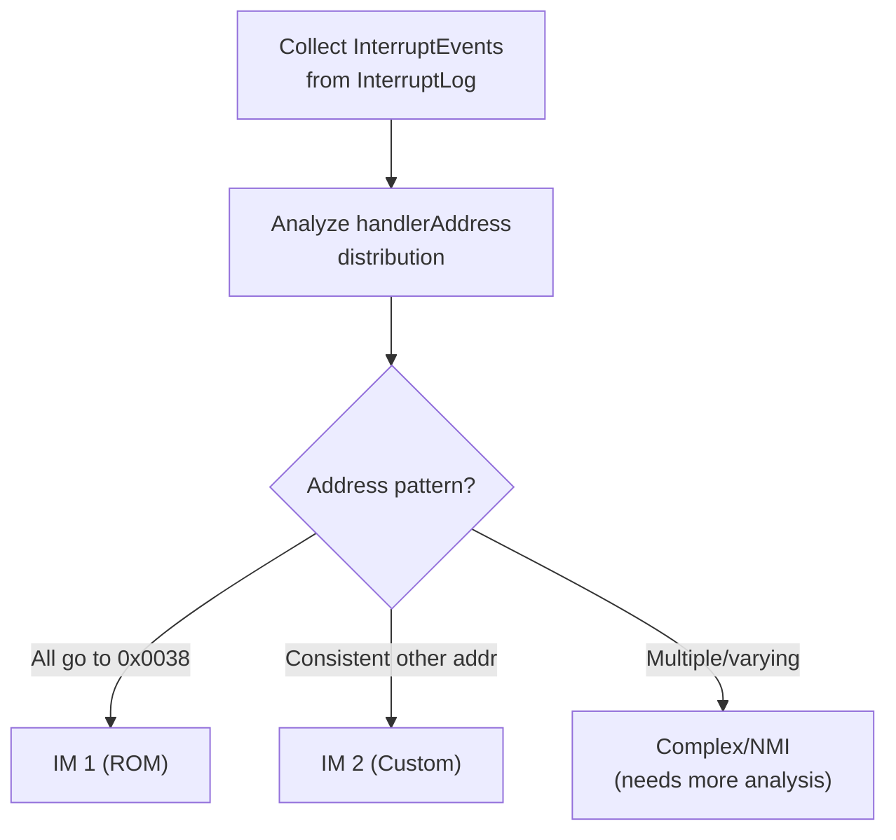

# Interrupt Analyzer: Handler Detection and Activity Classification

**Purpose:** Detect interrupt handlers and classify activities performed during interrupt service routines.

**Status:** Design Draft - Not Yet Implemented

**Parent:** [Analyzer Architecture](./analyzer-architecture.md)

**Dependencies:**
- [Data Collection Extensions](./data-collection-extensions.md) - Requires interrupt context tracking

---

## 1. Overview

The Interrupt Analyzer detects interrupt handlers and classifies the activities they perform. On the ZX Spectrum, the interrupt service routine (ISR) typically handles:

| Activity | Description | Detection Signature |
|----------|-------------|---------------------|
| **Keyboard Polling** | Read keyboard matrix | IN A,(0xFE) with varying high byte |
| **Music Playback** | Update AY-3-8912 | OUT to ports 0xFFFD, 0xBFFD |
| **Frame Counter** | Increment counters | Write to specific RAM addresses |
| **Screen Effects** | Border, attributes | OUT to port 0xFE |
| **Timer Update** | System clock | Write to TIME variables |

### 1.1 ZX Spectrum Interrupt Modes

| Mode | Handler Address | Trigger | Usage |
|------|-----------------|---------|-------|
| **IM 0** | From data bus | Rarely used | External hardware |
| **IM 1** | 0x0038 (fixed) | Common | Standard Spectrum |
| **IM 2** | (I×256 + bus) | Games | Custom handlers |

### 1.2 Interrupt Timing

```
Frame: 69888 T-states (48K) / 70908 T-states (128K)
Interrupt: Fires at start of frame
Duration: Typically 50-500 T-states (varies by game)
Frequency: 50 Hz (PAL) / 60 Hz (NTSC)
```

---

## 2. Handler Detection

### 2.1 IM 1 Detection (Simple Case)

```cpp
uint16_t DetectIM1Handler(const InterruptLog& log) {
    // IM 1 always jumps to 0x0038
    // Check if 0x0038 is executed during interrupts
    auto events = log.GetAllEvents();
    for (const auto& event : events) {
        if (event.handlerAddress == 0x0038) {
            return 0x0038;
        }
    }
    return 0;  // Not IM 1
}
```

### 2.2 IM 2 Detection (Complex Case)

IM 2 uses a vector table addressed by register I:

```
Handler address = Memory[(I << 8) | (bus_value & 0xFE)]
```

Most games set bus value to 0xFF, so:
```
Handler address = Memory[(I << 8) | 0xFE]
Handler address = Memory[(I << 8) | 0xFF]  // or this, depends on hardware
```

```cpp
struct IM2Detection {
    uint8_t iRegister;
    uint16_t vectorTableAddress;
    uint16_t handlerAddress;
    float confidence;
};

IM2Detection DetectIM2Handler(const InterruptLog& log, 
                               const Memory* memory,
                               uint8_t currentI) {
    // Read vector from I register location
    uint16_t vectorAddr = (currentI << 8) | 0xFE;
    uint16_t handler = memory->DirectReadWord(vectorAddr);
    
    // Verify this matches observed interrupt entries
    auto events = log.GetAllEvents();
    uint32_t matchCount = 0;
    for (const auto& event : events) {
        if (event.handlerAddress == handler) {
            matchCount++;
        }
    }
    
    float confidence = static_cast<float>(matchCount) / events.size();
    
    return {
        .iRegister = currentI,
        .vectorTableAddress = vectorAddr,
        .handlerAddress = handler,
        .confidence = confidence
    };
}
```

### 2.3 Handler Detection Flow

```
┌─────────────────────────────────────────────────────────────┐
│                   Interrupt Handler Detection                │
└─────────────────────────────────────────────────────────────┘
                              │
                              ▼
                ┌───────────────────────────┐
                │   Collect InterruptEvents │
                │   from InterruptLog       │
                └───────────────────────────┘
                              │
                              ▼
                ┌───────────────────────────┐
                │ Analyze handlerAddress    │
                │ distribution              │
                └───────────────────────────┘
                              │
              ┌───────────────┼───────────────┐
              │               │               │
              ▼               ▼               ▼
    ┌─────────────────┐ ┌─────────────┐ ┌─────────────────┐
    │ All go to 0x0038│ │ Consistent  │ │ Multiple or     │
    │                 │ │ other addr  │ │ varying addrs   │
    └─────────────────┘ └─────────────┘ └─────────────────┘
              │               │               │
              ▼               ▼               ▼
         ┌────────┐    ┌───────────┐    ┌───────────────┐
         │  IM 1  │    │   IM 2    │    │ Complex/NMI   │
         │ (ROM)  │    │ (Custom)  │    │ (needs more)  │
         └────────┘    └───────────┘    └───────────────┘
```

<details>
<summary>Mermaid version (click to expand)</summary>



</details>

---

## 3. Activity Classification

### 3.1 Classification Categories

```cpp
enum class InterruptActivity : uint8_t {
    Unknown,
    KeyboardPolling,
    MusicPlayback,
    FrameCounter,
    BorderEffect,
    TimerUpdate,
    ScreenUpdate,
    SoundEffect,
    InputProcessing,
    GameLogic
};

struct ActivityClassification {
    InterruptActivity type;
    uint16_t codeStart;
    uint16_t codeEnd;
    float confidence;
    std::string evidence;
};
```

### 3.2 Detection Heuristics

#### 3.2.1 Keyboard Polling

**Signature:** Multiple IN from port 0xFE with varying high byte (row selection).

```cpp
bool DetectKeyboardPolling(const InterruptEvent& event) {
    // Check for multiple port 0xFE reads
    uint32_t feReads = 0;
    std::set<uint8_t> highBytes;
    
    for (const auto& portAccess : event.portAccesses) {
        if ((portAccess.port & 0xFF) == 0xFE && !portAccess.isWrite) {
            feReads++;
            highBytes.insert(portAccess.port >> 8);
        }
    }
    
    // Typical keyboard scan reads 8 rows (or subset)
    return feReads >= 3 && highBytes.size() >= 3;
}
```

**Evidence string:** `"Port 0xFE read {N} times with {M} different row selectors"`

#### 3.2.2 AY Music Playback

**Signature:** Writes to ports 0xFFFD (register select) and 0xBFFD (data).

```cpp
bool DetectAYMusic(const InterruptEvent& event) {
    bool hasRegSelect = false;
    bool hasDataWrite = false;
    
    for (const auto& portAccess : event.portAccesses) {
        if (portAccess.isWrite) {
            if ((portAccess.port & 0xC002) == 0xC000) {  // 0xFFFD pattern
                hasRegSelect = true;
            }
            if ((portAccess.port & 0xC002) == 0x8000) {  // 0xBFFD pattern
                hasDataWrite = true;
            }
        }
    }
    
    return hasRegSelect && hasDataWrite;
}
```

**Evidence string:** `"AY register select (0xFFFD) and data write (0xBFFD) detected"`

#### 3.2.3 Border Effects

**Signature:** OUT to port 0xFE (lower 3 bits = border color).

```cpp
bool DetectBorderEffect(const InterruptEvent& event) {
    for (const auto& portAccess : event.portAccesses) {
        if ((portAccess.port & 0xFF) == 0xFE && portAccess.isWrite) {
            return true;
        }
    }
    return false;
}
```

#### 3.2.4 Frame Counter

**Signature:** Incrementing write to fixed RAM address every interrupt.

```cpp
bool DetectFrameCounter(const InterruptEvent& event,
                        const std::vector<InterruptEvent>& history) {
    // Find addresses written in this event
    for (const auto& write : event.memoryWrites) {
        // Check if this address is written every interrupt
        bool consistentWrite = true;
        for (const auto& prev : history) {
            bool found = false;
            for (const auto& prevWrite : prev.memoryWrites) {
                if (prevWrite.address == write.address) {
                    found = true;
                    break;
                }
            }
            if (!found) {
                consistentWrite = false;
                break;
            }
        }
        
        if (consistentWrite) {
            return true;  // Likely frame counter
        }
    }
    return false;
}
```

### 3.3 Activity Detection Flow

```
┌─────────────────────────────────────────────────────────────┐
│              For each InterruptEvent:                        │
└─────────────────────────────────────────────────────────────┘
                              │
                              ▼
         ┌────────────────────────────────────────┐
         │      Collect activity evidence:        │
         │  - Port reads/writes during interrupt  │
         │  - Memory writes during interrupt      │
         │  - Code executed during interrupt      │
         └────────────────────────────────────────┘
                              │
         ┌────────────────────┼────────────────────┐
         │                    │                    │
         ▼                    ▼                    ▼
   ┌───────────┐       ┌───────────┐       ┌───────────────┐
   │ Port 0xFE │       │ Port 0xFFFD│      │ Fixed RAM     │
   │ reads?    │       │ writes?   │       │ writes?       │
   └───────────┘       └───────────┘       └───────────────┘
         │                    │                    │
         ▼                    ▼                    ▼
   ┌───────────┐       ┌───────────┐       ┌───────────────┐
   │ Keyboard  │       │ AY Music  │       │ Frame Counter │
   │ Polling   │       │ Playback  │       │               │
   └───────────┘       └───────────┘       └───────────────┘
                              │
                              ▼
         ┌────────────────────────────────────────┐
         │    Combine activities into summary     │
         │    with confidence scores              │
         └────────────────────────────────────────┘
```

---

## 4. Interrupt Handler Dissection

### 4.1 Code Region Identification

Map activities to specific code regions within the handler:

```cpp
struct HandlerRegion {
    uint16_t start;
    uint16_t end;
    InterruptActivity activity;
    float confidence;
};

std::vector<HandlerRegion> DissectHandler(
    uint16_t handlerAddress,
    const BlockSegmentation& blocks,
    const FunctionDetector::Result& functions,
    const InterruptLog& log) 
{
    std::vector<HandlerRegion> regions;
    
    // Find all CODE blocks reachable from handler
    auto reachable = FindReachableCode(handlerAddress, functions);
    
    for (const auto& block : reachable) {
        // Analyze what this block does
        auto activity = ClassifyCodeBlock(block, log);
        regions.push_back({
            .start = block.start,
            .end = block.end,
            .activity = activity,
            .confidence = CalculateConfidence(block, activity)
        });
    }
    
    return regions;
}
```

### 4.2 Call Graph Within Handler

```cpp
struct HandlerCallGraph {
    uint16_t handlerEntry;
    std::vector<uint16_t> subroutines;
    std::unordered_map<uint16_t, InterruptActivity> subroutineActivities;
};

HandlerCallGraph BuildHandlerCallGraph(
    uint16_t handlerAddress,
    const CallTraceBuffer* trace,
    const InterruptLog& log) 
{
    HandlerCallGraph graph;
    graph.handlerEntry = handlerAddress;
    
    // Find all CALLs during interrupt context
    for (const auto& event : trace->GetAll()) {
        if (event.type == Z80CFType::CALL) {
            // Check if this CALL happened during interrupt
            if (log.WasInInterruptAt(event.tstate)) {
                graph.subroutines.push_back(event.target_addr);
            }
        }
    }
    
    // Remove duplicates
    std::sort(graph.subroutines.begin(), graph.subroutines.end());
    graph.subroutines.erase(
        std::unique(graph.subroutines.begin(), graph.subroutines.end()),
        graph.subroutines.end()
    );
    
    return graph;
}
```

---

## 5. Analysis Output

### 5.1 Data Structures

```cpp
struct InterruptAnalysis {
    // Handler detection
    uint16_t handlerAddress;
    InterruptMode mode;  // IM0, IM1, IM2
    float handlerConfidence;
    
    // Timing statistics
    uint32_t avgDurationTstates;
    uint32_t minDurationTstates;
    uint32_t maxDurationTstates;
    
    // Activity breakdown
    std::vector<ActivityClassification> activities;
    
    // Handler structure
    std::vector<HandlerRegion> regions;
    HandlerCallGraph callGraph;
    
    // Stability
    bool isStable;  // Same handler across frames
    uint32_t framesAnalyzed;
};

enum class InterruptMode : uint8_t {
    Unknown,
    IM0,
    IM1,
    IM2,
    NMI
};
```

### 5.2 Example Output

```yaml
interrupt_analysis:
  handler:
    address: 0x0038
    mode: "IM1"
    confidence: 0.99
    
  timing:
    avg_tstates: 285
    min_tstates: 250
    max_tstates: 320
    
  activities:
    - type: "keyboard_polling"
      code_start: 0x0038
      code_end: 0x0055
      confidence: 0.95
      evidence: "Port 0xFE read 8 times with 8 different row selectors"
      
    - type: "music_playback"
      code_start: 0x0060
      code_end: 0x0120
      confidence: 0.90
      evidence: "AY register select and data write detected"
      
    - type: "frame_counter"
      code_start: 0x0130
      code_end: 0x0138
      confidence: 0.85
      evidence: "INC (0x5C78) executed every interrupt"
      
  call_graph:
    entry: 0x0038
    subroutines:
      - address: 0x0060
        name: "sub_0060"
        activity: "music_playback"
      - address: 0x0130
        name: "sub_0130"
        activity: "frame_counter"
```

---

## 6. Integration with Other Analyzers

### 6.1 Block Segmenter Coordination

```cpp
void InterruptAnalyzer::EnhanceBlockClassification(BlockSegmenter* segmenter) {
    // Mark handler code as "interrupt code" for disassembler
    for (const auto& region : _analysis.regions) {
        segmenter->AddAnnotation(region.start, region.end, 
            AnnotationType::InterruptHandler,
            fmt::format("ISR: {}", ActivityToString(region.activity)));
    }
}
```

### 6.2 Routine Classifier Coordination

```cpp
void InterruptAnalyzer::ProvideContext(RoutineClassifier* classifier) {
    // Tell routine classifier which code runs in interrupt context
    for (const auto& region : _analysis.regions) {
        if (region.activity == InterruptActivity::MusicPlayback) {
            classifier->HintMusicRoutine(region.start, region.end);
        }
        if (region.activity == InterruptActivity::KeyboardPolling) {
            classifier->HintInputRoutine(region.start, region.end);
        }
    }
}
```

---

## 7. Test Specifications

### 7.1 Handler Detection Tests

```cpp
TEST(InterruptAnalyzer, DetectsIM1Handler) {
    // Given: Interrupt events all going to 0x0038
    InterruptLog log;
    for (int i = 0; i < 100; i++) {
        log.Log({.handlerAddress = 0x0038});
    }
    
    // When: Analyzer runs
    InterruptAnalyzer analyzer;
    analyzer.Analyze(log, memory);
    
    // Then: IM 1 detected
    EXPECT_EQ(analyzer.GetResult().mode, InterruptMode::IM1);
    EXPECT_EQ(analyzer.GetResult().handlerAddress, 0x0038);
}

TEST(InterruptAnalyzer, DetectsIM2Handler) {
    // Given: I register = 0xFE, vector table at 0xFEFE points to 0x8000
    memory.WriteWord(0xFEFE, 0x8000);
    z80.SetI(0xFE);
    
    InterruptLog log;
    for (int i = 0; i < 100; i++) {
        log.Log({.handlerAddress = 0x8000});
    }
    
    // When: Analyzer runs
    analyzer.Analyze(log, memory, z80.GetI());
    
    // Then: IM 2 detected
    EXPECT_EQ(analyzer.GetResult().mode, InterruptMode::IM2);
    EXPECT_EQ(analyzer.GetResult().handlerAddress, 0x8000);
}
```

### 7.2 Activity Classification Tests

```cpp
TEST(InterruptAnalyzer, DetectsKeyboardPolling) {
    // Given: Interrupt with port 0xFE reads (different rows)
    InterruptEvent event;
    event.portAccesses = {
        {.port = 0xFEFE, .isWrite = false},  // Row 0
        {.port = 0xFDFE, .isWrite = false},  // Row 1
        {.port = 0xFBFE, .isWrite = false},  // Row 2
        // ... etc
    };
    
    // When: Classifier runs
    auto activities = analyzer.ClassifyActivities(event);
    
    // Then: Keyboard polling detected
    EXPECT_TRUE(HasActivity(activities, InterruptActivity::KeyboardPolling));
}

TEST(InterruptAnalyzer, DetectsAYMusic) {
    // Given: Interrupt with AY port writes
    InterruptEvent event;
    event.portAccesses = {
        {.port = 0xFFFD, .value = 0x07, .isWrite = true},   // Select mixer register
        {.port = 0xBFFD, .value = 0x38, .isWrite = true},   // Write mixer value
        {.port = 0xFFFD, .value = 0x08, .isWrite = true},   // Select volume A
        {.port = 0xBFFD, .value = 0x0F, .isWrite = true},   // Write volume
    };
    
    // When: Classifier runs
    auto activities = analyzer.ClassifyActivities(event);
    
    // Then: AY music detected
    EXPECT_TRUE(HasActivity(activities, InterruptActivity::MusicPlayback));
}
```

### 7.3 Dissection Tests

```cpp
TEST(InterruptAnalyzer, DissectsHandlerIntoRegions) {
    // Given: Handler with keyboard polling then music
    SetupHandler(0x0038, {
        // Keyboard polling code at 0x0038-0x0050
        0xDB, 0xFE,  // IN A,(0xFE)
        // ... more keyboard code
        // Music code at 0x0060-0x0100
        0xD3, 0xFD,  // OUT (0xFFFD),A
        // ... more music code
    });
    
    // When: Analyzer runs
    analyzer.Analyze(log, memory);
    auto regions = analyzer.GetResult().regions;
    
    // Then: Two regions detected
    ASSERT_EQ(regions.size(), 2);
    EXPECT_EQ(regions[0].activity, InterruptActivity::KeyboardPolling);
    EXPECT_EQ(regions[1].activity, InterruptActivity::MusicPlayback);
}
```

---

## 8. Limitations and Edge Cases

### 8.1 Known Limitations

| Limitation | Description | Mitigation |
|------------|-------------|------------|
| Nested interrupts | NMI during ISR | Track nesting level |
| Variable ISR | Different code paths | Analyze multiple frames |
| EI in ISR | Re-enables interrupts early | Detect EI instruction |
| Long ISR | Spans multiple scanlines | Use T-state ranges |
| Dynamic ISR | Self-modifying handler | Track SMC in handler |

### 8.2 Edge Cases

```cpp
// Case: EI executed in ISR (common in games)
// Detection: Watch for EI instruction within handler
bool HasEarlyEI(uint16_t handlerStart, uint16_t handlerEnd, const Memory* mem) {
    for (uint16_t addr = handlerStart; addr < handlerEnd; addr++) {
        if (mem->DirectReadFromZ80Memory(addr) == 0xFB) {  // EI opcode
            return true;
        }
    }
    return false;
}

// Case: RETI vs RET confusion
// Some games use RET instead of RETI (works on Spectrum, not on all Z80 systems)
bool UsesIncorrectRET(const InterruptLog& log) {
    for (const auto& event : log.GetAllEvents()) {
        // Check if exit was via RET instead of RETI
        // This requires tracking which instruction caused exit
    }
    return false;
}
```

---

## 9. Performance Considerations

### 9.1 Analysis Cost

| Operation | Cost | Frequency |
|-----------|------|-----------|
| Handler detection | O(events) | Once per session |
| Activity classification | O(port_accesses) | Per frame (if enabled) |
| Handler dissection | O(code_size) | On demand |
| Full analysis | ~5-10ms | On pause/request |

### 9.2 Optimization Strategies

1. **Cache handler address** - Only recompute if events diverge
2. **Incremental activity tracking** - Update counts, don't reanalyze
3. **Lazy dissection** - Only dissect when UI requests detail

---

## 10. References

### Parent Documents
- [Analyzer Architecture](./analyzer-architecture.md)

### Dependencies
- [Data Collection Extensions](./data-collection-extensions.md)

### Related Documents
- [Routine Classifiers](./routine-classifiers.md)

### ZX Spectrum References
- Z80 CPU User Manual - Interrupt modes
- Spectrum 48K/128K technical documentation
