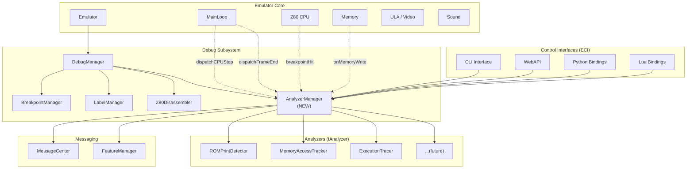
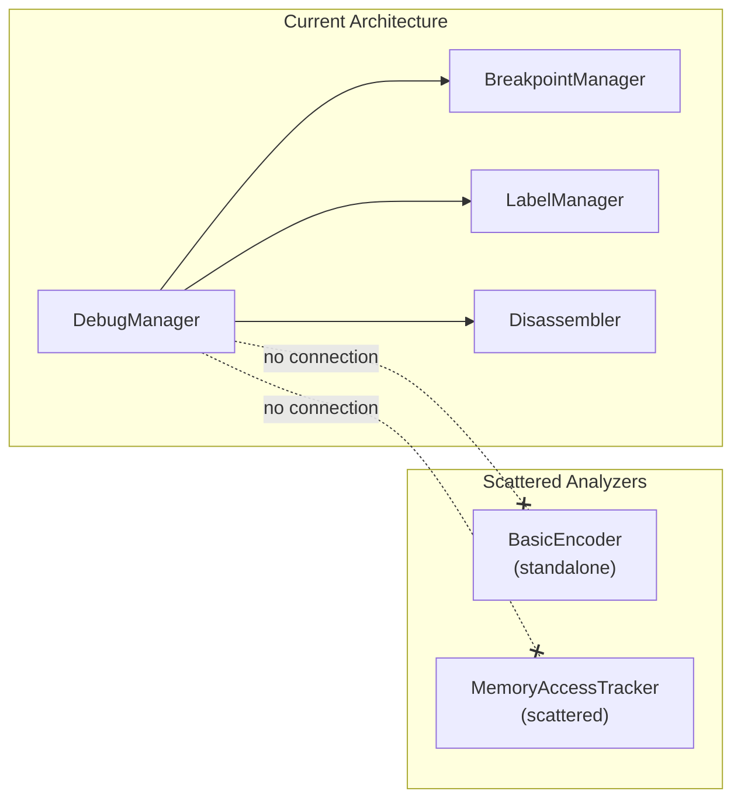
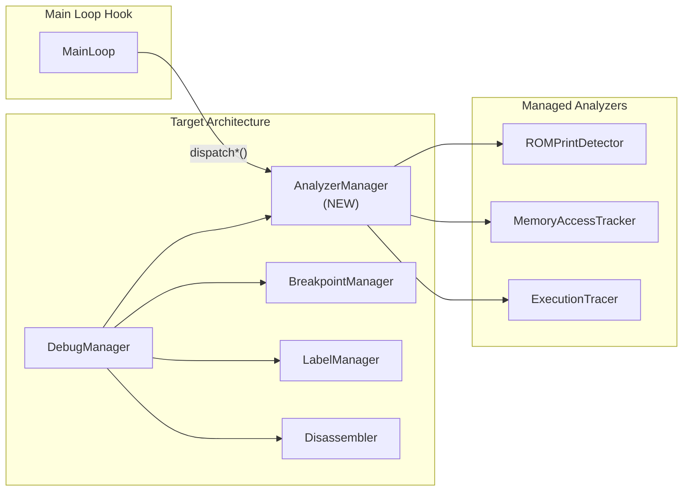
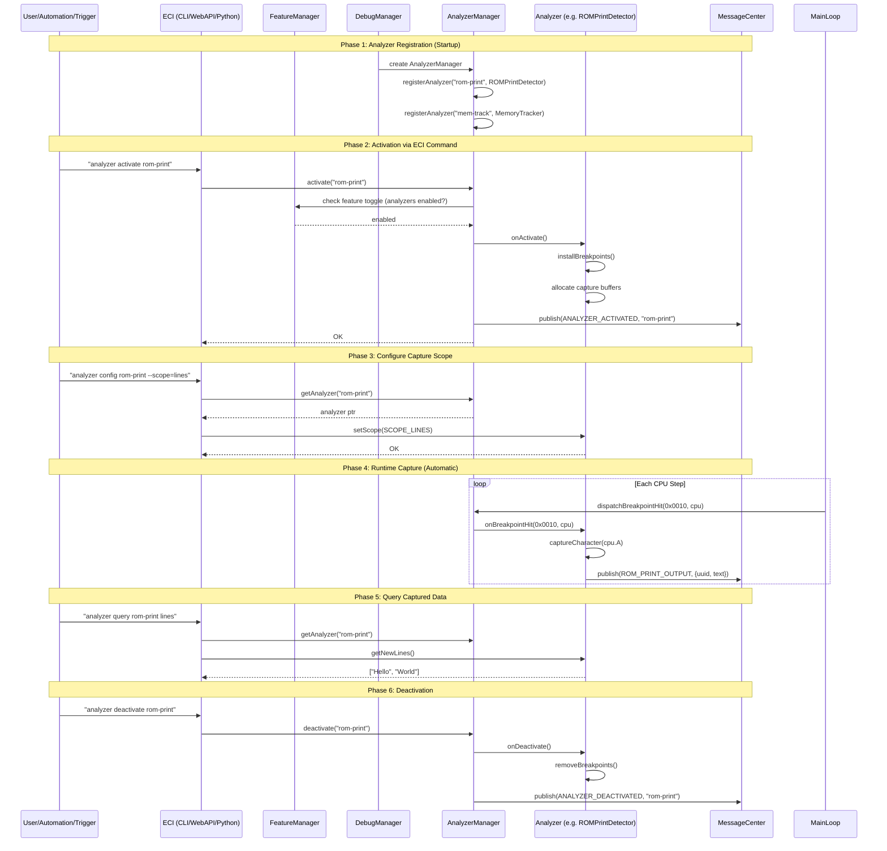
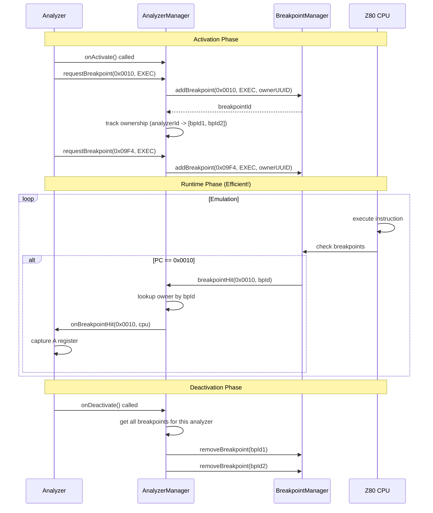
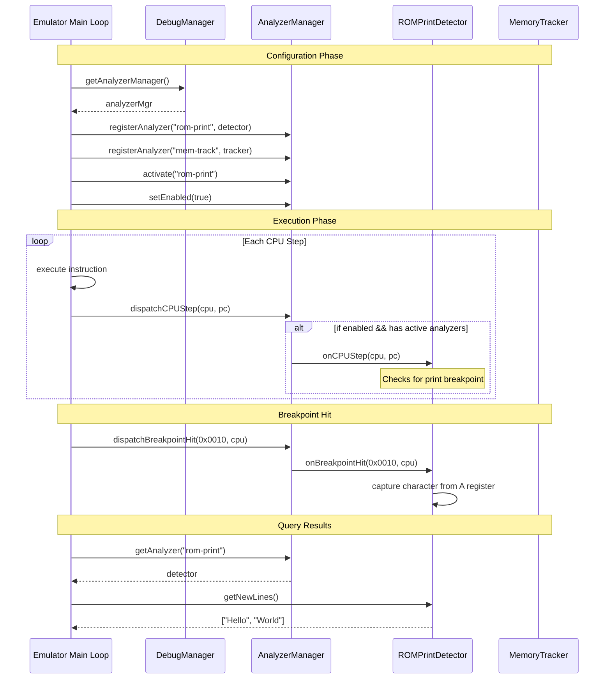

# AnalyzerManager Design

## Problem Statement

Analyzers like `ROMPrintDetector` need to hook into the emulator's execution flow (CPU cycles, video frames, audio rendering) to capture data in real-time. Currently, there's no centralized mechanism to:
- Register/deregister analyzers dynamically
- Activate/deactivate analyzers at runtime
- Dispatch execution events to multiple analyzers efficiently
- Guard analyzer execution behind feature toggles

## Objectives

1. **Centralized Management**: Single point to register/manage all analyzers
2. **Runtime Control**: Activate/deactivate analyzers without restart
3. **Efficient Dispatching**: Minimal overhead when dispatching to multiple analyzers
4. **Feature Toggles**: Guard by debug flags and feature settings
5. **Decoupled Design**: Analyzers don't know about each other
6. **Testable**: Easy to mock and test in isolation
7. **ECI Integration**: Controllable via CLI/WebAPI/Python/Lua commands

---

## Component Diagram



---

## Current State vs Target State

### Current State



**Problems:**
- Analyzers scattered across codebase
- No unified management interface
- No runtime activation/deactivation
- No standard dispatch mechanism
- Hard to add new analyzers

---

### Target State



**Benefits:**
- ✅ All analyzers in one place
- ✅ Unified lifecycle management
- ✅ Runtime activation/deactivation
- ✅ Single dispatch point in main loop
- ✅ Easy to add new analyzers

---

## Configuration Phase

### Activation Flow



### Capture Modes

| Mode | Description | Hook Point | Performance Impact |
|------|-------------|------------|-------------------|
| `CPU_STEP` | Every CPU instruction | `dispatchCPUStep()` | **High** (~30% overhead) |
| `BREAKPOINT` | Specific PC addresses | `dispatchBreakpointHit()` | **Low** (~1% overhead) |
| `MEMORY_READ` | Memory read operations | `dispatchMemoryRead()` | **Medium** (~15% overhead) |
| `MEMORY_WRITE` | Memory write operations | `dispatchMemoryWrite()` | **Medium** (~15% overhead) |
| `FRAME_START` | Start of each video frame | `dispatchFrameStart()` | **Minimal** |
| `FRAME_END` | End of each video frame | `dispatchFrameEnd()` | **Minimal** |
| `VIDEO_LINE` | Each scanline rendered | `dispatchVideoLine()` | **Medium** (~10% overhead) |
| `AUDIO_SAMPLE` | Each audio sample | `dispatchAudioSample()` | **Low** (~5% overhead) |

---

## Integration with Current Codebase

### Files to Modify

| File | Current State | Changes Required |
|------|--------------|------------------|
| `debugger/debugmanager.h` | Has BreakpointManager, LabelManager, Disassembler | Add `AnalyzerManager* _analyzerManager` member |
| `debugger/debugmanager.cpp` | Manages breakpoints, labels | Create and manage AnalyzerManager lifecycle |
| `emulator/mainloop.cpp` | Main execution loop | Add dispatch calls for CPU/frame events |
| `emulator/emulator.cpp` | Emulator lifecycle | Pass context to DebugManager for analyzer access |
| `common/messages.h` | Message definitions | Add `MSG_ANALYZER_*` and `MSG_ROM_PRINT_OUTPUT` |
| `automation/cliprocessor.cpp` | CLI command handlers | Add `analyzer` command handler |

### New Files to Create

```
core/src/debugger/
├── analyzermanager.h          # AnalyzerManager class
├── analyzermanager.cpp        # AnalyzerManager implementation
├── ianalyzer.h                # IAnalyzer interface
└── analyzers/
    └── rom-prints/
        ├── romprintdetector.h
        └── romprintdetector.cpp
```

---

## ECI Command Integration

### New `analyzer` Command

Add to command-interface.md under **Section 7: Analyzer Management**:

```markdown
| Command | Arguments | Description |
|---------|-----------|-------------|
| `analyzer list` | | List all registered analyzers with status |
| `analyzer activate <name>` | `<analyzer-name>` | Activate an analyzer |
| `analyzer deactivate <name>` | `<analyzer-name>` | Deactivate an analyzer |
| `analyzer status <name>` | `<analyzer-name>` | Show analyzer configuration and statistics |
| `analyzer config <name> <key> <value>` | | Configure analyzer parameter |
| `analyzer query <name> <subcommand>` | | Query captured data |
| `analyzer clear <name>` | | Clear captured data buffer |
```

### Example CLI Session

```bash
# List available analyzers
> analyzer list
┌─────────────────┬────────┬─────────────────────────────────────┐
│ Name            │ Status │ Description                         │
├─────────────────┼────────┼─────────────────────────────────────┤
│ rom-print       │ OFF    │ ROM print detection (RST 0x10)      │
│ mem-track       │ OFF    │ Memory access tracking              │
│ exec-trace      │ OFF    │ Execution flow tracer               │
└─────────────────┴────────┴─────────────────────────────────────┘

# Activate ROM print detector
> analyzer activate rom-print
Analyzer 'rom-print' activated (UUID: abcd-1234-...)

# Configure capture scope
> analyzer config rom-print scope lines
Configuration updated: scope = lines

# Run some emulation...
> resume
> pause

# Query captured lines
> analyzer query rom-print lines
[1] "Hello World"
[2] "Press T for TURBO-FORMAT"
[3] "Other key for FORMAT"

# Get lines since last query
> analyzer query rom-print new
[4] "Formatting track 00"

# Clear buffer
> analyzer clear rom-print
Buffer cleared (4 lines)

# Deactivate
> analyzer deactivate rom-print
Analyzer 'rom-print' deactivated
```

### WebAPI Endpoints

| Endpoint | Method | Description |
|----------|--------|-------------|
| `/api/v1/emulator/{id}/analyzer` | GET | List all analyzers |
| `/api/v1/emulator/{id}/analyzer/{name}/activate` | POST | Activate analyzer |
| `/api/v1/emulator/{id}/analyzer/{name}/deactivate` | POST | Deactivate analyzer |
| `/api/v1/emulator/{id}/analyzer/{name}/query` | GET | Query captured data |
| `/api/v1/emulator/{id}/analyzer/{name}/config` | PUT | Configure analyzer |
| `/api/v1/emulator/{id}/analyzer/{name}/clear` | POST | Clear buffer |

---

## Feature Toggle Integration

The AnalyzerManager respects the existing FeatureManager system:

```cpp
// In FeatureManager - new feature flags
FEATURE_ANALYZERS        // Master enable for AnalyzerManager
FEATURE_ANALYZER_DEBUG   // Verbose logging for analyzer activity

// Usage in AnalyzerManager
void AnalyzerManager::dispatchCPUStep(Z80* cpu, uint16_t pc) {
    // Check master toggle FIRST
    if (!_featureManager->isEnabled(FEATURE_ANALYZERS)) {
        return;  // Zero overhead when disabled
    }
    
    // Dispatch to active analyzers only
    for (const auto& id : _activeAnalyzers) {
        _analyzers[id]->onCPUStep(cpu, pc);
    }
}
```

---

## Analyzer-Managed Breakpoints

### The Problem with Traffic Sniffing

Sniffing all CPU traffic is extremely inefficient for targeted analysis:

| Approach | Performance Impact | Use Case |
|----------|-------------------|----------|
| Every CPU step | **~30% overhead** | Full execution tracing (rare) |
| Targeted breakpoints | **~1% overhead** | Specific code detection (common) |

For `ROMPrintDetector`, we only need to trigger on ROM print routine calls (addresses `0x0010`, `0x09F4`), not every instruction.

### Solution: Analyzer-Owned Breakpoints

Analyzers can request breakpoints from BreakpointManager via AnalyzerManager, with proper ownership tracking:



### Breakpoint Ownership API

```cpp
class IAnalyzer {
public:
    // ... existing interface ...
    
protected:
    // Request a breakpoint from the manager
    // These are automatically cleaned up on deactivation
    BreakpointId requestExecutionBreakpoint(uint16_t address);
    BreakpointId requestMemoryBreakpoint(uint16_t address, MemoryAccessType type);
    BreakpointId requestPortBreakpoint(uint8_t port, PortAccessType type);
    
    // Manually remove if needed before deactivation
    void releaseBreakpoint(BreakpointId id);
    
    // Access to manager (set by AnalyzerManager on registration)
    AnalyzerManager* _manager = nullptr;
};

class AnalyzerManager {
public:
    // Breakpoint management with ownership
    BreakpointId addAnalyzerBreakpoint(
        const std::string& analyzerId,
        uint16_t address,
        BreakpointType type
    );
    
    void removeAnalyzerBreakpoint(BreakpointId id);
    void removeAllBreakpointsForAnalyzer(const std::string& analyzerId);
    
    // Called by BreakpointManager when a breakpoint hits
    void onBreakpointHit(uint16_t address, BreakpointId id, Z80* cpu);
    
private:
    // Ownership tracking: breakpointId -> analyzerId
    std::unordered_map<BreakpointId, std::string> _breakpointOwners;
    
    // Reverse lookup: analyzerId -> [breakpointId1, breakpointId2, ...]
    std::unordered_map<std::string, std::vector<BreakpointId>> _analyzerBreakpoints;
};
```

### Example: ROMPrintDetector Implementation

```cpp
class ROMPrintDetector : public IAnalyzer {
public:
    void onActivate() override {
        // Request breakpoints at ROM print routines
        _bp0010 = requestExecutionBreakpoint(0x0010);  // RST 0x10
        _bp09F4 = requestExecutionBreakpoint(0x09F4);  // PRINT-OUT
        
        _buffer.clear();
    }
    
    void onDeactivate() override {
        // Breakpoints automatically cleaned up by AnalyzerManager
        // but we can release early if needed:
        // releaseBreakpoint(_bp0010);
        // releaseBreakpoint(_bp09F4);
    }
    
    void onBreakpointHit(uint16_t address, Z80* cpu) override {
        // Only called when OUR breakpoints hit!
        uint8_t charCode = cpu->a;
        captureCharacter(charCode);
    }
    
private:
    BreakpointId _bp0010;
    BreakpointId _bp09F4;
    std::string _buffer;
};
```

### Breakpoint Types vs Dispatch Types

| Capture Need | Use Breakpoint? | Use Dispatch? | Why |
|--------------|-----------------|---------------|-----|
| Specific PC address | ✅ Yes | ❌ No | ~1% overhead |
| Specific memory address | ✅ Yes (watchpoint) | ❌ No | ~2% overhead |
| Every instruction | ❌ No | ✅ CPU_STEP | Breakpoint can't help |
| Video frame boundaries | ❌ No | ✅ FRAME_* | Not addressable |
| Audio samples | ❌ No | ✅ AUDIO_SAMPLE | Not addressable |

### Conflict Resolution

Multiple analyzers may request breakpoints at the same address:

```cpp
// Analyzer A requests bp at 0x8000
// Analyzer B also requests bp at 0x8000

// BreakpointManager has single breakpoint at 0x8000
// AnalyzerManager maintains multiple ownership entries

void AnalyzerManager::onBreakpointHit(uint16_t address, BreakpointId id, Z80* cpu) {
    // Notify ALL analyzers that own breakpoints at this address
    for (const auto& [bpId, analyzerId] : _breakpointOwners) {
        if (getBreakpointAddress(bpId) == address) {
            _analyzers[analyzerId]->onBreakpointHit(address, cpu);
        }
    }
}
```

### Automatic Cleanup

When an analyzer is deactivated, its breakpoints are automatically removed:

```cpp
void AnalyzerManager::deactivate(const std::string& id) {
    // 1. Call analyzer's onDeactivate
    _analyzers[id]->onDeactivate();
    
    // 2. Remove from active set
    _activeAnalyzers.erase(id);
    
    // 3. Clean up ALL breakpoints owned by this analyzer
    if (_analyzerBreakpoints.contains(id)) {
        for (BreakpointId bpId : _analyzerBreakpoints[id]) {
            _breakpointManager->removeBreakpoint(bpId);
            _breakpointOwners.erase(bpId);
        }
        _analyzerBreakpoints.erase(id);
    }
}
```

### Benefits

1. **Efficient**: Only ~1% overhead vs ~30% for traffic sniffing
2. **Clean Ownership**: Each analyzer manages its own breakpoints
3. **Automatic Cleanup**: No orphaned breakpoints after deactivation
4. **Conflict-Free**: Multiple analyzers can share addresses
5. **Decoupled**: Analyzers don't need to know about BreakpointManager directly

## Dispatch Pattern Analysis

### The Core Problem

Event dispatching happens at extremely high frequency:
- **CPU Step**: 3.5M calls/second (3.5MHz Z80)
- **Memory Read/Write**: 1-3M calls/second
- **Video Line**: 312 × 50 = 15,600 calls/second
- **Frame End**: 50 calls/second

Even nanoseconds of overhead matter at these frequencies.

---

### Option 1: Virtual Method Interface (Rejected)

```cpp
class IAnalyzer {
public:
    virtual void onCPUStep(Z80* cpu, uint16_t pc) {}
    virtual void onBreakpointHit(uint16_t address, Z80* cpu) {}
    virtual void onMemoryRead(uint16_t address, uint8_t value) {}
    virtual void onFrameEnd() {}
    // ... more virtual methods
};

void AnalyzerManager::dispatchCPUStep(Z80* cpu, uint16_t pc) {
    for (const auto& id : _activeAnalyzers) {
        _analyzers[id]->onCPUStep(cpu, pc);  // Virtual call
    }
}
```

| Pros | Cons |
|------|------|
| Clean OOP design | Virtual call overhead (~5-10ns per call) |
| Compile-time type safety | Calls ALL active analyzers, even those with empty impl |
| Easy to understand | 3 analyzers × 3.5M calls = 10.5M virtual calls/sec |
| IDE autocomplete works | Cache-unfriendly (vtable jumps) |

**Performance Impact**: At 3.5MHz, with 3 active analyzers:
- 10.5M virtual calls/second for CPU_STEP alone
- ~50-100ms/second overhead just for dispatch
- **Verdict**: ❌ Unacceptable for high-frequency events

---

### Option 2: std::function Callback Lists (Acceptable)

```cpp
class AnalyzerManager {
    std::vector<std::function<void(Z80*, uint16_t)>> _cpuStepCallbacks;
    std::vector<std::function<void(uint16_t, Z80*)>> _breakpointCallbacks;
    std::vector<std::function<void()>> _frameEndCallbacks;
    
    void dispatchCPUStep(Z80* cpu, uint16_t pc) {
        for (auto& cb : _cpuStepCallbacks) {
            cb(cpu, pc);
        }
    }
};

// Analyzer subscribes only to what it needs
void ROMPrintDetector::onActivate(AnalyzerManager* mgr) {
    _callbackId = mgr->subscribeCPUStep([this](Z80* cpu, uint16_t pc) {
        // Only if we needed per-instruction monitoring
    });
}
```

| Pros | Cons |
|------|------|
| Only registered callbacks are called | std::function has ~15-25ns overhead |
| Zero overhead for unused events | Type erasure prevents inlining |
| Flexible (lambdas, member funcs) | Heap allocation for large captures |
| Clean subscription API | Slightly more complex than Option 1 |

**Performance Impact**:
- If ROMPrintDetector uses breakpoints (not CPU_STEP): **zero CPU_STEP overhead**
- Only analyzers that explicitly subscribe pay the cost
- **Verdict**: ✅ Good for medium-frequency events (FRAME_*, VIDEO_LINE)

---

### Option 3: Raw Function Pointer Lists (Recommended for Hot Paths)

```cpp
class AnalyzerManager {
    // Raw function pointers with context
    struct CPUStepCallback {
        void (*fn)(void* ctx, Z80* cpu, uint16_t pc);
        void* context;
    };
    std::vector<CPUStepCallback> _cpuStepCallbacks;
    
    void dispatchCPUStep(Z80* cpu, uint16_t pc) {
        for (const auto& cb : _cpuStepCallbacks) {
            cb.fn(cb.context, cpu, pc);  // ~2-3ns per call
        }
    }
};

// Static trampoline function
static void cpuStepTrampoline(void* ctx, Z80* cpu, uint16_t pc) {
    static_cast<ROMPrintDetector*>(ctx)->handleCPUStep(cpu, pc);
}

void ROMPrintDetector::onActivate(AnalyzerManager* mgr) {
    mgr->subscribeCPUStep(cpuStepTrampoline, this);
}
```

| Pros | Cons |
|------|------|
| Fastest possible (~2-3ns per call) | Requires trampoline functions |
| Zero overhead for unused events | Less ergonomic than lambdas |
| Inline-friendly | Manual void* casting |
| Cache-friendly (contiguous memory) | More boilerplate code |

**Performance Impact**:
- ~2-3ns per call vs ~15-25ns for std::function
- At 3.5M calls/sec: 7-10.5ms vs 52-87ms overhead
- **Verdict**: ✅ Recommended for CPU_STEP, MEMORY_* if needed

---

### Option 4: Hybrid Approach (Selected ✅)

Use **different mechanisms for different frequency levels**:

```cpp
class AnalyzerManager {
    // HOT PATH: Raw function pointers for high-frequency events
    std::vector<CPUStepCallback> _cpuStepCallbacks;    // ~3.5M/sec
    std::vector<MemoryCallback> _memoryReadCallbacks;   // ~1-3M/sec
    std::vector<MemoryCallback> _memoryWriteCallbacks;  // ~1-3M/sec
    
    // WARM PATH: std::function for medium-frequency events
    std::vector<std::function<void(uint16_t)>> _videoLineCallbacks;  // ~15K/sec
    std::vector<std::function<void(int16_t, int16_t)>> _audioCallbacks; // ~44K/sec
    
    // COLD PATH: Virtual dispatch for rare events (negligible overhead)
    std::vector<IAnalyzer*> _frameEndListeners;  // 50/sec
    std::vector<IAnalyzer*> _frameStartListeners; // 50/sec
};
```

| Event Type | Frequency | Mechanism | Overhead/sec |
|------------|-----------|-----------|--------------|
| CPU_STEP | 3.5M | Raw pointer | ~10ms |
| MEMORY_READ | 1-3M | Raw pointer | ~3-9ms |
| MEMORY_WRITE | <1M | Raw pointer | ~3ms |
| VIDEO_LINE | 15K | std::function | ~0.3ms |
| AUDIO_SAMPLE | 44K | std::function | ~1ms |
| FRAME_START | 50 | Virtual | negligible |
| FRAME_END | 50 | Virtual | negligible |
| BREAKPOINT_HIT | rare | Virtual | negligible |

---

## Architectural Decision Record (ADR)

### Decision: Hybrid Callback Registration with Frequency-Based Dispatch

**Status**: Accepted

**Context**:
The AnalyzerManager must dispatch events to multiple analyzers at varying frequencies. The most critical events (CPU_STEP) happen millions of times per second. Traditional virtual dispatch is too slow. Analyzers should only pay for events they actually use.

**Decision**:
1. **Hot paths (>100K events/sec)**: Use raw function pointers with void* context
2. **Warm paths (1K-100K events/sec)**: Use std::function for ergonomics
3. **Cold paths (<1K events/sec)**: Use virtual methods for simplicity
4. **Subscription model**: Analyzers explicitly subscribe only to events they need
5. **Auto-cleanup**: All subscriptions removed when analyzer deactivates

**Consequences**:
- ✅ Minimal overhead for high-frequency events
- ✅ Zero overhead for events no analyzer uses
- ✅ Clean API for medium/low frequency events
- ⚠️ More complex implementation than pure virtual approach
- ⚠️ Requires trampoline functions for hot paths

---

## Updated Core Interfaces

### Callback Types

```cpp
// Hot path callbacks (raw function pointers)
struct CPUStepCallback {
    void (*fn)(void* ctx, Z80* cpu, uint16_t pc);
    void* context;
    std::string ownerId;  // For cleanup on deactivation
};

struct MemoryCallback {
    void (*fn)(void* ctx, uint16_t address, uint8_t value);
    void* context;
    std::string ownerId;
};

// Subscription handle for cleanup
using CallbackId = uint64_t;
```

### IAnalyzer Interface (Minimal)

```cpp
class IAnalyzer {
public:
    virtual ~IAnalyzer() = default;
    
    // Lifecycle - manager passed for subscription
    virtual void onActivate(AnalyzerManager* mgr) = 0;
    virtual void onDeactivate() = 0;
    
    // Metadata
    virtual std::string getName() const = 0;
    virtual std::string getUUID() const = 0;
    
    // Cold path events (virtual is fine for 50/sec)
    virtual void onFrameStart() {}
    virtual void onFrameEnd() {}
    virtual void onBreakpointHit(uint16_t address, Z80* cpu) {}
    
protected:
    AnalyzerManager* _manager = nullptr;
};
```

### AnalyzerManager Subscription API

```cpp
class AnalyzerManager {
public:
    // Hot path subscriptions (raw pointers)
    CallbackId subscribeCPUStep(
        void (*fn)(void* ctx, Z80* cpu, uint16_t pc),
        void* context,
        const std::string& analyzerId
    );
    
    CallbackId subscribeMemoryRead(
        void (*fn)(void* ctx, uint16_t addr, uint8_t val),
        void* context,
        const std::string& analyzerId
    );
    
    CallbackId subscribeMemoryWrite(
        void (*fn)(void* ctx, uint16_t addr, uint8_t val),
        void* context,
        const std::string& analyzerId
    );
    
    // Warm path subscriptions (std::function)
    CallbackId subscribeVideoLine(
        std::function<void(uint16_t line)> callback,
        const std::string& analyzerId
    );
    
    CallbackId subscribeAudioSample(
        std::function<void(int16_t left, int16_t right)> callback,
        const std::string& analyzerId
    );
    
    // Unsubscribe (usually automatic on deactivation)
    void unsubscribe(CallbackId id);
    void unsubscribeAll(const std::string& analyzerId);
    
    // Dispatch methods (called by emulator)
    void dispatchCPUStep(Z80* cpu, uint16_t pc);
    void dispatchMemoryRead(uint16_t addr, uint8_t val);
    void dispatchMemoryWrite(uint16_t addr, uint8_t val);
    void dispatchVideoLine(uint16_t line);
    void dispatchAudioSample(int16_t left, int16_t right);
    void dispatchFrameStart();
    void dispatchFrameEnd();
    void dispatchBreakpointHit(uint16_t addr, Z80* cpu);
    
private:
    // Hot path storage
    std::vector<CPUStepCallback> _cpuStepCallbacks;
    std::vector<MemoryCallback> _memoryReadCallbacks;
    std::vector<MemoryCallback> _memoryWriteCallbacks;
    
    // Warm path storage
    std::vector<std::pair<std::function<void(uint16_t)>, std::string>> _videoLineCallbacks;
    std::vector<std::pair<std::function<void(int16_t, int16_t)>, std::string>> _audioCallbacks;
    
    // Cold path (direct virtual dispatch to active analyzers)
    std::unordered_map<std::string, std::unique_ptr<IAnalyzer>> _analyzers;
    std::unordered_set<std::string> _activeAnalyzers;
};
```

### Example: ROMPrintDetector with Hybrid Pattern

```cpp
class ROMPrintDetector : public IAnalyzer {
public:
    void onActivate(AnalyzerManager* mgr) override {
        _manager = mgr;
        
        // Request breakpoints (efficient triggering)
        _bp0010 = mgr->requestExecutionBreakpoint(0x0010, getUUID());
        _bp09F4 = mgr->requestExecutionBreakpoint(0x09F4, getUUID());
        
        // NOTE: We do NOT subscribe to CPU_STEP because breakpoints are sufficient
        // This means ZERO overhead on the CPU_STEP hot path!
        
        _buffer.clear();
    }
    
    void onDeactivate() override {
        // Breakpoints auto-cleaned by manager
        // No CPU_STEP subscription to clean up
    }
    
    // Cold path - only called when OUR breakpoints hit
    void onBreakpointHit(uint16_t address, Z80* cpu) override {
        if (address == 0x0010 || address == 0x09F4) {
            captureCharacter(cpu->a);
        }
    }
    
private:
    BreakpointId _bp0010, _bp09F4;
    PrintHistory _history;
};
```

**Key Insight**: ROMPrintDetector uses **breakpoints** (triggered only when PC matches) instead of CPU_STEP (every instruction). This means:
- Zero overhead on the 3.5M/sec CPU_STEP path
- Only ~1% overhead from breakpoint checking
- Breakpoint hit is a cold path (~rare) so virtual dispatch is fine
```

### AnalyzerManager Class

```cpp
class AnalyzerManager {
public:
    // Registration
    void registerAnalyzer(const std::string& id, std::unique_ptr<IAnalyzer> analyzer);
    void unregisterAnalyzer(const std::string& id);
    IAnalyzer* getAnalyzer(const std::string& id);
    
    // Activation control
    void activate(const std::string& id);
    void deactivate(const std::string& id);
    void activateAll();
    void deactivateAll();
    bool isActive(const std::string& id) const;
    
    // Query
    std::vector<std::string> getRegisteredAnalyzers() const;
    std::vector<std::string> getActiveAnalyzers() const;
    
    // Dispatching (called from main loop)
    void dispatchCPUStep(Z80* cpu, uint16_t pc);
    void dispatchBreakpointHit(uint16_t address, Z80* cpu);
    void dispatchMemoryRead(uint16_t address, uint8_t value);
    void dispatchMemoryWrite(uint16_t address, uint8_t value);
    void dispatchFrameStart();
    void dispatchFrameEnd();
    void dispatchVideoLine(uint16_t line);
    void dispatchAudioSample(int16_t left, int16_t right);
    
    // Feature toggle
    void setEnabled(bool enabled);
    bool isEnabled() const;
    
private:
    std::unordered_map<std::string, std::unique_ptr<IAnalyzer>> _analyzers;
    std::unordered_set<std::string> _activeAnalyzers;
    bool _enabled = false;  // Master toggle
};
```

---

## Sequence Diagram



---

## Integration Points

### Main Loop Integration

```cpp
// In Emulator::RunNCPUCycles or similar
void Emulator::executeCycle() {
    // ... execute CPU instruction ...
    
    // Dispatch to analyzers (guarded)
    if (_debugManager && _debugManager->getAnalyzerManager()->isEnabled()) {
        _debugManager->getAnalyzerManager()->dispatchCPUStep(_cpu, pc);
    }
}
```

### DebugManager Integration

```cpp
class DebugManager {
public:
    AnalyzerManager* getAnalyzerManager() { return &_analyzerManager; }
    
private:
    AnalyzerManager _analyzerManager;
};
```

---

## Feature Toggles

```cpp
// Master toggle - disables all analyzer dispatching
analyzerMgr->setEnabled(false);

// Per-analyzer toggle
analyzerMgr->deactivate("rom-print");

// Check before expensive operations
if (analyzerMgr->isEnabled() && analyzerMgr->hasActiveAnalyzers()) {
    analyzerMgr->dispatchCPUStep(cpu, pc);
}
```

---

## Implementation Plan

### Phase 1: Core Infrastructure
- [ ] Create `IAnalyzer` interface
- [ ] Create `AnalyzerManager` class
- [ ] Add to `DebugManager`
- [ ] Unit tests for registration/activation

### Phase 2: Dispatching
- [ ] Implement dispatch methods
- [ ] Add main loop integration hooks
- [ ] Add feature toggle support
- [ ] Performance benchmarks

### Phase 3: First Analyzer
- [ ] Port `ROMPrintDetector` to use `IAnalyzer`
- [ ] Integration test with FORMAT command
- [ ] Verify breakpoint dispatching works

### Phase 4: Documentation
- [ ] Update architecture docs
- [ ] Add usage examples
- [ ] Document performance characteristics

---

## Testing Strategy

### Unit Tests
```cpp
TEST(AnalyzerManager, RegisterAndActivate) {
    AnalyzerManager mgr;
    auto analyzer = std::make_unique<MockAnalyzer>();
    
    mgr.registerAnalyzer("test", std::move(analyzer));
    EXPECT_FALSE(mgr.isActive("test"));
    
    mgr.activate("test");
    EXPECT_TRUE(mgr.isActive("test"));
}

TEST(AnalyzerManager, DispatchToActiveOnly) {
    AnalyzerManager mgr;
    auto active = std::make_unique<MockAnalyzer>();
    auto inactive = std::make_unique<MockAnalyzer>();
    
    mgr.registerAnalyzer("active", std::move(active));
    mgr.registerAnalyzer("inactive", std::move(inactive));
    mgr.activate("active");
    mgr.setEnabled(true);
    
    mgr.dispatchCPUStep(nullptr, 0x1234);
    
    EXPECT_TRUE(active->wasNotified);
    EXPECT_FALSE(inactive->wasNotified);
}
```

### Integration Tests
- Verify dispatch overhead is acceptable
- Test with multiple active analyzers
- Test activation/deactivation during execution

---

## File Structure

```
core/src/debugger/
├── debugmanager.h
├── debugmanager.cpp
├── analyzermanager.h
├── analyzermanager.cpp
├── ianalyzer.h
└── analyzers/
    ├── rom-prints/
    │   └── romprintdetector.h/cpp
    ├── basic-lang/
    │   └── basicencoder.h/cpp
    └── ...
```

---

# Appendix A: Complex Analyzer Use Cases

This appendix demonstrates how to orchestrate analyzers for various real-world scenarios, showing trade-offs between different hook strategies.

---

## Use Case 1: ROM Print Procedure Grabber

**Goal**: Capture all text printed via ROM routines (RST 0x10, PRINT-OUT at 0x09F4, etc.)

### Strategy Comparison

| Strategy | Hook Type | Performance | Accuracy | Complexity |
|----------|-----------|-------------|----------|------------|
| **A: Breakpoints** | BREAKPOINT | ✅ Excellent (~1%) | ✅ Precise | Low |
| B: Per-Frame OCR | FRAME_END | ✅ Good | ⚠️ May miss rapid changes | Medium |
| C: Per-CPU-Step | CPU_STEP | ❌ Terrible (~30%) | ✅ Precise | Low |

### Recommended: Strategy A (Breakpoints)

```cpp
class ROMPrintGrabber : public IAnalyzer {
public:
    void onActivate(AnalyzerManager* mgr) override {
        _manager = mgr;
        
        // ZX Spectrum 48K ROM print entry points
        _bpRST10 = mgr->requestExecutionBreakpoint(0x0010, getUUID());     // RST 0x10
        _bpPrintOut = mgr->requestExecutionBreakpoint(0x09F4, getUUID()); // PRINT-OUT
        _bpPoMsg = mgr->requestExecutionBreakpoint(0x15F2, getUUID());    // PO-MSG
        
        // TR-DOS ROM (when paged in)
        _bpTRDOS = mgr->requestExecutionBreakpoint(0x3D13, getUUID());    // TR-DOS print
        
        _buffer.clear();
        _currentLine.clear();
    }
    
    void onBreakpointHit(uint16_t address, Z80* cpu) override {
        uint8_t charCode = cpu->a;  // Character in A register
        
        if (charCode == 0x0D) {  // Carriage return
            flushLine();
        } else if (charCode >= 0x20 && charCode < 0x80) {
            _currentLine += static_cast<char>(charCode);
        } else if (charCode >= 0x80) {
            // ZX Spectrum keyword token - decode via BasicEncoder
            _currentLine += _encoder.decodeToken(charCode);
        }
        
        // Publish to MessageCenter
        if (_broadcastEnabled) {
            publishCharacter(charCode);
        }
    }
    
private:
    std::string _currentLine;
    std::vector<std::string> _buffer;
    BasicEncoder _encoder;
    
    void flushLine() {
        if (!_currentLine.empty()) {
            _buffer.push_back(_currentLine);
            if (_broadcastEnabled) {
                MessageCenter::publish(MSG_ROM_PRINT_LINE, {
                    {"uuid", getUUID()},
                    {"line", _currentLine}
                });
            }
            _currentLine.clear();
        }
    }
};
```

### Alternative: Strategy B (Per-Frame OCR Fallback)

Use when program bypasses ROM and writes directly to screen memory:

```cpp
class ROMPrintGrabberWithOCR : public ROMPrintGrabber {
public:
    void onActivate(AnalyzerManager* mgr) override {
        ROMPrintGrabber::onActivate(mgr);
        
        // Also subscribe to frame end for OCR validation
        // std::function is fine for 50/sec
    }
    
    void onFrameEnd() override {
        // Periodically verify breakpoint capture matches screen
        std::string screenContent = _ocr.readFullScreen();
        
        if (screenContent != _lastScreenContent) {
            // Detect content that bypassed ROM (direct VRAM writes)
            std::string diff = findNewContent(screenContent, _lastScreenContent);
            if (!diff.empty() && !wasInBreakpointBuffer(diff)) {
                _buffer.push_back("[DIRECT] " + diff);
            }
            _lastScreenContent = screenContent;
        }
    }
    
private:
    ScreenOCR _ocr;
    std::string _lastScreenContent;
};
```

### When to Use CPU_STEP (Rare)

Only if you need to correlate printing with exact instruction timing:

```cpp
// NOT RECOMMENDED unless timing-critical
void onActivate(AnalyzerManager* mgr) override {
    // WARNING: ~30% overhead!
    mgr->subscribeCPUStep(cpuStepTrampoline, this, getUUID());
}

static void cpuStepTrampoline(void* ctx, Z80* cpu, uint16_t pc) {
    auto* self = static_cast<ROMPrintGrabber*>(ctx);
    if (pc == 0x0010 || pc == 0x09F4) {
        self->captureCharacter(cpu->a);
    }
}
```

---

## Use Case 2: Screen Area Rendering Detector

**Goal**: Detect when a specific rectangular screen area changes (e.g., for detecting game menus, status bars, or dialog boxes)

### Strategy Options

| Strategy | Hook Type | Best For |
|----------|-----------|----------|
| **A: Memory Watchpoints** | MEMORY_WRITE | Small regions, pixel-accurate |
| B: Video Line | VIDEO_LINE | Horizontal strips, scan-line sync |
| C: Frame Diff | FRAME_END | Large regions, low overhead |

### Strategy A: Memory Watchpoints (Precise Detection)

```cpp
class ScreenAreaDetector : public IAnalyzer {
public:
    struct WatchRegion {
        uint8_t x, y;          // Character position (0-31, 0-23)
        uint8_t width, height; // Size in characters
        std::string name;
        std::function<void(const WatchRegion&)> callback;
    };
    
    void addWatchRegion(const WatchRegion& region) {
        _regions.push_back(region);
    }
    
    void onActivate(AnalyzerManager* mgr) override {
        _manager = mgr;
        
        for (const auto& region : _regions) {
            // Set watchpoints for each byte in the region
            for (uint8_t row = region.y; row < region.y + region.height; ++row) {
                for (uint8_t col = region.x; col < region.x + region.width; ++col) {
                    // Calculate screen memory addresses for this character
                    // ZX Spectrum screen layout is interleaved!
                    for (int line = 0; line < 8; ++line) {
                        uint16_t addr = calculateScreenAddress(col, row, line);
                        mgr->requestMemoryBreakpoint(addr, MemoryAccessType::WRITE, getUUID());
                    }
                    
                    // Also watch attribute memory
                    uint16_t attrAddr = 0x5800 + row * 32 + col;
                    mgr->requestMemoryBreakpoint(attrAddr, MemoryAccessType::WRITE, getUUID());
                }
            }
        }
    }
    
    void onMemoryWrite(uint16_t address, uint8_t value) override {
        // Determine which region was affected
        auto [col, row] = screenAddressToCharPos(address);
        
        for (auto& region : _regions) {
            if (col >= region.x && col < region.x + region.width &&
                row >= region.y && row < region.y + region.height) {
                
                markRegionDirty(region);
            }
        }
    }
    
    void onFrameEnd() override {
        // Notify callbacks for each dirty region
        for (auto& region : _regions) {
            if (_dirtyRegions.contains(&region)) {
                region.callback(region);
            }
        }
        _dirtyRegions.clear();
    }
    
private:
    std::vector<WatchRegion> _regions;
    std::unordered_set<WatchRegion*> _dirtyRegions;
    
    uint16_t calculateScreenAddress(uint8_t col, uint8_t row, uint8_t line) {
        // ZX Spectrum interleaved addressing
        uint16_t y = row * 8 + line;
        return 0x4000 + ((y & 0xC0) << 5) + ((y & 0x07) << 8) + ((y & 0x38) << 2) + col;
    }
    
    void markRegionDirty(WatchRegion& region) {
        _dirtyRegions.insert(&region);
    }
};
```

### Strategy B: Video Line Detection (Sync with Beam)

```cpp
class ScanlineRegionDetector : public IAnalyzer {
public:
    void onActivate(AnalyzerManager* mgr) override {
        _manager = mgr;
        
        // Only subscribe to lines that intersect our watch regions
        for (const auto& region : _regions) {
            uint16_t startLine = region.y * 8;
            uint16_t endLine = (region.y + region.height) * 8;
            
            for (uint16_t line = startLine; line < endLine; ++line) {
                _watchLines.insert(line);
            }
        }
        
        // Subscribe to VIDEO_LINE (warm path, std::function OK for 15K/sec)
        mgr->subscribeVideoLine([this](uint16_t line) {
            if (_watchLines.contains(line)) {
                checkLineForChanges(line);
            }
        }, getUUID());
    }
    
private:
    std::unordered_set<uint16_t> _watchLines;
    std::array<uint8_t, 256 * 192 / 8> _previousFrame;
    
    void checkLineForChanges(uint16_t line) {
        // Compare current line content with previous frame
        // Useful for racing-the-beam detection
    }
};
```

### Strategy C: Frame Diff (Low Overhead)

```cpp
class FrameDiffDetector : public IAnalyzer {
public:
    void onFrameEnd() override {
        // Read current screen content
        auto* memory = _manager->getEmulator()->getMemory();
        
        for (const auto& region : _regions) {
            uint64_t hash = computeRegionHash(memory, region);
            
            if (hash != _previousHashes[&region]) {
                region.callback(region);
                _previousHashes[&region] = hash;
            }
        }
    }
    
private:
    std::unordered_map<WatchRegion*, uint64_t> _previousHashes;
    
    uint64_t computeRegionHash(Memory* mem, const WatchRegion& region) {
        XXH64_state_t state;
        XXH64_reset(&state, 0);
        
        for (uint8_t row = region.y; row < region.y + region.height; ++row) {
            for (uint8_t col = region.x; col < region.x + region.width; ++col) {
                // Hash screen bytes + attribute
                for (int line = 0; line < 8; ++line) {
                    uint16_t addr = calculateScreenAddress(col, row, line);
                    XXH64_update(&state, &mem->read(addr), 1);
                }
                uint16_t attrAddr = 0x5800 + row * 32 + col;
                XXH64_update(&state, &mem->read(attrAddr), 1);
            }
        }
        
        return XXH64_digest(&state);
    }
};
```

---

## Use Case 3: AY Envelope Detection

**Goal**: Detect when an AY-3-8910 envelope generator is activated (for music analysis, chiptune detection)

### AY Register Layout (Relevant)

| Register | Purpose |
|----------|---------|
| R13 | Envelope Shape/Cycle (write triggers envelope) |
| R11, R12 | Envelope Period (Low, High) |
| R8, R9, R10 | Channel A, B, C Volume (bit 4 = use envelope) |

### Strategy: Port I/O Breakpoints

```cpp
class AYEnvelopeDetector : public IAnalyzer {
public:
    void onActivate(AnalyzerManager* mgr) override {
        _manager = mgr;
        
        // AY register select: OUT to port 0xFFFD
        _bpRegSelect = mgr->requestPortBreakpoint(0xFD, PortAccessType::OUT, getUUID());
        
        // AY data write: OUT to port 0xBFFD
        _bpDataWrite = mgr->requestPortBreakpoint(0xFD, PortAccessType::OUT, getUUID());
        
        _selectedRegister = 0;
        _envelopeActive = false;
    }
    
    void onPortWrite(uint8_t port, uint8_t value, uint16_t fullPort) override {
        // Determine if this is register select or data write based on A15/A14
        if ((fullPort & 0xC000) == 0xC000) {
            // 0xFFFD - Register select
            _selectedRegister = value & 0x0F;
        } else if ((fullPort & 0xC000) == 0x8000) {
            // 0xBFFD - Data write
            handleRegisterWrite(_selectedRegister, value);
        }
    }
    
private:
    uint8_t _selectedRegister;
    bool _envelopeActive;
    uint16_t _envelopePeriod;
    uint8_t _envelopeShape;
    std::array<bool, 3> _channelUsesEnvelope;
    
    void handleRegisterWrite(uint8_t reg, uint8_t value) {
        switch (reg) {
            case 8:  // Channel A volume
            case 9:  // Channel B volume
            case 10: // Channel C volume
            {
                int channel = reg - 8;
                bool usesEnvelope = (value & 0x10) != 0;
                
                if (usesEnvelope && !_channelUsesEnvelope[channel]) {
                    onEnvelopeEnabled(channel);
                }
                _channelUsesEnvelope[channel] = usesEnvelope;
                break;
            }
            
            case 11: // Envelope period low
                _envelopePeriod = (_envelopePeriod & 0xFF00) | value;
                break;
                
            case 12: // Envelope period high
                _envelopePeriod = (_envelopePeriod & 0x00FF) | (value << 8);
                break;
                
            case 13: // Envelope shape (writing triggers envelope restart)
                _envelopeShape = value & 0x0F;
                onEnvelopeTriggered();
                break;
        }
    }
    
    void onEnvelopeEnabled(int channel) {
        // Publish event
        MessageCenter::publish(MSG_AY_ENVELOPE_ENABLED, {
            {"uuid", getUUID()},
            {"channel", channel},
            {"frame", _manager->getEmulator()->getFrameCount()}
        });
    }
    
    void onEnvelopeTriggered() {
        _envelopeActive = true;
        
        // Calculate actual frequency
        double clockHz = 1773400.0;  // AY clock (ZX 128K)
        double periodHz = clockHz / (256.0 * std::max(_envelopePeriod, (uint16_t)1));
        
        MessageCenter::publish(MSG_AY_ENVELOPE_TRIGGERED, {
            {"uuid", getUUID()},
            {"shape", _envelopeShape},
            {"periodRaw", _envelopePeriod},
            {"frequencyHz", periodHz},
            {"shapeName", getShapeName(_envelopeShape)}
        });
    }
    
    std::string getShapeName(uint8_t shape) {
        static const char* names[] = {
            "\\___", "\\___", "\\___", "\\___",  // 0-3: decay
            "/___", "/___", "/___", "/___",      // 4-7: attack
            "\\\\\\\\", "\\___", "\\/\\/", "\\‾‾‾",  // 8-11
            "////", "/‾‾‾", "/\\/\\", "/___"       // 12-15
        };
        return names[shape & 0x0F];
    }
};
```

### Usage Example

```cpp
// Activate detector
mgr->activate("ay-envelope");

// Subscribe to envelope events
MessageCenter::subscribe(MSG_AY_ENVELOPE_TRIGGERED, [](const Message& msg) {
    std::cout << "Envelope triggered: shape=" << msg["shapeName"] 
              << " freq=" << msg["frequencyHz"] << "Hz" << std::endl;
});

// Run emulation
emulator->RunNFrames(1000);

// Query detected envelopes
auto* detector = mgr->getAnalyzer<AYEnvelopeDetector>("ay-envelope");
auto envelopes = detector->getDetectedEnvelopes();
```

---

## Use Case 4: Sprite Geometry Capture

**Goal**: Automatically detect sprite positions, sizes, and atlas layout by analyzing the rendering loop

### The Challenge

ZX Spectrum games typically render sprites by:
1. Reading sprite data from a lookup table
2. XOR-ing or masking onto screen memory
3. Iterating through active sprites each frame

By monitoring memory access patterns, we can reverse-engineer the sprite system.

### Strategy: Combined Memory + CPU Analysis

```cpp
class SpriteGeometryCapture : public IAnalyzer {
public:
    struct DetectedSprite {
        uint16_t x, y;              // Screen position (pixels)
        uint8_t width, height;       // Size (pixels)
        uint16_t dataAddress;        // Source address in memory
        uint16_t frameCount;         // How many frames this sprite appeared
        std::vector<uint8_t> data;   // Captured sprite data
    };
    
    void onActivate(AnalyzerManager* mgr) override {
        _manager = mgr;
        
        // Watch for writes to screen memory
        for (uint16_t addr = 0x4000; addr < 0x5800; ++addr) {
            mgr->requestMemoryBreakpoint(addr, MemoryAccessType::WRITE, getUUID());
        }
        
        // Watch for reads from common sprite data regions
        // (Game-specific - may need configuration)
        for (uint16_t addr = 0x8000; addr < 0xC000; ++addr) {
            mgr->requestMemoryBreakpoint(addr, MemoryAccessType::READ, getUUID());
        }
        
        // Clear state per frame
        _frameWrites.clear();
        _frameReads.clear();
    }
    
    void onMemoryRead(uint16_t address, uint8_t value) override {
        if (address >= 0x4000 && address < 0x5800) return; // Skip screen reads
        
        _frameReads.push_back({address, value, _manager->getEmulator()->getCPU()->pc});
    }
    
    void onMemoryWrite(uint16_t address, uint8_t value) override {
        if (address < 0x4000 || address >= 0x5800) return; // Only screen writes
        
        _frameWrites.push_back({address, value, _lastReadAddress});
    }
    
    void onFrameEnd() override {
        // Analyze write clusters to detect sprite boundaries
        analyzeWriteClusters();
        
        // Correlate with read addresses to find sprite data sources
        correlateReadsWithWrites();
        
        // Clear for next frame
        _frameWrites.clear();
        _frameReads.clear();
    }
    
private:
    struct MemoryAccess {
        uint16_t address;
        uint8_t value;
        uint16_t correlatedAddress;  // For writes: where data came from
    };
    
    std::vector<MemoryAccess> _frameWrites;
    std::vector<MemoryAccess> _frameReads;
    uint16_t _lastReadAddress = 0;
    
    std::unordered_map<uint64_t, DetectedSprite> _detectedSprites;
    
    void analyzeWriteClusters() {
        if (_frameWrites.empty()) return;
        
        // Sort writes by screen address
        std::sort(_frameWrites.begin(), _frameWrites.end(),
            [](const auto& a, const auto& b) { return a.address < b.address; });
        
        // Find contiguous clusters (likely individual sprites)
        std::vector<std::pair<uint16_t, uint16_t>> clusters;
        uint16_t clusterStart = _frameWrites[0].address;
        uint16_t lastAddr = clusterStart;
        
        for (const auto& write : _frameWrites) {
            // Address gap > 32 bytes = new cluster (likely new sprite)
            if (write.address - lastAddr > 32) {
                clusters.push_back({clusterStart, lastAddr});
                clusterStart = write.address;
            }
            lastAddr = write.address;
        }
        clusters.push_back({clusterStart, lastAddr});
        
        // Convert clusters to sprite bounds
        for (const auto& [start, end] : clusters) {
            auto [x, y] = screenAddressToPixel(start);
            auto [x2, y2] = screenAddressToPixel(end);
            
            // Record sprite detection
            uint64_t key = ((uint64_t)x << 48) | ((uint64_t)y << 32) | 
                          ((uint64_t)(x2-x) << 16) | (y2-y);
            
            if (!_detectedSprites.contains(key)) {
                DetectedSprite sprite;
                sprite.x = x;
                sprite.y = y;
                sprite.width = x2 - x + 8;
                sprite.height = y2 - y + 1;
                sprite.frameCount = 1;
                _detectedSprites[key] = sprite;
            } else {
                _detectedSprites[key].frameCount++;
            }
        }
    }
    
    void correlateReadsWithWrites() {
        // Build a map of which read addresses correspond to which screen regions
        // This helps identify the sprite atlas layout
        
        std::unordered_map<uint16_t, std::vector<uint16_t>> readToWriteMap;
        
        for (const auto& write : _frameWrites) {
            // Find the most recent read before this write
            // (simplified - real impl needs instruction-level tracking)
            for (auto it = _frameReads.rbegin(); it != _frameReads.rend(); ++it) {
                if (it->address != write.correlatedAddress) continue;
                
                readToWriteMap[it->address].push_back(write.address);
                break;
            }
        }
        
        // Analyze read patterns to detect sprite atlas structure
        for (const auto& [readAddr, writeAddrs] : readToWriteMap) {
            if (writeAddrs.size() >= 8) {  // At least one sprite height
                // Likely sprite data source
                publishSpriteDataSource(readAddr, writeAddrs);
            }
        }
    }
    
    std::pair<uint16_t, uint16_t> screenAddressToPixel(uint16_t addr) {
        // Reverse ZX Spectrum screen address to pixel coordinates
        uint16_t offset = addr - 0x4000;
        uint16_t y = ((offset & 0x1800) >> 5) | ((offset & 0x0700) >> 8) | ((offset & 0x00E0) >> 2);
        uint16_t x = (offset & 0x001F) * 8;
        return {x, y};
    }
    
    void publishSpriteDataSource(uint16_t address, const std::vector<uint16_t>& targets) {
        MessageCenter::publish(MSG_SPRITE_DATA_DETECTED, {
            {"uuid", getUUID()},
            {"sourceAddress", address},
            {"targetCount", targets.size()},
            {"likelySpriteData", true}
        });
    }
    
public:
    // Query API
    std::vector<DetectedSprite> getDetectedSprites(uint16_t minFrames = 5) const {
        std::vector<DetectedSprite> result;
        for (const auto& [key, sprite] : _detectedSprites) {
            if (sprite.frameCount >= minFrames) {
                result.push_back(sprite);
            }
        }
        return result;
    }
    
    void dumpSpriteAtlas(std::ostream& out) const {
        out << "Detected Sprite Atlas:\n";
        out << "======================\n\n";
        
        for (const auto& [key, sprite] : _detectedSprites) {
            out << "Sprite at (" << sprite.x << ", " << sprite.y << ")\n";
            out << "  Size: " << (int)sprite.width << " x " << (int)sprite.height << " pixels\n";
            out << "  Frames: " << sprite.frameCount << "\n";
            if (sprite.dataAddress) {
                out << "  Data source: 0x" << std::hex << sprite.dataAddress << std::dec << "\n";
            }
            out << "\n";
        }
    }
};
```

### Usage Example

```cpp
// Configure and activate
auto* spriteCapture = mgr->getAnalyzer<SpriteGeometryCapture>("sprite-capture");
mgr->activate("sprite-capture");

// Run game for a few seconds
emulator->RunNFrames(250);  // ~5 seconds at 50Hz

// Analyze results
auto sprites = spriteCapture->getDetectedSprites(10);  // Seen in 10+ frames
spriteCapture->dumpSpriteAtlas(std::cout);

// Export for external tools
for (const auto& sprite : sprites) {
    std::cout << "Found sprite: " << sprite.width << "x" << sprite.height 
              << " at (" << sprite.x << "," << sprite.y << ")\n";
}
```

---

## Summary: Choosing the Right Hook Strategy

| Use Case | Primary Hook | Secondary Hook | Why |
|----------|--------------|----------------|-----|
| ROM Print | BREAKPOINT | FRAME_END (OCR) | Precise + fallback |
| Screen Area | MEMORY_WRITE | FRAME_END (diff) | Pixel-accurate |
| AY Envelope | PORT_WRITE | - | Direct register monitoring |
| Sprite Capture | MEMORY_READ + MEMORY_WRITE | FRAME_END (analysis) | Full data flow tracking |

**Golden Rule**: Start with the most targeted hook (breakpoints/watchpoints) and only fall back to broader hooks (CPU_STEP, VIDEO_LINE) when necessary.
