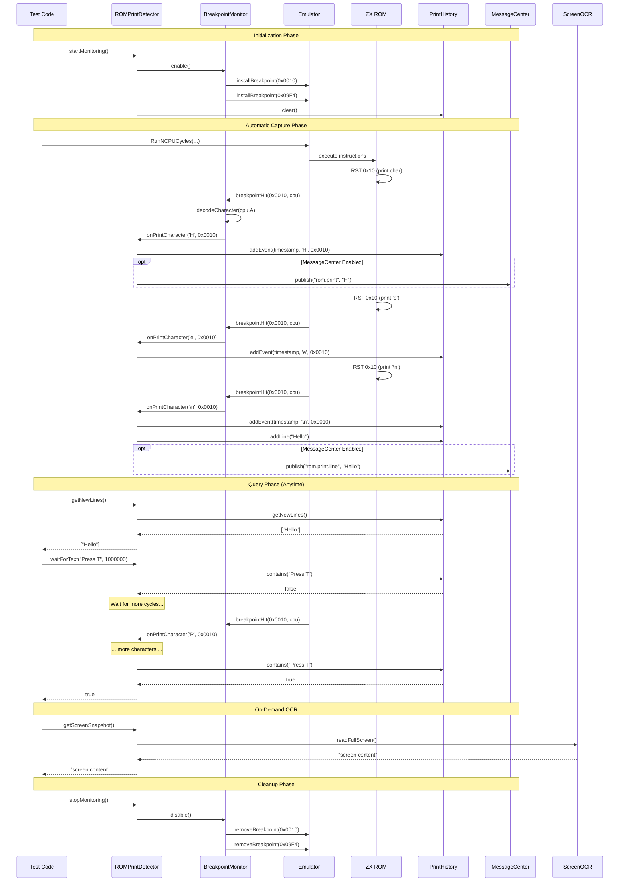

# Screen Output Monitoring Design

## Problem Statement

During TR-DOS FORMAT testing, we cannot see what the ROM is printing to the screen. The emulator runs "blind" - we inject commands and wait for cycles to complete, but have no visibility into:
- What prompts TR-DOS is showing
- What errors are being reported
- What progress indicators are displayed
- Whether the FORMAT command is actually executing

This makes debugging integration tests extremely difficult.

## Objectives

Create a test helper that can:
1. **Monitor screen output** during test execution
2. **Detect specific text patterns** (prompts, errors, progress)
3. **Provide visibility** into ROM execution state
4. **Enable conditional test logic** based on screen content

## Proposed Solution: Dual-Mode Monitoring

**Decision**: Implement BOTH approaches for maximum visibility and reliability.

**Implementation Location**: `core/src/debugger/analyzers/rom-prints/`

This location is appropriate because:
- ROM print monitoring is a debugging/analysis tool
- Fits alongside other analyzers (BasicEncoder, etc.)
- Can be used by both tests and runtime debugging
- Clear separation from emulator core

### File Structure

```
core/src/debugger/analyzers/rom-prints/
├── breakpointmonitor.h
├── breakpointmonitor.cpp
├── screenocr.h
├── screenocr.cpp
├── printhistory.h
├── printhistory.cpp
├── screenmonitor.h
└── screenmonitor.cpp
```

### Architecture Overview

```cpp
class ROMPrintDetector {
    // Dual capture mechanisms
    BreakpointMonitor _breakpointMonitor;  // Real-time character capture
    ScreenOCR _screenOCR;                   // Periodic screen reading
    
    // Unified print history
    PrintHistory _printHistory;
    
    // Monitoring control
    void startMonitoring();
    void stopMonitoring();
    
    // Query methods
    bool waitForText(const std::string& pattern, uint64_t maxCycles);
    std::string getNewOutput();           // Get output since last query
    std::string getFullHistory();         // Get complete print history
    std::vector<std::string> getLines();  // Get all lines printed
};
```

---

## Component 1: Breakpoint-Based Character Capture

### Implementation

```cpp
class BreakpointMonitor {
public:
    void enable(Emulator* emulator);
    void disable();
    
    // Callback when ROM print routine is hit
    void onPrintCharacter(uint8_t charCode);
    
    std::string getBuffer() const { return _buffer; }
    void clearBuffer() { _buffer.clear(); }
    
private:
    std::string _buffer;
    std::vector<uint16_t> _breakpoints = {
        0x0010,  // RST 0x10 - Print character
        0x09F4,  // PRINT-OUT - Main print routine
        0x15F2   // PRINT-A-2 - Actual implementation
    };
    
    // Character decoder
    std::string decodeCharacter(uint8_t code);
    
    // Control code handlers
    void handleNewline();
    void handleTab();
    void handleAt(uint8_t row, uint8_t col);
};
```

### Character Decoding

**ASCII Characters** (0x20-0x7F):
- Direct mapping for printable ASCII
- Handle space (0x20), digits, letters

**ZX Spectrum Tokens** (0xA5-0xFF):
- Keywords: RND, INKEY$, PI, etc.
- Commands: PRINT, INPUT, FOR, etc.
- Functions: SIN, COS, LN, etc.

**Control Codes**:
- `0x0D` - Newline (CR)
- `0x06` - Comma (print separator)
- `0x16` - AT (followed by row, col)
- `0x17` - TAB (followed by column)
- `0x10-0x15` - INK, PAPER, FLASH, BRIGHT, INVERSE, OVER

---

## Component 2: Screen Memory OCR

### Implementation

```cpp
class ScreenOCR {
public:
    void initialize(Memory* memory);
    
    // Read screen content
    std::string readLine(uint8_t lineNumber);
    std::string readFullScreen();
    std::vector<std::string> readAllLines();
    
    // Character recognition
    char recognizeCharacter(const uint8_t* charBitmap);
    
private:
    Memory* _memory;
    
    // ZX Spectrum screen layout
    static constexpr uint16_t SCREEN_START = 0x4000;
    static constexpr uint16_t ATTR_START = 0x5800;
    static constexpr uint8_t SCREEN_WIDTH = 32;   // characters
    static constexpr uint8_t SCREEN_HEIGHT = 24;  // lines
    
    // Font data (from ROM 0x3D00-0x3FFF)
    static const uint8_t FONT_BITMAP[96][8];
    
    // Screen memory addressing
    uint16_t getCharAddress(uint8_t row, uint8_t col);
    void readCharBitmap(uint16_t address, uint8_t* bitmap);
};
```

### Screen Memory Layout

ZX Spectrum screen memory is **non-linear**:
- Screen: 0x4000-0x57FF (6144 bytes)
- Attributes: 0x5800-0x5AFF (768 bytes)

**Character Position Calculation**:
```
For character at (row, col):
  Third = row / 8          (0-2)
  Line = row % 8           (0-7)
  Column = col             (0-31)
  
  Address = 0x4000 + (Third * 0x800) + (Line * 0x20) + Column
```

---

## Component 3: Print History Tracking

### Implementation

```cpp
struct PrintEvent {
    uint64_t timestamp;      // CPU cycle count
    std::string text;        // Text printed
    uint16_t address;        // ROM address that printed it
    PrintSource source;      // BREAKPOINT or OCR
};

enum class PrintSource {
    BREAKPOINT,  // Captured via ROM breakpoint
    OCR,         // Read from screen memory
    MERGED       // Combination of both
};

class PrintHistory {
public:
    void addEvent(const PrintEvent& event);
    void addLine(const std::string& line, uint64_t timestamp);
    
    // Query methods
    std::string getNewOutput();              // Since last query
    std::string getFullHistory();            // Everything
    std::vector<std::string> getLines();     // All lines
    std::vector<std::string> getNewLines();  // New lines since last query
    
    // Pattern matching
    bool contains(const std::string& pattern);
    bool waitFor(const std::string& pattern, uint64_t maxCycles);
    
    // History management
    void clear();
    void markRead();  // Mark current position as "read"
    
private:
    std::vector<PrintEvent> _events;
    std::vector<std::string> _lines;
    size_t _lastReadPosition = 0;
    
    // Deduplication
    std::string _lastBreakpointOutput;
    std::string _lastOCROutput;
    
    void deduplicateAndMerge();
};
```

### Deduplication Strategy

Since we're capturing from BOTH sources, we need to avoid duplicates:

1. **Breakpoint captures** are real-time and authoritative
2. **OCR captures** are periodic snapshots
3. **Merge strategy**:
   - Use breakpoint output as primary
   - Use OCR to fill gaps (e.g., direct screen writes)
   - Detect and remove duplicates by comparing text

---

## Unified ROMPrintDetector API

### Event-Driven Architecture (No Polling!)

The ROMPrintDetector uses **automatic capture** via breakpoints - no manual polling required!

```cpp
class ROMPrintDetector {
public:
    ROMPrintDetector(Emulator* emulator);
    
    // Lifecycle
    void startMonitoring();   // Installs breakpoints, starts auto-capture
    void stopMonitoring();    // Removes breakpoints
    bool isMonitoring() const;
    
    // Query methods - get accumulated history
    std::string getNewOutput();           // New text since last call
    std::string getFullHistory();         // Complete history
    std::vector<std::string> getLines();  // All lines
    std::vector<std::string> getNewLines(); // New lines since last mark
    
    // Pattern matching
    bool contains(const std::string& pattern);
    bool waitForText(const std::string& pattern, uint64_t maxCycles);
    bool waitForLine(const std::string& pattern, uint64_t maxCycles);
    
    // Screen snapshot (OCR-based, on-demand)
    std::string getScreenSnapshot();
    std::vector<std::string> getScreenLines();
    
    // Coordinate-based screen reading (OCR)
    std::string getLineText(uint8_t lineNumber);     // Read line 0-23
    std::string getColumn(uint8_t columnNumber);     // Read column 0-31 (vertical)
    char getCharAt(uint8_t x, uint8_t y);            // Read char at (x,y) where x=0-31, y=0-23
    std::string getRegion(uint8_t x, uint8_t y, 
                          uint8_t width, uint8_t height); // Read rectangular region
    
    
    // History management
    void clear();                         // Drop all collected history
    void markRead();                      // Mark current position as "read"
    void dumpHistory(std::ostream& out);  // For debugging
    
    // MessageCenter integration
    void enableMessageBroadcast();        // Enable broadcasting to fixed topic
    void disableMessageBroadcast();
    std::string getInstanceUUID() const;  // Get unique instance identifier
    
private:
    Emulator* _emulator;
    BreakpointMonitor _breakpointMonitor;  // Auto-captures on ROM print calls
    ScreenOCR _screenOCR;                   // On-demand screen reading
    PrintHistory _history;
    
    // MessageCenter integration
    std::string _instanceUUID;             // Unique instance ID
    bool _broadcastEnabled = false;
    
    // Breakpoint callback - called automatically by emulator
    void onPrintCharacter(uint8_t charCode, uint16_t address);
};
```

### How It Works: Sequence Diagram



### Key Features

**1. Automatic Capture**
- Breakpoints installed at ROM print routines
- Characters captured automatically as ROM prints them
- No polling loop needed!

**2. Historical Perspective**
- All printed text is accumulated in `PrintHistory`
- Query anytime: `getNewLines()`, `getFullHistory()`
- Mark read position: `markRead()` to track "new" vs "old" output

**3. MessageCenter Integration**
- Fixed topic defined in `messages.h`: `MSG_ROM_PRINT_OUTPUT`
- Messages include instance UUID for multi-detector scenarios
- Format: `{uuid: "...", text: "printed text"}`
```cpp
// Enable broadcasting
detector.enableMessageBroadcast();

// Messages sent to MSG_ROM_PRINT_OUTPUT topic:
// - Individual characters as they're printed
// - Complete lines when newline detected
// - Each message includes detector's UUID
```

**4. On-Demand OCR**
- Call `getScreenSnapshot()` anytime to read current screen
- Useful for verification or when breakpoints miss direct screen writes

**5. Clear History**
```cpp
detector.clear();  // Drop all accumulated history
```

**6. Coordinate-Based Screen Reading**
```cpp
// Read specific line (0-23)
std::string line5 = detector.getLineText(5);

// Read specific character at position
char ch = detector.getCharAt(10, 5);  // Column 10, Row 5

// Read vertical column (useful for menus)
std::string col0 = detector.getColumn(0);  // Leftmost column

// Read rectangular region
std::string region = detector.getRegion(5, 10, 20, 3);  // x=5, y=10, width=20, height=3
```

### Usage Examples

**Example 1: Wait for TR-DOS Prompt**
```cpp
detector.startMonitoring();
emulator->RunNCPUCycles(1'000'000, true);

// Wait for prompt to appear in history
if (detector.waitForText("Press T for TURBO", 5'000'000)) {
    std::cout << "Prompt detected!" << std::endl;
}
```

**Example 2: Read Specific Screen Position**
```cpp
// Check what's at the top-left corner
char firstChar = detector.getCharAt(0, 0);

// Read the entire first line
std::string topLine = detector.getLineText(0);

// Read status area (e.g., last 3 lines)
for (uint8_t y = 21; y < 24; ++y) {
    std::string line = detector.getLineText(y);
    std::cout << "Line " << (int)y << ": " << line << std::endl;
}
```

**Example 3: MessageCenter Integration**
```cpp
// Enable broadcasting to MSG_ROM_PRINT_OUTPUT
detector.enableMessageBroadcast();

// Get instance UUID for filtering
std::string uuid = detector.getInstanceUUID();

// Other components can subscribe to MSG_ROM_PRINT_OUTPUT
messageCenter.subscribe(MSG_ROM_PRINT_OUTPUT, [uuid](const Message& msg) {
    // Filter by UUID if needed
    if (msg.data["uuid"] == uuid) {
        std::cout << "[ROM Print] " << msg.data["text"] << std::endl;
    }
});
```

---

## Integration with TRDOSTestHelper

```cpp
class TRDOSTestHelper {
    ROMPrintDetector _screenMonitor;
    
public:
    // Start monitoring before executing command
    void startROMPrintDetectoring() {
        _screenMonitor.startMonitoring();
    }
    
    // Execute command with output monitoring
    uint64_t executeWithMonitoring(const std::string& command, 
                                    uint64_t maxCycles) {
        _screenMonitor.startMonitoring();
        uint64_t cycles = executeBasicCommand(command, maxCycles);
        return cycles;
    }
    
    // Wait for specific output
    bool waitForPrompt(const std::string& text, uint64_t maxCycles) {
        return _screenMonitor.waitForText(text, maxCycles);
    }
    
    // Get output
    std::string getScreenOutput() {
        return _screenMonitor.getNewOutput();
    }
    
    std::vector<std::string> getScreenLines() {
        return _screenMonitor.getNewLines();
    }
    
    // Dump for debugging
    void dumpScreenHistory(std::ostream& out) {
        _screenMonitor.dumpHistory(out);
    }
};
```

---

## Usage Example: FORMAT Test

```cpp
TEST_F(WD1793_Integration_Test, TRDOS_FORMAT_WithMonitoring) {
    TRDOSTestHelper helper(_emulator);
    
    // Start monitoring
    helper.startROMPrintDetectoring();
    
    // Execute FORMAT command
    helper.executeWithMonitoring("FORMAT \"TEST\"", 1'750'000);
    
    // Check what was printed
    std::string output = helper.getScreenOutput();
    std::cout << "[SCREEN OUTPUT]\n" << output << std::endl;
    
    // Wait for the prompt
    ASSERT_TRUE(helper.waitForPrompt("Press T for TURBO", 1'000'000))
        << "Expected TR-DOS FORMAT prompt not found";
    
    // Inject key response
    keyboard->PressKey(ZXKEY_SPACE);
    _emulator->RunNCPUCycles(210'000, true);
    keyboard->ReleaseKey(ZXKEY_SPACE);
    
    // Wait for FORMAT to start
    ASSERT_TRUE(helper.waitForPrompt("Track", 5'000'000))
        << "FORMAT did not start - no track progress shown";
    
    // Continue with FORMAT execution...
    
    // At the end, dump full history for debugging
    helper.dumpScreenHistory(std::cout);
}
```

---

## Implementation Phases

### Phase 1: Breakpoint Monitor
- [ ] Create `BreakpointMonitor` class
- [ ] Implement ROM breakpoint callbacks
- [ ] Add character decoding (ASCII, tokens, control codes)
- [ ] Test with simple BASIC: `PRINT "HELLO"`

### Phase 2: Screen OCR
- [ ] Create `ScreenOCR` class
- [ ] Implement screen memory reading
- [ ] Add character recognition using font data
- [ ] Handle screen memory layout
- [ ] Test reading static screen content

### Phase 3: Print History
- [ ] Create `PrintHistory` class
- [ ] Implement event logging
- [ ] Add deduplication logic
- [ ] Implement pattern matching
- [ ] Test history tracking

### Phase 4: Unified Monitor
- [ ] Create `ROMPrintDetector` class
- [ ] Integrate breakpoint and OCR
- [ ] Implement periodic OCR updates
- [ ] Add query methods
- [ ] Test dual-mode capture

### Phase 5: Integration
- [ ] Add to `TRDOSTestHelper`
- [ ] Update FORMAT integration test
- [ ] Add comprehensive logging
- [ ] Document usage

---

## Testing Strategy

### Unit Tests
1. **Character Decoding**: Test all character codes (ASCII, tokens, control)
2. **Screen OCR**: Test character recognition with known patterns
3. **Print History**: Test event logging, deduplication, pattern matching
4. **Integration**: Test breakpoint + OCR working together

### Integration Tests
1. Simple BASIC program with known output
2. TR-DOS `CAT` command
3. TR-DOS `FORMAT` command with full monitoring
4. Error message capture

### Verification
- Compare breakpoint output vs OCR output
- Verify no duplicates in history
- Confirm all output is captured
- Test pattern matching accuracy

**Approach**: Set execution breakpoints at key ROM printing routines and capture the character being printed.

**Key ROM Addresses** (from 48K ROM disassembly):
- `0x09F4` - `PRINT-OUT`: Main character printing routine
- `0x0010` - `RST 0x10`: Print character restart (calls PRINT-OUT)
- `0x15F2` - `PRINT-A-2`: Actual print implementation

**Implementation**:
```cpp
class ScreenOutputMonitor {
    std::string _screenBuffer;
    std::vector<uint16_t> _breakpoints = {0x09F4, 0x0010};
    
    void onBreakpoint(uint16_t address, Z80* cpu) {
        if (address == 0x09F4 || address == 0x0010) {
            uint8_t charCode = cpu->a;  // Character in A register
            _screenBuffer += decodeCharacter(charCode);
        }
    }
    
    bool waitForText(const std::string& pattern, uint64_t maxCycles);
    std::string getScreenOutput();
};
```

**Advantages**:
- ✅ Minimal overhead - only triggers on print calls
- ✅ Captures ALL output (BASIC, TR-DOS, error messages)
- ✅ Works with both 48K ROM and TR-DOS ROM (TR-DOS uses RST calls to 48K ROM)
- ✅ No need to parse screen memory
- ✅ Can detect output in real-time

**Disadvantages**:
- ❌ Requires breakpoint infrastructure
- ❌ May miss direct screen memory writes (rare in ROM code)

---

### Option 2: Screen Memory OCR

**Approach**: Periodically read the screen memory (0x4000-0x57FF) and perform character recognition using the ZX Spectrum font.

**Implementation**:
```cpp
class ScreenOCR {
    static constexpr uint16_t SCREEN_START = 0x4000;
    static constexpr uint16_t ATTR_START = 0x5800;
    
    std::string readScreenLine(Memory* memory, uint8_t line);
    std::string readFullScreen(Memory* memory);
    bool findText(const std::string& pattern);
    
private:
    uint8_t recognizeChar(const uint8_t* charBitmap);
    static const uint8_t FONT_DATA[96][8];  // ZX Spectrum font
};
```

**Character Recognition**:
- ZX Spectrum uses 8x8 pixel characters
- Font is stored in ROM at 0x3D00-0x3FFF
- Screen layout: 32 columns × 24 rows
- Each character position: 8 bytes of pixel data

**Advantages**:
- ✅ No breakpoints needed
- ✅ Captures everything on screen (including direct memory writes)
- ✅ Can read screen state at any time
- ✅ Simple polling-based approach

**Disadvantages**:
- ❌ Higher overhead (must scan screen periodically)
- ❌ Requires font matching logic
- ❌ May miss transient messages
- ❌ Complex screen memory layout (not linear)

---

### Option 3: Hybrid Approach (Best of Both)

Combine both methods:
1. **Use breakpoints** for real-time output capture during execution
2. **Use OCR** for verification and final state checking

```cpp
class ROMPrintDetector {
    ScreenOutputMonitor _outputMonitor;  // Breakpoint-based
    ScreenOCR _ocr;                       // Memory-based
    
    // Real-time monitoring during execution
    void startMonitoring();
    bool waitForPrompt(const std::string& text, uint64_t maxCycles);
    
    // Post-execution verification
    std::string getScreenSnapshot();
    bool verifyScreenContains(const std::string& text);
};
```

---

## Recommended Implementation Plan

### Phase 1: Breakpoint-Based Output Capture

1. **Create `ScreenOutputMonitor` class**
   - Set breakpoints at `0x0010` (RST 0x10) and `0x09F4` (PRINT-OUT)
   - Capture character from A register on each breakpoint hit
   - Build output buffer with decoded characters
   - Handle control codes (newline, cursor positioning, etc.)

2. **Character Decoding**
   - Map character codes to ASCII/UTF-8
   - Handle ZX Spectrum tokens (keywords like PRINT, FOR, etc.)
   - Handle control codes (0x0D = newline, 0x16 = AT, 0x17 = TAB)

3. **Pattern Matching**
   - `waitForText(pattern, maxCycles)` - wait until pattern appears
   - `getLastLine()` - get most recent line of output
   - `getFullOutput()` - get complete output buffer
   - `clearOutput()` - reset buffer

### Phase 2: Integration with TRDOSTestHelper

Add screen monitoring to test helper:
```cpp
class TRDOSTestHelper {
    ScreenOutputMonitor _screenMonitor;
    
    // Wait for TR-DOS prompt
    bool waitForPrompt(const std::string& prompt, uint64_t maxCycles);
    
    // Execute command and wait for specific output
    uint64_t executeAndWaitFor(const std::string& command, 
                                const std::string& expectedOutput,
                                uint64_t maxCycles);
    
    // Get what TR-DOS printed
    std::string getScreenOutput();
};
```

### Phase 3: FORMAT Test Enhancement

Update FORMAT test to use screen monitoring:
```cpp
TEST_F(WD1793_Integration_Test, TRDOS_FORMAT_WithMonitoring) {
    // Start FORMAT command
    helper.executeBasicCommand("FORMAT \"TEST\"", 1'750'000);
    
    // Wait for prompt: "Press T for TURBO-FORMAT\nOther key for FORMAT"
    ASSERT_TRUE(helper.waitForPrompt("Press T for TURBO", 1'000'000));
    
    // Inject SPACE key
    keyboard->PressKey(ZXKEY_SPACE);
    _emulator->RunNCPUCycles(210'000, true);  // 60ms
    keyboard->ReleaseKey(ZXKEY_SPACE);
    
    // Wait for FORMAT to start - look for track progress
    ASSERT_TRUE(helper.waitForPrompt("Track", 5'000'000));
    
    // Continue execution with track monitoring
    // ...
}
```

---

## Alternative: TR-DOS Specific Hooks

TR-DOS has specific routines we could hook:

**TR-DOS ROM Addresses** (if available):
- Message printing routines
- Error reporting routines  
- Progress display routines

This would require TR-DOS ROM disassembly analysis.

---

## Verification Plan

### Unit Tests
1. Test character decoding (tokens, control codes, ASCII)
2. Test pattern matching (exact match, regex, contains)
3. Test breakpoint callback mechanism

### Integration Tests
1. Test with simple BASIC program: `PRINT "HELLO"`
2. Test with TR-DOS command: `CAT`
3. Test with FORMAT command (full flow)

### Manual Verification
1. Run FORMAT test with monitoring enabled
2. Verify console shows captured screen output
3. Confirm prompts are detected correctly

---

## Implementation Checklist

- [ ] Create `ScreenOutputMonitor` class
- [ ] Implement breakpoint callbacks for ROM print routines
- [ ] Add character decoding (ASCII + tokens + control codes)
- [ ] Implement pattern matching methods
- [ ] Integrate with `TRDOSTestHelper`
- [ ] Add unit tests for character decoding
- [ ] Update FORMAT integration test
- [ ] Document usage in test helpers
- [ ] Add screen output to test logs

---

## Future Enhancements

1. **Full Screen OCR** - for verification and screenshots
2. **Attribute Capture** - capture colors, BRIGHT, FLASH
3. **Screen Diff** - compare screen states
4. **Visual Regression** - save screen snapshots for comparison
5. **TR-DOS Specific Hooks** - direct TR-DOS message interception
