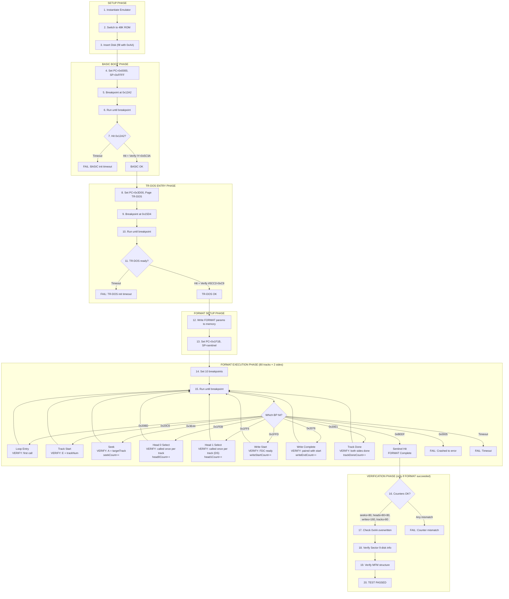

# TR-DOS FORMAT Integration Test Design

## Overview

This document describes the step-by-step breakpoint-controlled approach to test the TR-DOS FORMAT routine using the real guest firmware. The test will execute the FORMAT operation authentically through the emulator, using breakpoints to precisely control and verify each phase.

## Core Principle: Breakpoint-Controlled Execution

Instead of running large cycle batches and polling PC, we use a systematic approach:

1. **Set breakpoint** at target address
2. **Unpause emulator** (run until breakpoint or timeout)
3. **On breakpoint hit**: verify state, proceed to next step
4. **On timeout**: fail the test with diagnostic info

This gives precise control and immediate detection of unexpected execution paths.

## Core Principle: Breakpoint-Controlled Execution

Instead of running large cycle batches and polling PC, we use a systematic approach:

1. **Set breakpoint** at target address
2. **Unpause emulator** (run until breakpoint or timeout)
3. **On breakpoint hit**: verify state, proceed to next step
4. **On timeout**: fail the test with diagnostic info

This gives precise control and immediate detection of unexpected execution paths.

## Important considerations

- Emulator instance must be instantiated via EmulatorManager::CreateEmulator() with PENTAGON model configuration.
- Do not use CPU cycle running methods! Only emulator->Pause() and emulator->Resume(). Breakpoint must be hit to proceed to next step.
- Use real clock timeouts for each step. No more than 2 seconds per step, otherwise fail the test.

---

## Step-by-Step Implementation Flow

### Setup Phase

```
STEP 1: Instantiate emulator
  → Create Emulator instance with test configuration
  → Get references: _emulator, _z80, _memory, _context

STEP 2: Switch to 48K (SOS-DOS) ROM
  → Ensure BASIC 48K ROM is paged at 0x0000-0x3FFF
  → Verify: memory[0x0000] contains expected ROM signature

STEP 3: Insert empty disk image with detection pattern
  → Create blank 80-track, double-sided disk image
  → Fill ALL track buffers with 0xAA pattern (untypical, easy to detect)
  → Insert into drive A:
  → Verify: FDC sees disk ready (no "no disk" status)
  → NOTE: After FORMAT, any track still containing 0xAA was NOT written
```

### BASIC Boot Phase

```
STEP 4: Initialize CPU state
  → PAUSE emulator
  → Set PC = 0x0000 (ROM entry point)
  → Set SP = 0xFFFF (top of memory, standard Z80 reset)
  → Set IY = 0x5C3A (will be set by ROM, but init for safety)
  → Clear breakpoints

STEP 5: Set breakpoint at BASIC main loop
  → AddBreakpoint(EXEC, 0x12A2)  // MAIN-EXEC
  → This is where BASIC init is complete

STEP 6: Run until BASIC initialized
  → UNPAUSE emulator
  → Run with TIMEOUT = 3,500,000 cycles (~1 second)
  → WAIT for breakpoint hit or timeout

STEP 7: Verify BASIC init success
  → IF timeout: FAIL("BASIC init timeout, PC=0x{PC}")
  → ASSERT PC == 0x12A2
  → ASSERT IY == 0x5C3A
  → ASSERT memory[0x5C3A] is valid (ERR_NR = 0xFF = no error)
  → LOG("BASIC initialized successfully")
```

### TR-DOS Entry Phase

```
STEP 8: Prepare TR-DOS entry
  → PAUSE emulator
  → Push return address onto stack: SP -= 2; [SP] = current PC
  → Set PC = 0x3D00 (USR 15616 trap address)
  → Page in TR-DOS ROM: SetROMDOS(true)
  → Clear breakpoints

STEP 9: Set breakpoint at TR-DOS init completion
  → AddBreakpoint(EXEC, 0x15D4)  // TR-DOS command input ready
  → Alternative: breakpoint at 0x2F90+return (after init routine)

STEP 10: Run until TR-DOS ready
  → UNPAUSE emulator  
  → Run with TIMEOUT = 2,000,000 cycles
  → WAIT for breakpoint hit or timeout

STEP 11: Verify TR-DOS init success
  → IF timeout: FAIL("TR-DOS init timeout, PC=0x{PC}")
  → ASSERT memory[0x0800] == 0xE6 (TR-DOS signature)
  → ASSERT memory[0x5CC2] == 0xC9 (RET instruction)
  → ASSERT memory[0x5D16] == 0xFF (system register)
  → LOG("TR-DOS initialized, #5CC2=0xC9 OK")
```

### FORMAT Setup Phase

```
STEP 12: Configure FORMAT parameters
  → PAUSE emulator
  → Write disk name to memory:
      memory[0x5D25..0x5D34] = "TEST" + spaces (16 bytes)
  → Set track count:
      memory[0x5CD7] = 0x50 (80 tracks)
  → Set side flag:
      memory[0x5CDA] = 0x80 (double-sided)
  → Set sector table pointer:
      Setup interleave pattern at buffer area

STEP 13: Set FORMAT entry point
  → Set SP = 0xFEFE (safe stack area)
  → Push sentinel return address: [SP] = 0xBEEF
  → Set PC = 0x1F1B (FORMAT_FULL, skips keyboard prompt)
  → Clear breakpoints
```

### FORMAT Execution Phase

The FORMAT loop requires granular breakpoint monitoring at each key operation:

**FORMAT Routine Breakpoint Map** (from TR-DOS disassembly):

| Address | Name | Description | Expected Hits |
|---------|------|-------------|---------------|
| `0x20BD` | Format Disk Loop Entry | Start of format disk routine | 1 |
| `0x20C6` | Track Iteration Start | Inner loop, increments track | 80 |
| `0x3E44` | Seek/Move Head | Position head to track | 80 |
| `0x1FEB` | Select Head 0 (Upper) | Switch to side 0 | 80 |
| `0x1FF6` | Select Head 1 (Lower) | Switch to side 1 (if double-sided) | 80 |
| `0x1FFD` | Write Track Start | Begin writing track to disk | 160 |
| `0x2076` | Write Track Complete | After last byte written, before verify | 160 |
| `0x20E1` | Track Done | End of single track, DJNZ loop | 80 |
| `0x0005` | Error Handler | BASIC error (crash indicator) | 0 |
| `0xBEEF` | Sentinel | Completion marker | 1 |

```
STEP 14: Set FORMAT monitoring breakpoints  
  → AddBreakpoint(EXEC, 0x20BD)  // Format Disk Loop Entry
  → AddBreakpoint(EXEC, 0x20C6)  // Track Iteration Start  
  → AddBreakpoint(EXEC, 0x3E44)  // Seek (move head to track)
  → AddBreakpoint(EXEC, 0x1FEB)  // Select Head 0 (upper side)
  → AddBreakpoint(EXEC, 0x1FF6)  // Select Head 1 (lower side)
  → AddBreakpoint(EXEC, 0x1FFD)  // Write Track Start
  → AddBreakpoint(EXEC, 0x2076)  // Write Track Complete
  → AddBreakpoint(EXEC, 0x20E1)  // Track Done (loop end)
  → AddBreakpoint(EXEC, 0xBEEF)  // Sentinel (completion)
  → AddBreakpoint(EXEC, 0x0005)  // Error handler (crash)
  
  → Initialize counters:
      seekCount = 0
      head0Count = 0
      head1Count = 0
      writeStartCount = 0
      writeEndCount = 0
      trackDoneCount = 0

STEP 15: Run FORMAT with granular monitoring
  → UNPAUSE emulator
  → LOOP:
      Run with TIMEOUT = 2,000,000 cycles (per step)
      
      SWITCH (hit address):
      
        CASE 0x20BD (Format Disk Loop Entry):
          → LOG("FORMAT DISK LOOP STARTED")
          → currentTrack = 0
          → CONTINUE
        
        CASE 0x20C6 (Track Iteration Start):
          → currentTrack = register E
          → LOG("=== TRACK {currentTrack} START ===")
          → CONTINUE
        
        CASE 0x3E44 (Seek):
          → seekCount++
          → targetTrack = register A
          → LOG("  SEEK to track {targetTrack}")
          → ASSERT targetTrack == currentTrack
          → CONTINUE
        
        CASE 0x1FEB (Select Head 0):
          → head0Count++
          → currentHead = 0
          → LOG("  HEAD SELECT: Side 0 (upper)")
          → CONTINUE
        
        CASE 0x1FF6 (Select Head 1):
          → head1Count++
          → currentHead = 1
          → LOG("  HEAD SELECT: Side 1 (lower)")
          → CONTINUE
        
        CASE 0x1FFD (Write Track Start):
          → writeStartCount++
          → LOG("  WRITE TRACK START (track {currentTrack}, side {currentHead})")
          → CONTINUE
        
        CASE 0x2076 (Write Track Complete):
          → writeEndCount++
          → LOG("  WRITE TRACK COMPLETE (track {currentTrack}, side {currentHead})")
          → ASSERT writeEndCount == writeStartCount (paired)
          → CONTINUE
        
        CASE 0x20E1 (Track Done):
          → trackDoneCount++
          → LOG("=== TRACK {currentTrack} DONE ===")
          → CONTINUE
        
        CASE 0xBEEF (Sentinel):
          → LOG("FORMAT COMPLETE")
          → BREAK loop
        
        CASE 0x0005 (Error):
          → FAIL("Crashed at track {currentTrack}, side {currentHead}")
        
        CASE timeout:
          → FAIL("Timeout at track {currentTrack}, side {currentHead}")

STEP 16: Verify FORMAT execution counters
  → LOG("FORMAT Statistics:")
  → LOG("  Seeks: {seekCount} (expected 80)")
  → LOG("  Head 0 selects: {head0Count} (expected 80)")
  → LOG("  Head 1 selects: {head1Count} (expected 80 for DS)")
  → LOG("  Write starts: {writeStartCount} (expected 160)")
  → LOG("  Write ends: {writeEndCount} (expected 160)")
  → LOG("  Tracks done: {trackDoneCount} (expected 80)")
  
  → ASSERT seekCount == 80
  → ASSERT head0Count == 80
  → ASSERT head1Count == 80 (for double-sided)
  → ASSERT writeStartCount == 160
  → ASSERT writeEndCount == 160
  → ASSERT trackDoneCount == 80
  → ASSERT memory[0x5C3A] == 0xFF (no TR-DOS error)
  
  → IF all assertions pass: PROCEED to Verification Phase
  → IF any assertion fails: FAIL and SKIP verification
```

### Verification Phase (Only if FORMAT Completed Successfully)

> [!IMPORTANT]
> These checks only run if STEP 16 passed all assertions.
> If FORMAT failed at any step, skip directly to cleanup.

```
STEP 17: Verify disk pattern was overwritten
  → For each track 0-79, side 0-1:
      Read first 100 bytes of raw MFM data
      ASSERT data != 0xAA repeated (original fill pattern)
      → This confirms the track was actually written

STEP 18: Verify disk info sector structure
  → Read Sector 9 (disk info) from Track 0
  → ASSERT sector9[0xE1] == 0x10 (first free sector = 16)
  → ASSERT sector9[0xE2] == 0x01 (first free track = 1)
  → ASSERT sector9[0xE3] == 0x16 (disk type = 80T DS)
  → ASSERT sector9[0xE4] == 0x00 (file count = 0)

STEP 19: Verify MFM structure
  → Get raw MFM data from Track 0, Side 0
  → Parse with MFMParser
  → ASSERT 16 valid sectors found
  → ASSERT all sectors have valid CRCs
  → ASSERT sector interleave matches TR-DOS pattern: 1,9,2,10,3,11,4,12,5,13,6,14,7,15,8,16

STEP 20: Test complete
  → LOG("FORMAT integration test PASSED")
  → Cleanup: remove disk image, destroy emulator
```

---

## Flow Diagram




## Address Reference Map

### BASIC ROM (0x0000-0x3FFF)

| Address | Name | Description |
|---------|------|-------------|
| `0x0000` | START | ROM entry point on power-on |
| `0x0005` | ERROR-1 | Error handler entry (crash indicator) |
| `0x0020` | RST #20 | NEXT-CHAR/call dispatcher |
| `0x11CB` | START/NEW | Main initialization entry |
| `0x12A2` | MAIN-EXEC | Main editor loop (BASIC fully initialized) |

### TR-DOS ROM (0x0000-0x3FFF when paged)

| Address | Name | Description |
|---------|------|-------------|
| `0x0020` | RST #20 dispatch | Jumps to x2F72 for BASIC ROM calls |
| `0x0800` | Fast seek | Seek with fast step rate |
| `0x1580-0x15FF` | Command input | TR-DOS command line area |
| `0x1EC2` | FORMAT entry | FORMAT command entry (with keyboard prompt) |
| `0x1F1B` | FORMAT_FULL | FORMAT entry AFTER keyboard prompt |
| `0x1FFD` | Format Track | Single track format routine |
| `0x2001` | Write Track OUT | FDC OUT command for Write Track |
| `0x20BD` | Format Disk Loop | Main format loop (iterates tracks) |
| `0x2F72` | RST #20 handler | Dispatches BASIC ROM calls |
| `0x2F90` | TR-DOS Init | Initializes system variables, sets #5CC2=C9 |
| `0x3D00` | Trap Entry | BetaDisk trap address (USR 15616) |
| `0x3D9A` | FDC Wait | Wait for FDC with BREAK check (uses RST #20) |

### Critical System Variables

| Address | Name | Expected Value | Description |
|---------|------|----------------|-------------|
| `0x5CC2` | RET stub | `0xC9` | RET instruction for RST #20 dispatcher |
| `0x5CD7` | TRACK_COUNT | `0x50` (80) | Number of tracks to format |
| `0x5CD8` | CURRENT_TRACK | Variable | Current track during format |
| `0x5CDA` | SIDE_FLAG | `0x80` | Format both sides flag |
| `0x5CE6` | SECTORS_TABLE | Ptr to sector pattern | Sector interleave table |
| `0x5D16` | SYSTEM_REG | `0xFF` | System register copy |

---

## Test Execution Phases

### Phase 1: BASIC Initialization

**Goal**: Boot BASIC ROM and reach main editor loop at `0x12A2`.

```
START STATE:
  PC = 0x0000 (ROM entry)
  ROM = BASIC (48K ROM paged at 0x0000-0x3FFF)

BREAKPOINT: 0x12A2 (MAIN-EXEC)
TIMEOUT: 3,500,000 cycles (~1 second at 3.5MHz)

EXPECTED STATE ON HIT:
  PC = 0x12A2
  SP = valid stack pointer
  IY = 0x5C3A (system variables base)
  BASIC system variables initialized

FAILURE INDICATORS:
  - PC = 0x0005 (ERROR-1 handler)
  - Timeout without reaching 0x12A2
```

---

### Phase 2: TR-DOS Entry via Trap

**Goal**: Enter TR-DOS using USR 15616 mechanism with proper initialization.

```
START STATE:
  PC = 0x12A2 (BASIC main loop)
  ROM = BASIC

ACTIONS:
  1. Push current PC onto stack (return address)
  2. Set PC = 0x3D00 (USR 15616 trap)
  3. Page in TR-DOS ROM via SetROMDOS(true)
     - This simulates the hardware trap behavior

BREAKPOINT: 0x2F90 (TR-DOS Init) or 0x1580-0x15FF range
TIMEOUT: 1,000,000 cycles

EXPECTED STATE ON HIT:
  PC in TR-DOS ROM (0x0000-0x3FFF with TR-DOS signature)
  ROM@0x0800 = 0xE6 (TR-DOS signature)

VERIFICATION:
  #5CC2 = 0xC9 (RET instruction set by TR-DOS init)
  #5D16 = 0xFF (system register)
```

---

### Phase 3: Set Up FORMAT Parameters

**Goal**: Configure TR-DOS system variables for FORMAT operation.

```
DIRECT MEMORY WRITES (no emulator cycles needed):

  #5CD7 = 0x50    ; Format 80 tracks
  #5CDA = 0x80    ; Format both sides (double-sided)
  #5CE6 = ptr     ; Sector interleave table (16 sectors: 1,9,2,10,3,11...)
  #5CE8 = ptr     ; Alternate sector table
  #5D20 = 0x00    ; Track 0 start
  
  ; Disk name at #5D25 (16 bytes, space-padded)
  #5D25 = "TEST            "

VERIFICATION:
  All variables written correctly
```

---

### Phase 4: Execute FORMAT Loop

**Goal**: Run FORMAT routine and format all 160 tracks (80 tracks × 2 sides).

```
START STATE:
  PC = 0x1F1B (FORMAT_FULL - post-keyboard-prompt entry)
  Stack set up with sentinel return address
  TR-DOS ROM paged in
  System variables configured

BREAKPOINT OPTIONS (for progress monitoring):
  - 0x1FFD: Format Track routine (hit once per track)
  - 0x20BD: Format Disk Loop (main loop entry)
  - 0x3D9A: FDC Wait (frequently hit during I/O)

MONITORING APPROACH:
  Set breakpoint at 0x1FFD (Format Track)
  Each hit = one track formatted
  Expected: 160 hits (80 tracks × 2 sides)

TIMEOUT: 50,000,000 cycles per track (generous for FDC timing)

PROGRESS TRACKING:
  uint8_t currentTrack = memory[0x5CD8];
  Print on each breakpoint: "Formatting track {currentTrack}"

COMPLETION DETECTION:
  - FORMAT_FULL (0x1F1B) executes and returns
  - PC reaches sentinel address
  - OR hit count reaches 160

ERROR DETECTION:
  memory[0x5C3A] != 0xFF (TR-DOS error code)
  PC = 0x0005 (crash to BASIC error handler)
```

---

### Phase 5: Verify Formatted Disk

**Goal**: Validate the disk was correctly formatted.

```
CHECKS:

1. Sector 9 (Disk Info Sector) on Track 0:
   - Offset 0xE1: First free sector (should be 0x10 = 16)
   - Offset 0xE2: First free track (should be 0x01)
   - Offset 0xE3: Disk type (0x16 for 80 track double-sided)
   - Offset 0xE4: Total files = 0
   - Offset 0xE5-0xE6: Free sectors = 2544

2. MFM Track Structure:
   - Track 0 contains 16 sectors
   - Each sector has proper ID Address Mark (A1 A1 A1 FE)
   - Each sector has proper Data Address Mark (A1 A1 A1 FB)
   - CRCs are valid

3. Track 0, Side 0 raw check:
   - Contains non-zero MFM data
   - GAP bytes present
   - Sector interleave matches TR-DOS pattern
```

---

## Implementation Structure

```cpp
class TRDOSFormatTest {
    
    // Run emulator until breakpoint or timeout
    // Returns: cycles executed, or -1 on timeout
    int64_t runUntilBreakpoint(uint16_t address, uint64_t maxCycles);
    
    // Run until PC matches any address in list
    int64_t runUntilAnyBreakpoint(std::vector<uint16_t> addresses, uint64_t maxCycles);
    
    // Verify memory byte equals expected value
    bool assertMemory(uint16_t address, uint8_t expected, const char* description);
    
    // Verify PC is at expected address
    bool assertPC(uint16_t expected, const char* description);
    
    // Phase execution methods
    bool phase1_BasicInit();
    bool phase2_TRDOSEntry();
    bool phase3_SetupFormatParams(const std::string& diskName, uint8_t tracks, bool doubleSided);
    bool phase4_ExecuteFormat();
    bool phase5_VerifyDisk();
};
```

---

## Expected Timeline

| Phase | Max Cycles | ~Real Time | Description |
|-------|------------|------------|-------------|
| 1 | 3,500,000 | ~1 sec | BASIC boot to 0x12A2 |
| 2 | 1,000,000 | ~0.3 sec | TR-DOS entry and init |
| 3 | 0 | instant | Direct memory writes |
| 4 | 800,000,000 | ~4 min | Format 160 tracks |
| 5 | 0 | instant | Verification |

**Total**: ~5 minutes max for full 80-track double-sided format

---

## Failure Scenarios and Diagnostics

### Crash to 0x0005

**Cause**: RST #20 called with BASIC ROM not properly initialized
**Diagnosis**: 
- Check IY register (should be 0x5C3A)
- Check #5CC2 (should be 0xC9)
- Trace last few PCs before crash

### FORMAT routines never executed (0 hits)

**Cause**: TR-DOS ROM not properly paged or PC not reaching FORMAT entry
**Diagnosis**:
- Check ROM@0x0800 (should be 0xE6 for TR-DOS)
- Verify PC is in TR-DOS address range
- Check stack for valid return addresses

### Timeout during FORMAT

**Cause**: FDC hung or infinite loop
**Diagnosis**:
- Check FDC status register
- Check current track position
- Trace PC history for loop detection

### Disk validation failure

**Cause**: FORMAT ran but produced incorrect data
**Diagnosis**:
- Dump raw MFM data from Track 0
- Check byte-by-byte against expected pattern
- Verify sector interleave order

---

## Next Steps

1. **Implement `runUntilBreakpoint`** helper function
2. **Implement each phase** as separate testable method
3. **Add comprehensive logging** at each breakpoint hit
4. **Create unit test** `TRDOS_FORMAT_FullOperation` using this framework
5. **Run and iterate** based on actual behavior

---

## References

- `/docs/rom/trdos504t.asm` - TR-DOS v5.04T disassembly
- `/docs/rom/CompleteSpectrumROMDisassembly.md` - BASIC ROM reference
- Knowledge Item: `MFM Disk Emulation and Analysis`
- Knowledge Item: `ZX Spectrum Analysis and Orchestration`
