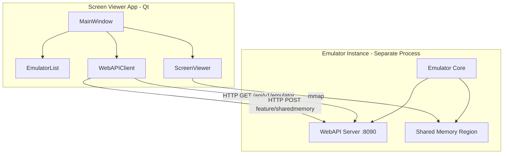
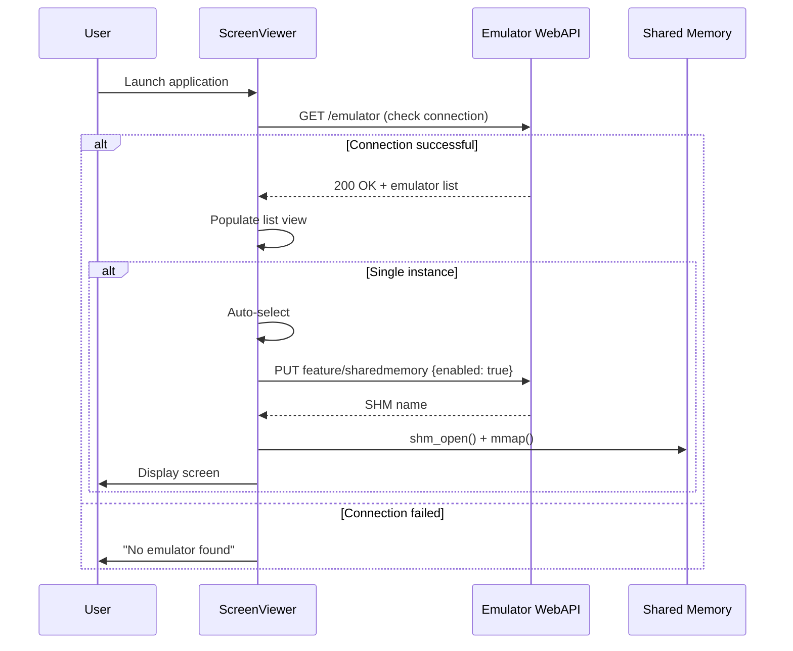
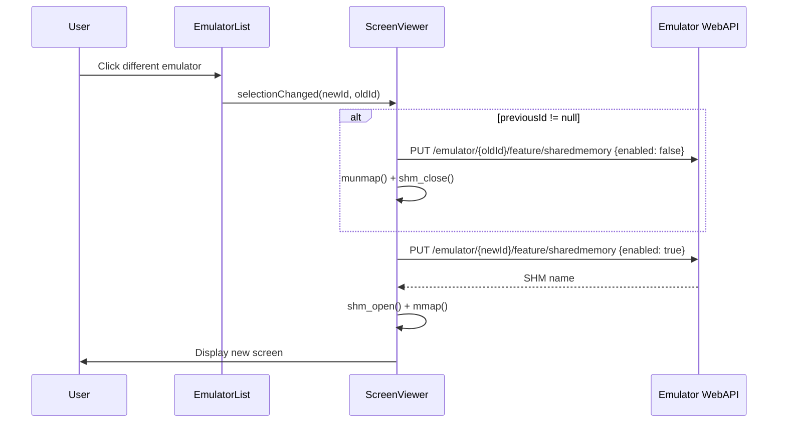

# Screen Viewer Application - Technical Design Document

## 1. Overview

### 1.1 Purpose
The **Screen Viewer** is a cross-platform, Qt6-based standalone verification utility for the Unreal-NG emulator. It provides a lightweight GUI to:
1. Discover running emulator instances via WebAPI.
2. Display the ZX Spectrum screen of a selected emulator using **shared memory IPC**.
3. Switch between main screen (RAM page 5) and shadow screen (RAM page 7) for 128K verification.
4. Support verification workflows without requiring the full emulator automation stack.

The shared memory IPC follows the convention established by the core emulator's `Memory` class (`core/src/emulator/memory/memory.cpp`), ensuring cross-platform compatibility (POSIX `shm_open` / Windows Named File Mapping).

> [!NOTE]
> **Shared memory IPC is OFF by default** on emulator instances. The screen-viewer enables it on-demand by calling `PUT /api/v1/emulator/{id}/feature/sharedmemory` with `{"enabled": true}` when an emulator is selected, and disables it when deselected.

> [!IMPORTANT]
> **This is an IPC-based external tool, NOT a linked component.** The screen-viewer runs as a **separate process** and communicates with the emulator via:
> - **WebAPI (HTTP REST)** — for discovery, control, and shared memory activation
> - **Shared Memory IPC (POSIX shm / Windows Named Memory)** — for zero-copy framebuffer access

### 1.2 Key Design Principles
| Principle | Rationale |
|:----------|:----------|
| **Separate Process** | The screen-viewer is a completely independent executable. It does NOT link emulator libraries. |
| **WebAPI for Control** | All emulator interaction (discovery, feature toggling) via HTTP REST calls to port 8090. |
| **Shared Memory IPC for Data** | Screen/memory data is read via POSIX `shm_open()` + `mmap()` for zero-copy, high-performance access. |
| **No Keyboard/Audio** | Purely observational—no input routing or audio binding. |
| **Minimal Dependencies** | Only Qt6 Widgets and standard networking. |

### 1.3 Relationship to `unreal-videowall`

> [!CAUTION]
> **Video wall and screen-viewer are architecturally different:**
> - `unreal-videowall` uses **direct integration** — it links `unrealng::automation` and owns emulator instances in-process.
> - `unreal-screen-viewer` uses **IPC** — it runs as a separate process and accesses emulator memory via shared memory.

| Aspect | `unreal-videowall` | `unreal-screen-viewer` |
|:-------|:-------------------|:-----------------------|
| **Architecture** | Direct integration (linked) | IPC-based (separate process) |
| **Emulator Instances** | Creates and owns instances | Discovers remote instances |
| **Automation** | Links `unrealng::automation` | No linkage (pure HTTP client) |
| **Memory Access** | Direct pointer access | Shared memory IPC |
| **Input Handling** | Routes keyboard events | None |
| **Audio** | Binds audio to selected tile | None |
| **Screen Pages** | Renders active framebuffer | Can switch RAM page 5/7 |

---

## 2. Architecture

### 2.1 High-Level Component Diagram



### 2.2 Core Components

#### 2.2.1 `WebAPIClient`
- **Purpose**: Encapsulates all HTTP communication with emulator WebAPI.
- **Key Methods**:
  - `fetchEmulatorList()` → Returns list of `{id, model, state, shm_name}`.
  - `enableSharedMemory(emulatorId)` → Enables `sharedmemory` feature via `PUT /feature/sharedmemory`.
  - `disableSharedMemory(emulatorId)` → Disables `sharedmemory` feature.
  - `checkConnection()` → Returns `true` if WebAPI responds on port 8090.

#### 2.2.2 `EmulatorList` (QListWidget or QTableView)
- **Purpose**: Displays discovered emulator instances.
- **Behavior**:
  - Polls `WebAPIClient::fetchEmulatorList()` periodically (every 2 seconds).
  - Shows columns: `ID (short)`, `Model`, `State`, `SharedMemory Active`.
  - Single-click selects an emulator; triggers screen binding.
  - Auto-selects if exactly one instance is discovered.

#### 2.2.3 `ScreenViewer` (QWidget)
- **Purpose**: Renders the emulator screen using shared memory.
- **Rendering**:
  - Uses POSIX `shm_open()` + `mmap()` (or Windows equivalent) to attach to the emulator's shared memory region.
  - Reads framebuffer at 50Hz (QTimer) and renders via `QPainter`.
  - Framebuffer format: RGBA8888, 352×288 with 256×192 active screen at offset (48, 48).
- **Lifecycle**:
  - On selection: Call `enableSharedMemory()` via WebAPI → attach to shm → start refresh timer.
  - On deselection: Stop timer → detach from shm → call `disableSharedMemory()` via WebAPI.

#### 2.2.4 `MainWindow`
- **Purpose**: Top-level window managing layout and coordination.
- **Layout**: Split view with list on left (collapsible) and screen on right.
- **Status Bar**: Connection status, selected emulator info.

### 2.3 Low-Fidelity UX Mockup

```
┌─────────────────────────────────────────────────────────────────────────────┐
│  Screen Viewer                                              [_] [□] [X]     │
├─────────────────────────────────────────────────────────────────────────────┤
│  File  Settings  Help                                         [⟳ Refresh]   │
├──────────────────────────┬──────────────────────────────────────────────────┤
│  Emulators               │                                                  │
│  ────────────────────────│  ┌───────────────────────────────────────────┐   │
│  ┌────────────────────┐  │  │▓▓▓▓▓▓▓▓▓▓▓▓▓▓▓▓▓▓▓▓▓▓▓▓▓▓▓▓▓▓▓▓▓▓▓▓▓▓▓▓▓▓││   |
│  │ ● pentagon512      │  │  │▓▓▓▓▓▓▓▓▓▓▓▓▓▓▓▓▓▓▓▓▓▓▓▓▓▓▓▓▓▓▓▓▓▓▓▓▓▓▓▓▓▓││   |
│  │   a1b2c3d4         │◀─│──│▓▓▓▓▓▓▓▓▓▓  ZX Spectrum Screen  ▓▓▓▓▓▓▓▓▓▓││   |
│  │   Running          │  │  │▓▓▓▓▓▓▓▓▓▓     (Click to toggle)▓▓▓▓▓▓▓▓▓▓││   |
│  └────────────────────┘  │  │▓▓▓▓▓▓▓▓▓▓▓▓▓▓▓▓▓▓▓▓▓▓▓▓▓▓▓▓▓▓▓▓▓▓▓▓▓▓▓▓▓▓││   |
│  ┌────────────────────┐  │  │▓▓▓▓▓▓▓▓▓▓▓▓▓▓▓▓▓▓▓▓▓▓▓▓▓▓▓▓▓▓▓▓▓▓▓▓▓▓▓▓▓▓││   |
│  │ ○ scorpion256      │  │  │▓▓▓▓▓▓▓▓▓▓▓▓▓▓▓▓▓▓▓▓▓▓▓▓▓▓▓▓▓▓▓▓▓▓▓▓▓▓▓▓▓▓││   |
│  │   f5e6d7c8         │  │  │▓▓▓▓▓▓▓▓▓▓▓▓▓▓▓▓▓▓▓▓▓▓▓▓▓▓▓▓▓▓▓▓▓▓▓▓▓▓▓▓▓▓││   |
│  │   Running          │  │  └─────────────────────────────[Page 5]──────┘   │
│  └────────────────────┘  │                                                  │
├──────────────────────────┴──────────────────────────────────────────────────┤
│  🟢 Connected to localhost:8090  │  Selected: pentagon512 (a1b2c3d4)        │
└─────────────────────────────────────────────────────────────────────────────┘

Legend:
  ● = Selected emulator (SHM active)
  ○ = Unselected emulator (SHM inactive)
  ▓ = ZX Spectrum display area (click to toggle Page 5 ↔ Page 7)
```

**UI Elements:**
| Element | Description |
|:--------|:------------|
| **Screen Display** | Click anywhere to toggle between Page 5 ↔ Page 7 |
| **Page Indicator** | Bottom-right corner shows current screen page |
| **Emulators List** | Left panel showing discovered emulator instances |
| **Status Bar** | Connection status and selected emulator info |
| **Settings Menu** | Configure WebAPI endpoint (host:port) |

---

## 3. WebAPI Endpoints Used

All calls target `http://localhost:8090/api/v1/...`

| Endpoint | Method | Purpose |
|:---------|:-------|:--------|
| `/emulator` | GET | List all running emulator instances |
| `/emulator/{id}` | GET | Get details for a specific emulator |
| `/emulator/{id}/feature/sharedmemory` | GET | Check if shared memory is enabled |
| `/emulator/{id}/feature/sharedmemory` | PUT | Enable/disable shared memory (`{"enabled": true}`) |

### 3.1 Example Response: List Emulators

```json
{
  "success": true,
  "emulators": [
    {
      "id": "a1b2c3d4-e5f6-7890-abcd-ef1234567890",
      "model": "pentagon512",
      "state": "running",
      "features": {
        "sharedmemory": false
      }
    }
  ],
  "count": 1
}
```

### 3.2 Shared Memory IPC Details

When `sharedmemory` feature is enabled, the emulator creates a POSIX shared memory region:
- **Name Format**: `/unreal-ng-{uuid}` (POSIX) or `Local\\unreal-ng-{uuid}` (Windows)
- **Size**: `(MAX_RAM_PAGES + MAX_CACHE_PAGES + MAX_MISC_PAGES + MAX_ROM_PAGES) * PAGE_SIZE`

#### Memory Layout in Shared Region
```
+-------------------+  Offset 0
|   RAM Pages       |  MAX_RAM_PAGES * 16KB = 4MB (256 pages × 16KB)
|   (Pages 0-255)   |
+-------------------+  Offset 0x400000
|   Cache Pages     |  MAX_CACHE_PAGES * 16KB
+-------------------+
|   Misc Pages      |  MAX_MISC_PAGES * 16KB
+-------------------+
|   ROM Pages       |  MAX_ROM_PAGES * 16KB
+-------------------+
```

#### Screen Memory Locations (128K)
| Screen | RAM Page | Offset in SHM | Size |
|:-------|:---------|:--------------|:-----|
| Main Screen (Page 5) | 5 | `5 * 0x4000 = 0x14000` | 6912 bytes |
| Shadow Screen (Page 7) | 7 | `7 * 0x4000 = 0x1C000` | 6912 bytes |

> [!IMPORTANT]
> The shared memory name must be retrieved via `Memory::GetMappedMemoryFilepath()` which is exposed via a WebAPI endpoint (to be added if not present).

---

## 4. User Workflow

### 4.1 Startup Flow



### 4.2 Selection Change Flow



### 4.3 Dual-Screen Switching (128K Mode)

For 128K Spectrum models, the viewer supports switching between two screen buffers:

| Screen | RAM Page | Memory Address | Description |
|:-------|:---------|:---------------|:------------|
| **Main Screen** | Page 5 | `$4000-$5AFF` | Primary display (default) |
| **Shadow Screen** | Page 7 | `$C000-$DAFF` | Secondary buffer (used for double-buffering) |

#### UI Controls
- **Click-to-Toggle**: Click anywhere on the screen display to cycle: Screen 5 → Screen 7 → Screen 5
- **Visual Indicator**: Overlay label showing current screen page (e.g., "Page 5" / "Page 7")

> [!TIP]
> Only the currently selected screen is fetched from shared memory to save performance. The inactive screen is not read.

#### Implementation

```cpp
enum class ScreenPage { Main = 5, Shadow = 7 };

class ScreenViewer : public QWidget {
    ScreenPage _currentPage = ScreenPage::Main;
    
    void mousePressEvent(QMouseEvent* event) override {
        // Toggle between screens on click
        _currentPage = (_currentPage == ScreenPage::Main) 
                       ? ScreenPage::Shadow 
                       : ScreenPage::Main;
        update();  // Trigger repaint with new screen
    }
    
    const uint8_t* getScreenData() const {
        // Only fetch the currently displayed screen
        // RAM page N is at offset: N * PAGE_SIZE (0x4000 = 16KB)
        size_t pageOffset = static_cast<size_t>(_currentPage) * 0x4000;
        return static_cast<const uint8_t*>(_shmData) + pageOffset;
    }
};
```

#### Screen Data Layout (ZX Spectrum)
Each screen buffer is 6912 bytes:
- **Bitmap**: 6144 bytes (`$4000-$57FF` for page 5)
- **Attributes**: 768 bytes (`$5800-$5AFF` for page 5)

> [!NOTE]
> The screen-viewer renders directly from RAM pages using copied rendering code from `core/video`. No timing synchronization with the emulator is required—this is an arbitrary point-in-time snapshot.

### 4.4 Dual Screen Mode

The viewer supports a **dual screen mode** that displays both Bank 5 and Bank 7 screens simultaneously.

#### View Modes

| Mode | Description | Aspect Ratio |
|:-----|:------------|:-------------|
| **Single** | One screen, click to toggle | 4:3 (256×192) |
| **Dual Horizontal** | Side-by-side (5 \| 7) | 8:3 (512×192) |
| **Dual Vertical** | Stacked (5 above 7) | 4:6 (256×384) |

#### Mode Toolbar UI

A compact toolbar at the bottom of the emulator list provides mode selection:

```
┌──────────────────────────┐
│ ○ abc123..               │
│   ZX 128K                │
│                          │
│ ● def456..               │
│   Pentagon               │
├──────────────────────────┤
│ [1▢] [▢▢]  ═ ║           │  ← Mode toolbar
├──────────────────────────┴────────────────────────────────┐
│ 🟢 Connected to localhost:8090         Selected: def456  │
└───────────────────────────────────────────────────────────┘
```

| Icon | Meaning | Behavior |
|:-----|:--------|:---------|
| `[1▢]` | Single screen | Radio toggle with `[▢▢]` |
| `[▢▢]` | Dual screen | Radio toggle with `[1▢]` |
| `═` | Horizontal layout | Only visible in dual mode |
| `║` | Vertical layout | Only visible in dual mode |

#### Dual Mode Mockup

```
Horizontal Layout (side-by-side):
┌────────────────┬────────────────┐
│    Bank 5      │    Bank 7      │
│                │                │
│    (Main)      │   (Shadow)     │
└────────────────┴────────────────┘

Vertical Layout (stacked):
┌────────────────┐
│    Bank 5      │
│    (Main)      │
├────────────────┤
│    Bank 7      │
│   (Shadow)     │
└────────────────┘
```

#### Behavior

| Aspect | Single Mode | Dual Mode |
|:-------|:------------|:----------|
| **Click on screen** | Toggles Bank 5 ↔ Bank 7 | No action |
| **Screen labels** | "Page 5" or "Page 7" | "Bank 5" and "Bank 7" |
| **Fetch strategy** | Only visible page | Both pages |
| **Persistence** | Remember last used mode via QSettings |

---

## 5. Implementation Plan

### Phase 1: Foundation (Day 1)
- [ ] Create project structure: `unreal-screen-viewer/`
- [ ] CMakeLists.txt with Qt6 Widgets and Network dependencies
- [ ] Basic `MainWindow` with placeholder layout

### Phase 2: WebAPI Client (Day 1-2)
- [ ] Implement `WebAPIClient` class using `QNetworkAccessManager`
- [ ] Implement `fetchEmulatorList()` with JSON parsing
- [ ] Implement `enableSharedMemory()` / `disableSharedMemory()`
- [ ] Connection status polling with retry logic

### Phase 3: Emulator List (Day 2)
- [ ] Implement `EmulatorList` widget with model-view pattern
- [ ] Selection handling with signals
- [ ] Auto-select logic for single instance
- [ ] Periodic refresh (every 2 seconds)

### Phase 4: Shared Memory Integration (Day 2-3)
- [ ] Implement cross-platform shared memory attachment helper
- [ ] Memory region size calculation from WebAPI response
- [ ] Safe attach/detach lifecycle

### Phase 5: Screen Rendering (Day 3)
- [ ] Implement `ScreenViewer` widget
- [ ] 50Hz refresh timer
- [ ] Direct RAM-to-QImage rendering (bitmap + attributes → RGBA)
- [ ] Screen page switching (RAM page 5/7 toggle)
- [ ] Tab key shortcut and toolbar toggle button

### Phase 6: Polish & Testing (Day 4)
- [ ] Error handling for connection failures
- [ ] Status bar with connection info
- [ ] Manual testing with running emulator
- [ ] Edge case: emulator exit during viewing

### Phase 7: Dual Screen Mode (Day 5)
- [ ] Add `ViewMode` and `DualLayout` enums to ScreenViewer
- [ ] Implement `ModeToolbar` widget with toggle buttons
- [ ] Modify `ScreenViewer::paintEvent()` for dual rendering
- [ ] Add screen labels ("Bank 5", "Bank 7") in dual mode
- [ ] Connect mode toolbar signals to ScreenViewer
- [ ] Persist mode/layout via QSettings
- [ ] Update CMakeLists.txt with new source files

---

## 6. Technical Details

### 6.1 Shared Memory Attachment (POSIX)

```cpp
#include <fcntl.h>
#include <sys/mman.h>
#include <unistd.h>

bool ScreenViewer::attachSharedMemory(const std::string& shmName, size_t size)
{
    _shmFd = shm_open(shmName.c_str(), O_RDONLY, 0);
    if (_shmFd < 0) {
        return false;
    }

    _shmData = mmap(nullptr, size, PROT_READ, MAP_SHARED, _shmFd, 0);
    close(_shmFd);  // fd can be closed after mmap
    _shmFd = -1;

    if (_shmData == MAP_FAILED) {
        _shmData = nullptr;
        return false;
    }

    _shmSize = size;
    return true;
}

void ScreenViewer::detachSharedMemory()
{
    if (_shmData != nullptr && _shmData != MAP_FAILED) {
        munmap(_shmData, _shmSize);
        _shmData = nullptr;
    }
}
```

### 6.2 Framebuffer Rendering

```cpp
QImage ScreenViewer::convertFramebuffer()
{
    if (!_shmData) {
        QImage placeholder(256, 192, QImage::Format_RGBA8888);
        placeholder.fill(Qt::black);
        return placeholder;
    }

    // Full framebuffer is 352x288 RGBA8888
    const int fbWidth = 352;
    const int fbHeight = 288;
    const int bytesPerPixel = 4;
    const int stride = fbWidth * bytesPerPixel;

    QImage image(static_cast<const uint8_t*>(_shmData), fbWidth, fbHeight, stride, QImage::Format_RGBA8888);
    
    // Extract central 256x192 region
    return image.copy(48, 48, 256, 192);
}
```

### 6.3 CMake Configuration

```cmake
cmake_minimum_required(VERSION 3.16)
project(unreal-screen-viewer LANGUAGES CXX)

set(CMAKE_CXX_STANDARD 17)
set(CMAKE_CXX_STANDARD_REQUIRED ON)
set(CMAKE_AUTOMOC ON)

# Find Qt6
find_package(Qt6 REQUIRED COMPONENTS Widgets Network)

# Source files
set(SOURCES
    src/main.cpp
    src/MainWindow.cpp
    src/WebAPIClient.cpp
    src/EmulatorList.cpp
    src/ScreenViewer.cpp
)

add_executable(${PROJECT_NAME} ${SOURCES})

target_link_libraries(${PROJECT_NAME} PRIVATE
    Qt6::Widgets
    Qt6::Network
)

# Platform-specific shared memory libraries
if(UNIX AND NOT APPLE)
    target_link_libraries(${PROJECT_NAME} PRIVATE rt)
endif()
```

---

## 7. WebAPI Enhancements Required

> [!WARNING]
> The following WebAPI enhancements may be needed for full functionality:

### 7.1 Shared Memory Name Endpoint
**Current Gap**: The WebAPI does not currently expose the shared memory region name.

**Proposed Endpoint**:
```
GET /api/v1/emulator/{id}/state/memory/shm
```

**Response**:
```json
{
  "success": true,
  "shared_memory": {
    "enabled": true,
    "name": "/unreal-ng-a1b2c3d4-e5f6-7890-abcd-ef1234567890",
    "size": 4718592,
    "layout": {
      "ram_offset": 0,
      "ram_size": 4194304,
      "cache_offset": 4194304,
      "cache_size": 262144,
      "rom_offset": 4456448,
      "rom_size": 262144
    }
  }
}
```

### 7.2 Feature Response Enhancement
**Current**: `PUT /feature/sharedmemory` returns success but not the shm name.

**Enhanced Response**:
```json
{
  "success": true,
  "feature": "sharedmemory",
  "enabled": true,
  "shm_name": "/unreal-ng-a1b2c3d4"
}
```

---

## 8. Design Decisions (Resolved)

| Question | Decision |
|:---------|:---------|
| **Port Configuration** | Configurable in Settings dialog (Menu → Settings). Default: `localhost:8090` |
| **Multi-Emulator Discovery** | Manual configuration only. No auto-discovery for v1. |
| **Connection Loss Handling** | Disable UI controls, show "Connection Lost" in status line, wait for reconnection. |
| **Screen Scaling** | Configurable scaling (1×, 2×, 3×, fit-to-window) plus free ratio-constrained resizing. Screen layer scales in realtime while maintaining aspect ratio during window resize (see `unreal-qt` for reference). Copy rendering code from `core/video` — do NOT link core. |
| **Rendering Approach** | **Raw RAM rendering only** (Option A). Decode bitmap+attributes directly from RAM pages. No ULA framebuffer access needed. |
| **Screen Switching** | Click-to-toggle on screen display area. Screen 5 (default) → click → Screen 7 → click → Screen 5. Only fetch the currently displayed screen to save performance. |
| **Timing/Sync** | None required. Capturing arbitrary point-in-time snapshots, no need to sync with emulator framerate. |

---

## 9. File Structure

```
unreal-screen-viewer/
├── CMakeLists.txt
├── README.md
└── src/
    ├── main.cpp
    ├── MainWindow.cpp
    ├── MainWindow.h
    ├── WebAPIClient.cpp
    ├── WebAPIClient.h
    ├── EmulatorList.cpp
    ├── EmulatorList.h
    ├── ScreenViewer.cpp
    ├── ScreenViewer.h
    └── SharedMemoryHelper.h    # Cross-platform shm abstraction
```

---

## 10. Acceptance Criteria

- [ ] Application builds and runs on macOS, Linux, and Windows
- [ ] Lists all emulator instances when WebAPI is available
- [ ] Shows "Unreal-NG cannot be discovered (not started?)" when WebAPI is unavailable
- [ ] Auto-selects single emulator instance
- [ ] Displays emulator screen correctly via shared memory IPC
- [ ] Properly enables/disables shared memory on selection changes
- [ ] Supports switching between RAM page 5 (main) and page 7 (shadow) screens
- [ ] Tab key toggles between screens
- [ ] Handles emulator disconnection gracefully
