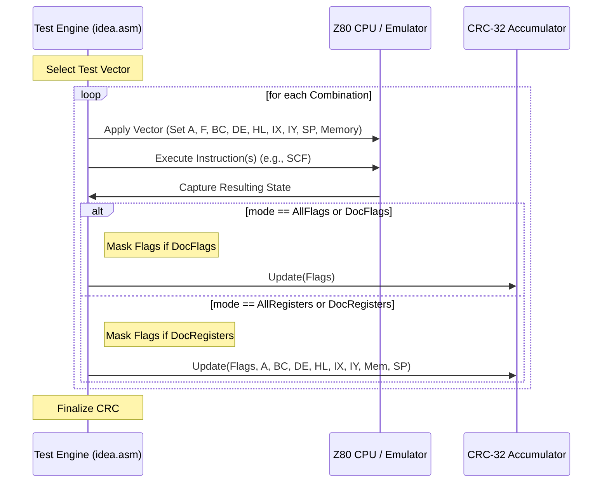

# Z80Test (v1.2a) Technical Analysis

This document provides a deep-dive into the methodology of the `z80test` suite, bridging the gap between its "cryptic" CRC-32 results and human-actionable debugging for Z80 emulators.

## 1. Core Philosophy: Combinatorial State Analysis

Unlike traditional unit tests that check one input and one output, `z80test` performs a **combinatorial sweep** of the Z80's state space. For each instruction (test vector), it identifies which registers/flags are likely affected and iterates through thousands of variations.

### The Anatomy of a Test Vector
Each of the 163 tests is defined as a "Vector" containing:
- **Opcode(s)**: The instruction(s) to execute.
- **Base State**: Initial register values (`A`, `F`, BC, DE, HL, IX, IY, SP).
- **Counter/Shifter**: Instructions on how to mutate the state across iterations.
- **Flags Mask**: Which bits of the `F` register are "documented" for this instruction.

### State Mutation (The Expansion)
The total iterations for a test are determined by nested loops:
1. **Counter Expansion**: For each register bit set in `counter`, it iterates $2^N$ times.
2. **Shifter Expansion**: A bitfield mutation that "sweeps" bits across registers.
3. **Data/Memory Expansion**: If memory is involved, it might loop through values.

**Example: `LD A, I`**
- Base `A=0xAA`, `F=0xFF`.
- Counter/Shifter mutations ensure we test various `I` register values and starting `F` values.
- Total iterations: ~2304.

---

## 2. Technical Execution Flow

The assembly engine ([idea.asm](testdata/z80/z80test-1.2a/src/idea.asm)) follows this sequence for EVERY iteration:

---

## 3. The "Cryptic" CRC-32 Algorithm

The reason diagnostics are hard is that Z80Test uses a **reflected CRC-32** without final XOR, accumulating bytes across thousands of executions.

**Key Technical Params:**
- **Polynomial**: `0xEDB88320` (Reflected)
- **Initialization**: `0xFFFFFFFF`
- **Output Reflected**: Yes
- **Final XOR**: `0x00000000` (None!)
- **Endianness**: Bytes are processed in natural order (Flags first).

### Mode Mapping
Z80Test computes 4 distinct CRCs per vector:
| Mode | What is CRC'd? | flags_mask applied? | Use Case |
| :--- | :--- | :--- | :--- |
| **AllFlags** | Only Register `F` | No | Strict Zilog Fidelity (XF/YF included) |
| **DocFlags** | Only Register `F` | **Yes** | Standard Specs (XF/YF ignored) |
| **AllRegisters** | `F`, `A`, BC, DE, HL, IX, IY, SP | No | Full Register Fidelity |
| **DocRegisters** | `F`, `A`, BC, DE, HL, IX, IY, SP | **Yes** | Standard Specs + Registers |

---

## 4. Back-Propagation: From CRC to Root Cause

When a CRC mismatch occurs, we use the following methodology to find the bug:

### Step 1: Recover the Expected Sequence
Since we don't have the "source" flags from a real Z80, we use [analyze_crc.py](core/tests/z80/z80test/analyze_crc.py) to:
1. Dump our emulator's flag sequence ($S_{emu}$) to a file.
2. Compare the cumulative CRC of $S_{emu}$ with the Reference CRC from `z80test`.
3. Perform a **Dictionary/Bruteforce Search** on failing iterations.

### Step 2: Identify Discrepancies
For a failing iteration $i$, we compare $F_{emu}$ vs $F_{real}$.
- **Scenario A (Single Bit)**: Emulator has `F=0x45`, Hardware has `F=0x4D`. Bit 3 (XF) is wrong.
- **Scenario B (Logic Error)**: Every iteration where bit 5 of the result should be set, it's cleared. This points to a logic flaw in the Opcode implementation.

### Step 3: Case Study - `SCF`
- **Emulator (Unreal-NG)**: Often computes XF/YF based on the result `A` or internal state.
- **Zilog Hardware**: Latch XF/YF from the internal data bus during specific cycles (Q register).
- **Z80Test Finding**: If AllFlags fail but DocFlags pass, the bug is strictly in the undocumented bits 3/5 logic (Q register persistence).

---

## 5. Concrete Test Examples (Selected from 163)

### The Setup Tests
- **CRC_TEST**: Verifies the CRC engine itself.
- **COUNTER_TEST**: Verifies the nested loop/expansion logic.

### Arithmetic/Logic (Documented Focus)
- **ADD A, N**: Verifies carry, half-carry, parity/overflow, and sign for every combination of `A` and immediate `N`.
- **DAA**: An exhaustive test of the Decimal Adjust Accumulator across all possible `A` and `F` states.

## 5. Comprehensive Test Categorization (163 Tests)

The 163 tests are broadly organized to cover the entire Z80 instruction set. Each test uses a specific `flags_mask` to determine which bits are "Documented" vs "Undocumented".

### Group 1: Infrastructure (Tests 0-3)
- **CRC TEST, COUNTER TEST, SHIFTER TEST, SELF TEST**: These verify the internal state machine of `z80test` itself. If these fail, the entire suite's results are untrustworthy.

### Group 2: Basic Flags & Special Operations (Tests 4-13)
- **SCF, CCF**: Carry flag manipulation.
- **DAA**: Exhaustive check of Decimal Adjust (the most complex 8-bit flag logic).
- **CPL, NEG**: Accumulator negation and complement.
- **NEC**, **ST**: Specific variants for NEC and ST clones (expected to fail on a standard Zilog).

### Group 3: 8-Bit Arithmetic & Logic (Tests 14-72)
- **ADD A, N / ADC A, N / SUB A, N / SBC A, N**: All variants of addition/subtraction.
- **AND, XOR, OR, CP**: Logical bitwise operations and comparison.
- **Expansion**: Every test covers combinations of registers (B, C, D, E, H, L, (HL), IX, IY).

### Group 4: 8-Bit Shifts & Rotates (Tests 73-82)
- **RLA, RRCA, RLD, RRD, etc.**: Standard rotates and the unique NIBBLE rotates (`RLD/RRD`).
- **Hidden Flags**: `RLD/RRD` are notorious for modifying hidden flags based on the resulting `A` register.

### Group 5: Block Operations (Tests 83-125)
- **LDI, LDD, LDIR, LDDR**: Block memory moves.
- **CPI, CPD, CPIR, CPDR**: Block memory compares.
- **INI, IND, INIR, INDR**: Block Input.
- **OUTI, OUTD, OTIR, OTDR**: Block Output.
- **Complexity**: These tests are the primary reason for `AllFlags` failures. They modify the hidden flags $XF/YF$ based on $(A + L)$ or $(A + L + Carry)$, and the $P/V$ bit reflects the [BC](file:///Volumes/TB4-4Tb/Projects/emulators/github/Zero-Emulator/Ziggy/Speccy/Z80.cs#1191-1206) counter.

### Group 6: Bit Manipulation (Tests 126-146)
- **BIT N, register**: Verifies bit testing. **CRITICAL**: The hidden flags XF/YF are copied from the internal register `Q` (or the opcode's high byte).
- **SET N, RES N**: Bit modification (usually doesn't affect flags, mask is often `0xff`).

### Group 7: 16-Bit Arithmetic (Tests 147-156)
- **ADD HL, RR / ADC HL, RR / SBC HL, RR**: 16-bit math.
- **Hidden Flags**: XF/YF reflect the high byte of the 16-bit result.

### Group 8: 16-Bit Loads & Stack (Tests 157-160)
- **LD RR, NN**, **LD (NN), RR**: 16-bit memory access.
- **PUSH/POP**: Stack operations.

### Group 9: System State (Tests 161-164)
- **LD A, I / LD A, R**: Captures `IFF2` (interrupt state) into the `P/V` flag.
- **EI, DI, IM N**: Interrupt mode and enable manipulation.

---

## 6. How to use this for Fixes

1. **Identify the Failure Category**: Is it a Block Op? A Bit test? A 16-bit Add?
2. **Determine the Mode**: If it fails in `AllFlags` but passes in `DocFlags`, you have an undocumented bit bug (bits 3 or 5).
3. **Dump and Analyze**:
   - Run: `./core-tests --gtest_filter="*TestName*"` to get the computed CRC.
   - Run: `python3 analyze_crc.py <dump> <expected>` to find the first failing iteration.
4. **Back-propagate**: Look at the "Expected Flags" vs "Got Flags".
   - If Bit 5 is different: Check your logic for the $YF$ flag.
   - If Bit 3 is different: Check your logic for the $XF$ flag.
   - Use the **Q-Register** formulas to fix the C++ implementation.
