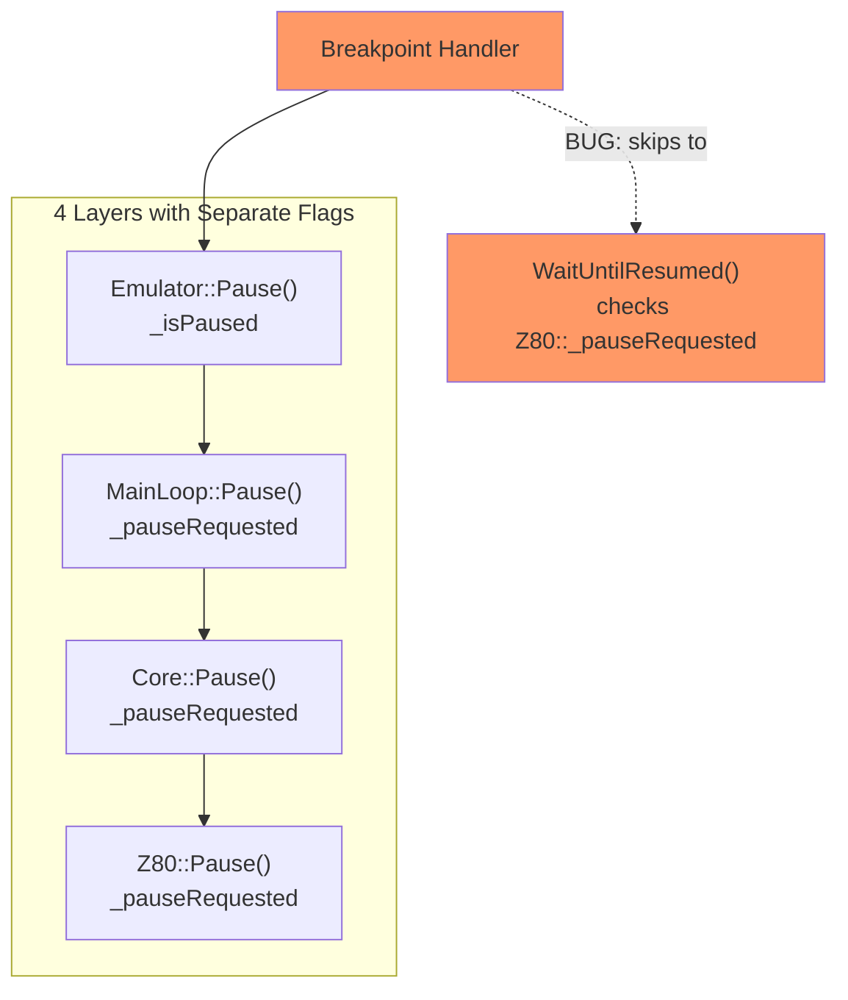
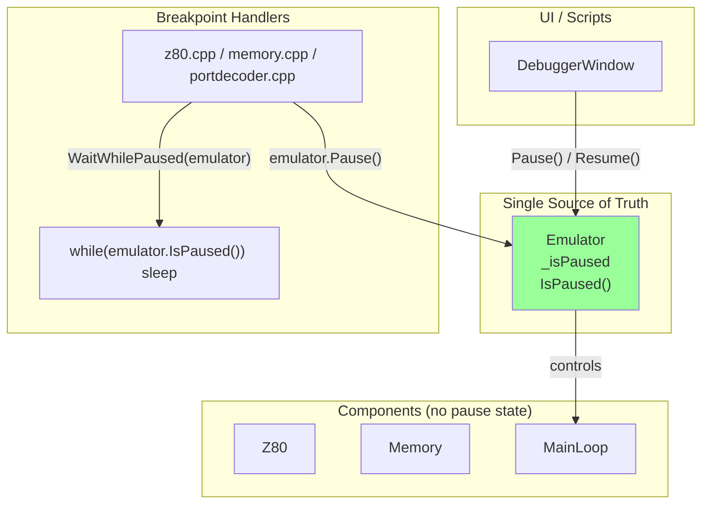

# Pause/Resume Methods Architecture Analysis

## Problem Statement

The current pause/resume mechanism is **inconsistent and buggy**:
- 4 classes with their own `_pauseRequested` flags (redundant)
- [WaitUntilResumed()](file:///Volumes/TB4-4Tb/Projects/Test/unreal-ng/core/src/emulator/cpu/z80.cpp#668-679) checks `Z80::_pauseRequested`, but `emulator.Pause()` doesn't set it directly
- Confusing semantics: which [Pause()](file:///Volumes/TB4-4Tb/Projects/Test/unreal-ng/core/src/emulator/cpu/core.cpp#443-449) to call when?

---

## Current Architecture (Problematic)



**Issues:**
- 4 separate `_pauseRequested` flags (redundant state)
- Breakpoints call `emulator.Pause()` but `Z80::_pauseRequested` not set yet
- Async chain race condition

---

## Target Architecture (Simplified)



**Key changes:**
1. **Single flag**: Only `Emulator::_isPaused` matters
2. **Remove Z80/Core/MainLoop flags**: They just query `Emulator::IsPaused()`
3. **WaitWhilePaused()**: Takes Emulator reference, loops on `emulator.IsPaused()`
4. **Clear ownership**: Emulator owns pause state, components query it

## Classes with Pause/Resume

| Class | Method | Sets Flag | Calls Down | Notes |
|-------|--------|-----------|------------|-------|
| **Emulator** | [Pause(broadcast)](file:///Volumes/TB4-4Tb/Projects/Test/unreal-ng/core/src/emulator/cpu/core.cpp#443-449) | `_isPaused` | `MainLoop::Pause()` | Broadcasts state change, does NOT set Z80 flag |
| **MainLoop** | [Pause()](file:///Volumes/TB4-4Tb/Projects/Test/unreal-ng/core/src/emulator/cpu/core.cpp#443-449) | `_pauseRequested` | `Core::Pause()` | Waits for confirm via CV |
| **Core** | [Pause()](file:///Volumes/TB4-4Tb/Projects/Test/unreal-ng/core/src/emulator/cpu/core.cpp#443-449) | `_pauseRequested` | `Z80::Pause()` | Simple delegation |
| **Z80** | [Pause()](file:///Volumes/TB4-4Tb/Projects/Test/unreal-ng/core/src/emulator/cpu/core.cpp#443-449) | `_pauseRequested` | - | Sets the flag that [WaitUntilResumed()](file:///Volumes/TB4-4Tb/Projects/Test/unreal-ng/core/src/emulator/cpu/z80.cpp#668-679) checks |
| **Z80** | [WaitUntilResumed()](file:///Volumes/TB4-4Tb/Projects/Test/unreal-ng/core/src/emulator/cpu/z80.cpp#668-679) | - | - | Spins while `_pauseRequested` is true |

## Current Breakpoint Pause Implementations

### 1. Z80.cpp (Execution Breakpoints) - **NOW FIXED**
```cpp
emulator.Pause();
Pause();  // Added to fix the bug
messageCenter.Post(NC_EXECUTION_BREAKPOINT, payload);
WaitUntilResumed();
```

### 2. PortDecoder.cpp (Port In/Out Breakpoints) - **BUG: Missing z80.Pause()**
```cpp
emulator.Pause();
// Missing: z80.Pause(); 
messageCenter.Post(NC_EXECUTION_BREAKPOINT, payload);
z80.WaitUntilResumed();  // Will NOT wait because _pauseRequested is false!
```

### 3. Memory.cpp (Read Breakpoints) - **BUG: Inline wait, no Pause()**
```cpp
emulator.Pause();
messageCenter.Post(NC_EXECUTION_BREAKPOINT, payload);
// Uses inline wait loop instead of WaitUntilResumed():
if (z80.IsPaused()) { while (z80.IsPaused()) { sleep_ms(20); } }
```

### 4. Memory.cpp (Write Breakpoints) - **BUG: Missing z80.Pause()**
```cpp
emulator.Pause();
messageCenter.Post(NC_EXECUTION_BREAKPOINT, payload);
z80.WaitUntilResumed();  // Will NOT wait!
```

## UI (DebuggerWindow) Usage

| Method | Calls | Purpose |
|--------|-------|---------|
| [pauseExecution()](file:///Volumes/TB4-4Tb/Projects/Test/unreal-ng/unreal-qt/src/debugger/debuggerwindow.cpp#778-794) | `_emulator->Pause()` | User clicks Pause button |
| [continueExecution()](file:///Volumes/TB4-4Tb/Projects/Test/unreal-ng/unreal-qt/src/debugger/debuggerwindow.cpp#757-777) | `_emulator->Resume()` | User clicks Continue button |
| [handleMessageBreakpointTriggered()](file:///Volumes/TB4-4Tb/Projects/Test/unreal-ng/unreal-qt/src/debugger/debuggerwindow.cpp#639-737) | `_emulator->Pause()` | Respond to interrupt breakpoint |

The UI only uses `Emulator::Pause/Resume`, which is correct for its level.

---

## Root Cause

The **semantic confusion** between layers:

1. **`Emulator::Pause()`** = "Tell the UI we're paused, tell MainLoop to stop running frames"
2. **`MainLoop::Pause()`** = "Stop the frame loop, tell Core to pause"
3. **`Core::Pause()`** = "Tell Z80 to pause"
4. **`Z80::Pause()`** = "Set the flag that [WaitUntilResumed()](file:///Volumes/TB4-4Tb/Projects/Test/unreal-ng/core/src/emulator/cpu/z80.cpp#668-679) checks"
5. **`Z80::WaitUntilResumed()`** = "Spin until `_pauseRequested` is false"

**The bug**: Code calling `emulator.Pause()` expected `Z80::_pauseRequested` to be set, but it's only set if `Z80::Pause()` is called directly.

---

## Proposed Refactoring

### Option A: Fix All Call Sites (Minimal Change)
Add `z80.Pause()` call to all breakpoint locations that call `emulator.Pause()` + [WaitUntilResumed()](file:///Volumes/TB4-4Tb/Projects/Test/unreal-ng/core/src/emulator/cpu/z80.cpp#668-679).

**Files to fix:**
- [x] `z80.cpp:198` - Fixed
- [ ] `portdecoder.cpp:110` - Add `z80.Pause();`
- [ ] `portdecoder.cpp:156` - Add `z80.Pause();`
- [ ] `memory.cpp:205` - Add `z80.Pause();`
- [ ] `memory.cpp:283` - Add `z80.Pause();`

### Option B: Make `Emulator::Pause()` Also Set Z80 Flag (Systemic Fix)
Modify `Emulator::Pause()` to call through to `Z80::Pause()` via the chain.

**Issue:** `Emulator::Pause()` already calls `MainLoop::Pause()` which calls `Core::Pause()` which calls `Z80::Pause()`. The problem is that the **call chain is broken** - let's verify.

### Investigation Needed

Looking at `MainLoop::Pause()`:
```cpp
void MainLoop::Pause()
{
    _pauseRequested = true;
    _cpu->Pause();  // This IS called, should set Z80::_pauseRequested
    // ...
}
```

And `Core::Pause()`:
```cpp
void Core::Pause()
{
    _pauseRequested = true;
    _z80->Pause();  // This IS called
}
```

And `Z80::Pause()`:
```cpp
void Z80::Pause()
{
    _pauseRequested = true;  // This SHOULD be set
}
```

**Wait - the chain SHOULD work!** Let me check if `_cpu` in MainLoop is valid, or if `_z80` in Core is valid...

Actually, the issue is that **the chain IS working for frame-based pause**, but when breakpoints call `emulator.Pause()` and then immediately call [WaitUntilResumed()](file:///Volumes/TB4-4Tb/Projects/Test/unreal-ng/core/src/emulator/cpu/z80.cpp#668-679), there's a **race condition** - the async chain hasn't completed yet!

The breakpoint code does:
```cpp
emulator.Pause();        // Starts async chain: MainLoop->Core->Z80::Pause()
WaitUntilResumed();      // Immediately checks _pauseRequested which may still be false!
```

### Option C: Synchronous Z80 Pause for Breakpoints (Best Fix)

For breakpoint handling, we need **synchronous** pause, not async. The breakpoint code should:
1. Call `z80.Pause()` directly (synchronous, immediate)
2. Post notification
3. Call [WaitUntilResumed()](file:///Volumes/TB4-4Tb/Projects/Test/unreal-ng/core/src/emulator/cpu/z80.cpp#668-679)

`emulator.Pause()` is still useful for UI/frame-level pause but is **not the right tool** for breakpoint pausing.

---

## Recommended Changes

### Fix 1: All Breakpoint Locations Should Call Z80::Pause() Directly

#### [MODIFY] [z80.cpp](file:///Volumes/TB4-4Tb/Projects/Test/unreal-ng/core/src/emulator/cpu/z80.cpp)
Already fixed - calls [Pause()](file:///Volumes/TB4-4Tb/Projects/Test/unreal-ng/core/src/emulator/cpu/core.cpp#443-449) before [WaitUntilResumed()](file:///Volumes/TB4-4Tb/Projects/Test/unreal-ng/core/src/emulator/cpu/z80.cpp#668-679).

#### [MODIFY] [portdecoder.cpp](file:///Volumes/TB4-4Tb/Projects/Test/unreal-ng/core/src/emulator/ports/portdecoder.cpp)
Add `z80.Pause();` after `emulator.Pause();` in both Port In and Port Out breakpoint handlers.

#### [MODIFY] [memory.cpp](file:///Volumes/TB4-4Tb/Projects/Test/unreal-ng/core/src/emulator/memory/memory.cpp)
Add `z80.Pause();` after `emulator.Pause();` in both Read and Write breakpoint handlers.

### Fix 2: Update Comments to Clarify Semantics
The existing comments say "Emulator.Pause() is needed, not Z80.Pause()" - this is **wrong/misleading**. Both are needed for different purposes.

### Fix 3: Consider Deprecating Direct `emulator.Pause()` in Breakpoint Handlers
Since breakpoints need synchronous pause, consider creating a helper method:
```cpp
void BreakpointManager::PauseForBreakpoint(Emulator& emulator, Z80& z80)
{
    emulator.Pause();
    z80.Pause();
}
```

---

## Verification Plan

1. After applying fixes, run [breakpoints_test.cpp](file:///Volumes/TB4-4Tb/Projects/Test/unreal-ng/core/tests/debugger/breakpoints_test.cpp) tests
2. Run FORMAT integration test to verify execution breakpoints work
3. Manual test: Set port breakpoint, verify it pauses
4. Manual test: Set memory read/write breakpoint, verify it pauses
