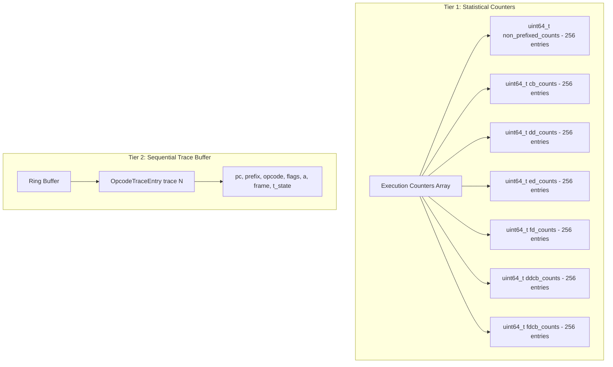

# Z80 Opcode Counters Design

Design proposal for tracking Z80 opcode execution statistics and crash forensics.

## Background

Some opcodes fail z80test or cause software crashes, likely due to incorrect flags or unexpected values. We need:
1. **Statistical data**: How many times each opcode was executed
2. **Sequential trace**: What instructions led to a crash point

## Existing Infrastructure Analysis

### CallTraceBuffer (`calltrace.h/cpp`)
- **Hot/Cold buffer segmentation** with LRU eviction
- Tracks control flow events (JP, JR, CALL, RET, RST, DJNZ) only
- Stores: `m1_pc`, `target_addr`, `opcode_bytes`, `flags`, bank mapping, stack state
- **Loop compression**: Repeated events increment `loop_count` instead of adding entries

### MemoryAccessTracker (`memoryaccesstracker.h/cpp`)
- **64KB Z80 address space counters**: `_z80ExecuteCounters[65536]`
- **Physical page counters**: tracks per-page execution
- Feature-gated via `_feature_memorytracking_enabled`
- Hook point: [TrackMemoryExecute()](core/src/emulator/memory/memoryaccesstracker.cpp#534-623) called from `Memory::MemoryRead()` during M1 cycle

### Z80::Z80Step ([z80.cpp](core/src/emulator/cpu/z80.cpp))
- Opcode fetched at line 278: `cpu.opcode = m1_cycle()`
- Opcode dispatched via: [(normal_opcode[opcode])(&cpu)](core/src/emulator/cpu/z80.cpp#404-414) (line 281)
- Prefix handling stores in `cpu.prefix`

---

## Proposed Design: `OpcodeProfiler`

### Two-Tier Architecture



### Data Structures

```cpp
// Core opcode key (supports all Z80 prefix combinations)
struct OpcodeKey {
    uint16_t prefix;      // 0x0000, 0xCB, 0xDD, 0xED, 0xFD, 0xDDCB, 0xFDCB
    uint8_t opcode;       // Main opcode byte
    
    // Unique index for counter arrays (0-1791 range)
    uint16_t toIndex() const;
};

// Sequential trace entry (compact: 16 bytes)
struct OpcodeTraceEntry {
    uint16_t pc;          // PC where opcode executed
    uint16_t prefix;      // Prefix bytes (0 = none)
    uint8_t opcode;       // Opcode byte
    uint8_t flags;        // F register at execution
    uint8_t a;            // A register at execution
    uint8_t reserved;     // Alignment
    uint32_t frame;       // Frame number
    uint32_t t_state;     // T-state within frame
};

// Main profiler class
class OpcodeProfiler {
public:
    // --- Statistical Counters (Tier 1) ---
    void IncrementCounter(uint16_t prefix, uint8_t opcode);
    uint64_t GetCount(uint16_t prefix, uint8_t opcode) const;
    uint64_t GetTotalExecutions() const;
    
    // Get opcodes sorted by execution count (for reports)
    std::vector<std::pair<OpcodeKey, uint64_t>> GetTopOpcodes(size_t limit = 50) const;
    
    // --- Sequential Trace (Tier 2) ---
    void LogTrace(uint16_t pc, uint16_t prefix, uint8_t opcode, 
                  uint8_t flags, uint8_t a, uint32_t frame, uint32_t t_state);
    
    // Get last N entries (newest first, for crash forensics)
    std::vector<OpcodeTraceEntry> GetRecentTrace(size_t count = 100) const;
    
    // Get trace around specific PC (useful for loop detection)
    std::vector<OpcodeTraceEntry> GetTraceAroundPC(uint16_t pc, size_t before = 20, size_t after = 5) const;
    
    // --- Control ---
    void Reset();
    void Enable(bool enableCounters, bool enableTrace);
    bool SaveToFile(const std::string& path) const;
    
private:
    // Tier 1: Counters (lightweight, always-on option)
    static constexpr size_t COUNTER_TABLE_SIZE = 1792;  // 256 + 4*256 + 2*256
    std::array<std::atomic<uint64_t>, COUNTER_TABLE_SIZE> _counters{};
    
    // Tier 2: Ring buffer (heavier, configurable size)
    static constexpr size_t DEFAULT_TRACE_SIZE = 10'000;
    std::vector<OpcodeTraceEntry> _traceBuffer;
    std::atomic<size_t> _traceHead{0};
    size_t _traceCapacity = DEFAULT_TRACE_SIZE;
    
    // Feature gates
    bool _countersEnabled = false;
    bool _traceEnabled = false;
    
    mutable std::mutex _mutex;
};
```

### Integration Hook Points

**Option A: In Z80Step (Recommended)**
```cpp
// z80.cpp, in Z80::Z80Step(), after line 281
void Z80::Z80Step(bool skipBreakpoints) {
    // ... existing code ...
    cpu.opcode = m1_cycle();
    (normal_opcode[opcode])(&cpu);
    
    // NEW: Opcode profiling hook
    if (_opcodeProfiler && _opcodeProfiler->IsEnabled()) {
        _opcodeProfiler->LogExecution(m1_pc, prefix, opcode, f, a, 
                                       _context->emulatorState.frame_counter, t);
    }
}
```

**Option B: In MemoryAccessTracker::TrackMemoryExecute**
- Already receives PC and has access to memory to read opcode
- Would require passing prefix information through

### Opcode Index Scheme

| Prefix    | Index Range   | Count |
|-----------|---------------|-------|
| None      | 0-255         | 256   |
| CB        | 256-511       | 256   |
| DD        | 512-767       | 256   |
| ED        | 768-1023      | 256   |
| FD        | 1024-1279     | 256   |
| DDCB      | 1280-1535     | 256   |
| FDCB      | 1536-1791     | 256   |
| **Total** |               | 1792  |

### Output Formats

**Statistical Report (YAML)**
```yaml
opcode_profile:
  total_executions: 15234567
  sample_duration_frames: 1200
  top_opcodes:
    - opcode: "LD A,(HL)"    # 0x7E
      count: 2156789
      percentage: 14.15%
    - opcode: "JP NZ,nn"     # 0xC2
      count: 1023456
      percentage: 6.72%
  by_prefix:
    none: 12000000
    CB: 1500000
    DD: 800000
    ED: 400000
    FD: 300000
    DDCB: 20000
    FDCB: 14567
```

**Sequential Trace (for crash forensics)**
```yaml
trace:
  - idx: -5
    pc: 0x1234
    opcode: "LD A,B"      # 0x78
    flags: S_Z__H_N_
    a: 0x42
  - idx: -4
    pc: 0x1235
    opcode: "ADD A,C"     # 0x81
    flags: ____H_NC
    a: 0x57
  - idx: -3
    pc: 0x1236
    opcode: "CP (HL)"     # 0xBE
    flags: S___H_NC      # <-- suspicious flags?
    a: 0x57
  # ... crash here
```

### Performance Considerations

| Feature | Memory | CPU Impact |
|---------|--------|------------|
| Counters only | ~14KB (1792 × 8 bytes) | ~3-5 cycles per instruction |
| Trace (10K) | ~160KB (10K × 16 bytes) | ~10-15 cycles per instruction |
| Full (both) | ~174KB | ~12-18 cycles per instruction |

### Feature Gating

Single feature toggle, matching existing `calltrace` and `memorytracking` patterns:

```ini
[Features]
OPCODE_PROFILER=true
```

When enabled:
- Both statistical counters (Tier 1) and sequential trace (Tier 2) are active
- Trace buffer uses fixed 10,000 entries (~160KB)
- No separate sub-feature toggles

---

## Session Control API

### Core Methods

| Method | Description |
|--------|-------------|
| `Start()` | Begin capture session, clear previous data |
| `Stop()` | Stop capturing, data remains accessible |
| `Clear()` | Reset all counters and trace buffer |
| `IsCapturing()` | Check if currently capturing |

### Data Retrieval Methods

| Method | Returns |
|--------|---------|
| `GetOpcodeCounters()` | Full 1792-entry counter array |
| `GetTopOpcodes(limit)` | Top N opcodes by execution count |
| `GetRecentTrace(count)` | Last N trace entries (newest first) |
| `GetByPrefix(prefix)` | Counters for specific prefix group |
| `GetTotalExecutions()` | Sum of all opcode executions |

---

## Automation Module Exposure

### WebAPI (JSON)

**Endpoints:**

| Method | Path | Description |
|--------|------|-------------|
| POST | `/api/v1/emulator/{id}/profiler/opcode/start` | Start capture session |
| POST | `/api/v1/emulator/{id}/profiler/opcode/stop` | Stop capture session |
| POST | `/api/v1/emulator/{id}/profiler/opcode/clear` | Clear accumulated data |
| GET | `/api/v1/emulator/{id}/profiler/opcode/status` | Get capture status |
| GET | `/api/v1/emulator/{id}/profiler/opcode/counters` | Get opcode counters |
| GET | `/api/v1/emulator/{id}/profiler/opcode/trace?count=100` | Get recent trace |

**Response Schema (counters):**
```json
{
  "capturing": true,
  "totalExecutions": 15234567,
  "counters": {
    "none": [{"opcode": 126, "mnemonic": "LD A,(HL)", "count": 2156789}, ...],
    "cb": [...], "dd": [...], "ed": [...], "fd": [...], "ddcb": [...], "fdcb": [...]
  }
}
```

**Response Schema (trace):**
```json
{
  "entries": [
    {"pc": 4660, "prefix": 0, "opcode": 120, "mnemonic": "LD A,B", "flags": 68, "a": 66, "frame": 1200, "tState": 45000},
    ...
  ]
}
```

### CLI (Formatted Text)

| Command | Description |
|---------|-------------|
| `profiler opcode start` | Start capture session |
| `profiler opcode stop` | Stop capture session |
| `profiler opcode clear` | Clear data |
| `profiler opcode status` | Show capture status |
| `profiler opcode counters [limit]` | Show top N opcodes |
| `profiler opcode trace [count]` | Show recent trace |
| `profiler opcode save <file>` | Export to YAML file |

**CLI Output (counters):**
```
Opcode Profile (capturing: YES, total: 15,234,567)
┌──────────────────┬───────────┬─────────┐
│ Opcode           │ Count     │ %       │
├──────────────────┼───────────┼─────────┤
│ LD A,(HL)   7E   │ 2,156,789 │ 14.15%  │
│ JP NZ,nn    C2   │ 1,023,456 │  6.72%  │
│ LD (HL),A   77   │   890,123 │  5.84%  │
└──────────────────┴───────────┴─────────┘
```

### Python Bindings

```python
# Session control
emu.profiler.opcode.start()
emu.profiler.opcode.stop()
emu.profiler.opcode.clear()
is_active = emu.profiler.opcode.capturing

# Data retrieval
counters = emu.profiler.opcode.counters  # dict[str, list[OpcodeCount]]
top_20 = emu.profiler.opcode.get_top(20)  # list[OpcodeCount]
trace = emu.profiler.opcode.get_trace(100)  # list[TraceEntry]
total = emu.profiler.opcode.total_executions  # int

# Data classes
class OpcodeCount:
    prefix: int      # 0, 0xCB, 0xDD, 0xED, 0xFD, 0xDDCB, 0xFDCB
    opcode: int      # 0-255
    mnemonic: str    # "LD A,(HL)"
    count: int       # execution count

class TraceEntry:
    pc: int
    prefix: int
    opcode: int
    mnemonic: str
    flags: int
    a: int
    frame: int
    t_state: int
```

### Lua Bindings

```lua
-- Session control
emu.profiler.opcode:start()
emu.profiler.opcode:stop()
emu.profiler.opcode:clear()
local is_active = emu.profiler.opcode:is_capturing()

-- Data retrieval
local counters = emu.profiler.opcode:get_counters()  -- table
local top_20 = emu.profiler.opcode:get_top(20)  -- array of {prefix, opcode, mnemonic, count}
local trace = emu.profiler.opcode:get_trace(100)  -- array of trace entries
local total = emu.profiler.opcode:get_total()  -- number
```

---

## Data Models

### OpcodeCounter

| Field | Type | Description |
|-------|------|-------------|
| prefix | uint16 | Prefix code (0=none, 0xCB, 0xDD, 0xED, 0xFD, 0xDDCB, 0xFDCB) |
| opcode | uint8 | Opcode byte (0-255) |
| mnemonic | string | Human-readable mnemonic |
| count | uint64 | Execution count |

### TraceEntry

| Field | Type | Description |
|-------|------|-------------|
| pc | uint16 | Program counter |
| prefix | uint16 | Prefix code |
| opcode | uint8 | Opcode byte |
| mnemonic | string | Human-readable mnemonic |
| flags | uint8 | F register value |
| a | uint8 | A register value |
| frame | uint32 | Frame number |
| tState | uint32 | T-state within frame |

### ProfilerStatus

| Field | Type | Description |
|-------|------|-------------|
| capturing | bool | Currently capturing |
| totalExecutions | uint64 | Total opcode executions |
| traceSize | uint32 | Current trace buffer entries |
| traceCapacity | uint32 | Maximum trace buffer capacity |

---

## File Changes Summary

### [NEW] `core/src/emulator/cpu/opcode_profiler.h`
OpcodeProfiler class with counter arrays and trace ring buffer.

### [NEW] `core/src/emulator/cpu/opcode_profiler.cpp`
Implementation of counting, tracing, and report generation.

### [MODIFY] `core/src/emulator/cpu/z80.h`
Add `OpcodeProfiler*` and accessor `GetOpcodeProfiler()`.

### [MODIFY] `core/src/emulator/cpu/z80.cpp`
Hook profiler in `Z80Step()` after opcode dispatch.

### [MODIFY] `core/src/base/featuremanager.*`
Add single `OPCODE_PROFILER` feature flag.

### [MODIFY] `core/automation/webapi/`
Add profiler endpoints.

### [MODIFY] `core/automation/cli/`
Add `profiler opcode` commands.

### [MODIFY] `core/automation/python/`
Add `emu.profiler.opcode` bindings.

### [MODIFY] `core/automation/lua/`
Add `emu.profiler.opcode` bindings.

### [MODIFY] `docs/emulator/design/control-interfaces/command-interface.md`
Add Opcode Profiler section documenting commands and API.

---

## Verification Plan

### Automated Tests

1. **Counter indexing test** - verify `OpcodeKey::toIndex()` for all prefixes
2. **Ring buffer test** - verify FIFO eviction and retrieval order
3. **WebAPI test** - start/stop/counters/trace endpoint validation
4. **Python binding test** - data class validation
5. **Lua binding test** - table structure validation

### Manual Verification

1. Run z80test with profiler, export and inspect counters
2. Trigger known crash, analyze trace for suspicious flags

---

## Implementation Status

**Status: IMPLEMENTED ✓** (2026-01-27)

### Core Implementation

| Component | Status | Notes |
|-----------|--------|-------|
| `opcode_profiler.h/cpp` | ✓ Complete | Tier 1 counters + Tier 2 trace buffer |
| Feature flag `OPCODE_PROFILER` | ✓ Complete | Added to FeatureManager |
| Z80 integration | ✓ Complete | Hook in `Z80Step()` after opcode dispatch |
| Unit tests | ✓ Complete | `opcode_profiler_test.cpp` passing |

### Automation Interfaces

| Interface | Status | Notes |
|-----------|--------|-------|
| WebAPI | ✓ Complete | 4 endpoints: session, status, counters, trace |
| CLI | ◐ Partial | Basic commands implemented |
| Python capture script | ✓ Complete | WebAPI-based YAML output |
| Python bindings | ✓ Complete | 6 methods: start, stop, clear, status, counters, trace |
| Lua bindings | ✓ Complete | 6 methods: start, stop, clear, status, counters, trace |

### WebAPI Endpoints (Implemented)

| Method | Path | Status |
|--------|------|--------|
| POST | `/api/v1/emulator/{id}/profiler/opcode/session` | ✓ `{action: start\|stop\|clear}` |
| GET | `/api/v1/emulator/{id}/profiler/opcode/status` | ✓ |
| GET | `/api/v1/emulator/{id}/profiler/opcode/counters?limit=N` | ✓ |
| GET | `/api/v1/emulator/{id}/profiler/opcode/trace?count=N` | ✓ |

### Verification Results

**Test Run:** 2026-01-27 21:20 (11.9 second session)

```yaml
total_executions: 3,579,771
trace_buffer: 10,000/10,000 (full)
unique_opcodes: 68
```

**Top Opcodes Captured:**
| Opcode | Prefix | Count | Instruction |
|--------|--------|-------|-------------|
| 0x40 | none | 1,741,694 | LD B,B (timing loop) |
| 0x6E | CB | 1,735,603 | BIT 5,(HL) |
| 0xE6 | none | 6,394 | AND n |
| 0x20 | none | 5,662 | JR NZ,e |
| 0x78 | ED | 5,496 | IN A,(C) |

### Files Created/Modified

| File | Change |
|------|--------|
| `core/src/emulator/cpu/opcode_profiler.h` | [NEW] OpcodeProfiler class |
| `core/src/emulator/cpu/opcode_profiler.cpp` | [NEW] Implementation |
| `core/src/emulator/cpu/z80.h` | [MODIFY] Added profiler pointer |
| `core/src/emulator/cpu/z80.cpp` | [MODIFY] Hook + feature cache |
| `core/src/base/featuremanager.h` | [MODIFY] Added kOpcodeProfiler |
| `core/automation/webapi/src/emulator_api.h` | [MODIFY] Routes + methods |
| `core/automation/webapi/src/api/profiler_api.cpp` | [NEW] WebAPI endpoints |
| `core/automation/webapi/src/openapi_spec.cpp` | [MODIFY] OpenAPI spec |
| `core/tests/emulator/cpu/opcode_profiler_test.cpp` | [NEW] Unit tests |
| `tools/verification/debugger/capture_opcode_session.py` | [NEW] Python capture script |
| `core/automation/python/src/emulator/python_emulator.h` | [MODIFY] Added 6 profiler bindings |
| `core/automation/lua/src/emulator/lua_emulator.h` | [MODIFY] Added 6 profiler bindings |
